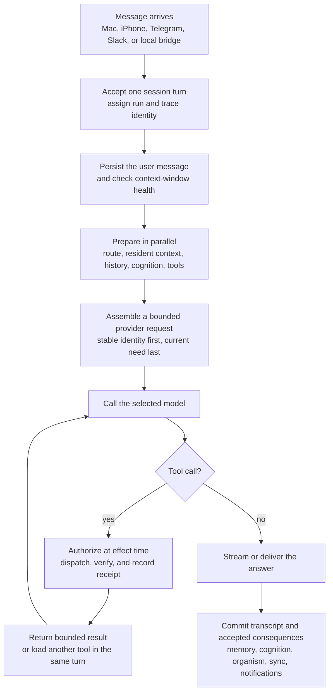
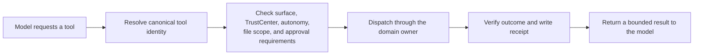

# Anatomy of a NativeAgent Turn

NativeAgent is designed so the model is not asked to reconstruct the agent,
rediscover its capabilities, or reread its whole history every time someone
sends a message. The Swift runtime prepares a small, relevant working set,
keeps the reusable parts warm, calls the user-selected model, and then carries
any requested actions through the same trust and receipt boundaries.

This document follows an ordinary turn made by any agent configured in
NativeAgent. The name, persona, memories, provider, permissions, workspace,
skills, and connected services belong to that installation. Nothing in the
turn architecture depends on the maintainer's personal agent or data.

## Human summary

**Message → fast in-RAM selection (“resident context”) → compact model packet → LLM call**

### What “resident context” means

Before you send a message, NativeAgent has already prepared the agent’s working
context in a bounded RAM arena. That includes:

- **Persona:** The required identity, voice, relationship, and behavior
  documents.
- **Relevant knowledge:** Compiled projections from MemoryV2, corrections,
  skills, projects, Desk, and other enabled sources.
- **Selection index:** A fast in-memory map used to find which pieces matter for
  this particular message.
- **Live inner state:** When Subconscious is enabled, the current cognition and
  organism state can be distilled into a small private capsule that helps the
  agent carry its felt state and continuity into the turn.
- **Capability map:** Which tools, skills, connectors, and providers exist,
  which are ready, and which are permitted.

When your message arrives, the CPU searches that resident index and selects a
small, relevant packet. That packet can include:

- Up to **12 dynamically selected context atoms**, plus mandatory identity and
  correction material.
- Up to **8 expandable pointers** to deeper context that remains lazy.
- Up to **3 relevant tool groups** preloaded before the first LLM call.
- The small always-available tool set and compact capability map.

Those context atoms may represent memories, corrections, skills, project
knowledge, Desk state, or other relevant information. A turn may select five
memories or hints, but five is not a fixed limit.

NativeAgent does not reopen dozens of files, reparse Markdown, scan entire
databases, or rebuild the agent’s identity on every turn. The selected
generation is held steady through the complete model and tool loop.

NativeAgent still reads a bounded portion of the current conversation
transcript, while full files, skill bodies, websites, GitHub data, and other
large payloads remain lazy until needed.

The speedup comes from doing the expensive compilation and indexing before the
message arrives. The old separate memory-recall step took approximately
**135–175 ms**. It is now skipped, with relevant memories selected inside the
resident **4–15 ms** pass. Complete context preparation generally takes around
**24–49 ms**, compared with approximately **144–188 ms** before the resident
system.

**The model call is the slowest part of the turn.**

## The complete turn



The large box in most latency traces is the provider call. NativeAgent's side
is mostly bounded local work: selecting already-compiled context, reading a
small history projection, filtering schemas, checking policy, and writing
durable records.

## Before the message arrives

Some of the most important work happens outside the user's critical path.

NativeAgent continuously turns canonical local sources into rebuildable
working state:

- Persona documents define the agent's identity, voice, and durable behavioral
  guidance.
- MemoryV2 owns long-term facts, preferences, corrections, proposals, and the
  knowledge graph.
- Fluid Context compiles eligible persona, memory, skill, cognition, Desk, and
  project material into immutable SQLite generations.
- A bounded `ContextArena` keeps the current generation's hot and warm entries,
  lexical selection index, and required-document mirrors resident in memory.
- The cognitive substrate and Organism Kernel maintain bounded advisory state
  when the user has enabled them.
- The tool runtime knows the installed catalog, readiness, policy classes, and
  the small always-on tool set. Full schemas for inactive groups do not need to
  occupy every prompt.

Canonical truth remains in its owning files and databases. The arena is a fast,
rebuildable circulation layer—not a second memory or identity store.

## 1. A surface admits the turn

A message may begin in Mac chat, a detached window, the iPhone companion,
Telegram, Slack, or an authenticated local bridge. The surface adapter verifies
its own transport identity and hands the request to the shared chat
orchestration path.

NativeAgent then:

1. resolves the exact conversation session;
2. assigns one run identity and one trace identity;
3. accepts the turn through that session's ordering and cancellation boundary;
4. preserves attachments and the originating surface identity; and
5. reads the selected provider, model, reasoning effort, and capability tuple
   from the canonical routing owner.

Surface identity is not decoration. It participates in tool visibility,
permissions, approvals, and delivery. Telegram and Slack do not silently gain
the authority of a local Mac turn, and the iPhone does not bypass signed-action
verification.

## 2. The user message becomes durable

After acceptance, the user message is written to the canonical transcript
unless the caller is resuming a turn that was already durably enqueued. This
gives the system an honest record even if context assembly or the provider later
fails.

Before building the request, NativeAgent checks the selected model's verified
context window. If the session has reached its compaction threshold, the
canonical compactor creates a verified backup, distills older conversation,
and preserves recent turns and tool evidence. A compaction failure stops the
turn rather than silently sending an amnesiac or oversized request.

## 3. NativeAgent prepares the working set in parallel

Several independent local reads overlap before the first provider call.

### The turn plan

The CPU classifies the immediate need—ordinary chat, research, file work,
scheduling, a connected service, or another supported route. It combines that
with the current surface and the current policy snapshot. The result can make a
small tool group ready on the first model call; it does not choose an effect or
grant permission.

For example, a normal GitHub repository URL is enough to prepare the connected
GitHub read tools. The model should not need a web search or an extra discovery
round merely to learn that structured repository access exists.

### Fluid Context

Fluid Context turns the user's current need into a bounded selection from the
resident generation. Required identity material is mirrored exactly; relevant
atoms are selected from the in-memory index; optional semantic help is used
only when its local embedder is already warm and never delays the turn.

The selected packet receives an immutable generation lease for the complete
provider/tool loop. If source material changes halfway through a turn, that
turn does not splice two generations together. A later turn receives the newer
generation.

The normal packet is deliberately small. When the selected generation offers
an expandable pointer, `context_expand` may retrieve that exact pointer only
for the current turn and generation. It is not a global search bypass.

### Conversation continuity

The history reader keeps recent anchors and the useful tail of the session,
then samples older middle turns only when needed. Tool results are projected
into bounded summaries for later turns instead of replaying unlimited raw
payloads. The selected model's verified context window determines the current
history and memory budgets.

### Cognition and organism state

If Subconscious is enabled, NativeAgent freezes one bounded cognitive
projection for the turn. It may include relevant continuity, felt context,
standing views, and organism posture. These are private advisory inputs that
color the agent's response; they are not a second persona, a permission system,
or an excuse to narrate internal machinery.

Preparing a projection does not spend it. Presentation bookkeeping is
committed only after the provider has actually accepted a successful turn, so
a failed call cannot consume state that the model never received.

#### The optional subconscious capsule

The capsule is the small part of the subconscious that can be handed directly
to the model for the current turn. NativeAgent compiles it locally in Swift
from the frozen, already-resident projection; compiling it does **not** make an
extra LLM call. Optional budgeted background reflection may use the configured
model when enabled, but that is a separate background lane rather than part of
capsule compilation.

Depending on what is relevant and currently available, the bounded capsule may
carry:

- a short felt fingerprint, such as the current emotional texture and
  attention quality;
- one relevant `Inner` view or reflective takeaway;
- a continuity cue when the agent is returning to an ongoing felt thread;
- a compact `Body` signal from the optional organism kernel; and
- a restrained voice or self-exemplar echo when it helps the response land
  naturally.

The model receives this as private inner context under a compact `How you
feel:` heading. It is meant to color the agent's tone, judgment, and sense of
continuity—not to be quoted, announced, or treated as a script. Repetition and
relevance gates keep an unchanged feeling from becoming a verbal tic, and
lower-priority lines drop first when the capsule reaches its configured bound.

The capsule never grants authority, edits persona, or promotes a feeling into
memory or fact. TrustCenter, approvals, tools, and canonical stores retain the
same boundaries whether the capsule is on or off.

Subconscious is optional. The Settings screen provides a master Subconscious
switch; turning it off disables the cognitive projection and sends no capsule.
The advanced Cognition Observatory also exposes separate **Capsule injection**
and **Organism body kernel** switches. This lets an installation keep cognitive
state while withholding it from model turns, or use the capsule without the
organism's body line. Ordinary persona, memory, Fluid Context, tools, and chat
continue to work when these optional layers are disabled.

### Lazy tools and skills

The agent begins with a compact capability map:

- the small always-on introspection, memory, skill-read, time, bridge-message,
  and tool-loading set;
- group names, readiness, policy status, counts, and active tool names;
- compact skill discovery and instructions for loading one relevant body; and
- confidently predicted schemas for the current request.

This is the crucial RAM distinction: the map and selection machinery are hot,
but every possible book is not opened on the desk. Full skill bodies, file
contents, repository data, browser pages, connector responses, and inactive
tool schemas may remain on disk or behind their canonical service until the
turn needs them.

## 4. The provider request is assembled

NativeAgent builds one bounded request around the user's chosen model. In
conceptual order it contains:

1. the compiled persona and stable identity guidance;
2. stable pins and the compact lazy-tool contract;
3. the selected Fluid Context packet and bounded memory recall;
4. relevant session continuity and recent history;
5. the turn plan's small routing hint when one is useful;
6. the optional cognitive/organism projection;
7. the current user message and image attachments; and
8. only the tool schemas authorized and useful for this turn.

Provider adapters preserve the wire format each model expects, but all surfaces
share these owners and boundaries. Stable material comes before volatile
material so supported provider prompt caches can reuse the unchanged prefix.

The language model does not read the Mac's RAM directly. NativeAgent's Swift
runtime selects from resident structures and sends the resulting packet to the
configured external or account-backed provider. The user's provider terms and
data-processing rules still apply.

### How prompt caching reduces token cost

NativeAgent saves model input cost in two complementary ways:

1. **Send fewer tokens.** Fluid Context selects a compact relevant packet;
   conversation history and tool results are bounded; inactive tools and full
   skill bodies stay lazy; and long sessions are compacted before their entire
   history becomes a permanent input cost.
2. **Pay the provider's cached-input rate for reusable tokens.** NativeAgent
   deliberately keeps the reusable beginning of the request byte-for-byte
   stable so a supported provider can reuse its previously processed prefix.

Conceptually, the request is arranged like this:

```text
[tool definitions + stable identity/persona + REM pins + lazy-tool contract]
                              cache boundary
[selected Fluid Context + memory + history + capsule + current request + new tool results]
```

The first region changes rarely. The second region is supposed to change: it
contains what is relevant now. Keeping that volatile material after the stable
prefix means fresh memory and inner context do not unnecessarily invalidate
the reusable identity and capability mass.

#### Prompt cache and KV cache

The model provider owns the actual inference cache, commonly implemented with
reusable prefix/KV state. NativeAgent does not store Anthropic's or OpenAI's KV
tensors and does not describe a local RAM index as a model KV cache. Instead,
it constructs requests that let the provider's prompt/prefix cache reuse that
internal work.

- **Anthropic:** NativeAgent places explicit ephemeral `cache_control`
  breakpoints after reusable tool definitions, identity/system material, and
  eligible conversation boundaries. Anthropic reports cache-creation and
  cache-read input tokens separately.
- **OpenAI Responses:** NativeAgent supplies a stable, exact per-session
  `prompt_cache_key`; OpenAI performs prefix caching and reports
  `cached_tokens` when reuse occurs.
- **Other providers:** NativeAgent preserves the same stable-first request
  shape, but cache availability, retention, pricing, and telemetry remain a
  capability of the selected provider.

A prompt-cache hit does not make the agent stale. Only the unchanged prefix is
reused. The selected Fluid Context, recalled memory, conversation tail,
subconscious capsule, current message, and new tool results remain current.
Prompt caching also does not shrink the model's context window by itself; the
bounded selection, lazy loading, history policy, and compaction do that.

#### How NativeAgent avoids breaking the cache

Provider prefix caches match exact request content and order. A harmless-looking
timestamp, reordered schema, or changing sentence near the front can turn the
rest of the request into full-price uncached input. NativeAgent protects the
prefix at several boundaries:

1. **One canonical stable/dynamic split.** Persona, natural-expression
   guidance, REM-approved pins, and the current lazy-tool contract precede
   per-turn recall and history. A session digest that once changed the stable
   block across sessions now lives at the head of the dynamic block.
2. **Byte-faithful provider encoding.** The split is a cache-layout hint, not
   a prompt rewrite. Before using separate blocks, an adapter verifies that
   they reassemble into the exact combined prompt. A mismatch falls back to
   the original combined request rather than changing model-visible content.
3. **One immutable Fluid Context generation per turn.** The selected generation
   is leased through the complete model/tool loop. Mid-turn source changes
   compile for a later turn instead of splicing new bytes into this one.
4. **One context build across a text-compatible tool loop.** Later tool rounds
   reuse the first round's prepared `TurnContext`; tool results append through
   the conversation rather than causing persona, memory, capsule, and Fluid
   Context to be rebuilt and reshuffled.
5. **A pinned advertised tool set.** In the text-compatible lane, loading a
   tool does not silently grow the cacheable tool catalog halfway through the
   turn. The `tool_load` result carries the newly loaded schemas for immediate
   use, while the dispatcher still rereads canonical readiness at effect time.
   A provider-native lane may intentionally refresh its tools array when that
   array is the model's only valid tool-call channel.
6. **A frozen turn clock.** Time remains accurate for the turn, but crossing a
   minute boundary during a long tool loop cannot rewrite an earlier dynamic
   block and invalidate the accumulated prefix.
7. **Append-only tool conversation.** Each assistant tool request and bounded
   tool result is appended. Supported Anthropic requests mark the current and,
   when useful, previous request boundaries so the next round can read the
   established prefix and create only the new delta.
8. **No speculative cache writes for one-shot work.** The Anthropic API-key
   adapter omits its combined-system cache breakpoint for an unbound one-shot
   call when a later read is unlikely, preventing a write premium with no
   expected payoff.

These protections matter most on multi-step work. During implementation, one
21-round tool turn repeatedly rebuilt changing context and produced **369,217
cache-creation tokens**. After the tool catalog, clock, and complete turn
context were stabilized, a five-round acceptance turn built context once and
reported cache reads increasing from **0 → 13,650 → 15,023 → 15,805 → 17,049**
tokens, while later rounds created only their small appended deltas.

NativeAgent records `cacheReadInputTokens`,
`cacheCreationInputTokens`, input/output tokens, time to first token, and a
SHA-256 prompt fingerprint in its turn telemetry. This lets a cache hit or
regression be measured rather than inferred from similar-looking prompts.

## 5. The model answers or requests a tool

If the model can answer from the supplied context, the turn may require only
one provider call. If it requests a tool, NativeAgent enters a structured,
bounded tool loop.

Every tool call crosses the real dispatcher:



Prompt text never grants authority. File and shell access, Mac control,
connectors, notifications, external sends, and MCP servers retain their own
effect-time gates. A protected action may pause on an approval card. Approval
is bound to the exact action and does not become a general permission bypass.

Independent read-only calls may run concurrently, while writes and effects stay
ordered. Large results are bounded before returning to the provider; when
possible, the complete redacted result is retained behind a turn-scoped paging
handle. This prevents one large API response from consuming the model's entire
window without discarding the agent's ability to inspect more.

If the model calls `tool_load`, the newly authorized schemas are added before
the next provider iteration in the same turn. The user does not need to send
another message. Active session tools may remain available for later turns and
expire through the canonical lifecycle rather than being forgotten at the end
of every response.

The loop has cancellation, dispatch deadlines, bounded retries, protocol
repair, and no-progress detection. It preserves completed results and receipts
when it stops; it does not claim an unverified external effect succeeded.

## 6. The completed turn settles once

When the model produces a final answer, NativeAgent:

- streams or delivers the answer through the originating surface;
- commits the accepted cognitive presentation state;
- writes the assistant message and generated attachments to the transcript;
- records bounded tool evidence, the selected context provenance, provider
  call count, timing, and terminal trace;
- sends eligible after-turn observations to the existing MemoryV2 review and
  cognition/organism pathways; and
- publishes targeted session or transcript changes to connected displays such
  as the iPhone companion.

An external protocol response is not automatically proof of completion. The
domain that owns the action—GitHub, Browser, Mac Control, messaging, Desk, or
another connector—owns verification. Ambiguous sends settle as unknown rather
than being blindly replayed and potentially duplicated.

## What is actually in memory?

| Usually resident or immediately available | Loaded only when relevant |
|---|---|
| Current Fluid Context generation and selection index | Full files and long documents |
| Required persona/document mirrors | Complete skill bodies not supplied to this turn |
| Bounded memory and context projections | Live GitHub, mail, calendar, browser, or other connector data |
| Compact tool and skill catalog | Inactive full tool schemas |
| Tool registry, readiness, and policy metadata | Large tool results and turn-scoped result pages |
| Current cognition and organism projection state | Artifact bodies and external project contents |
| Recent session working state and current routing metadata | Cold semantic models or caches that are not already ready |

The exact contents adapt to memory pressure and enabled features. The principle
does not change: keep the map, indexes, and current working set close; fetch the
full payload from its canonical owner only when needed.

## Common turn shapes

### Ordinary conversation

Resident persona + relevant Fluid Context + bounded history → one model call →
answer → transcript and continuity update.

### Read-only connected work

Turn plan prepares the relevant group → model calls a bounded read tool → result
returns through the tool loop → model answers with evidence.

### Protected action

Model proposes an action → TrustCenter and the domain owner check it at effect
time → an exact approval may be required → verified execution writes a receipt
→ model reports the real outcome.

### Large building task

The agent stays the organizing mind and can hand focused work to a configured
Codex, Claude Code, or OMP bridge session. The builder works in the explicitly
selected project under the same workspace and Full Mac boundaries, returns a
receipt/result, and can be resumed by conversation identity. Delegation does
not create another memory or persona owner.

### Background or Desk work

The same provider, context, tool, trust, and receipt tissue is reused, but Desk
or the background-loop owner supplies the bounded work packet. Already-finished
durable work can be reconciled without another model call. New work still
crosses current posture, policy, and resource gates.

## Making NativeAgent your own

A public installation fills this architecture with the owner's choices:

- **Agent name and persona:** established during onboarding and stored in the
  canonical persona documents.
- **Provider and model:** selected independently for supported chat and task
  surfaces without replacing the personality or memory system.
- **Memory:** built from that user's conversations, explicit saves, corrections,
  and reviewed proposals.
- **Skills:** discovered compactly and loaded one procedure at a time; they
  guide behavior but never grant authority.
- **Workspace:** defaults to NativeAgent's local workspace and may expand to an
  explicitly selected project only under the configured Full Mac policy.
- **Connectors and devices:** connected by the owner with local credentials,
  verified routes, and signed pairing where applicable.
- **Subconscious and Organism:** optional continuity systems controlled from
  Settings without changing the selected language model.

The result is one persistent agent shaped by its owner—not a collection of
hidden sub-agents. Persona and MemoryV2 remain authoritative; Fluid Context
circulates what is relevant; cognition and organism state add bounded
continuity; tools provide action; TrustCenter, approvals, receipts, and domain
verification keep that action honest.

## Related reading

- [NativeAgent Internal Workings](INTERNAL_WORKINGS.md)
- [User and Agent Guide](USER_GUIDE.md)
- [Capabilities](CAPABILITIES.md)
- [Architecture Blueprint](ARCHITECTURE_BLUEPRINT.md)
- [Fluid Context as built](build_plans/fluid-context-as-built-map.md)
- [Organism Kernel](ORGANISM.md)
- [Threat Model](threat-model.md)
- [Data Bounds](data-bounds.md)
