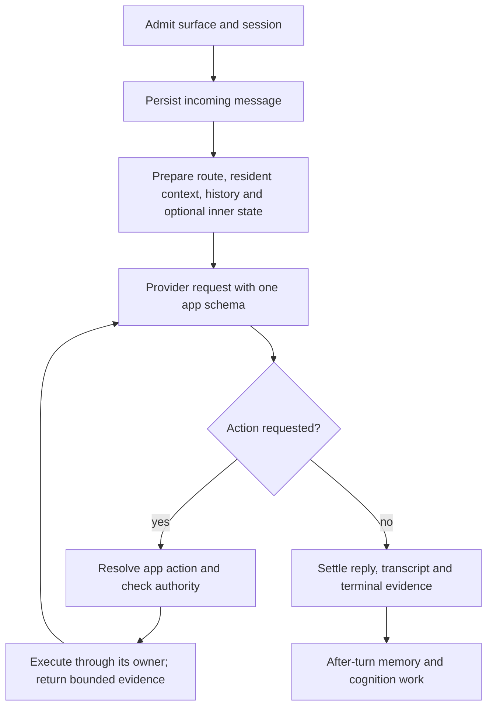

# Anatomy of a NativeAgent Turn

NativeAgent's turn engine lives in Core: `EngineRuntime` assembles the
root-scoped clients and `ChatTurnRuntime` owns conversation execution.
Mac chat, mobile and messaging adapters reach that engine through their
surface boundaries. One brain, many doors.

This guide follows an ordinary chat turn. [Internal Workings](INTERNAL_WORKINGS.md)
connects it to memory, growth and background work.

## Human summary

**Admit the message → persist it → prepare bounded context → call the selected
model → execute any app actions → settle the answer and its consequences.**

The model receives selected context, not direct access to the Mac's memory.
NativeAgent offers one tool, `app`. Its home, pages and actions provide reach
without sending a catalog of separate tool schemas on every request.

## The complete turn

```mermaid
flowchart TD
    A["Admit surface and session"] --> B["Persist incoming message"]
    B --> C["Prepare route, resident context, history and optional inner state"]
    C --> D["Provider request with one app schema"]
    D --> E{"Action requested?"}
    E -- "yes" --> F["Resolve app action and check authority"]
    F --> G["Execute through its owner; return bounded evidence"]
    G --> D
    E -- "no" --> H["Settle reply, transcript and terminal evidence"]
    H --> I["After-turn memory and cognition work"]
```

## Before the message arrives

`NativeContextFlowRuntime` coordinates source projections and generation
publication. The Context module maintains an immutable generation and a bounded
`ContextArena` containing reusable entries, indexes and required-document
mirrors.

Persona, MemoryV2, skills and Desk remain the owners of their source material.
Context is a derived working set. Full documents, skill bodies and external
content can be retrieved when needed rather than copied into every packet.

## 1. A surface admits the turn

The surface supplies the conversation identity, origin and attachments.
Core's Mac admission path can accept, queue or reject a request; queued work
retains its session and origin. The chat client binds run and trace identities
to the accepted turn.

Origin survives into dispatch. An admitted remote conversation is not made
local by text claiming to be User. Trust and peer-origin policy evaluate the
actual request provenance.

Source: `ChatTurnRuntime/MacChatTurnAdmission.swift` and
`ChatOrchestrationClient+StructuredChat.swift`.

## 2. The user message becomes durable

Structured chat writes the incoming message before context preparation unless
it is resuming an already-enqueued request. History preparation checks whether
the session needs compaction before assembling the model context.

In-turn steering also persists a message before handing it to the active turn.
If that write fails, the offer is returned for queueing instead of disappearing
into an unrecorded exchange.

Source: `ChatOrchestrationClient+StructuredChat.swift` and
`ChatOrchestrationClient+MessagePersistence.swift`.

## 3. NativeAgent prepares the working set in parallel

Resident turn preparation overlaps the history-aware context build. The
request combines:

- the selected provider/model route from a checked routing snapshot;
- persona and relevant atoms from the resident Context generation;
- bounded conversation history and session continuity;
- a compact turn-plan hint where useful; and
- an optional cognitive capsule and organism posture.

The prepared Context turn holds its generation lease through the provider/tool
loop. A source update publishes a later generation rather than replacing part
of the current turn. `app` action `context.expand` retrieves only an eligible
pointer from the current turn's generation.

Cognition is advisory. Its presentation bookkeeping is committed only after
the engine call succeeds; merely preparing a capsule does not mark it delivered.

### Tools and skills

The request carries only `app`. `app {}` opens home, `find` discovers reach,
and `action` executes a registry entry. Skill bodies are read through
`skill.read` when useful. Discovery does not mount a schema or grant permission.

See [Tool loading: the contract](TOOL_LOADING.md) for the exact interface.

## 4. The provider request is assembled

The turn engine combines stable persona material with the changing context
packet, history, current message, attachments and the `app` schema. Provider
adapters encode that request for the selected route.

### How prompt caching reduces token cost

The implementation separates stable system segments from dynamic material.
Persona documents belong in the stable prefix; the changing clock and turn
context do not. A turn pins its clock, and prepared context can be reused
during the tool loop. Keeping `app` as the single static schema also avoids
discovery changing the request's tool array.

This arrangement permits provider-side prefix reuse. It does not guarantee a
cache hit or a particular latency or price reduction; those require actual
provider usage evidence.

Source: `ChatTurnRuntime/ChatOrchestration+TurnEngine.swift` and
`ChatOrchestration+StreamingToolLoop.swift`.

## 5. The model answers or requests a tool

A direct answer can finish after one provider call. An action request enters
the tool loop:

1. Resolve the `app` action and its underlying dispatch identity.
2. Check current Trust policy, origin, file scope and domain requirements.
3. Execute, refuse or wait for an exact approval.
4. Return the result and available outcome evidence to the model.

Full Mac gives Agent autonomy, including app actions otherwise marked User's.
Explicit blocks and actual platform access still apply. macOS privacy
permission resets ask the owner first. Peer-steered turns additionally card User
for deletes and irreversible acts, sends in their name, persona writes and
protected approvals.
Authenticated turns from agents enabled in Trust → Connected agents carry
User's authority and skip extra peer approvals; ordinary Trust and domain checks
still apply.

Parallel-safe calls may execute together; the dispatcher classifies the
underlying action rather than treating every `app` call as a read.
Provider-facing results are bounded. Oversized results can be retained behind
a session-and-turn-scoped handle and read through `result.page`.

The loop handles cancellation, dispatch deadlines, protocol repair and
no-progress detection. No schema-loading round is needed between iterations.
A returned tool result records what that owner observed; it does not establish
an unverified external effect.

Source: `ChatTurnRuntime/ChatOrchestration+ToolLoop.swift`,
`ChatOrchestration+ToolDispatch.swift`,
`ChatToolRuntime/ProviderToolResultRecovery.swift` and
`TrustCenter/PeerTurnEffectPolicy.swift`.

## 6. The completed turn settles once

For a completed answer, structured chat commits cognitive presentation
bookkeeping, persists the assistant row and generated attachments, starts that
turn's deferred memory-promotion ticket, and emits terminal evidence. Promotion
starts after the assistant row is durable and is not awaited on the reply's
delivery path.

The Mac stream consumer joins the producer's persistence before settlement.
Stream closure or a Stop request alone cannot prove completion: the lifecycle
resolver uses the canonical transcript proof and typed terminal signal. An
ambiguous outcome remains ambiguous.

`tools.contract` records the schemas actually sent. `turn.terminal`
records the terminal reason, timing and dispatch/context evidence. These are
receipts for the specific turn, not a general claim that every connected
system is healthy.

Source: `ChatTurnRuntime/ChatOrchestrationClient+StructuredChat.swift`,
`MacChatTurnStreamSettlement.swift` and `MacChatTurnLifecycle.swift`.

## Related reading

Source paths above are under `Modules/NativeAgentCore/Sources/`.

- [Internal Workings](INTERNAL_WORKINGS.md) — memory, action, growth and surfaces.
- [Tool loading: the contract](TOOL_LOADING.md) — the one app interface.
- [Turn resilience](TURN_RESILIENCE.md) — interrupted and incomplete turns.
- [Automated systems](AUTOMATED_SYSTEMS.md) — work outside the foreground turn.
- [Architecture Blueprint](ARCHITECTURE_BLUEPRINT.md) — source ownership.
