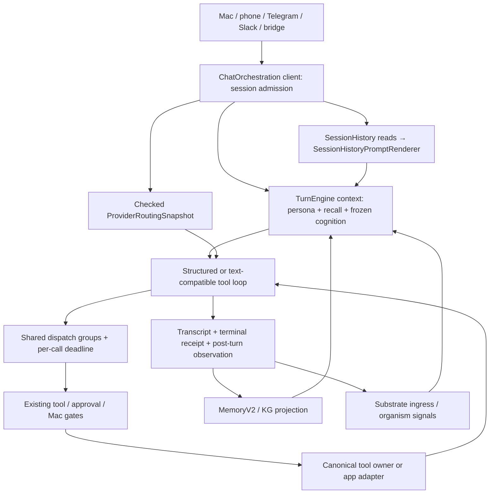

# NativeAgent Architecture Blueprint

## Memories review (2026-09-09)

| File | Ownership |
| --- | --- |
| `MemoriesPageView.swift` | Pending Keep / Don't keep actions retain the AppModel decision path. The page owns the rejected-history reveal count and passes ordered loaded proposals to `MemoriesRejectedHistory`; row reads open the existing `MemoryFullTextView` sheet. |

History reveals sixty additional loaded rows per Show more action, preserving
proposal identity and the separate pending/history reads. No timer changes.
## Shared folder controls (2026-09-09)

| File | Ownership |
| --- | --- |
| `ConnectorsView.swift` | Folder selection and editable sharing form; local search progress, empty results and failure presentation; DEBUG headless control fixtures. |

The folder chooser only fills the form; sharing still calls
`AppModel.addWorkspaceWithReceipt` with the exact path and chosen permissions.
Search calls the existing throwing `NativeClient.searchWorkspace` and retains
its outcome locally. No new Swift files, timers, turn or memory contracts.

## Capability recovery (2026-09-09)

`TelegramPollLoop.swift` retains speech-permission-blocked voice updates in the
existing durable inbox and retries on ordinary ticks, including after restart.
The existing capability callback routes Mac recovery; `TelegramView.swift` owns
the explained foreground speech setup. Launch remains non-prompting.
`DoctorView.swift` keeps Providers primary and exposes device sign-in under an
unconditional technical disclosure, using neutral control copy and unchanged
login actions/accessibility identifiers. No new Swift owners are introduced.

## Mac–iPhone verification retention (2026-09-08)

Shared `BridgeMessage.swift` owns canonical signing and field-specific unsigned
resync-envelope diagnostics. Mac `iCloudBridge.swift` validates the hint before
sending through the selected transport. iOS `iCloudBridge.swift` owns durable
`ICloudUnverifiedRecord` diagnostics and defers repeated verification by record
ID, observed pairing version, and key digest. These records are not receipts.
`CloudKitDeviceTransport.swift` keeps the receive cursor before an unverified
phone reply while allowing later independent replies to reach their consumers.
Mac stale-envelope rejection retains evidence without reserving chat/action IDs;
`MacSyncEngine+Inbox.swift` checks freshness before a new action transaction.
Existing files retain ownership; no new Swift files or timer sites.

## iOS reply authority (2026-09-07)

`ChatStore+Sending.swift` checks original correlation/placeholder ownership on
both send continuations. `ChatStore+ICloudReplies.swift` retires the matching
queued handoff at terminal resolution; pairing hints preserve the original
request and only nudge observation. iOS `iCloudBridge.swift` reverifies the exact
reply after KVS refresh and retains unverifiable CloudKit records/Drive files
for another read, without trusting their correlation as a request rejection.
`ChatReceiptStateMachineEvalTests.swift` pins these ownership and verification
transitions. No files, timers, or shared transport owners were added.

## StandingBots storage and runner family

`Modules/NativeAgentCore/Sources/StandingBots/` exports the backend-only bots
definition and shelf stores. `BotDefinitionStore` and `ShelfStore` call
`StandingBotsDisk`, which uses PersistenceCore's cross-process file lock and
durable atomic writer under `<dataRoot>/bots/`. All storage paths reject existing
symlink components beneath the canonical data root,
including read targets and the per-bot run claim. Definitions and their complete
audit snapshots share one atomic `definitions/<id>.json` transaction. Shelf
books are sequence/entry envelopes in `shelf-entries/<entryId>.json`, with a
sequence/latest/last-good index in `shelf-index.json`. The first indexed access
checks and copies legacy `shelf/<botId>/YYYY-MM-DD.jsonl` books once, preserving
their bytes and sequences. `shelf-pending.json` recovers interrupted entry/index
publication. Append and last-good reads no longer scan history or rewrite a day.
All store instances use `bots/store.lock`, so sequence allocation, duplicate
checks, definition edits and cursor updates serialize across processes.
Missing storage is empty; corrupt storage throws without replacement.

`BotContinuityStore` owns `<dataRoot>/bots/<id>/context.json` (at most 12,000
UTF-8 bytes of working notes and eight current document references) and immutable
`documents/<version>.json` report revisions (at most 32,000 content bytes each).
`BotRunner` carries bounded untrusted notes and kept material into each next run,
asks for changed findings and optional complete named `keptReports`, and publishes
continuity only for a completed, nonfailed book. Report files precede the atomic
manifest; prior revision IDs remain readable and linked through `previousVersion`.
Shelf append first records a provisional partial receipt, then continuity
publishes and the same entry/sequence receives its final duration and health.
A persistence failure leaves a partial receipt and may leave an unreferenced
immutable revision; cancellation is checked again before manifest publication.
There is no silent overwrite or replay. Report history is intentionally retained;
the current manifest, working notes and prompt projections remain bounded.
The app injects `StandingBotContinuity.compact`, which reuses the existing pure
in-flight mechanical compaction helper without a provider call, then enforces
the stricter UTF-8 byte cap. Truncated/compacted coverage is labeled explicitly.
`bot_ask` calls `BotRunner.ask` through the stateless ChatOrchestration adapter,
using the same cheap provider, live autonomy admission, active claim, per-run
budget, daily reservation and deadline. It runs no sources and writes no book,
context, report, cursor, memory, transcript or notification; only spend changes.
Only the requested answer returns as a tool result. `shelf_documents` lists
bounded current references; `shelf_document` reads by name with character offsets
and a pinned version, and traverses preserved history by `previousVersion`.

The ChatOrchestration bots tools call these public APIs through
`SwiftToolDispatcher+StandingBots.swift`. No preset or UI is added by the tools.
`BotRunnerScheduler` now projects one job per definition into the existing
`BackgroundLoopsAssembly+TriggerScheduler` event/deadline registration. Interval
cadence is measured from completion; cron/time-zone math delegates to `SchedulerJobRuntime`
with a person-owned minimum gap (15 minutes by default, adjustable to 1 minute
on the Bots page). `BotRunLimits` reads the app preference; definition writes
reject intervals below the current floor, while reads preserve saved schedules.
Scheduler jobs retain their completion/reservation anchor and reproject when the
floor changes. The page emits the existing queue invalidation; no timer is added.
Reservations in `bots/runner-jobs.json` precede spend and skip a crashed occurrence
rather than replay it. Paused definitions never dispatch; edits reset the next
occurrence from the definition revision.
Create/update validate cron with this same parser. Reconciliation isolates bad
legacy cron rows, records one failed shelf entry per revision, and continues
valid bots; malformed queued requests are consumed without effects.
`BotRunQueue` joins the production `makeNativeAgentAppToolDispatchClient` enqueue
callback to that same scheduler through durable `bots/run-queue.json` requests.
Admission rejects paused, already queued/running, and insufficient-input-budget
bots. Requests are consumed before execution (no replay after interrupted spend),
and the accepted request ID becomes the immutable shelf entry ID. All in-process
runners share active admission; scheduled and manual checks use the same runner.
`bots/<id>/run.lock` holds a nonblocking cross-process flock for the entire run
or ask, with PID/timestamp metadata. The inode is never unlinked; kernel release
on exit recovers stale claims without expiring ownership of a slow live writer.
Definition mutations and accepted requests emit a payload-free invalidation to
the existing event/deadline loop; file watching remains the external-write backstop.
`BotRunner` fetches bounded HTTP evidence, supplies the brief, optional body
`outputFormat`, typed sources and last good book to a fresh session, validates
one JSON book and appends once. Legacy URL strings remain readable. Tool sources
use `SwiftToolDispatcher+StandingBotsToolLoop.swift`: the catalog's Security
Center and ordinary chat admission chain check every concrete call. Source names
can select any available dispatcher schema, including registry tools; selecting a
source grants no permission. The existing read-only fileAccess default, Trust
approval refusal and app dispatcher restrictions remain in effect. The existing
structured turn engine runs with no recall, persona context or memory promoter,
at most four provider rounds and 16 calls, within the parent run deadline and
conservatively reserved aggregate input/output budget. Checked tool references
are `tool:name`; results remain untrusted evidence. Missing tool coverage remains
failed/partial. App scheduler assembly injects this adapter on the existing cheap
unattended provider preference; no additional scheduler or runtime is introduced.
Ordinary and on-demand bot requests use `SwiftNativeLLMClient.completeStandingBot`;
that dispatch and the structured adapter share `withStandingBotLifecycle`, emitting
correlated start/terminal events to the injected observer after routing and admission.
The assembly supplies `BotRunnerAdmission` using the same freshly loaded Trust
Center autonomy gate as unattended Desk work. Both scheduled and queued runs
The assembly supplies `BotRunnerAdmission` through `StandingBotToolLoop.admitted`,
checking autonomy and fresh Security Center kill-switch/hard-stop evaluation. Both scheduled and queued runs
fail closed before fetch and recheck before every redirect hop and provider dispatch;
denied/unavailable authority produces a failed "could not check: not permitted" book.
`BotRunnerHTTP` resolves every initial/redirect host and rejects any non-public
address, credentials or non-HTTP scheme. Its numeric NWConnection endpoint pins
the admitted address, verifies the connected peer, and uses the original host
for HTTP Host, TLS SNI and certificate trust. Its bounded HTTP/1.1 reader returns
redirects to admission (at most 20); the existing BotRunnerDeadline bounds the
whole fetch at 30 seconds. Rejection reasons remain in the failed book.
`BotRunLimits` caps each run at 32,000 tokens/120 seconds. `BotRunQueue` reserves
tokens atomically across the fleet in `bots/daily-spend.json`, capped at 256,000
per UTC day, with no refund after interruption and no reset on corrupt state.
Daily-limit skips produce failed shelf entries without fetch or provider work.
`SwiftNativeLLMClient.completeStandingBot` reads one checked routing snapshot,
sharing the existing unattended Dream provider preference and explicit model
pin. Unpinned bots select GPT-5.4 mini or Haiku on that same provider; telemetry
uses `standing_bots`. Only wire-budget-capable OpenAI API,
Anthropic API and Anthropic OAuth routes dispatch for HTTP-only and tool-source
checks. OpenAI's structured adapter honors the same task-local hard output
ceiling as its plain adapter; ordinary chat bodies remain unchanged.
The optional `ProviderRequestAdmission` task-local hook, declared beside the
Anthropic OAuth adapter, reaches both plain and structured 401 retries. App
assembly, bot_ask and the budgeted tool provider pass fresh bot admission;
ordinary chat leaves the hook nil.
Other routes fail before model spend. A byte-based input ceiling plus wire output ceiling bounds tokens;
spend records the reserved ceiling, explicitly labeled, not measured usage.
`BotRunnerDeadline` cancels the whole run at its remaining monotonic budget,
including shelf and continuity IO. Its settled form retains the claim while
synchronous storage finishes; its candidate gate drops non-cooperative provider
output. Duration is sampled after run IO and final store-lock acquisition;
only final receipt persistence follows that sample. Overruns land failed/partial,
never as last-good successes. Receipt finalization preserves append sequence.
Missing/truncated sources cannot yield a fully successful check. Unsupported
connector strings fail as unavailable; supported sources are public HTTP and
explicitly named available catalog tools under the existing Trust and file-access
gates. No presets are shipped.
Shelf content is untrusted evidence, NOT memory, and never enters
context by itself. Index responses are capped at 100 rows with 240-character
headlines and explicit truncation; `entry(id)` is full-book drill-down.
Pagination uses append sequence, not run time, with query-bound continuation
tokens (including a terminal token usable for later appends). `since` exclusively
filters run time; topic matches literal case-insensitive content. Pagination
does not acknowledge anything. Explicit per-reader ID acknowledgements in
`cursors.json` retain unread holes and separate agent/UI state. Restart a query
with nil cursor to revisit those holes. History is never pruned; current disk
page/acknowledgement reads scan history, and sparse acknowledgements grow with
consumed entries; append, entry and last-good reads use the index.
The focused `StandingBotsTests.swift` test file covers temporary-root
create/update/pause, append/pagination, independent-reader holes, corruption
preservation and concurrent writers.
`ChatOrchestrationTests/StandingBotsToolTests.swift` calls the public dispatcher
against temporary stores to verify lazy schemas, validation, notification-tier
profiles, exact reader acknowledgements, and enqueue adapter outcomes. Runner
fixtures explicitly admit fake effects, pin cadence/budget caps and completion-based
deadlines, and bound queue/notification signals to five seconds.
`BotRunnerTests.swift` adds fake-session one-book, timeout, token admission,
last-good preservation and paused-run proof.
`BotContinuityTests.swift` covers two runs across runner instances, changed-only
findings, versioned documents, source-free fake-provider answers, isolation and
no writes outside bots. `StandingBotsToolTests` also exercises document pages,
the production compaction adapter and the injected ask-provider seam.

| File | Responsibility and calls |
|---|---|
| `StandingBotsModels.swift` | Public typed HTTP/tool sources (legacy URL decoding), person-owned minimum-cadence preference read by stores/scheduler and edited by BotsShelfPreviewPage, optional body format, definition, cadence, budget, audit, book, dated source, spend, health, compact page and reader-cursor values. |
| `StandingBotsDisk.swift` | Shared root, lock, checked JSON reads, durable atomic writes and definition validation used by both stores. |
| `BotContinuityStore.swift` | Bounded bot working context, validated named kept reports, immutable linked revisions, current-reference publication and bounded list/read/prompt projections; called by BotRunner and explicit shelf tools only. |
| `BotDefinitionStore.swift` | Create/get/list/update/pause/resume/audit APIs; optimistic edit conflict detection, brief/body-format version increments and atomic definition/audit publication. |
| `ShelfStore.swift` | Indexed per-entry append/get/lastGood, legacy migration and pending-write recovery, provisional run receipt finalization, filtered cross-bot pages and explicit sparse acknowledgement APIs. |
| `BotRunner.swift` | Isolated runs with bounded private continuity, evidence/book validation, named report publication and sole terminal shelf append; source-free on-demand ask shares admission, daily spend and deadline without publishing content. |
| `BotRunQueue.swift` | Durable enqueue receipts, per-bot cross-process flock claims, paused/budget admission and rejected-request consumption; shared by tools, asks and BotRunnerScheduler. |
| `BotRunnerHTTP.swift` | BotRunner's bounded GET entry; public-unicast admission feeds a numeric NWConnection with original-host TLS trust/SNI, connected-peer verification, bounded HTTP/1.1 parsing and explicit per-hop redirect admission. |
| `BotRunnerDeadline.swift` | Cancellation-aware whole-run settled deadline and resume-once candidate gate that drops late provider values. |
| `BotRunnerScheduler.swift` | One durable reservation per bot, isolated cron failure receipts, cadence and pause projection into the existing scheduler deadline owner. |

| Shared helper | Responsibility |
|---|---|
| `Modules/NativeAgentShared/Sources/NativeAgentShared/InboxWireModels.swift` | Immutable inbox group/action wire values and scalar group matching, exposed through local Mac/iOS aliases and item adapters. |
| `Modules/NativeAgentShared/Sources/NativeAgentShared/ProviderCatalogWireModels.swift` | Provider catalog leaf wire records shared through local Mac/iOS aliases; parent records and provider authority remain platform-owned. |
| `Modules/NativeAgentShared/Sources/NativeAgentShared/ProviderAuthStatus.swift` | Shared provider-auth value storage, required five-argument construction and keyed encoding; decoding delegates to ProviderAuthStatusWireSnapshot, exposed through Mac/iOS aliases. |
| `Modules/NativeAgentShared/Sources/NativeAgentShared/ProviderAuthStatusWireSnapshot.swift` | Provider-auth snapshot decoding and lossy metadata-to-string projection for the shared value; providers retain credentials, refresh and routing authority. |
| `Modules/NativeAgentShared/Sources/NativeAgentShared/MacControlPolicyWireSnapshot.swift` | Mac Control snapshot decoding compatibility; platform models retain construction defaults and encoding, and TrustCenter retains policy authority. |
| `Modules/NativeAgentShared/Sources/NativeAgentShared/KnowledgeGraphEdgeWireSnapshot.swift` | Common edge wire decoding; Mac/iOS KGEdge wrappers retain extra fields and UI identity. |
| `Modules/NativeAgentShared/Sources/NativeAgentShared/CompactDurationFormatter.swift` | Shared compact second/minute/hour wording with checked integer conversion and consistent rounding. |
| `Modules/NativeAgentShared/Sources/NativeAgentShared/InboxDigestGroupProjection.swift` | Pure structured/legacy digest-group interpretation with read-only platform model adapters. |
| `Modules/NativeAgentCore/Sources/NativeAgentCore/BridgeRoutingPrefix.swift` | Bounded bridge routing-prefix parser shared by chat presentation and transcript search; provenance stays with callers. |
| `Modules/NativeAgentCore/Sources/NativeAgentCore/TurnSecretRedactor.swift` | Common ordered credential scrubber for turn presentation and trace text; callers retain bounding order. |

Last navigation/ownership review: 2026-09-07 (source baseline `13006f73`).

Use the [documentation and repository guide](README.md) for a short reading
path. This catalog preserves detailed contracts; jump directly to the owner
you need rather than treating every dated note as a current task.

- [Runtime shape](#runtime-shape) and [high-level flow](#high-level-flow)
- [Ownership after the splits](#ownership-after-the-splits) connects the file families below.
- [Mac app owners](#app-source-map), [iOS](#ios-companion-map), and [Core](#core-runtime-map)
- [Desk work](#desk-work-ownership) and [tool dispatcher](#tool-dispatcher-map)
- [State](#state-ownership), [policy](#policy-chokepoints), and [chat context](#chat-context-rules)
- [Background loops](#background-loops), [connectors](#connector-rules), and [build/test](#build-and-test-baseline)

## Recent contract notes

Standalone embedding model (2026-09-07): `NativeAgentEmbeddingWarmup` starts
`EmbeddingModelDownloadController` independently of warmup and chat. Core's
`EmbeddingModelDownload` reads URL, byte length and SHA-256 from Bundle.main's
`embedding-download.json` (the existing release descriptor), resumes 48 ranges,
verifies the assembled archive, and installs `extras/coreml`. The controller
releases the prior provider and calls the existing epoch reconciliation;
unmarked custom installations are preserved before transfer and replacement,
with a custom-model status and no reconciliation. Only downloader-owned models update.
Memory and Diagnostics observe the same progress stream. Missing descriptors
and bundled distribution skip downloading; the download row is hidden. No timer is added.

| File | Responsibility |
|---|---|
| `EmbeddingModelDownload.swift` | MemoryV2 bundled release descriptor parsing, resumable ranged transfer, streaming SHA-256 gate and staged extras activation; preserves custom installations and updates only marked downloader-owned models. |
| `EmbeddingModelDownloadRow.swift` | App download task and pushed progress shared by MemoryView and DiagnosticsView; startup entry from NativeAgentEmbeddingWarmup. |

`EmbeddingModelDownloadTests` covers descriptor parsing, descriptor-free dev bundles,
custom installation preservation, fresh installation from resumed archive parts,
uneven/resumed assembly and digest/length refusal.

Phone catch-up limit (2026-09-06, ACCEPTED AS IS): the CloudKit device
transport sweeps chat and notification records past a 14-day retention
window, and the only fallback for a phone that was offline across that
window is the ordinary mobile snapshot. That snapshot is bounded, and these
are its exact numbers — `MacSyncEngine+Snapshots.swift`,
`chatTranscriptSnapshots` / `compactTranscriptMessages` /
`truncateTranscriptContent`:

- up to **16 sessions**, main conversations first and remaining pins
  newest-first, subject to the **2 MiB** raw transcript budget and the encoded
  status-envelope limit;
- at most **80 messages** per session (`messages.suffix(80)`);
- at most **6,000 characters** per message, tail truncated with a marker.

So a phone that misses the retention window recovers, at any one moment,
at most the last eighty messages of each included session, with message bodies
bounded to 6,000 characters; the budgets can exclude eligible sessions.

What that costs is narrower than "gone for good" (corrected 2026-09-06). The
sweep deletes the delivery records in CloudKit; it deletes nothing on the Mac,
which retains the complete canonical transcript and republishes on every edge.
Pinning a session on the Mac makes it eligible for catch-up but does not
guarantee inclusion in the next envelope. What a phone genuinely
cannot get back is the part of a missed conversation that no snapshot ever
carries: anything older than the last eighty messages of a session, and any
message body past 6,000 characters.

Making the fallback whole needs a cross-device protocol this pass did not
open: the phone would have to report that its last drained cursor is older
than the retention window and name the sessions it is short of, and the Mac
would have to answer with a one-time, bounded, fuller transcript snapshot for
exactly those sessions. That is a new status key, a new request/response
shape on the device transport, and a new bounded publisher on the Mac.

Bounded discovery contract (2026-08-30): `MacFourVerbs.zoom` owns on-demand
HUD/readout and controls/actions scopes. Whole-section expansion retains
source omissions and original addresses; observed caps and unobserved values
are distinct. `MacScreenRender` supplies real `screen(part:)` recourse without
exposing inaccessible renderer knobs. Ordinary-turn caps remain unchanged.

Natural aiming contract (2026-08-30): within-target diagonal prefixes are
parsed separately from object identity and select inset quarter-points.
Explicit covered points never relocate. `VisionFourVerbAdapter` shares natural
shape names across existing nearest-object relation aliases, without inferring
new relations or exposing the alias catalog in model context.

Fine-wheel contract (2026-08-30): Four-verb scroll has a local four-direction
type and optional bounded line magnitude; explicit wheel requests never fall
through to vertical page keys or change the lower semantic scroll enum. Zero
keeps defaults expressible in strict tool bindings. Existing hand input and
fresh clear-point selection own both axes and outcome observation.

Partial-region contract (2026-08-30): FourVerbPerception retains broad visual
regions with exact foreground exclusions; discrete objects still fail overlap
admission. `MacRegionAim` chooses a clear default point with bounded geometry
work, but never relocates an explicit spatial request or permits a drag across
an exclusion. All current region exclusions survive target fusion. This adds
no authority, input path, cached screen, or background observer.

Held-key contract (2026-08-30): `MacKeySyntax.parseHeldKeys` owns simultaneous
space-separated key/chord/modifier sets for both timed key holds and `holding`
around gestures. The ordinary key parser still means sequential chords. Both
paths reuse the existing balanced hand and cancellation release owner.

Pointer feedback contract (2026-08-30): `MacPointerPositionSource` supplies one
read-only system position to fused `view`. FourVerbPerception carries it with
the observed surface frame; screen renders a bounded normalized line. Hover
and move settle only pointer-in-current-target bounds, never inferred application
effects. Observed vision bounds remain separate from predicted motor bounds;
pointer prose is excluded from structural-effect comparisons. Missing reads
stay unavailable, and default test sources never read the real cursor.

Pointer button contract (2026-08-30): public four-verb `act` carries optional
left/right button choice through the canonical hand to click/drag/hold input.
`auto` (or omission) preserves ordinary semantic/key/hover actions even in tool
bindings that require a value for every field.
Explicit buttons never become AXPress or Control-left substitutes. Invalid
combinations fail before input; cancellation releases the actual held button.

Visual naming contract (2026-08-30): `VisionFourVerbAdapter` maps measured
square/round silhouettes to ordinary shape-noun aliases on existing targets.
Motion qualifiers require current tracker evidence; aliases neither fabricate
geometry nor relax ambiguity, and remain private rather than expanding context.

Transient menu contract (2026-08-30): `MacAXElementSource.transientMenuRoots`
and `MacTransientMenus` own bounded current native menu evidence. The fused
`view` publishes redacted, handle-free menu items; FourVerbPerception adds
fresh named physical targets. Application-sibling menu paths are never treated
as document-window paths, and hidden menu-bar inventories are not expanded.
Discovery includes direct siblings along the focused element's ancestor chain
(16 ancestors / 96 children maximum), because Chrome keeps page focus while
showing a menu beside the page's containing group.

Pointer coordination contract (2026-08-30): `MacHandRepertoire.hold` carries
held flags on key, mouse, and scroll events through `CGEventSink`, alongside
physical key down/up. Do not depend on asynchronous HID state for modified
clicks. Release flags track only still-held modifiers; cancellation retains
the canonical neutral-hand recovery.

Selective-context contract (2026-08-30): explicit correction topics remain
canonical memory metadata and become derived Context applicability, not a new
authority owner. Applied memory corrections return exact selected-atom feedback
through the prepared turn. Conversation continuation is bounded and on-demand;
work/reminders are not newly surfaced without the user's request. See
`docs/build_plans/fluid-context-as-built-map.md` for current telemetry and eval
boundaries.

## First Principle

NativeAgent is a Swift-native Mac + iPhone agent runtime. `NativeAgent.app` owns the live runtime in-process.

Shipped subsystems are unconditionally Swift-native. The migration-era
`SubsystemFlag` / `RuntimeSnapshot` / `MutableRuntime` control plane and its
app-lifecycle attachment have been retired. Product trust, onboarding, and
preference gates remain owned by their actual subsystems; no gate chooses
between runtimes, and unsupported edges fail closed in Swift.

There is no live external interpreter backend and no launchd-owned agent runtime. Do not add external runtime code, fallback loops, launchd install paths, or duplicated state roots. If a missing behavior exists, implement it in Swift or fail closed with an honest Swift error.

Historical daemon/Python-era words may still appear in old audit notes, compatibility tests, migration comments, or cleanup checks. Treat those as legacy compatibility vocabulary only. They are not the current architecture.

## Read Order

1. [Documentation guide](README.md) for the repository layout and task-specific reading path.
2. The relevant section of this blueprint for exact ownership.
3. [Project Direction](PROJECT_DIRECTION.md) for durable intent and [Project Status](../PROJECT_STATUS.md#capability-snapshot) for implementation boundaries.
4. In a maintainer checkout, the newest relevant section of `docs/HANDOFF_CURRENT.md` and the applicable current as-built map. Public exports omit those private handoffs/plans.

If docs and code disagree, trust code/git, then update the stale doc.

## Runtime Shape

- Mac app: `Sources/NativeAgentApp/`
- Swift runtime modules: `Modules/NativeAgentCore/`
- Shared Mac/iOS models: `Modules/NativeAgentShared/`
- iOS companion: `iOS/NativeAgentMobile/`
- Runtime state: `data/` and `.runtime/` are local/generated and gitignored.
- Work product has one resolver and one trust boundary:
  `NativeAgentWorkspaceRoot` uses `<verified-source>/workspace` for development
  and `<dataRoot>/workspace` for app-only/public installs. Mac chat, detached
  chat, Telegram, Slack, iOS-forwarded turns, bridge helpers, builder tools,
  TrustCenter, connector workspace actions, and compiled Workshop procedures
  consume that same root. Relative file-tool paths resolve there. It is
  local/generated and gitignored. The root is the safe default, not a hidden
  ceiling on Full Mac YOLO: when that exact effect-time policy authorizes file
  operations and outside-workspace access, native shell/build tools and
  Codex/Claude handoffs may select an existing absolute external project.
  Non-Full-Mac turns remain workspace-scoped, and sensitive authority paths
  plus protected system mutation roots remain denied.
- Persona source: `persona/`

The installed app is built by `script/install_app.sh` and normally lives in the current user's `~/Applications/NativeAgent.app`.
Its `build_and_run.sh --build-only` step and `script/release.sh` both call
`stage_chrome_payload` in `script/lib/chrome_payload.sh` before signing. That
shared owner stages the relay at `Contents/MacOS/NativeAgentChromeRelay` and
the extension manifest and source at `Contents/Resources/NativeAgentChrome`;
the installer preserves both when copying and re-signing the bundle.

## High-Level Flow

```text
Mac / iOS / Telegram / Slack / local bridge
    -> App-side surface handler
    -> ChatOrchestration session + history + continuity
    -> TurnPlan intent/policy/resident-readiness snapshot
    -> compact persona / memory / runtime context
    -> optional gated CognitiveSubstrate capsule
    -> ProviderRouting model adapter
    -> tool loop through SwiftToolDispatcher / AppChatToolDispatcher
    -> MemoryV2, tools, connectors, browser, scheduler, Mac integration
    -> receipts, chat transcript, activity, iCloud/APNS notifications
```

Normal chat should stay fast. Use lazy manifests, small continuity cards, bounded recall, and tool loading. Do not inject broad memory, tool, skill, or connector inventories into every turn.

Full Mac is the deliberate exception to lazy native operator discovery. Once
TrustCenter has filtered the inventory and Full Mac YOLO is active, every chat
surface receives the native file, shell, Git, patch, build, Mac-control, and
maintenance schemas on its next turn without a restart. This removes an LLM
reconstruction/discovery loop. Full Mac also lets the agent name the actual
project cwd for native shell/build work and for `codex_message` /
`claude_message`; bridge workers no longer default real coding tasks into the
empty NativeAgent scratch workspace. Admitted Full Mac YOLO is also the
operator's answer to every per-call ask/confirm policy: local chat and
authenticated Telegram, Slack, iOS, bridge, mission, action, workflow, and
background paths must not create pending approval rows. It does not bypass
authenticated surface identity, explicit user `blocked` overrides, connector
readiness, protected roots, secret-egress denial, macOS TCC, provenance,
effect-time validation, receipts, or domain verification. Those unavailable or
forbidden effects fail as hard blocks rather than contradictory prompts.
Non-Full-Mac turns remain compact and lazy.

New `codex_message`, `claude_message`, and `omp_message` coding conversations fork the
resolved Git checkout into distinct ordinary worktrees before their durable
inbox rows are queued. A private two-line conversation pointer returns later
contextual messages to the same tree; a conflicting explicit follow-up cwd is
rejected before queueing. An omitted cwd remains absent, ordinary non-Git paths
retain their prior behavior, and Git evidence with a failed probe or allocation
is refused instead of dispatching into a potentially shared source directory.
This is dispatch isolation only, not a Factory state machine or lifecycle.

### Swarm workers

Ordinary chat turns do not construct or inject cross-session activity digests.
`buildTurnContextWithHistory` keeps same-session history and relevant memory;
its optional `SessionDigestProvider` is an explicit caller opt-in, including
when a cached digest exists. Historical work feeds and digest files remain
available to requested inspection, not automatic conversational agenda.
Active context assembly checks actual task cancellation at preparation and
completion boundaries. Packet memory-use accounting is admitted only after
the final context is assembled, not merely after selection; ordinary provider
failures still use the established fallback without claiming a user Stop.

Memory projection keeps validated canonical dates in its bounded presentation
body while embedding the original admitted fact text. These dates describe
recorded evidence, not a live-status check; adaptive memory remains subject to
the same selection and expansion policy. Canonical correction flushes join the
current owner's already-admitted derived deliveries as well as the pending
batch, without cancelling those deliveries or changing immutable turn leases.
Explicit `recall_memory`/`recall_search` reads can recover a truncated hit by
`memory_id`, following `read_more` in pages capped at 2,000 characters. Its
content hash binds continuations to one displayed text version; after the
usual eligibility check, a mismatch returns `record_changed` without text and
requires restarting at zero. Legacy unbound continuations are explicitly
unverified, without adding a cursor store or changing access authority.
The existing MemoryV2 boundary performs canonical point lookup and the same
lifecycle, disclosure and durable-quality checks; denied and missing IDs are
indistinguishable and never fall back to KnowledgeGraph. Ordinary search and
automatic turn budgets remain unchanged.
Search fallback may use KnowledgeGraph only to find exact memory-backed fact
candidates, then reads their current text through that same canonical MemoryV2
boundary. Retired, denied, missing, or unlinked graph summaries cannot bypass
recall eligibility after a zero-hit result or semantic outage. Explicit graph
inspection remains separately available.
Skill reads resolve an exact registered display name or ID before applying
legacy `.md` spelling compatibility. Punctuation in a display name never
becomes a filesystem path: only validated body handles and the existing
canonical-root containment checks reach file reads.
Saving a legacy skill without an ID allocates a collision-free identity before
body or version-history writes, including case-only filename collisions.
Explicit IDs remain unchanged; update receipts point to the body actually
written while the prior version and unrelated skill bodies are preserved.
App runtime-skill enable, status, delete, archive, and restore mutations await the existing serialized MemoryV2 pointer
reconciliation and admitted projection delivery before reporting completion.
If recall reconciliation fails after the canonical mutation, the UI refreshes
the saved state and explicitly reports the partial result without rollback.
Manifest-only installation confirms registration, not an unread body or recall
pointer; it does not construct a memory owner merely to change that state.
Canonical memory correction refuses a self-reference. If storing the correction
deduplicates to the original fact, that fact remains active and the tool reports
that no correction was applied rather than retiring its only recallable copy.
The same write transaction checks that a distinct replacement still exists and
is eligible before retiring the original, preserving recall if the replacement
was removed or retired between storage and correction.
Proposal acceptance rechecks exact forgotten-content hashes inside its write
transaction before the existing semantic tombstone gate, including legacy
records without embeddings; a late tombstone remains a committed rejection.
Foreground memory deletion uses the canonical owner's atomic delete result and
awaited projection completion, preserving missing-row errors and exact-root
isolation without changing prepared turn leases.
Foreground pinning uses the same owner's transactional pinned-only metadata
patch and completion boundary, without replacing a stale metadata snapshot.
Manual memory saves resolve that same exact-root owner rather than always
using the process-default singleton.
Duplicate reassertions also await existing projection publication after their
metadata update, so observed dates and provenance reach the next prepared turn
without changing identity, creation time, or embedding work.

`agent_swarm` is temporary fan-out inside the same runtime, not another mind.
Provider Routing's checked `swarms` surface tuple owns its default provider,
model, and reasoning effort. Explicit model choices can specialize workers;
TrustCenter does not own a competing model default.
Explicit malformed worker lists or unrecognized access modes are rejected
before provider execution, rather than silently substituting default workers
or another access mode. Omitted/nullable defaults and valid aliases remain.
Explicit worker mission/context aliases must contain text, null, or no value;
malformed supplied constraints fail before any worker starts instead of being
silently dropped, even when another alias contains valid text.
Each admitted swarm also captures its provider transport and service tier.
Prompt-only and inherited workers bind their selected model and effort to
that captured route; same-family specialization preserves the selected
transport, while explicit cross-family models retain existing inference.
Synthesis reuses the admitted tuple rather than rereading picker settings.
An inherited worker's originating surface still controls authority, not its
provider tier, and no parent call's effort silently replaces a worker choice.

Workers are prompt-only/read-only unless the parent selects `access: inherit`.
Inherited workers reuse `runEphemeralToolTurn` and the existing tool dispatcher,
workspace resolver, SecurityCenter/TrustCenter, autonomy, receipts, and
verification. The originating surface and verified session remain the
authorization identity even though LLM calls use the Swarms provider. Nested
delegation and NativeAgent install/restart are withheld from worker catalogs
and dispatch. SwarmRuns owns fan-out and receipts only; it does not become a
memory, permission, provider, or tool owner.
Worker discovery reflects that same scope. Its fixed-request load/unload
receipts never mutate the parent session's durable readiness; ordinary tools
retain their existing capabilities and effect-time authority checks.

Temporary tool turns bind their own execution ID to the existing trace bus
and durable tool receipts, without creating a chat session. Worker aliases
are canonicalized before the existing parent-only recursion/lifecycle check.
Cancellation stops queued admission and synthesis; retained partial output
is evidence, not proof of completed effects. Builder inbox retries retain the
accepted message ID, operation, brain and reply origin. Only explicit identical
unconsumed retries may re-enter canonical helpers; those helpers preserve
uncertain execution/delivery outcomes instead of inferring safety from a dead
process or elapsed time.
Prompt-only worker calls use their exact retained report IDs as trace IDs;
synthesis uses `<swarmRunId>-synthesis`. The existing trace bus carries an
ID-only link to the parent and report, without recording prompts or creating
another session or event store. Inherited tool workers retain their own
ephemeral turn identity.
Ephemeral large-result recovery and its turn-exit cleanup use the same verified
tool-session identity, releasing bounded spill capacity without creating a
persisted chat session or permitting cross-turn reads.
Regenerated assistant replies may follow their own canonical retry tool
receipts: the locked writer retains those receipts and replaces only the
target assistant. Any unrelated trailing turn or untyped receipt still
rejects replacement, preserving concurrent conversation evidence.
Local-only requests stopped before provider admission retain their exact user
row and typed retry notice across reloads only while the canonical conversation
IDs remain unchanged; a newer user or assistant turn supersedes them.
After a pre-write stream failure, that same canonical-ID proof restores the
original optimistic request and marks its notice unpersisted. An older
unanswered user row cannot substitute for the current request during retry.
Detached initial loads and session-selection snapshots use this same merge
after their existing lifecycle guards, rather than bypassing retry preservation.
Decoded UI messages belong to the validated transcript being viewed. A fork's
byte-identical copied source rows retain stored IDs/provenance, while actions
on those displayed rows target the fork rather than its source conversation.
Mac transcript clearing preflights the canonical session index, then clears
under the transcript lock and resets count/preview under a separate index
lock only while the transcript remains empty. A new append retains its own
projection; a later metadata-save failure explicitly reports a partial clear.
The UI reloads the exact target session behind existing lifecycle guards, so
selection changes and newer turns cannot be replaced by stale clear snapshots.
Compaction summaries share the cleared transcript; canonical memories remain
separate and are not implicitly forgotten by this action.
Native tool workers carry the engine's typed completed/incomplete terminal
state to swarm receipts. Exhaustion retains bounded partial evidence as failed,
not a completed report inferred from nonempty fallback text. Ordinary ephemeral
callers retain their existing behavior unless they request strict completion.
Text-compatible streaming rechecks the actual cancellation flag at EOF, so a
Stop after the last delta still retains partial output without issuing a final.
The nonstream text-compatible collector also treats a terminal save error as
failure even if reply generation already emitted a final value.

External `delegation_status` reads retain readable jobs while reporting bounded
per-source availability from the same observation. Missing stores are absent
evidence, not read failures; malformed or unreadable records produce partial
or unavailable status rather than a falsely healthy empty result.
Bridge `message_id` lookup matches canonical accepted-message IDs before
paging, including messages grouped into one Codex reply job. Matching output
keeps its internal job ID and exposes only recorded bounded thread/turn IDs;
it does not assign a single motor owner to a multi-message batch. A missing
match is `not_observed`, never proof that execution did not occur.
`delegation_status` can inspect an exact native swarm `run_id` with
`agent=swarm`, using the existing retained receipt store. The initial response
is compact metadata; selecting a `report_id` reads at most 2,000 characters
and provides a continuation offset. Receipt inspection never reruns work or
claims discarded output can be recovered. Bridge status pagination retains
its separate existing semantics, and a successful approval-filing receipt is
rendered as awaiting approval/not run rather than completed execution.
Canonical transcript tool rows retain the existing exact outcome class before
result clipping. History and compaction distinguish unconfirmed completion,
cancellation, timeout and failure from transport acceptance; legacy rows use
only valid explicit-status envelopes, never prose guesses. Claude delivery
reconciliation compares the exact retained completion text in the originating
session, so an earlier same-ID rejection cannot confirm a later result.
Claude/OMP completion delivery requires the original session. Missing routes
retain the terminal result as `blocked/missing_origin_session` without posting
to the currently selected chat; retries cannot rerun work or guess a route.
Ordinary incoming messages and Codex receipt-only GitHub delivery are unchanged.
Explicit Claude/OMP conversation handles carry a resume requirement into the
durable inbox and helper, including same-message-ID retry binding. Under the
existing topic lock, an unavailable pointer settles as `continuation_unavailable`
without starting fresh work. Claude also preserves an explicit pointer when
the provider reports its session missing, rather than automatically starting
a replacement. Legacy omitted-handle behavior and cwd selection are unchanged.
Claude preserves admitted Unicode message IDs rather than clipping UTF-16
units. Direct input beyond the existing 160-grapheme bound is rejected before
claiming work. A retained legacy truncated-ID mismatch remains ambiguous and
cannot authorize execution or delivery replay; filename mapping is unchanged.
Delegation projection retains blocked delivery and its allowlisted missing-route
reason separately from execution status. Outcome cards and motor state report
the blocked handoff rather than success, using the existing uncertainty class
without retrying the worker or adding a new outcome store.
Swarm receipt appends check the existing collection under the writer lock.
Only a missing file bootstraps an empty collection; unreadable, malformed, or
wrong-shaped evidence is preserved and reported unavailable after workers settle.
Persistence failures carry the settled run ID, execution status and counts in
a bounded error with the original diagnostic cause retained separately. Saving
is unconfirmed, not proven absent; inspect that run before considering replay.
Public non-streaming structured chat uses the same bounded, redacted tool-row
writer as streaming chat, whether or not the caller consumes progress events.
Telegram and bridge conversations therefore retain tool evidence for later
history instead of saving only the user prompt and final assistant reply.
Telegram reply quotes retain transport identity without assuming any bot sender
is this assistant; group replies to other bots use neutral bot attribution.
Post-approval receipt replacement preserves the same exact outcome class from
the original result before its preview is clipped. Approval permits execution;
it does not convert a queued, unknown, cancelled or timed-out result into
completed work. Existing approval authority and receipt identity remain intact.

## Ownership after the splits

`IntraTurnContextCompaction.swift` owns the shared proactive pressure operation
and receipt publication. Both `ChatOrchestration+ToolLoop.swift` and
`ChatOrchestration+StreamingToolLoop.swift` call `compactProactivelyIfNeeded`,
which measures the transient conversation, compacts above the strict pressure
threshold, emits a changed receipt trace, and awaits the progress notice.
Its return value records pressure-branch entry even for mode `none`; each loop
then rechecks its own wall-clock budget before counting or calling the provider.
The loops retain cancellation, wall-clock exit, provider-round accounting,
dispatch, streaming state and reactive overflow recovery. Only the transient
conversation changes; persisted transcript, canonical memory and cross-turn
compaction retain their existing owners.

PersistenceCore's `JSONValue.swift` owns package-scoped ASCII-compatible JSON
string emission in `JSONValue.encodeString(_:into:)`. PersonaCompiler's
`PersonaEngine+CompiledPacket.swift` calls it for canonical and pretty string
values and keys, retaining packet construction, tree layout and fingerprints.
TrustCenter's `SwiftNativeManifestSigner.swift` calls it for canonical manifest
string values and keys, retaining manifest policy, signatures and signing-key
authority. Only scalar escaping is shared; separators, ordering and nonfinite
number handling stay local. No persona, trust, memory or recovery authority moves.

`ChatSessionActiveTools.swift` and `HistoryWindowCursor.swift` retain their
independent derived-state files, sweep throttles, directory snapshots and JSON
cleanup. Both call the stateless `ChatSessionLockSidecarCleanup.swift` helper
for the second, serial orphan lock-sidecar pass through PersistenceCore locking.
Active-tools declarations and history cursor advancement stay with their stores;
no transcript, memory or retry authority moves.

| File | Owns |
|---|---|
| `ChatSessionLockSidecarCleanup.swift` | Shared orphan lock-sidecar pass over a caller-supplied snapshot, time and TTL; sibling recheck and unlink under the PersistenceCore file lock |

`TriggerScheduler.swift` owns trigger configuration and fire orchestration. Its
fire path calls `ProactiveInboxStore.swift`, which owns only the read-only
active-duplicate projection over the canonical `notifications/inbox.jsonl`.
The actor retains its root and historical public `persistence:` initializer
parameter for compatibility, but does not retain or use the persistence object.
Its `surface` check remains advisory; app `TriggerNotifierBinding.swift` calls
the same static matcher under the canonical inbox lock before append and owns
push handling. No write, lock, cache, notification, canonical memory or recovery
ownership moves into the actor, and no legacy inbox store is recreated.

| Trigger scheduler file | Ownership |
| --- | --- |
| `TriggerScheduler.swift` | Trigger configuration, state and fire orchestration; calls the advisory duplicate reader. |
| `ProactiveInboxStore.swift` | Read-only active-duplicate projection over the canonical notifications inbox; compatible public initializer. |

The fused-screen family keeps `MacScreenView.swift` as the owner of capture/render
protocols, snapshot/value contracts, geometry, fusion building, staleness storage,
and prose/result redaction. `MacScreenViewCapture.swift` owns display selection,
the production ScreenCaptureKit capture source, its platform fallback and default
factory. `MacScreenViewRenderer.swift` owns CoreGraphics annotation, private badge
drawing, PNG encoding, its platform fallback and default factory. The unchanged
default factories supply `MacControl+Client.swift`; the fusion builder calls the
injectable capture/render protocols. `MacScreenViewStore` remains the staleness
owner, `MacAccessibilityReader` remains the only AX walker, and the client retains
gates and actions. This split adds no input authority or perception state store.
See [Turn resilience](TURN_RESILIENCE.md#the-pieces).

| Fused-screen file | Owns |
| --- | --- |
| `Modules/NativeAgentCore/Sources/MacControl/MacScreenView.swift` | Fused-view contracts, geometry/building, staleness and prose/result redaction. Visual-surface selection includes large AXWebArea regions without readable/actionable descendants (WebKit's pixel-only canvas representation); unrelated browser chrome does not suppress their pixel fallback, while semantic pages retain the normal path. |
| `Modules/NativeAgentCore/Sources/MacControl/MacScreenViewCapture.swift` | Display selection, production capture, platform fallback and default capture factory. Named background reads use an isolated ScreenCaptureKit window matched uniquely by owner PID and geometry; missing/ambiguous windows never fall back to desktop pixels. The app anchor flows through supplemental perception; isolated reads omit foreground occlusion and cursor evidence but grant no background input authority. |
| `Modules/NativeAgentCore/Sources/MacControl/MacScreenViewRenderer.swift` | Annotated-image rendering, badge drawing, PNG encoding, platform fallback and default renderer factory. |

`iCloudBridge.swift` owns transport/setup, live draining and the send/receive
lifecycle, including the instance receipt forwarder and receipt status enum.
Drive outbox scanning admits only exact `sender: "ios"` envelopes before
enqueueing chat. `MacSyncEngine+Inbox.swift` quarantines failed authentication
by envelope digest without claiming response, transaction or processed IDs;
authenticated freshness rejection preserves existing rows and exclusively
creates a rejection row only for an absent transaction.
At its sender boundary, both CloudKit classification (`ICloudIncomingMessageDisposition`
in `BridgeEvalSeams.swift`) and Drive scanning require exact `ios` before runtime
forwarding. CloudKit wrong-sender envelopes are atomically quarantined under
their SHA-256 digest before acknowledgement, without claiming message IDs or
transactions; failed quarantine retains transport retry. `MacSyncEngine+Inbox.swift`
uses the same quarantine at its direct CloudKit action entry, including failed
inner HMAC checks before response, transaction, or processed-ID lookups. The shared transport
still filters record direction; the Mac boundary checks the signed payload sender.
`iCloudBridge+DeliveryReceipts.swift` implements the same type's static durable
receipt projection and persistence over an explicitly supplied data root:
append/confirm entrypoints share locked upsert, tolerant loading/quarantine and
atomic writing. The bridge lifecycle, `MacSyncEngine+Inbox.swift` and
`MacSyncActionRouter.swift` call those existing static members. The router still
validates and handles signed notification actions; NativeAgentShared owns the
wire/HMAC transport contracts. Receipts remain evidence of their stated boundary,
with no new canonical memory, turn-retry or peer-presence owner.

| File | Owns |
|---|---|
| `iCloudBridge.swift` | Mac transport/setup, live draining, send/receive lifecycle, instance receipt forwarding and receipt status vocabulary; authenticates run-scoped cancellation admission into CloudKitDeviceTransport while the serial chat owner awaits its terminal reply |
| `iCloudBridge+DeliveryReceipts.swift` | Static durable delivery-receipt projection, path, locked upsert, tolerant loader/quarantine and atomic writer; private match and string-field helpers |

`Models/TolerantDisplayStringDecoding.swift` owns the app-internal single-key
display-string projection shared by private `ContextCoding` and `NextGenCoding`.
The Context and NextGen model files retain their throwing/ordered-key wrappers,
keys, fallback ordering, and numeric/object decoding; the helper preserves
String → Int → Double → Bool → `NextGenJSONValue` precedence and existing
collection formatting. It owns no state; canonical Context and MemoryV2
authority and the turn/memory maps are unchanged.

`ImprovementNextGenModels.swift` retains ordered alias decoding through private
`NextGenCoding`; checked integer projections skip overflowing aliases and keep
numeric display fallback. `NextGenCodingTests.swift` pins those boundaries.
`TelegramApprovalCoordinator.swift` reserves identical request delivery before
calling the inbox, and all concurrent filers await one prompt task's result;
only successful delivery enters the process-local delivered-ID set.

| File | Owns |
|---|---|
| `ImprovementNextGenModels.swift` | NextGen receipt models, ordered aliases and checked numeric projections |
| `TelegramApprovalCoordinator.swift` | Telegram approval filing, shared prompt delivery and validated resolution routing |

`DefaultReasoningEffortOptions.swift` owns the computed seven-option fallback
presentation catalog used by `ChatPlatformAdapters.swift`,
`NativeClient+ProviderTelegramSessions.swift`, and `NativeClient+LocalAPI.swift`.
Those callers retain picker filtering, persisted/discovered catalog preference,
and canonical surface routing assembly respectively. The helper owns no state
and does not change provider capabilities, routing reconciliation, or turn and
memory ownership.

| App compatibility file | Ownership |
| --- | --- |
| `Models/TolerantDisplayStringDecoding.swift` | Stateless tolerant single-key display-string projection for Context and NextGen models. |
| `DefaultReasoningEffortOptions.swift` | Computed fallback reasoning-option presentation records for the picker, model catalog and local routing response. |

`NativeAgentShared/KnowledgeGraphEdgeWireSnapshot.swift` owns common edge field
decoding (`from`, `to`, `kind` with `type` fallback, and optional `weight`).
Mac `KnowledgeGraphModels.swift` and iOS `KnowledgeGraphView.swift` delegate their
local `KGEdge.init(from:)` to this snapshot and copy its four values. Both wrappers
retain their computed UI identity; Mac separately decodes optional `mention_count`,
which iOS ignores. Entity validation and response envelopes remain platform-owned.
Canonical `KnowledgeGraph` remains the graph reader/store owner; Mac publishes
the iCloud projection and mobile reads it. Shared decoding creates no graph store
or fallback to legacy JSON. See [Memory system map](MEMORY_SYSTEM_MAP.md#knowledge-graph).

`NativeAgentCore/LLMCompatibilityPrompt.swift` owns only synchronous, package-scoped
compatibility content serialization: ordered text/tool annotations and an image
count, without image bytes. Core `LLMClient.swift` and ProviderRouting's
`LLMClient+Real.swift`, `LLMClient+AnthropicAdapter.swift`, and
`LLMClient+OpenAIAdapter.swift` call it with their existing role-prefix projections
(Core/Anthropic preserve `SYSTEM:`, Real/OpenAI use `ASSISTANT:` for system roles).
Each caller retains structured-path admission, unsupported-image notification,
tracing and dispatch. The helper owns no state; turn-loop policy, context and
retry ownership stay with their existing owners.

| File | Ownership |
| --- | --- |
| `LLMCompatibilityPrompt.swift` | Pure compatibility content serialization in NativeAgentCore, called by the four client/adapter paths above with caller-owned role prefixes. |

`ChatView+DetachedSessionMenu.swift` owns the common detached-window menu
presentation. `ChatView.swift` and `ChatView+ShellColumn.swift` call its stateless
builder with the row's session ID and retain shell-specific row/menu composition,
including pin/unpin, rename availability and dividers. The builder queries
`DetachedChatWindowController` when evaluated and delegates focus, close and
open (with nil origin) to that controller, which retains window identity and
lifecycle. No transcript, draft, turn, permission or memory ownership moves.

`NativeOAuthFlow+SessionRunner.swift` owns ASWebAuthenticationSession setup,
callback fallback/completion and release, and the pure shared callback validator
(provider error, absent or empty code, then exact state comparison).
`NativeOAuthFlow.swift` and `+Connectors.swift` call `validateCallback` and retain
failure results, token exchange, sign-in-attempt ownership and credential
destinations; connector loopback and OpenAI/xAI-specific transports retain their
existing owners. Sharing `validateCallback` adds no new state or authority.

`GitHubConnector/GitHubTrackingModels.swift` owns the internal persisted tracking
values, manual JSON codecs, entity signatures and observation fingerprints.
`GitHubConnector/GitHubProjectTracking.swift` consumes those values and retains
action envelopes/digests, remote refresh, canonical config/snapshot IO and
Desk/command projection. Its private `TrackingSnapshot` extension renders the
digest through the existing private redacting action envelope helper. The values
create no second state store, scheduler or work launcher; turn and memory owners
are unchanged.

These are responsibility boundaries inside the existing runtime, not new
services. Core paths below are relative to `Modules/NativeAgentCore/Sources/`;
app paths are relative to `Sources/NativeAgentApp/`. The inventory tables remain
the exact-file index. For recovery details follow [Turn resilience](TURN_RESILIENCE.md);
for durable versus derived knowledge follow [Memory](MEMORY_SYSTEM_MAP.md).



### Shared contracts and CloudKit probes

`NativeAgentCore/NativeTimestampFormat.swift` owns the exact floored optional-
microsecond UTC-offset wire formatting shared by Context feedback and Mac Control
audit. Context's public `ContextLookupResult.isoTimestamp` and Mac Control's
private `iso8601` retain their signatures and delegate to
`flooredOptionalMicrosecondUTCOffset`. Context retains feedback state; Mac Control
retains audit and permissions. The signer/promotion formatter remains a distinct
rounded contract, and `sixDigitUTCOffset` is unchanged. Neither shared formatting
contract owns time sampling, persistence, memory, or recovery.

`NativeAgentShared/SharedModels.swift` owns consumed transport/value contracts;
the abandoned workshop, connector, and trust aggregate summary records are retired.
Workshop execution, connector health, and trust authority remain with their
existing owners. Historical eval catalogs are provenance, not active consumers;
this retirement introduces no migration or memory/recovery owner.

Shared `CloudKitTimeoutResultLatch.swift` owns one per-operation result and
single-waiter cancellation latch, outside CloudKit conditional compilation.
Shared `DetachedCloudKitTimeoutRace.swift` constructs the latch and owns the
diagnostic utility-priority detached work, waiter/timer race, and cleanup on
every exit. Mac and iOS `Diagnostics/CKLandmine.swift` call that operation and
keep their optional-result API, numeric conversion, and distinct log wording;
Mac also owns KVS-health caching and entitlement/account-probe policy.
Shared `CloudKitDeviceTransport.swift` constructs the latch for its distinct
recovery-budget-aware optional/throwing races and owns CloudKit IO.
Fallback pulls traverse every client-date-ordered page and retain completed
pages with their CloudKit continuation across bounded retries. Only complete,
readable scans return to the drain; per-record errors fail the page. Continuation
ownership prevents late reads from replacing a newer pull's checkpoint.
The latch preserves first-result wins, result-before-cancel precedence, and
cancellation before waiter registration. App work stays detached; device work
inherits its task-local recovery budget. No deadline, recovery authority, state
store, or turn-retry ownership moves into the latch.

| File | Owns |
|---|---|
| `CloudKitTimeoutResultLatch.swift` | Shared per-operation result, single waiter, and latched cancellation |
| `DetachedCloudKitTimeoutRace.swift` | Shared diagnostic detached work, first-child timeout race, and cleanup |
| `CKLandmine.swift` | Mac/iOS local optional-result API and wording; Mac KVS-health caching and probe policy |
| `CloudKitDeviceTransport.swift` | Shared recovery-budget-aware optional/throwing timeout policies and CloudKit IO; complete fallback scans with resumable pages and fail-closed record reads; record-plus-payload-digest claims let corrected envelopes reach authentication after quarantine; Mac bridge registers cancellation admission, checked before same-batch chats and on concurrent drains; cancellation delivery shares claims but never advances the serial receive cursor |

### Turn engine, tools, history, and providers

`ChatOrchestration+TurnEngine.swift` retains `SwiftNativeTurnEngine` and its dependencies.
`TurnEngineContracts.swift` carries the errors, context/result values, recall
and promotion protocols and adapters used at its boundary; moving those values
does not create another turn or memory owner. The client admits and persists
sessions; loop-local conversation arrays, dispatch records, budgets and visible
partials belong to the executing turn.

- `ChatOrchestrationClient+Attachments.swift` owns fresh per-turn multimodal
  admission and bounded provider-input preparation. `+StructuredChat.swift`,
  `+TextCompatibility.swift` and `+EphemeralToolTurn.swift` call its shared
  `turnAttachmentInput`; image conversion, document extraction, classifiers,
  limits and skip wording stay together. It reads the existing Trust policy
  in the turn path and introduces no attachment store or policy authority.
  `+MessagePersistence.swift` retains durable transcript writes, regeneration,
  session indexes and observations; attachment preparation owns only turn-local
  values and budgets.
- `ChatOrchestration+ToolLoop.swift` owns non-streaming execution and the shared
  context, dispatch-round, schema-refresh and terminal helpers.
  `ChatOrchestration+StreamingToolLoop.swift` owns streaming accumulation,
  whole-batch tool validation and partial-preserving terminal handling, calling
  those shared helpers. `ToolLoopSupport.swift` holds iteration/wall/no-progress
  budgets, per-tool deadline policy, exhaustion wording and
  `ProviderErrorAfterToolEffects` retry classification.
- `ToolCallParser.swift` parses text-compatible tool syntax and recognizes
  narrated/invalid tool protocol output; it neither dispatches nor persists.
  `ChatOrchestration+ToolDispatch.swift` resolves offered names into prepared
  calls, calls `runIterationDispatchGroups`, and reassembles paired results in
  original order. `ParallelToolDispatch.swift` supplies the pure safe-set/group
  plan, four-call concurrency cap and serial override, including isolated
  fleet-directory checks. `runSingleDispatch` binds context/notices/images and
  applies the deadline before invoking the gated dispatcher. A timed-out or
  interrupted effect remains uncertain; returning a slot is not proof it stopped.
- `ChatOrchestrationClient+TextCompatibilityEntry.swift` selects the native-tool
  versus Anthropic-compatible lane, checks append-only eligibility, and wraps
  compatibility admission/terminal persistence. Its call to
  `runTextStreamingCompatibility` enters `+TextCompatibility.swift`, which owns
  the round/replay loop and its accumulator. That loop shares the lower dispatch
  group runner, while retaining its own wire finalization and replay limits.
  `+TextCompatibilityProtocol.swift` supplies native/marker call normalization,
  marker-aware delta buffering and visible-round/result composition;
  `+TextCompatibilityFeedback.swift` renders the empty-reply and announcement
  feedback from values supplied by the loop. The loop still owns every nudge
  counter, retry budget, conversation mutation, cancellation exit and replay.
  It awaits `+TextCompatibilityCompletion.swift` for the final assistant receipt,
  terminal trace and memory-promotion observation within the existing task-local
  scopes, then finishes the stream. The existing `+ToolReceipts.swift` writer
  drains tool rows; its task creation and join remain in the loop. Regeneration
  still joins that producer in `+TextCompatibilityEntry.swift` before projecting
  a saved response; canonical replacement belongs to `+MessagePersistence.swift`.
- `ChatOrchestration+SessionHistory.swift` owns transcript loading/search orchestration;
  `SessionHistoryPromptRenderer.swift` consumes those rows to select bounded
  history, continuity anchors, earlier snippets and recall queries. Rendering
  redacts and budgets projections; it is not a transcript store or compactor.
- `SwiftToolDispatcher+ToolCatalog.swift` assembles discovery. The
  `BuiltInToolSchemaFactory.swift` helper primitives and `schemas` entry call
  `+CoreSchemas.swift`, `+StandingBots.swift`, and `+MacSchemas.swift` to build
  the base, lazy bots, and optional families. Bots dispatch calls the existing
  StandingBots stores; SecurityCenter registers those local IO tools at the
  notification tier. Shelf results acknowledge exactly returned IDs as reader
  `agent`, independently of query continuation and UI readers.
  `bot_run_once` calls the injected `standingBotRunEnqueue` local-write adapter
  and returns its request ID without running a provider. App/runner assembly
  must supply that adapter; an unbound dispatcher reports queue unavailable.
  `AppChatToolDispatcher+ToolSchemas.swift` describes app tools;
  `AppChatToolDispatcher.swift` still owns app dispatch and Core fallback.
  Schemas describe availability, not authority, and tool bodies remain lazy.
  Catalog prose uses visible app names and plain task descriptions; legacy
  callable identifiers such as `workshop_status` and `lane_of` stay compatible.
- `MCPToolCatalogWarmer.swift` owns the process-local warm slot/rearm clock and
  `MCPWarmSweepLedger` signature marks. Catalog construction kicks a bounded
  detached sweep; the ledger calls the MCP dispatcher for changed discovery
  inputs. `MCPToolBridge` consumes persisted catalog data. The MCP dispatcher
  and connection pool retain discovery, consent, transport and child lifecycle;
  a warm mark is neither consent nor a successful tool effect.
  Core subsystem targets and selectable library products are separate inventories:
  `CapabilityFoundry` remains MCP metadata infrastructure linked through
  `MCPDispatcher`, with its target and tests intact but no separately selectable
  package product. No foundry capability or approval authority is removed.
  `SwarmRuns` likewise remains internal package infrastructure reached through
  `ChatOrchestration`, with its target, tests, canonical run state and lifecycle
  intact, but no separately exported product. No worker functionality is retired.
- `ProviderRoutingContracts.swift` defines provider/surface models, the checked
  snapshot and routing protocol. `ProviderRouting.swift` owns saved routing,
  pending configuration reconciliation and the checked read transaction.
  Adapters execute the captured route. `LLMClient+OpenAIOAuthCredentials.swift`
  owns OpenAI auth-path selection, saved credential/JWT decoding and account
  identity helpers used by the adapter and picker. Request/stream handling and
  token refresh/writeback remain in `LLMClient+OpenAIOAuthDirectAdapter.swift`.
  `OAuthProductionSession.swift` owns stateless OAuth HTTP-session construction:
  the Anthropic and OpenAI adapter wrappers select their environment keys and
  pass raw timeouts to a fresh configuration/session factory. Each adapter
  retains its own cached production session and transport/auth lifecycle.
  Foundational NativeAgentCore's `ProviderFamilyIdentity.swift` owns the
  package-only pure family projection called by the existing ProviderRouting
  and Telegram model-menu normalization wrappers. Routing retains checked route
  selection and adapter identity; Telegram retains matching and rendering.
  Catalog and Telegram command transport aliases stay with their current owners;
  neither helper moves retry or memory authority.
  `OAuthRefreshQueueRegistry.swift` owns synchronous locked lookup/create and
  strong process-lifetime retention by standardized credential path. Anthropic,
  OpenAI and xAI OAuth adapters each own a separate static registry and delegate
  through their existing `sharedRefreshActor(for:)` methods; identical paths
  across providers still have independent queues. `AsyncSerialQueue` stays in
  the OpenAI adapter file and retains serialization and cancellation forwarding.
  Adapters retain refresh policy, token paths, rereads and persistence; routing,
  auth authority, memory and recovery ownership are unchanged.
  `ProviderRecoveryPolicy.swift` keeps HTTP-description parsing and retryable-status
  classification internal to ProviderRouting; callers consume higher-level recovery
  policy, while the public phrase matcher remains shared with Telegram.

### Onboarding baseline documents

`Onboarding/Onboarding.swift` retains the public payload/result/error/protocol
contracts and `SwiftNativeOnboardingClient`. The client owns transactional
onboarding, reset/resume, profile repair, manifests, authority checks, and canonical
file writes. It calls internal `Onboarding/PersonaTemplates.swift` for baseline
document values, valid persona types, ordered substitutions, and the initial
growth timestamp. The generator owns no persistent state; it is not PersonaEngine
or a second identity store. PersonaEngine and MemoryV2 authority are unchanged.

| File | Ownership |
| --- | --- |
| `Onboarding.swift` | Public onboarding contracts and client-owned completion/reset/profile-repair transactions and canonical writes. |
| `PersonaTemplates.swift` | Internal baseline SOUL/VOICE/USER/GROWTH values, type validation, substitutions, and timestamp helper called by the onboarding client. |

### Memory, substrate, and organism

`MemoryV2/MemoryV2+Storage.swift` retains the `MemoryStorage` actor, pool,
canonical writes, recall-cache generation and ordered mutation hooks.
`MemoryStorageModels.swift` contains stored records, lifecycle/defaults, patches
and embedding-epoch contracts. `MemoryStorage+Migrations.swift` owns schema
lineage (including KG tables and the narrow ledgerless-store adoption).
`MemoryStorage+Codecs.swift` decodes/validates rows; `+Recall.swift` reads/cache-checks
candidates and calls the pure `MemoryRecallScoring.swift` ranking/selection
helpers. Proposals, tombstones and embedding epochs mutate the same store through
their extensions, not parallel databases.

2026-09-07: recall candidates retain lexical term counts and lengths alongside
vectors/norms; BM25 computes document frequency over the selected persona only.
`recordRecallHits` writes counters on the version-probe connection, and recall
refreshes usage columns separately; external commits still invalidate candidates.
`MemoryV2.swift` retains epoch/row/hash-keyed candidates across the existing two
launch drift retries and calls the unchanged atomic whole-corpus activation.

`MemoryV2+ConsolidationGate.swift` orchestrates candidate preparation and reviewed
application. `MemoryConsolidationGate+Database.swift` supplies online backup,
fingerprints, diff counts, backup retention and the in-transaction stale-checked
table swap. `+Receipts.swift` and `MemoryConsolidationGateContracts.swift` carry
the gate's receipt/contract side. `KnowledgeGraph+MemoryIndexing.swift` owns the
indexer, per-memory ordering and transactional projection into the shared pool;
it calls `SwiftNativeKnowledgeGraphIndexer+EntityExtraction.swift` for bounded
entity extraction/filtering. Only MemoryStorage creates the canonical database.

`CognitiveSubstrate.swift` retains configuration, dependencies, continuity field,
affect, seeds, replay/proposal ledgers, presentation bookkeeping and persistence
health on one actor. `CognitiveSubstrateContracts.swift` defines injected clock,
UUID, dynamics, recall and attention-output seams plus typed receipt reads.

| Substrate file family | Responsibility and connections |
| --- | --- |
| `CognitiveSubstrate+Ingest.swift`, `CognitiveSubstrate+ConversationalAppraisal.swift` | Ingress rejects duplicate/ineligible events before mutation, computes one appraisal bundle through the relational appraisal helpers, then updates continuity, affect, semantic tags and pending completion. Conversational appraisal is the pure text scan/landing calculation, not another affect store. Resident ingress publishes attention and defers persistence to the existing dirty microcycle; direct ingress retains synchronous durability. |
| `CognitiveSubstrate+Capsule.swift` | Compiles live or frozen capsule projections, fits the budget and prepares/commits presentation bookkeeping only for accepted rendered content. Frozen compilation consumes the supplied read epoch rather than sampling live state. |
| `CognitiveSubstrate+CapsuleFeltSignals.swift` | Selects felt nodes, aboutness and ambivalence and renders bounded felt wording for capsule assembly. |
| `CognitiveSubstrate+CapsuleSoundEcho.swift` | Scores/selects Sound echo and cadence/rut wording from supplied exemplars/dynamics; returns presentation changes to capsule assembly. |
| `CognitiveSubstrate+CapsuleCadence.swift` | Selects Inner view/takeaway/thread lines, bounds repetition/rest ledgers and renders session-bridge continuity. Those ledgers live on the substrate and travel through presentation state. |
| `CognitiveSubstrate+Values.swift` | Shared metadata coercion, stable IDs/digests, text filtering and bounds used by rendering/replay/restore. It is not a new personal-values authority. |
| `CognitiveSubstrate+Restore.swift`, `CognitiveSubstrate+Persistence.swift` | Restore loads and validates a bundle before replacing actor state and freezes writes on failed restore. Persistence serializes state/receipts through `CognitiveSQLiteStore`; the database remains separate from canonical MemoryV2 facts. |
| `CognitiveSubstrate+Replay.swift` | Integrates deduplicated Dream/REM evidence into episodes, review proposals and developmental lineage with checked persistence. App `NativeCognitionRuntime+Replay.swift` supplies existing Dream/REM output; neither integration file schedules a dream. |
| `CognitiveSubstrate+Research.swift` | Reads measurements, runs reproducible no-provider experiments and exports bounded actual-state evidence; these scores are not installed longevity or proof of subjective experience. |
| `CognitiveSubstrate+StudioEvents.swift` | Ingests filed Studio journal evidence and owns `StudioJournalCognitiveBus`, called by the Studio dispatcher and installed by the app runtime. An internal task-local binding lets Studio journal tests isolate their bus instances while production retains the process-wide default sink. |

App `NativeCognitionRuntime.swift` assembles and coordinates the substrate and
organism. `NativeCognitionRuntimeModels.swift` holds Observatory/detail-read,
capsule-preview, invalidation and runtime status values, not another runtime.
The [traceability ledger](COGNITIVE_SUBSTRATE_TRACEABILITY.md) maps these seams
to the existing acceptance rows without claiming fresh test execution.

Within `CognitiveSubstrate/Organism/`, `OrganismKernel` owns live field/body,
prediction and sleep-control state. `OrganismPredictionModels.swift` defines
prediction/ledger/outcome/horizon values. `OrganismPrediction.swift` applies
typed somatic events, settles/expires predictions and updates bounded outcome
evidence; `OrganismPrediction+Horizon.swift` refreshes canonical horizon sources
using the same settlement helpers and ledger. `OrganismCapabilitySelfModel.swift`
derives capability beliefs from outcomes and confidence, never tool availability.
`OrganismLivingDynamics.swift` derives analytic residual pressure/deadlines;
`OrganismGeneratedSleepRecalibration.swift` accepts authorized generated samples
and returns bounded calibration artifacts/results. Generated recalibration is
not personal learning, provider selection, identity change or effect authority.

### Mac perception and action

`MacControl.swift` is now the module entry marker; `MacControl+Client.swift`
contains `SwiftNativeMacControl`, dependency wiring, admission, cancellation and
operation settlement. It dispatches to `+SystemActions.swift` for file, shell,
AppleScript and app actions, `+Perception.swift` for document/AX/view/look reads,
and the menu/clipboard and closed-loop action extensions for their effects.
`+DirectInput.swift` keeps keystroke, click, scroll and AX mutation handlers with
their private marked-target resolution. `+HandAndWake.swift` owns balanced hand
gestures, pointer nudging and wake/session observation. Client dispatch calls
these actor extensions after admission; they reuse the client's injection and
attention preconditions and the same event sink. Drag pacing and hand/wake
settle waits move with their handlers. `handleAct` and `performAct` stay together
in `+ClosedLoopAction.swift`; none of these extensions owns operation settlement.
Durable operation truth stays in `MacControlOperationStore`; extensions use the
same actor dependencies and gates.

`MacAccessibilityActuator.swift` executes AX/input operations and retains the
capability boundary: minting, nonce ledger, TaskLocal authority, approval binding
digest and in-memory secret replay vault. `MacInjectionRedaction.swift` owns
request/result secret projection and in-memory rehydration helpers in MacControl.
Its result redactor uses `MacInjectionToolNames` and the argument redactor; the
actuator and existing persistence/emission callers continue redacting independently.
The extraction introduces no new mint, state or persistence owner.

`MacAccessibilityReader.swift` retains snapshot/query/window contracts, bounded
tree traversal and `SystemMacAXElementSource`. `MacAXAttributeRead.swift` supplies
checked low-level AX value conversions to reader/actuator/perception consumers.
Both system sources call `MacAXWindowIdentityRead.swift` for the synchronous
role/subrole/title/frame projection after minting their separate observation or
action handles. Callers retain execution-lane entry, process checks, window
selection and resolved indices; the actuator retains focus verification.
`MacAXWindowInventory` retains ordered window union/deduplication. The identity
reader owns no state, permission or screen-cache authority.
Closed-loop action code uses `MacActReceiptRendering.swift` to project acted
elements and measured effects; formatting cannot certify an effect by itself.

`MacFourVerbs.swift` owns the immutable dependencies and initializer.
`+Act.swift` routes named acts, bounds repeats and dispatches semantic/hand
requests; `+PhysicalActions.swift` resolves physical gestures and cross-app drag
anchors, then calls the same hand dispatch. Both call `+Observation.swift` for
fresh sightings and post-action evidence. Observation owns call-local sighting
and target values, fusion, wake recovery and motion resampling; it keeps no
cross-call screen cache. `+Wait.swift` owns signal subscriptions and bounded
waiting through the injected clock, reacquiring through observation.
Fusion fixtures in `FourVerbStructuralFusionTests.swift` and
`MacFourVerbsRenderCapTargetTests.swift` confirm the call-local look binding
at their injected capture boundary, matching the production view contract.
The render-cap host reports an exhausted observation queue as a test failure
and throws instead of trapping before the remaining suite can run.
`MacFourVerbsContracts.swift` contains dispatch, supplemental
perception, clock and reply seams. `+TargetResolution.swift` resolves names,
ordinals, role/temporal qualifiers and within-target aim against observed targets;
`+PerceptReconstruction` rebuilds redacted percept values; `+ScreenPresentation`
owns pure scoping, reply wording and operation-detail projection. It does not
acquire evidence: observed-action verification stays in `+Observation.swift`.
`+Navigation` resolves destinations and checks landing through that same sighting
path. Resolution grants no input permission and does not own a second screen cache.

### Surfaces, bridges, and operator tooling

- `ChatOrchestration/ChatFullMacYoloAdmission.swift` assembles the current task's
  provenance and asks TrustCenter for fresh full-Mac authority. NativeClient's
  connector-action wrapper and SwiftToolDispatcher's MCP wrapper call it directly
  with their distinct audit-source literals and unchanged timing. The adapter
  preserves raw surface, remote classification and TaskLocal provenance;
  TrustCenter alone evaluates authority. It owns no grant, cache or turn state.
- `CapabilitiesView.swift` composes the Capabilities page and calls
  `CapabilityProductionHardeningPanel` in `CapabilityProductionHardeningPanel.swift`
  to render canonical hardening reports and export results. The panel owns only
  ephemeral button-busy and export-receipt presentation state; its companion
  `CapabilityProductionExportButtonsPresentation` formats export outcomes.
  AppModel/NativeClient remain the read/action owners, and the panel awaits
  `AppModel.createProductionExport`. Shared `CapabilityDetailRow` stays in
  `CapabilitiesView.swift`; this split adds no runtime or persistent state owner.
  Its native action disclosure expands the loaded registry without changing
  AppModel admission or dispatch. `PersonalityView.swift` uses
  `PersonalityDocumentPurpose` and `PersonalityDocumentPurposeDetail` to explain
  existing documents while retaining the draft/save editor and generated USER
  read-only boundary. Both views expose DEBUG-only `renderCopyReview(to:)`
  fixtures through the existing Settings status suite's opt-in environment
  switch; fixtures call `BotsShelfSnapshots.write` with isolated AppModels.
  Settings reuses `ProviderSettingsSurfaceLabel` for the creative exploration route.
- `ChatMessageListView.swift` composes the transcript, Markdown caching, bubbles,
  grouped tool calls, delegating inline approvals to `ChatInlineApprovalCard.swift`.
  Its prose renderer calls `ChatProseListParser` in `ChatRichContent.swift` after
  fenced-code splitting, rendering bullet and numbered markers separately from
  their inline-Markdown text so wrapped lines retain a hanging indent. Parsing
  uses bounded process-local caching; live streaming retains the raw-text path.
  That file owns `InlineApprovalCard` and its pure `InlineApprovalPresentation`
  state projection, with local busy/error/resolution/draft state and both classic
  and shell rendering. Transcript/group rows call the card directly; it delegates
  resolution to AppModel before updating local state and refreshing the health
  card. AppModel/NativeClient and ApprovalInbox retain mutation/execution authority;
  `MacChatTurnCard`/`MacChatTurnApproval` remain consumers of canonical state.
  Markdown facades, bubbles, grouping and transcript admission stay in their
  existing owners. `ChatMarkdownCache` and
  `ChatRichContentCache` retain parsing, admission, link sanitation and audit
  counters, each calling a separate `ChatContentCache` instance. The generic
  `ChatContentCache.swift` owns only process-local locked FIFO storage, bounded
  by entry count and Unicode character count with one oversized entry allowed.
  Parsing stays outside its lock and competing misses return their own parsed
  values. No transcript persistence, memory, execution or recovery owner moves.
  Its transcript/group call sites use
  `ToolPillView` in `ChatToolPillView.swift` for each single tool receipt pill.
  That file owns outcome/duration formatting and expanded input/result/diff
  presentation from `ChatMessage`, with only ephemeral pill expansion state
  and the reduce-motion environment. `ToolDiffView` is called only by the pill;
  `ChatOrchestration` remains execution/receipt authority. This split adds no
  turn-recovery or memory owner. `ChatSlashCommandMenu.swift` owns the composer popover;
  its `SlashCommandMenu` reads `ChatSlashCommandRegistry` metadata/visibility and
  the developer-surface preference, then combines supplied dynamic tools.
  `ChatView.swift` calls the menu and retains draft, selection and dismissal
  state/handling. Command routing and tool execution remain with their existing
  owners; the menu only presents entries and invokes its callbacks.
- `TelegramPollLoop.swift` coordinates polling and ingress. `TelegramUpdateInbox.swift`
  owns durable update claims, transitions, queue acknowledgements and restart
  recovery under the inbox index lock. `TelegramPollLoop+Transport.swift` handles
  destination encoding, bounded Telegram HTTP responses, chunking and the
  `TelegramChatSendLane` serialization queue. Chat progress/retries and approval
  replay remain in `+ChatProgress` and `+Approvals`; transport success is not
  proof a whole turn or approval completed. Bot dependency registry cleanup uses
  the instance UUID from `TelegramBot+Client.swift`, not reused object addresses.
  `TelegramSessionStore` owns checked, locked `telegram/session_map.json` reads
  and mutations: only missing storage bootstraps; damaged maps remain in place
  and throw a recoverable storage error. Persona-only topic entries remain valid.
  `/new` holds the session-index lock through map publication, rolling back the
  inserted row on failure before retention or anchor publication can run.
  Telegram `/compact` calls `TelegramSessionStore.compactSession`: provider
  lifecycle events flow from the app's shared runtime observer through
  `SwiftNativeTelegramBot` into the session store's summary client. Complete
  transcript rows are distilled oldest-first with the previous recollection
  carried through every pass before any replacement. Provider failure, empty or
  oversized output, and input beyond the bounded pass budget refuse the rewrite.
  `TelegramBot+Client.swift` reads the checked ApprovalInbox for destination/topic
  status; `TelegramPollLoop+Commands.swift` labels the picker as the next-turn
  model because the turn snapshot has no admitted-model field. Telegram progress
  rendering hides internal delegate names without changing machine identifiers.
- `SlackSocketModeLoop.swift` remains the app transport/turn coordinator;
  it owns socket lifecycle, teardown and the short-lived session floor.
  Attachment HTTP 4xx failures settle through its durable unreadable notice,
  except retryable 408/425/429; server and network failures remain retryable.
  `SlackSocketModeLoop+SessionClassification.swift` supplies its pure session
  outcome and disconnect classification members, called by the parent's session
  completion and teardown paths; the extension owns no state.
  `SlackTurnContracts.swift` supplies payload/reply values and handler signatures
  shared by the loop, chat-surface assembly, session mapping and durable journal.
  These values own no socket or session state; canonical `ChatOrchestration`
  owns execution.
  `SlackSocketModeConfig.swift` decodes credentials and ingress policy and
  `SlackSocketModeSupport.swift` holds cache/watermark/dedup/socket/handler helpers.
  `SlackSessionStore.swift` and `SlackInboundDeliveryJournal.swift` retain session
  identity and durable delivery/recovery evidence. UI settings consume these
  owners rather than owning Slack execution.
  The session store validates the entire map under its mutation lock, preserves
  damaged originals plus quarantine copies, and refuses replacement. It binds
  channel reply anchors to the originating session. Contracts choose one reply
  destination for progress, final text, uploads and approvals; the journal pins
  that choice across restart (legacy records retain their original route).
  The loop prepares durable notices for permanently unreadable attachments and
  retries transient hydration failures before invoking chat.
- `Connectors+Auth.swift` owns common token-path revoke/connect and registry
  mutation mechanics. App `NativeClient+ConnectorAuthActions.swift` handles the
  GitHub credential-store edge before common revoke; `NativeOAuthFlow+ConnectorCredentials.swift`
  owns connector app-credential paths/storage and supported OAuth configuration.
  Provider-specific exchange/proof remains in the existing OAuth/connector
  adapters; token presence alone is not account verification.
- `DeskView.swift` owns board interaction/selection/load state and calls the
  canonical Desk store. Its same-type `DeskView+GitHubWatcher.swift` extension
  owns watcher section rendering and bucket slices, calling the existing typed
  GitHub bucket, portfolio, waiting-rollup, state-pill and callback-evidence
  presentation helpers. `DeskView` composes that section and consumes its
  needs-User slice; lane and expansion state remain in `DeskView`, shared with
  palette reveal through the existing toggle key. Core GitHub tracking retains
  watcher authority; this extension owns no state or asynchronous work.
  `DeskLanePresentation.swift` renders typed lane health,
  counts and trace wording without writing Desk operations. `DeskPageView.swift`
  composes the current page from bounded snapshots. Canonical items, reduction
  and persistence stay in Core `DeskStore.swift` / `DeskStore+Reduction.swift`;
  the views are not an alternate work ledger.
- `ClaudeBridge.swift` retains the listener, authenticated routing, message/tool
  execution and response latch mechanics. Its three chat call sites share a
  per-request notice sink into `/claude/events`: bounded, secret-redacted
  `message_notice` payloads join admission and terminal events by `requestId`.
  Enqueued notices also carry canonical session/run IDs; ordinary notices carry
  the requested session (or null) and a null run until the terminal event supplies
  canonical IDs. The sink does not resolve approvals. `ClaudeBridgeDenyDispatcher.swift`
  owns only the bridge external-MCP namespace fence and catalog projections over
  one injected dispatcher; it owns no connection or gate state. `AppChatToolDispatcher.swift`
  retains concrete tool-stack assembly for bridge chat and direct-tool dispatch,
  including the guard's existing ordering. TrustCenter and the existing dispatch
  gates retain permission authority. `ClaudeBridge+StateProjection.swift`
  owns `/claude/state`, bounded disk readers and runtime-to-JSON projections,
  including its read deadline. `+StandingViews.swift` lists views and routes
  decisions through `CognitionProposalActions`, the same owner as the UI.
  State output currently infers `activeProvider` from the model and reports
  `chatReady: true`; it is not the checked execution routing/readiness contract.
- `SwiftToolDispatcher+CodexBridgeTools.swift` owns Codex message admission,
  inbox directory locking/backlog, notifications, wake submission and bounded
  `invoke_codex` execution/arguments. `+ClaudeBridgeTools.swift` owns Claude
  message/wake submission and `invoke_claude`, including its session-pointer
  lock/promotion and invocation heartbeat. `+OMPBridgeTools.swift` owns OMP
  message admission and wake submission. All three call the shared conversation,
  working-directory, inbox/dedup/quarantine, replay-guard, audit/run-receipt and
  subprocess helpers in `+AgentBridgeTools.swift`, which also retains `time_now`.
  The shared extension also owns message-ID projection for all three lanes and
  synchronous invoke cwd fallback for Codex/Claude. Lane handlers retain approval,
  allocation, queue admission, process launch and receipts; async TrustCenter-checked
  working-directory selection and JavaScript wake lifecycles are unchanged.
  These are extensions of the same dispatcher, not new state owners; canonical
  builder history and existing inbox/job/pointer files retain state, and
  `SystemProcessAdapter` retains subprocess cancellation and output capture.
  Bridge status projection uses `DelegationStatusProjector.readSnapshot` as the
  single source-read/availability epoch. Its per-lane projectors consume required
  decoded values without fallback disk reads; existing wake files and delivery
  receipts remain authoritative, with no new memory or lifecycle owner.
  `DelegationStatusProjection.swift` also owns the process-local delivery reader
  cache: identity/mtime/size stamps reuse terminal projections, complete-line
  offsets decode appends, and replacement/truncation rebuilds availability and
  receipts. The dispatcher passes filters and page bounds into that reader;
  `BackgroundLoopsAssembly+Delegation.swift` retains the complete reconciliation
  API. Historical delivered-ID membership serves retained-reply recovery without
  rescanning receipts for every unknown job. Live job stall clocks remain fresh.
  Mobile `iCloudSyncEngine+Snapshots.swift` suspends during current-version waits
  with cancellation-aware sleep, then dispatches bounded coordinated reads and
  decoding to a dedicated I/O queue; group publication keeps last-good values.
  Wake jobs/receipts remain the durable evidence; an accepted message is not a
  delivered reply. `codex_thread_wakeup.js` and `claude_thread_wakeup.js`
  assemble four modules, each with separate Codex and Claude factories:
  `wake_queue_admission.js` owns payload sanitation and queue/topic admission
  (Codex pending rows, lane/capacity locks and dead letters; Claude topic locks
  and rate admission). `wake_turn_observation.js` owns Codex rollout discovery,
  its per-worker path cache, terminal event waits and liveness evidence, and
  Claude child execution, transcript progress and exit classification.
  `wake_reply_delivery.js` formats and posts replies, retaining Codex retry and
  saved-job disposition separately from Claude session-store confirmation of
  ambiguous POSTs. `wake_recovery.js` consumes those admission, observation and
  delivery functions to reconcile existing jobs, stale queues and recorded
  process owners; it calls entrypoint callbacks for receipt writes, dispatch
  and inbox transitions. Entrypoints still own command dispatch, runtime
  configuration, durable store paths and orchestration; factories capture
  explicit dependencies once per worker and create no new durable store.
  The Codex entrypoint also assembles `codex_wake_prompt.js` once to render
  admitted single/batch handoff text, including paired-review instructions,
  through its explicit checkout-validator callback. Before the prompt factory,
  the worker assembles `codex_wake_execution_policy.js`, which projects admitted
  Codex entries/config into brain controls, a checked common checkout and
  execution-policy values through worker-supplied settings and profile constant.
  Checkout filesystem validation and bounded Git root discovery stay fresh per
  call; prompt rendering delegates to that validator. These factories own no
  durable state. The worker retains admission, thread/turn RPC invocation,
  orchestration, daemon recovery and durable paths. Permissions and watcher
  notification-only authority are unchanged. Claude policy and prompt rendering
  remain lane-local.
  After the execution-policy and prompt factories, the worker assembles
  `codex_wake_request_params.js` for thread/turn wire parameters and client
  user-message IDs using worker-supplied settings, brain controls, execution-policy
  and prompt callbacks. Fresh-thread, turn-admission and durable reply-job paths
  consume its three functions through the existing worker bindings; fresh/turn
  parameter exports remain unchanged. Each call preserves independent fallback
  identity generation and execution-policy/checkout reads. The worker retains RPC
  invocation, durable admission, lifecycle and configuration; execution policy
  remains checkout/policy authority, prompt remains text renderer, and lane
  identity remains lock-name projection. The helper adds no durable state and
  ships beside the worker in app-only installs.
  The Codex worker passes its resolved socket path to `codex_wake_rpc.js`,
  which owns each socket session's framing, initialization, pending request
  correlation, listeners, deadlines and unattended client-request refusals.
  The worker retains daemon lifecycle, reconnect policy and durable paths;
  it calls the factory's `connectRpcOnce` and re-exports its unattended-reply
  helper. The RPC factory adds no retry policy or durable state owner.
  `codex_wake_thread_state.js` exports five pure thread/error projections,
  including unhealthy-status classification and turn-ID exclusion. The worker
  calls them from RPC reads and admission/retry paths; `readThreadState`
  and thread/turn RPC invocation remain in the worker.
  Transport stays in `codex_wake_rpc.js`, rollout/event evidence stays in
  `wake_turn_observation.js`, and admission, retries and durable paths stay in
  the worker. The projection module owns no IO or durable state and ships beside
  the worker in app-only installs.
  The worker assembles `codex_wake_daemon_probe.js` after resolving its socket
  path, passing that path and the existing process-start identity reader.
  Its six functions own per-call daemon version/PID/start/cwd-inode observation
  and pure mismatch projection; construction performs no IO or evidence caching.
  The worker calls these probes for recovery and reply identity, passes the PID
  probe to `wake_recovery.js`, and retains its existing projection exports.
  Healing decisions, restart/kill/socket cleanup, reconnect, jobs and durable
  paths remain in the worker. The helper is bundled alongside the worker for
  app-only installs; it adds no daemon, watcher, state store or permission boundary.
  The worker assembles `codex_wake_inbox_projection.js` with its bridge directory,
  per-call inbox lock-path reader, clock and a deferred queue-admission lock callback.
  The helper owns locked projection of already-decided consumed or terminal delivery
  outcomes into existing inbox rows. Queue admission consumes terminal marking;
  worker delivery consumes consumed marking; recovery consumes both and the message-ID
  helper. The worker preserves those bindings and its terminal-marking export.
  Configuration, durable path selection and wiring stay in the worker; queue admission
  and recovery retain decisions, and `wake_reply_delivery.js` retains transport and
  receipt interpretation. The helper ships beside the worker in app-only installs,
  adding no journal, retry owner or replay permission.
  The worker assembles `codex_wake_lane_identity.js` once after resolving its
  lane root and mode constants. Its four pure functions own thread normalization,
  lane identity and hashed lock naming; the worker retains configuration, path
  roots, wiring and existing exports. Worker dispatch and queue admission consume
  normalization; `wake_queue_admission.js` retains lock/capacity admission and
  queue mutation, while `wake_recovery.js` consumes lane key/path projections
  and retains recovery decisions. Remote-state/error projections remain in
  `codex_wake_thread_state.js`, and locked receipt projection remains in
  `codex_wake_inbox_projection.js`. The helper ships beside the worker in app-only
  installs, performs no IO and adds no durable store, retry owner or replay authority.
  The worker assembles `codex_wake_heartbeat.js` once with its configuration,
  resolved heartbeat path and IO callbacks. The factory owns each Codex drainer
  heartbeat instance's admission, receipts, timer and serialized write/stop
  lifecycle; the worker calls `createDrainerHeartbeat` from `drainPending` and
  retains drain orchestration and durable paths. The existing heartbeat JSONL
  and lock remain the evidence; this extraction adds no store.
  `readStdin` and `pidAlive` stay lane-local, with PID liveness passed explicitly
  to recovery. OMP retains its existing worker. `wake_worker_common.js` shares
  JSON/token reads, synchronized append/claims, process identity/tree mechanics,
  event waiters and completion HTTP handling with its explicit delivery-policy
  parameter. `codex_turn_result.js` parses durable rollout/app-server result
  evidence and connector diagnostics; it does not start or replay work.
- `ChatDrive/main.swift` routes CLI arguments to `ChatDrive+Commands.swift`
  (dispatch/chat/stream and operator commands), `+Evaluations.swift` (memory,
  frozen context and Living Fabric measurements), `+Procedures.swift` (review,
  compile/invoke and Workshop cancellation), and `+ProviderTransplant.swift`
  (authorized frozen-fixture provider evaluation). `+ProcedureEvidence.swift`
  supplies source-read status and operational evidence to evaluations/procedure
  commands. The CLI calls canonical owners; fixture clients stay CLI-local and
  provider transplant constructs no personal mind or action runtime.

### Shared helpers after the consolidations

PersistenceCore's package-scoped `RegistryTimestampSortKey.swift` owns only
shared registry timestamp truthiness and string-key compatibility. The retained
`SkillsRegistry.sortKey` and `WorkflowMerge.sortKey` wrappers delegate to it;
Skills and WorkflowOrchestration retain registry IO, merge, ordering and tie
rules. Skills mutation normalization remains separate. This stateless helper
introduces no memory store or authority.

PersistenceCore's `PersistenceDataRoot.swift` owns the package-scoped
`firstSeededPersonaDirectory` primitive used by `PersonaRootResolver` and
`defaultPersonaRoot`. It only discovers the first lexically sorted, non-hidden
child directory containing SOUL.md with the caller's FileManager.
PersonaRootResolver retains persona selection/migration precedence;
PersistenceCore retains its distinct persistence-root fallback contract.
Canonical persona and memory authority remain unchanged.

AppModel owns only consumed setup/readiness state. Native setup uses existing
health, authentication and configuration projections; the retired
`/v1/setup/questions` ledger has no placeholder model, client or refresh lane.
Config, privacy, Telegram and connector refresh retain their ordering and
freshness accounting. No onboarding, memory or recovery owner is introduced.

TrustCenter's `SwiftNativeManifestSigner` owns the rounded optional-microsecond
UTC timestamp used by signing and tool promotion. `ToolExecution+Promote.swift`
delegates its existing compatibility wrapper to the signer; promotion retains
staging, validation and receipts, while TrustCenter retains signatures and keys.
No memory or recovery ownership moves.

`SystemOps+RouterPlan.swift` implements the public router-plan client and calls
module-internal keyword classification, candidate record generation and selection
in `SystemOps+CapabilityScoring.swift`. Selection calls `scoreContextCapabilityParts`
directly and retains the same weights, ordering and fallback. These are in-memory
planning helpers; `Context` separately owns canonical context/capability selection.
No turn-context routing, memory or turn-recovery ownership moves between them.
The client/result boundary stays public; next-action prose is file-private and
timestamp forwarding is module-internal. CommandPalette exposes its context,
entries, search and response contracts, while search calls module-internal
keyword tokenization. Scoring, permissions, routing, ordering and storage remain
with their existing owners.

`WorkflowOrchestration` exports its registry client boundary. The client calls
module-internal `WorkflowDefaults` for built-in records, `WorkflowMerge` for
saved overrides and ordering, and `WorkflowCreate` for create normalization.
These helpers own no storage; the client retains registry locking, persistence
and save receipts. The workflow run engine remains retired; `WorkshopExecution`
remains execution authority. No memory or retry ownership changes.

`WorkshopExecution/WorkshopExecutorContracts.swift` owns the public injected
approval, LLM, tool-dispatch and terminal-sink signatures and the step receipt
value and serialization. `WorkshopExecutorLoop` in `WorkshopExecution+Executor.swift`
consumes these contracts and retains all execution state, queue claims, step
execution, cancellation, approval resumption and terminal settlement.
App `BackgroundLoopsAssembly+WorkshopExecution.swift` supplies the concrete
adapters; the contract file owns no execution loop, deadline or memory authority.

`NativeAgentShared/ProviderCatalogWireModels.swift` owns `ProviderModelInfo` and
`ProviderTestResult`, including their stored fields, memberwise construction and
synthesized wire encoding/decoding. Mac `Models/ConfigProviderDoctorModels.swift`
and iOS `Models.swift` expose explicit local aliases for existing consumers.
`ProviderInfo` remains platform-specific: Mac retains its extra `auth_mode` and
`default_model` fields. Provider routing, auth and verification retain their
existing owners; these leaf values add no state store or policy. This is separate
from the provider-auth coercer and permission decoder consolidations below.

`NativeAgentShared/ProviderAuthStatus.swift` owns the five mutable provider-auth
fields, required five-argument construction and keyed encoding that omits nil
metadata/timestamps. Mac `Models/ConfigProviderDoctorModels.swift` and iOS
`Models.swift` expose explicit local aliases; `ProviderInfo` remains platform-owned.
The shared value delegates decoding to
`NativeAgentShared/ProviderAuthStatusWireSnapshot.swift`, which owns snapshot
compatibility and metadata-to-string projection through a private recursive coercer.
Required identity/state,
empty detail fallback, optional timestamp and swallowed non-object metadata failures
are unchanged; null metadata values drop, arrays comma-join projected values and
objects expose sorted keys. Provider stores/adapters retain credentials, refresh
and routing authority.
This moves no memory or retry ownership and is separate from Mac Control policy
compatibility and its unequal construction defaults below.

`NativeAgentShared/MacControlPolicyWireSnapshot.swift` owns the twelve Mac Control
snapshot fields' decoding compatibility. The local `TrustMacControlPolicy.init(from:)`
in Mac `MacControlPermissionsView.swift` and iOS `Models.swift` decode that value
and copy its fields. Missing/null fallbacks and malformed-type rejection are
shared; local structs retain their encoding keys, construction APIs and state.
Mac direct construction defaults to five approval categories; iOS defaults to
an empty list. TrustCenter remains policy authority. Workshop, Training and
other trust models remain platform-owned rather than shared or identical.

The five duplicate-helper clusters from the day-one sweep were consolidated on
2026-09-07 (merge `968d75dc`, now on `main`). One implementation each, thin
delegates at every former copy; each helper owns only the common
interpretation, callers retain state and boundary-specific policy:

- Core `NativeAgentCore/TurnSecretRedactor.swift`: `TurnPresentation` and
  PersistenceCore `TurnTraceW2` delegate identical credential scrubbing; callers
  retain bounding and additional redaction. The shared scrubber recognizes
  credential names and quoted/escaped assignments; `TurnTraceW2` recursively
  redacts named fields before `ChatToolDispatchTrace` serializes previews.
  Other domain redactors remain.
- Core `NativeAgentCore/BridgeRoutingPrefix.swift`: `ChatShellPresentation` and
  `ChatTranscriptEvidenceRendering` share the bounded leading-prefix parser;
  callers still decide provenance admission.
- Core `ProviderRouting/ProviderRouting.swift`, `parseAuthExpiresAt`: app
  `NativeOAuthFlow+Helpers.swift` delegates expiry decoding to the existing
  routing parser; adapters retain refresh policies and token stores.
- Shared `InboxDigestGroupProjection.swift`: Mac/iOS `InboxView` adapt their
  own item/group models; structured groups precede legacy digest prose parsing.
  No inbox state moves.
- Shared `NativeAgentShared/InboxWireModels.swift` owns inbox group/action wire
  values and scalar group-membership presentation. Mac `InboxView.swift` and
  mobile `InboxModels.swift` retain local aliases and project local inbox items
  into `matches(itemID:title:)`: self-exclusion, membership, then trimmed group
  title fallback. Parent item records and action visibility/dispatch rules remain
  platform-owned; NotificationInbox/Desk retain durable lifecycle and action
  authority. This shared wire-model step does not touch permission constructors.
- Shared `CompactDurationFormatter.swift`: Mac/iOS `UserDisplayFormatters`
  delegate compact wording; nonfinite, negative or unrepresentable durations
  return empty text rather than trapping.

`GitHubCommandCheckoutResolver` remains a stateless, internal ChatOrchestration
helper called by `SwiftToolDispatcher+CodexBridgeTools.swift` for remote-verified
checkout selection. Core and app tests access it through `@testable`; neither
the app runtime nor the GitHub watcher owns or invokes this resolver.

## Shared Causal Language At Protocol Edges

NativeAgent uses one bounded read vocabulary for action phase and verification
across protocol shapes. This lets the resident agent interpret an action consistently
whether it began through a native tool, MCP, connector, messaging surface, or a
future webhook adapter. It does not merge the domains that own the truth.

```text
protocol response or native tool envelope
    -> transport classification + opaque owner action identity
    -> canonical domain read (Workshop / Browser / Mac Control / send / ...)
    -> MotorActionReadModel phase + separate verification state
    -> replay-guarded receipt and resident consequence
```

The ownership contract is strict:

- `ToolCausalBoundary` is a closed, value-only mapping for supported tool
  aliases. It does not dispatch, persist, approve, verify, or infer an unknown
  domain.
- `MCPInvocationOutcome` says only whether a response arrived or the remote
  protocol reported an error. Neither an MCP response nor HTTP `200` certifies
  an external effect.
- Each canonical domain owner retains its exact lifecycle, effect-time
  validation, verification, recovery, and receipt authority. Shared motor
  phases are a projection over those owners, never a replacement reducer.
- A canonical owner projection may return through the replay guard into
  resident state with its verification state still explicit. Duplicate, stale,
  dry-run, transport-only, and unowned evidence cannot masquerade as a new
  consequence.
- New MCPs, webhooks, and connectors should translate at this edge and bind to
  the domain that can verify reality. Do not create a universal webhook bus,
  integration store, scheduler, approval owner, or settlement service.

This is how protocol independence supports one persistent agent: the wire
format can change without making the agent reconstruct a new meaning for proposed,
running, externally waiting, verified, succeeded, or failed work. TrustCenter,
approvals, provenance, canonical stores, and domain verification remain the
authorities.

## Whole-System Tightening Invariants

The August 2026 reliability pass tightened the existing owners without adding a
new runtime, governor, memory, scheduler, approval path, or integration bus.
These rules are part of the architecture, not optional hardening:

- One authorization uses one checked `TrustPolicyAuthorizationSnapshot`: the
  normalized policy and raw autonomy overrides come from the same validated
  bytes and are evaluated at one captured instant. Trust mutations, including
  autonomy promotion and Full Mac expiry intent, commit through TrustCenter's
  locked checked transaction; app adapters do not rewrite the policy file.
- `ApprovalInbox` is the only approval-row mutation owner. Pending rows require
  strict identity and authority fields, duplicate IDs fail closed, execution
  annotation stays inside the inbox transaction, and terminal decisions record
  typed local, verified Telegram, or signed-iOS provenance. Remote authority is
  checked against the same row generation that is committed. Approved effects
  consume one durable spend record before dispatch, so a crash after spend is
  outcome-unknown and never an automatic replay. Restore preserves newer
  approval, replay, occurrence, spend, and external-send fences.
- Authority secrets use the shared fixed-size secret-file primitive: only a
  missing file may bootstrap; a symlink, non-regular file, wrong mode, wrong
  length, unreadable file, or failed readback is unavailable and is never
  silently rotated. Manifest signing and mobile pairing publish nothing until
  durable bytes have been read back successfully.
- Mac pairing rotation is an explicit atomic authority swap: validate the old
  file, stage exact 0600 bytes, fsync/read back, verify the inode boundary,
  replace with rollback, and reopen signing only from the canonical persisted
  read. iOS Keychain update/add/delete is transactional with exact readback or
  absence proof; UI/publication state changes only after durable commit.
  Unsigned resync remains a wake hint and cannot select or replay an
  attacker-supplied request.
- External effects claim durable identity before execution. Canonical external
  send receipts, Telegram update claims, scheduler occurrence claims, Desk
  reservations, Workshop settlement, and delegation cards fail closed on
  ambiguous or damaged authority instead of replaying an effect. A timeout does
  not free a background single-flight slot while its child is still running.
- Trust backups are manifest-bound, digest-checked snapshots below the canonical
  backup root. A destructive restore is staged with a safety snapshot and is
  applied or rolled back before app persistence owners open on the next launch;
  it never mutates the live runtime in place.
- Slack socket and history ingress share one fail-closed channel/user/mention
  policy. Telegram advances its offset only after a durable update claim, and
  quarantines an ambiguous processing generation rather than guessing whether
  an external effect occurred.
- Activity capture has a separate default-off model-disclosure consent. Query
  bounds, filters, time ranges, and truncation are applied in SQLite before
  results leave the local owner. A short process-local Mac motor epoch prevents
  NativeAgent's own accessibility/screen actions from being recorded as human
  behavior; watcher lifecycle and degraded storage truth remain explicit.
  Startup is bounded and asynchronous, partial startup rolls back, termination
  joins the existing watcher shutdown barrier, and chronological rollups reuse
  one Calendar/DST boundary set without changing overlap or clipping semantics.
- Default-root MemoryV2 resolves to one canonical actor/storage owner; injected
  roots never affect live stores. MemoryStorage caps kind-age recall attenuation
  at 10%; lifecycle owns invalidation. ContextSelector weights lexical relevance
  by specificity over its eligible resident corpus, without increasing context
  budgets or weakening mandatory coverage, disclosure, or permissions. Injected
  alternate roots remain isolated. Knowledge Graph panels, tools, and phone
  snapshots use bounded SQL reads, and a complete graph snapshot is compiled in
  one SQLite read transaction. Once SQLite exists, corruption fails closed and
  legacy JSON is not a fallback. Memory semantic audit rejects malformed JSON,
  empty/misaligned embedding blobs, and mixed dimensions within one epoch;
  migration sentinels and generated USER.md markers are checked durable
  authority, never success stamps over damaged legacy state. Memory backup uses
  one coherent SQLite snapshot with integrity verification and no retained
  WAL/SHM sidecars. KG indexing accepts legitimate older/minimal Memory schemas
  when all required authority columns exist, but refuses a missing required
  column; a canonical archived or excluded-lifecycle row overrides stale hook
  payload before any graph row is authored.
- A chat turn retains its admitted provider/model/effort tuple. Trust and
  credential revocation still revalidate at effect time, but no mid-turn picker
  reread may change transport. One turn-local appraisal/warmth/standing view
  feeds cognition; pending reflex review remains visible review state and cannot
  alter live posture or prompt context before approval.
- Chat acceptance remains transactional: screenshot drafts clear only after a
  turn is accepted or queued, detached sessions follow canonical transcript
  file events without overwriting an active stream, and provider diagnostics
  report the exact admitted transport. Delivery telemetry measures the full
  redacted reply length while model-facing summaries stay bounded.

## App Source Map

`Sources/NativeAgentApp/NativeAgentApp.swift` is the SwiftUI app/scene shell. Its executable entry point claims the single app process and completes public-release data-root quarantine before SwiftUI constructs `NativeAgentApp`, `AppModel`, or any process-wide persistence owner; moving a root after a SQLite owner opens it is forbidden because it splits canonical and derived writes across inodes. `UpdateController.swift` is the single Sparkle scheduler/controller shared by the application menu and both Settings presentations; it starts only when the signed bundle carries a non-placeholder feed, a valid EdDSA public key, and the release pipeline's Boolean proof that the feed was published. `ContentView.swift` owns canonical sidebar selection, typed child routing, and the scene-active vnode adapter that keeps AppModel's shared session read model current without polling. `SkillsToolsView.swift` is the classic shell's single Skills & Tools sidebar destination: it owns only the persisted Skills/Tools page selection, while `SkillLifecycleView` and `ToolsView` retain their separate content and refresh behavior. Classic-shell Skills and Tools routes select the exact child page without recreating a second sidebar destination; default-shell child destinations route through `SidebarItem.shellHome` and the rail's page mapping. `NativeAgentLaunchPreflight.swift` owns the pre-AppKit guard that suppresses accidental Codex-shell execution of the repo dist GUI bundle while preserving canonical installed launches. AppDelegate and app lifecycle behavior belong in focused siblings:

| File | Owns |
|---|---|
| `AppDelegate+Launch.swift` | Launch/bootstrap wiring, URL handling, activation setup, GitHub Keychain credential reconciliation, append-only reconciliation of legacy contradictory Desk hierarchies, and one-shot recovery of durable Codex completion jobs after the bridge listener is ready |
| `AppDelegate+BackgroundTasks.swift` | Background-loop start/stop wiring. Opportunistic `NSBackgroundActivityScheduler` callbacks use Core's due-aware wake path; they never force REM, memory, or self-improvement work ahead of the loop's durable cadence. |
| `AppDelegate+ProcessLifecycle.swift` | Termination/sleep/wake lifecycle hooks |
| `AppDelegate+ICloudRuntimeForwarding.swift` | iCloud/runtime event forwarding through the resident iOS-profile chat client; reuse is profile-exact and cannot borrow Mac/Slack/Telegram policy identity |
| `NativeAgentWindowChrome.swift` | Main-window chrome and placement helpers |
| `NativeAgentEmbeddingWarmup.swift` | Startup embedding warmup |
| `ViewFileRefreshTask.swift` | View-lifetime adapter from canonical file/store invalidations to one trailing-edge SwiftUI refresh; owns no state or signal source and cancels with view visibility |
| `NativeCognitionRuntime.swift` | App-owned CognitiveSubstrate assembly gate, lifecycle restore/persist, atomic Subconscious-master configuration with actual substrate/Organism readback, same-process onboarding-transition refresh, event-coalesced dirty microcycle ownership, one generation-checked exact cognition-maintenance deadline, immediate Dream/REM replay with durable pending-reconciliation retry, reflection surface seed, organism body-state sampling, transactional reflex review + audit receipts, and observatory read model. CognitiveSubstrate projects only real discrete maintenance boundaries (emotional consolidation, thought-seed physical expiry, and proposed-view retirement); elapsed analytic reads create no checkpoint wake, unchanged projections do not churn the task, and the daily registered loop is only crash/integrity recovery. Residual organism repair persists and publishes its own transition without poking cognition. CognitiveSubstrate, OrganismKernel, and the bounded Desk pursuit replay publish immutable attention into one lock-backed handoff after owner transitions; an ordinary turn reads it without entering those actors, touching disk, scheduling work, or calling a model. Resident event admission updates bounded in-memory state and schedules one coalesced microcycle; it does not synchronously commit each physiological family. At microcycle start the runtime captures the scheduled count, turn class, generation, and execution identity, then clears pending state so a reentrant event owns a distinct later generation. One fixed-time field snapshot supplies both workspace and canonical SQLite persistence for nodes, affect, thought seeds, pruning, and the receipt. The ordinary provider seam also takes one fixed-time `CognitiveTurnProjection`: one body sample and canonical affect epoch feed one OrganismKernel refresh/frozen read, and that exact organism projection feeds the frozen capsule. Structured and Anthropic text-compatible turns consume the same capsule/posture pair and only mark it surfaced after appending it to provider context. This value owns no state or authority. Exact-root Desk invalidations still trigger detached canonical pursuit replay and clear stale intent immediately. The live OrganismKernel supplies current delivery prediction evidence after continuity restore; body projection does not decode the kernel's persistence file behind its owner. It publishes payload-free, buffering-newest owner invalidations after visible cognitive transitions so mounted views and the existing Mac→iPhone snapshot writer can reread state without polling. The live default-root runtime also feeds an optional payload-free installed-physiology recorder from existing events/deadlines; recording is asynchronous/coalesced with a bounded termination durability barrier, never another scheduler. Admission provenance assigns live/system/debug/verification class before asynchronous work; topic words in an ordinary user message cannot reclassify it. Alternate/test runtimes inject exact data roots and cognitive/organism configuration instead of mutating process defaults. |
| `NativeCognitionRuntimeModels.swift` | Value types for cognition observatory projections, runtime outcomes, debug overrides, telemetry and scheduling modes; mechanically separated from the runtime actor. |
| `ProviderSettingsView.swift` | Account readiness first, discoverable provider/API-key setup through ProviderConfigSheet, secondary reconnect controls, and folded per-activity provider/model/Think/Fast overrides with saved-versus-inherited provenance and compact exception summary. DEBUG fixture initializer hosts this production view without automatic loading. Existing routing transactions retain save authority. |
| `ProviderSettingsComponents.swift` | Reusable provider row, configuration sheet, credential/model/auth presentations, Anthropic connection panels and shared provider page components. |
| `NativeContextFlowRuntime.swift` | App-owned ContextFlow composition, start/stop/reload, the single persisted Active/Observe Only/Off production mode, resident MemoryV2 and Desk/Workshop projections, approved persona skill-body registration through the bounded `NativeMarkdownContextSourceCatalog`, attention handoff, and public pre-onboarding force-off. It does not own canonical memory/persona state or tool authority; file-backed skill bodies remain local, symlink-contained, size/count bounded, and on-demand. |
| `NativeAgentBuildIdentity.swift` | Fail-closed running-bundle identity from stamped version, full source object ID, and dirty-source truth. A revision is exact only when the bundle is clean and carries a full Git object ID. |
| `AgentDisplayName.swift` | Mac adapter over the shared pure identity formatter. Visible UI reads the configured PersonaEngine profile name through `AppModel.agentDisplayName`; generic onboarding labels and missing profile state fall back to `NativeAgent` instead of becoming a fixed persona. |
| `ClaudeBridge.swift` | Always-resident, authenticated localhost `/claude/*` and `/codex/*` router, return/state/message/tool/events/debug routes (independent of Developer Mode), descriptor-published preferred-port fallback, bounded activity, bridge attachment metadata, and honest completion status projection for text, attachment-only, failed-pre-dispatch, in-progress, and outcome-unknown results. Loopback binding, the private per-launch bearer, TrustCenter, approvals, and effect-time validation retain authority. |
| `ClaudeBridgeDenyDispatcher.swift` | Bridge external-MCP namespace fence over one injected ToolDispatchClient: call denial, load/unload input filtering, recursive meta-result scrubbing/count projection, and list/schema filtering. AppChatToolDispatcher assembles the existing wrapper order; TrustCenter and dispatch gates retain permission authority. |
| `ClaudeBridge+StandingViews.swift` | Standing-view list/resolve handlers and presentation/decision helpers; routed through the bridge's existing bearer gate and shared deadline latch to the Observatory actions. |
| `ClaudeBridge+StateProjection.swift` | State route, checked disk readers, and typed-to-JSON projections for organism, cognition microcycle, Context Flow, and compiled-procedure bridge state, plus reflex-review HTTP status mapping. |
| `NativeContextProjectionText.swift` | Shared whitespace normalization, character bounds, control-character rejection, and KG/Studio trigger tokenization for rebuildable app context projections. |
| `AdvancedPageComponents.swift` | Shared Advanced-page card, section, label, status, summary, and fold components used by Capabilities, Knowledge Graph, Dreams, and Security Center. |
| `CapabilitiesView.swift` | Capabilities page composition, action controls, capability-specific presentation models and panels, and shared CapabilityDetailRow; delegates production hardening/export presentation to CapabilityProductionHardeningPanel. Native action disclosure reveals loaded records through the same admission-checked controls; DEBUG renderCopyReview mounts the shipped native power section offscreen. |
| `PersonalityView.swift` | Personality setup and full document editor; purpose labels and explanations preserve filename detail, per-document drafts, and generated USER read-only behavior. DEBUG renderCopyReview mounts the shipped editor without loading user data. |
| `CapabilityProductionHardeningPanel.swift` | Canonical production hardening/export report panel and export-outcome presentation; owns ephemeral busy/receipt state and delegates reads/actions to AppModel/NativeClient. |
| `CodexCompletionLifecycle.swift` | Durable digest-bound claim/cache/delivery lifecycle for Codex completion returns: at-most-once agent-turn admission, response synchronization before external send, per-artifact settlement, stable retry only for idempotent transports, and fail-closed ambiguity/corruption handling |
| `AgentBridgeCompletionRouter.swift` | Routes a cached Codex completion to the persisted origin, requires Slack/Telegram semantic acceptance, and refuses to replay accepted or ambiguity-settled non-idempotent artifacts |
| `NativeLoopbackListenerParameters.swift` | Shared listener-level loopback binding and preferred/consecutive/system-assigned fallback plan for the Mac Control and Codex/Claude bridges; each bridge publishes its selected port, while accept-time peer checks and bearer auth remain separate defense-in-depth gates |
| `Extensions/NativeAgentChrome/src/browser-workspace.js` | Placement/presentation adapter inside the canonical lease serial lane: inactive work tabs in a purple NativeAgent group alongside the user's tabs in the last-focused normal Chrome window, then reuse of that exact group's live window. No new window or welcome tab; no tab/window activation. Session storage retains only version/window/group identity, not lease authority. Existing group customization is preserved. `page-agent.js` compacts layout wrappers while retaining article hierarchy/direct text and root-scoped aria-labelledby names. Native modal containers mark backdrop nodes non-actionable; action identity and mutation freshness remain authoritative. |
| `ChromeControlRuntime.swift` | NativeAgent.app's sole real-Chrome authority and Unix-socket owner. The default-off Trust Center switch is reread before lease acquisition, navigation, structured snapshot, click, fill, sequential type, select, bounded keypress, checked-state, double-click, bounded wait, and scroll effects; disabling it removes the listener and exact native-host registration and releases active leases without closing tabs. Acts remain snapshot-scoped, password-inert, receipt-bearing, no-focus content-script operations; a lost post-dispatch page reply is outcome-unknown and never automatically retried. Structured snapshots aggregate a bounded every-frame content-script walk plus open shadow roots through service-worker-owned opaque node routing; unavailable frames and closed roots remain explicit rather than guessed. A connection is accepted only from the registered relay executable whose PARENT is a Chromium-family browser, presenting this launch's 0600 secret (2026-09-06). "Chromium-family" is decided by the parent's CODE SIGNATURE — `SecStaticCodeCheckValidity` against `anchor apple generic` plus an exact listed signing identifier — not by an Info.plist the impersonator could write, so an unsigned or self-signed browser build is refused (2026-09-06). When the peer's parent is launchd, the browser that launched the relay has exited and the live check cannot answer: the connection is then accepted only if the hello carries the parent evidence the relay validated at launch (bundle id, pid, validation time) AND the relay executable's own signature still matches its bytes; anything else is refused (2026-09-06). |
| `NativeAgentChromeRelay` | Minimal Swift native-messaging transport for the optional real-Chrome surface. It forwards bounded, length-prefixed top-level JSON objects between Chrome stdin/stdout and the app-owned Unix socket without interpreting browser operations or owning policy, leases, TrustCenter state, receipts, or verification. The host manifest pins the exact extension origin and exists only while the app-owned Chrome control capability is enabled. The bundled relay additionally refuses to start unless Chrome launched it: its parent process must pass code-signature validation as a listed Chromium-family browser and argv must carry the registered extension origin (2026-09-06). It records that parent's signing identifier, pid and validation time and presents them in its hello, which is the only account of the launching browser once that browser has exited (2026-09-06). A bare build-products relay is unaffected — the app does not accept it as a peer. |
| `AppChatToolDispatcher.swift` | App-native notification/browser tools plus lazy `reflex_review`, which routes approve/hold/reject into `NativeCognitionRuntime` rather than writing organism state directly. It is also the sole app-owned chat-body composition boundary: standard surface profiles and purpose-built restricted Workshop dispatchers converge on the same cognition, ContextFlow, memory-atom, provider-lifecycle, and root policy before entering Core. The explicit background profile omits evolution tools, denies external MCP, and does not file approvals without an explicit user-backed filer. One `ToolCausalBoundary.MotorReference` observer replaces per-domain Workshop/Mac/external-send callbacks; the factory still rereads the exact canonical owner before resident consequence admission, while Browser keeps its existing runner-owned readback. Shared chat composition disables only the inner duplicate autonomy decision because `ChatOrchestrationClient` has already authenticated the exact origin and owns the single approval/autonomy membrane; direct/raw app-tool clients retain the inner gate, and all SecurityCenter hard checks still run. |
| `AppChatToolDispatcher+ToolSchemas.swift` | App-native tool schema declarations and their local JSON schema constructors; preserves lazy catalog construction and ordering. |

Native-tool inventory is the union of Core's complete reserved dispatch namespace
and `AppChatToolDispatcher.catalogRegisteredToolNames`, not merely Core's ordinary
built-in list. `EvalCoverageLedgerTests` mechanically reconciles that union with
the coverage ledger. The exhaustive Core and app-owned dispatch tests must reach
a known production boundary for every name; an unknown-tool response, lazy-load
drift, or app-to-Core fallthrough is a failing contract.

Reachability is not functional coverage. The eval merger rejects route-only
gauntlets as asserting evidence; a tool is covered only when a schema-valid
call reaches its owning behavior test. Registry discovery also filters every
reserved canonical/dotted native spelling and `mcp__` name, so a custom row
cannot advertise a schema that native dispatch will route somewhere else.

Installed physiology submissions use one runtime-owned FIFO worker, capped at
256 accepted operations including the in-flight operation. This matches the
recorder's existing burst envelope without blocking cognition or chat. Overflow
and abandoned submissions aggregate into the existing recorder-loss evidence;
a failed drain also blocks the report's completeness claim. Abandonment clears
queued closures and fences later execution by generation, not merely counters.
The recorder's separate 256-row bound includes both pending and in-flight rows;
failed batches restore ahead of newer arrivals without creating extra capacity.
Loss counters become ordered durable rows only when a slot is available, so
repeated append failures cannot expand the retained buffer through loss receipts.

Accepted chat events and cognitive capsules share the same provenance-based
workload classifier. `CognitiveCapsuleRequest.turnKind` carries that class through
preparation and presentation commit, so diagnostic topic words cannot suppress
an admitted live turn's inner state. Bare diagnostic requests that omit the
explicit class retain their legacy inference and non-live presentation behavior.

Bridge message responses carry generated attachment metadata (`id`, type, MIME, name, byte size, and local generated-image path) but never inline base64 bytes. `/codex/message` uses the shared chat factory; `/codex/tool` uses read-only file access with no approval filer. Both deny and scrub external `mcp__*` tools.

`Sources/NativeAgentApp/AppModel.swift` is the observable state/bootstrap shell. It should stay mostly stored state, computed counts, bootstrap, and shared helpers.

`TodayView.swift` is the default shell's attention landing; `ActivityView.swift`
remains the classic shell's five-section review surface (Approvals, Inbox,
Memory Proposals, Self-Improvement, Cognition Proposals), and `ContentView.swift`
selects between them.
Today counts builder participation only from dated, matching message provenance
in loaded conversations. Its compact dream row retains a diary key, checks the
source through `AppModel.fetchDreamEntry`, and opens the existing `DreamsView`
through the coordinator; unavailable sources are stated without exposing paths
or diary bodies. `TodayViewSnapshotTests.swift` renders these rows headlessly.

User authorized retiring two surfaces on 2026-09-01 (clause 2, no theater):

- **Native Experience / Journey** — a second eight-page app behind
  `nativeagent.experience.*`, default off, owning nothing. Every record it
  showed already had a canonical owner (Memories, Skills & Tools, Desk,
  Diagnostics/Turn Inspector, Connectors, TriggerScheduler). Its 13 view files,
  `AppModel+NativeExperience.swift`, `NativeDiagnosticObserver.swift` and the
  eight `native-experience*` user-mode-eval routes are gone.
- **Spotlight overlay** — a floating ⌘⇧J panel that forked a hidden
  `sessionId = "spotlight"` chat thread. ⌘⇧J itself stays: hold still arms
  voice, and tap now brings the real main window forward. The
  `/macctl/spotlight_frame` bridge route went with the panel.

`ContentView.swift`'s `CommandPaletteView` sheet is the ONE ⌘K command palette.
Desk's item palette moved to ⌘⇧K so it can no longer shadow it from that screen.

Feature actions live in focused extensions:

| File | Owns |
|---|---|
| `AppModel+ChatState.swift` | Per-session message/receipt state, detached-window helpers, busy/streaming indicators, send-next queue projections, and exact-identity routing/persistence/repair of the Mac turn lifecycle owner |
| `MacChatTurnLifecycle.swift` | Mac-owned accepted-turn lifecycle value/reducer adapter, cancellation intent versus evidence-backed terminal settlement, bounded redacted snapshot store, strict bounded canonical-transcript proof reader, and restart-to-outcome-unknown repair; no UI or Telegram dependency |
| `AppModel+FirstRunWelcome.swift` | First-run welcome/autostart state and onboarding affordances; the hidden kickoff uses Desk wording and requests an under-100-word invitation with two or three bold-led choices. |
| `AppModel+ChatSessions.swift` | Session loading, selection, naming, and the equal-write-suppressed lightweight canonical-index refresh shared by Chat, detached-window titles, Status, command search, and project/session lineage |
| `AppModel+ChatActions.swift` | Transactional send/regenerate/stop/archive/chat memory/scratch actions plus the bounded per-session send-next queue, ordered drain gate, steer cancellation boundary, and exact-turn lifecycle evidence wiring. Regenerate carries both the exact replacement assistant identity and a fresh canonical turn identity into persistence; it never appends then performs a best-effort cleanup. |
| `AppModel+Refresh.swift` | `refreshAll` and dashboard snapshot fan-in; global refresh loads privacy category metadata only, while Trust/Settings explicitly request recursive inventory counts |
| `AppModel+HealthEmbeddings.swift` | Health card, what's-running, embeddings controls; the visible health poll preserves live probe cadence but suppresses timestamp-only Observation writes so unchanged verdicts do not relayout the UI |
| `AppModel+BaseURLSettings.swift` | Transactional validation, persistence, and refresh reconciliation for externally configured service endpoints such as SearXNG; malformed refresh data preserves the last committed observable value |
| `AppModel+ProvidersAuth.swift` | Provider/model catalog, chat brain defaults, Codex login |
| `AppModel+ProviderReadiness.swift` | Provider readiness refresh and chat-brain availability summaries |
| `AppModel+RoutingWorkflowMCP.swift` | Research search, route planning, workflow registry creation, approvals, MCP details/calls |
| `AppModel+GraphCapabilityActions.swift` | KG actions, capability catalog/trust, native actions, browser, improvements |
| `AppModel+WorkshopPolicy.swift` | Dreams job shortcut, Workshop tasks, Trust Center policy, backups |
| `AppModel+MemoryActions.swift` | Memory search, pin/delete/consolidate/hygiene |
| `AppModel+SkillsIntegrations.swift` | Skills, tools, evals, workspaces, connectors, Telegram, Doctor |
| `AppModel+PersonalitySelfImprovement.swift` | Personality docs, self-improvement, memory proposals, training, dreams, promotion |
| `AppModel+ViewClientOps.swift` | Thin NativeClient passthroughs for views (R22): status/config reads, inbox, model catalog, raw POST |

`Modules/NativeAgentCore/Sources/ProviderRouting/FirstPartyModelCatalog.swift` owns the verified public OpenAI, Anthropic, xAI, and conservative Moonshot model/capability tables plus provider-specific request controls. `MoonshotModelCatalog.swift` overlays an authenticated `/v1/models` response on that offline Kimi baseline; its rebuildable cache is never a provider registry row. `LLMClient+MoonshotAdapter.swift` keeps Moonshot identity, credentials, and endpoint separate from generic OpenAI transport, preserves Kimi reasoning content through structured tool loops, and prevents hidden reasoning deltas from becoming assistant text. `LLMClient+AnthropicOAuthRequestBody.swift` owns Anthropic OAuth cache-marker placement: the text-compatible append-only lane retains the previous and current request boundaries within the four-breakpoint limit so cache reuse survives a new conversation turn; structured native-tool traffic retains its separate last-tool/current-message budget. Cache metadata must not alter model-visible prompt content, ordering, effort, or tool authority, and transport support must be established by live provider usage rather than inferred from API-key documentation. `CodexSelectableModelCatalog.swift` overlays the signed ChatGPT/Codex account entitlement cache on an account-verified fallback for both direct ChatGPT OAuth and Codex CLI; its account-only capability contract must never replace the separate OpenAI API-key contract. The account fallback includes exact `gpt-6-astra` metadata (Low through Ultra, Medium default, Fast/priority service), and the bridge schemas source that same canonical identifier. The API-key catalog deliberately withholds Astra until NativeAgent's public OpenAI adapter moves its tool-capable lane from Chat Completions to Responses. `OpenAIExecutionControls.swift` preserves account Max/Ultra as selectable Codex presets but maps either to the deepest direct ChatGPT OAuth wire effort, `xhigh`; Codex CLI retains the literal preset so it can apply its client-side behavior. `ProviderSettingsView.swift` owns provider/model/Think/Fast selection for every canonical model surface, while `ChatBrainControlBar.swift` owns the same provider-scoped controls for the active Mac chat. A successful Providers save must update the shared `AppModel` picker cache immediately so an open chat cannot send a stale provider/model/Think/Fast selection. API keys remain Mac-local and never travel through signed iCloud actions. Global compatibility caches cannot override canonical first-party capability rows. Accepted Slack and Telegram turns consume one checked `ProviderRoutingSnapshot`; their app wiring must not independently reread preference and active-provider files or reimplement effort/model compatibility.

`Sources/NativeAgentApp/NativeClient.swift` is the thin client/facade. Endpoint groups belong in `NativeClient+*.swift` files, not back in the facade.

Large NativeClient endpoint families are split by product surface:

MCP UI asks use `NativeAgentChatApprovalFiler` and the existing approval executor.
On replay, `AppChatToolDispatcher` delegates asks to the outer chat approval
membrane when autonomy enforcement is delegated, while retaining fresh hard blocks.

| File | Owns |
|---|---|
| `NativeClient+ApprovalExecutors.swift` | Generic/misc approval resolution and reconciliation helpers |
| `NativeClient+BrowserRoutes.swift` | Visible Browser status/routes and the app-owned WebKit effect adapter. Canonical running/terminal/deadline/cancel/recovery state and derived receipts belong to the Core Browser operation store. |
| `BrowserWindow.swift` | MainActor-owned visible WKWebView and its optional authenticated loopback IPC adapter; the IPC listener shares the preferred/consecutive/system-assigned fallback contract and publishes `browser_ipc.json`, while browser effects and verification remain in the existing Browser domain path. |
| `NativeClient+ChatRuntime.swift` | Chat send/stream facades and chat runtime adapters, including payload-free typed final/failure/cancellation evidence and exact Mac turn-identity binding |
| `NativeClient+ConnectorActions.swift` | Connector action dispatch, status, and receipt helpers |
| `NativeClient+ConnectorAuthActions.swift` | Connector revoke/connect registry mutations |
| `NativeClient+CutoverSeams.swift` | Swift runtime seam helpers and adapter shims |
| `NativeClient+DreamActions.swift` | Manual dream/REM actions and dream diary reads |
| `NativeClient+ExportWorkshopInbox.swift` | Production export plus Workshop execution/inbox helpers |
| `NativeClient+ChatCompaction.swift` | Thin Mac client/UI adapter over ChatOrchestration's canonical transcript compactor; it owns no transcript rewrite and publishes the existing post-persistence completion edge only after a real replacement |
| `NativeClient+ExternalSendApproval.swift` | Slack/AgentMail external-send approval execution and strict canonical receipt handling. Existing malformed, symlinked, or identity-mismatched authoritative receipts are outcome-unknown and block replay; legacy receipt import is allowed only when the canonical receipt is genuinely missing. |
| `NativeClient+ImprovementOps.swift` | Improvement operation actions and receipts |
| `NativeClient+Improvements.swift` | Improvement dashboard, detail, and status helpers |
| `NativeClient+JSONPathSupport.swift` | Small shared JSON/path helpers |
| `NativeClient+KnowledgeGraphView.swift` | Checked canonical KnowledgeGraph projection for Mac panels and iCloud/iOS snapshots; SQLite is authoritative once present |
| `NativeClient+LocalAPI.swift` | In-process local API route adapters |
| `NativeClient+MCP.swift` | MCP server/status/call helpers; pinned consent followed by fresh, recorded SecurityCenter admission before live UI dispatch. Ask uses NativeAgentChatApprovalFiler and the canonical chat-tool approval executor for exact approved replay. |
| `NativeClient+MemoryApprovalExecutors.swift` | Memory repair/kind-backfill approval execution and reconciliation |
| `NativeClient+MemoryMutations.swift` | Memory pin/delete/consolidate/hygiene mutation routes |
| `NativeClient+MemoryPolicyActions.swift` | Memory proposals, consolidation, memory-policy patches |
| `NativeClient+WorkMemory.swift` | Work-memory and Workshop execution/status bridge helpers |
| `NativeClient+NativeActions.swift` | Native action catalog, status, and dispatch helpers |
| `NativeClient+NextGenActions.swift` | Next-gen feature action routes |
| `NativeClient+NextGenStatus.swift` | Next-gen status/readiness summaries |
| `NativeClient+Notifications.swift` | Notification, inbox, and APNS status/action helpers |
| `NativeClient+OnboardingActions.swift` | Onboarding start/complete/reset |
| `NativeClient+ProcedureExactActivation.swift` | Idempotent executor and crash reconciliation for the local-only, evidence-bound exact Workshop procedure activation approval; it revalidates canonical evidence before installing the active pointer |
| `NativeClient+ProviderTelegramSessions.swift` | Provider/Telegram session linkage helpers plus explicit-root model preference reads from one checked canonical routing snapshot. Damaged saved routing throws so MacSync retains its last-good phone projection. `iCloudBridge.publishProviderCatalogStatus` likewise projects provider/model/effort/tier from one frozen snapshot rather than independently rereading picker files; failed reads do not replace or deduplicate away the last accepted status. |
| `NativeClient+ProviderWorkflowGraph.swift` | Provider workflow/graph helpers plus explicit-root surface/provider preference writes |
| `NativeClient+Providers.swift` | Provider/model catalog, OAuth readiness, model preferences, and exact injected auth/cache roots for alternate-runtime construction |
| `NativeClient+RegistryMutations.swift` | Registry-backed runtime mutation helpers |
| `NativeClient+SessionLineage.swift` | Transactional conversation-prefix forks, route/project association, and read-only comparison over canonical chat session/index/JSONL stores |
| `NativeClient+ResearchOps.swift` | SearXNG config/autodetect and research search |
| `NativeClient+RuntimeReadAPIs.swift` | Read-only runtime/dashboard/status endpoints |
| `NativeClient+SchedulerJobActions.swift` | Scheduler job creation |
| `NativeClient+SelfEvolutionApproval.swift` | Self-evolution approval apply/reconcile/verify handling |
| `NativeClient+SkillActions.swift` | Skill registry, manifest/readme reads, enable/disable |
| `NativeClient+SwiftRuntime.swift` | Swift runtime status and health helpers |
| `NativeClient+SystemOpsActions.swift` | Doctor, rebuild, git push, git/process helper, stash recovery |
| `NativeClient+TelegramOps.swift` | Telegram config, test send, and log clearing |
| `NativeClient+ToolDispatch.swift` | Chat tool dispatch wrappers and bridge client helpers |
| `NativeClient+TrainingActions.swift` | Training runs, drills, proposals, promotion staging |
| `NativeClient+TrustBackupOps.swift` | Manifest-v2 trust backup creation and restart-bound restore transaction. Backup membership, sizes, SHA-256 digests, root containment, symlinks, and authority state are checked; destructive restore stages a safety snapshot and resumes apply/rollback before app persistence owners open. |
| `NativeClient+TrustPolicyActions.swift` | Trust, multimodal, Mac-control, Full Mac duration policy writes |

`NativeClient+ApprovalExecutors.swift` owns generic/misc approval resolution only. Memory repair/kind-backfill approval handling lives in `NativeClient+MemoryApprovalExecutors.swift`; self-evolution approval apply/reconcile/verify handling lives in `NativeClient+SelfEvolutionApproval.swift`.

`BackgroundLoopsAssembly.swift` is the composition manifest. Loop families live in `BackgroundLoopsAssembly+*.swift`; do not hide new long-running loops elsewhere.

`NativeAgentCore.BackgroundLoopsManager` is the sole owner of loop lifecycle, execution, single-flight state, counters, status, and live uptime. The app-side facade assembles dependencies and delegates to Core; it must not keep a second scheduler, uptime clock, or status ledger. Periodic ticks and opportunistic OS wakes pass through the same per-loop single-flight gate. An OS wake checks the scheduler's durable last-run cadence before the gate and again while holding it; a not-due wake is health-neutral and advances no counter or clock, while `runTickOnce` remains the explicit force-run diagnostic path. Targeted Telegram or Slack reload replaces only that surface's registration and preserves sibling tasks and counters. Registration replacement drains the retired execution gate to authoritative idle even if the administrative caller is cancelled, so a fresh gate cannot overlap an old effecting body. Event-driven loops carry per-loop stream-listener liveness state in the same manager: a dead listener is visible in status and restarted through the manager's own pending-restart handle, never by a second watchdog. App termination starts Activity Watch's Sendable watcher drain before the bounded main-thread join; it never queues the drain onto the MainActor that the join is about to block.

| File | Owns |
|---|---|
| `BackgroundLoopsAssembly+Autonomy.swift` | Autonomy/proactive/self-improvement loop wiring |
| `BackgroundLoopsAssembly+ChatSurfaces.swift` | Telegram, Slack, and iCloud/iOS chat-surface loop wiring; each long-lived surface registration reuses one client with that exact surface profile rather than reconstructing the full chat factory per turn |
| `SlackSocketModeLoop.swift` / `SlackInboundDeliveryJournal.swift` | Slack claims admitted payloads durably before ACK, prepares reply artifacts before dispatch, and recovers once at the canonical tick start even when Socket Mode cannot open. The journal is atomically published with creation-time 0600 permissions; it retains 500 completed deliveries and never evicts the at-most-100 pending/unknown rows. Interrupted generation and ambiguous sends do not automatically replay. Complete channel/thread history may prove one matching metadata/fingerprint/bot reply; absence is not non-delivery proof, and ambiguous image completion remains explicit. `NativeClient+LocalAPI` projects durable recovery/capacity counts into the existing Connectors `runtimeStatus`/`runtimeDetail` line independently of a healthy socket heartbeat, without exposing message bodies or changing credential/tool authority. Capacity requires human recovery, not automatic deletion or resend. |
| `BackgroundLoopsAssembly+DeskNotify.swift` | Desk-side push loop when a tracked item changes (idempotent, no cognition) |
| `BackgroundLoopsAssembly+UnconfiguredLane.swift` | Registered `.skipped` placeholders for unconfigured lanes so dormancy is visible to Doctor instead of a lane silently not existing (C8) |
| `BackgroundLoopsAssembly+GitHubTracking.swift` | Event/deadline-driven persisted-scope GitHub refresh. Exact tracking config/snapshot, Desk base/tail, and GitHub Command base/tail changes wake a coalesced reread; `GitHubConnector` projects the learned canonical next-refresh crossing, and the six-hour periodic interval is missed-event repair only. Contribution mode circulates only authenticated authored PRs plus their linked issues into deduplicated Desk refs/items, archives prior snapshot-owned rows that leave scope, and preserves closed PR snapshot history. Before delta carry it batches authoritative GraphQL mergeability across every open authored PR because base movement does not bump PR timestamps and REST may remain unknown; conflicting, changed, or indeterminate results force exact detail, while only PRs needing detail consume review-thread reads. New non-bot external PR conversation comments after the prior detail boundary are actionable without replaying history. The shared check classifier keeps executable CI failures actionable but treats a failing maintainer review-label gate plus its aggregate as maintainer-owned waiting when every executable check passes. |
| `BackgroundLoopsAssembly+DreamsMemory.swift` | Dream, REM, memory hygiene, and consolidation loop wiring |
| `BackgroundLoopsAssembly+Heartbeat.swift` | Heartbeat, watchdog, app-health, and self-healing loop wiring |
| `BackgroundLoopsAssembly+Maintenance.swift` | Snapshot, inbox cleanup, receipt, and maintenance loop wiring |
| `BackgroundLoopsAssembly+TriggerScheduler.swift` | TriggerScheduler due-deadline owner: canonical trigger file invalidations and exact next-fire deadlines wake one bounded due-job pass; standing-bot provider calls feed the shared cognition lifecycle observer; no periodic trigger sweep |
| `BackgroundLoopsAssembly+WorkshopExecution.swift` | Workshop multi-step execution, approval staging, and due-trigger runner wiring |
| `BackgroundLoopsAssembly+Cognition.swift` | Manual/diagnostic microcycle factory plus production maintenance, daily replay integrity fallback, and budgeted reflection loop wiring; the 30-second microcycle is not in the production manifest because runtime events coalesce dirty settlement directly, and canonical Dream/REM commits wake replay directly |
| `BackgroundLoopsAssembly+Workshop.swift` | Organism-gated Desk Workshop pump, durable lease/reservation, bounded restricted-session wiring, exact Desk daily-cap prefiltering, and generation-based suppression of its own watched-file echoes |
| `BackgroundLoopsAssembly+Delegation.swift` | DelegationOutcomeLoop wiring: ordered cursor-tracked outcomes for delegated builder jobs, including OMP. Routine successful outcomes share one active informational rollup per bridge source so the inbox cannot become a completion ledger; failed, unknown, lost-delivery, stalled, recovered, and backlog states retain exact per-job/sticky identity. Open jobs consume `DelegationStatusProjector`'s existing stalled verdict, file one actionable stuck-step card at the exact recorded liveness crossing, and resolve that same row if liveness resumes without replaying or replacing work. OMP stdout/stderr observations persist into the existing claim-checked wake-job record while its process runs, so active output moves that crossing before evaluation and true silence still crosses `idleSeconds`. The cursor records the OUTCOME each terminal job was carded under, so a codex job carded "finished" while its POST was in flight re-cards as "outcome is unconfirmed" once the bridge preserves it under `reply-jobs/undelivered/`, plus ONE rolling "Codex: N undelivered replies preserved (oldest Xd)" card that re-files only on change and marks itself read when the directory empties — nothing re-delivers those replies by design. The Codex wake helper separately owns unretryable intake: it retains the full brief in a locked/bounded dead-letter ledger and projects terminal failure onto the exact unread inbox row; launch recovery reconciles older receipts without consuming or replaying them. Scans page through bursts beyond 100 without skipping older failures, preserve stable card/push identity, wake from canonical invalidation or the next exact stall deadline with slow missed-event repair, and map OMP through its own adapter rather than a universal bus. |
| `BackgroundLoopsAssembly+Studio.swift` | Studio wander lane wiring: the agent's own hour in the studio, gated like every other background-cognition lane |

`SchedulerDueJobRunner.swift` is the due-job actor shell and `runDueJobs` entry. Scheduler behavior is split by responsibility:

| File | Owns |
|---|---|
| `SchedulerDueJobRunner+Selection.swift` | Due-row selection, default job repair, dream receipt backfill, and durable stable-occurrence claim before effects; ambiguous surviving claims never replay blindly. Every path uses the same checked locked jobs read: only a missing file is empty genesis, while unreadable, malformed, or non-array authority fails closed and is never repaired into empty state. |
| `SchedulerDueJobRunner+Execution.swift` | `notify`, `connector_action`, `dream`, and `rem` execution |
| `SchedulerDueJobRunner+Persistence.swift` | Exact-claim settlement, job row updates, activity receipts, and notification inbox writes; recurring ambiguous occurrences advance while one-shot ambiguity parks for review. |
| `SchedulerDueJobRunner+CycleHelpers.swift` | Dream/REM scheduling and inbox-message helpers |
| `SchedulerDueJobRunner+ProactiveScan.swift` | Scheduled proactive-scan inbox surfacing adapter |
| `SchedulerDueJobRunner+Timeout.swift` | Per-job timeout table and race primitive. A timed-out pass stops admitting later effects, and the enclosing single-flight gate remains occupied until the non-cooperative child actually exits. |
| `NativeAppSecretRedactor.swift` | App-only Telegram-token and local-home privacy extensions layered after the canonical `PersistenceCore.NativeAgentSecretRedactor` credential contract |

Dream-cycle constants/policy live in `NativeAgentDreamCycleSupport.swift`; scheduled proactive-scan evaluation lives in `NativeAgentScheduledProactiveScan.swift`.

`PersistenceCore/OncePerPeriodReservation.swift` is the dependency-neutral
cross-process reservation primitive for low-rate work such as weekly REM. It
locks read/freshness/stamp as one boundary and can compare-restore only its own
unchanged stamp; lock/read/UTF-8/write uncertainty fails closed before any
provider or artifact effect.

`NativeOAuthFlow.swift` is the provider OAuth entry and provider-id normalization shell. OAuth behavior is split by responsibility:

| File | Owns |
|---|---|
| `NativeOAuthFlow+XAI.swift` | xAI OAuth discovery, loopback browser flow, token exchange/persistence |
| `NativeOAuthFlow+Slack.swift` | Slack pasted-token save, `auth.test`, Socket Mode token persistence |
| `NativeOAuthFlow+GitHub.swift` | GitHub PAT Keychain save/load through `GitHubCredentialStore`, `/user` validation, connector registry connection marking |
| `NativeOAuthFlow+Connectors.swift` | X/Gmail/Calendar PKCE loopback flow and owner-only token persistence |
| `NativeOAuthFlow+ConnectorCredentials.swift` | Operator-owned OAuth app credentials and validated Notion integration-token persistence |
| `NativeOAuthFlow+SessionRunner.swift` | `ASWebAuthenticationSession`, callback fallback, shared callback parsing and provider/connector code-state validation |
| `NativeOAuthFlow+TokenStatus.swift` | Sign-out, expiry/status checks, provider token paths |
| `NativeOAuthFlow+Configs.swift` | Provider and connector OAuth catalogs |
| `NativeOAuthFlow+Helpers.swift` | PKCE, JSON file IO, JWT expiry parsing, redaction helpers |
| `NativeOAuthFlow+Loopback.swift` | ChatGPT/OpenAI loopback sign-in orchestration, token exchange/persistence through ProviderOAuthConfig, and the fixed-port callback listener |

OAuth callback state lives in `NativeOAuthCallbackRegistry.swift`, generic
session support lives in `NativeOAuthSessionSupport.swift`, and xAI plus cloud
connectors reuse `NativeOAuthLoopbackCallbackServer.swift`.

The iOS `ContentView.swift` owns the five primary tabs: Chat, Activity,
Memories, Desk, and More. `MobileDeskView` is the fourth primary destination;
`AdvancedView.swift` keeps the combined `SkillsToolsView` reachable from More,
and launch/notification aliases route through that same tab contract.

2026-09-09: iPhone Desk remains the tracking board and links to **Desk tasks**,
the directed-task destination also available from More. `MobilePushNotifications.swift`
persists the exact tapped task ID in `MobileDeskTaskNotificationIntent` until
`ContentView` consumes it; `AdvancedView` pushes `WorkshopView`, which refreshes
the snapshot, opens the matching detail, or explains its absence on the list.
`DeskView.swift` owns the shared loaded-record disclosure control used by Desk
history (40 initially) and `ApprovalsView.swift` resolved decisions (10 initially).
Counts describe remaining loaded records; no additional retrieval is implied.

2026-09-07: iOS clarity closeout keeps the palette and transport owners.
`ContentView.swift` resolves the native selected-tab accent against the root
scheme and labels More as the parent of its pushed pages (including Desk).
`ActivityView.swift` and `ApprovalsView.swift` expose unavailable decision
delivery and share unconfirmed-result copy; pairing, bridge availability and
network state gate decision buttons, while View stays available.
`PairingView.swift` owns short setup steps and disclosed format help;
its numbered steps align leading, and `IOSPairingPresentation` names the app
from the configured bundle display name through `NativeAgentIdentity` in Mac
pairing-settings directions. `ContentView` documents that More's directed Desk
pushes `WorkshopView` without switching to the primary `MobileDeskView` tab.
`WorkshopView.swift` uses the theme's opaque reading-secondary ink for directed
task objectives, progress summaries, and status badges on their existing plates.
`SettingsViewFull.swift` chooses setup/help or snapshot refresh from existing
connection state and hides pairing version behind diagnostics. Snapshot freshness
drives attention weight; connector status/health drives copy and the neutral
dot's disabled opacity and accessibility label.
`NativeAgentMobileTheme.swift` adds opaque reading-secondary ink and explicit
selected-tab resolution for these consumers. `ChatView.swift` replaces Send
with Stop during generation; `MemoryView.swift` masks scrolled content beneath
the navigation title. No Swift files or persistence owners were added.
Evidence and measured plate contrast: `ios-shots/f1g/README.md`.

`MacSyncEngine.swift` is the iCloud bridge state shell. Keep mutable bridge state there; put behavior in the focused extensions:

| File | Owns |
|---|---|
| `MacSyncEngine+Lifecycle.swift` | attach/start/stop, setup directories, slow missed-event integrity fallback, one payload-free subscription that republishes bounded cognition/Organism transition snapshots to iPhone, and one observer of the existing canonical chat-completion edge. Lifecycle epochs fence late writes, state replacement, and publication across stop/restart. Completion bursts coalesce for 180 ms into a sessions/pins/transcripts-only demand retained across an already-running pass; create/auto-create/rename/archive/pin/unpin mutations publish session state immediately, with no idle poll or unrelated heavy rebuild. A checked live CloudKit transport starts the local rebuildable projection directly; the legacy Drive root is mounted only when CloudKit is unavailable or KVS is explicitly selected. |
| `MacSyncEngine+Storage.swift` | processed-id/digest persistence, transactions, coordinated iCloud file helpers, pruning/KVS sweep |
| `MacSyncEngine+Security.swift` | pairing secret cache, HMAC signing/validation, rejection responses |
| `MacSyncEngine+Snapshots.swift` | snapshot fan-in/write, pinned chats/transcripts, targeted sessions-plus-transcript publication, native snapshot byte helpers, and the iOS living-status projection. The living-status wire shape is one value-only `NativeAgentShared` DTO used by the Mac writer and iOS reader; organism authority remains Mac-owned. Transcript demand compiles no unrelated catalog, Knowledge Graph, run, or provider projection. Its `needsUser` bit is derived only from exact nonterminal Desk rows explicitly waiting on the owner; organism trouble, reflex review, and generic blocked work remain separate `needsAttention` state. If canonical Desk cannot be read, the composite living-status snapshot is retained rather than overwritten with invented calm/action truth. |
| `MacSyncEngine+Inbox.swift` | KVS/query callbacks, inbox file claiming/validation/dispatch/archival; digest-keyed unauthenticated quarantine and create-only authenticated rejection records |
| `MacSyncEngine+Inbox.swift` | KVS/query callbacks, inbox file claiming/validation/dispatch/archival; CloudKit action entry requires exact `ios` sender before IDs, responses or transactions are consulted, calling the bridge's digest quarantine for rejected envelopes |
| `MacSyncEngine+Notifications.swift` | paired-device notification relay facade |
| `MacSyncEngine+NeedsUserNotify.swift` | one-shot needs-user APNS edge detection with stable SHA-256 identity; durable dedup advances only after successful delivery and retries failures across ticks/restarts. Its caller admits only explicit owner-waiting Desk rows; approval lanes notify independently, while generic blocks and body caution cannot generate needs-user APNS. The persisted private filename remains stable for installed-state continuity; notification wording resolves the configured profile name. |
| `MacPinnedChatSessionStore.swift` | single Mac mutation/codec seam for the ordered pinned-session IDs; publishes the reactive `@AppStorage` value and the matching retention-protection mirror together so Mac UI, retention, and iOS snapshots cannot define pins independently |
| `MacSyncActionRouter.swift` | iOS remote action policy/dispatch |
| `MacSyncRemoteMacControl.swift` | iOS-triggered Mac-control transport/policy |
| `MacSyncMobileNotificationRelay.swift` | push-token persistence plus APNS/iCloud notification fanout |
| `MacSyncInboxAction.swift` | iOS-compatible inbox wire struct |
| `SignedPeerEvidence.swift` | latest authenticated iOS contact receipt derived only after signed chat/action HMAC and freshness validation; body reachability must not derive from configuration-file timestamps |

`PairingSecretManager` plus signed iCloud/MacSync HMAC validation is the only
mobile pairing owner. The retired unsigned `mobile/pairing.json` token surface
does not exist and must not be recreated or used as organism/body evidence.
Remote message and transaction identifiers must be canonical UUIDs before any
path or state derivation, and every derived URL must remain an exact child of
its owned directory. Invalid CloudKit actions create no derived file state.
`push_tokens.json` remains APNS token authority; processed inbox artifacts are
never a token fallback. CloudKit transport construction requires both the
service entitlement and the exact case-sensitive container grant.
On an unpaired iOS launch, `PairingView` must bind its authoritative
`PairingStore` to both `iCloudSyncEngine` and `iCloudBridge` before the bridge
starts draining CloudKit. This preserves automatic same-account pairing even
when the Mac record is already waiting; manual secret entry remains a recovery
path, not the normal setup flow.

`MacAppleScriptBridge.swift` is the AppleScript bridge namespace only.

`NativeAgentShared/DeviceEventIdentity.swift` owns payload-free notification event identity across Mac APNS/iCloud fanout and iOS snapshot-local presentation. APNS collapse IDs, bridge metadata, Inbox/Approval/Workshop local notifications, and delivery receipts carry the same bounded digest when they represent the same semantic event; the iOS presentation gate checks pending/delivered requests before adding another local alert.

Repeated informational notifications may collapse only through the
producer-declared, stable-key API on `LiveNotificationInbox`; important,
actionable, archived, dismissed, and unrelated rows retain their individual
identity. The heartbeat's durable-residue projection is one bounded review
card derived from residual workflow run-state rows (history only since the
run engine retired 2026-09-01), preserved Codex replies, and old Desk
items. It never resumes, replays, deletes, or mutates those canonical owners.

`NativeAgentShared/CloudKitDeviceTransport.swift` owns the exact private-database
query-subscription contract. Subscriptions are user-level CloudKit objects, not
role-level device objects, so Mac and iPhone converge on one ID per record
type: `NAChatMessage.incoming`, `NANotification.visible`,
`NAPairingDevice.changes`, and `NAStatus.changes`. Registration must fetch
before create and may treat a
failed create as an idempotent race only when an authoritative refetch proves
the exact row exists. A production/schema rejection is never equivalent to
“already subscribed.” Legacy role-suffixed IDs are accepted only as exact push
compatibility values and are not authored by current builds. Successful idle
pulls slide an established durable cursor forward with the existing 30-second
overlap instead of repeatedly querying from the last historical record;
rejected delivery still pins the cursor before the rejected row.
Pull high-watermarks always advance in memory. Quiet empty-pull cursor writes
are throttled to five minutes; record progress and halt boundaries persist
immediately. APNS registration changes the missed-push repair drain from eight
seconds to five minutes, while missing/failed registration keeps eight-second
repair. Only recognized NativeAgent subscription pushes trigger the existing
single-flight drain, so sync is push-first but never push-dependent.

Retention is owned by the Mac and by nothing else. `NAChatMessage` and
`NANotification` records are deleted once their SERVER modificationDate is more
than fourteen days old, in bounded batches of a hundred per record type, at most
once an hour — once a minute while the query page still comes back full (there
is more of the collection to walk), so a first sweep clears an accumulated
backlog in hours rather than weeks; the iPhone never deletes. The sweep is
triggered by the Mac drain cadence but runs BESIDE the drain, in its own
single-flight task at low priority after the drain releases its flag, so a slow
or timing-out sweep never delays message delivery.
Eligibility does not ask whether the phone drained the record — a phone offline
that long resyncs from the Mac transcript snapshot, which is the source of
truth. The sweep reads the oldest page first (the same modificationDate order
the pull uses, falling back to `createdAt` order on a container whose
`___modTime` index is not sortable) and fetches no user fields. In that fallback
order the page is not sorted by the eligibility clock, so the sweep keeps an
in-memory server cursor per record type and walks past the records each page
already examined, restarting the walk only when a page comes back empty;
otherwise the same hundred ineligible records would be re-read on every sweep
and nothing would ever be deleted. A send that a stable id turns into an exact
replay re-saves the server record unchanged, so the record's retention clock
restarts and a replay is never swept away moments after the caller was told the
send succeeded. A delete batch whose wait times out may still have been applied
by the server: the log reports the confirmed count and says that batch's count
is unknown. Pairing and status records are overwritten singletons and are never
swept. No subscription fires on record deletion, so a sweep sends the phone no
pushes.

Silent `content-available` pushes remain the event-driven sync trigger for
ordinary `NAChatMessage` records, but Apple may coalesce them and they are not
delivery proof for a user alert. Explicit notifications are therefore written
as `NANotification` records and match only `NANotification.visible`, whose
localization-backed title and body are presented by iOS without granting the
app background execution. The ordinary `NAChatMessage.incoming` subscription
stays broad and schema-independent for legacy and mixed-version chat wakeups,
but the two subscriptions cannot overlap because their record types differ.
iOS registers the visual subscription before silent chat sync and retires the
old overlapping `NAChatMessage.notifications.visible` subscription on upgrade.
This is the credential-free public notification path for users signed into the
same iCloud account; direct APNS is an optional private/self-hosted parallel
route, not a public-service dependency.
The record retains the signed `BridgeMessage` as authority; the visible
projection carries only title, screen, and canonical event identity. After the
visual subscription is authoritatively registered, the later record drain
absorbs the signed outcome without scheduling a second local notification.
CloudKit permits no more than three `desiredKeys`; the visual contract uses
exactly screen, event identity, and kind while title/body travel through
localization arguments. iOS publishes an exact versioned capability status
only after registration succeeds and retries it on foreground activation.
Mac eligibility receipts consume that paired-phone status rather than
reconstructing readiness from Mac-side CloudKit configuration.

| File | Owns |
|---|---|
| `MacAppleScriptBridge+Mail.swift` | Apple Mail read/send/search AppleScript actions |
| `MacAppleScriptBridge+MessagesNotes.swift` | Messages and Notes AppleScript actions |
| `MacAppleScriptBridge+Music.swift` | Apple Music now-playing/search/library/player AppleScript actions |
| `MacAppleScriptBridge+Runtime.swift` | Shared executor, envelopes, escaping, input coercion, and record parsers |

`NativeAgentPaths.swift` owns data/persona root resolution and public first-run blank-slate quarantine. `NativeAgentPublicSafety.swift` owns pure public-safe launch predicates used by runtime defaults.

| File | Responsibility |
| --- | --- |
| `DeskView.swift` | Desk view state, composition, interaction, and refresh. |
| `DeskView+GitHubWatcher.swift` | Same-type Desk watcher rendering and bucket slices; reads parent lane/expansion state and calls existing typed presentation helpers. |
| `DeskLanePresentation.swift` | Desk lane availability, attention ordering, callback failure copy, and GitHub portfolio presentation values used by the Desk view. |
| `SlackSocketModeLoop.swift` | Socket lifecycle, inbound/outbound handling, and Slack transport coordination. |
| `SlackSocketModeLoop+SessionClassification.swift` | Pure session outcome and disconnect classification members of SlackSocketModeLoop; no state or transport execution. |
| `SlackTurnContracts.swift` | Shared Slack inbound payload/reply values, thread/session-key computations, and plain/progress handler signatures; no socket or durable state. |
| `SlackSocketModeSupport.swift` | Slack conversation cache, history watermarks, delivery deduplication, socket health, bounded handler lifecycle, and injected transport adapters. |
| `SlackRuntimeDiagnostics.swift` | Checked Slack runtime-state reads and patches plus bounded receipt/error feed persistence and projections. |
| `SlackSocketModeConfig.swift` | Slack transport configuration decoding and shared pure ingress decisions. |
| `SlackSessionStore.swift` | Checked, fail-closed Slack conversation/thread-anchor mapping with preserved damage evidence and locked canonical session-row creation. |

`ChatView.swift` remains the main chat composition view. Its session rail is session-first: the title row carries only the existing compact health signal, followed immediately by session search and the pinned/recent list. Global running-work and aggregate Today panels are intentionally not composed into Chat; their canonical state and actions remain owned by Activity, Desk, health, and their underlying read models. `ChatQueuedTurnsView.swift` is the shared main/detached Mac projection of the per-session send-next queue. Enter remains an acceptance action while a turn is active: the message is held in a bounded 20-item in-memory FIFO and does not become transcript/provider context until its execution starts. Natural completion drains the next turn, ordinary Stop pauses the queue, and Steer promotes a selected turn before ordered cancellation and restart. The drain-start gate is part of the transaction boundary so a new Enter cannot overtake a queued turn while that turn is being started. Scroll-follow behavior and toast queue/dedupe state live in `ChatViewStateCoordinators.swift`; Markdown transcript export lives in `ChatExportService.swift`; clipboard and attachment type utilities live in `ChatClipboardAndAttachmentSupport.swift`.

Chat submission crosses `AppModel.startActiveChatTurn` as an acceptance boundary: the composer clears only after the selected session accepted the turn, and startup/session failures leave the draft and attachments intact. Uncached session selection is likewise transactional in `AppModel+ChatSessions.swift`; only the newest successful load may replace the active transcript. `AppModel.swift` owns an eight-session converted disk-transcript cache passed through `NativeClient.swift` to `NativeClient.ChatTranscriptCache` in `NativeClient+ProviderTelegramSessions.swift`. The actor reuses projections only after checked device/inode/size/mtime/ctime equality, certifies loads with matching before/after identity, and reloads on uncertain identity. Selection still merges UI-owned synthetic/streaming rows and refreshes context receipts independently. Main and detached chat both render messages through `ChatMessageListView`, so message, tool, approval, retry, timestamp, copy, and read-aloud behavior has one presentation owner.

Mac transcript search is a temporary projection over that already-loaded message array. It is debounced off the main actor, retains a bounded recent navigation set while reporting the exact matching-message total, and writes no index or transcript state. Main and detached chat share its keyboard commands, result identity, selection highlight, and navigation behavior.

`ChatView.swift` reserves the live-turn card's intrinsic height in a bottom safe-area inset above the composer, retaining the idle clearance floor. Its transcript bottom anchor sits above both insets; accepted-send latest requests and usable viewport height changes call the existing scroll coordinator, so card/composer growth settles without waiting for reply content. The card host and transcript list retain their existing presentation owners.

Chat surface helpers belong in focused `ChatView+*.swift` extensions:

| File | Owns |
|---|---|
| `ChatView+PinnedSessions.swift` | Pinned-session row/loading actions |
| `ChatSlashCommandRegistry.swift` | Typed built-in slash-command names, routes, help text, insertion placeholders, and developer-surface visibility |
| `ChatSlashCommandMenu.swift` | Composer slash-command popover, registry-backed visibility, dynamic-tool deduplication and prefix filtering; selection and Escape dismissal call back to ChatView. |
| `ChatToolPillView.swift` | Single tool receipt pill (`ToolPillView`, `ToolPillPresentation`) and its expanded input/result/write-file diff (`ToolDiffView`, `ToolDiffPresentation`); transcript/group callers supply ChatMessage metadata, and only ephemeral expansion state lives here. |
| `ChatInlineApprovalCard.swift` | Inline approval card and pure presentation-state projection; transcript/group rows supply ChatMessage metadata. Owns local busy/error/resolution/draft state and classic/shell rendering; delegates resolution and health refresh to AppModel, with canonical mutation/execution retained by AppModel/NativeClient and ApprovalInbox. |
| `ChatContentCache.swift` | App-internal generic bounded FIFO storage used separately by the Markdown and rich-content parsing facades; owns only process-local cache bookkeeping. |
| `ChatView+SlashCommands.swift` | Slash-command detection and execution against the typed registry; command mutations render their own typed result instead of sampling shared status text |
| `ChatView+ShellColumn.swift` | The conversations column of the new shell: plain-language session rows in place of the machine log, latest pill, and header status from the observed Trust policy |
| `ChatShellPresentation.swift` | Header permission copy projects the active grant through FullMacExpiry (and its canonical MacControlGate verdict); mode strings alone cannot claim Full Mac access. Also owns existing shell copy and conversation presentation. |
| `BotsShelfPresentation.swift` | Default-off preview preference, unchanged-off rail order, sparse unread IDs, warning-first catch-up and local date projection over read-only StandingBots values. |
| `BotsShelfSample.swift` | DEBUG-only fictional three-bot shelf; never writes stores or resident state. |
| `BotsShelfView.swift` | Full-page list-to-detail preview, catch-up/all-runs navigation, grouped no-change history, bot-defined prose and Run budget disclosures; ContentView routes BotsShelfPreviewPage, whose live Minimum cadence preference is separate from fictional preview controls and wakes the existing scheduler via BotRunQueue.didChange. |
| `BotsShelfSnapshots.swift` | DEBUG ImageRenderer entry called by BotsShelfTests; eight offscreen 2x light/dark list/detail captures at 1280/820 × 800 inside shipped ShellFrame and rail, without runtime startup. |
| `SimplicitySnapshots.swift` | DEBUG-only seven-state simplicity review fixture catalog; BotsShelfTests invokes render(to:) via snapshot_simplicity.sh, using BotsShelfSnapshots.write at 1x for 28 light/dark PNGs at 1280 × 800 and 1024 × 700 (accessibility5). Isolated onboarding/Trust/provider presentation fixtures and shipped chat guidance/composer share the shipped ShellFrame, rail and page chrome; no AppModel or user stores. |
| `NativeAgentDesign.swift` | Shared Mac typography, shell colors and form wrappers. NativePanel and settingsCardSurface (called by ProviderCard and SettingsCardSection) share NativeAgentShell.formSurface/formBorder; secondary supplies appearance-aware supporting text. ShellSheet and ShellLamp retain glass and lighting ownership. |
| `SimplicitySnapshots.swift` | DEBUG simplicity catalog; BotsShelfTests invokes render(to:) and renderProviders(to:) through snapshot_simplicity.sh. Providers hosts the production ProviderSettingsView with temporary fixture routing stores and background-disabled AppModel, emitting eight folded/open light/dark PNGs at 1280 × 800 and 1024 × 700 accessibility5. Other fixtures retain their existing presentation hosts; all use BotsShelfSnapshots.write and shipped shell chrome. No user data root or resident runtime. |
| `SimplicitySnapshots.swift` | DEBUG-only simplicity review fixture catalog; BotsShelfTests invokes render(to:) via snapshot_simplicity.sh. Onboarding setup hosts the production wizard with in-memory fixture state; its pass2 selector uses an unshown AppKit window to establish real scroll geometry and captures overlapping positions at 1x, 1280 × 800 and 1024 × 700 accessibility5 in light/dark. Other fixtures retain the seven-state shell catalog and BotsShelfSnapshots.write; no AppModel or user stores. |
| `OnboardingWizard.swift` | Production first-run wizard, names and optional complete capability overview, provider connection and completion/recovery actions. Identity content scrolls separately from Continue; DEBUG state injection permits production-view snapshots without runtime loading. |
| `SimplicitySnapshots.swift` | DEBUG-only seven-state simplicity review fixture catalog; BotsShelfTests invokes render(to:) via snapshot_simplicity.sh and BotsShelfSnapshots.write. Trust hosts the production view with a temporary-root, background-disabled AppModel at 1280 × 800 and 1024 × 700 (largest Dynamic Type), light/dark under pass2/. Other screens retain their existing fixtures; no resident stores. |
| `TrustCenterView.swift` | Preset selection derived from saved policy, immediate controls separated from staged edits, field-wise TrustPolicyDraft reconciliation, and DEBUG initial state for production-view snapshots. Authority writes remain in AppModel/NativeClient. |
| `ChatShellViews.swift` | ShellRoomHeader receives the observed Trust policy from ChatView, refreshes at its explicit expiry deadline, and opens the existing Trust command route from the status button; also owns existing shell furniture. |
| `ChatView+DetachedSessionMenu.swift` | Stateless detached-window menu builder shared by classic and shell session rows; delegates window actions to DetachedChatWindowController. |
| `ChatView+Attachments.swift` | Attachment picking, paste/drop, and preview actions |
| `ChatView+SessionActions.swift` | Session-level UI commands and transcript actions |
| `ChatComposerChrome.swift` | Shared main/detached composer control strip. Voice, screen capture, and attachments live in one compact options menu while Stop and Send remain immediate; each window retains its own transactional draft owner. |
| `MacChatTranscriptSearch.swift` | Bounded view-local transcript search projection, async controller, shared search bar, exact result status, and stable message scroll targets. JSONL and AppModel remain the only transcript/state owners. |
| `LivingStatusPanel.swift` | Retained aggregate organism/Desk/approval/dream read model and reusable global-status presentation. Main Chat intentionally does not compose this dashboard panel; the canonical Activity, Desk, approval, health, and cognition owners remain unchanged. The internal `needsUser` state (rendered as "needs you") is reserved for canonical pending approvals or nonterminal Desk rows whose exact waiting party is `owner`, `user`, or `human`; failed verification, generic blocks, provider/tool caution, phone/resource trouble, and reflex review remain visible as `no action needed` attention. The panel refreshes from the existing Desk/approval/file and cognition invalidations. |
| `DeskLiveReloader.swift` | Event-driven Desk invalidation merge: process-local store tokens plus kqueue file watching, trailing-edge coalescing, visibility gating, reload timing receipts, and one replaceable exact presentation deadline for Desk Live Activity's five-minute stale / thirty-minute expiry boundaries. The deadline produces one ordinary dirty edge; it is not a polling cadence. |

The `BotsShelf*` family is a default-off design experiment. `ShellSidebarRail`
reads the defaults-backed preference, preserves its original branch when off,
and uses the proposal projection for grouped navigation when on. Its Bots
control selects SidebarItem.bots; ContentView routes `BotsShelfPreviewPage`,
which checks the flag and supplies DEBUG sample values to `BotsShelfView`.
AppModel's sidebar refresh treats Bots as a no-fetch destination.
List selection opens bounded reading content with a return route, sparse unread
entries plus the latest warning first, and all historical runs reachable.
No-change runs show the folded unread count and disclose their individual coverage;
gaps are never inferred checked. The results segments use dark selected ink in
dark mode over the existing appearance-aware accent.
`BotsShelfEntryView` owns the stable dated/read/coverage envelope, freeform
body, one cause-bearing coverage notice, optional evidence and compact Run budget
disclosure (including exhaustion). `BotsShelfSnapshots`
renders the page inside the actual ShellFrame/ShellSheet/ShellLamp and grouped
rail via offscreen NSHostingView rasterization and ImageRenderer export from
the focused test entry. StandingBots
retains all persistence, execution, acknowledgement and budget authority; the
preview has no store writes, runtime startup, timers or context injection.

`TrustCenterView.swift` owns the Trust controls and `TrustPolicyDraft` field-wise
reconciliation: observed immediate authority writes preserve edited fields;
deliberate preset application replaces the draft. Saved preset selection matches
all preset fields, including Developer mode; other combinations read Custom.
Immediate controls and staged policy controls occupy separate labeled cards.

`SimplicitySnapshots.swift` extends this same DEBUG rendering family. The
settings appearance-wiring eval excludes this named harness, which selects
light/dark per fixture and never presents its AppKit layout host, while still
requiring every production appearance setter to read the shared preference.
The `SIMPLICITY_CHAT_ONLY=1` selector renders four 1280 × 800 light/dark PNGs
under `chat/`, using production `MessageBubble` and `MacChatTurnCard` with
an isolated, background-disabled AppModel. The static pre-stream fixture
mirrors ChatView's intrinsic bottom safe-area reservation; the completed reply
exercises bold-led bullet and numbered hanging indents. `BotsShelfSnapshots.write`
uses offscreen hosting and ImageRenderer, with no window or screen capture.
`MacChatTurnCard.snapshotWithoutLiveGlass` is a DEBUG-only fixture input selecting
GlassCard's existing material treatment because live glass requires a compositor;
the production card's content, padding, controls and release behavior are unchanged.
The `snapshot_simplicity.sh` runner selects `BotsShelfTests`, whose guarded entry
calls the seven-state catalog and shared `BotsShelfSnapshots.write`. The fixtures
project onboarding and Trust access/policy with inert values;
project Trust access/policy and provider choices with inert values;
onboarding setup hosts the production `OnboardingWizard` with a DEBUG-injected
`OnboardingWizardState`, bypassing only runtime loading. The wizard owns the
names-first form, optional complete capability disclosure, scalable text and
nonoverlapping footer. `SIMPLICITY_ONBOARDING_PASS2=1` selects light/dark
1280 × 800 and 1024 × 700 accessibility5 names and overlapping expanded scroll fixtures
in `pass2/`, without an AppModel or user stores;
chat uses `ChatProviderConnectEmptyState` and `MacChatComposerControlStrip`
directly. All share shipped shell chrome, and output exact 1280 × 800 PNGs.
The runner also exports each state at 1024 × 700 with accessibility5 Dynamic
Type; fixed-size ShellType fonts retain their shipped sizes. Its output directory
can be overridden with SIMPLICITY_SNAPSHOT_DIR for token-only pass comparisons.
NativeAgentDesign owns the shared form reading ground and secondary text, so
Trust/Providers inherit stronger separation without per-screen styling.
These presentation fixtures do not exercise live screen loading or mutations;
production fixture-store hooks for those screens remain with their screen owners.
These presentation fixtures do not exercise live screen loading or mutations.
Providers instead uses `renderProviders(to:)`: temporary fixture stores feed the
real `ProviderSettingsView` and an AppModel with background tasks disabled.
The same offscreen writer emits folded/open light/dark views at 1280 × 800 and
1024 × 700 (accessibility5) into `mockups/simplicity/pass2`. Account readiness is
an explicit DEBUG receipt, with no credentials or authentication requests.
project onboarding and provider choices with inert values; Trust instead hosts
the complete production `TrustCenterView` using a temporary-root AppModel with
background tasks disabled and a DEBUG initial-state fixture. Trust outputs closed
and expanded light/dark images at 1280 × 800 and 1024 × 700 (`accessibility5`)
under `pass2/`; `SIMPLICITY_TRUST_ONLY=1` restricts rendering to this area.
Two supplemental 1280 × 1500 Trust renders expose the complete Access and policy
controls below the normal viewport. Trust's local palette is measured after the
shared shell's warm overlay; no shared shell styling is changed.
chat uses `ChatProviderConnectEmptyState` and `MacChatComposerControlStrip`
directly. All share shipped shell chrome, and output exact 1280 × 800 PNGs.
These fixtures do not exercise live screen loading or mutations; Trust's preset
suite separately exercises real isolated authority writes and draft reconciliation.
No turn, memory, timer or persistence ownership changes.

`CognitionObservatoryView.swift` owns the Advanced sidebar view for default-off CognitiveSubstrate controls, Organism Kernel visibility/toggle, metrics, capsule preview, reflection receipts, schema proposals, standing views, and the developmental timeline. The never-produced resident identity-proposal family and never-called external-grounding/promotion island are retired. Legacy `identity_proposal` SQLite artifacts and timeline enum values remain decode/preservation compatibility only; store open and runtime restore do not delete or promote those historical bytes.

MemoryV2 storage separates persistence from its value contracts and recall scoring:

| File | Owns |
|---|---|
| `MemoryV2+Storage.swift` | MemoryStorage actor and stored state, canonical memory CRUD, projection hooks and retention bounds. |
| `MemoryStorage+Tombstones.swift` | Tombstone writes, exact and semantic matching, and embedding backfill on MemoryStorage. |
| `MemoryStorage+Codecs.swift` | Existing storage row/embedding/metadata codecs, temporal validation, hashing and scalar helpers. |
| `MemoryStorage+Integrity.swift` | Semantic integrity audit, canonical projection fingerprint, and verified SQLite backups on the existing MemoryStorage actor. |
| `MemoryStorage+Proposals.swift` | Proposal staging, acceptance, rejection, atomic corroboration merge, status and metadata updates, and proposal readers on MemoryStorage. |
| `MemoryStorage+Recall.swift` | Same-actor vector/lexical candidate cache, separate usage refresh and external-write validation, hybrid and keyword ranking, nearest-neighbor queries, and result deduplication |
| `MemoryStorage+EmbeddingEpoch.swift` | Canonical embedding corpus snapshots, frozen copies, epoch activation and rollback transactions, and writable epoch checks on MemoryStorage |
| `MemoryStorage+Migrations.swift` | MemoryStorage SQLite migration declarations and exact-shape ledgerless graph-store adoption; initialization remains in the actor file. |
| `MemoryV2+ConsolidationGate.swift` | Approval-gated consolidation orchestration, lock ownership, reconciliation, swap sequencing, and derived projections. |
| `MemoryConsolidationGateContracts.swift` | Consolidation diff, staging/swap outcomes, gate errors, and live derived-projection dependencies. |
| `MemoryV2+ConsolidationStorageSupport.swift` | Consolidation paths, committed-swap marker lookup, candidate cleanup, payload fields, and timestamp helpers. |
| `MemoryConsolidationGate+Receipts.swift` | Consolidation manifests, receipts, maintenance-health projection, approval staging/annotation and inbox-card publication on the existing gate. |
| `MemoryConsolidationGate+Database.swift` | Existing transactional table swap, backup retention, content fingerprints and before/after diff reads, extracted without changing SQL or ordering. |
| `MemoryStorageModels.swift` | Memory storage records, lifecycle/default constants, patches, errors, and embedding epoch value contracts |
| `MemoryV2Contracts.swift` | Recall request/response and proposal value types, patch contracts, storage capability protocols, and their default implementations. |
| `MemoryV2+Wiring.swift` | Storage-backed SwiftNativeMemoryV2 memory writes, duplicate provenance, tombstone lookup and shared value helpers. The retained in-memory fixture lives in `InMemoryMemoryStorage.swift`. |
| `MemoryV2+Recall.swift` | Same-actor recall, disclosure-filtered record lookup, access-signal recording and persona-starvation diagnostics; complete method bodies moved without changing ranking or filtering. |
| `MemoryV2+Proposals.swift` | Same-actor proposal staging, acceptance, reviewed-moment acceptance, rejection and proposal readers; complete method bodies moved without changing merge or promotion behavior. |
| `InMemoryMemoryStorage.swift` | Public in-memory MemoryStorageProtocol fixture, moved unchanged out of production operation wiring; retained for its test callers. |
| `MemoryRecallScoring.swift` | Recall tunables, timestamp parsing, decay, diversity selection, and lexical scoring |
| `KnowledgeGraph+MemoryIndexing.swift` | Canonical-memory KG indexer state, ordering, incremental fact/entity/relationship projection and schema completion. |
| `MemoryRecallScoring.swift` | Recall tunables, timestamp parsing, decay, diversity selection, reusable lexical documents and persona-scoped BM25 scoring |
| `KnowledgeGraph+MemoryIndexing.swift` | Canonical-memory KG index scheduling, rebuilds, fact/entity/relationship SQL and schema completion. |
| `KnowledgeGraph+PrimaryUserIndexing.swift` | Primary-user identity resolution, alias projection, consolidation and upsert SQL on the canonical-memory KG indexer. |
| `KnowledgeGraph+CanonicalRebuild.swift` | Canonical memory-derived graph rebuild and bounded missing-row backfill, with the indexer and foreign-writer provenance ownership sets. |
| `SwiftNativeKnowledgeGraphIndexer+EntityExtraction.swift` | Deterministic memory entity extraction, tagged-name credibility, term matching, name normalization and vocabulary constants; extraction bodies and thresholds are unchanged. |

`KnowledgeGraphView.swift` is the KnowledgeGraph screen composition surface. Keep graph view state/filtering there and put supporting owners in the focused files:

| File | Owns |
|---|---|
| `KnowledgeGraphStatusHeader.swift` | Native KG stack status probe and header |
| `KnowledgeGraphModels.swift` | KG UI response/entity/edge/search models |
| `KnowledgeGraphEnableActionPresentation.swift` | Opt-out/re-enable button state and checked memory-policy writes through AppModel; completion is independent of graph loading |
| `ConfigProviderDoctorModels.swift` | App configuration wire models, including the on-by-default knowledge-graph initializer and missing-key decoder fallback |
| `MemoryV2+EmbeddingRuntime.swift` | Managed embedding configuration and lifetime; fresh Fast mode keeps the lazily loaded model resident, saved Balanced/Low modes retain idle unloading |
| `KnowledgeGraphView+Maintenance.swift` | Load/enable/GC/forget actions |
| `KnowledgeGraphRows.swift` | Entity/detail/edge rows |
| `KGGraphCanvas.swift` | Graph canvas rendering |

## iOS Companion Map

`NativeAgentSharedTestSupport` contains the in-memory device cloud and transport
used by Shared, Mac, and iPhone tests. Only test targets depend on this product;
the production apps keep `NativeAgentShared` and its live CloudKit transport.

Signed provider-selection success carries a complete canonical surface/provider/model/effort/tier receipt through `iCloudSyncEngine+Actions` into Chat and Providers. Incomplete or wrong-surface receipts cannot supply defaults. Only the still-current request generation may adopt the recovered tuple, including Mac normalization; older replies preserve newer/ABA selections. The existing snapshot confirmation fence compares against that canonical tuple rather than the optimistic request, so stale projections cannot undo success and a normalized choice cannot remain permanently unacknowledged. Providers' success text names the returned model.

`iOS/NativeAgentMobile/Sources/iCloudSyncEngine.swift` owns iCloud sync state only. `iCloudSyncEngine+Setup.swift` owns setup and the rebuildable CloudKit snapshot/action cache, `iCloudSyncEngine+Snapshots.swift` owns lifecycle-fenced group routing/refresh/loaders, and `iCloudSyncEngine+Actions.swift` owns signed inbox actions, response polling, and Mac-control/provider mutation helpers. `MacSyncEngine` remains the sole snapshot compiler and action dispatcher. Public Developer ID builds carry its exact established snapshot files in five bounded, compressed, digest-checked `NAStatus` groups because they cannot use the Mac-App-Store-only CloudDocuments/KVS lane; CloudKit and KVS group signals enter one exact router and iOS atomically adopts those bytes into a local cache without creating another model or authority owner. Once the entitlement-checked CloudKit transport is live, neither app mounts or scans the legacy Drive data plane; KVS remains only a best-effort progress/resync nudge, and a failed CloudKit factory or explicit KVS selection retains the complete legacy path. Signed public action envelopes and responses reuse `BridgeMessage` CloudKit transport, but still pass the inner action HMAC/freshness, exact idempotency, TrustCenter/router, transaction receipt, and signed-response boundaries. The mobile inbox projection is active-first and bounded to 300 total rows, 200 active rows, and 384 KiB; truncation, write, publication, signal, and oversize failure are visible rather than advancing false freshness. A response is durably cached before CloudKit acknowledgement so retry resends evidence rather than repeating an effect. Partial multi-file refreshes preserve last-proven values and cannot advance full-sync freshness. Mac and iPhone use the same `NativeAgentIdentity` pure formatter over their already-authoritative profile projection; the helper owns no identity storage or sync and supplies only bounded configured-name display plus a neutral fallback.

`iOS/NativeAgentMobile/Sources/ChatStore.swift` owns observable chat state and cached-session helpers only. The app scene owns exactly one `ChatStore`; a view recreation cannot become a second queue restorer. Behavior lives in `ChatStore+Sending.swift`, `ChatStore+Sessions.swift`, `ChatStore+SnapshotMerge.swift`, `ChatStore+ICloudReplies.swift`, `ChatStore+Typewriter.swift`, and `ChatStore+Refresh.swift`. iOS mirrors the Mac send-next contract with a bounded, visible, session-owned, relaunch-persistent FIFO: natural completion drains it; Stop pauses it; Steer retires the old reply correlations, awaits signed Mac cancellation, and only then runs the promoted turn so late cancellation/final replies cannot stop or overwrite the replacement. Cached transcripts use a session-stamped envelope; a corrupt exact cache fails empty and refreshes from the Mac, and an unowned legacy global cache can never fill a pinned session. A phone-created main session also persists a provisional identity until a signed Mac event or the published session list acknowledges that exact id; lagging snapshots therefore cannot erase a new chat or stamp its first send with the previous main session. Chat no longer runs a five-second session poll: published sessions, pins, and changed transcript groups trigger a targeted read and exact-visible-session merge. That merge preserves pending user rows, active streaming placeholders and tool events, and composer input. Already-visible Chat, Workshop, Memory, Runs, Turn Inspector, approval, and inbox-badge stores consume the sync engine's publications directly; only the explicit legacy transport keeps a sampled activity fallback. While a reply is outstanding and on explicit refresh/foreground events, iOS still drains the active transport; it never checks the retired Drive outbox when CloudKit is selected and adds no idle polling. Transcript retention includes one exact Mac main session, one canonical `mobile_app` main session, and pinned sessions; legacy `source == ios` rows are accepted and migrated rather than becoming a second owner. Closing a pinned phone tab sends the signed `unpinChatSession` action, mutates the Mac-owned pin list, and republishes the snapshot without deleting or archiving the conversation. If another surface removes the selected pin, the next authoritative snapshot retires its pending correlations and returns the phone to its main chat.

## Core Runtime Map

| Mobile chat file | Owns |
|---|---|
| `iOS/NativeAgentMobile/Sources/NativeAgentMobileApp.swift` | App scene, launch arguments, and notification navigation intent |
| `iOS/NativeAgentMobile/Sources/MobilePushNotifications.swift` | Push token synchronization cache, APNS environment, remote push processing and completion gate, notification delegates and scheduling |
| `iOS/NativeAgentMobile/Sources/MacToolsView.swift` | Mac Tools screen, remote action cards and session ledger |
| `iOS/NativeAgentMobile/Sources/MacToolsPresentation.swift` | Mac quick-action execution and policy, privilege, notification, volume, shortcut and Spotlight presentation helpers |
| `iOS/NativeAgentMobile/Sources/InboxView.swift` | Mobile inbox store, list, cards, and detail surface |
| `iOS/NativeAgentMobile/Sources/InboxModels.swift` | Inbox wire records, decoding, action vocabulary, and notification burst presentation |
| `iOS/NativeAgentMobile/Sources/ChatView.swift` | Chat composition, adaptive composer, configuration sheet, measured transcript inset and private issue banner |
| `iOS/NativeAgentMobile/Sources/ChatBubbleViews.swift` | Chat bubbles, quiet streaming indicator and reply accessories |
| `iOS/NativeAgentMobile/Sources/MemoryView.swift` | Memories/proposals lists, scrolling search/status/selection header and snapshot store; status mounts the shared sync-error banner and offers one connection/settings/refresh recovery action |
| `iOS/NativeAgentMobile/Sources/NativeAgentMobileTheme.swift` | Shared iOS shell colors, scaled type, spacing, radii, glass/material surfaces, cards, navigation, composer, bubbles, dividers, and section headers |
| `iOS/NativeAgentMobile/Sources/ChatPresentation.swift` | Chat control decisions, snapshot preference adoption, scroll scheduling, and attachment/voice presentation values |
| `iOS/NativeAgentMobile/Sources/AdvancedView.swift` | More, status, and run screens plus the observable health/run store |
| `iOS/NativeAgentMobile/Sources/AdvancedPresentation.swift` | Run, organism, health, and connection presentation; secondary-screen reading surfaces, adaptive rows, empty states, and process-local DEBUG design fixtures |

iOS theme: `NativeAgentMobileTheme.swift` separates canvas/content/navigation surfaces, decorative teal from contrast-safe accent text/on-accent ink, and supplies native Dynamic Type and the 4/8/12/16/24/32 spacing scale. `accent` and the root `ContentView` tab tint share `accentText`; opaque `metadataText` owns small memory ink. `ChatView` owns a one-row ordinary-size composer that grows with text and reflows vertically at accessibility sizes. Its measured safe-area inset follows the native keyboard/tab safe area without summing either again; viewport changes use the existing scroll scheduler. `MacStatusChip` remains actionable beside Options, which opens vertically wrapping provider/model menus in a sheet. `ChatBubbleViews` keeps soft user bubbles, unboxed replies and uncapped streaming status text. `MemoryView` uses plain quiet rows, labeled importance, and a 24pt end content margin within the native tab safe area. Its combined status projects the existing freshness rules/group failures and bridge availability, with an entitlement-guarded account-status read distinguishing no account from connection failure; recovery opens `PairingView` or refreshes the existing store. DEBUG `-chatSample`, `-chatSampleKeyboard`, `-chatSampleDraft`, `-chatSampleModel`, and `-chatSampleStreaming` project local transcript/composer/configuration states; the streaming fixture holds the in-flight presentation without a provider request. `-memorySample`, `-memorySampleEnd`, and `-memorySampleStatus never|noAccount|stale` project rows, scroll to the true final row, and exercise distinct sync copy. Samples never enter stores or transport. Floating controls retain Liquid Glass, with opaque Reduce Transparency and stronger Increase Contrast borders. The memory status uses the same visible 15-second TimelineView cadence as the replaced freshness badge; no new polling or transport/memory ownership.

2026-09-07: `ChatView` labels the existing `ChatStore.stop(client:)` control Stop;
the DEBUG streaming fixture projects the same control without sending cancellation.
`ChatBubbleViews` uses a neutral dot without glow. `MemoryView` passes its search,
status and Dynamic Type segment buttons into the two lists as scrolling content.
DEBUG `-memorySampleRow sample-1|sample-2|sample-3` scrolls to a chosen fixture row.

The secondary screen families (Activity, Desk/Inbox, Settings and its details, Providers, Pairing, Approvals, Self-Improvement, Mac Tools/Integration, Skills/Tools, Knowledge Graph, Turn Inspector, directed Desk tasks, More/Status/Runs) consume that foundation through `AdvancedPresentation.swift`: `mobileReadingScreen` supplies the canvas and accessible action tint, `MobileReadingSurface` supplies opaque content with one contrast-aware boundary, `MobileAdaptiveRow` stacks facts/actions at accessibility sizes, and `MobileReadingEmptyState` supplies a modest 56pt symbol and existing recovery action. `SystemToastBar` uses the shared navigation glass fallback; `MacSnapshotFreshnessBadge` keeps freshness ownership and uses compact native type. `AdvancedView` owns DEBUG `-designScreen` routes for simulator captures; `MobileDesignSamples` supplies synthetic rows only to empty view projections and capture interaction is disabled. No sample rows enter sync, notifications, history, or canonical stores. The user-facing directed-work title is Desk; transport and Swift type names remain compatible.

`Modules/NativeAgentCore` owns the Swift runtime modules:

Shared core formatting:

| File | Owns |
|---|---|
| `NativeTimestampFormat.swift` | Stateless timestamp rendering for the existing fractional-Z, fractional-UTC-offset, six-digit-UTC-offset, and floored optional-microsecond UTC-offset wire formats, plus UTC-day formatting and distinct default-first/fractional-first ISO date parsing; Context feedback and Mac Control audit delegate the floored format here, preserving caller-selected precision, suffix, and parser order without shared mutable formatters. |

PersistenceCore source boundaries:

`GitHubCommandStore.swift` remains the sole GitHub command append, reducer,
replay, and durable state owner. It supplies replay loaders and post-write
projections to the module-internal `GitHubCommandLiveStateMemo.swift` actor,
which owns only bounded process-local caching and coalesced loader tasks.
The store retains shared memo construction and injection; the memo retains
eight-entry insertion-order eviction, feed-stamp matching, nil-stamp bypass,
write priming, counters, and cancellation on forget. It neither reads the feed
independently nor shares Desk's different lock-bound loading contract.
Watcher notifications retain their existing authority; this split adds no
ledger, memory owner, or turn/retry owner.

| File | Owns |
|---|---|
| `PersistenceCore.swift` | Persistence protocol, native file I/O, factory, unique append transaction and strict UTF-8 JSONL reporting; read-only tails retain replacement decoding |
| `JSONValue.swift` | JSON value representation, Python-compatible byte serialization, and Codable conformance |
| `RegistryTimestampSortKey.swift` | Package-scoped timestamp truthiness and string-key compatibility shared by SkillsRegistry and WorkflowMerge. |
| `JSONLRetention.swift` | JSONL retention budgets, capped append transactions, and path-owned retention policy |
| `PersistenceDataRoot.swift` | Data-root resolution, repository validation, and sandbox repository-root resolution |
| `DeskStore.swift` | Desk append-under-lock transactions and live-state memo |
| `DeskStore+Reduction.swift` | Pure Desk op replay, alias ordering, and per-item retention |
| `DeskStoreRecords.swift` | Desk errors, compaction records, and base-plus-tail feed representation |
| `DeskModels.swift` | Desk item, reference, pursuit, archive, and derived state value types |
| `DeskClock.swift` | Shared Desk/TaskLedger UTC formatting and Desk monotonic timestamp/identity helpers |
| `DeskOperations.swift` | Desk mutation vocabulary and tolerant operation JSON codec |
| `GitHubCommandStore.swift` | GitHub command transactions, private op encoding, canonical replay, and durable state |
| `GitHubCommandLiveStateMemo.swift` | Module-internal bounded process-local replay cache and coalesced store-supplied loaders |
| `GitHubCommandModels.swift` | GitHub command public evidence, state, receipt, and error value types |
| `ProcedureCompilation.swift` | Payload-free trajectory extraction, reviewed candidate admission, and declarative artifact compilation |
| `ProcedureReplay.swift` | Pure historical replay and current-state dry-run checks with their context and result types |
| `CompiledToolProcedure.swift` | Repeated tool sequence shapes, declarative procedure compilation, skill-body rendering, and JSON round-trip |

ChatDrive CLI ownership (`Modules/NativeAgentCore/Sources/ChatDrive`):

| File | Owns |
|---|---|
| `main.swift` | ChatDrive entry point, exhaustive command vocabulary/routing, option parsing, and usage errors. |
| `ChatDrive+Commands.swift` | Ordinary dispatch/chat/stream/provider/doctor/memory commands and their helpers, including guarded hermetic chat transport. |
| `ChatDrive+ProviderTransplant.swift` | Provider-transplant evaluation, fixture generation, bounded frozen-mind artifact reads, and frozen revision projection. |
| `ChatDrive+Evaluations.swift` | Frozen memory/context/disclosure evaluation, physiology soak reporting, and Living Fabric evidence reporting. |
| `ChatDrive+Procedures.swift` | Procedure lifecycle operations, compiled Workshop invocation, and exact Workshop cancellation. |
| `ChatDrive+ProcedureEvidence.swift` | Bounded canonical evidence reader and source-read/date helpers shared by evaluations and procedure operations. |

| Module | Owns |
|---|---|
| `ChatOrchestration` | Turn engine, session history, turn planning, context assembly, tool loop, dispatch wrappers, same-turn lazy schema refresh, provider-facing tool-result ceilings with turn-scoped recovery paging, dispatch watchdogs, and exact no-progress recovery. One checked admission freezes provider/model/effort/tier for the accepted turn; central streaming/non-streaming paths, budget/compaction decisions, and actual completion/transcript accounting reuse that tuple rather than mixing routing generations. Canonical user persistence, cognition ingestion, and the compaction check finish before ordinary preparation fans out; deterministic turn planning and one frozen cognition/organism projection may then overlap unchanged Fluid Context/history assembly and active-tool/schema reads. The joined projection remains turn-scoped and commits only after entering provider input; this overlap introduces no cache or authority owner. `NaturalExpressionGuidance` is small prompt tissue inside this existing owner, not a personality subsystem: one positive identity-neutral sentence follows the compiled persona in the stable cached prefix, while a bounded pure scan of the six newest assistant rows may stage one unnamed response-shape cue. The existing turn plan admits that temporary cue only for chat/personality conversation, consumes it for task routes, and a single constructor option removes both additions without touching persona, memory, cognition, or transcript state. It performs no model call, persistence, output rewriting, provider override, or vocabulary ban. `ContextBudgetPolicy` is the single source of truth for prompt-assembly character budgets: budgets use a verified exact provider/model window when known (including the exact-root live OpenRouter catalog cache) and otherwise keep the conservative shipped floor; windows at or below 32k tokens stay byte-identical to those floors, and absolute ceilings are sized so the worst-case derived ask provably fits the smallest catalog-gated window because no post-assembly provider input clamp exists. In the floor regime Dynamic Context remains 6,000 characters; the shared turn engine permits one coordinator-owned retry only for authoritative mandatory overflow, bounded at the ranked-packet expanded budget (24,000 at the floor) with ranked-context reserve, so accumulated explicit corrections do not force the much larger legacy reconstruction path and strict callers still fail closed. The same admission compiles route-owned closed tool-group readiness with lexical hints and the exact surface policy before the first provider call; it changes request-scoped schemas only, never durable tool activation or authority. |
| `Context` | Rebuildable immutable context generations, required-document mirrors, bounded RAM arena, generation-checked cancellation-safe event coalescing, owner-selective projection invalidation, eligibility/ranking, feedback/prewarm, and generation-pinned expansion. `ContextSelector` is the sole live ranker; feedback utility/decay may reorder privacy-eligible peers but cannot bypass privacy. Cancellation is control flow rather than source degradation. MemoryV2 and Desk/Workshop projections remain derived reads; canonical stores and TrustCenter retain authority. |
| `PersistenceCore` | Canonical append-only local stores plus the single exact eight-pattern digest-bearing secret-redaction contract for durable receipts/activity and the shared non-digest chat/Turn Inspector preview contract, bounded store invalidation tokens, vnode file watching, a bounded `FileChangeEvents` async bridge with one registration-race read, visibility-aware reload debouncing for live projections, and bounded asynchronous TurnTrace emission/persistence pumps. Its canonical Python-compatible JSON serializer appends without repeatedly counting the accumulated Unicode string, keeping large derived projections linear while preserving exact bytes. Shared JSONL caps support stat-first soft byte triggers: authority owners may keep every append synchronous and durable while amortizing locked exact-line rotation instead of rereading a growing ledger on every write. The path-owned JSONL registry is the sole append chokepoint for the shared legacy `traces/events.jsonl` ledger and `harness/benchmark/runs.jsonl`, so callers cannot select a conflicting cap or bypass the common flock. Its installed-physiology store is observational evidence only: bounded daily JSONL/rotation and pure reporting, with no prompt/action/permission authority or scheduler. In measurement epoch `resident-live-latency-v3`, event rows require live/system/debug/verification class and separate total, substrate, somatic, and residual-scheduling admission latency. Live+system form the production resident population; live alone forms the ordinary population; diagnostics remain auditable but excluded. Resident and ordinary admission/microcycle populations each require twenty samples and fail at 25 ms or above; ordinary chat latency independently requires twenty live samples. The multi-day gate also rejects retention saturation, quiet CPU at or above 0.5%, and process wake rate at or above 18,000/hour. A fresh compatible `runtime_started` row opens the epoch, retaining older evidence without mixing it into current latency/restart claims. Recorder durability timeout becomes an explicit blocker rather than an unbounded shutdown wait. `HumanPresenceStamp.swift` is the shared value/codec for `<dataRoot>/activity_watch/last_input.json` and for the `presence_transition.json` beside it: the ActivityWatch tick publishes the last input it can attribute to a person, and the trigger scheduler reads it synchronously from inside its flock, so an idle trigger can measure absence from the Mac without either side opening the walled-off spans database. The stamp carries two timestamps and an away flag and no app identity whatever, which is exactly why the watcher keeps refreshing it while the person works in a privacy-excluded app: it records that there was human input at time T, never what produced it. Reads are stat-first, so only a regular file of at most 4 KiB is opened inside that flock. Absent, unparseable, oversized, or stale (older than five minutes) reads as unknown, never as absence, and a `written_at` more than five seconds ahead of the reader is a moved clock and reads as unknown too. A lock or sleep edge writes one final away-marked stamp and then nothing until the person is back, so locked counts as away from the lock instant and that one stamp is believed for as long as it stands. The transition file is touched only on a present-to-away or away-to-present crossing, so a background loop can watch it without waking once a minute for the stamp. Both files go through the canonical 0600 temp-and-rename atomic writer. |
| `Onboarding` | First-run identity/persona creation and reset. Completion is a resumable exact manifest transaction with persona/profile targets first and sentinel last. Public runtime safety treats a pending profile-before-sentinel manifest as incomplete; the narrow legacy compatibility read requires a valid local profile plus every required persona document. Reset has its own exact phased manifest: byte-preserving backups are written and reverified before source removal, completion markers clear only after cleanup, and reset intent clears last. Start/complete/resume reconcile an interrupted reset before exposing or creating onboarding state. |
| `CognitiveSubstrate` | Experimental/default-off active cognitive state infrastructure: bounded events, continuity field, SQLite snapshot/restore, workspace, capsule preview, affect, thought seeds, replay references, reflection receipts, and observatory read model (commitment/prediction task-tracking removed 2026-07-01 — the subconscious is feelings/views/continuity, not a task tracker). Affect and thought-seed reads settle analytically at the requested instant. `CognitiveFrozenRead` captures configuration, workspace, affect, mood, thought seeds, standing-view text, and Sound echo as one immutable evaluation epoch; ordinary chat compiles from that epoch at the same fixed time as its organism projection. Sound's duty-cycled self-exemplar and verbal-rut awareness are bounded local reads over this frozen/in-memory assistant history: first and closing edges can produce an unnamed range cue, while quoted content is excluded; the lane adds no provider call or durable owner and never bans vocabulary or rewrites output. Continuity owns rebuildable derived token and defensive-turn-kind indexes, so activation/workspace reads do not repeatedly reclassify every node from prose. Thought-seed score/decay/cap changes replace the exact persisted family and apply protected-family retention in one SQLite transaction. Resident sensory ingestion mutates bounded owner state but defers durability to the coalesced microcycle; that microcycle and larger maintenance use the existing canonical transaction for nodes, seed replacement, affect/ambient settlement, receipts, and pruning. Full maintenance additionally owns emotional consolidation, stale standing views, and lineage; all live mutators serialize at that transition boundary. |
| `ProviderRouting` | OpenAI/Anthropic/Codex/xAI/Moonshot/OpenRouter model routing and streaming adapters. Direct ChatGPT OAuth uses one shared accepted Codex-backend client identity across ordinary, streaming, structured-tool, OAuth authorization, and image-generation paths while retaining the NativeAgent build version in its User-Agent. Its SSE decoder accepts legacy and current nested error envelopes; explicit pre-output capacity failures may retry once without refreshing a healthy token, while any assistant/tool output closes that replay window. Account-backed Codex and direct ChatGPT OAuth expose exact `gpt-6-astra` controls (Low–Ultra, Medium default, Fast/priority); the API-key OpenAI catalog withholds Astra until its tool lane speaks Responses instead of Chat Completions. Moonshot owns authenticated live Kimi discovery, K3 Max reasoning, hidden-reasoning preservation through tool loops, streaming, tools, and vision without borrowing another provider's identity or credentials. OpenRouter carries structured image/tool/tool-result messages and streamed tool calls; its discovered capability/context cache is truthful and exact-root, with static verified fallback only. Surface provider+model preferences publish through one pending-marker recovery transaction without folding distinct API/OAuth/MCP siblings; `ProviderRoutingSnapshot` is the checked reconciled read consumed once at every central provider dispatch boundary, and Mac current-state/configuration delegates to that Core owner. GPT-5.6 Sol remains the canonical account default and exact persisted GPT-5.5 routes normalize forward at the execution boundary. |
| `ProviderRouting.swift` | Canonical provider registry and recoverable surface-routing transaction actor, including shared model-to-provider inference |
| `ProviderRoutingContracts.swift` | Provider and surface DTOs, checked routing snapshot, protocol defaults, and canonical/legacy surface-key lookup |
| `ProviderFamilyIdentity.swift` | Foundational NativeAgentCore package-only provider-family string projection for routing and Telegram menu matching; no adapter selection |
| `OAuthProductionSession.swift` | Stateless ProviderRouting factory for fresh OAuth URLSession configurations/sessions from raw timeout strings; adapters own environment keys and cached sessions |
| `ChatCompletionsMessageEncoding.swift` | Shared text/image/tool-use/tool-result wire encoding for OpenAI, OpenRouter, Moonshot, and xAI, with optional Moonshot reasoning replay |
| `LLMClient+OpenAIResponsesDecoding.swift` | Buffered OpenAI OAuth Responses SSE parsing, usage and terminal-state capture, tool markers, and incomplete-response notes |
| `LLMClient+AnthropicOAuthDirectAdapter.swift` | Anthropic OAuth credential refresh, request execution, SSE decoding and telemetry |
| `LLMClient+AnthropicOAuthRequestBody.swift` | Anthropic OAuth request-body encoding, system/tool/conversation cache placement and request-scoped cache hints |
| `LLMClient+OpenAIOAuthDirectAdapter.swift` | OpenAI OAuth request/stream execution, provider errors, and serialized token refresh |
| `OAuthRefreshQueueRegistry.swift` | Shared locked refresh-queue lookup/create by standardized credential path, with separate process-lifetime registry instances owned by each OAuth adapter |
| `LLMClient+OpenAIOAuthCredentials.swift` | OpenAI OAuth credential discovery, CLI adoption consent, atomic credential storage, JWT claims and account identity |
| `MemoryV2` | SQLite memory store, shared candidate-quality gate, narrow structured-fact auto-save, review proposals, BM25/dense recall with ordinary-fact room ahead of excess skill discovery hints, KG indexing, USER.md projection, and Fluid Context projection source. One resolver supplies the single actor and `MemoryStorage` for the production default root; explicitly injected alternate roots receive isolated owners and never enter a process-wide registry. The generated USER.md body renders only active, recall-eligible, durable memories whose kind is in the person-kind allowlist and excludes `workshop:`-prefixed operational sources, so the identity document stays about the person rather than the runtime's work notes. A purely generated USER body is suppressed from dynamic Context only with exact healthy MemoryV2 parity; manual or malformed content fails back to normal selection. `MemoryStorage` owns the hard 2,000-row canonical bound: direct inserts, proposal acceptance, approved consolidation swaps, and legacy store-open repair prune inside the SQLite write boundary, then retract evicted rows from derived projections and write bounded retention receipts. Approved consolidation is terminal only after retryable canonical rebuild of USER.md, Spotlight, MemoryV2-owned KG claims, and Fluid Context invalidation. |
| `KnowledgeGraph` | SQLite graph/query owner plus exact MemoryV2-derived rebuild: corrected canonical facts and index-version changes retract prior indexer-owned entities, relations, provenance, and index rows, and a rebuild keeps a row only when a writer claims it: an indexer stamp, or a known foreign writer's provenance (studio journal, growth distillation, and the one-time legacy import, which stamps every row it lands). Unclaimed unstamped nodes and edges are daemon-era residue and are dropped. One stable primary-person role reads canonical onboarding `userName` once per index/rebuild/GC operation, exposes generic role labels as aliases, and narrowly consolidates exact legacy role duplicates without inferring identity from prose. Derived counts reset before replay. The deterministic extractor treats inline list markers as sentence boundaries, rejects grammatical negation and acronym-inflected verb fragments, and classifies Apple as an organization without a model call or frequency gate; source-backed facts and meaningful proper/domain concepts remain searchable. A present SQLite graph is the sole read/mutation owner and authoritative even when empty; unreadable SQLite fails closed. Mac panels, chat/MCP tools, and Mac-produced iOS snapshots use checked queries or a bounded complete projection. Legacy JSON is read/mutated only when SQLite is genuinely missing, with one-time import owned by the SQLite loader. |
| `TrustCenter` | Trust policy, SecurityCenter, capability source/root catalogs, strict local signing-key validation, tool risk/autonomy profiles, and canonical normalized conversation-surface classification shared by policy/planning/approval paths. Each authorization consumes one immutable checked snapshot containing normalized policy and raw overrides from the same bytes at one captured time. Policy patches, autonomy promotion, and Full Mac expiry intent commit through the same checked locked mutation owner. Only missing saved authority may bootstrap defaults; existing corrupt authority remains byte-preserved, unavailable, and fail-closed. SecurityCenter evaluates every tool call and synchronously appends its redacted receipt, applying the injection-argument redactor before building that preview so `keystroke.text` / `ax_act.value` — ordinary-looking strings its generic secret heuristics do not catch — cannot land in the audit ledger even when a caller hands it a raw body; its 20,000-row audit cap uses PersistenceCore's 32 MiB stat-first trigger and locked newest-row trim so accumulated history does not impose an O(file) scan on every dispatch. |
| `MacControl` | Full Mac gate, app/file/system control policy helpers, and the shared parent-owned subprocess seam for app commands and builder wake helpers: event-driven termination, concurrent bounded pipe draining, off-wait-path stdin, exact working directory/environment, cancellation, and process-tree timeout escalation. `MacAccessibilityReader.swift` is the read-only accessibility perception organ: it reads the frontmost window's `AXUIElement` tree as structured data (role, subrole, title, value, enabled, frame, advertised AX actions, child-index path) under hard 400-node / depth-12 / 200-character bounds that a caller can lower but never raise, and reports truncation with its reasons and a floor count of unseen elements rather than dropping silently. It performs no input synthesis and no AX mutation — no `CGEvent`, no `AXUIElementPerformAction`, no attribute writes — and its element access is an injectable seam so the caps and ranking are pinned without a window server. Its `ax_status`/`ax_tree`/`ax_find` sub-actions are Swift-native reads with no retired-daemon ancestor, so they live in `macControlAccessibilityReadActions` (and `macControlDispatchableActions`) rather than the daemon-parity inventory, gated under the existing `accessibility` category at read tier. `MacAccessibilityActuator.swift` is the separate ACT organ (W2/W3) and the only file in the module that synthesizes input or mutates another app's UI: the `MacKeySyntax` grammar resolving human chord specs (`cmd+shift+4`, `return`, raw `key:<n>`) to virtual keycodes with malformed specs refused whole rather than partially executed, the `MacEventSink` seam whose production `CGEventSink` posts key/mouse/scroll events at the HID tap, and the `MacAXActSource` seam whose production `SystemMacAXActSource` resolves a child-index path to a live element and runs `AXUIElementPerformAction` / `AXUIElementSetAttributeValue`. `ax_act` prefers the element's own advertised AX action so the app runs its real handler, falls back to a synthesized click at the frame centre only when no usable action exists and names which mechanism fired, and returns a re-read post-state that is offered as evidence to check rather than claimed as settlement. Its `keystroke`/`click` sub-actions moved from `macControlUnsupportedActions` into `macControlNativePortedActions` leaving the daemon-parity union unchanged, while the ancestor-less `scroll`/`ax_act` live in `macControlAccessibilityActActions`. Every action in `macControlAccessibilityInjectionActions` must clear three gates before an event is emitted: the accessibility category, an ACTIVE Full Mac trust window, and a `MacInjectionCapability` presented on the separate `dispatchApprovedInjection(action:body:capability:)` entry point. The capability replaces the earlier in-band `__mac_injection_approved` body key, which anything able to write a dictionary key could mint: it has a private init so it cannot be written as a literal, no `Decodable` conformance so it cannot arrive off-process, and it binds one action to a SHA-256 digest of the exact approved body under a two-minute TTL, consumed once through `MacInjectionCapabilityLedger` so a captured capability cannot be replayed. The unprivileged `dispatch(action:body:)` refuses every injection action by signature rather than by remembering to strip a key, which is what closes the HTTP/iOS-remote bridge, direct library callers, and raw dispatcher instantiations in one move; `MacControlClient` defaults the privileged method to a refusal so a new conformer cannot acquire injection by omission. `MacInjectionArgRedaction` reduces secret-bearing arguments (`keystroke.text`, `ax_act.value`) to `{character_count, sha256}` at every persistence and emission boundary, with the literal characters held only in the in-memory TTL'd `MacInjectionSecretVault` keyed by approval id — a lost replay after a restart is preferred to a typed password landing in a `remoteResolvable` approval record. `MacInjectionResultRedaction` is its RESULT-side counterpart: a value-carrying `ax_act` re-reads the field it wrote, so `element.value` and `post_state.value` are reduced to count+digest at the handler and again at each downstream preview boundary, while a press keeps its readable post-state. `MacInjectionApprovalDigest` binds an approval RECORD to the redacted body the human was shown, the counterpart to the capability's digest over the body that actually runs. `MacInjectionToolNames.clampedAutonomyLevel` is the single vocabulary and the hard approval floor applied after all autonomy resolution. `MacScreenView.swift` is the W3.5 FUSED VIEW organ — the answer to "most computer use is a screenshot and then you guess a coordinate": it pairs one ScreenCaptureKit screenshot with the read organ's AX walk in a single frozen scene, numbers every actionable or scrollable element with a marker drawn at its real frame, and returns a legend binding each number to that element's role, label, frame and true child-index path, so acting happens by REFERENCE (`mac_click{mark, view}`, `mac_ax_act{mark, view}`) and never by a model-computed coordinate. It walks no AX tree of its own and contains no CGEvent, `AXUIElementPerformAction`, attribute write or `CGRequestScreenCaptureAccess` call — a structural grep test pins that with the act organ as its positive control. Capture and marker rendering are two injectable seams (`MacScreenCaptureSource`, `MacScreenImageRenderer`), so the coordinate translation, the mark cap, the PNG byte ladder and the legend are pinned with no window server: `MacScreenViewGeometry` DERIVES its scale from the pixel count that actually came back divided by the requested point rect (never `backingScaleFactor`, which disagrees whenever a capture is clamped, mirrored, scaled or straddles a 1x and a 2x display) and carries x and y independently. `CGWindowListCreateImage` is not an option — it is obsoleted as of macOS 15 and does not compile. Screen Recording is a SEPARATE TCC grant from Accessibility, read-only preflighted and reported honestly: with Accessibility alone the numbered legend still returns and names the missing grant, with Screen Recording alone the raw picture returns for the canvas/game/video case, and the residual pairing gap between the two perceptions is reported as `fusion_gap_ms` rather than claimed to be zero. Marks are bound to an opaque single-slot `MacScreenViewStore` view id under a three-minute TTL, so a number from any earlier view is refused as `stale_view` rather than reinterpreted against a screen that has changed; a mark GRANTS NOTHING — it resolves to an element path and frame inside a handler the three injection gates already guard, and a secure-text-field value in a legend row is reduced to count+digest by `MacInjectionResultRedaction.redactedSecret`. Its `view` sub-action is read tier in `macControlAccessibilityReadActions`. Redacting only the secure FIELD's value left the wider hole an adversarial review found: a displayed secret — the 2FA code in a banner, a revealed API key, a recovery code under its caption, an app-drawn run of bullets — arrives as static TEXT, so `MacScreenViewTextRedaction` runs inside `visibleText` (at the source, before any caller can build an un-redacted channel) and reduces such a line to `{redacted, reason, character_count, sha256}` in the same digest shape the injection redactors use. It judges SHAPE, never subject matter — a lone 6-8 digit code, a long high-entropy or known-prefixed token, a masked bullet run, a one-line `label: value` whose label names a secret and whose value is a single token, or a code-shaped token sitting immediately right of / below a SHORT secret-naming caption via the same 240-point proximity heuristic the legend uses to name unlabeled controls — because over-redaction blinds the perception organ the wave exists to build: a sentence mentioning a password is prose and stays legible, and a qualified caption (zip, area, promo code) does not darken its neighbour. The same shape test guards legend `label`s and non-secure `value`s, since a `nearby_text` label inherits whatever text sits beside a control. `MacScreenViewResultRedaction` is the sink-side counterpart for the PICTURE: the base64 PNG is correct for the live model call and wrong everywhere downstream, so the trace bus preview, the persisted tool row and the cognitive-event preview strip `image` to `{image_redacted, image_bytes, image_sha256}` keyed by tool name, leaving `image_pixel_size` intact. A second adversarial round found three more paths to the same sink. (1) THE LATER ECHO: `mac_view` serialized each legend row redacted, but `mac_click{mark}` echoed `element.label` straight from the stored mark and `ax_act` echoed `element`/`post_state` from a live AX re-read, so the act tools re-emitted in the clear what the read tool had covered — both now pass through `MacScreenViewTextRedaction.redactedLegendString` / `redactedElementJSON`, which re-run the same standalone shape test over an already-built element object and leave an already-redacted value (an object, not a string) untouched. (2) THE CONTAINER TITLE: the root `AXWindow` is not a text role, so `window_title` never entered `visibleText` and bypassed the source redaction entirely; `mac_view` now runs the same standalone redactor over it. (3) THREE STRUCTURAL BLIND SPOTS in the shape test, each an assumption rather than a missing pattern — a 4-character length floor hid a 3-digit CVV, "a token has no whitespace" hid a card number written `4111 1111 1111 1111`, and an allowed charset of `[A-Za-z0-9-_.]` excluded base64's own `+ / =` — plus a fourth shape never modelled at all, the MULTI-WORD secret. The added detectors carry the guards that keep the organ from going blind, which is the failure mode that matters more: a card number is 13-19 digits AND must satisfy the LUHN checksum, so an order number, an invoice id, a 22-digit tracking number and a phone number stay legible; a base64 token needs a true marker character (`+`, `/`, `=`, which no identifier or English word contains), no `.` or `:` (killing URLs, hostnames and filenames), mixed case with a digit, no same-case alphabetic run over five (which is what separates `Reports/2024/Summary` from encoded bytes) and a Shannon entropy floor; a recovery phrase is a run of >=12 lowercase 3-8 letter words with no capital, no punctuation and no common English function word, dropping to six words only under an explicit seed/recovery/mnemonic caption, so an ordinary twelve-word sentence stays readable; and a CVV — far too short to darken on its own — is redacted only when paired with a caption naming it, by proximity in the text channel, by `label: value` on one line, or by the legend row's own label. The unprefixed high-entropy branch also gained a CamelCase guard, because `NativeAgentCoreBuildNumber42` cleared every existing entropy bar and went dark. `click` refuses a body naming both a `mark` and any coordinate/drag field with a 400 `ambiguous_target`, mirroring `ax_act`'s mark/path conflict: the approval digest binds the whole body so this was never a bypass, but exactly one target named exactly one way is the property that makes an approval card mean what it says. A third round closed the SIBLING organ: `mac_ax_tree` and `mac_ax_find` read the SAME screen through the SAME `MacAccessibilityReader` walk and shipped every node `title`/`value` plus `window_title` raw into the identical sinks — turn trace, persisted tool row, cognitive-event preview, iOS/Telegram sync — on a READ-tier tool that needs no approval, so a displayed 2FA code or revealed key left the machine in the clear even after `mac_view` was covered. `MacScreenViewTextRedaction.redactedNodesJSON` / `redactedMatchesJSON` / `nodeSecretContext` apply the SAME detectors (no new shape is invented; a second copy of the shape logic would drift) at the tool-serialization boundary in `MacControl+Client.swift`, NOT inside the walk — the shared read organ stays byte-identical and injection-free, exactly as `mac_view` redacts in its builder rather than in the AX walk beneath it, and a test pins that `MacAccessibilityReader.walk` still returns the raw strings. A node's own `title` acts as the caption for its `value` (the "CVV" box showing `123`), and the positional 240-point cone is fed by a context built from the WHOLE snapshot rather than the matched set, so an `ax_find` for text fields still sees the `AXStaticText` caption its query excluded. `role`, `subrole`, `enabled`, `frame`, `actions`, `path` and `score` survive redaction untouched: where a control is and that it is pressable is not a secret, and a dark node must stay fully addressable or the organ cannot be acted on. Reusing the detectors whole also inherits their false positives — a token-shaped string within 240 points to the right of a secret caption darkens even when that caption does not name it — A fourth round closed the last caption geometry and the last echo. Every caption rule before it asked only whether a secret-naming caption sat to the LEFT of or ABOVE a value, which is not how a real card form is built: an `AXGroup` titled "CVV" ENCLOSES an untitled `AXTextField` whose `451` is not secret-shaped on its own, so it rode out raw on `ax_tree`, `ax_find` and the `mac_view` legend alike. `MacScreenViewTextRedaction.enclosingCaptions` / `enclosingKinds` add that third geometry — an ancestor by child-index PATH PREFIX whose frame also CONTAINS the value — feeding the same existing vocabulary and the same existing shape detectors into the node redactor, the legend row and the prose channel. Because an enclosing caption darkens a whole SUBTREE rather than one value, it clears a stricter bar than the beside-geometry keeps: the secret word must match as a WORD and not a substring (a group titled "Shipping" contains "pin" and a shipping section is not a secret), the root `AXWindow` is never a caption (it encloses everything, so a window titled "Recovery Code" would blank the screen; its title is judged on its own shape instead), a caption naming ordinary structure ("Payment", "Toolbar", "Account") leaves its children fully legible, and the value must still carry a secret SHAPE — a "New Tab" button inside a group titled "Password" keeps its label. Separately, `ax_find` echoed the caller's own `query` back raw, so a model that read a code off the screen and then searched for it (`mac_ax_find{value: "482913"}`) put that code into the same traced/persisted/synced result the read path had just covered; the echo now passes `title`/`value` through the same standalone shape test, leaving an ordinary query ("Send") and the AX role constant legible so the echo stays useful. W6 adds `wake`, the smallest injection in the module and the answer to a screen Agent could see but not get past: an idle Mac shows a NON-LOCKED screensaver with `loginwindow` frontmost, so `mac_view` returned the saver and every act landed on it. `wake` posts a one-point mouse move and back through the SAME `MacEventSink` at the SAME HID tap (optionally a left-shift tap, off by default — a modifier alone inserts no character), waits a bounded settle, and then returns the `view` output FLATTENED plus a `wake` block, so the caller lands on the real screen in one call and the result inherits mac_view's source redaction and image stripping instead of opening a second screen-read channel — `MacScreenViewResultRedaction.viewToolNames` names it for exactly that reason. It is in `macControlAccessibilityInjectionActions`, not the read set: the tier follows the emission, never the payload. Its own refusal is the safety line, and an adversarial review found the first version of it inverted: `CGSSessionScreenIsLocked` is 1 during an ORDINARY screensaver as well as a password lock (verified live — the flag was set while `sysadminctl -screenLock status` said `screenLock is off`), and that ambiguity was resolved by PROCEEDING when the idle policy read off, which nudges and photographs a manually locked Mac. `sysadminctl -screenLock status` reads the IDLE policy — "after the screensaver starts, demand a password" — while a screen locked by hand (Ctrl-Cmd-Q, Apple menu ▸ Lock Screen) demands the account password regardless and sets the identical flag, so policy-off plus locked is a manual lock's exact fingerprint rather than a saver's. `MacWakeGuard.refusalReason` therefore FAILS CLOSED: unreadable session ⇒ refuse, foreign console ⇒ refuse, `screenIsLocked` ⇒ refuse whatever the policy says, and only a CLEAR lock flag proceeds. No screensaver-positive branch exists because none is sound — the session dictionary carries no auth flag (dumped live: ScreenIsLocked, ScreenLockedTime, UniqueSessionUUID, AuditID, GroupID, LoginwindowSafeLogin, OnConsole, SystemSafeBoot, UserID, UserName, LoginDone, LongUserName, SecuritySessionID), a running `ScreenSaverEngine` does not exclude a password lock (lock by hand, wait, and the saver starts on top of it) and would need a live subscription to catch a notification a one-shot call already missed, and `CGSSessionScreenLockedTime` against `secondsSinceLastEventType` is a timing heuristic needing a saver delay from a `com.apple.screensaver` domain that does not exist while the setting is off. The cost is accepted deliberately and is narrower than the wave hoped: `mac_wake` now reaches a sleeping display and an unlocked-but-obstructed screen, so a dismissable saver costs the user one mouse movement rather than costing them a nudged and photographed lock. The idle policy survives as reported diagnostics under the honest name `idle_password_policy`, never as permission. The guard runs BEFORE the sink is touched, and AGAIN on the post-nudge re-read before the capture — "not locked" is only true at the instant it was read, and the settle wait is a window in which the screen can lock — so a screen that locks mid-call comes back as a refusal carrying no image, no marks, no text and no view id, neither photographed nor described. The probe is the injectable `MacSessionStateSource` seam — deliberately not the event sink, since the thing that decides whether to post must not be the thing that posts — and its production impl reads the CoreGraphics session dictionary, `CGDisplayIsAsleep` and the frontmost bundle id. Its `isAvailable` reflects a REAL read rather than a hardcoded `true`, and a nil dictionary (or one missing `kCGSSessionOnConsoleKey`) yields `sessionReadable: false` — locked, off-console, unreadable — instead of the old empty dictionary whose per-key defaults silently read back as "unlocked and on console", which was proceeding on no evidence at all. The verdict it publishes is OBSERVED, not asserted: `dismissed` and `verified` come from re-reading the session after the nudge, and `idle_reset` reports whether `secondsSinceLastEventType` fell across it — the orthogonal evidence that the events reached the HID tap rather than being swallowed by a missing Accessibility grant. W7 adds `nudge`, which is the smallest possible version of that same idea and deliberately in NEITHER existing set: it posts ONE bare `mouseMoved` through the same `MacEventSink` — no button, no key, no scroll, no AX mutation, no body, no parameters at all, the destination being the current cursor position plus one point — and returns `{nudged: true}` with a message naming what it cannot do. It is not in `macControlAccessibilityReadActions` because it does post a CGEvent and that set's contract is that nothing in it does; it is not in `macControlAccessibilityInjectionActions` because that set is the predicate demanding a `MacInjectionCapability`, and a bare cursor move changes no app state, so there is nothing for a human to approve. Its own `macControlAccessibilityNudgeActions` keeps both of those contracts honest, and the Full Mac pre-flight names it alongside the read set, so the GATE it clears is `mac_ax_status`'s exactly: accessibility category + an ACTIVE Full Mac window + the Accessibility TCC grant and a live sink, no approval filer and no capability — which is the entire point, because a screensaver means nobody is at the keyboard to approve anything and an approval-gated wake tool fails precisely in the case it exists for. It is emphatically not a bypass for `click`/`keystroke`/`ax_act`/`wake`, which keep all three gates: what it buys is a cursor move, and on a locked Mac the most that achieves is showing the login field, exactly like a human bumping the mouse — which is also why it needs no lock probe and never touches `MacSessionStateSource`. The move-only property is structural rather than promised: one call site, no branch a caller can steer, and `MacNudgeToolTests` inspects the events the sink ACTUALLY received and fails on any key, any scroll, or any `down`/`up`/`drag` phase, with a body full of click/keystroke fields proven to change nothing about what is emitted. Verification is `unverified` and it claims no motor owner in `ToolCausalBoundary`: it observes no outcome and sets no effect a domain owner could later be asked to prove settled. `MacPerceptionCompiler.swift` is native-look item 2, the PERCEPTION COMPILER answering NORTHSTAR clause 5 for the screen: `mac_ax_tree` hands the model a tree and asks it to be the eyes, while this compiles the SAME `MacAXTreeSnapshot` — no second walker exists — into three GRADES of attention. `glance` is ONE line under 220 characters (app, window title, control census, focus, MODAL when a sheet or dialog is up, the first labeled buttons); `look` is the structured percept — window, focus, modal, landmarks (toolbar/sidebar/table/list/scrollarea/webarea/sheet/dialog/tabgroup, depth <=6, <=12) and every LABELED interactive control (<=60) with role, subrole, `label_source` (`title` or `value` — the fused view's `nearby_text` inference is deliberately NOT run here, since it needs capture geometry a look does not take), redacted value, enabled state, child-index path and a stable HANDLE; `stare` DELEGATES to `handleAXTree` so the full-tree payload can never drift from `mac_ax_tree`'s, pinned by a test asserting every key is equal. The spike measured the price on User's real apps (bytes stare/look/glance): Mail 9,586/877/140, Finder 43,861/625/102, Hermes (Electron, 1,200 nodes) 79,328/2,069/126 — a look is 10-70x cheaper than a stare and a glance 100-400x. The HANDLE is a fingerprint, not a path: ancestor chain of `role:label` (label capped at 24 chars) plus the element's own `role/subrole/title`, FNV-1a hashed (never `Hasher`, which is per-process SEEDED — determinism across launches is the contract) to six base36 characters, with an ORDINAL among same-token elements in document order (`h7k2q1`, `h7k2q1.2`). Child indices and VALUES are excluded on purpose: indices are what make paths fragile, and a popup button reading "Medium" then "Large" is the same control, which is why the fingerprint's label component is the TITLE even when the percept displays a value-derived label. Grouping ordinals by rendered TOKEN rather than by fingerprint makes a hash collision a disambiguated pair instead of a silent merge, and every affordance still carries its `path` as the resolve fallback and for `mac_ax_act`/`mac_click` compatibility. Interactive elements with NO label are COUNTED BY ROLE under `unlabeled`, never hidden — Finder's toolbar is 19% labeled and pretending the rest are absent is how "the third button" becomes the wrong button — and the look JSON is hard-capped at 6 KB by dropping affordance rows from the END and REPORTING it as `affordances_truncated`, never by silently shipping a shorter list. Redaction is not re-invented: labels, values, the window title and the modal's label all ride out through `MacScreenViewTextRedaction.redactedLegendString` / `MacInjectionResultRedaction.redactedSecret`, the exact path the `mac_view` legend uses, and the GLANCE omits any segment whose text is itself secret-shaped rather than being the laxer channel. `AXSecureTextField` is in the interactive role set (a login sheet's one control would otherwise be invisible to a look) with its value as count+digest. `MacLookFrameStore` is the task-scoped perceptual frame, modelled on `MacScreenViewStore` and carrying the same three properties: SINGLE SLOT, a 180 s TTL, and NO AUTHORITY — `resolve(handle:frameId:now:)` returns a path and rect or one of four named failures (`no_frame`/`stale_frame`/`frame_expired`/`unknown_handle`) each with guidance, and every gate the injection tools clear still runs upstream of any verb that consults it. `MacChromiumAccessibility` is the live seam for the Chromium/Electron family, which ships its web tree to the accessibility API only once told a screen reader is present: a known bundle id (Chrome, Claude, VS Code, Slack, Spotify, Discord, Notion, Figma, Obsidian) or a window that exposes no `AXWebArea`, stays under a shell-sized node count AND contains no interactive element at all (that last clause is load-bearing — without it a 12-node Mail compose window matched and the flag would have been set on native apps) causes both `AXEnhancedUserInterface` and `AXManualAccessibility` to be set on the APP element, after which a missing web area is polled for up to 4 s at 500 ms and the window re-walked EXACTLY once. Chrome's setter returns `kAXErrorCannotComplete` and the flag still takes effect, so the status is discarded and only the READ-BACK is reported. This is the one `AXUIElementSetAttributeValue` in the perception path and it deliberately lives in this file, leaving `MacAccessibilityReader.swift`'s no-attribute-writes contract intact; what it writes is the target app's accessibility MODE, not any UI state. The flag is left set for the frame's lifetime and cleared LAZILY at the next look whose frontmost app differs or whose frame has expired — never by a timer, which would be exactly the resident background thing the plan forbids. Focus is reported only when the source can tell: `MacAXElementSource.focusedElementPath()` defaults to nil and the live source computes it by walking the `AXParent` chain up from `kAXFocusedUIElement` to the window root, because an invented focus is a look that lies about the cursor. Its `look` sub-action is read tier in `macControlAccessibilityReadActions`, gated `accessibility`, verification `satisfied`, no approval and no motor owner. `MacActClosedLoop.swift` is native-look item 3, the CLOSED LOOP that turns the three model turns a computer-use step costs today (look, act, look again — only the middle one a decision) into ONE call: `mac_act {handle, frame_id, verb}` resolves the handle through `MacLookFrameStore`, re-resolves the path through the ACTUATOR's own `resolve` (never a second resolver), installs an `AXObserver` on the target app for twelve notification kinds BEFORE performing, runs the verb, waits for the first notification plus an 80 ms quiet window to collect the sibling burst, then re-compiles the SAME look percept and DIFFS it against the frame the agent acted from — returning what changed, a fresh `frame_id` and a one-line glance in the same result. The observer is the injectable `MacAXEffectObserverSource` seam (production `SystemMacAXEffectObserverSource`, a real `AXObserver` sourced on the MAIN run loop and created/removed on `MacAXExecutionLane`; tests a fake with scripted notifications and COUNTED installs/removals), and `MacAXEffectObserverGuard` removes it exactly once from every exit — success, refusal, timeout, an unwinding cancellation — with a `deinit` backstop. Only the notification KIND and timestamp are kept: a notification's userInfo can carry the changed value, and this result rides the trace, the operation store and the iOS/Telegram sync. NOTHING OBSERVED IS A REAL ANSWER, reported as `observed: false` with `reason: none_observed` (or `observer_unavailable` when no observer could be installed) rather than as a failure or an optimistic "acted" — the whole point is that the model never has to look again. The DRIFT GUARD is the safety line: a frame is up to 180 s old and a handle is a REFERENCE, not a lease, so if the live element's role — or its label, when the frame recorded one, read title-then-value exactly as the compiler read it — no longer matches, the call refuses with `handle_drifted` NAMING what is there now, because "press Save" pressing "Delete" is the worst failure this organ has. Six verbs, all through existing mechanisms and no new event poster: `click`/`select`/`toggle` are `MacAccessibilityActuator.act` at AXPress (inheriting its synthesized-click fallback and its honest `method`), `type` sets the value directly and falls back to focus-then-`MacEventPlanner.typeText` through the same sink `mac_keystroke` uses, `dismiss` presses the modal's OWN Cancel/Close/Dismiss/Done/OK button found in the current frame and scoped by PATH PREFIX to the modal (a window behind a sheet often has its own Close) preferring the least destructive answer, falling back to the element's `AXCancel` and failing loud with `no_dismiss_target` when neither exists, and `scroll` is `AXScrollToVisible` or the existing wheel path at the element's centre. The actuator gained one parameter for this — `act(resolved:)` — so the element the drift guard CHECKED is the element that gets pressed rather than a second resolve that could land elsewhere. `wait_ms` defaults to 300 (ten times the spike's measured 30-32 ms) and is HARD-capped at 2000. `act` is in `macControlAccessibilityInjectionActions`, not the read set, for the same reason `wake` is: the tier follows what a tool DOES, and read tier for it would have been a bypass with a percept stapled on — it clears the accessibility category, an ACTIVE Full Mac window and a body-bound single-use `MacInjectionCapability`, binds a `macControl` motor owner, redacts `text` as `{character_count, sha256}` through `MacInjectionArgRedaction`, and publishes `verified: false` because an observed effect is evidence the caller judges, not proof the intended consequence happened. |
| `MacAXAttributeRead.swift` | Shared nil-tolerant raw accessibility attribute, element, action-list and complete-frame reads for the system perception and actuation sources. |
| `MacAXWindowIdentityRead.swift` | Synchronous AX attribute-to-window-identity projection shared by reader and actuator; callers retain handle minting, execution lanes and resolved indices. |
| `MacInjectionRedaction.swift` | `MacInjectionArgRedaction` and `MacInjectionResultRedaction`: typed request/result secret projection, count/hash replacement, secret extraction and approved-replay rehydration helpers; capability authority and secret replay storage remain in `MacAccessibilityActuator.swift`. |
| `MacControl+ClosedLoopAction.swift` | Closed-loop action request validation, live target resolution, effect dispatch and observed-result verification; client admission and lifecycle remain in `MacControl+Client.swift`. |
| `MacControl+MenusAndClipboard.swift` | Menu target selection, menu reading/pressing, and clipboard read/write handlers; client dispatch and admission remain in `MacControl+Client.swift`. |
| `MacControl+DirectInput.swift` | Keystroke, click, scroll and AX mutation handlers, private marked-target resolution and click drag-step pacing; called after client admission. |
| `MacControl+HandAndWake.swift` | Balanced hand gestures, nudge and wake handlers, session observation and hand/wake settle waits; uses client-owned dependencies and injection/attention checks. |
| `MacFourVerbsContracts.swift` | Four Verbs host/supplement/clock contracts, supplemental values, system clock, host conformance, and reply value, moved unchanged from the execution file. |
| `MacFourVerbs.swift` | Immutable Four Verbs dependencies and initializer shared by the verb extensions. |
| `MacFourVerbs+Act.swift` | Named act routing, bounded repeats, burst attention, supplemental semantic actions and shared observed/hand dispatch. |
| `MacFourVerbs+PhysicalActions.swift` | Physical gesture resolution and two-anchor cross-app drag; delegates input to the Act extension's hand dispatch. |
| `MacFourVerbs+Observation.swift` | Screen entry, call-local sightings and targets, fused perception, wake recovery, motion resampling and post-action observed evidence. Owns `MacSightCaptureBinding`: sight supplies its look generation; the canonical view confirms matching window/generation before fusion. |
| `MacFourVerbs+Wait.swift` | Signal subscriptions, bounded waiting and injected-clock pacing; reacquires through Observation. |
| `MacFourVerbs+Navigation.swift` | The go verb, web/file/named-folder destination resolution, bounded landing observation, and landing-failure replies; uses the shared Observation sighting path. |
| `MacActReceiptRendering.swift` | Pure post-act readout selection, element redaction, bulk-effect summary and effect-diff JSON rendering; extracted from `MacControl+Client.swift` without changing execution or verification. |
| `MacControl+OperationSupport.swift` | Lock-owned in-flight execution signals/registry and pure operation result attachment, replay, cancellation, timeout and verification mapping; dispatch, policy and lifecycle transitions remain in the client. |
| `MacFourVerbs+TargetResolution.swift` | Pure observed-target matching by name, role, ordinal and motion identity, plus safe aim-point and visible-region geometry; called by observation and action owners. |
| `MacFourVerbs+PerceptReconstruction.swift` | Pure reconstruction of redacted look JSON, row/control partitioning, supplemental evidence fusion and JSON value readers used by Observation. |
| `MacFourVerbs+ScreenPresentation.swift` | Pure screen zoom/scoping, row budget, reply wording and operation-detail projection; evidence acquisition and observed verification belong to Observation. |
| `MacControl+Perception.swift` | `SwiftNativeMacControl` document/screen reads, anchored AX snapshots, look/tree/find, fused views, and attention handlers. Document inference/fallback retain one AX window; named and bound supplemental views use isolated capture, confirming the sight binding against the canonical look store. |
| `MacControl+SystemActions.swift` | `SwiftNativeMacControl` file read/write/list/move/trash, AppleScript, app focus/quit/open, Spotlight, and shell handlers; the client retains dispatch and effect-time policy checks. |
| `MCPDispatcher` | MCP registry, live stdio/http calls, strict consent authority, subprocess pool, and value-only `MCPInvocationOutcome` normalization. Only a missing consent ledger is empty; existing unreadable, malformed, duplicate, or oversized authority fails closed before list/grant/revoke and is never rewritten as empty. Raw and one adapter-wrapped protocol errors share one transport interpretation without claiming external effect settlement. |
| `WorkflowOrchestration` | Workflow REGISTRY only: list and create workflow definitions in `workflows/registry.json` under the shared flock, with the built-in defaults merged over saved overrides and the activity/trace save receipts. The workflow RUN engine was RETIRED 2026-09-01 (User authorized) — run/resume/cancel/rollback, the v1 and v2 step executors, `workflows/run_state`, the run ledger, run-control preflight, execution preflight, and the run motor projection are gone, along with every UI control that drove them. `workflows/runs.jsonl` and `run_state/*.json` remain on disk as history and are read by nothing. The approvals half is a different module (`ApprovalInbox`) and is unaffected; the live successor for doing work is Workshop execution. |
| `WorkshopExecution` | Workshop-owned multi-step execution engine for user-directed tasks: planner, checkpoints, executor, Desk lifecycle bridge, storage migration, and unified outcome scoreboard. `WorkshopCompiledLocalFileCopyProcedure.swift` is a value-only deterministic planner target for one locally reviewed read/write shape. Manual invocation is admitted inside `ProcedureArtifactStore.invokeManual`; `WorkshopCompiledProcedureInvocationExecutor` then accepts only the exact planned artifact/contract with zero provider accounting, canonical timeline replay, checked TrustCenter policy, and domain-owned motor verification. Workshop remains the executor, Desk the task owner, ApprovalInbox the review authority, and the procedure store the artifact/receipt owner. Stable caller keys bind idempotency to artifact, paths, and exact bounded source bytes. Resident-runner races are observed through vnode-backed `FileChangeEvents`, not polling. After at least twelve distinct canonical verified zero-provider invocations, an immutable local-only ApprovalInbox decision may install one exact implementation-bound active pointer. `workshop_submit(operation: copy_workspace_file)` consults that pointer only for the unambiguous typed operation; ambiguity, absent/stale/corrupt activation, or pre-admission mismatch falls back to ordinary Workshop, while an admitted invocation never duplicates the effect. The pointer lock spans canonical consequence, and deleting only that pointer restores ordinary routing. This is not a prose router, permission grant, scheduler, generated executable, or general learned selector, and it adds no work to ordinary chat unless Workshop is explicitly invoked. A completed child closes its Desk commitment only with domain-owned `satisfied` verification; unverified completion remains blocked awaiting canonical verification without recruiting a model. |
| `WorkshopExecution+OutcomeVerification.swift` | Completed-execution text criteria, exact file-byte readback, and neutral-tool classification; queue ownership, approvals, step dispatch, and terminal settlement remain in the executor. |
| `WorkshopExecutorContracts.swift` | Public injected approval, LLM, tool-dispatch and terminal-sink contracts plus the step outcome receipt value and JSON serialization; consumed by WorkshopExecutorLoop and supplied by app BackgroundLoopsAssembly adapters. |
| `TriggerScheduler` | Canonical trigger/job state plus source invalidations and exact next-meaningful-deadline projection. App background assembly delegates one Core-owned due-work registration; it does not run a detached minute loop. Time and idle inbox triggers may produce real evidence-backed content; file-watch, execution-completion, and session-pattern placeholder paths remain dormant and reject manual firing until their missing canonical signal/cursor exists. An idle trigger's activity instant is the later of chat quiet (`max(updatedAt)` over `chat/sessions.json`) and the human-presence stamp, so it waits for the person to leave the Mac rather than for the conversation to pause; a missing chat signal still keeps it dark, and a missing or stale presence stamp falls back to chat quiet alone. Its due-work loop watches `activity_watch/presence_transition.json` — the present/away crossing file, deliberately not the per-minute stamp — because once an idle episode has fired the projection returns no next crossing at all, so the person coming back is the event that establishes the next one and it would otherwise reach the loop only on the six-hour integrity tick. |
| `ApprovalInbox+InjectionSpend.swift` | Durable CAS spend marker for Mac injection approvals at `workflows/approvals/injection_spends.json`. `consumeInjectionApproval(id:digest:tool:surface:)` returns `.spent` to exactly one caller ever — the flock around read-check-write is the compare-and-swap, so concurrent tasks and separate processes both spend once. It lives in a sidecar file rather than the record because `ApprovalRecord` round-trips through `init(json:)`/`toJSON()` on every resolve/annotate/archive write and drops unknown keys; an authority bit an ordinary write can erase is not an authority bit. A marker store that exists but cannot be parsed fails closed. Scope is injection tools only — persona/memory recovery replay is untouched. |
| `ApprovalInbox` | Canonical approval safety state and sole row-mutation owner, including execution annotations. Missing storage is an empty inbox; existing unreadable, malformed, non-array, duplicate-ID, or malformed pending-row storage fails closed for list/create/resolve/archive and is never overwritten as empty. Terminal legacy rows remain readable. Remote resolvability is strict: only the closed remote-safe action set (`workflow_step`, `mcp_tool`) may resolve from a non-local surface, hard local-only actions stay local regardless of declared body flags, and an undeclared `localOnly` defaults to local-only unless the action is in that set. Local, verified Telegram, and signed-iOS decisions persist typed resolution provenance, and the remote-authority check occurs under the same lock as the terminal decision. |
| `TelegramBot` | Telegram update models, polling, command/client helpers. Model selection commits the exact provider+model tuple through the canonical surface transaction; legacy xAI/Kimi aliases remain read-compatible without becoming current sibling routes. |
| `SlackConnector` | Slack Web API/socket/history connector with the shared fail-closed ingress policy, Anthropic-compatible text/tool turns, and authenticated `file_share` image hydration capped at four MIME-approved files, 10 MiB each and 20 MiB total before native attachment admission. History polling sleeps until the exact next gap-fill, unhealthy, or safety deadline instead of sampling every ten seconds; successful pings update in-memory health, while failure remains durable and cancels the socket. |
| `SystemOps` | Doctor/readiness/system repair/rebuild/git recovery helpers |
| `DreamREMCycle` | Nightly Dream and REM consolidation runners. One Dream invocation gathers all eligible recent conversations under global byte/message/time bounds and performs one bounded consolidation; no per-session provider-call knob remains. |
| `REMConsolidator.swift` | Weekly REM orchestration, persona and diary context, approval staging, run-report persistence, and REM pin publication. |
| `REMReport.swift` | Weekly REM result counters and durable run-report outcome envelope. |
| `REMPinsReader.swift` | Approved REM pin value, latest-pin selection, and process-local decoded index cache with its existing cache-stat seams. |
| `REMConsolidator+GrowthEviction.swift` | Locked GROWTH eviction, approved-lesson boundaries, distillation, and canonical KG or pre-SQLite legacy graph writes on REMConsolidator. |
| `Skills.swift` | Skills client protocol and local registry/body/history IO, serialized mutations, and mutation activity emission. |
| `SkillsJSON.swift` | Pure skills registry ordering with timestamp keys delegated to PersistenceCore; manifest merge/reshape, JSON convenience and separate mutation value/string normalization. |
| `SelfImprovement+TrainingPromotion.swift` | Local training-proposal and promotion-stage mutation paths, file locking, ledger updates, and body writes. |
| `SelfImprovement+TrainingReads.swift` | Training/promotion/evaluation readers, caller-facing gate predicates, stored-field projections, and shared journal lookup/coercion helpers. Only a missing saved trust policy receives bootstrap defaults; unreadable or malformed policy denies gates and aborts approval routing. |
| `CommandPalette` | Compact command/search/coordination manifest |
| `GitHubConnector` | Keychain-backed GitHub PAT lifecycle with exact-path plaintext migration, typed REST client, authoritative rate-limit-aware GraphQL review-thread observation, compact provider read projections (`GitHubToolProjection`) for repositories, bounded files/directories, commits, notifications, issues, and pull requests, confirm-gated mutation executor, contribution-scoped project tracking, snapshot cache, Desk reconciliation, and sampled digest. Tracking values/codecs are separated from action, IO and projection ownership as detailed below. |
| `GitHubProjectTracking.swift` | GitHub tracking actions and private redacted digest rendering; remote refresh, canonical config/snapshot IO, and Desk/command projection consume the internal tracking values. |
| `GitHubTrackingModels.swift` | Internal `TrackedRepository`, `TrackingMode`, `TrackingConfig`, `TrackingEntity` and `TrackingSnapshot` value fields, manual persisted JSON codecs, entity signature and upstream observation fingerprint; no persistence, network, scheduler or work-launch ownership. |

Desk remains the canonical visible pursuit/project owner; Workshop only reserves
exact Desk work, executes one bounded turn, writes handle-scoped artifacts, and
durably settles that reservation. Refusal/no-op does not consume the lease, and
zero-effect durable repair runs before posture/resource admission so already
completed work heals without another model call. Continuation admits only the
last three Desk receipt summaries plus validated relative artifact references,
all labeled untrusted. Artifact bodies never enter MemoryV2, Fluid Context, or
automatic prompt context; handle-contained `openat`/`O_NOFOLLOW` reads are UTF-8
and capped at 64 KiB. Typed goal satisfaction closes only on verified durable
artifacts plus exact reservation/`expectedUpdatedAt` CAS; otherwise it records
progress. Additive reservation/artifact and workflow recovery fields decode
safely when absent.

### Explicit Mac Attention

`MacAttention.swift` is ephemeral continuity tissue inside `MacControl`, not a
background loop, second agent, memory, or screen-history store. The read-tier
`mac_attention` tool starts one bounded opt-in session, returns the existing
secret-redacted fused `mac_view`, and lets `next` sleep on actual physical-input
or app-activation events before taking exactly one fresh view. It never records
keycodes, modifiers, characters, screenshots, or a timeline; stop, expiry, and
replacement tear down the AppKit observers and forget the session. NativeAgent's
own `CGEvent`s carry a private source tag so the passive observer does not
misclassify the agent's motor output as human intervention.

Physical user input is the takeover authority. It increments an ephemeral user
sequence and invalidates `MacScreenViewStore` immediately. Every Mac motor path
rechecks the active attention session and observed user sequence at effect time,
including between individual events in a gesture; stale work returns
`yielded_to_user` and emits no further effect. Completed motor actions also
retire their frozen view. Drag endpoints are interpolated locally under a hard
step/duration cap, so smooth motion adds no model calls; a mid-drag takeover
posts only the necessary button-up before yielding. `MacScreenViewResultRedaction`
classifies `mac_attention` as an image-bearing fused-view result, preserving the
live picture while stripping it from traces, transcripts, cognitive previews,
and sync sinks exactly like `mac_view` and `mac_wake`. Rollback is immediate:
`mac_attention stop` removes all observers, and deleting the one tool/action
plus `MacAttention.swift` returns the frozen-view behavior without migrating or
repairing any durable state.

## Desk Work Ownership

Desk is the single work surface and owns canonical work identity and lifecycle; the agent's self-directed pursuits and user-directed tasks both appear there. It is the durable system for large-project breakdowns, dependency edges, bridge references, scheduled work, research, approvals, progress receipts, and verified completion. User-directed tasks retain the bounded `WorkshopExecution` multi-step planner/executor as the Desk's directed execution lane rather than being reduced to a one-shot pump job or presented as a separate orchestration product. Terminal execution state is synchronized back to the same Desk item and writes the same compatibility receipt ledger. ContextFlow projects a bounded, secret-checked read of Desk identity/status plus the latest linked child, verification, decision need, and expected evidence. It owns no transitions and rebuilds from exact file events or restart. Completed-but-unverified execution cannot close the Desk commitment.

Active execution state lives under `data/workshop/`: per-task records in `executions/`, trigger configuration/state in `triggers.json` and `trigger_state.json`, legacy flat summaries in `legacy_executions.json`, and unified receipts in `receipts.jsonl`. `WorkshopStorageMigrator` runs synchronously before background loops on launch, moves any remaining `data/missions` state, normalizes migrated absolute receipt pointers, preserves conflicts in a timestamped `data/archive/missions-pre-workshop-*` directory, and writes a migration receipt under `data/workshop/migrations/`. A migration failure aborts startup rather than silently splitting work across two roots. Doctor storage preparation and Trust backups likewise own `workshop`; neither may recreate or back up a live `missions` root.

The old `mission_submit`/`mission_status` chat tools and Missions UI are retired. `workshop_submit` and `workshop_status` remain the supported compatibility wire names for the Desk's execution lane; their schemas explicitly teach the model that Desk is the product and task owner. The de-mission wire migration (2026-08) renamed the persisted vocabulary: the per-task execution file is now `execution.json` (a migrator plus dual-read keeps legacy `mission.json` state loading until its scheduled removal — see `docs/build_plans/` removal schedule), and renamed Codable keys carry old-key readers on the same schedule. A few serialized tokens remain intentionally stable for on-disk/cross-device compatibility: provider/context surface `missions`, trust-policy key `missionPolicy`, approval action `mission.step` with `mission_id`, historical activity kinds such as `mission_complete`, the execution root `data/workshop`, and saved sidebar aliases such as `.workshop` and `.missions`. Treat these as compatibility wire IDs, not current product presentation or separate work owners.

The `CognitiveSubstrate` actor implementation is split by cognitive band (move-only R8b decomposition; all files are `extension CognitiveSubstrate` in the same target):

| File | Owns |
|---|---|
| `CognitiveSubstrate.swift` | Actor declaration, stored state, init/configure/snapshot and presentation state. Shared text/value helpers live in `CognitiveSubstrate+Values.swift`. Persistence lives in `CognitiveSubstrate+Persistence.swift`; replay lives in `CognitiveSubstrate+Replay.swift`; restore lives in `CognitiveSubstrate+Restore.swift`; research and observatory behavior lives in `CognitiveSubstrate+Research.swift`. The inert resident identity-proposal and external-grounding producers are retired; legacy artifact bytes remain preservation-only compatibility. |
| `CognitiveSubstrateContracts.swift` | Dependency injection and receipt-read value contracts, moved unchanged from the actor file. |
| `CognitiveSubstrate+Ingest.swift` | Same-actor direct/resident event ingestion and completion reconsolidation, preserving admission, appraisal, state mutation and persistence ordering. |
| `CognitiveSubstrate+Values.swift` | Existing text filters, metadata/value coercions, bounded capsule text, stable identifiers, and numeric helpers on CognitiveSubstrate; no formula or normalization changes. |
| `CognitiveSubstrate+Persistence.swift` | Snapshot, receipt and artifact persistence, thought-seed family and maintenance transactions, and in-memory artifact caps on CognitiveSubstrate. |
| `CognitiveMetadataSignals.swift` | Shared deterministic string/key extraction from JSON metadata for event, node and workspace readers; sorted object keys, array order, and scalar handling remain unchanged. |
| `CognitiveSQLiteStore.swift` | Cognitive SQLite connection ownership, mutation transactions, node/artifact/receipt writes, and retention. |
| `CognitiveSQLiteStore+Reads.swift` | Node and restore-bundle reads, artifact and receipt queries, schema-marker reads, and their checked JSON/row decoders using the store's existing connection. |
| `CognitiveSubstrate+Replay.swift` | Transactional replay integration and rollback, episode and schema projections, developmental timeline recording, and replay evidence helpers on CognitiveSubstrate. |
| `CognitiveSubstrate+Restore.swift` | Checked persistent restoration, artifact family loads and validation, restore payload readers, and restore failure classification on the same CognitiveSubstrate actor. |
| `CognitiveSubstrate+Capsule.swift` | Pure inner-state capsule preparation: capsule lines, inner-voice cues, fit/scoring, and an immutable `CognitivePreparedCapsule` plus value-only presentation commit derived from one frozen read. Preparation mutates no living state; the app runtime commits presentation only after the capsule is accepted into injected provider context. Standing-view Inner text is admitted only when existing concern vocabulary makes it relevant; disabling `standingViewCapsuleRelevanceEnabled` restores the prior state-free presentation rule. |
| `CognitiveSubstrate+CapsuleCadence.swift` | Inner/thread selection, fingerprint cadence, and felt session bridge rendering; exact existing presentation-state operations and nested types remain on CognitiveSubstrate. |
| `CognitiveSubstrate+CapsuleFeltSignals.swift` | Capsule felt-signal projection: actual-turn mode/valence, fingerprint object and ambivalence rendering, substrate fatigue/curiosity/clarity proxies, and the existing diagnostic read |
| `CognitiveSubstrate+CapsuleSoundEcho.swift` | Sound echo selection, register/landing factors, verbal-rut detection and shared deterministic capsule cadence helpers; extracted unchanged from capsule preparation. |
| `CognitiveSubstrate+Research.swift` | Observatory and welfare snapshots, faculty measurements, ablations, research experiment scoring and trace export; the actor retains the stored state. |
| `CognitiveSubstrate+Reflection.swift` | Reflection request planning with one bounded actor-owned in-flight daily-budget reservation, durable receipts, standing-view-only proposal parsing, and cost/yield scoring. Schema proposal rows remain read-only REM replay lineage; generic legacy resolve is a compatibility no-op. |
| `CognitiveSubstrate+Affect.swift` | Affect state update/materialization, memory re-feeling, emotional tags, pure analytic projection at an arbitrary read instant, ambient presence, and affect restore/reconcile. |
| `CognitiveSubstrate+ConversationalAppraisal.swift` | Conversational appraisal, relational warmth, user-authored event classification, and landing-score projection. Positive phrase appraisal reuses Mood's word-bounded two-token negation parser. |
| `CognitiveSubstrate+Workspace.swift` | Workspace microcycle/maintenance, node eligibility, scoring/sort, verification-node eviction, and one-epoch frozen read capture |
| `CognitiveSubstrate+ThoughtSeeds.swift` | Thought-seed add/materialization plus pure analytic priority/expiry projection, suggestions, prioritization, and cap enforcement |
| `CognitiveSubstrate+Serialization.swift` | `toJSON()` encoders for receipt/model types plus session-id helpers |

The Organism Kernel lives under `CognitiveSubstrate/Organism/` and stays default-off until explicitly enabled:

| File | Owns |
|---|---|
| `OrganismLivingDynamics.swift` | Analytic decay and shared sleep evidence, pressure, lane and control-state value types. |
| `OrganismResidualRepair.swift` | Residual repair opportunity and exact pressure/lane evaluation. |
| `OrganismOperationalConsolidation.swift` | Operational consolidation receipts and identity dream trigger. |
| `OrganismGeneratedSleepRecalibration.swift` | Generated sleep calibration models, authorization and recalibrator. |
| `OrganismCapabilitySelfModel.swift` | Capability belief values and existing self-model projection. |
| `OrganismModels.swift` | Somatic signal, chemical state, body schema, projection, snapshot, and configuration models |
| `OrganismBodySchema.swift` | Pure body-read merge into BodySchema from bounded app-body reader inputs |
| `OrganismChemistry.swift` | Pure, bounded chemical/body-schema update rules and neutral projection body-line logic |
| `OrganismDreamRepair.swift` | Pure dream/REM field-repair operation planner, bounded repair receipts, contradiction evidence, and summary models. It does not manufacture standing-view proposals; concrete reviewable views remain solely owned by `CognitiveSubstrate+StandingViews.swift` through reflection and explicit resolution |
| `OrganismField.swift` | Pure in-memory organism node/edge plastic field, decay, repair softening, and bounded summaries |
| `OrganismToken.swift` | Shared stable ASCII token normalization for field, prediction and reflex identifiers, preserving the existing 48-character bound and unknown fallback. |
| `OrganismKernel.swift` | Opt-in in-memory organism actor with signal ingest, projection, snapshot, and transient clear; ordinary chat can apply one body sample plus the substrate's same-time canonical affect and return its frozen projection/posture in one actor admission |
| `OrganismPrediction.swift` | Pure prediction settlement and retention: exact correlation for tool/provider/phone/approval/workflow expectations and prediction-error chemistry nudges. Shared provider calls emit payload-free lifecycle IDs; phone notification predictions use canonical device-event IDs and settle only from signed iOS process/scheduler receipts or exact local send failure—never generic health/reachability |
| `OrganismPrediction+Horizon.swift` | Horizon-only refresh, source reconciliation, confidence projection, and early settlement on OrganismPredictiveBody; reuses the prediction owner's expiry transition and satisfied effect |
| `OrganismPredictionModels.swift` | Prediction kinds, semantic expectation contract, horizon register and reads, body-path confidence, outcome weights/counts, limits, summaries, and in-memory ledger value types |
| `OrganismReflex.swift` | Pure in-memory reflex compatibility/review state with trust classes, approve/hold/permanent-reject transitions, and bounded reviewer receipts. Routine organism signals no longer run the generic candidate compiler; persisted review rows and approved historical biases remain readable. |
| `CognitiveSomaticSignalAdapter.swift` | Bounded CognitiveEvent-to-SomaticSignal mapping, redaction, debug/verification filtering |
| `OrganismSignalBus.swift` | SomaticSignalObserving protocol and feature-gated signal forwarding bus |

Trust and security implementation files are split by policy boundary:

| File | Owns |
|---|---|
| `TrustCenter.swift` | Actor state/init, public policy APIs, small decode/merge helpers |
| `TrustCenter+AppAdapter.swift` | App-facing JSON adapter for the Swift-native trust policy |
| `TrustCenter+PolicyModels.swift` | Trust policy wire/status models |
| `TrustCenter+Defaults.swift` | Fresh policy and fallback chains; dreams and knowledge graph default on, saved overrides win |
| `TrustCenter+PolicyLoading.swift` | Checked policy load/normalize/merge behavior; missing may bootstrap, while existing corrupt state is unavailable and projects a fail-closed compatibility policy only where a nonthrowing read is unavoidable |
| `TrustCenter+Autonomy.swift` | Tool autonomy lookup, glob matching, timestamp forwarding |
| `TrustCenter+ChromeControl.swift` | Checked, fail-closed effect-time authority for the default-off real-Chrome capability; no relay or lease session may cache this decision |
| `SwiftNativeManifestSigner.swift` | Manifest signing, HMAC, canonical JSON, timestamp signing |
| `SecurityCenter.swift` | Origin assessment, allowlists, public evaluation flow |
| `SecurityCenter+Models.swift` | SecurityCenter wire/status models |
| `SecurityCenter+ReceiptJSON.swift` | Receipt JSON serialization |
| `SecurityCenter+ToolProfiles.swift` | Tool risk/profile tables |
| `SecurityCenter+FullMacPolicy.swift` | Full Mac policy checks |
| `SecurityCenter+JSONUtilities.swift` | Shared JSON coercion helpers |
| `SecurityCenter+PathPolicy.swift` | File/path allow/deny policy |
| `SecurityCenter+InputScanning.swift` | Risk input scanning |
| `SecurityCenter+RegistryReceipts.swift` | Registry receipt helpers |

The surface-neutral `NativeAgentCore/TurnPresentation.swift` owns the single pure accepted-turn lifecycle kernel: stable phases, sanitized bounded activity history, timestamps and last movement, terminal immutability, stream-length coalescing, and derived stall classification. It imports no surface or transport module. Mac `MacChatTurnActivity.swift` maps the existing `TurnStreamEvent` notice/tool intake into the boundary-redacted shared vocabulary; raw tool arguments/results stop there and only safe notices continue through the pre-existing `nativeAgentTurnNotice` path. `MacChatTurnLifecycle.swift` is the one Mac lifecycle owner layered on that kernel: exact session/turn routing, nonterminal Stop intent, evidence-backed terminals, strict bounded canonical transcript receipts, a bounded payload-free snapshot, and restart repair that marks unproved interrupted work outcome-unknown. Natural stream close, `.final` alone, or cancellation request alone cannot claim completion or cancellation. Cancellation specifically is settled only from canonical transcript evidence or a TYPED cancellation observed at the app's own stream boundary; an untyped stream error string — including one whose whole body reads `cancelled` — is classified ambiguous and can only ever resolve to outcome-unknown, so a provider failure can never present as a quiet user cancel. Restart repair likewise keeps a record pending only while outcome work genuinely remains, so a deleted session's already-settled tombstone cannot pin repair incomplete for the life of the process. Telegram chat handler/progress contracts live in `TelegramChatHandling.swift`; ordinary growing-draft edits live in `TelegramDraftStreamer.swift`; command-menu sync contracts live in `TelegramCommandMenu.swift`; and Telegram's `TelegramTurnPresentation.swift` is a thin inward adapter that maps Telegram progress vocabulary and token redaction into the shared kernel while retaining Telegram-only text rendering. `TelegramTurnControls.swift` owns the bounded active-turn callback wire shape; `TelegramQueuedTurnControls.swift` owns exact queued-update steer/remove callbacks; and `TelegramTurnProgressCardDriver.swift` owns one best-effort, in-place-edited ordinary-message work card per accepted turn. Its active keyboard exposes status, redacted details, and stop; its 7-second heartbeat refreshes elapsed/stall presentation; terminal state removes stale controls; and card transport failure records redacted evidence without affecting or duplicating the separate draft/final reply. `TelegramRichMessage.swift` owns the bounded, user-visible-only Bot API 10.2 block subset; `TelegramAssistantDeliveryDriver.swift` selects exactly one rich or ordinary assistant-response lane and permits ordinary fallback only when rich delivery is known not to have occurred; and `TelegramTurnCardLedger.swift` persists bounded redacted card identities so process-start repair can edit interrupted cards in place to outcome-unknown and clear stale controls. Confirmed terminal cards are durably terminal-marked before their final edit and then removed from the ledger, so restart repair cannot overwrite terminal truth. `TelegramPollLoop.swift` owns the polling tick/state shell and admits turn execution into the actor-owned coordinator without blocking the next long poll. `TelegramTurnCoordinator.startTrackedTurn` makes per-chat admission, immutable turn identity, card ownership, callback de-duplication, and user-priority Task creation one actor operation. Ordinary follow-ups are durably marked `queued` in the canonical update inbox and mirrored into a bounded per-chat coordinator FIFO. Natural completion starts the next item; its acknowledgement offers exact-bound `Steer now` and `Remove` controls; steering promotes that update and crosses the existing confirmed cancellation boundary before launch. Restart rehydrates queued claims from their original Telegram update bytes. Callbacks and control commands remain responsive against the exact active or queued generation; scheduler shutdown cancels active tasks while durable queued claims remain recoverable. Mutable attachments are frozen before the `@Sendable` boundary, so an ordinary message and approval continuation cannot both begin the same chat turn.

The queued Telegram claim also retains its known acknowledgement message identity. Restart recovery therefore reclaims and edits the original queue card rather than leaving stale controls and sending a duplicate acknowledgement; legacy claims without the optional identity remain readable.

Telegram poll-loop behavior belongs in focused extensions:

| File | Owns |
|---|---|
| `TelegramPollLoop+StateReceipts.swift` | State paths, offsets, seen/blocked/error/receipt persistence, command menu sync |
| `TelegramUpdateInbox.swift` | Durable update claims, locked claim/index transactions, and restart recovery classification |
| `TelegramPollLoop+ChatProgress.swift` | Typing heartbeat, progress notices, retry/provider usage notices |
| `TelegramPollLoop+Voice.swift` | Voice transcription notices and attachment parsing; missing-key guidance names the OpenAI API requirement without assuming a transcription model. |
| `TelegramPollLoop+Media.swift` | Photo/image ingestion and dropped-attachment notices |
| `TelegramPollLoop+Approvals.swift` | Approval slash-command and inline-callback routing |
| `TelegramPollLoop+Commands.swift` | Slash-command dispatch, model callbacks, retry/session command handling |
| `TelegramPollLoop+TurnControls.swift` | Live work-card status/details/stop callbacks, stale/duplicate protection, and observed cancellation outcomes |
| `TelegramPollLoop+QueuedTurnControls.swift` | Exact queued-message steer/remove callbacks, stale binding checks, durable removal settlement, and confirmed steering handoff |
| `TelegramPollLoop+Transport.swift` | Typed rich/ordinary send, edit, chat-action, callback, default-command transport, shared semantic response validation, and chunking |
| `TelegramRichMessage.swift` | User-visible-only rich block models, redaction, structural rendering, and Telegram 10.2 limits |
| `TelegramAssistantDeliveryDriver.swift` | One-response rich/ordinary draft and final lane, known-rejection fallback, and ambiguous-delivery suppression |
| `TelegramTurnCardLedger.swift` | Bounded redacted card identity persistence plus in-place startup repair and terminal cleanup |

Telegram command/media helpers are split by their own boundaries: `TelegramBot+Completeness.swift` owns completeness slash commands and dependency registration only; `TelegramMediaAttachment.swift` owns media attachment/download types; `TelegramVoiceTranscription.swift` owns Apple Speech/OpenAI Whisper transcription; `TelegramPollLoop+ChatProgress.swift` assembles the turn progress card driver (`TelegramTurnProgressCardDriver.swift`) that owns Telegram progress notices.

`SwiftNativeChatOrchestrationClient` is split by execution concern:

| File | Owns |
|---|---|
| `ChatOrchestrationClient+Bridges.swift` | Bridge-specific chat entry points and surface adapters |
| `ChatOrchestrationClient+Client.swift` | Actor state/init and public chat facades |
| `ChatOrchestrationClient+DispatchWrappers.swift` | Dispatcher wrapper construction and tool-gate adapters. `AutonomyGatedDispatcher` is the sole mint site of `MacInjectionCapability`, and for an injection tool it mints on two admitted paths (User, 2026-08-12, YOLO): a Full Mac turn with no approval id gets a synthesized `yolo-` id, and an explicit approval id is resolved by `InjectionApprovalVerifying` against the canonical ApprovalInbox (the record must exist, be resolved-approved, name that tool and surface, bind that exact body digest, and be unspent). Full Mac authority, the category gate, TCC, and the body-bound capability remain the gates on both paths; `ApprovedChatToolReplay` is a caller-built pointer to a record, never evidence in itself. SecurityCenter is evaluated with injection arguments already reduced to count+digest, because the envelope it returns is persisted to the audit ledger. |
| `ChatOrchestrationClient+EphemeralToolTurn.swift` | Stateless tool-capable turns for non-chat surfaces such as Workshop synthesis |
| `ChatOrchestrationClient+Factories.swift` | Client factories and dependency construction |
| `InjectionApprovalVerifier.swift` | Canonical ApprovalInbox verification and durable single-use spending for explicit approval replay, through `InjectionApprovalVerifying` plus the inbox-backed `ApprovalInboxInjectionApprovalVerifier` and the process-global `MacInjectionApprovalConsumptionLedger`. Admitted Full Mac YOLO injection can mint a body-bound capability with a synthesized ID without an ApprovalInbox record; Full Mac, category and TCC gates remain authoritative. Explicit approval verification is single-use in THREE layers — the persisted `executedAction` marks a COMPLETED injection, the durable spend marker (`ApprovalInbox+InjectionSpend.swift`) marks one that merely STARTED, and the process ledger stops a second mint inside one process. The durable spend is written BEFORE `.verified` is returned, because the executor annotates `executedAction` only after dispatch returns: a crash in that window used to leave a resolved-approved record with no annotation, replayable on the next launch. The spend is permanent — a failed injection does not refund its approval — and an unrecordable spend refuses (`approval_spend_unrecordable`) rather than proceeding. It is the only conformer to the protocol in the source tree, pinned by a source-conformance test so a convenience always-approve stub cannot appear. |
| `ChatOrchestration+TurnEngine.swift` | Turn admission, context preparation, attention inputs, memory observation, and single-call execution; shared turn contracts live in `TurnEngineContracts.swift`. |
| `TurnEngineContracts.swift` | Turn errors, recall/promotion/tool boundaries, memory evidence projection, schema seed, context, and result value types used by the turn engine and tool loops. |
| `ContextSelection.swift` | Deterministic hybrid context selection, ranking, quotas, conflicts, and shared lexical tokenization. |
| `ContextSelectionContracts.swift` | Context need, authorization, score, packet, receipt, and configuration contracts; selection index entries use the selector's shared lexical tokenizer. |
| `ChatOrchestrationClient+Attachments.swift` | Fresh per-turn multimodal admission and bounded provider-input preparation: image blocks, document extraction, text/PDF classification, character limits and skip notes. Called by structured, text-compatible and ephemeral tool turns; no attachment store or policy authority. |
| `ChatOrchestrationClient+MessagePersistence.swift` | Chat JSONL/session persistence; validates the shared session index before transcript mutation. It is also the sole automatic/manual transcript-compaction entry for app chat (the Telegram base `/compact` command still runs `TelegramSessionStore.compactSession`, its own summary/backup/rewrite path, 2026-09-07): an explicit manual request may bypass only the enable/threshold gates, while honest JSONL validation, verified backup, keep-tail replacement, durable write, trace projection, exact provider/model threshold, and optional distillation remain shared. Persisted tool receipts and cognitive tool events redact injection arguments and results BY TOOL before the generic secret redactor runs, so a typed password or an `ax_act` value never reaches the transcript that every surface reads back. A successful canonical regenerate swaps exactly one assistant row under the transcript lock; a missing, duplicate, or non-assistant target fails before any replacement row is written. |
| `ChatOrchestrationClient+RuntimeHelpers.swift` | Compact runtime helper functions |
| `ChatOrchestrationClient+StreamFacade.swift` | `chatStream` facade; signed remote regenerate binds its validated replacement identity inside the stream producer Task so task-local lifetime and transcript replacement remain request-scoped |
| `ChatOrchestrationClient+StructuredChat.swift` | Structured non-streaming/streaming execution |
| `ChatOrchestration+ToolLoop.swift` | Non-streaming structured tool-loop execution and shared completion, exhaustion, dispatch-round and same-turn schema-refresh helpers |
| `ChatOrchestration+StreamingToolLoop.swift` | Streaming structured tool-loop execution, using the same context, dispatch and completion helpers as the non-streaming loop |
| `ChatOrchestration+SessionHistory.swift` | Transcript records/readers and history threading into turn context |
| `SessionHistoryMessageProjection.swift` | Structured history admission/projection, per-turn tool-change value contracts, and provider conversation-prefix seeding and telemetry |
| `SessionHistoryPromptRenderer.swift` | Budgeted history text rendering, continuity and recall query selection, tool-result projection, and shared admission/rendering helpers used by structured history projection |
| `ChatOrchestrationClient+TextCompatibilityEntry.swift` | Text-compatibility lane selection, append-only transport eligibility and trace, and the chat entry facade that joins the stream producer, forwards progress and projects the saved final response |
| `ChatOrchestration+ToolDispatch.swift` | Shared iteration dispatch, ordered serial/parallel outcomes, per-tool deadlines, and dispatch error projection |
| `ToolLoopSupport.swift` | Tool-loop error carriers, iteration/wall-clock/deadline budgets, tool-result projections, no-progress guard, and shared provider retry receipts |
| `ParallelToolDispatch.swift` | Parallel-safety classification and stable ordered dispatch grouping, including distinct-worktree fleet overrides |
| `ToolCallParser.swift` | Provider tool-call parsing, protocol violation detection, and visible text prefix projection |
| `ChatOrchestrationClient+TextCompatibility.swift` | Anthropic text-stream compatibility, including one eager tool-schema preload per turn; `TurnToolSchemaCatalogSeed` reuses that catalog after packet preparation and scopes only the canonical `context_expand` member instead of repeating the full schema walk |
| `ChatOrchestrationClient+TextCompatibilityProtocol.swift` | Native/marker call normalization, marker-aware delta buffering, visible-round accumulation and result composition called by the compatibility loop |
| `ChatOrchestrationClient+TextCompatibilityFeedback.swift` | Value-based empty-reply and announcement feedback rendering; the compatibility loop owns counters and continuation decisions |
| `ChatOrchestrationClient+TextCompatibilityCompletion.swift` | Final assistant receipt, terminal trace and memory-promotion observation awaited by the compatibility loop before stream completion |
| `ChatOrchestrationClient+ToolReceipts.swift` | Value-only text-compatible tool receipts and their ordered transcript drain; writer task creation, completion, and join remain in the tool loop |
| `ChatOrchestrationClient+ToolDispatching.swift` | Traced/gated dispatcher choke point |
| `ChatOrchestrationClient+Types.swift` | Public response/support types and the current client-owned chat error contract; the retired protocol compatibility shell no longer ships |

`TurnPlanning.swift` owns the cheap per-turn plan used by structured chat before the first model call: router intent/context mode, policy snapshot, meaningful capability ids, resident tool readiness, preload prediction, compact context hinting, metadata-only aggregate `turn.plan` rows, and the smaller `turn.plan.v1` Turn Inspector event. Neither persists raw user text. `SystemOps` may attach only known closed tool groups to its existing route result; `ToolPreloadHeuristics` merges those route facts with lexical evidence, caps the request-scoped preload, and the normal schema/policy filter remains authoritative. Direct `github.com` repository URLs select the GitHub group without competing generic URL-only browser preload; an explicit browser request still keeps the browser group. Bridge status/progress/message intent deterministically attaches the lazy `delegation_status` projection before the first provider call. Both routes add only a short positive best-fit cue; they do not write memory, create a skill, ban fallback tools, or change effect authority. The same group definitions own compact catalog advertisement, category aliases, preload members, and explicit-load compatibility members; the two former `tool_load` switches no longer duplicate that contract. A generic word such as “find” does not imply web research. The metacognitive shadow is retired outright (User authorized, 2026-09-01): the recommendation evaluator, the governor shadow, the outcome tissue and its calibration report, their tests, the ChatDrive `living-fabric-eval` metacognition sections, and the architecture guard against reintroduction are all deleted. Only the shared turn-trace identity helpers survive, in `ChatOrchestration/TurnTraceIdentity.swift`, because structured chat and canonical message persistence correlate turns with them. Frozen-mind and adaptive-causal evaluation instruments live in the separate dependency-light `NativeAgentEvaluation` target, which only ChatDrive and tests depend on; the Mac app does not link it. The residual v1 frozen-mind epoch assembler/provider runner and personal-egress validators are retired; canonical packet/manifest/digest, generated nonpersonal fixtures, personal authorization, terminal provider phase, and the current v2 evaluation lifecycle remain. `NativeAgentCore/UserMessageIntentSignals.swift` is the shared pure guard used by SystemOps routing, the Dispatcher compatibility route, and tool preload: explicit tool prohibition is not creation intent, slash-joined prose is not a local path, and communication risk uses exact tokens rather than substrings such as `post` inside `posture`. Explicit tool creation, real path shapes, file nouns/extensions, and actual communication/calendar mutations retain their prior routes and authority gates. Provider-transplant evaluation remains CLI-only over frozen nonpersonal fixtures; it constructs no persona, memory, cognition, tool, or action owner and measures strict continuity-contract expression rather than identity. SwiftPM tests are automatically redirected to a process-specific trace root, including factories that explicitly pass the production default. Automatic preload predictions flow through request-scoped `LLMCallContext.turnActiveTools`; only explicit non-redundant `tool_load` writes grow `ActiveToolsStore`. `tool_catalog` returns a compact group/count/readiness view by default; `detail=full` is the schema-heavy diagnostic view. Compatibility aliases remain discovery/load and dispatch compatible without occupying the permanent hot set. `ChatOrchestration+ToolLoop.swift` appends newly authorized schemas after an explicit load before the next provider iteration and preserves existing provider aliases. It bounds provider-facing results to 12,000 UTF-8 bytes for GitHub/blocking delegation or 32,000 for other tools; `ProviderToolResultRecovery.swift` retains an oversized redacted result in owner-only temporary storage and exposes pages of at most 8,000 UTF-8 bytes through the read-only `tool_result_page` tool only to the same session and turn. Full dispatch records keep their existing diagnostic ownership. Every dispatch has a finite recovery backstop (15 minutes for ordinary interactive work, explicit tool timeouts plus cleanup margin, and 65 minutes for unattended work), and an exact same-call/same-result streak warns at eight rounds and stops at sixteen; any changed input or result resets the streak. These controls change transport and recovery behavior, never TrustCenter authorization or tool availability.

`DelegatedCampaignGuidance.swift` owns the compact prompt-only continuation
contract shared by native-tool and text-compatible turns: an accepted finding
inside an operator-delegated Desk/Claude/Codex campaign advances through all
reversible filing, routing, recovery, and verification without a ceremonial
permission question. It stops only at independently verified completion or a
genuine operator-only authority/scope boundary. This guidance grants no tool or
effect authority; TrustCenter, ApprovalInbox, effect-time gates, and canonical
domain verification remain authoritative.

Generic builder-completion notices do not preload builder, file, or GitHub tool
groups. Concrete status/message intent and repository evidence retain their
deterministic first-call attachments.

Provider output ceilings must cover the provider's complete response, including
hidden/adaptive reasoning and tool arguments. `FirstPartyExecutionControls`
owns Anthropic's model/effort-aware ceiling and empty-output classification for
both API-key and OAuth adapters. A terminal provider stream with neither
answer text nor a tool call is never success; `streamTurn` is the
provider-neutral backstop for legacy/string streaming paths, while structured
native-tool adapters enforce the same invariant before completion. This
boundary is shared by chat surfaces and secondary factories without granting
tools or changing TrustCenter authority.

`Research.swift` is the public research model/protocol/client shell and factory. Research behavior is split by responsibility:

| File | Owns |
|---|---|
| `Research+ActivityTrace.swift` | Activity/trace emission and redaction |
| `Research+Autodetect.swift` | SearXNG discovery and config persistence |
| `Research+Helpers.swift` | Small URL/timestamp helpers |
| `Research+Lab.swift` | Lab-run catalog/execution and brief generation |
| `Research+SearchFetch.swift` | Search/fetch plus HTML/result parsing |
| `ResearchTransports.swift` | URLSession and docker-process transports |

## Tool Dispatcher Map

`SwiftToolDispatcher.swift` is now the state/init/schema-listing shell. Keep it small.

Lazy dispatch may derive a missing `session_id` only from the current
task-local canonical chat session. Builder bridge tools distinguish a new
conversation from an explicit resume, reject stale or conflicting handles, and
return the continuation handle in successful receipts. Optional Desk
`assignee` and `lane_of` values are omitted or non-empty; empty identities are
schema errors rather than normalized state.

Tool families belong here:

| File | Owns |
|---|---|
| `SwiftToolDispatcher+ToolCatalog.swift` | Built-in tool name groups and always-on core |
| `SwiftToolDispatcher+Dispatch.swift` | Main dispatch switch and routing decisions |
| `SwiftToolDispatcher+SchemaBuilders.swift` | LLM schema assembly entry point and model-visible MCP boundary. NativeAgent's own MCP compatibility server remains available to raw MCP clients/UI but is not advertised back to the same runtime as duplicate model tools. |
| `BuiltInToolSchemaFactory.swift` | Per-request lazy schema factory, shared JSON Schema field builders, and stable core/optional assembly order. Requested names are checked before descriptions or parameters are evaluated. |
| `BuiltInToolSchemaFactory+CoreSchemas.swift` | Core tool schema catalog. Optional provider fields expose a neutral wire value when strict bindings may materialize every property: `commit_memory.context_topics=[]` is omission, Desk metadata/progress admit null, and destructive GitHub collection clears require explicit clear flags rather than an empty placeholder. |
| `BuiltInToolSchemaFactory+MacSchemas.swift` | Optional file, system, app, Accessibility, and activity-query schemas under the existing caller-selected inclusion flags. |
| `BuiltInToolSchemaFactory+StandingBots.swift` | Lazy bot create/update/pause/run-once/list, bot_ask, shelf index/drill-down, shelf_documents and shelf_document schemas; called by the factory assembly, with explicit cadence alternatives and budget/page bounds. |
| `MCPToolCatalogWarmer.swift` | Nonblocking bounded MCP catalog warming, per-server refresh signatures and age limits, and the warm-sweep deadline latch. Schema assembly only triggers this existing owner. |
| `SwiftToolDispatcher+ToolImpls.swift` | Basic file/list/write concrete tool implementations |
| `SwiftToolDispatcher+ToolImplHelpers.swift` | Shared JSON/parsing helpers for tool implementations |
| `SwiftToolDispatcher+MemoryTools.swift` | Memory search/commit/proposal tools; an empty strict-schema `context_topics` array is wire-equivalent to omission, while nonempty correction scope remains validated and correction-only |
| `SwiftToolDispatcher+KnowledgeGraphTools.swift` | KG query/status/fact tools |
| `SwiftToolDispatcher+InnerStateTools.swift` | `inner_state` pull: the agent reads its own mood, energy and clock on demand |
| `SwiftToolDispatcher+MomentTools.swift` | The moments lane's review seat: the agent accepts or declines proposed moments |
| `SwiftToolDispatcher+StandingViewTools.swift` | The held tier's two verbs: hold and release a standing view |
| `SwiftToolDispatcher+StandingBots.swift` | Bots tool dispatch delegates to BotDefinitionStore, ShelfStore, BotContinuityStore document reads, StandingBotContinuity.ask, and the injected local-only standingBotRunEnqueue adapter; validates settings, returns bounded cross-bot index rows and full entry details, and acknowledges only returned run IDs for the shared agent reader. Retained-document reads never acknowledge runs. |
| `SwiftToolDispatcher+StandingBotsToolLoop.swift` | Catalog-derived tool-source validation, ordinary chat per-call admission, fresh structured-loop adapter, four-round/16-call and aggregate token bounds; called by bots create/update and the scheduler assembly, returns only untrusted checked evidence and one book candidate to BotRunner. |
| `SwiftToolDispatcher+StandingBotsContinuity.swift` | Stateless source-free ask adapter using the cheap unattended provider and live Trust Center admission; SwiftToolDispatcher forwards its app-assembled provider lifecycle observer into ask calls. App-injected bot compaction reuses IntraTurnContextCompaction in memory with no distiller or resident writes. |
| `SwiftToolDispatcher+StudioCanonTools.swift` | The canon lane: works earn a place by recurrence, tended by the agent |
| `SwiftToolDispatcher+MemoryCurationTools.swift` | `list_memories` (offset or after_id cursor), `rewrite_memory`, `forget_memory`, `rebuild_knowledge_graph`: the agent curates its own store |
| `SwiftToolDispatcher+ChatHistoryTools.swift` | Chat/session search tools; broad ranked matches are projected through compact 12-result offset pages so provider turns do not absorb the former 25-snippet payload while complete recall remains reachable. Matching and previews run on the substantive text (`ChatTranscriptBoilerplate`), never on bridge routing prefixes or wake-receipt slips. `read_chat_message` pages ONE matched message in full by its `message_id`, through `SessionHistoryReader` |
| `SwiftToolDispatcher+DelegationTools.swift` | Read-only provider projection over canonical Claude/Codex/OMP job stores; agent filtering precedes compact offset pagination, and full lifecycle detail is explicit rather than paid on every progress check |
| `SwiftToolDispatcher+StudioTools.swift` | Durable Studio consult, consult-read, encounter-journal, and recall tools. Description-only material requires explicit acknowledgement before filing, journal writes remain append-only and strict-field validated, and recall preserves the original response text while applying bounded creator/tag/relation filters. |
| `StudioWorkingShelf.swift` | PersistenceCore owner of the private ordered three-slot working_shelf.json sidecar. Studio tools validate exact journal sentences and replace the list atomically under the existing file lock; reads resolve entries and consult artifact refs without journal/canon mutation. NativeStudioContextProjection reads titles only for one existing pointer line. |

The Studio working-shelf family uses the existing lazy catalog and local read/ledger-write trust profiles. Dispatch calls the StudioTools wrappers, which ignore internal dispatch keys before strict argument validation and use the native file resolver for local availability, including relative refs. StudioWorkingShelf requires chosen short titles, one complete verbatim sentence and entry or non-description-only consult work refs; the store reuses SwiftNativeStudioStore only for journal and consult reads. The app's existing Studio projection adds one nonempty titles-only line, refreshed through the existing Studio invalidation namespace. Image dispatch applies StudioTools' stateless invitation to successful native results after provider persistence. No journal, canon, or Studio-hour behavior changes.
| `SwiftToolDispatcher+DeskTools.swift` | Desk explicit task-tracking tools; null/blank optional status metadata preserves the existing lane/assignee/progress, while malformed or self-referential non-null updates fail before append |
| `SwiftToolDispatcher+WorkshopTools.swift` | Workshop submit/status tools |
| `SwiftToolDispatcher+PersonaTools.swift` | Persona/doc reads plus compact runtime/provider/session identity; expensive roots, MCP/tool inventory, and outcome-population diagnosis are explicit `agent_introspect(detail=full)` work rather than the default status path |
| `SwiftToolDispatcher+RemoteNodes.swift` | Trusted remote-node list/execute tools; execution delegates to the MacControl owner and revalidates exact node policy at effect time. Standard modes retain their configured approval policy; admitted Full Mac YOLO executes without a per-call prompt. |
| `SwiftToolDispatcher+ToolLoading.swift` | Tool catalog/load state actions; compact catalog is the default group/count/readiness read, `detail=full` exposes model-visible schema rows for diagnostics, and explicit loads remain the only durable active-tool mutation. Custom registry names without a current active schema stay discoverable but return unavailable rather than being persisted or renewed as loaded; mixed loads retain usable tools without changing built-in/MCP authority. |
| `SwiftToolDispatcher+FourVerbPerception.swift` | Source-neutral bridge from MacControl's current fused `view` to the four-verb `screen`/target contract. It asks the existing capture owner for the frozen raw frame without human marker ink, crops pixel perception to the AX-located visual surface, preserves structural AX marks, and adds confidence-gated VisionPerception rows. Foreground-window geometry excludes covered pixels before world fusion/tracking and checks final projected targets while preserving clear targets; small overlays do not disappear behind screen-area thresholds. Its dispatcher-local `SwiftToolDispatcherFourVerbLiveScene` gives physical regions rebuildable stable identities and motion descriptions across observations; it is perception continuity, not memory, authority, persistence, event posting, or a second screen schema. |
| `Dispatcher/Actions/FileSystemActions.swift` | Shared local path resolution for file/git/repo actions; expands `~` before absolute/relative normalization and canonical sandbox validation |
| `SwiftToolDispatcher+ContextTraceTools.swift` | Context/turn trace inspection tools; `recent_trace_summary` reads the current bounded `turn_traces` day ledger and can scope to the injected chat session |
| `SwiftToolDispatcher+SwarmTools.swift` | Swarm/run tools |
| `SwiftToolDispatcher+SkillTools.swift` | Compact installed-skill manifest, one-body lazy read, and canonical conversational save. Discovery delegates to `PersistenceCore/InstalledSkillInventory.swift`; saves delegate to the existing locked `Skills` owner, then reconcile the exact-root MemoryV2 recall pointer through the shared receipt-backed sync. The model never reconstructs registry/body formats, and skill guidance cannot change tool or trust authority. |
| `SwiftToolDispatcher+Sandbox.swift` | Full Mac access checks, sandbox helpers, local connector dispatch, and the read-tier accessibility perception route. `impl_mac_accessibility_read_tool` serves the `mac_ax_status`/`mac_ax_tree`/`mac_ax_find`/`mac_view` model tools by mapping each to its MacControl `ax_*` / `view` sub-action; `mac_view` (W3.5) rides this route rather than one of its own because it is the same category, the same read tier and the same no-approval contract, its extra Screen Recording requirement being a system grant it reports in its result rather than a policy tier. It gates on `FullMacToolAccess.accessibilityReadAllowed` — the accessibility category's read tier, today the same policy key as app control because `MacControlPolicy` carries one `accessibility_allowed` boolean — rather than on `appControlAllowed`, so looking at the screen never requires authority to act on an app. There is no approval tier and no write side-effect: the tools are absent from `ToolCausalBoundary`'s motor bindings and permitted under `fileAccess=read_only`. `mac_ax_status` remains inside the category gate; exempting it is an owner decision, not a dispatcher default. `impl_mac_injection_tool` is the parallel ACT route for `mac_keystroke`/`mac_click`/`mac_scroll`/`mac_ax_act`: it gates on `appControlAllowed` rather than the read tier, and it MINTS NOTHING — it reads the `MacInjectionCapabilityContext` TaskLocal that `AutonomyGatedDispatcher` binds after admitted Full Mac YOLO or an exact resolved approval and relays it to `dispatchApprovedInjection`, refusing with `injection_approval_missing` when none is in scope. This is what makes a raw `SwiftToolDispatcher` instantiation — which tests and several app paths create directly, below any autonomy gate — unable to inject. The sole mint site is `AutonomyGatedDispatcher.runInner`, pinned by a source-conformance test. These tools resolve autonomous only through the canonical admitted Full Mac YOLO authority; standard modes retain their configured approval behavior, and a saved `toolAutonomy` exact or glob override cannot mint the body-bound capability by itself. They remain blocked under `fileAccess=read_only` and `none`, and unlike the reads they bind to a canonical `macControl` motor owner. W6's `mac_wake` joins that route unchanged — same `appControlAllowed` gate, same capability relay, same admitted-YOLO-or-approved-replay boundary, same read_only block, same motor owner — even though most of what it returns is a `mac_view`: it posts a HID mouse move first, and routing it through the read tier would have been a bypass with a view stapled to it. `impl_mac_nudge_tool` is W7's third route: it serves `mac_nudge` on the SAME `accessibilityReadAllowed` signal `mac_ax_status` uses — no approval filer, no capability, no TaskLocal to read — and calls the UNPRIVILEGED `dispatch` with an empty body, dropping caller input rather than forwarding it, so no supplied field can reach the handler and a future `nudge` that grew a button-down would have to join `macControlAccessibilityInjectionActions` and would then be refused here by signature instead of quietly gaining injection at read tier. native-look item 2 adds `mac_look` to `impl_mac_accessibility_read_tool`'s switch (-> the `look` sub-action) rather than a route of its own, for the same reason `mac_view` rides it: same category, same read tier, same no-approval contract — and unlike `mac_view` it needs no second system grant at all, since it takes no picture. native-look item 3 adds `mac_act` (-> the `act` sub-action) to `impl_mac_injection_tool`'s switch, NOT to the read route: it returns a percept but it presses and types to get one, so it takes the `appControlAllowed` gate, the capability relay and the motor owner its four neighbours take — the same reason `mac_wake` is on that route despite returning a `mac_view`. |
| `SwiftToolDispatcher+Markets.swift` | Market/TradingView read tools |
| `SwiftToolDispatcher+CloudConnectorTools.swift` | Bounded Gmail, Google Calendar, and Notion reads plus Google refresh-token persistence under the dispatcher's exact data root |
| `SwiftToolDispatcher+MCP.swift` | MCP bridge name parsing and live MCP calls |
| `ChatFullMacYoloAdmission.swift` | Public provenance-query adapter shared by NativeClient and SwiftToolDispatcher; caller-specific source and current TaskLocal context flow to TrustCenter without caching authority. |
| `SwiftToolDispatcher+ExternalConnectors.swift` | Connector-specific helper seams such as X fallback |
| `SwiftToolDispatcher+AgentBridgeTools.swift` | `time_now` and shared builder conversation/working-directory selection, inbox deduplication/quarantine, replay guard, audit retention, spawn run receipts and asynchronous subprocess/receipt helpers used by the Codex, Claude and OMP family extensions. The Codex bridge advertises exact built-in model identifiers from `OpenAIExecutionControls.codexBridgeModelIDs`, including `gpt-6-astra`, while its parser remains compatible with legacy and account-discovered model passthrough. A reference is only a wire handle over canonical Codex app-server history or the existing Claude/OMP topic pointer; this layer owns no transcript/session store and never conflates the builder conversation with the originating Agent chat session. An opt-in `pair_reviewer` bit travels with Codex/Claude implementation dispatches and is part of inbox idempotency; ordinary notes remain unchanged. The immediate tool receipt exposes only `reviewerPairRequested`, because a skipped or failed wake proves no builder or reviewer was actually paired. All three asynchronous wake helpers delegate subprocess lifecycle to `MacControl.SystemProcessAdapter`; the bridge extensions retain only builder-specific environment, timeout, and receipt interpretation. A matching durable Codex inbox row suppresses another helper launch only after consumed/read evidence proves that an earlier wake was accepted; an identical unconsumed row retries the helper so append-before-wake failures cannot become lost work. |
| `SwiftToolDispatcher+OMPBridgeTools.swift` | `omp_message` asynchronous bridge dispatch, OMP wake payload/replay handling, and OMP runtime environment. Reuses the shared conversation, working-directory, inbox/deduplication, and subprocess helpers in `SwiftToolDispatcher+AgentBridgeTools.swift`. |
| `SwiftToolDispatcher+CodexBridgeTools.swift` | Codex message validation and brain controls, inbox directory lock/backlog, arrival notification, asynchronous wake submission, bounded `invoke_codex` execution and CLI arguments. Calls the base extension for shared conversation, inbox, subprocess and receipt mechanics; existing Codex inbox/jobs/history retain state. |
| `SwiftToolDispatcher+ClaudeBridgeTools.swift` | Claude message/wake submission and receipt interpretation, bounded `invoke_claude`, session-pointer locking/promotion and invocation heartbeat. Calls the base extension for shared conversation, inbox, subprocess and audit/run receipts; the existing session pointer retains resume state. Shared start/progress/timeout notices describe the longer step without worker identity; Telegram renders these through `TelegramTurnPresentation.swift`, and Slack forwards the notice text. |
| `script/codex_thread_wakeup.js` | Durable Codex wake queue consumption and completion watcher admission. Owns admission, thread/turn RPC invocation, drain orchestration, daemon recovery and durable paths; assembles `codex_wake_execution_policy.js` for brain controls and fresh checkout/execution-policy projection, sharing its validator with prompt rendering; assembles `codex_wake_heartbeat.js` with worker configuration and IO for each drainer heartbeat's admission, receipts and timer lifecycle. Queue/inbox mutations retain short global filesystem locks; execution uses hashed canonical per-conversation lane locks, preserves FIFO within a lane, and admits at most four lane operations globally through filesystem slots. Fresh work derives a lane from its durable message/correlation identity and identity-free work fails closed to one serial lane. For an explicitly review-paired implementation dispatch, the routed prompt tells the builder to pair exactly one reviewer immediately, give that reviewer the committed SHA, receive findings back, and retain ownership of fixes; the same narrow contract is emitted by the Claude wake helper. A queued wake is stale-recovered in place only after 15 minutes plus two dead/unlisted owning-turn probes five seconds apart; live or uncertain old turns remain untouched, and recovery preserves message/order identity with a receipt. |
| `script/codex_wake_request_params.js` | Factory assembling thread/turn wire parameters and client user-message IDs through worker-supplied settings, brain-control, execution-policy and prompt callbacks. Worker consumers, fresh/turn exports, RPC invocation, durable admission, lifecycle and configuration stay in the worker. No caching or durable state; bundled alongside the worker for app-only installs. |
| `script/codex_wake_prompt.js` | Stateless Codex prompt factory rendering admitted single/batch handoffs and paired-review instructions through the worker-supplied checkout validator; bundled alongside the worker for app-only installs. |
| `script/codex_wake_daemon_probe.js` | Factory capturing the worker-resolved socket path and process-start identity callback, with no construction IO. Owns per-call daemon version/PID/start/cwd-inode observation and pure mismatch projection; the worker retains healing, restart/kill/socket cleanup, reconnect, jobs, durable paths and existing exports. Bundled alongside the worker for app-only installs; adds no state owner. |
| `script/codex_wake_execution_policy.js` | Codex execution-policy factory projecting admitted entries/config into brain controls, checked common checkout and execution-policy values through worker-supplied settings and profile constant. Checkout filesystem validation and bounded Git writable-root discovery run fresh per call; the prompt factory consumes its validator. The worker retains admission, thread/turn RPC invocation, orchestration, daemon recovery and durable paths; bundled alongside the worker for app-only installs. |
| `script/codex_wake_rpc.js` | Socket-session factory receiving the worker-resolved path; owns WebSocket framing, initialization, request correlation, listeners, deadlines and unattended client-request refusals. The worker retains daemon lifecycle and reconnect policy; bundled alongside the worker for app-only installs. |
| `script/codex_wake_thread_state.js` | Pure thread/error projections, unhealthy-status classification and turn-ID exclusion consumed by the Codex worker. No IO or durable state; RPC reads, admission and retries remain in the worker. Bundled alongside the worker for app-only installs. |
| `script/codex_wake_lane_identity.js` | Pure factory owning thread normalization, lane identity and hashed lock naming from worker-resolved lane root and mode constants. Worker retains configuration, wiring and exports; queue admission owns locks/capacity and queue mutation, recovery owns decisions. No IO, durable store, retry owner or replay authority; bundled alongside the worker for app-only installs. |
| `script/codex_wake_inbox_projection.js` | Factory projecting already-decided consumed or terminal delivery outcomes into existing inbox rows under the existing lock. Worker supplies configuration, per-call lock-path reader, clock and deferred queue-admission lock callback; queue admission, worker delivery and recovery consume its projection methods, with recovery also using its message-ID helper. No new journal, retry owner or replay permission; bundled alongside the worker for app-only installs. |
| `script/codex_wake_heartbeat.js` | Codex drainer heartbeat factory capturing worker-supplied configuration, durable path and IO; owns instance admission, receipts, timer and serialized write/stop lifecycle through the existing heartbeat JSONL and lock. The worker retains drain orchestration and re-exports `createDrainerHeartbeat`; bundled alongside the worker for app-only installs. |
| `script/wake_queue_admission.js` | Codex pending-row, lane/capacity-lock and dead-letter operations; Claude topic locking and rate admission. Separate factories receive the entrypoint's paths, settings and persistence callbacks. |
| `script/wake_turn_observation.js` | Codex rollout cache, terminal event waits and liveness evidence; Claude child execution, transcript progress and exit classification. Observation state belongs to each worker instance. |
| `script/wake_reply_delivery.js` | Lane-specific reply formatting and bridge POSTs; Codex retry/saved-job disposition and Claude session-store confirmation remain distinct. Uses the existing shared HTTP classification parameter. |
| `script/wake_recovery.js` | Codex stale-queue, hung-owner and saved-reply reconciliation; Claude terminal-delivery and existing-claim reconciliation. Receives admission/observation/delivery functions and entrypoint persistence/dispatch callbacks; retains existing stores and lane-specific PID policy. |
| `AgentBridgeRuntime.swift` | One deterministic owner for bundled wakeup-helper lookup, Finder-safe local Codex/Claude/OMP/Node discovery, child-process environment construction, and structural bridge readiness; it never owns authentication or verification |
| `SwiftToolDispatcher+SubprocessSupport.swift` | Shared subprocess latches, timeout, bounded pipe buffers |
| `SwiftToolDispatcher+BuilderTools.swift` | shell/bash/git/apply_patch/tests/build/install tool execution; on a fresh Mac with no selected developer directory, the shared Process environment suppresses Apple's interactive Command Line Tools prompt so `/usr/bin` toolchain shims fail honestly instead of opening installer UI |
| `SwiftToolDispatcher+MacIntegration.swift` | Mail/Calendar/Contacts/Music/Scheduler bridge permission wrapper |
| `SwiftToolDispatcher+ImageGenerationTools.swift` | Actual Codex built-in image generation/edit runs, authorized reference attachments, exact child-task artifact collection, raster admission and honest prompt-preference receipts. Launches a general agent with allowlisted environment, read-only sandbox, empty run cwd, config/rules ignored and available non-image tool families disabled; receipts preserve selected provider and execution boundary. Contract: `docs/IMAGE_GENERATION.md` |
| `CodexImageGenerationControls.swift` | Codex image control validation, bounded reference bytes/hashes, and raster format/dimension validation |
| `SwiftToolDispatcher+DelegationTools.swift` | `delegation_status` read-only projection over the Claude/Codex wake-job stores: real lifecycle timestamps, stall basis, and proven-lost vs unknown delivery, with home-relative store labels |

Do not add a new generic dispatcher if one of these families can own the work.

Builder autonomy is broad, but host permission authority is a distinct
effect-time class. TrustCenter inspects the exact `shell`/`bash` body; a
`tccutil reset` or direct mutating TCC database command carries
`system_permission_reset` plus `destructive`. Standard modes may ask according
to policy; admitted Full Mac YOLO hard-blocks the effect instead of producing a
prompt it cannot honor. Ordinary shell/build commands keep their autonomous
Full Mac behavior. Observation is not mutation: a read-only `sqlite3` `SELECT`
against `TCC.db` stays autonomous, while the same target with an actual
mutating SQL/file operation receives the permission-authority class.

Builder sandbox policy has one enum-returning resolver,
`builderShellSandboxMode` in `SwiftToolDispatcher+BuilderTools.swift`; tests
exercise that resolver directly, including missing-policy and explicit-false
cases. No compatibility boolean API exists.

`SystemMacAXActSource` owns live semantic Accessibility mutation. Resolve,
perform, set, and post-action reread execute on the app main lane because an AX
action can synchronously enter the target SwiftUI/AppKit handler; invoking it
from a tool executor can otherwise violate the target MainActor and crash it.
SwiftPM/XCTest processes receive an inert default AX source, just as they
already receive an inert event sink, so tests cannot act on the host desktop.

Foreground Speech consent begins on the MainActor so macOS can present its TCC
sheet, but its framework completion is an arbitrary-queue callback. The
continuation bridge is therefore explicitly nonisolated; actor isolation is
re-entered only after the await returns. Never attach a MainActor-inherited
closure directly to `SFSpeechRecognizer.requestAuthorization`, because Swift 6
will trap when TCC invokes that closure off-main even though the permission was
successfully recorded.

Mac-local Calendar and Reminders authorization remains owned by
`MacPIMConnectorActions.swift`; `MacIntegrationView.swift` is the explicit
foreground consent surface. Calendar reads require full access, while a pure
event-create path may request Apple's narrower write-only access. Tools can
report `needs_permission` but do not invent a second permission owner. Every
hardened-runtime Mac signing profile must include
`com.apple.security.personal-information.calendars`: macOS TCC otherwise
rejects the Calendar prompt before it writes any authorization row. The release
guard checks source profiles and `verify_release_artifact.sh` checks the
entitlement embedded in the signed app. Public CloudKit packaging additionally
uses `script/lib/provisioning_profile_contract.sh` at both pre-build and mounted
artifact boundaries: the embedded profile must bind the signature team, exact
team-prefixed bundle identifier, exact public container, CloudKit service,
production APNS/CloudKit environments, and an all-devices/no-device-list
Developer ID grant. Because codesign does not copy identity grants out of an
embedded profile, the release derives `com.apple.application-identifier` and
`com.apple.developer.team-identifier` from that validated profile into a
temporary team-specific signing plist; the tracked entitlement template stays
team-neutral. Mounted verification requires those signed values to match the
actual signature team and bundle ID. Codesign, Gatekeeper, and notarization
alone do not prove either the AMFI profile relationship or live CloudKit
initialization authority. TCC, Mac Integration gates,
TrustCenter, approvals, and effect-time validation retain their existing
authority.

## State Ownership

- Memory source of truth: MemoryV2 SQLite under `data/`, plus generated `persona/USER.md`.
- CognitiveSubstrate state is bounded and default-off. Optional persistence lives under `data/cognition/cognition.sqlite` for cognitive nodes/artifacts/receipts only; it must not duplicate MemoryV2 facts, write persona identity, or create a second memory source of truth. `NativeCognitionRuntime` is the only app-owned live assembly gate.
- User-facing memory prose must stay clean. Dates/timestamps belong in metadata unless the date is part of the fact.
- Persona source: `persona/SOUL.md`, `persona/VOICE.md`, `persona/GROWTH.md`, generated `persona/USER.md`, and `persona/skills/bodies/`.
- Chat history: chat JSONL/session stores under app data; session search and continuity recall are lazy. `PersistenceCore/ChatSessionIndexFile.swift` is the strict shared `chat/sessions.json` decoder for mutation boundaries: only a missing file is fresh state, while unreadable, empty, malformed, non-array, or mixed-row files fail closed before Mac, Telegram, Slack, iCloud, retention, message, or backup writers mutate data. `ChatSessionIndexReconciler` is bounded restart recovery that selects candidates under that same index lock: it scans at most 256 regular non-symlink transcript files and 32 MiB, prioritizes missing-index orphans, validates message/session identity, adds only absent index rows, and reports damaged rows without rewriting transcript bytes. It then repairs the other half of the same two-file commit window — the row that SURVIVED the crash describing a transcript it no longer matches (short `messageCount`, previous turn's `lastMessagePreview`, `updatedAt` a message behind; autocompaction's transcript rewrite has the same shape). That pass never re-reads the directory: a transcript is opened only when its file mtime leads the row's `updatedAt` by more than 2s, and a repaired or verified row carries `reconciledTranscriptModifiedAt` so a compacted session is not re-read on every later launch. Bounded to 50 rows per launch, sharing the recovery pass's byte budget, and `updatedAt` only ever moves forward. Both passes hold the index lock only to select candidates by stat and to write the repairs: transcripts are read with the index lock released, each under a single nonblocking transcript-lock attempt with inode validation; contended transcripts are deferred, and stale selection retains its 5s wall-clock ceiling, the byte budget is charged the size measured under that lock, orphan insertion rechecks index absence, and a stale repair lands only if the row's `updatedAt` and stamp are unchanged since selection. A transcript that fails the same row validation as recovery (object rows with string `role`/`content` and no foreign `sessionId`) is counted corrupt and left unstamped.
- Turn traces: `PersistenceCore/TurnTracePersistLane` owns `data/turn_traces/<day>.jsonl`; `TurnTraceRecentReader` is the bounded diagnostic reader. Payloads are bounded per leaf and at 12 KiB as a whole; an oversized payload becomes an explicit digest/preview summary that retains lifecycle identity. The daily ledger trims under the append flock from 12 MiB to the newest whole rows fitting 8 MiB, with no polling owner. XCTest/SwiftPM helper processes never write the live lane. The legacy aggregate `data/traces/events.jsonl` remains a separate action/compatibility ledger and is not authoritative for session turn inspection; all of its writers use PersistenceCore's path-owned append, which crosses a 4 MiB soft trigger before retaining the newest 5,000 whole rows under the common flock.
- Harness benchmark history: `data/harness/benchmark/runs.jsonl` retains the newest 5,000 runs exactly after every append through the same path-owned PersistenceCore boundary.
- Builder audit receipts: `ChatOrchestration/SwiftToolDispatcher+BuilderTools.swift` retains the newest 500 UUID-named JSON receipts by modification time with a filename tie-break. When a receipt ages out, matching `<uuid>-*` sidecars age out with it. Pruning is best-effort after the new receipt lands; failures leave tool success semantics unchanged and surface as `audit_error` plus a restrained log.
- Installed skills: `PersistenceCore/InstalledSkillInventory.swift` merges clean runtime registry entries with runtime bodies and the one resolved canonical persona skill shelf, retaining the stable registry id needed for body resolution. `list_skills`, `read_skill`, pointer sync, the Mac UI, and `capabilities.summary` resolve that same app-only/dev persona root instead of reconstructing it from the data-root parent. `save_skill` reuses `SwiftNativeSkillsClient.createSkill`, then immediately reconciles the dispatcher's exact-root MemoryV2 pointer and writes the shared sync receipt; Mac mutations and launch call the same reconciler. Missing optional shelves remain healthy diagnostics, while existing disabled/draft runtime rows suppress automatic recall. Bodies remain lazy, and no path teaches the model private storage formats or grants guidance any tool/trust authority.
- Desk: `PersistenceCore/DeskStore.swift` owns the append-only hierarchy. Self-authored pursuit origin is the identity-neutral `agent` role; legacy private-name rows decode compatibly but all new/re-encoded writes use `agent`. Terminal parents require terminal descendants, children cannot reopen beneath terminal ancestors, and launch reconciliation repairs older contradictions by appending ordinary `set_status` ops rather than rewriting the op log or `desk_state.json`. Desk and GitHub Command store appends emit process-local invalidation tokens; the Mac Desk independently watches both canonical ops files through kqueue so out-of-process CLI writes also refresh without polling.
- GitHub Watcher: `PersistenceCore/GitHubCommandStore.swift` remains the sole append/reducer/state owner. The stored actionable event key binds canonical GitHub evidence, including GraphQL review-thread identity and unresolved generation or the bounded identity of a new external PR conversation comment. An actionable key updates Desk and claims one durable deduplicated Apple notification; it never starts or resumes Codex, a provider, a tool, a checkout, or repository work. `GitHubCommandRuntime` deliberately has no dispatch dependency or sender seam, and the general dispatcher no longer recognizes a privileged `github-command` working-directory surface. Ordinary GitHub inspection and `codex_message` remain available only through an explicit user/Agent turn and remote-verified repository selection. Legacy dispatch records and completion callbacks remain decode-compatible for work already in flight before this cutover, but launch recovery cannot resume them. Its optional `causalTransitionEvidence` observes the existing single-pass replay and emits only bounded SHA-256 identities, state names, operation classes, and expected next-evidence classes. It is a read-only offline/shadow projection: no second ledger, action authority, provider call, or prompt path.
- Cross-domain causal evidence: `PersistenceCore/CausalTransitionEvidence.swift` is a value-only read contract, not a store or bus. GitHub Command emits it from canonical reducer replay; `WorkshopExecution+CausalTransitionEvidence.swift` maps an already-read execution timeline without copying objectives, step output, receipts, or paths. Unknown domain events remain explicit `domain_specific` evidence. The retired observational transition model and its personal-trace authorization seam do not ship. `NativeAgentEvaluation/CausalOperationalSelfModel.swift` remains a deterministic generated/frozen evaluation instrument only; it has no prompt, provider, tool, memory, action, or installed-control seam and is not linked by the app.
- Shared motor semantics: `PersistenceCore/MotorActionReadModel.swift` provides one read-only phase/verification vocabulary while preserving each reducer's exact bounded `domainState`. GitHub Command, Workshop, and Browser conform without sharing an executor or authority owner (Workflow Orchestration's conformance retired with its run engine, 2026-09-01). Browser's Core operation store owns canonical `runs.json`, request-digest idempotency, deadlines, terminal absorption, restart recovery, and retry-safe derived receipt/trace projection; WebKit remains only the app effect adapter. Active and dry-run rows expose opaque cancellation identity through the payload-free motor view, observed WKWebView navigation may satisfy success, legacy success remains unverified, and malformed tokens/timestamps fail loud. Workshop owns an optional durable verification object inside its canonical execution record: exact output criteria and bounded local `write_file` byte read-back may satisfy it, disagreement fails the execution, and unsupported external effects remain explicitly unverified. Verification adds no provider call, scheduler, action authority, or second store. Before a canonical motor projection may re-enter resident physiology, `CognitiveSQLiteStore` admits it through a bounded payload-free replay guard keyed by domain and opaque action identity; exact duplicates and stale/equal-time contradictions are rejected across relaunch, while a strictly newer owner timestamp may correct prior state. This guard has no motor authority and evicts beyond 4,096 distinct actions.
- Tool causal edge: `ChatOrchestration/ToolCausalBoundary.swift` is a pure closed mapping from supported tool aliases and bounded envelope identity keys to existing motor-owner domains. Chat trace classification, OutcomeV2 response anchors, and app consequence observation consume it instead of maintaining independent switches. It owns no dispatch, lifecycle, state, verification, safety, or physiology authority; dry runs never produce a motor reference, and each mapped owner remains the sole source of consequence truth.
- MCP response truth: `MCPDispatcher/MCPInvocationOutcome.swift` is a pure transport classifier for the raw MCP tool-result shape and one exact native/HTTP adapter wrapper. It aligns provider error bits, UI status, traces, and activity receipts, but it is not a settlement model. External MCP responses stay neutral to resident outcome learning until a canonical domain owner supplies verified consequence evidence.
- Adaptive learning gate: `NativeAgentEvaluation/AdaptiveCausalLearningGate.swift` is a pure offline readiness review, not a learner or store. It can reject an evaluation proposal that lacks longitudinal outcome coverage, schema/privacy versions, holdout, drift detection, rollback, or explicit personal-trace approval. NativeAgent currently has no production personal-trace learner, transition-shadow authority, or adaptive reasoning-effort controller.
- Chat UI state: `AppModel` owns per-session persisted messages, tasks, receipts, and committed drafts; `ChatView` and `DetachedChatPanelView` may hold view-local draft text but commit it at acceptance, session-switch, or close boundaries.
- Background-loop state: Core `BackgroundLoopsManager` owns registrations, tasks, single-flight gates, counters, and status. App assembly owns dependency construction only.
- iCloud bridge: signed Mac/iOS outbox/inbox/response files, plus snapshots for cockpit state.
- Notifications/activity/inbox: app-owned ledgers under `data/`; APNS sends through Swift app paths.
- Live proactive notification rows have one file owner,
  `NotificationInbox/LiveNotificationInbox.swift`, over
  `notifications/inbox.jsonl`. All reads and mutations use the canonical
  PersistenceCore flock; parsed cache reuse requires unchanged inode, size, and
  modification time. Rewrites preserve malformed physical rows byte-for-byte,
  all-invalid nonempty input is an error, and the hard 1,000-row retention gives
  newest active/nonterminal cards priority before terminal/malformed history.
- Memory maintenance health is projected through
  `memory/hygiene_last_run.json`. A staged consolidation is compatible with a
  healthy organism reading only when its exact `consolidationRunId` has a
  readable, timestamp-valid `applied` or `applied_prior` receipt; write and
  launch reconciliation then converge the hygiene receipt to `completed`.
  Missing, malformed, failed, mismatched, or unrelated receipts remain
  unhealthy and preserve their candidate state.
- Provider tokens/OAuth state: NativeAgent-owned provider stores under `data/providers/` and connector auth stores. The GitHub PAT is owned by `GitHubCredentialStore` in the macOS Keychain; `connectors/github/auth.json` and `oauth_tokens/github.json` contain non-secret metadata only after read-once migration. The system vault uses an interaction-disabled `LAContext`, and XCTest/SwiftPM helpers are refused before any Security.framework call, so background runtime work and tests never open password UI or borrow the operator's live token.
- Data-root construction: defaults exist only at outer production factories.
  Once a provider, context, Browser, TriggerScheduler, cognition, or
  Workshop body receives an injected root, that exact standardized root is
  transitive through child stores, telemetry/receipts, RunLedger, memory and
  research clients, OAuth/model caches, provider readiness, and Codex child
  `HOME`/`CODEX_HOME`/`NATIVE_AGENT_DATA_ROOT`. An alternate body must not
  inherit environment API keys, shared OAuth discovery, `~/.codex`, or
  process-global MemoryV2 state; it binds exact-root paths or fails closed.

Do not create parallel `data/persona/Agent`, `data/memory/USER.md`, installer seed copies, second memory stores, or side-channel prompt files.

## Policy Chokepoints

- Trust policy: `TrustCenter`
- Risk classification: `SecurityCenter`
- Full Mac gate: `MacControlGate`
- Chat/tool autonomy: `AutonomyGatedToolDispatcher` owns the standard-mode
  approval decision for shared chat composition after exact origin
  authentication; direct/raw app-tool clients retain
  `AppChatToolDispatcher`'s inner autonomy gate, and `SwiftToolDispatcher`
  retains its access checks. An authenticated remote conversation surface
  inherits active Full Mac YOLO for every tool ask/confirm, not only ordinary
  reads. A surface label alone never establishes trust, and hard blocks such as
  explicit user denial, protected roots, secret egress, corrupt authority, and
  unavailable macOS capabilities remain authoritative without becoming prompts.
  Post-resolution chat-tool replay binds the approval to the exact tool, input,
  surface, verified session, chat, and user. That evidence may satisfy only the
  matching dynamic persona confirmation already answered by the user;
  SecurityCenter, file access, persona validation, and all downstream
  effect-time checks run again. Changed payload or origin fails closed, and
  known historical pre-dispatch double-confirmation failures are the only
  failed effects eligible for automatic retry.
- Mac integration permissions: `MacIntegrationPermissionStore`. A missing
  store receives the documented bootstrap defaults; existing unreadable,
  malformed, or wrongly typed known authority is unavailable, byte-preserved,
  and deny-all until repaired. All mutations revalidate under the owner lock.
- Connector truth: connector status/proof gates must prove the account, not just token presence
- External sends and destructive/system-level changes stay deliberate approval boundaries

Do not bypass these from Mac UI, iOS, Telegram, Slack, local bridge, Workshop execution, scheduler jobs, or app-native actions.

## Chat Context Rules

Session selection compares the existing retained turn lifecycle across its
awaited transcript load. A local turn that advances or finishes during that
load keeps its newer rows and receipt; selecting the requested conversation
still succeeds without applying the stale snapshot. Unchanged loads continue
to apply the authoritative fetched transcript.
Detached chat rechecks that same lifecycle and stream ownership after both
message and receipt awaits, so a later result cannot overwrite a newer turn's
rows, receipt or freshness status. Genuine read failures remain visible.

- Stable cache layout is persona/pins plus the current lazy tool
  contract/catalog. Put that prefix before volatile recall, rendered history,
  clock, route, and organism context. Loading/unloading tools intentionally
  changes the stable prefix once; an ordinary user turn does not.
- Anthropic OAuth's v2 request-body layout marks the stable system prefix plus
  previous-turn and current conversation boundaries, enabling cross-turn
  conversation reuse as well as reuse within a tool loop; the legacy layout
  retains its separate marker rules.
- Dynamic tail may include current time/date, current surface/provider/model, short session continuity, and bounded recent context.
- Durable persona/memory should be lazily loaded and compact.
- Use MemoryV2 recall/KG/session search when needed, not always-loaded bulk.
- Middle-of-session continuity matters: use continuity cards and targeted session search rather than only the last one or two messages.
- Tool results pass through the fast tool gateway and should be compressed into bounded source/hash/preview envelopes when large.

## Background Loops

Core `BackgroundLoopsManager` owns registration, lifecycle, single-flight
execution, counters and status. App `BackgroundLoopsAssembly+*.swift` constructs
the dependencies and delegates to that owner; runner modules implement work.

Current loop families include:

- chat surfaces: Telegram, Slack, iCloud/iOS chat
- dreams/memory: nightly dream, REM, hygiene/consolidation
- heartbeat/self-healing: app health and self-improvement checks
- maintenance: snapshots, inbox cleanup, receipts
- Workshop/autonomy: proactive scans and directed-work execution gates

`LoopRunner.tickOutcome()` is the scheduler's truth boundary. Simple loops may
use the default completed outcome, but any loop that catches operational failure
must return `.failed` rather than treating function return as success. The
production scheduler records bounded failure evidence at
`data/logs/background_loop_failures.jsonl`; disabled/not-due work returns a
typed skipped outcome. Token-spending idempotency reservations fail closed on
marker or flock errors.

One schedule should have one canonical owner. Dreams are one 03:30 America/Chicago nightly run for the previous Central calendar day.

The retired cue-authoring lane is absent from the loop manifest, runtime,
provider surfaces, persistence families, and package targets. Legacy cue
receipts and inert node metadata drain idempotently when the cognition store
opens. Do not recreate a model-spending lane unless a current consumer and
acceptance contract first prove it belongs in the resident agent's living path.

## Connector Rules

- A connector is not real because OAuth/token storage exists.
- Non-status actions require a live account/status proof where applicable.
- Gmail, Google Calendar, and Notion expose read-only, bounded lazy tools. Their
  setup state, token proof, and tool dispatch share the exact connector data
  root; nominal write descriptors remain unavailable until a verified effect
  adapter exists.
- Slack is a chat surface with its own provider picker and session behavior.
- Visible Browser is an app-native WKWebView tool surface, not an OAuth connector.
  Core `Browser/runs.json` owns its durable lifecycle through one operation
  reducer. The app asks Core to persist `running` before WebKit starts and keeps
  only a process-local run-ID registry to cancel the matching Task/navigation;
  canonical cancellation is terminal against late capture or completion writes,
  and launch fails stranded prior-process runs as outcome-unknown without
  reopening them. Its shared-motor adapter is read-only and payload-free; even a
  dry run remains nonterminal/cancellable because the canonical owner can still
  transition it to canceled.
- X social connector is separate from xAI OAuth model provider.

## Build And Test Baseline

### Release gate

`./script/test.sh --require-ios` is the complete repository gate: script/source,
inventory/privacy guards, Node/Chrome, Core XCTest and Swift Testing shards,
Shared, root app tests, required iOS and trailing cleanliness guards. A plain
root `swift test`, a subset of shards or separately passing downstream commands
is not an end-to-end pass. Core reuse requires unchanged source/resource content;
required iOS must run, not silently skip. Release-receipt mode additionally binds
the clean source revision and successful required-iOS result to the receipt;
artifact attestation/installed behavior remain separate proofs below.

Historical gate reconciliation completed on 2026-09-07 at 01:02 local after
`91bb52c6` fixed Telegram registry identity: 29 shell suites, 224 + 59 Node tests,
230 Core XCTest + 9,202 Core Swift Testing tests, 86 Shared, 23 + 3,098 root,
and 571 iOS passed. These are that run's counts, not this revision's validation
or fixed inventory targets. The live-data-root known issue is an acknowledged
absence of live evidence. Earlier failed attempts and fixture reconciliations
remain in git/worklog history; the retired gate-refresh note is not a standing
repair queue. This map-only update runs the blueprint checker, with no build or
new release certification.

Assemble the coherent change, build the integrated target, then run the
proportionate finished-workflow validation. The
[validation map](README.md#validation-boundaries) distinguishes package tests,
whole-repository coverage, installed behavior, and exact-source release proof.

`script/lib/development_bundle_signing.sh` is the single mechanical owner for
development build/install signing: identity discovery, stale-override refusal,
profile membership and embedding, profile-derived app/team identifiers,
background-task entitlement stripping, DER hardened-runtime signing, guarded
ad-hoc signing, explicit-only development fallback, and deep strict final
verification. `build_and_run.sh` and `install_app.sh` supply their paths and
intent but must not copy that behavior.

Release publication binds the exact source, receipt digest, final DMG bytes and
SHA-256, and app/DMG notarization plus stapling state; the receipt records either
the canonical gate with passed required iOS tests or the explicitly authorized
artifact-only path with tests not run. The publisher validates,
uploads, and reads back the appcast, DMG, receipt, and attestation exact bytes;
the receipt is an uploaded release asset whose recomputed digest must match the
attestation. The iOS release gate inventories every production/test source and
resource, requires the shared Build/Test action, and verifies XcodeGen
reproduction; no untested companion source may sit outside the release graph.

Build/test planning is inventory-driven: `build_and_run.sh` touches the package
manifest only when the deterministic source/resource path inventory changes,
and Core shard reuse is allowed only while the full Core source-content digest
is stable. Release archives the exact private dSYM by version/source, verifies
UUID and digest, strips local symbols before signing, and requires the final
artifact to contain no non-external symbols. CoreML compiled artifacts live in
the user cache keyed by model, exact OS build, and artifact digest, with one
cross-process lock, atomic publication, load-failure self-heal, and bounded
retention. Generated-artifact cleanup is dry-run by default, allowlisted to
rebuildable caches, refuses active builds, and never targets persona, user data,
distribution artifacts, quarantine, or receipts. Non-WMO compilation remains
unadopted until the benchmark and separate runtime proof meet their thresholds.

```bash
swift build --jobs 4 --force-resolved-versions --skip-update
# Select final checks by the changed boundary, not all of these per edit.
swift test --package-path Modules/NativeAgentCore --no-parallel
swift test --package-path Modules/NativeAgentShared
swift test --no-parallel
./script/test.sh
./script/test.sh --require-ios
./script/smoke_all.sh
./script/install_app.sh
```

For Mac runtime behavior changes, install with `./script/install_app.sh`. For iOS changes, build the iOS project with an installed simulator destination.

`script/test.sh` includes script/inventory/iOS-release guards, Node builder and
Chrome extension tests, Core
XCTest and serial Swift Testing shards, Shared, root Mac tests, and the iOS
runner. Its ordinary iOS lane can report unavailable/skipped; release receipt
mode cannot. The Chrome extension's Node suite also has a focused entry point
in its [guide](../Extensions/NativeAgentChrome/README.md); relay tests live in the
root package. No package gate alone proves installed perception, provider
behavior, locked-phone delivery, or a fresh-machine launch.

## Refactor Rules

- Prefer existing module/file-family ownership over new abstractions.
- Split by real ownership, not line count alone.
- Keep observable stored state centralized unless there is a clear feature-owned state object.
- Do not add duplicate roots, duplicate dispatchers, duplicate schedulers, or duplicate bridge paths.
- Keep public/default builds identity-neutral; local names come from runtime profile/persona/config.
- Update this blueprint when architecture ownership changes.

## Persona compiler

The first-run welcome kickoff enters the ordinary chat turn. Both persona render paths in `ChatOrchestration+TurnEngine.swift` append `NaturalExpressionGuidance.swift`, which owns shared user-facing vocabulary and the brief, bold-led initial setup invitation. `PersonaEngine.swift` supplies matching setup guidance in the default operating document; this changes shipped copy, not existing persona files or onboarding persistence.

| File | Responsibility |
| --- | --- |
| `PersonaEngine+Compiler.swift` | Persona packet/profile contracts, compilation and document reads, display-name resolution, and growth summary. |
| `PersonaCompiler+Normalization.swift` | Profile normalization, normalized keys, and its private coercion/list/date helpers, moved verbatim from PersonaCompiler. |

## Memory policy gate

Memory policy readers remain independent of TrustCenter: `MemoryPolicyGate`
checks the canonical policy entry without following its final symlink before
reading saved switches. Missing entries retain defaults; unavailable entries
deny access and remain byte-preserved. `MemoryPolicyGateTests.swift` covers
missing, dangling, unreadable, malformed and valid entries in temporary roots.

| File | Responsibility |
| --- | --- |
| `MemoryV2+PolicyGate.swift` | Fresh checked memory-policy reads consumed by automatic recall, consolidation, promotion, hygiene and graph callers. No policy writer or second authority store. |

## Chat persistence finishing work

`ChatSessionIndexReconciler.reconcile` owns launch selection, transcript reads
and revalidated index repair through PersistenceCore. Its local nonblocking
lock admission defers busy transcripts without a new timer. Converted Mac
transcript caching stays inside the existing NativeClient family described
above; the disk transcript remains canonical. `ChatSessionIndexReconcilerTests.swift`
covers restart recovery, corruption/budget accounting and held-orphan/concurrent
index persistence. `TransactionalChatTests.swift` covers selection and cache
reuse, external appends and uncertain identity.

| File | Responsibility |
| --- | --- |
| `ChatSessionIndexReconciler.swift` | Bounded orphan/stale repair with index locks only around selection and revalidated writes. |

## Dream cycle contracts

| File | Responsibility |
| --- | --- |
| `DreamCycleRunner.swift` | Nightly dream orchestration, diary/high-water writes, mood integration and prompt/entry rendering. |
| `DreamCycleRunner+Messages.swift` | Same-actor cross-session message/recollection gathering, unchanged count/character budgets and timestamp parsing. |
| `DreamPayload.swift` | Decoded dream model payload with unchanged required-field and nonblank validation. |
| `DreamRunReservation.swift` | Shared dream/REM nonblocking flock reservation, moved unchanged from the dream runner. |
| `DreamCycleContracts.swift` | Dream triggers/reports, memory/felt-context provider aliases, felt-origin identity, and receipt/mood sink contracts; declarations moved verbatim from the runner. |
# Release test runner (2026-09-07)

`script/test.sh` assembles the complete release gate, including StandingBots and
required iOS execution. `script/lib/test_gate.sh` runs independent checks in
bounded pools, isolates test fallback roots and retains per-shard failure/count
logs. Built Core bundles run through SwiftPM's testing helper with Xcode's test
framework search paths; the three subprocess/timing-sensitive families stay
serial. `script/test_ios.sh` preserves execution counts on failure. These are
test-process owners; no production Swift owner or timer changes.
