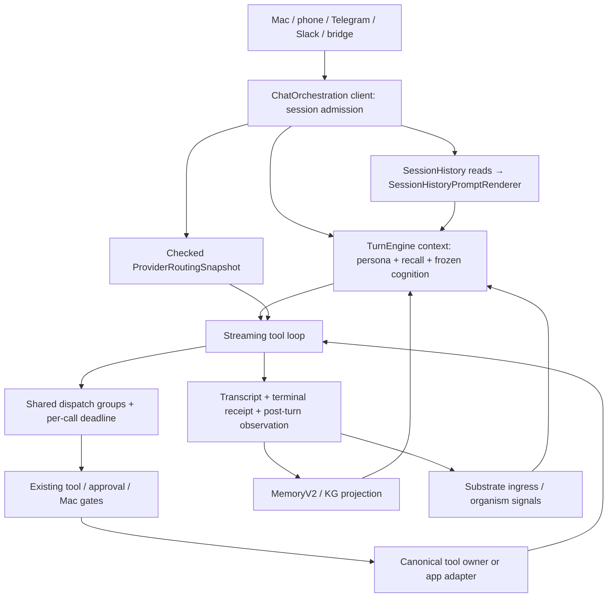

# NativeAgent Architecture Blueprint

## Persistence ownership (2026-09-26)

PersistenceCore owns generic JSON/JSONL I/O, atomic and durable writers, locks,
file observation, data roots and paths. Domain stores live in Procedures,
Transcripts, TurnTrace, Studio, Desk, GitHubConnector, Skills, ChromeControl,
ChatTurnRuntime, ChatSessionWork, ChatToolRuntime, AgentConversations,
AgentWorkspace, Cognition, ActivityWatch and SwarmRuns. BackgroundLoops owns
physiology self-write tracking. NativeAgentCore owns the shared causal/motor
value contracts, SSE framing and display clock; GrokLink owns the shared link
credential; Privacy owns receipt/app redaction. FeedPolicy owns the cross-owner
feed budgets and path registry; PersistenceCore applies those policies through
generic capped writers, preserving the raw-append guard.

DeviceSync owns local iCloud bookkeeping paths and completed-command marker
scanning in `DeviceSync/State/ICloudSyncStatePaths.swift`. Its dependency-free
`DeviceSyncState` target serves DeviceSync and DoctorChecks without introducing
a cycle through the sync runtime, Cognition and BackgroundLoops.
The same state target exposes an in-process, read-only bridge health reader.
`iCloudBridge` supplies its active transport and normal receive/setup results;
Doctor combines that snapshot with the running process's signed entitlements.
Reading health does not probe, change transport selection, or write sync state.

`readJSON(_:ifMissing:)` defaults only for a missing file. Existing unreadable
state throws. Unparseable bytes are copied beside the original as
`<filename>.corrupt-<SHA256 prefix>` with the durable private-file writer, and
the read throws with the original and quarantine paths. The original is never
moved or deleted by reading. Owner mutations stop on a failed read; operational
observers report the failure and skip work. Missing-state defaults and persisted
JSON formats are unchanged.

## Everyday AX context projection (2026-09-21)

- Workspace's bounded 18-window strip derives entirely from resident references;
  direct area launchers avoid Home trips without owner I/O. The strip
  opens an exact source/draft directly; explicit app-window selection uses the
  canonical `go` gate and fresh screen read. Back, refresh and restoration do
  not activate apps. Structured Computer views bind the observed app identity,
  retain it through persistence, and hide motor actions while it is behind
  another app. Browser controls remain lease-bound; no handle is persisted.
  Document text offers at most six ordinary HTTP(S) hyperlinks from its bounded
  returned window; only explicit selection opens a source or background tab.
  Browser headings bind to the observed page title and exact lease; an expired
  live view offers explicit reopening of its saved URL, never effect replay.
  New saved browser windows retain the observed tab ID, full title and URL as
  references, not a lease. Explicit window selection reacquires only that exact
  tab through the normal browser owner and reads fresh controls; changed or
  missing targets fail without a substitute. Old address-only bookmarks remain
  readable and can explicitly open a new tab. Back/refresh never reacquire.
  Same-titled resident windows receive distinct numbered labels stable across
  recency changes. Oversized Workspace results preserve exact navigation beside
  retained reading pages when it fits the existing 48,000-byte provider ceiling;
  this neither invents action IDs nor increases the response cap.
  Calendar day/calendar/lookahead selections survive a saved return. Today
  composes two bounded, gated readers only when selected (eight events and
  eight reminders); it owns no task, schedule, completion or permissions.
- Exact helper windows use `bot_list(id)` and preserve UUID identity. New
  `bot_update` forms expose individual settings and pack the nested owner object
  only at submission; current schemas and route rules remain authoritative.
  Each opened settings view reads and labels current owner values separately
  from the agent's entered changes. Those observations never become defaults
  to submit or persisted authority. An absent output format is explicitly empty.
  Legacy object-shaped drafts retain their old shape. Saving/creating/pausing
  reads the exact resulting helper when its identity is available, without
  running it. Existing context and shelf results remain with the bot owner.
- Selected Messages conversations use `MacMessagesHistory`, a utility-priority
  read-only SQLite view of the Messages-owned database. Exact GUID and indexed
  joins are required; each request has a two-second execution budget, 150 ms
  lock wait, at most 30 records and 16 KiB plain text. No body collection runs
  in list/Home, no database copy/cache is created, and macOS Full Disk Access
  plus existing Messages read authority still apply. Positive Int64 older-page
  cursors persist with the exact thread; text-budget exhaustion never skips
  unread rows. Supported Foundation typedstream string bodies are decoded with
  a bounded pure-Swift wire reader (64 KiB archive maximum), not archived object
  instantiation. Unknown archives, attachments and special records stay explicit.
  Parent cancellation propagates to the utility reader. Writes remain
  independently gated/off as configured. Inspecting human correspondence keeps
  its window but attaches it to focused work only on explicit Keep.

- `AgentWorkspace` and `AgentWorkspaceProjection` provide the default native
  workspace: topic → work/source → related document → agent discussion → Back.
  Swift binds offered actions to exact owner targets and the verified chat.
  The bounded, disposable navigation actor stores references and document
  fingerprints and bounded labeled effect receipts, never facts or permissions. Each action re-enters
  the canonical dispatcher's normal gates under the actual tool name. Sends
  consume their action before dispatch; navigation only revisits reads.
  Explicit Discuss rereads the opened text window, refuses changed evidence,
  and submits the complete composed message through the normal send gate.
  Contact pages stay bounded; document/source readers retain continuation.
  Compact contact cards omit transport recipes, and a direct return action
  reopens the selected work without walking each intermediate location.
  `workspace` replaces `work_context` on the unchanged 22-name tool floor;
  detailed readers and existing conversation owners remain authoritative.
- `AgentConversationStore` retains an optional bounded exchange cache beside
  each existing conversation bookmark. Begin records the submitted message only
  after admission; owner updates and terminal callbacks replace the matching
  operation's answer/status without appending duplicate exchanges. Legacy
  history is not synthesized. `AgentConversationHistoryView` presents four
  chronological recent exchanges or an exact retained exchange; opaque earlier
  boundaries stay scoped to that conversation and still enter its read gate.
  Workspace exposes Earlier messages, Read exchange and Recent messages beside
  Reply. History views omit the competing latest answer while retaining current
  session readiness; exact exchanges can open their preceding page. Selected
  source views offer up to three already-kept discussions directly, carrying
  exact agent/conversation/source bindings without another contact inventory.
  The cache is at most 32 exchanges / 64 KiB, each message at most 8 KiB
  with disclosed clipping; whole conversation storage remains capped at 50 MiB.
  It is neither provider context nor a replay queue. The peer owns its original
  continuing session, bots keep their existing continuous-session/shelf readers,
  and remote history retains the same untrusted-data boundary.
- `AgentWorkspaceFind` composes an explicit query from the existing gated
  work/history, artifact and memory readers, sequentially with at most 6+3+3
  selectable results. Source failures remain visible alongside successful lanes.
  It adds no index, filesystem crawl, model routing or background work. Find
  references persist with Back history; opening a result retains its exact owner.
  Workspace normally shows essential navigation; Show workspace controls reveals
  specialized searches, conversations and saved arrangements. Only presentation
  expands: current targets, drafts, permissions and owner outcomes stay intact.
  Compact desktop metadata retains storage failures and unfinished-draft counts.
- `AgentWorkspaceEnvironment` extends that surface across memory, research,
  skills, computer/browser, files/creation, helpers, saved replies, ongoing work,
  calendar, reminders, mail, messages, connections and current state. Home reads
  capability metadata, one checked permission snapshot and one local browser status;
  each destination reads its canonical owner on demand. `AgentWorkspaceReadiness`
  labels explicit read-only choices and unverified access, hiding revoked actions
  without changing the canonical execution gates.
  Knowledge, Apps and Activity projections bind actions from exact structured
  owner fields, never instructions embedded in prose. The live capability
  catalog supplies further actions without enlarging the 22-name default floor.
  `AgentWorkspaceForm` derives fields from the current owner schema, keeps
  selected targets immutable, rechecks the schema before submit and dispatches
  through the same real tool gates. Effects consume their action before dispatch
  and retain a bounded receipt; refreshing it never repeats the operation.
  Successful file/skill/memory/Desk writes lead to a separately gated current
  read with the original action receipt attached; ambiguous effects are not
  retried. Browser actions read their exact still-owned lease after bounded
  load observation; loading/refusal stays explicit. Generic pages retain all
  offered items and the original work anchor survives bounded navigation.
  Folder creation binds an absolute destination before collecting content;
  Open places holds 24 recent owner locators plus the original work anchor,
  plus bounded unfinished resident forms, never a replayable effect. Forms keep
  partial entries through detours and validation, offer direct field/choice
  selection. Four drafts are retained independently of arrangements; completed owner
  outcomes remove them, while failures preserve editable recovery. Uncertain effects
  require explicit review before another attempt. The guarded recovery draft is saved
  before dispatch. Optional fields unfold on demand; allowlisted input-only drafts
  can be saved, while credentials, connection authority and live handles cannot.
  Invalid fields expose direct Correct actions and a needs-correction state;
  unavailable forms offer a schema refresh without submission. Unknown effects
  keep outcome review separate from editing. Previous-result reads bind only
  immutable selected targets, never subsequently edited form values.
  This is a disposable presentation layer, not an intent router or new backend.
- `AgentWorkspaceDesktopNavigation` and `AgentWorkspaceDesktopStore` retain
  scoped owner references for 24 open places, 12 named arrangements, eight Back
  positions and four allowlisted drafts. Each chat file is capped at 512 KiB; each
  form at 64 KiB entered values and 131 KiB schema. There are 64 resident chats;
  capacity refuses new admission instead of evicting unsaved/temporary drafts.
  Live action handles, loaded evidence, effects, browser leases and approvals
  remain ephemeral. Transient storage retries only on later actions (five-second
  minimum spacing), unchanged snapshots do not rewrite, and corrupt bytes remain.
  The private versioned store rejects corrupt/nonregular/oversized state without
  replacement; atomic saves and current-gate rereads preserve owner authority.
  Saved browser URLs expose explicit background opening rather than restoring
  obsolete control handles. Missing references remain navigable and storage
  errors do not rewrite the underlying action outcome. Common website opening,
  page scrolling and file append controls bind owner arguments in Swift.
  Supported reading offsets and source-version checks now survive restart;
  query/source/position cues help recognize a place. Versioned readers refuse
  changed sources rather than silently merging windows. Separate live browser
  leases retain separate URL-only bookmarks. Switching a named workspace clears
  stale interruption return state. Selected file, memory, skill, web and historical
  message evidence can be explicitly discussed with an agent/helper: full returned
  windows are fingerprinted and reread before sharing a labeled bounded excerpt.
- `AgentWorkspaceWorkOverview` adds a 4 KiB authored continuation note and up to
  twelve kept exact references to the existing saved desktop. This work exposes
  the full context; ordinary views carry a short note preview. Named workspaces
  save/switch those associations independently of the rolling recent places.
  Explicit source discussions attach the source and resolved conversation,
  including an uncertain send with a recoverable canonical route. Exact protocol
  reply selectors are never downgraded to latest. Notes are agent-authored
  navigation context, not canonical completion, evidence or a second task ledger.
  Focus on these places trims unrelated recent references and then automatically
  keeps successful opened detail sources, within twelve slots; lists, searches
  and unavailable reads do not become attachments. Drafts remain reachable.
  One dated last-action receipt retains the owner outcome before follow-up and
  updates with its current readback, including a byte comparison for complete
  file replacements. Failed/unknown outcomes replace the previous success;
  requirements are never automatically declared complete.
  Up to 24 last-action observations also follow exact durable places inside
  each saved arrangement. Kept references are protected when old observations
  age out. File evidence is no longer displaced by an unrelated conversation;
  selected views, Open places and This work show the dated observation for
  that place. Fresh browser readbacks bind their current URL, not the lease's
  former bookmark. These are historical observations, not current verification
  or an action history; the existing 512 KiB/chat store cap remains enforced.
  `AgentWorkspaceFileRevision` prepares complete bounded UTF-8 text in the
  ordinary write form with immutable path/content hash; the file owner refuses
  changed sources immediately before replacement and normal readback reopens
  the result. The guard persists with the draft, but is not atomic CAS against
  independent writers. No background owner reads or new permission route.
- `AgentWorkspaceOverview` recognizes resident places without reading owners:
  attention and unfinished drafts precede return points and recent places.
  Home offers at most three continuation actions; completed/discarded drafts
  cannot reappear through an old return reference. Saved arrangements summarize
  their selection and three recent places. Conversation counts describe only
  the current bounded page and never acknowledge replies.
  `WorkContextQuery` measures whole-word topic coverage in a bounded passage,
  avoiding incidental repository-path matches. Artifacts disclose partial
  matches; Find prioritizes local topic support among six canonical memory
  candidates and displays three, preserving original recall rank as a tie-break.
  These projections add no index, background scan, provider turn or effect.
  Workspace file forms resolve unbound relative paths against the canonical
  workspace before saving/submission, with symlink-aware confinement. Explicit
  absolute/selected paths retain their existing owner semantics. This avoids
  Full Mac's legacy connector cwd redirecting a Workspace-created file.
  Exact advertised action names in Find offer their ordinary form directly.
  Short exact installed skill names/IDs also offer direct opening actions ahead
  of historical mentions, using the existing metadata inventory and at most
  three matches. Skill bodies remain lazy; unavailable inventory is explicit.
  Old generic memory labels refresh after an exact-ID read; generic web-source
  labels use host/path without credentials or query. Saved helper history opts
  into newest-first order, with query-bound cursors and a descending endpoint;
  the shelf API's ascending default and unread acknowledgement rules stay intact.
  Its comparison describes disclosed history, including failed jobs and short
  headlines, rather than mistaking those recorded outcomes for read failures.
- `AgentWorkspaceWork` and `SwiftToolDispatcher+WorkspaceDesk` expose selectable
  canonical work, parts, dependencies and evidence. The existing `desk_read`
  default stays textual; the workspace requests its typed bounded view. Full
  records have versioned text windows, and work-context current/history lanes
  carry independent continuation offsets with their original query and scope.
  Desk status accepts `reason` and `blocked: reason` into canonical
  `blockedReason`, refusing conflicting reasons. Desk forms accept named values
  when opened; expired form controls point back to the preserved draft in one
  call. Permanent `desk.N` item actions still resolve current canonical state.
- Computer uses public `screen(structured: true)` and `act` with the canonical
  observed frame/handle binding; stale selections never retry by label. Menu items
  retain the observed app/path. One bounded fresh screen follows each action/refusal.
  Calendar/Reminder mutations return the owner list with the original receipt and
  explicit list scope; absent completed/out-of-window items do not imply failure.
- `AgentWorkspaceMail` opens and pages inbox bodies using paired native/RFC
  message identifiers. The Mail owner rechecks both on reply and refuses an
  ambiguous legacy subject match. Search inspects at most 50 sender/subject inbox
  records per page; bodies are loaded only for exact message reads. Operator
  write-off hides sends/replies. `AgentWorkspaceMessages` shows real names and
  participants, binds reply to the exact chat, and rechecks its participant set.
  Apple's Messages scripting dictionary has no transcript reader: the projection
  says this explicitly and offers the Messages app view. No empty transcript is
  fabricated and no chat identifier is reinterpreted as a recipient address.
- `AgentWorkspaceConversations` presents exact scoped agent discussions and
  canonical helper results. `AgentWorkspaceConversation` supplies latest-reply and
  details actions bound to the same contact/conversation, including pending/missing
  result recovery, without automatic polling or resends. `AgentWorkspaceChanges` retains bounded comparison
  hashes only, separating changed replies from progress. Diagnostic Details
  receipts report their own availability and are excluded from conversation
  comparison; switching view cannot manufacture a reply-change notification. Lists never consume
  the last-opened baseline. `AgentWorkspaceArrivals` uses the existing pooled
  file watchers to invalidate scoped conversation and opened human/helper/work
  metadata. Changed owners are read at the next normal context or structured
  tool-response boundary; unchanged owners are not rescanned. Four compact
  notices at a time carry stable, scoped Open pointers and at most 240 characters
  of exact canonical-source preview with sender/status, truncation and provenance.
  Peer prose remains untrusted and marks current peer-data taint when displayed;
  baseline collection consumes no text. Up to 24 resident notices retain decisions/failures
  over ordinary progress. Opening reenters the owner gate, with an explicit
  return to the interrupted path/form/reading arguments. Clearing a notice
  never resolves or retries its source. No provider wakeup or timer is added.
  Initial registration baselines historical state rather than replaying it;
  resident notices are disposable and canonical results remain with owners.
  The existing delegation outcome event runner also projects its already-read,
  complete snapshot into waiting built-in conversation bookmarks. Exact agent
  and accepted-message ID must identify one terminal owner row. The store lock
  preserves operation/scope/selection; canonical receipt absorption writes one
  batch only for phase transitions, including attention to a now-ready reply.
  This updates the watched conversation index without opening a conversation,
  adding a reader/watcher, starting a provider or replaying an effect. Missing,
  ambiguous or incomplete evidence preserves the prior bookmark.
  Return resolves form references against the latest resident drafts, so it
  neither overwrites edits nor resurrects completed/discarded drafts.
  Human index `lastConversationGeneration` excludes tool-only churn; the
  shelf's lazily upgraded `latestByBot` index avoids historical result scans
  on subsequent helper events. `chat_conversations`
  reads the existing human session index/transcript; app-owned `chat_reply`
  uses canonical assistant persistence, exact last-message validation and the
  existing completion-delivery lifecycle. A saved route never grants authority.
- Codex and Claude retain at most 6,000 characters of original executor reply
  in their existing completion/job record, separately from delivery assessment
  or replay payload. Exact message-ID status reads expose that text and its
  truncation flag; bulk listings keep short heads. `AgentConversationView` and
  scoped conversation reads prefer original answer evidence, never stderr or a
  delivery assessment. Old missing replies remain missing. Workspace places
  Reply beside the answer, keeps routing IDs in Details, and returns to the same
  selected conversation. Waiting/uncertain outcomes do not expose misleading
  send controls; connection problems open the existing Connections place.
- `AgentWorkspaceSavedReply` binds Follow up on saved-reply lists and detail to
  the exact shelf entry and helper. It rereads through `shelf_entry`, validates
  both identities and, after a detail read, the whole answer/status fingerprint.
  An explicitly labeled bounded excerpt accompanies the follow-up through
  ordinary `agent_message` into the helper's continuous session. No reply text
  or send instruction is persisted in workspace state. The retained send result
  offers the exact saved-reply readback and current conversation; uncertainty
  and refresh never replay the send. Unfiltered shelf lists resolve helper names
  from one canonical definitions read; missing definitions keep their saved IDs.
  Workspace shelf browsing explicitly uses `shelf_read(include_read: true)`;
  pagination and durable references retain that mode. It projects canonical
  history without acknowledging entries. Default shelf callers also leave unread
  state unchanged; only explicit `mark_read: true` acknowledges returned entries.
  Cursors stay bound to their query.
  Saved-reply place labels use the helper and recorded UTC date. Arrival
  projections coalesce agent/shelf views only when exact helper/entry UUIDs and
  kind match; bounded resident event identities also cover staggered file events.
  Different decisions/failures and later updates from the original owner remain.
- `SwiftToolDispatcher+WorkContext.swift` composes one canonical Desk read with
  bounded continuity history results. Current recorded status, blockers and
  attempts remain distinct from attributed historical excerpts; no resumption
  or completion authority is added.
  The default workspace presents this reader's evidence with native actions.
  Detailed transcript search stays lazy and unchanged; neither adds automatic reads.
  Shared history prompts distinguish picking up work from exact-wording search.
  `ChatTurnExecution` carries the actual persisted run identity from structured
  and text-compatible entry paths, so the active request cannot become its own
  historical evidence. Trace identity is not used as transcript identity.
  Work recall uses local plural-aware whole-word matching and recorded
  same-run tool activity to balance original work turns against history-lookup
  echoes, retaining the newest matching context and exact source locators.
  One excerpt per known run prevents request/answer duplication. This ranking
  conveys neither success nor authority; ordinary history search is unchanged.
- `SwiftToolDispatcher+ArtifactContext.swift` projects existing attachment/tool
  metadata and live Desk references, with exact source reads and explicit
  sampling/version/approval limits. It owns no artifact registry or file access.
- `ToolCatalogSelection.swift` chooses only an explicitly requested unique
  native match after the app/core catalog merge. The normal loader owns schema
  persistence; no tool execution or connection probe happens during discovery.
  The shared same-turn schema refresh recognizes explicit catalog loads, so
  the next provider call receives the newly callable capability in both loops.
- `ProviderToolResultRecoveryStore` retains one latest read cursor per existing
  live turn, preserving query/raw mode and original outcome class. Unavailable
  evidence and ambiguous first reads never trigger action replay.
- `ChromeControlRuntime` retains at most 64 current-tab bookmarks keyed by
  verified chat identity. Existing Chrome leases, observed user sequences and
  exact snapshots remain authoritative. Connection generation changes clear
  bookmarks; stale responses cannot reintroduce them. No foreground takeover.

## Advisory helper removal (2026-09-20)

Jev/TypeSafe is no longer part of the app runtime. Turn preparation, tool
dispatch, memory writes/recall and incoming peer messages use their existing
owners directly, without helper calls or added advice. The `second_opinion`
tool, provider row and lane settings are removed. Session directives retain
legacy provenance decoding solely to refuse old helper-authored hints. Ordinary
directives remain active. Legacy credential paths remain protected by the file
and Mac-control secret guards; no runtime reads those credentials.

## Memories review (2026-09-09)

| File | Ownership |
| --- | --- |
| `MemoriesPageView.swift` | Pending Keep / Don't keep actions retain the AppModel decision path. The page owns the rejected-history reveal count and passes ordered loaded proposals to `MemoriesRejectedHistory`; row reads open the existing `MemoryFullTextView` sheet. |

History reveals sixty additional loaded rows per Show more action, preserving
proposal identity and the separate pending/history reads. No timer changes.
## Shared folder controls (2026-09-09)

| File | Ownership |
| --- | --- |
| `ConnectorsView.swift` | Folder selection and editable sharing form; local search progress, empty results and failure presentation; DEBUG headless control fixtures. |

The folder chooser only fills the form; sharing still calls
`AppModel.addWorkspaceWithReceipt` with the exact path and chosen permissions.
Search calls the existing throwing `NativeClient.searchWorkspace` and retains
its outcome locally. No new Swift files, timers, turn or memory contracts.

## Capability recovery (2026-09-09)

`TelegramPollLoop.swift` retains speech-permission-blocked voice updates in the
existing durable inbox and retries on ordinary ticks, including after restart.
The existing capability callback routes Mac recovery; `TelegramView.swift` owns
the explained foreground speech setup. Launch remains non-prompting.
`DoctorView.swift` keeps Providers primary and exposes device sign-in under an
unconditional technical disclosure, using neutral control copy and unchanged
login actions/accessibility identifiers. No new Swift owners are introduced.

## Mac–iPhone verification retention (2026-09-08)

CloudKit account failures use shared `DeviceSyncAccountFailure` and a typed
`DeviceSyncDrainResult`; an empty successful query differs from failed/skipped
work. `CloudKitDeviceTransport.swift` reports account rejections from all its
bounded CloudKit operations to each bridge. The Mac bridge keeps the failure
in local `icloud/account_failure.json` for Doctor and publishes observable UI
state for a once-per-episode toast. A successful drain with no new account
rejection clears it. The phone projects its own failures through
`MacBridgeClient` / `AliveConnection`. A Mac whose CloudKit token is rejected
cannot reliably send that diagnosis to the phone; the local toast and Doctor
remain authoritative. No new timers or model context are added.

Shared `BridgeMessage.swift` owns canonical signing and field-specific unsigned
resync-envelope diagnostics. Mac `iCloudBridge.swift` validates the hint before
sending through the selected transport. iOS `iCloudBridge.swift` owns durable
`ICloudUnverifiedRecord` diagnostics and defers repeated verification by record
ID, observed pairing version, and key digest. These records are not receipts.
`CloudKitDeviceTransport.swift` keeps the receive cursor before an unverified
phone reply while allowing later independent replies to reach their consumers.
Mac stale-envelope rejection retains evidence without reserving chat/action IDs;
`MacSyncEngine+Inbox.swift` checks freshness before a new action transaction.
Existing files retain ownership; no new Swift files or timer sites.

## iOS reply authority (2026-09-07)

`ChatStore+Sending.swift` checks original correlation/placeholder ownership on
both send continuations. `ChatStore+ICloudReplies.swift` retires the matching
queued handoff at terminal resolution; pairing hints preserve the original
request and only nudge observation. iOS `iCloudBridge.swift` reverifies the exact
reply after KVS refresh and retains unverifiable CloudKit records/Drive files
for another read, without trusting their correlation as a request rejection.
`ChatReceiptStateMachineEvalTests.swift` pins these ownership and verification
transitions. No files, timers, or shared transport owners were added.

## StandingBots storage and runner family

A standing bot is a saved brief with a schedule, an output shape, optional
provider/model/Think/Fast choices, editable per-run and daily allowances, and
one stable ordinary chat session (`bot-<uuid>`). It is a little agent, not a
fetch-and-validate job: it gets the same tool inventory, the same Trust and the
same approval filer as a chat turn. There are no presets, no answer validators,
no JSON answer schema and no HTTP fetcher — a legacy `sources` list still
decodes, and is folded into the brief text as `Sources: …`. Provider, model and
effort are part of the definition and are chosen when the bot is made (User,
2026-09-13: "Bots has no default model; Agent is supposed to pick the model when
they makes one"). A bot always runs on the model it was made with; it never
follows Chat's. `bot_create` refuses a bot without them, the editor requires
them, and a bot saved before this rule shows **Choose a model** on its card and
does not run until one is set (`BotRunnerError.noModelChosen`).

**A run is one ordinary chat turn.** StandingBots owns scheduling,
serialization, accounting and the dated shelf projection; the turn itself is an
injected session closure. `BotRunner` holds the cross-process run claim through
that turn and its terminal persistence, sends the brief (plus the output shape
when set) as the message, and appends exactly one shelf entry. Surface is `bot`,
which makes tool dispatch serial, ends the turn early and incomplete when a tool
is waiting for approval, and keeps failure messages out of the transcript.
A bot turn is a full turn in the ways that matter: it gets a context kernel,
Fluid Context and eligible recalled memories. Desktop interaction and sound
require a normal approval; approval waiting ends the run with the reply so far
kept, and the entry says so. Deletion is soft — the bot leaves schedules and
listing while definitions, audit, shelf and chat history stay.

**Scheduled spend is behind the master unattended-work gate.** `BotRunnerScheduler`
checks Core `WorkshopBackgroundWork.unattendedWorkAllowed` — Trust's **Let the agent
work unattended (bots, practice runs, background improvement)** switch
(`enableAutonomy`, on for a fresh install), OR a Full Mac policy, OR checked Full
Mac YOLO — both before sweeping due occurrences and again after each claim is
won, and in `nextDeadline`, so the gate shut means no *scheduled* occurrence is
reported as a deadline and the loop is never woken for a job the gate would
refuse. Under Full Mac the gate is open whatever the switch's stored value is,
and the Trust page shows that effective state.
Flipping the policy file re-arms or retires that deadline through the existing
watch. Manual requests and `bot_ask` sit outside the gate on purpose: that is
the person asking — `nextDeadline` checks a pending manual request first and
still reports a deadline of `now` with Autonomy off.

**Timing.** `BotRunnerScheduler` projects one job per definition into the
existing `BackgroundLoopsAssembly+TriggerScheduler` event/deadline registration;
no timer is added. Interval cadence is measured from completion, cron and
time-zone math delegates to `SchedulerJobRuntime`, and both respect a
person-owned minimum gap (15 minutes by default, adjustable to 1 minute on the
Bots page — only a person can change it). Definition writes reject intervals
below the current floor while reads preserve saved schedules, and jobs reproject
when the floor changes. Reconciliation rewrites `bots/runner-jobs.json` only
when the content actually differs, so the file watcher cannot feed an unchanged
projection back into scheduler work. A due occurrence is advanced before the run,
under the store lock, so a crash skips it rather than replaying spend. Paused
definitions never dispatch scheduled checks but remain runnable by hand; edits
reset the next occurrence from the definition revision. A cron row that will not
parse is isolated: the job is parked, one failed shelf entry is recorded per
revision, and valid bots continue.

**Event waking (0.4.12).** A definition may carry an optional
`eventTrigger` (source, filter, optional keyword) beside its cadence; absent on
every earlier definition, so the store migrates by decoding nothing. Cadence
stays `manual` for an event-woken bot — the event is the occurrence — and no
cadence case, tool schema or scheduler projection changed. Two listeners, no new
background loop (the count stays pinned at 20): `BotGitHubEventWatcher`
(`Modules/NativeAgentCore/Sources/StandingBots/BotEventIntake.swift`) reads the tracking snapshot's
own `newKeys` on the existing `github_tracking` tick, seeding silently on first
evaluation; each entity key is **claimed on disk before the event is
delivered**, an unwritable claim abandons the pass rather than delivering
unclaimed, `refreshedAt` advances only after the pass so an interrupted pass is
retried against the same snapshot, and a trim never evicts a key whose entity is
still in the snapshot. The Slack socket-mode runner calls
`BotEventIntake.slackMessage` from `handleDurableInbound` behind
`SlackInboundDeliveryJournal.claimBotEvent`, a **persisted** once-only claim
beside the delivery rows (the handler set is in-memory and would re-enter on
recovery), so only channels the runner accepts can wake a bot, and exactly once.
Both hand a `BotIncomingEvent` to `BotEventRouter`, which matches every
definition's trigger, checks the master Autonomy gate (`enableAutonomy`, the
same switch scheduled runs pass) and then enqueues through the ordinary
`BotRunQueue`, so concurrency, pause, deletion and the daily budget are
unchanged. Autonomy off records the event as *held* in `bots/last-events.json`
instead of running it; a rejected admission records *not run* with the reason.
The event text rides **on the queued request itself** (`bots/run-queue.json`
entries are now `{runID, context}`; a pre-0.4.12 bare run id still decodes and
is rewritten on the next write), so it is consumed by the run that claims that
request and can never attach to a Run once or a scheduled occurrence of the same
bot. `BotRunner.run` reads it from its own claim and appends `What woke <name>:`
to the brief; rejecting a pending request drops the text with it — untrusted
outside text that is the run's input, never an instruction to the app. A Slack trigger stores the channel **ID** (nothing in the app maps a name to
an ID, so the editor and `StandingBotsDisk.validate` both refuse a name rather
than ship a field that silently never matches). The bot card reads
`bots/last-events.json` for **Wakes on: GitHub · owner/repo** and the last event.

**Claims.** `BotRunQueue` joins the app dispatcher's enqueue callback to the
same scheduler through durable `bots/run-queue.json` requests — at most one
pending request per bot. `enqueue` rejects a deleted bot and a bot already
queued; `admit` checks concurrency, pause and deletion, and consumes the request
inside the claiming transaction, so an interrupted run leaves nothing
replayable. The daily allowance is not an admission check: it is reserved later,
in `BotRunner.perform`, after the request has been claimed. `bots/<id>/run.lock`
holds a nonblocking cross-process flock for the whole run or ask, with PID and
timestamp metadata; the inode is never unlinked, so kernel release on exit
recovers a stale claim without expiring a slow live writer. Waiters are resumed
under the same lock rather than polling. Definition mutations and accepted
requests emit a payload-free invalidation; file watching remains the
external-write backstop.

**Allowances.** Per-run and daily allowances are per bot and editable. 32,000
tokens and 120 seconds are the defaults a blank per-run field takes, and 256,000
tokens per UTC day is the legacy/default daily allowance; validation requires
positive values and imposes no upper bound, so these are defaults, not caps. The
daily allowance is reserved atomically before any effects and never refunded
after an interruption, with unreadable state throwing rather than resetting.
Recorded `spend.tokens` is **the reserved ceiling, explicitly, not measured
usage**; only seconds are measured. A daily-limit skip produces a failed shelf
entry with no provider work. `BotRunnerDeadline` cancels the run at its
remaining budget and then awaits the cancelled child, so the claim is held while
storage settles and no abandoned writer can overlap a later turn in the session.

**The shelf is evidence, not memory.** It stores the actual reply, artifacts,
dates, session ID, run health and optional stop detail, and never enters context
by itself. The headline is the first prose line of the reply, markdown stripped,
capped at 240 characters — never a table row. History is logically append-only
and never pruned: one file per entry plus an index, with a write-ahead slot
replayed under the store lock before any reader sees it, and legacy daily books
migrated once and byte-verified. Pagination is by append sequence, not run time,
so a backdated run stays pageable; pages cap at 100 rows with explicit
truncation marks, cursors are query-bound, and `since` filters run time
exclusively while `topic` is a literal case-insensitive content match. Reading
acknowledges nothing. Explicit per-reader ID acknowledgements in `cursors.json`
stay sparse by design, preserving unread holes so a later book cannot hide an
earlier one; restart a query with a nil cursor to revisit them.

**Continue in Chat carries the bot's contract.** Opening the bot's session from
the shelf resolves or creates the session row under the sessions lock and hands
the turn `BotChatContract` — the bot's provider/model/Think/Fast tuple and
surface `bot` — so the continued turn keeps the bot's route and its
desktop/sound approval rule instead of inheriting the Chat picker. The brief is
not re-sent; every run already persisted it as the session's user row. The run
claim and the daily allowance stay with `BotRunner`: a person typing in a bot's
session is an attended turn, not scheduled spend. A newest entry that is waiting
for approval opens Approvals instead.

The ChatOrchestration bots tools (`bot_create`, `bot_update`, `bot_pause`,
`bot_delete`, `bot_list`, `bot_run_once`, `bot_ask`, `shelf_read`, `shelf_entry`)
call these public APIs through `SwiftToolDispatcher+StandingBots.swift` and add
no preset or UI. `bot_ask` answers a paused bot and is the one path that needs
canonical body tools. The production `BotsShelfView` reads these stores behind
the rail preference, which defaults to on (`ShellSidebarRail.botsPreviewEnabled
= true`); Bots shipped in 0.4.10.

**Bot Agent Experience.** `StandingBotSchedule` translates a small explicit
schedule vocabulary into the existing cadence owner; store validation still
owns cadence floors. Model choice remains explicit; `bot_list(include_models:
true)` projects ProviderRouting's local model choices and current credential
readiness without probing or changing an account. Non-shipped suggestions are
marked potentially incomplete. Create/update/pause outputs
lead with the saved job and lifecycle semantics; `details` exposes full settings.
`StandingBotContinuity` carries the current brief and output request into every
tool-driven turn, so a first ask or changed job does not depend on an earlier
scheduled run. `agent_read` on a bot opens its latest full shelf entry through
the gated `shelf_entry` owner, while explicit entry IDs remain exact reads and
explicit listing limits retain shelf pagination. `BotRunConversation` records
only a verified requesting session's return address and exact accepted queue
request in `AgentConversationStore`; `AgentConversationContinuation` reconciles
that request against the canonical bot queue/shelf and brings its result back
through the existing full Agent continuation and delivery lifecycle. Internal
`bot-run:` bookmarks are distinct from the bot's normal conversation, so a
queued check does not block ordinary follow-up. No second bot scheduler,
transcript, authority store, or automatic run replay is introduced.

NativeAgent peer continuations settle only from an exact terminal receipt:
`remote_evidence.status=ok` with a terminal `original_status`. Pending receipts
also carry `original_status=working`, which must never settle the conversation.
If bridge admission is full before a resident turn starts, the continuation
keeps its frozen receipt/digest and retries admission after 30 seconds through
the existing runner, without rereading or resending the original effect.

`ContentView` retains one Bots page after first visit to avoid AppKit text-control
accessibility observer teardown leaks during Chat/Bots navigation. Visibility
gates actions and AX descendants, cancels the shelf watcher/session read, stops
BotMark motion and suppresses the hidden prose tint rectangle. Reentry's initial
file event refreshes canonical state. This is bounded window-lifetime retention;
quiet offscreen rendering remains separate and does not start the live watcher.

The retained Chat and Bots pages stay in the shell's shared SwiftUI composition
so Liquid Glass keeps its existing backdrop relationship. Opacity, hit testing,
disabled state and accessibility visibility gate inactive pages; their explicit
visibility guards cancel hidden work. Do not split these pages into separate
native hosts as a performance shortcut without verifying actual behind-window
transmission as well as interaction. The September 14 native-host experiment was
withdrawn after User reported lost transparency; the glass materials/tint remain
at their pre-experiment values.

Main chat follow projects `ChatScrollLayoutExtent` from content height and
available viewport height. Offset changes do not invalidate that projection;
text-only publications do not issue redundant scroll commands. The existing
`ChatScrollCoordinator` retains follow/disarm, coalescing and clearance settles.
Main/detached streaming-tail observers are enabled only for open transcript
search; the bubble remains the owner of streamed text rendering. Normal app
installation defaults to optimized release compilation, with explicit debug
override retained for diagnosis.


| File | Responsibility |
| --- | --- |
| `StandingBotsModels.swift` | Definitions, migration decoding, stable chat identity, timing, execution limits and reply/status/artifact values; legacy shelf read compatibility. |
| `StandingBotsDisk.swift` | Checked paths/JSON, atomic durable writes, cross-process store transactions and settings validation. |
| `BotDefinitionStore.swift` | Create, update, pause, preserved deletion and definition audit. |
| `BotRunner.swift` | One ordinary session turn, shared run claim, daily reservation, exact dated reply projection. |
| `BotHeadline.swift` | Shelf headline from the reply's first prose line, markdown stripped and capped. |
| `BotRunnerDeadline.swift` | Cancel a turn at its duration and retain ownership through settlement. |
| `BotRunQueue.swift` | Cross-process single-flight claims, durable manual requests and per-bot daily reservations. |
| `BotRunnerScheduler.swift` | Existing scheduler projection for interval, cron and manual timing. |
| `ShelfStore.swift` | Durable append, indexed pagination and sparse acknowledgments; no answer policy. |
| `BotLegacyHistory.swift` | Read-only migration material from old shelf replies, notes, documents and failed answers; preserves originals. |
| `ChatTurnExecution.swift` | ChatTurnContracts owns request-scoped waiting/tool/choice state; the same-named ChatTurnRuntime file owns the concrete client execution extension. |
| `TurnTokenBudget.swift` | Shared remaining output allowance and retained partial output across provider calls. |
| `ProviderTurnChoice.swift` | Explicit provider/model/effort/Fast tuple scoped to one turn; no picker writes. |
| `Modules/NativeAgentCore/Sources/ChatToolRuntime/BotChatContract.swift` | ChatToolRuntime: The bot's checked provider tuple and `bot` surface for Mac and iCloud continued turns, resolved from the `bot-<uuid>` session id. |
| `Modules/NativeAgentCore/Sources/ChatTurnRuntime/ChatStreamErrorText.swift` | Shared Mac/iPhone stream-error wording; the caller supplies the visible retry control label. |

Tests: `StandingBotsTests.swift`, `BotRunnerTests.swift` and
`BotContinuityTests.swift` (StandingBots), `StandingBotsToolTests.swift`
(ChatOrchestration), `BotsShelfTests.swift` and
`TriggerSchedulerPhysiologyTests.swift` (app).
Focused proofs: `runIsASessionTurn`, `approvalNeededEndsWaitingWithReplyKept`,
`capKeepsPartialWork`, `migrationKeepsOldEntriesAndDefinitions`,
`noOverlapForOneBot`, `followUpLandsInTheSameSession`,
`botsModelChoiceReachesProviderCall`, plus the existing durable storage/cursor
proofs. Build the integrated app then StandingBotsTests sequentially, run the
focused tests, then timer and architecture checks. No install is part of stage 2.

## Recent contract notes

A2A client interoperability (2026-09-19): `AgentA2AWire` selects the first supported
1.0 or 0.3 interface in declared order, and maps send/get/cancel plus streaming into one
result model. `AgentA2AStream` retains task identity and requires explicit task
state evidence; EOF and legacy `final` never prove completion. `AgentPeerHTTP`
keeps exchanges bounded, refuses redirects and permits HTTPS or exact loopback
HTTP destinations, retaining the same-origin credential guard. The owner-run official Python SDK live check
is `script/a2a_live_check.py`; no Python dependency enters the app. `AgentA2AWire+Mapping` owns shared content and
enum conversion. The app server exposes all eleven 1.0 operations over JSON-RPC
at `/a2a` and HTTP+JSON under `/a2a/`, including authenticated extended cards and
owner-scoped task/push-config listing. REST shares the existing parser/task owner;
only its request paths, error envelopes and SSE framing differ. The card declares
all three 1.0 bindings and legacy 0.3 JSON-RPC; `A2A-Version: 0.3` selects the legacy card.
Push configuration stays in the task actor for this app run. State changes deliver
minimal status notifications through the OS HTTP client with validated, pinned DNS,
no redirects/proxies, bounded retries and timeouts. Client `agent_read` without a
task ID lists tasks; authenticated extended cards are fetched and used per request.
Only loopback peers receive the active app's authenticated loopback callback URL.
The callback retains bounded wake hints; GetTask remains authoritative. Remote
peers use streaming/polling. `NativeAgentA2AGRPCListener` owns a separate ephemeral
IPv4 loopback HTTP/2 listener, publishes `a2a-grpc.json` beside `bridge.json`, and
advertises the address only after binding. `NativeAgentA2AGRPCService` checks the
same bearer/peer authority before projecting protobuf requests through the same
endpoint; `AgentA2AGRPC` projects outbound calls into the existing response model.
The card's declared order still selects the first supported binding. A gRPC port
may differ from the card's port on the same host and scheme; HTTPS uses system TLS
verification. Generated A2A v1.0.0 messages/interfaces are shared in AgentLinkTransport,
with development-only regeneration in `script/regenerate_a2a_grpc.sh`. See
`docs/a2a-grpc-impact.md` for dependency and build measurements.

CS2 (2026-09-27): Core `AgentLinkTransport` owns outbound A2A/ACP wire values,
HTTP/gRPC/stdio exchange, stream parsing, push hints and the ACP connection pool.
Its dependencies are shared Core support, PersistenceCore, ProviderRouting's
existing failure vocabulary and the gRPC products. ChatOrchestration no longer
declares gRPC dependencies; its compatibility re-export preserves surface imports.
Chat policy lives in ChatTurnRuntime; contact storage, approval cards, host setup
and conversation state live in AgentConversations. HTTP live updates cross a typed callback into the
existing conversation hub; ACP launch and bounded process cleanup cross
`AgentACPProcessHosting` into the app, installed before runtime ingress.

| File | Owns |
|---|---|
| `Modules/NativeAgentCore/Sources/AgentLinkTransport/AgentA2AWire.swift` | Negotiated interfaces, request/result values and wire normalization. |
| `Modules/NativeAgentCore/Sources/AgentLinkTransport/AgentA2AWire+Mapping.swift` | Shared A2A content and enum mapping. |
| `Modules/NativeAgentCore/Sources/AgentLinkTransport/AgentA2AWire+Operations.swift` | A2A operation request construction. |
| `Modules/NativeAgentCore/Sources/AgentLinkTransport/AgentA2AStream.swift` | Bounded SSE frames, display updates and explicit terminal evidence. |
| `Modules/NativeAgentCore/Sources/AgentLinkTransport/AgentA2APushReceiver.swift` | Bounded push wake hints; task reads remain authoritative. |
| `Modules/NativeAgentCore/Sources/AgentLinkTransport/AgentA2AGRPC.swift` | Outbound gRPC transport and response projection. |
| `Modules/NativeAgentCore/Sources/AgentLinkTransport/AgentPeerHTTP.swift` | Bounded HTTP transport and typed live-update callback. |
| `Modules/NativeAgentCore/Sources/AgentLinkTransport/AgentACPClient.swift` | ACP stdio protocol, ordered pipe reader, turn deadlines and retained connection pool. |
| `Modules/NativeAgentCore/Sources/AgentLinkTransport/AgentACPExecutable.swift` | Approved executable identity and bounded version-probe orchestration through the process port. |
| `Modules/NativeAgentCore/Sources/AgentLinkTransport/AgentACPProcess.swift` | Small app-supplied process launch/cleanup contract and forwarding boundary. |
| `Modules/NativeAgentCore/Sources/AgentLinkTransport/Generated/a2a.pb.swift` | Unchanged generated A2A protobuf values. |
| `Modules/NativeAgentCore/Sources/AgentLinkTransport/Generated/a2a.grpc.swift` | Unchanged generated A2A gRPC interfaces. |
| `Modules/NativeAgentCore/Sources/AgentConversations/AgentLinkTransport.swift` | AgentConversations: Import compatibility and conversation-owned live-update adapter. |
| `Modules/NativeAgentCore/Sources/AgentConversations/AgentPeerTransport.swift` | AgentConversations: Existing peer credential policy and dedicated Keychain access; HTTP implementation moved. |
| `MacAgentACPProcess.swift` | macOS spawn, process-group signals and bounded reap; Core owns connection decisions. |

Agent conversations (2026-09-21): the lazy `agent_message` / `agent_read` facade
accepts a unique contact name and retains the current conversation within the
initiating Agent session. Optional human labels select separate discussions;
explicit exact IDs remain advanced recovery overrides. A new start replaces
the active binding only after acceptance, and failed continuation cannot silently
create a replacement. Compact results lead with the speaker, reply and honest
state; `details` retains technical receipts. Pending replies stay protected
against duplicate sends. A new explicit message may recover a
confirmed `sent=false` pre-dispatch refusal through fresh adapter admission;
pending approvals and uncertain sends cannot use that recovery path. Supported pending remote replies
are collected underneath this facade, while existing coding-agent callbacks
keep their delivery owner. Send-only and standalone adapters remain explicit
about their limits. No new persona, memory store or authority boundary is created.
`AgentConversationStore` retains scoped operational bookmarks and a bounded
latest-receipt cache in `agents/conversations.json`; it is not a transcript or
authority store. `CanonicalToolNameDispatcher` manages this continuity before
ordinary adapter dispatch. Remote reply recovery uses the existing
`DelegationOutcomeEventRunner` lifecycle rather than a separate scheduler.

Agent communication (2026-09-15): `AgentConversationRouting` translates local
`agent_message`/`agent_read` before the existing gates; both facade and executor
policy names survive. `SwiftToolDispatcher+AgentCommunication` owns configured
remote exchanges and directory projection. `AgentPeerStore` owns the sole contact
config, `AgentPeerHTTP` bounded HTTP, `AgentPeerCredentials` dedicated peer keys,
and `AgentA2AWire` negotiated standard protocol projection. Generic NativeAgent
routes reuse `ClaudeBridge` and its existing receipt stream. Canonical transcripts,
execution owners and listener boundaries remain unchanged. See `docs/agent-communication.md`.

Peer approval policy (2026-09-20): `PeerTurnEffectPolicy.requiresPeerApproval`
is shared by SecurityCenter's inbound-origin checks and the chat dispatcher's
post-reply gate. Routine agent messages do not acquire a new approval merely
because a peer replied. Destructive capabilities and unknown code execution
retain approval. Existing contact binding, revocation and domain gates remain;
human Full Mac permission resolution is unchanged.

Bidirectional interoperability (2026-09-15): `AgentPeerDiscovery` performs bounded
same-origin card discovery before pinning an existing contact. Desktop contacts
retain exact app identity and return ordinary interaction guidance, never a
delivery claim. `NativeAgentA2AWire` and `NativeAgentMCPWire` project the existing
authenticated bridge's enqueue and receipt owners into A2A and MCP. Protocol
namespaces isolate these full chat sessions from human chat IDs. The bundled
Swift `NativeAgentLink` executable relays local command/stdio clients into MCP;
it owns no runtime, credentials store or transcript.

Inbound contact continuity (2026-09-19): universal routes identify the contact
from its bearer alone; old dual-header clients remain supported. The HTTP
ingress adapts verified contact credentials only on contact URLs, leaving builder
authentication unchanged. Install-scoped credentials take precedence over legacy
keys; legacy keys remain accepted and disconnect removes both forms.
An omitted conversation selects the contact's stable
conversation across MCP, A2A and plain messages; explicit conversation IDs
continue separate conversations. Default A2A context IDs map to the same stored
MCP conversation. Existing explicit A2A contexts retain their original paths.
Names come from the verified contact, including titles for trusted turns.
The first real inbound message records historical proof. Current contact projections
claim connected/ready only while the bearer is readable and resolves uniquely to
that contact through the same check as the door; otherwise they ask to reconnect
and retain prior proof as history. ACP session proof remains transport-scoped.
A credential-bearing contact cannot
move to another endpoint or workspace. A2A tasks retain replies for reads after
restart; replay claims never restart an accepted turn. Before execution, a task
retains its canonical session/run binding. Restart recovery reconciles an unfinished
task against that exact transcript reply and persists the recovered completion;
only an unfinished turn is interrupted. Unreadable evidence remains an error.

Local discovery (2026-09-19): `AgentDiscoverySession` caches read-only candidates
for the app session and shares overlapping explicit refreshes from opening
Agents or `agent_contacts(discover: true)` when the person asks about agents.
Ordinary contact reads never initiate discovery. `AgentHostDirectory` uses Launch
Services bundle identifiers and executable files in fixed ordered installation
directories; it never runs code or reads shell PATH. `AgentPeerDiscovery` reads
public cards only on installed hosts' documented ports. Each request is capped at 0.6 seconds, with
no credentials, redirects, DNS or system proxy. Candidates expose settings paths
or local A2A addresses; discovery never saves a contact or grants trust.

Connect by name (2026-09-18): `AgentHostDirectory` is the known-agent table as
DATA — one verified row per agent host, with read-only install detection, its MCP
config path and format. `AgentHostConfigWriter` owns one splicing writer per
FORMAT (JSON `mcpServers`, Codex TOML): it replaces only our own entry's bytes,
backs the file up with a timestamp beside it, writes atomically, and refuses a
file it cannot walk rather than overwriting it. `AgentHostConnection` mints the
per-connection key, performs the setup, and composes the one approval card, which
reaches the person through the existing confirm tier and the new
`PreApprovalToolValidating.approvalCardReason` seam. `nativeagent-link` carries
that key from its entry's environment into the bridge's existing
`AgentBridgePrincipal` headers, so the inbound turn is attributed to that
contact. No routing branches on a host id; no app is ever launched or restarted.

Grok Bot (2026-09-19) declares a distinct `grokBot` route, without MCP settings.
`GrokBotRoute` owns single-POST acceptance and nonsecret pending correlation;
`GrokLinkCredential` stores the webhook and local helper registration only in
Keychain. Core `Agents/GrokBotConnection.swift` owns connection coordination;
its `GrokBotConnectionPort` binds app concrete sends, credential reads and desktop
effects through `AppGrokBotConnectionPort.swift`. The desktop conversation owner bootstraps the
named routine in the open chat through native foreground click/paste/Return, then import credentials using native AX after visible submission confirmation; `GrokSecureSetupCard` owns Bot selection and the sole secure paste
fallback. `/agent/grok-reply` authenticates through `AgentContactRoutes` before
`GrokInboundReply` claims the pending ID, enqueues once in its original session,
and wakes through the canonical chat client with peer provenance. Grok scopes
cannot access general contact operations or gRPC. See `grok-bot-connection.md`
for the unverified installed AX contract and the reserved live acceptance drive.

ACP contacts (2026-09-19): `AgentHostACP` declares Gemini CLI (`--acp`),
Goose (`acp`), and standalone Cursor CLI (`cursor-agent acp`, not the editor).
Registry reference versions are 0.60.0, 1.51.0, and 2026.09.15 respectively;
other or unknown installed versions show an untested-version note. Connect
consent names the resolved executable, reported version, and starting folder;
the shared `approvedExecutablePath` is the sole launch binding, with the ACP
identity receipt required to match it. That canonical path, inode and SHA-256 are rechecked immediately
before spawning by path with the argument array, including version probes and
the sandbox wrapper. The historical mount device number is retained as metadata,
not compared as durable identity across restarts. A mismatch refuses the message and raises fresh consent
showing the changed identity/digest; approval does not replay the message.
The card describes ordinary Mac app-launch trust in files in the person's folders.
Reconnect
renews consent for a changed installation or explicit project folder. Default
folders use `agent-bridge-runs/<host id>` inside the app workspace; existing
contacts retain their approved folder. Vendor restrictions are Gemini
plan + sandbox, Goose chat, and Cursor ask + sandbox. They are not NativeAgent
enforcement boundaries: the CLI runs as the person and can act directly;
NativeAgent asks only when the CLI asks it. `AgentACPClient` negotiates wire version 1,
returns its session ID as `conversation_id`. An app-owned bounded connection pool
retains live sessions between messages, including command-only Hermes sessions
that Hermes has not yet saved. Cold Hermes restoration requires identity evidence;
missing or ambiguous sessions refuse before sending the new message. Other ACP
peers retain their negotiated restore behavior and explicit context-loss reporting.
History replay is excluded from the new answer, and the permission mode is reapplied.
The client streams new prompt updates and accepts completion only from the prompt
response's `end_turn`. Cancellation sends `session/cancel`, cancels outstanding
permission requests, closes stdin and awaits owned process-group shutdown,
retaining the unreaped leader through escalation even if it exits early. A
denied request cannot report successful completion. `AgentACPApproval`
uses the canonical inbox and lifecycle events for one-operation approvals,
storing only a redacted, bounded preview resolvable on the local Mac. Captured
local chat origin places live permission cards in the initiating chat without
making them replayable tool approvals. Reconnect
retires old persisted proof; executable changes invalidate turn readiness.
Optional filesystem/terminal services are not advertised. `session/new` receives
the existing link tool with a per-contact key; no host settings edit is needed.
The contact projections distinguish the ability to start a turn and receive an
answer from a proven round trip. Completed ACP answers write the same scoped
round-trip receipt as other transports; timestamps alone are not readiness,
and failure retains historical proof while marking the connection unavailable.
Disconnect and app termination close retained connections; idle expiry bounds
resource retention. The peer owns conversation persistence; the pool stores no
transcript. Delayed answer recovery is not claimed.

Universal command continuity (2026-09-20): `AgentHostCommandLine` declares
Codex JSONL session capture and exact `exec resume` arguments. The command
adapter returns the real `thread.started` UUID as `conversation_id`, verifies
the same identity on resume, and marks missing or conflicting proof with
`continuation_available: false`. It never invents an identity, uses `--last`,
retries automatically, or silently opens a replacement conversation. The final
reply file remains separate from protocol stdout. Claude Code's existing UUID
contract and the built-in Codex/Claude/OMP builder lanes remain unchanged.

Antigravity messaging grants (2026-09-20): `AgentHostConfigWriter` owns the two
exact MCP messaging rules in Antigravity settings. Connect/reconnect preserves
user Ask/Deny rules, rejects malformed/conflicting authority, and records only
its own additions for disconnect. No blanket tool grant or automatic callback
probe is introduced. Installed explicit callback acceptance reached the
canonical full Agent session and completed reply receipt.

Host review correction (2026-09-19): Grok Bot and VS Code have no settings row.
Cursor editor global/workspace settings are separate from the Cursor CLI.
Gemini CLI, Goose and Cursor CLI declare ACP routes; none runs a one-shot
command. ACP connection supplies reply tools to the session without editing host settings.
Connected ACP contacts can start turns once their approved executable binding
is current; a saved connection alone is not round-trip proof.
ACP timeout evidence distinguishes initialization, conversation startup and
mode setup from prompt delivery. Before the first attempted prompt write,
timeouts report `sent:false` with the owning phase. Once a prompt write may
have begun, delivery remains unknown and automatic replay is forbidden.
JSON disconnect locates the recorded command plus peer id across renamed or
moved entries, restores only the replaced entry, and preserves unrelated edits.
Removal precedes key revocation; its receipt survives until revocation succeeds.

One verb and honest states (2026-09-18): a row may also carry `AgentHostCommandLine`
— executable name, argument templates, where the reply lands — and ONE generic
adapter in `SwiftToolDispatcher+AgentCommunication` reads it, so `agent_message`
to such a contact runs that command once, stdin closed, in the contact's stable
working directory, and returns its reply in the same call. Each run has its own
temporary reply directory. It takes the ordinary path for
running a command: the same Full Mac `file_ops` gate, sandbox profile and audit
receipt as `shell`, and the same declared capabilities. A host with no command
line has no outbound route and says so; its window is never read. The run gets a
scrubbed environment (this app's own holds provider keys and the bridge token),
an end-of-options marker before the message, a bounded reply read, and its
process group settled on exit as well as on timeout. The entry written into the
other agent's settings also carries `NATIVE_AGENT_BRIDGE_DESCRIPTOR`, so the key
reaches the install that minted it rather than whichever one owns the machine-wide
rendezvous. `PersistenceCore.InstallPaths` owns external path and entry namespaces;
both shipped bundles keep their historic paths. Chrome's fixed manifest records its
bundle owner, checked under a directory lock on registration and removal.
`AgentHostDirectory`, `ClaudeBridge`, bridge readers and helper launches use that
same path owner. `AgentPeerStore` owns inbound/outbound timestamps and separate
command-line round-trip and MCP return-path proofs, shown with their routes and
times in contact tools and rows. A normal valid CLI reply keeps the contact Ready.
Connect runs one disclosed probe where a command line exists; its stdout cannot
prove the MCP return path. Only authenticated inbound text matching that contact's
outstanding, unexpired one-time nonce proves that path. Probe completion consumes
the challenge; unrelated traffic never promotes readiness. A failed MCP check
does not erase an already proven CLI route.

Agent reply presentation (2026-09-15): `AgentConversationView` projects authorized
local and peer reads into compact exchanges and exact read/reply actions.
`details: true` retains the original owner receipt. `DelegationStatusProjection`
keeps retained Codex executor text separate from the delivery assessment; bot
shelf reads add configured display names without changing stable references.
No new history store or execution/completion inference is introduced.

Desktop conversation execution (2026-09-15): the app dispatcher consumes Core's
desktop route plan after ordinary admission and runs `DesktopAgentConversationRoute`.
A request-scoped `DesktopConversationTools` allowlist exposes only screen/go/act/
wait and the canonical read/tool_result_page tools through the existing gated ephemeral
tool-turn assembly. Exact app/label,
foreground, single-type/submission, operation budget and observed-text checks
bound execution. One app-local busy guard prevents overlapping desktop routes.
The operator has no persistent persona, transcript, shell or permissions owner;
Agent stays in their ordinary full session and receives the conversation result.


Agent Experience (2026-09-15): exact `read_chat_message` lookup uses canonical
`SessionHistoryReader.messagesWithStats(strictEvidence:true)` and reports
unreadable/malformed scope without treating it as absence or replacing damaged
UTF-8 as an exact quote. Ordinary prompt history remains tolerant. Existing
`grep` reports selected-line coverage, admitted lower bounds and engine/text
limits; sensitive filtered rows never enter its counts. Catalog scoring gives
verbatim canonical identifiers (including dotted app names) precedence within
the existing category/availability scope. `ClaudeBridge` carries one requestId
from pending HTTP response/SSE to its existing terminal reply JSONL; the pending
response supplies that existing file locator with best-effort retention limits.
No new store, retry, timeout or permission path is introduced.
`grep` opts into 1 MiB per-pipe capture in the existing process helper, drains
discarded bytes, and drops cut records before path admission. Coverage names
capture truncation; unrelated process callers retain their default.
`file_excerpt` reuses the existing nonblocking regular-file open/fstat guard
and versioned 64 KiB reads. It counts all universal newlines while retaining
only selected lines, rejects changed sources, and directs oversized selected
text to byte-window recovery. Ordinary line/total/newline semantics remain.

Agent Experience (2026-09-14): `SwiftToolDispatcher+ChatHistoryTools.swift`
owns time-bounded/chronological search, exact session-pinned read locators and
explicit read/parse coverage. `AppChatToolDispatcher.swift` and
`SwiftToolDispatcher+ToolLoading.swift` preserve additive category/name
selection and distinguish previews from actual loads. `ToolLoopSupport.swift`
and `ProviderToolResultRecovery.swift` retain the canonical original outcome
through output projection/paging; reading a page does not settle an action.
`PersistedReadToolReceipt.swift` keeps bounded historical source/window evidence
ahead of long-read previews in the existing transcript receipt. Explicit
role:tool searches and exact history reads expose that metadata without changing
ordinary prompt assembly or extending temporary result-handle lifetime.
Catalog search and browsing accept the existing tool-load category as an optional
scope; shared purpose/subject ranking and relative shortlists never autoload.
`FileSystemActions.swift` owns versioned byte windows and snapshot-bound directory
pages, with ordinary/Full Mac wrappers preserving their authorized path spelling
and limits. `BoundedResearchDownload.swift` owns capped, cancellable source
transport; Research distinguishes response coverage, text extraction and output
paging, retaining redirect provenance in its existing limited-retention receipts.
Current fetches return the exact existing source-receipt path with retention
and access limits, allowing later file reads without a source refetch or new
storage/authorization owner. The historical read projection preserves that locator.
`ResearchTextDecoding.swift` supports a small explicit charset set with encoding
provenance and strict incomplete-UTF-8 suffix handling, without browser sniffing.
The dedicated local `nativeagent-ax-improvement-loop` skill guides future
passes; it adds no production service, scheduler, prompt or state store.

Tool loading: which schemas ride a request is one short contract
in [docs/TOOL_LOADING.md](TOOL_LOADING.md) — 33 always-on core names, everything
else lazy, an offer floor that holds the array byte-stable within a burst, and a
`tools.contract` receipt per turn. That file is the contract; a change to any
line in it is a design change. Owners: `ChatSessionActiveTools.swift`
(`beginTurn`, `commitTurnStartContract`, `markUsed`) and
`ChatOrchestrationClient+StructuredChat.swift` (`traceFinalToolContract`). Do
not restate the rules here.

Prompt cache on ChatGPT OAuth (2026-09-12): the Codex responses route sends a
`session_id` header — the chat session id, sanitized to header-safe characters
and bounded, omitted entirely when unbound — and that header is the sticky
routing key that lands the call on the node holding the prefix; the body's
`prompt_cache_key` alone buys nothing. The route caches on the whole tools
array, so `ActiveToolsStore.commitTurnStartContract` commits that array once at
turn start inside one file lock, never mid-turn
(`LLMClient+OpenAIOAuthDirectAdapter.swift`, `ChatSessionActiveTools.swift`).
Byte-stability is observable as the `toolsSHA256` component fingerprint.

Full Mac has no timer (2026-09-12): the grant is saved policy, on or off. There
is no expiry state, no duration intent, no countdown for a header or a card to
refresh at. `AppModel.fullMacGrantIsActive` is the display predicate and
`MacControlGate.fullMacActive` the gate, and they are pinned to agree.

Full Mac capability admission (2026-09-21): use the checked canonical
`ChatFullMacYoloAdmission` / SecurityCenter origin decision for per-call
capability access. Fresh default-off integration settings must not silently
override an admitted Full Mac call. Discovery/preloading and execution agree;
lower modes still use saved per-feature choices. MCP legacy grants renew through
the dispatcher against the resolved current implementation; revoked grants and
unresolvable implementations remain explicit refusals. Activity answers may use
Full Mac on authenticated operator surfaces, while capture, exclusions,
retention and malformed-store checks remain owned by ActivityWatch. Full Mac
does not start recording or change the selected voice/provider.

Providers (2026-09-12): three override groups — Chat, Work, Memory and mind —
each narrowed to mounted surfaces, plus one row for any mounted surface no group
claims. Grouping is presentation only; routing storage stays per surface
(`ProviderSettingsSurfaceGroup`). A provider whose access has expired says so
instead of reading as connected.

Deferred memory promotion (2026-09-12): promotion starts as soon as the
assistant message is appended — before a surface has finished delivering — and
is never awaited on the delivery path. The turn engine captures a
`PendingMemoryPromotion` under a fresh per-turn ticket, carrying the turn's
trace identity and surface; tickets are held in arrival order, capped, and
promoted in turn order. The ticket rides home on `TurnEngineResult`; a surface
may drain it after its own delivery milestone, but none has to — Slack, Mac and
iOS never drain, and a started promotion completes on its own. A turn whose
append threw never promotes (`ChatOrchestration+TurnEngine.swift`).

Abandoned-turn reconciliation (2026-09-12): an accepted turn that nothing
finished becomes a recorded outcome — epoch and 6-hour gates so a live turn is
never stamped, calendar-day arithmetic, a locked compare-and-swap across
neighbouring day files, a continuing oldest-first cursor, and an unreadable file
stopping the sweep rather than writing a synthetic terminal over evidence it
could not read. Mechanism in
[docs/TURN_RESILIENCE.md](TURN_RESILIENCE.md) piece 10
(`AbandonedTurnReconciler`, `AbandonedTurnReconciliationHook`).
Both live in Core `TurnTrace`; the hook owns the launch/completed-turn observer,
five-minute throttle, single-flight guard and trace drain. App launch supplies
the existing completed-turn notification name, avoiding a dependency back to
ChatOrchestration.

| File | Ownership |
| --- | --- |
| `AbandonedTurnReconciliationHook.swift` | TurnTrace launch/completed-turn reconciliation admission, throttle, drain and bounded sweep invocation. |

Workshop tool lane (2026-09-12): the Workshop handlers guard on exact argument
key-set equality, and the profile drops exactly one key before routing —
`__session_id`, the one the harness is known to inject. Not any `__`-prefixed
key: trusted harness metadata is dropped by name, so a stray or unknown
underscored key still trips the handlers (`WorkshopToolProfile.swift`).

Bridge sends and builder checkouts (2026-09-12): `desk_item` is optional on
`claude_message` / `codex_message` / `omp_message`, and a value that is not a
live handle is dropped with `deskItemIgnored` on the receipt rather than failing
the send. A follow-up keeps its conversation's assigned worktree and a differing
`working_directory` is ignored and named as `workingDirectoryIgnored`. Idle
builder worktrees retire at allocation of new ones — 7 days, fail-closed,
branch never deleted, every decision receipted. A reply-free wake delivery is
enqueued `enqueue_only`: an informational row, no turn. Everything else over the
bridge is a full turn, with memory lanes and session digest. Details in
[docs/CODEX_BRIDGE_DIAGNOSTICS.md](CODEX_BRIDGE_DIAGNOSTICS.md).

Update notes (2026-09-12): release notes ship in the bundle as
`docs/release-notes/<version>.md`. On an update — never a fresh install — the
app writes one bounded note covering every bundled version newer than the last
launched one, and the next turn appends it to runtime context on the dynamic
side of the cache boundary, marking it delivered before the request is built.
That mark is best-effort on purpose — it must not fail the turn — so a failed
write can show the note once more. No push, no sound, no chat row, and the note
tells the agent not to announce it unprompted (`AppUpdateNote.swift`,
`AppUpdateNoteStore.swift`, `ChatUpdateNote.swift`).

Doctor measurement (2026-09-12): 13 checks; `data/doctor/latest.json` carries
two clocks — `measuredAt` (stamped before the first check runs; the age of the
findings) and `runAt` (publication). One refresh per launch fires on the durable
turn terminal and asks for freshly constructed measuring checks so it cannot
republish the launch memo. See [docs/AUTOMATED_SYSTEMS.md](AUTOMATED_SYSTEMS.md) §3.
Prompt-prefix and subconscious measurements start at `build_launch.json`,
written at every app launch independently of Mac Control; older roots can
still use `macctl_bridge.json`. Prefix-cache grading uses the first chat call
with at least 2,048 input tokens per turn, excluding helper calls from both
turn grading and provider totals and reporting the excluded counts.

Standalone embedding model (2026-09-07): `NativeAgentEmbeddingWarmup` starts
`EmbeddingModelDownloadController` independently of warmup and chat. Core's
`EmbeddingModelDownload` reads URL, byte length and SHA-256 from Bundle.main's
`embedding-download.json` (the existing release descriptor), resumes 48 ranges,
verifies the assembled archive, installs `extras/coreml`, and removes this
release's staging files after installation. Automatic transfer leaves epoch
reconciliation to the explicit Doctor or download-row button; launch also
skips epoch reconciliation for a separate-download descriptor. The controller
then releases the prior provider and calls the existing epoch reconciliation;
unmarked custom installations are preserved before transfer and replacement,
with a custom-model status and no reconciliation. Only downloader-owned models update.
Memory and Diagnostics observe the same progress stream. Missing descriptors
and bundled distribution skip downloading; the download row is hidden. No timer is added.

| File | Responsibility |
|---|---|
| `EmbeddingModelDownload.swift` | MemoryV2 bundled release descriptor parsing, resumable ranged transfer, streaming SHA-256 gate and staged extras activation; preserves custom installations, updates only marked downloader-owned models, and cleans this release's staged archive and unpack directory. |
| `EmbeddingModelDownloadRow.swift` | App download task and pushed progress shared by the Memories upkeep fold (MemoryUpkeepPanel) and DiagnosticsView; startup entry from NativeAgentEmbeddingWarmup. |

`EmbeddingModelDownloadTests` covers descriptor parsing, descriptor-free dev bundles,
custom installation preservation, fresh installation from resumed archive parts,
uneven/resumed assembly and digest/length refusal.

Phone catch-up limit (2026-09-06, ACCEPTED AS IS): the CloudKit device
transport sweeps chat and notification records past a 14-day retention
window, and the only fallback for a phone that was offline across that
window is the ordinary mobile snapshot. That snapshot is bounded, and these
are its exact numbers — `MacSyncEngine+Snapshots.swift`,
`chatTranscriptSnapshots` / `compactTranscriptMessages` /
`truncateTranscriptContent`:

- up to **16 sessions**, main conversations first and remaining pins
  newest-first, subject to the **2 MiB** raw transcript budget and the encoded
  status-envelope limit;
- at most **80 messages** per session (`messages.suffix(80)`);
- at most **6,000 characters** per message, tail truncated with a marker.

So a phone that misses the retention window recovers, at any one moment,
at most the last eighty messages of each included session, with message bodies
bounded to 6,000 characters; the budgets can exclude eligible sessions.

What that costs is narrower than "gone for good" (corrected 2026-09-06). The
sweep deletes the delivery records in CloudKit; it deletes nothing on the Mac,
which retains the complete canonical transcript and republishes on every edge.
Pinning a session on the Mac makes it eligible for catch-up but does not
guarantee inclusion in the next envelope. What a phone genuinely
cannot get back is the part of a missed conversation that no snapshot ever
carries: anything older than the last eighty messages of a session, and any
message body past 6,000 characters.

Making the fallback whole needs a cross-device protocol this pass did not
open: the phone would have to report that its last drained cursor is older
than the retention window and name the sessions it is short of, and the Mac
would have to answer with a one-time, bounded, fuller transcript snapshot for
exactly those sessions. That is a new status key, a new request/response
shape on the device transport, and a new bounded publisher on the Mac.

Bounded discovery contract (2026-08-30): `MacFourVerbs.zoom` owns on-demand
HUD/readout and controls/actions scopes. Whole-section expansion retains
source omissions and original addresses; observed caps and unobserved values
are distinct. `MacScreenRender` supplies real `screen(part:)` recourse without
exposing inaccessible renderer knobs. Ordinary-turn caps remain unchanged.

Natural aiming contract (2026-08-30): within-target diagonal prefixes are
parsed separately from object identity and select inset quarter-points.
Explicit covered points never relocate. `VisionFourVerbAdapter` shares natural
shape names across existing nearest-object relation aliases, without inferring
new relations or exposing the alias catalog in model context.

Fine-wheel contract (2026-08-30): Four-verb scroll has a local four-direction
type and optional bounded line magnitude; explicit wheel requests never fall
through to vertical page keys or change the lower semantic scroll enum. Zero
keeps defaults expressible in strict tool bindings. Existing hand input and
fresh clear-point selection own both axes and outcome observation.

Partial-region contract (2026-08-30): FourVerbPerception retains broad visual
regions with exact foreground exclusions; discrete objects still fail overlap
admission. `MacRegionAim` chooses a clear default point with bounded geometry
work, but never relocates an explicit spatial request or permits a drag across
an exclusion. All current region exclusions survive target fusion. This adds
no authority, input path, cached screen, or background observer.

Held-key contract (2026-08-30): `MacKeySyntax.parseHeldKeys` owns simultaneous
space-separated key/chord/modifier sets for both timed key holds and `holding`
around gestures. The ordinary key parser still means sequential chords. Both
paths reuse the existing balanced hand and cancellation release owner.

Pointer feedback contract (2026-08-30): `MacPointerPositionSource` supplies one
read-only system position to fused `view`. FourVerbPerception carries it with
the observed surface frame; screen renders a bounded normalized line. Hover
and move settle only pointer-in-current-target bounds, never inferred application
effects. Observed vision bounds remain separate from predicted motor bounds;
pointer prose is excluded from structural-effect comparisons. Missing reads
stay unavailable, and default test sources never read the real cursor.

Pointer button contract (2026-08-30): public four-verb `act` carries optional
left/right button choice through the canonical hand to click/drag/hold input.
`auto` (or omission) preserves ordinary semantic/key/hover actions even in tool
bindings that require a value for every field.
Explicit buttons never become AXPress or Control-left substitutes. Invalid
combinations fail before input; cancellation releases the actual held button.

Visual naming contract (2026-08-30): `VisionFourVerbAdapter` maps measured
square/round silhouettes to ordinary shape-noun aliases on existing targets.
Motion qualifiers require current tracker evidence; aliases neither fabricate
geometry nor relax ambiguity, and remain private rather than expanding context.

Transient menu contract (2026-08-30): `MacAXElementSource.transientMenuRoots`
and `MacTransientMenus` own bounded current native menu evidence. The fused
`view` publishes redacted, handle-free menu items; FourVerbPerception adds
fresh named physical targets. Application-sibling menu paths are never treated
as document-window paths, and hidden menu-bar inventories are not expanded.
Discovery includes direct siblings along the focused element's ancestor chain
(16 ancestors / 96 children maximum), because Chrome keeps page focus while
showing a menu beside the page's containing group.

Pointer coordination contract (2026-08-30): `MacHandRepertoire.hold` carries
held flags on key, mouse, and scroll events through `CGEventSink`, alongside
physical key down/up. Do not depend on asynchronous HID state for modified
clicks. Release flags track only still-held modifiers; cancellation retains
the canonical neutral-hand recovery.

Selective-context contract (2026-08-30): explicit correction topics remain
canonical memory metadata and become derived Context applicability, not a new
authority owner. Applied memory corrections return exact selected-atom feedback
through the prepared turn. Conversation continuation is bounded and on-demand;
work/reminders are not newly surfaced without the user's request. See
`docs/build_plans/fluid-context-as-built-map.md` for current telemetry and eval
boundaries.

## First Principle

NativeAgent is a Swift-native Mac + iPhone agent runtime. `NativeAgent.app` owns the live runtime in-process.

Shipped subsystems are unconditionally Swift-native. The migration-era
`SubsystemFlag` / `RuntimeSnapshot` / `MutableRuntime` control plane and its
app-lifecycle attachment have been retired. Product trust, onboarding, and
preference gates remain owned by their actual subsystems; no gate chooses
between runtimes, and unsupported edges fail closed in Swift.

There is no live external interpreter backend and no launchd-owned agent runtime. Do not add external runtime code, fallback loops, launchd install paths, or duplicated state roots. If a missing behavior exists, implement it in Swift or fail closed with an honest Swift error.

Historical daemon/Python-era words may still appear in old audit notes, compatibility tests, migration comments, or cleanup checks. Treat those as legacy compatibility vocabulary only. They are not the current architecture.

## Read Order

1. [Documentation guide](README.md) for the repository layout and task-specific reading path.
2. The relevant section of this blueprint for exact ownership.
3. [Project Direction](PROJECT_DIRECTION.md) for durable intent and [Project Status](../PROJECT_STATUS.md#capability-snapshot) for implementation boundaries.
4. In a maintainer checkout, the newest relevant section of `docs/HANDOFF_CURRENT.md` and the applicable current as-built map. Public exports omit those private handoffs/plans.

If docs and code disagree, trust code/git, then update the stale doc.

## Runtime Shape

- Mac app: `Sources/NativeAgentApp/`
- Swift runtime modules: `Modules/NativeAgentCore/`
- Shared Mac/iOS models: `Modules/NativeAgentShared/`
- iOS companion: `iOS/NativeAgentMobile/`
- Runtime state: `data/` and `.runtime/` are local/generated and gitignored.
- Work product has one resolver and one trust boundary:
  `NativeAgentWorkspaceRoot` uses `<verified-source>/workspace` for development
  and `<dataRoot>/workspace` for app-only/public installs. Mac chat, detached
  chat, Telegram, Slack, iOS-forwarded turns, bridge helpers, builder tools,
  TrustCenter, connector workspace actions, and compiled Workshop procedures
  consume that same root. Relative file-tool paths resolve there. It is
  local/generated and gitignored. The root is the safe default, not a hidden
  ceiling on Full Mac YOLO: when that exact effect-time policy authorizes file
  operations and outside-workspace access, native shell/build tools and
  Codex/Claude handoffs may select an existing absolute external project.
  Non-Full-Mac turns remain workspace-scoped, and sensitive authority paths
  plus protected system mutation roots remain denied.
- Persona source: `persona/`

The installed app is built by `script/install_app.sh` and normally lives in the current user's `~/Applications/NativeAgent.app`.
Both `build_and_run.sh --build-only` and `script/release.sh` build the bundle
with `xcodebuild` from `project.yml`, including Sparkle and App Intents metadata.
The release lane supplies its version/updater settings, omits `REPO_PATH`, and
retains its own symbol archive/strip and signing steps. Its widget requires
Developer ID profiles for both the host and extension granting the shared App
Group; without that provisioning (including dry-run), it omits the widget,
host App Group plist key, and App Group entitlement. Both put the relay at
`Contents/MacOS/NativeAgentChromeRelay` and the extension
manifest and source at `Contents/Resources/NativeAgentChrome`; the installer
preserves both when copying and re-signing the bundle.

## High-Level Flow

```text
Mac / iOS / Telegram / Slack / local bridge
    -> App-side surface handler
    -> ChatOrchestration session + history + continuity
    -> TurnPlan intent/policy/resident-readiness snapshot
    -> compact persona / memory / runtime context
    -> optional gated CognitiveSubstrate capsule
    -> ProviderRouting model adapter
    -> tool loop through SwiftToolDispatcher / AppChatToolDispatcher
    -> MemoryV2, tools, connectors, browser, scheduler, Mac integration
    -> receipts, chat transcript, activity, iCloud/APNS notifications
```

Normal chat should stay fast. Use lazy manifests, small continuity cards, bounded recall, and tool loading. Do not inject broad memory, tool, skill, or connector inventories into every turn.

Full Mac is not an exception to lazy native operator discovery (2026-09-12).
`ToolPreloadHeuristics.immediateFullMacTools` returns an empty set: the native
file, shell, Git, patch, build, Mac-control, and maintenance schemas are NOT
resident under Full Mac. They preload on intent through the `files` and
`builder` groups like every other group and unload after two unused turns
([docs/TOOL_LOADING.md](TOOL_LOADING.md) is the contract). Residency put 25
schemas on every provider call, one-word turns included. Full Mac still lets the agent name the actual
project cwd for native shell/build work and for `codex_message` /
`claude_message`; bridge workers no longer default real coding tasks into the
empty NativeAgent scratch workspace. Admitted Full Mac YOLO is also the
operator's answer to every per-call ask/confirm policy: local chat and
authenticated Telegram, Slack, iOS, bridge, mission, action, workflow, and
background paths must not create pending approval rows. It does not bypass
authenticated surface identity, explicit user `blocked` overrides, connector
readiness, protected roots, secret-egress denial, macOS TCC, provenance,
effect-time validation, receipts, or domain verification. Those unavailable or
forbidden effects fail as hard blocks rather than contradictory prompts.
Non-Full-Mac turns remain compact and lazy.

New `codex_message`, `claude_message`, and `omp_message` coding conversations fork the
resolved Git checkout into distinct ordinary worktrees before their durable
inbox rows are queued. A private two-line conversation pointer returns later
contextual messages to the same tree; a conflicting explicit follow-up cwd
neither moves the work nor fails it — the assigned worktree is kept and the
receipt carries `workingDirectoryIgnored` plus a `directoryNote` naming what was
ignored. An omitted cwd remains absent, ordinary non-Git paths
retain their prior behavior, and Git evidence with a failed probe or allocation
is refused instead of dispatching into a potentially shared source directory.
This is dispatch isolation only, not a Factory state machine or lifecycle.

### Swarm workers

Ordinary chat turns do not construct or inject cross-session activity digests.
`buildTurnContextWithHistory` keeps same-session history and relevant memory;
its optional `SessionDigestProvider` is an explicit caller opt-in, including
when a cached digest exists. Historical work feeds and digest files remain
available to requested inspection, not automatic conversational agenda.
Active context assembly checks actual task cancellation at preparation and
completion boundaries. Packet memory-use accounting is admitted only after
the final context is assembled, not merely after selection; ordinary provider
failures still use the established fallback without claiming a user Stop.

Memory projection keeps validated canonical dates in its bounded presentation
body while embedding the original admitted fact text. These dates describe
recorded evidence, not a live-status check; adaptive memory remains subject to
the same selection and expansion policy. Canonical correction flushes join the
current owner's already-admitted derived deliveries as well as the pending
batch, without cancelling those deliveries or changing immutable turn leases.
Explicit `recall_memory`/`recall_search` reads can recover a truncated hit by
`memory_id`, following `read_more` in pages capped at 2,000 characters. Its
content hash binds continuations to one displayed text version; after the
usual eligibility check, a mismatch returns `record_changed` without text and
requires restarting at zero. Legacy unbound continuations are explicitly
unverified, without adding a cursor store or changing access authority.
The existing MemoryV2 boundary performs canonical point lookup and the same
lifecycle, disclosure and durable-quality checks; denied and missing IDs are
indistinguishable and never fall back to KnowledgeGraph. Ordinary search and
automatic turn budgets remain unchanged.
Search fallback may use KnowledgeGraph only to find exact memory-backed fact
candidates, then reads their current text through that same canonical MemoryV2
boundary. Retired, denied, missing, or unlinked graph summaries cannot bypass
recall eligibility after a zero-hit result or semantic outage. Explicit graph
inspection remains separately available.
Skill reads resolve an exact registered display name or ID before applying
legacy `.md` spelling compatibility. Punctuation in a display name never
becomes a filesystem path: only validated body handles and the existing
canonical-root containment checks reach file reads.
Saving a legacy skill without an ID allocates a collision-free identity before
body or version-history writes, including case-only filename collisions.
Explicit IDs remain unchanged; update receipts point to the body actually
written while the prior version and unrelated skill bodies are preserved.
App runtime-skill enable, status, delete, archive, and restore mutations await the existing serialized MemoryV2 pointer
reconciliation and admitted projection delivery before reporting completion.
If recall reconciliation fails after the canonical mutation, the UI refreshes
the saved state and explicitly reports the partial result without rollback.
Manifest-only installation confirms registration, not an unread body or recall
pointer; it does not construct a memory owner merely to change that state.
Canonical memory correction refuses a self-reference. If storing the correction
deduplicates to the original fact, that fact remains active and the tool reports
that no correction was applied rather than retiring its only recallable copy.
The same write transaction checks that a distinct replacement still exists and
is eligible before retiring the original, preserving recall if the replacement
was removed or retired between storage and correction.
Proposal acceptance rechecks exact forgotten-content hashes inside its write
transaction before the existing semantic tombstone gate, including legacy
records without embeddings; a late tombstone remains a committed rejection.
Foreground memory deletion uses the canonical owner's atomic delete result and
awaited projection completion, preserving missing-row errors and exact-root
isolation without changing prepared turn leases.
Foreground pinning uses the same owner's transactional pinned-only metadata
patch and completion boundary, without replacing a stale metadata snapshot.
Manual memory saves resolve that same exact-root owner rather than always
using the process-default singleton.
Duplicate reassertions also await existing projection publication after their
metadata update, so observed dates and provenance reach the next prepared turn
without changing identity, creation time, or embedding work.

`agent_swarm` is temporary fan-out inside the same runtime, not another mind.
Provider Routing's checked `swarms` surface tuple owns its default provider,
model, and reasoning effort. Explicit model choices can specialize workers;
TrustCenter does not own a competing model default.
Explicit malformed worker lists or unrecognized access modes are rejected
before provider execution, rather than silently substituting default workers
or another access mode. Omitted/nullable defaults and valid aliases remain.
Explicit worker mission/context aliases must contain text, null, or no value;
malformed supplied constraints fail before any worker starts instead of being
silently dropped, even when another alias contains valid text.
Each admitted swarm also captures its provider transport and service tier.
Prompt-only and inherited workers bind their selected model and effort to
that captured route; same-family specialization preserves the selected
transport, while explicit cross-family models retain existing inference.
Synthesis reuses the admitted tuple rather than rereading picker settings.
An inherited worker's originating surface still controls authority, not its
provider tier, and no parent call's effort silently replaces a worker choice.

Workers are prompt-only/read-only unless the parent selects `access: inherit`.
Inherited workers reuse `runEphemeralToolTurn` and the existing tool dispatcher,
workspace resolver, SecurityCenter/TrustCenter, autonomy, receipts, and
verification. The originating surface and verified session remain the
authorization identity even though LLM calls use the Swarms provider. Nested
delegation and NativeAgent install/restart are withheld from worker catalogs
and dispatch. SwarmRuns owns fan-out and receipts only; it does not become a
memory, permission, provider, or tool owner.
Worker discovery reflects that same scope. Its fixed-request load/unload
receipts never mutate the parent session's durable readiness; ordinary tools
retain their existing capabilities and effect-time authority checks.

Temporary tool turns bind their own execution ID to the existing trace bus
and durable tool receipts, without creating a chat session. Worker aliases
are canonicalized before the existing parent-only recursion/lifecycle check.
Cancellation stops queued admission and synthesis; retained partial output
is evidence, not proof of completed effects. Builder inbox retries retain the
accepted message ID, operation, brain and reply origin. Only explicit identical
unconsumed retries may re-enter canonical helpers; those helpers preserve
uncertain execution/delivery outcomes instead of inferring safety from a dead
process or elapsed time.
Prompt-only worker calls use their exact retained report IDs as trace IDs;
synthesis uses `<swarmRunId>-synthesis`. The existing trace bus carries an
ID-only link to the parent and report, without recording prompts or creating
another session or event store. Inherited tool workers retain their own
ephemeral turn identity.
Ephemeral large-result recovery and its turn-exit cleanup use the same verified
tool-session identity, releasing bounded spill capacity without creating a
persisted chat session or permitting cross-turn reads.
Regenerated assistant replies may follow their own canonical retry tool
receipts: the locked writer retains those receipts and replaces only the
target assistant. Any unrelated trailing turn or untyped receipt still
rejects replacement, preserving concurrent conversation evidence.
Local-only requests stopped before provider admission retain their exact user
row and typed retry notice across reloads only while the canonical conversation
IDs remain unchanged; a newer user or assistant turn supersedes them.
After a pre-write stream failure, that same canonical-ID proof restores the
original optimistic request and marks its notice unpersisted. An older
unanswered user row cannot substitute for the current request during retry.
Detached initial loads and session-selection snapshots use this same merge
after their existing lifecycle guards, rather than bypassing retry preservation.
Decoded UI messages belong to the validated transcript being viewed. A fork's
byte-identical copied source rows retain stored IDs/provenance, while actions
on those displayed rows target the fork rather than its source conversation.
Mac transcript clearing preflights the canonical session index, then clears
under the transcript lock and resets count/preview under a separate index
lock only while the transcript remains empty. A new append retains its own
projection; a later metadata-save failure explicitly reports a partial clear.
The UI reloads the exact target session behind existing lifecycle guards, so
selection changes and newer turns cannot be replaced by stale clear snapshots.
Compaction summaries share the cleared transcript; canonical memories remain
separate and are not implicitly forgotten by this action.
Native tool workers carry the engine's typed completed/incomplete terminal
state to swarm receipts. Exhaustion retains bounded partial evidence as failed,
not a completed report inferred from nonempty fallback text. Ordinary ephemeral
callers retain their existing behavior unless they request strict completion.
Text-compatible streaming rechecks the actual cancellation flag at EOF, so a
Stop after the last delta still retains partial output without issuing a final.
The nonstream text-compatible collector also treats a terminal save error as
failure even if reply generation already emitted a final value.

External `delegation_status` reads retain readable jobs while reporting bounded
per-source availability from the same observation. Missing stores are absent
evidence, not read failures; malformed or unreadable records produce partial
or unavailable status rather than a falsely healthy empty result.
Bridge `message_id` lookup matches canonical accepted-message IDs before
paging, including messages grouped into one Codex reply job. Matching output
keeps its internal job ID and exposes only recorded bounded thread/turn IDs;
it does not assign a single motor owner to a multi-message batch. A missing
match is `not_observed`, never proof that execution did not occur.
`delegation_status` can inspect an exact native swarm `run_id` with
`agent=swarm`, using the existing retained receipt store. The initial response
is compact metadata; selecting a `report_id` reads at most 2,000 characters
and provides a continuation offset. Receipt inspection never reruns work or
claims discarded output can be recovered. Bridge status pagination retains
its separate existing semantics, and a successful approval-filing receipt is
rendered as awaiting approval/not run rather than completed execution.
Canonical transcript tool rows retain the existing exact outcome class before
result clipping. History and compaction distinguish unconfirmed completion,
cancellation, timeout and failure from transport acceptance; legacy rows use
only valid explicit-status envelopes, never prose guesses. Claude delivery
reconciliation compares the exact retained completion text in the originating
session, so an earlier same-ID rejection cannot confirm a later result.
Claude/OMP completion delivery requires the original session. Missing routes
retain the terminal result as `blocked/missing_origin_session` without posting
to the currently selected chat; retries cannot rerun work or guess a route.
Ordinary incoming messages and Codex receipt-only GitHub delivery are unchanged.
Explicit Claude/OMP conversation handles carry a resume requirement into the
durable inbox and helper, including same-message-ID retry binding. Under the
existing topic lock, an unavailable pointer settles as `continuation_unavailable`
without starting fresh work. Claude also preserves an explicit pointer when
the provider reports its session missing, rather than automatically starting
a replacement. Legacy omitted-handle behavior and cwd selection are unchanged.
Claude preserves admitted Unicode message IDs rather than clipping UTF-16
units. Direct input beyond the existing 160-grapheme bound is rejected before
claiming work. A retained legacy truncated-ID mismatch remains ambiguous and
cannot authorize execution or delivery replay; filename mapping is unchanged.
Delegation projection retains blocked delivery and its allowlisted missing-route
reason separately from execution status. Outcome cards and motor state report
the blocked handoff rather than success, using the existing uncertainty class
without retrying the worker or adding a new outcome store.
Swarm receipt appends check the existing collection under the writer lock.
Only a missing file bootstraps an empty collection; unreadable, malformed, or
wrong-shaped evidence is preserved and reported unavailable after workers settle.
Persistence failures carry the settled run ID, execution status and counts in
a bounded error with the original diagnostic cause retained separately. Saving
is unconfirmed, not proven absent; inspect that run before considering replay.
Public non-streaming structured chat uses the same bounded, redacted tool-row
writer as streaming chat, whether or not the caller consumes progress events.
Telegram and bridge conversations therefore retain tool evidence for later
history instead of saving only the user prompt and final assistant reply.
Telegram reply quotes retain transport identity without assuming any bot sender
is this assistant; group replies to other bots use neutral bot attribution.
Post-approval receipt replacement preserves the same exact outcome class from
the original result before its preview is clipped. Approval permits execution;
it does not convert a queued, unknown, cancelled or timed-out result into
completed work. Existing approval authority and receipt identity remain intact.

## Ownership after the splits

`IntraTurnContextCompaction.swift` owns the shared proactive pressure operation
and receipt publication. Both `ChatOrchestration+ToolLoop.swift` and
`ChatOrchestration+StreamingToolLoop.swift` call `compactProactivelyIfNeeded`,
which measures the transient conversation, compacts above the strict pressure
threshold, emits a changed receipt trace, and awaits the progress notice.
Its return value records pressure-branch entry even for mode `none`; each loop
then rechecks its own wall-clock budget before counting or calling the provider.
The loops retain cancellation, wall-clock exit, provider-round accounting,
dispatch, streaming state and reactive overflow recovery. Only the transient
conversation changes; persisted transcript, canonical memory and cross-turn
compaction retain their existing owners.

PersistenceCore's `JSONValue.swift` owns package-scoped ASCII-compatible JSON
string emission in `JSONValue.encodeString(_:into:)`. PersonaCompiler's
`PersonaEngine+CompiledPacket.swift` calls it for canonical and pretty string
values and keys, retaining packet construction, tree layout and fingerprints.
TrustCenter's `SwiftNativeManifestSigner.swift` calls it for canonical manifest
string values and keys, retaining manifest policy, signatures and signing-key
authority. Only scalar escaping is shared; separators, ordering and nonfinite
number handling stay local. No persona, trust, memory or recovery authority moves.

Prompt ordering (2026-09-18): `PersonaCompiler.renderPrompt` owns persona section
order for cold compilation and resident ContextFlow kernels. Surface guidance
follows AGENTS, including after the resident permission-checked documents. ChatOrchestration's
`contextByAppendingRuntimeContext` appends clock, planning and cognitive state
after the stable prefix. `canonicalToolOrder` preserves persisted session order,
including MCP; initial/new slots preserve dispatcher order. Temporary catalog
absence retains persisted slots and schemas for configured MCP servers; removing
a server releases its absent slots and declarations at turn start. MCP dispatch
still owns availability and consent. Empty surface files retain their section marker.
REM pins break timestamp ties by sorted source key. Production cache proof lives
in `PromptCacheProductionAssemblyTests`, through ContextFlow startup and the
chat/Telegram/bridge and ephemeral provider assembly paths.

`ChatSessionActiveTools.swift` and `HistoryWindowCursor.swift` retain their
independent derived-state files, sweep throttles, directory snapshots and JSON
cleanup. Both call the stateless `ChatSessionLockSidecarCleanup.swift` helper
for the second, serial orphan lock-sidecar pass through PersistenceCore locking.
Active-tools declarations and history cursor advancement stay with their stores;
no transcript, memory or retry authority moves.

| File | Owns |
|---|---|
| `ChatSessionLockSidecarCleanup.swift` | Shared orphan lock-sidecar pass over a caller-supplied snapshot, time and TTL; sibling recheck and unlink under the PersistenceCore file lock |

`TriggerScheduler.swift` owns trigger configuration and fire orchestration. Its
fire path calls `ProactiveInboxStore.swift`, which owns only the read-only
active-duplicate projection over the canonical `notifications/inbox.jsonl`.
The actor retains its root and historical public `persistence:` initializer
parameter for compatibility, but does not retain or use the persistence object.
Its `surface` check remains advisory; Core `TriggerNotificationInbox.swift`
normalizes trigger cards and calls the same static matcher under
`LiveNotificationInbox`'s canonical lock before append. It also owns the
non-notified-fire mirror and superseded morning-brief archiving, using the same
JSON, timestamps and file paths. `TriggerSnapshotDeliveryPort` lets the host
publish paired-device snapshots after a successful write. Core
`AttentionRouting/TriggerNotificationDelivery.swift` owns notification
classification, duplicate/failure routing and receipt projection; it uses the
existing attention router and its app-supplied transport ports. App
`TriggerNotifierBinding.swift` only assembles these owners and binds snapshot
publication to the live device-sync engine. Paired-device sends and Apple
notification delivery retain their existing app adapters. No write, lock,
cache, notification, canonical memory or recovery ownership moves into
`ProactiveInboxStore`, and no legacy inbox store is recreated.

| Trigger scheduler file | Ownership |
| --- | --- |
| `TriggerScheduler.swift` | Trigger configuration, state and fire orchestration; calls the advisory duplicate reader. |
| `ProactiveInboxStore.swift` | Read-only active-duplicate projection over the canonical notifications inbox; compatible public initializer. |
| `TriggerNotificationInbox.swift` | Core trigger-card normalization, locked dedup/append delegation, non-notified mirroring and morning-brief archiving; snapshot-delivery port. |
| `TriggerNotificationDelivery.swift` | Core trigger attention classification, mirror-before-snapshot-before-push ordering and unchanged delivery receipts. |
| `TriggerNotifierBinding.swift` | App scheduler/notifier composition and paired-device snapshot adapter; no inbox decisions or writes. |

The fused-screen family keeps `MacScreenView.swift` as the owner of capture/render
protocols, snapshot/value contracts, geometry, fusion building, staleness storage,
and prose/result redaction. `MacScreenViewCapture.swift` owns display selection,
the production ScreenCaptureKit capture source, its platform fallback and default
factory. `MacScreenViewRenderer.swift` owns CoreGraphics annotation, private badge
drawing, PNG encoding, its platform fallback and default factory. The unchanged
default factories supply `MacControl+Client.swift`; the fusion builder calls the
injectable capture/render protocols. `MacScreenViewStore` remains the staleness
owner, `MacAccessibilityReader` remains the only AX walker, and the client retains
gates and actions. This split adds no input authority or perception state store.
See [Turn resilience](TURN_RESILIENCE.md#the-pieces).

| Fused-screen file | Owns |
| --- | --- |
| `Modules/NativeAgentCore/Sources/MacControl/MacScreenView.swift` | Fused-view contracts, geometry/building, staleness and prose/result redaction. Visual-surface selection includes large AXWebArea regions without readable/actionable descendants (WebKit's pixel-only canvas representation); unrelated browser chrome does not suppress their pixel fallback, while semantic pages retain the normal path. |
| `Modules/NativeAgentCore/Sources/MacControl/MacScreenViewCapture.swift` | Display selection, production capture, platform fallback and default capture factory. Named background reads use an isolated ScreenCaptureKit window matched uniquely by owner PID and geometry; missing/ambiguous windows never fall back to desktop pixels. The app anchor flows through supplemental perception; isolated reads omit foreground occlusion and cursor evidence but grant no background input authority. |
| `Modules/NativeAgentCore/Sources/MacControl/MacScreenViewRenderer.swift` | Annotated-image rendering, badge drawing, PNG encoding, platform fallback and default renderer factory. |
| `Modules/NativeAgentCore/Sources/ChatToolRuntime/SwiftToolDispatcher+DesktopPixels.swift` | ChatToolRuntime: Explicit `screen(pixels: true)` delivers primary-desktop pixels through the existing capture/renderer and bounded transient image continuation. Runs after the ordinary screen read gate, uses Screen Recording preflight only, performs no AX read or focus change, and reports observation rather than action success. |

`iCloudBridge.swift` owns transport/setup, live draining and the send/receive
lifecycle, including the instance receipt forwarder and receipt status enum.
`AppModel.activeChatSessionId` publishes selection changes through the existing
chat snapshot coalescer. `AppDeviceSyncHost.currentChatAnchor` projects that
selection into `chat_anchor.json`; the phone's main chat follows it, while an
explicit history selection retains its exact send destination. Simple view
does not adopt remote conversation anchors during refresh. Background phone
arrivals use `MacChatUnreadSessions` in `MacPinnedChatSessionStore.swift` for
persisted unread markers, cleared when the Mac opens that thread. Recent
history shares the existing transcript count and byte budgets.
`MacPhoneRequestChannel.swift` owns bounded `phone_request` waits over signed
`PhoneRequest` / `PhoneRequestResult` envelopes in the existing NAChatMessage
transport. The iOS `PhoneRequestCoordinator.swift` persists acceptance before
ACK, asks for location/photo consent in the foreground, and durably publishes
results without repeating interrupted operations. Delivered results retain
only bounded replay metadata; pending envelopes retry unchanged on connectivity
recovery or successful sync and expire after a bounded delivery window.
Unaccepted requests do not block the shared cursor. Communication notification
decoration is shared by the iOS app and notification service extension; the
app group contains display identity only, never pairing credentials.
Local notification request identifiers use the canonical device event ID,
matching the direct APNS collapse ID. Direct APNS is the sole remote alert;
the existing CloudKit notification subscription is repaired to silent sync
on either peer. The Mac fans out APNS concurrently with one five-second deadline
before publishing the notification, recording accepted device IDs as a JSON
array in `metadata.directAlertDeviceIDs`. Local bridge alerts run unless the
phone's own registration ID is in that array; a missing field means not sent.
The extension decorates the original request without delivered-list races.
Local delivered checks suppress repeat local events; unrelated events remain separate.
`PhoneRequest.Kind.capturePhoto` uses the same acceptance/result lane and a
foreground camera sheet; permission, cancellation and expiry settle that request.
Mobile `PhonePlaces.swift` owns person-enabled, 200-metre CLMonitor conditions,
the Always authorization session and a pairing-bound durable event outbox.
The first fix establishes a baseline. Signed arrive/leave observations are saved
by the Mac bridge in `PhonePlaceHistory` and read by `HerWorld` into its existing
change marks and glance; they never start a turn or inject another prompt block.
Mobile `PhoneTurnActivity.swift` owns locally sent correlations and starts an
ActivityKit activity only after signed Mac working evidence and foreground
admission. Existing verified sync updates and
ends it; a cancellable 15-minute stale deadline ends it without a terminal reply,
retaining local authorization so later signed progress or replies can restore it.
Launch/resume cleans up orphaned activities while preserving pending dismissal. The widget extension shares
only `PhoneTurnAttributes`. No activity push token or push-to-start is registered.
`PhoneThinkingLight.swift` observes those same working correlations, stops at
reply text, and renders an AliveKit haze shimmer through Core Animation; Reduce
Motion or an inactive scene leaves a steady light.
Drive outbox scanning admits only exact `sender: "ios"` envelopes before
enqueueing chat. `MacSyncEngine+Inbox.swift` quarantines failed authentication
by envelope digest without claiming response, transaction or processed IDs;
authenticated freshness rejection preserves existing rows and exclusively
creates a rejection row only for an absent transaction.
At its sender boundary, both CloudKit classification (`ICloudIncomingMessageDisposition`
in `BridgeEvalSeams.swift`) and Drive scanning require exact `ios` before runtime
forwarding. CloudKit wrong-sender envelopes are atomically quarantined under
their SHA-256 digest before acknowledgement, without claiming message IDs or
transactions; failed quarantine retains transport retry. `MacSyncEngine+Inbox.swift`
uses the same quarantine at its direct CloudKit action entry, including failed
inner HMAC checks before response, transaction, or processed-ID lookups. The shared transport
still filters record direction; the Mac boundary checks the signed payload sender.
`iCloudBridge+DeliveryReceipts.swift` implements the same type's static durable
receipt projection and persistence over an explicitly supplied data root:
append/confirm entrypoints share locked upsert, tolerant loading/quarantine and
atomic writing. The bridge lifecycle, `MacSyncEngine+Inbox.swift` and
`MacSyncActionRouter.swift` call those existing static members. The router still
validates and handles signed notification actions; NativeAgentShared owns the
wire/HMAC transport contracts. Receipts remain evidence of their stated boundary,
with no new canonical memory, turn-retry or peer-presence owner.

| File | Owns |
|---|---|
| `iCloudBridge.swift` | Mac transport/setup, live draining, send/receive lifecycle, instance receipt forwarding and receipt status vocabulary; authenticates run-scoped cancellation admission into CloudKitDeviceTransport while the serial chat owner awaits its terminal reply |
| `iCloudBridge+DeliveryReceipts.swift` | Static durable delivery-receipt projection, path, locked upsert, tolerant loader/quarantine and atomic writer; private match and string-field helpers |

`EngineRuntime/TolerantDisplayStringDecoding.swift` owns the single-key
display-string projection shared by private `ContextCoding` and `NextGenCoding`.
The Context and NextGen model files retain their throwing/ordered-key wrappers,
keys, fallback ordering, and numeric/object decoding; the helper preserves
String → Int → Double → Bool → `NextGenJSONValue` precedence and existing
collection formatting. It owns no state; canonical Context and MemoryV2
authority and the turn/memory maps are unchanged.

`EngineRuntime/NextGenStatusModels.swift` retains ordered alias decoding through private
`NextGenCoding`; checked integer projections skip overflowing aliases and keep
numeric display fallback. App model files retain aliases and receipt humanization.
`TelegramApprovalCoordinator.swift` reserves identical request delivery before
calling the inbox, and all concurrent filers await one prompt task's result;
only successful delivery enters the process-local delivered-ID set.

ApprovalInbox owns generic replay authorization, durable dispatch consumption,
the per-approval chat receipt writer, and the single-use `chatContinuation`
claim and settlement marker. Telegram retains delivery routing and restart
notices, importing its legacy continuation ledger into the approval record.
Mac and signed iOS decisions still enter `NativeClient.resolveApproval`, now a
forwarder to Core `ApprovalTransactions.ApprovalTransactionCoordinator`.
That owner retains resolution ordering, exact replay admission, in-process
execution reservations, reconciliation and receipt/continuation consumption.
Inline interaction begin/complete/decline, owner verification, durable CAS
claims, replay checkpoints and one-time resume live in the same Core module;
the app holds no second transaction state. Existing card IDs, inbox rows,
transcript envelopes and Telegram/iPhone/notification routes are unchanged.

| File | Owns |
|---|---|
| `ApprovalTransactionCoordinator.swift` | Core approval resolution, reconciliation, effect routing, replay fences and continuation receipts; claims one read-only verification/reporting turn for every generic tool decision on its saved session and origin envelope. ApprovalReceiptTools filters discovery and schemas to a closed reader set and rejects every other tool at dispatch. Readers are offered transiently for that turn; tool_load reports reader availability without invoking the ordinary loader, expanding families or evicting tools. The admitted operation binds LLMCallContext.transientToolLoadout; ActiveToolsStore serves that in-memory set and skips session reads, turn-start maintenance, contract commits and usage writes. Ordinary trust gates still apply. Recovery imports legacy Telegram deliveries in a separately guarded step before scanning; import failure is reported without blocking canonical approval reconciliation. Includes queued turns and abandoned started claims regardless of age or execution cursor. Failed/interrupted claims settle only after the receipt is durable, without resending; process-local ownership protects active continuations from concurrent settlement. |
| `ApprovalTransactionCoordinator+Effects.swift` | Required host effect protocol and lossless result projections; no admission policy or persistence. |
| `Modules/NativeAgentCore/Sources/ApprovalTransactions/InlineInteractionResolver.swift` | Core inline interaction transaction, verification policy, transcript CAS, one-time resume, replay checkpoint and stranded-continuation recovery. |
| `Sources/NativeAgentApp/InteractionCardDelivery.swift` | Projects durable interaction changes into the existing notification inbox and pinned phone route. Inbox rows point to the originating transcript; chat and Activity reuse its card controls. Signed phone decisions return to the same resolver. Setup/permission cards skip their item without parking the shared tool loop. |
| `Modules/NativeAgentCore/Sources/ApprovalTransactions/InlineInteractionPlatformPort.swift` | Required live-owner facts and macOS probe protocol; app implementation binds existing owners without transaction state. |
| `ExternalSendApprovalTransactions.swift` | Core external-send lifecycle, exactly-once reservation, canonical receipt validation and motor projection. Malformed, symlinked or identity-mismatched canonical receipts block replay; legacy import only when the canonical receipt is missing. |
| `MemoryApprovalTransactions.swift` | Core memory-repair delegation, kind-backfill approval application, staging and reconciliation; shared LLM construction is injected at the original call point. |
| `ApprovalExecutionAnnotation.swift` | Shared forwarding boundary to ApprovalInbox's canonical execution annotation writer. |

| File | Owns |
|---|---|
| `ImprovementNextGenModels.swift` | App aliases for Core read models and display-only receipt humanization |
| `Modules/NativeAgentCore/Sources/ApprovalTransactions/TelegramApprovalCoordinator.swift` | Telegram approval filing, shared prompt delivery, repair wait and validated resolution routing; generic result turns belong to the shared approval coordinator, with saved chat/topic delivery through the app effect port. |
| `Modules/NativeAgentCore/Sources/StandingBots/BotEventIntake.swift` | Slack event admission and GitHub bot snapshot baseline, durable claim-before-delivery and replay; app assembly injects the existing unattended-work gate. |
| `Modules/NativeAgentCore/Sources/Agents/GrokBotConnection.swift` | Grok connection setup, disconnect and send coordination with unchanged stored state and messages. |
| `GrokBotConnectionPort.swift` | Required desktop and send effect contract for Grok connection coordination. |
| `AppGrokBotConnectionPort.swift` | App binding to existing desktop effects, Keychain credential reads and concrete Grok sends. |

`Modules/NativeAgentCore/Sources/EngineRuntime/DefaultReasoningEffortOptions.swift` owns the computed seven-option fallback
presentation catalog used by `ChatPlatformAdapters.swift`,
`Modules/NativeAgentCore/Sources/EngineRuntime/EngineProviders.swift`, and `NativeClient+LocalAPI.swift`.
Those callers retain picker filtering, persisted/discovered catalog preference,
and canonical surface routing assembly respectively. The helper owns no state
and does not change provider capabilities, routing reconciliation, or turn and
memory ownership.

| App compatibility file | Ownership |
| --- | --- |
| `Models/TolerantDisplayStringDecoding.swift` | Stateless tolerant single-key display-string projection for Context and NextGen models. |
| `Modules/NativeAgentCore/Sources/EngineRuntime/DefaultReasoningEffortOptions.swift` | Computed fallback reasoning-option presentation records for the picker, model catalog and local routing response. |

`NativeAgentShared/KnowledgeGraphEdgeWireSnapshot.swift` owns common edge field
decoding (`from`, `to`, `kind` with `type` fallback, and optional `weight`).
iOS `KnowledgeGraphView.swift` delegates its local `KGEdge.init(from:)` to this
snapshot and copies its four values. The Mac reads Core's typed graph values
(`KnowledgeGraphTypedRead.swift`) through `engine.memory` instead of a wire mirror.
Canonical `KnowledgeGraph` remains the graph reader/store owner; Mac publishes
the iCloud projection and mobile reads it. Shared decoding creates no graph store
or fallback to legacy JSON. See [Memory system map](MEMORY_SYSTEM_MAP.md#knowledge-graph).

`NativeAgentCore/LLMCompatibilityPrompt.swift` owns only synchronous, package-scoped
compatibility content serialization: ordered text/tool annotations and an image
count, without image bytes. Core `LLMClient.swift` and ProviderRouting's
`LLMClient+Real.swift`, `LLMClient+AnthropicAdapter.swift`, and
`LLMClient+OpenAIAdapter.swift` call it with their existing role-prefix projections
(Core/Anthropic preserve `SYSTEM:`, Real/OpenAI use `ASSISTANT:` for system roles).
Each caller retains structured-path admission, unsupported-image notification,
tracing and dispatch. The helper owns no state; turn-loop policy, context and
retry ownership stay with their existing owners.

| File | Ownership |
| --- | --- |
| `LLMCompatibilityPrompt.swift` | Pure compatibility content serialization in NativeAgentCore, called by the four client/adapter paths above with caller-owned role prefixes. |

`ChatView+DetachedSessionMenu.swift` owns the common detached-window menu
presentation. `ChatView.swift` and `ChatView+ShellColumn.swift` call its stateless
builder with the row's session ID and retain shell-specific row/menu composition,
including pin/unpin, rename availability and dividers. The builder queries
`DetachedChatWindowController` when evaluated and delegates focus, close and
open (with nil origin) to that controller, which retains window identity and
lifecycle. No transcript, draft, turn, permission or memory ownership moves.

`NativeOAuthPlatform+SessionRunner.swift` in the app owns ASWebAuthenticationSession
setup, callback fallback/completion and release. Core ProviderRouting's
`NativeOAuthCallbackPolicy.swift` owns callback parsing and validation (provider
error, absent or empty code, then exact state comparison), and
`NativeOAuthCallbackRegistry.swift` owns pending callbacks. Provider and connector
entry points keep their MainActor APIs and call the app through
`NativeOAuthPlatformPort`; callback validation, token exchange, attempt retirement
and credential decisions remain in Core.

`GitHubConnector/GitHubTrackingModels.swift` owns the internal persisted tracking
values, manual JSON codecs, entity signatures and observation fingerprints.
`GitHubConnector/GitHubProjectTracking.swift` consumes those values and retains
action envelopes/digests, remote refresh, canonical config/snapshot IO and
Desk/command projection. Its private `TrackingSnapshot` extension renders the
digest through the existing private redacting action envelope helper. The values
create no second state store, scheduler or work launcher; turn and memory owners
are unchanged.

These are responsibility boundaries inside the existing runtime, not new
services. Core paths below are relative to `Modules/NativeAgentCore/Sources/`;
app paths are relative to `Sources/NativeAgentApp/`. The inventory tables remain
the exact-file index. For recovery details follow [Turn resilience](TURN_RESILIENCE.md);
for durable versus derived knowledge follow [Memory](MEMORY_SYSTEM_MAP.md).


```mermaid
flowchart TD
    Surface[Mac / phone / Telegram / Slack / bridge] --> Client[ChatOrchestration client: session admission]
    Client --> History[SessionHistory reads → SessionHistoryPromptRenderer]
    Client --> Route[Checked ProviderRoutingSnapshot]
    Client --> Context[TurnEngine context: persona + recall + frozen cognition]
    History --> Context
    Context --> Loop[Streaming tool loop]
    Route --> Loop
    Loop --> Dispatch[Shared dispatch groups + per-call deadline]
    Dispatch --> Gate[Existing tool / approval / Mac gates]
    Gate --> Effect[Canonical tool owner or app adapter]
    Effect --> Loop
    Loop --> Finish[Transcript + terminal receipt + post-turn observation]
    Finish --> Memory[MemoryV2 / KG projection]
    Finish --> Mind[Substrate ingress / organism signals]
    Memory --> Context
    Mind --> Context
```

### Shared contracts and CloudKit probes

`NativeAgentCore/NativeTimestampFormat.swift` owns the exact floored optional-
microsecond UTC-offset wire formatting shared by Context feedback and Mac Control
audit. Context's public `ContextLookupResult.isoTimestamp` and Mac Control's
private `iso8601` retain their signatures and delegate to
`flooredOptionalMicrosecondUTCOffset`. Context retains feedback state; Mac Control
retains audit and permissions. The signer/promotion formatter remains a distinct
rounded contract, and `sixDigitUTCOffset` is unchanged. Neither shared formatting
contract owns time sampling, persistence, memory, or recovery.

`NativeAgentShared/SharedModels.swift` owns consumed transport/value contracts;
the abandoned workshop, connector, and trust aggregate summary records are retired.
Workshop execution, connector health, and trust authority remain with their
existing owners. Historical eval catalogs are provenance, not active consumers;
this retirement introduces no migration or memory/recovery owner.

Shared `CloudKitTimeoutResultLatch.swift` owns one per-operation result and
single-waiter cancellation latch, outside CloudKit conditional compilation.
Shared `DetachedCloudKitTimeoutRace.swift` constructs the latch and owns the
diagnostic utility-priority detached work, waiter/timer race, and cleanup on
every exit. Mac and iOS `Diagnostics/CKLandmine.swift` call that operation and
keep their optional-result API, numeric conversion, and distinct log wording;
Mac also owns KVS-health caching and entitlement/account-probe policy.
Shared `CloudKitDeviceTransport.swift` constructs the latch for its distinct
recovery-budget-aware optional/throwing races and owns CloudKit IO.
Fallback pulls traverse every client-date-ordered page and retain completed
pages with their CloudKit continuation across bounded retries. Only complete,
readable scans return to the drain; per-record errors fail the page. Continuation
ownership prevents late reads from replacing a newer pull's checkpoint.
The latch preserves first-result wins, result-before-cancel precedence, and
cancellation before waiter registration. App work stays detached; device work
inherits its task-local recovery budget. No deadline, recovery authority, state
store, or turn-retry ownership moves into the latch.

| File | Owns |
|---|---|
| `CloudKitTimeoutResultLatch.swift` | Shared per-operation result, single waiter, and latched cancellation |
| `DetachedCloudKitTimeoutRace.swift` | Shared diagnostic detached work, first-child timeout race, and cleanup |
| `CKLandmine.swift` | Mac/iOS local optional-result API and wording; Mac KVS-health caching and probe policy |
| `CloudKitDeviceTransport.swift` | Shared recovery-budget-aware optional/throwing timeout policies and CloudKit IO; complete fallback scans with resumable pages and fail-closed record reads; record-plus-payload-digest claims let corrected envelopes reach authentication after quarantine; Mac bridge registers cancellation admission, checked before same-batch chats and on concurrent drains; cancellation delivery shares claims but never advances the serial receive cursor |

### Turn engine, tools, history, and providers

`ChatTurnRuntime` owns the complete turn engine and client extension families,
turn/context policy, marker codec and loop support, provider recovery policy,
and Mac turn lifecycle/presentation contracts. Its 79 source files moved intact
from ChatOrchestration; actor isolation, cancellation/settlement order, marker
prefix holdback, 70 ms stream coalescing and reply-settled handling are unchanged.
`ChatOrchestration` is an import-only facade re-exporting ChatTurnRuntime and
the seven lower chat targets. App, Slack, Agents, Cognition, DeviceSync,
EngineRuntime and ApprovalTransactions keep their existing imports.
`ProviderToolResultRecovery` remains with its same-type dispatcher extension in
ChatToolRuntime; moving that lower owner upward would introduce a target cycle.
No new platform port is needed: the existing `MacChatTurnPresentationPort`,
tool/approval ports and swarm-client factory retain their contracts.

| File | Owns |
|---|---|
| `Modules/NativeAgentCore/Sources/ChatOrchestration/ChatOrchestration.swift` | Import-only compatibility facade; no engine, policy, state or execution. |

`ChatTurnContracts` is the lower tool boundary: `ToolDispatchClient`,
`AutonomyResolver`, `EphemeralToolTurnIncomplete`, `ToolDispatchRecord` and
`TurnToolSchemaCatalogSeed`, approval/bridge ports, swarm-client construction,
and the shared task-local turn, provenance and persistence values.
WorkshopExecution imports the contracts directly; ChatOrchestration preserves
its public imports and nested dispatch-record alias.

`ChatToolRuntime` owns the complete `BuiltInToolSchemaFactory` family,
schema-only description literals, `MCPToolCatalogWarmer`, `ToolCatalogSelection`
and `WorkshopSynthesizeToolDispatcher`, plus the complete `SwiftToolDispatcher`
extension family, `ChatSessionActiveTools` and `ToolPreloadHeuristics`.
`AppRestartCoordinator` owns restart policy and receipts; the app supplies both
the detached relaunch process and termination scheduling. `AgentConversations`
owns the conversation/bridge/peer cluster below tool dispatch. Swarm worker
construction uses `SwarmChatClientFactory`; ChatTurnRuntime binds the ordinary
client and preserves default direct dispatcher construction through its
convenience initializer. Client-only bot continuity and human-reply persistence
live in ChatTurnRuntime. `TextMarkerCodec` lives there and continues reading
the dispatcher's unchanged always-on list. No catalog text, schemas, storage
formats, timers or platform effects change in this split.

| File | Owns |
|---|---|
| `Modules/NativeAgentCore/Sources/ChatTurnContracts/ToolTurnContracts.swift` | Shared dispatch/autonomy protocols and incomplete-turn error; no execution or persistence owner |
| `Modules/NativeAgentCore/Sources/ChatTurnContracts/ToolDispatchRecord.swift` | Tool identity, name, input and result values; the turn engine retains its original nested public name through an alias |
| `Modules/NativeAgentCore/Sources/ChatTurnContracts/TurnToolSchemaCatalogSeed.swift` | Unchanged context-expand descriptor and schema seeding order |
| `Modules/NativeAgentCore/Sources/ChatTurnRuntime/ChatToolRuntime.swift` | Compatibility re-exports of tool runtime and contracts |
| `Modules/NativeAgentCore/Sources/ChatToolRuntime/AppRestartCoordinator.swift` | Restart policy, timing, receipts and app-injected relaunch/termination hooks |
| `Sources/NativeAgentApp/AppRelauncher.swift` | Detached posix_spawn platform implementation; exact executable, arguments, process group, environment and errors |
| `Modules/NativeAgentCore/Sources/ChatToolRuntime/CodexImageGenerationHelp.swift` | Unchanged lazy image-generation help shared by the schema and image dispatcher in ChatToolRuntime |

`ChatOrchestration+TurnEngine.swift` retains `SwiftNativeTurnEngine` and its dependencies.
`TurnEngineContracts.swift` carries the errors, context/result values, recall
and promotion protocols and adapters used at its boundary; moving those values
does not create another turn or memory owner. The client admits and persists
sessions; loop-local conversation arrays, dispatch records, budgets and visible
partials belong to the executing turn.

- `ChatOrchestrationClient+Attachments.swift` owns fresh per-turn multimodal
  admission and bounded provider-input preparation. `+StructuredChat.swift`
  and `+EphemeralToolTurn.swift` call its shared
  `turnAttachmentInput`; image conversion, document extraction, classifiers,
  limits and skip wording stay together. It reads the existing Trust policy
  in the turn path and introduces no attachment store or policy authority.
  `+MessagePersistence.swift` retains durable transcript writes, regeneration,
  session indexes and observations; attachment preparation owns only turn-local
  values and budgets.
- `ChatOrchestration+ToolLoop.swift` owns non-streaming execution and the shared
  context, dispatch-round, schema-refresh and terminal helpers.
  `ChatOrchestration+StreamingToolLoop.swift` owns streaming accumulation,
  whole-batch tool validation and partial-preserving terminal handling, calling
  those shared helpers. Announced remaining tool steps receive at most two
  continuation nudges, then an explicit incomplete stop naming the last result.
  Held outbound sends return an error directing a separate send step while
  retaining their never-ran marker. `ToolLoopSupport.swift` holds iteration/wall/no-progress
  budgets, per-tool deadline policy, exhaustion wording and
  `ProviderErrorAfterToolEffects` retry classification.
  OpenAI OAuth message-item completion emits reversible `replyTextSettled`
  progress after flushing held prose. Mac lifecycle and Telegram presence/card
  presentation consume it without closing the turn. Later text, function-call
  output, or recovery resumes working; terminal persistence, notifications and
  queue drain still wait for the provider terminal. The hint is never durable
  lifecycle evidence or model context.
- `ChatToolParsing/ToolCallParser.swift` owns parsed-call/protocol-violation
  values, text-compatible tool parsing, narrated/invalid protocol detection,
  marker stripping and visible-prefix handling; it neither dispatches nor
  persists. Its cross-target API is package-scoped; parsing helpers remain
  internal. `ChatTurnRuntime/ToolCallParser+Remedies.swift` retains the two
  structured-loop recovery messages as unchanged internal extension methods.
  `TextMarkerCodec` lives in ChatTurnRuntime because it reads `TurnContext`
  and `SwiftToolDispatcher`; it consumes the leaf parser without moving its
  catalog, argument repair or loop-facing policy.
  `ChatOrchestration+ToolDispatch.swift` resolves offered names into prepared
  calls, calls `runIterationDispatchGroups`, and reassembles paired results in
  original order. `ParallelToolDispatch.swift` supplies the pure safe-set/group
  plan, four-call concurrency cap and serial override, including isolated
  fleet-directory checks. `runSingleDispatch` binds context/notices/images and
  applies the deadline before invoking the gated dispatcher. A timed-out or
  interrupted effect remains uncertain; returning a slot is not proof it stopped.
- `ToolCallCodec.swift` is how the streaming loop offers tools to the serving
  provider and reads calls back: `.native` (a `tools[]` array), `.none`
  (Codex), or `.textMarkers` for the Claude subscription, which takes no
  `tools[]`. `TextMarkerCodec.swift` owns that marker protocol (parsing and
  argument repair, holdback, the cut after the last marker, the result carrier,
  the catalog carrier in the system prompt, and detection plus wording of the
  malformed-call and unfulfilled-promise bounces). The loop owns every nudge
  counter, retry budget, conversation mutation, cancellation exit and replay,
  and settles through `TurnSettle.swift`. `+ToolReceipts.swift`'s
  `ToolReceiptWriter` writes each tool row as its result lands.
- `ChatSessionWork/SessionHistoryReader.swift` owns transcript loading/search;
  `ChatOrchestration+SessionHistory.swift` retains the turn-engine integration.
  `ChatSessionWork/SessionHistoryPromptRenderer.swift` consumes those rows to select bounded
  history, continuity anchors, earlier snippets and recall queries. Rendering
  redacts and budgets projections; it is not a transcript store or compactor.
- `SwiftToolDispatcher+ToolCatalog.swift` assembles discovery. The
  `BuiltInToolSchemaFactory.swift` helper primitives and `schemas` entry call
  `+CoreSchemas.swift`, `+StandingBots.swift`, and `+MacSchemas.swift` to build
  the base, lazy bots, and optional families. Bots dispatch calls the existing
  StandingBots stores; SecurityCenter registers those local IO tools at the
  notification tier. Shelf results acknowledge exactly returned IDs as reader
  `agent`, independently of query continuation and UI readers.
  `bot_run_once` calls the injected `standingBotRunEnqueue` local-write adapter
  and returns its request ID without running a provider. App/runner assembly
  must supply that adapter; an unbound dispatcher reports queue unavailable.
  `AppToolExecutor+ToolSchemas.swift` describes app tools;
  Core `AppToolRuntime/AppChatToolDispatcher.swift` owns the composed dispatch
  gate and Core fallback; app adapters supply platform effects.
  `ToolArguments` in `SwiftToolDispatcher+Dispatch.swift` normalizes schema-optional
  nulls once across the approval membrane and both dispatcher entries (2026-09-18).
  Schemas describe availability, not authority, and tool bodies remain lazy.
  Scheduler cancel/delete/pause/resume/update tools use the same Scheduler
  write permission and risk classification as create. The app bridge calls
  `SchedulerJobWriter`, also used by NativeClient and signed phone actions.
  Delete uses canonical cancellation (retained history); edits normalize and
  mutate in place under the existing jobs lock, preserving runtime history
  and enablement. Only an explicit schedule edit recalculates the next run.
  The bridge excludes session routing fields from edits. Pause writes
  `pausedAt`, resume clears only that marker, and cancellation stays separate;
  default-cycle bootstrap preserves paused jobs.
  Catalog prose uses visible app names and plain task descriptions; legacy
  callable identifiers such as `workshop_status` and `lane_of` stay compatible.
- `MCPToolCatalogWarmer.swift` owns the process-local warm slot/rearm clock and
  `MCPWarmSweepLedger` signature marks. Catalog construction kicks a bounded
  detached sweep; the ledger calls the MCP dispatcher for changed discovery
  inputs. `MCPToolBridge` consumes persisted catalog data. The MCP dispatcher
  and connection pool retain discovery, consent, transport and child lifecycle;
  a warm mark is neither consent nor a successful tool effect.
  Core subsystem targets and selectable library products are separate inventories:
  `CapabilityFoundry` remains MCP metadata infrastructure linked through
  `MCPDispatcher`, with its target and tests intact but no separately selectable
  package product. No foundry capability or approval authority is removed.
  `SwarmRuns` likewise remains internal package infrastructure reached through
  `ChatOrchestration`, with its target, tests, canonical run state and lifecycle
  intact, but no separately exported product. No worker functionality is retired.
- `ProviderRoutingContracts.swift` defines provider/surface models, the checked
  snapshot and routing protocol. `ProviderRouting.swift` owns saved routing,
  pending configuration reconciliation and the checked read transaction.
  Providers calls `AppModel.clearSurfaceOverride` to remove an activity's model,
  effort/tier and provider pins through that transaction, then reloads inherited
  controls and provenance; Chat remains the default and cannot be cleared.
  Adapters execute the captured route. `LLMClient+OpenAIOAuthCredentials.swift`
  owns OpenAI auth-path selection, saved credential/JWT decoding and account
  identity helpers used by the adapter and picker. Request/stream handling and
  token refresh/writeback remain in `LLMClient+OpenAIOAuthDirectAdapter.swift`.
  `ProviderToolCapability.swift` projects adapter-declared tool support into
  account captions and turn status notes; no account substitution is permitted.
  The shared dispatcher exposes Research's headless fetch as lazy `read_page`,
  with ordinary read Trust policy. Unattended URL preloads select that tool.
  `OAuthProductionSession.swift` owns stateless OAuth HTTP-session construction:
  the Anthropic and OpenAI adapter wrappers select their environment keys and
  pass raw timeouts to a fresh configuration/session factory. Each adapter
  retains its own cached production session and transport/auth lifecycle.
  Foundational NativeAgentCore's `ProviderFamilyIdentity.swift` owns the
  package-only pure family projection called by the existing ProviderRouting
  and Telegram model-menu normalization wrappers. Routing retains checked route
  selection and adapter identity; Telegram retains matching and rendering.
  Catalog and Telegram command transport aliases stay with their current owners;
  neither helper moves retry or memory authority.
  `OAuthRefreshQueueRegistry.swift` owns synchronous locked lookup/create and
  strong process-lifetime retention by standardized credential path. Anthropic,
  OpenAI and xAI OAuth adapters each own a separate static registry and delegate
  through their existing `sharedRefreshActor(for:)` methods; identical paths
  across providers still have independent queues. `AsyncSerialQueue` stays in
  the OpenAI adapter file and retains serialization and cancellation forwarding.
  Adapters retain refresh policy, token paths, rereads and persistence; routing,
  auth authority, memory and recovery ownership are unchanged.
  `ProviderFailure.swift` owns wire-error translation into seven provider-blind
  failure kinds. `ProviderRecoveryPolicy.swift` owns retry, context recovery,
  whole-turn replay safety and person-facing failure presentation; selected
  models are never silently substituted. Retry-After stays typed through wrappers.
  Adapters retain credential refresh and wire encoding/decoding, not capacity retries.

### Onboarding baseline documents

`Onboarding/Onboarding.swift` retains the public payload/result/error/protocol
contracts and `SwiftNativeOnboardingClient`. The client owns transactional
onboarding, reset/resume, profile repair, manifests, authority checks, and canonical
file writes. It calls internal `Onboarding/PersonaTemplates.swift` for baseline
document values, valid persona types, ordered substitutions, and the initial
growth timestamp. The generator owns no persistent state; it is not PersonaEngine
or a second identity store. PersonaEngine and MemoryV2 authority are unchanged.

| File | Ownership |
| --- | --- |
| `Onboarding.swift` | Public onboarding contracts and client-owned completion/reset/profile-repair transactions and canonical writes. |
| `PersonaTemplates.swift` | Internal baseline SOUL/VOICE/USER/GROWTH values, type validation, substitutions, and timestamp helper called by the onboarding client. |

### Memory, substrate, and organism

`MemoryV2/MemoryV2+Storage.swift` retains the `MemoryStorage` actor, pool,
canonical writes, recall-cache generation and ordered mutation hooks.
`MemoryStorageModels.swift` contains stored records, lifecycle/defaults, patches
and embedding-epoch contracts. `MemoryStorage+Migrations.swift` owns schema
lineage (including KG tables and the narrow ledgerless-store adoption).
`MemoryStorage+Codecs.swift` decodes/validates rows; `+Recall.swift` reads/cache-checks
candidates and calls the pure `MemoryRecallScoring.swift` ranking/selection
helpers. Proposals, tombstones and embedding epochs mutate the same store through
their extensions, not parallel databases.

2026-09-07: recall candidates retain lexical term counts and lengths alongside
vectors/norms; BM25 computes document frequency over the selected persona only.
`recordRecallHits` writes counters on the version-probe connection, and recall
refreshes usage columns separately; external commits still invalidate candidates.
`MemoryV2.swift` retains epoch/row/hash-keyed candidates across the existing two
launch drift retries and calls the unchanged atomic whole-corpus activation.

`MemoryV2+ConsolidationGate.swift` orchestrates candidate preparation and reviewed
application. `MemoryConsolidationGate+Database.swift` supplies online backup,
fingerprints, diff counts, backup retention and the in-transaction stale-checked
table swap. `+Receipts.swift` and `MemoryConsolidationGateContracts.swift` carry
the gate's receipt/contract side. `KnowledgeGraph+MemoryIndexing.swift` owns the
indexer, per-memory ordering and transactional projection into the shared pool;
it calls `SwiftNativeKnowledgeGraphIndexer+EntityExtraction.swift` for bounded
entity extraction/filtering. Only MemoryStorage creates the canonical database.

`CognitiveSubstrate.swift` retains configuration, dependencies, continuity field,
affect, seeds, replay/proposal ledgers, presentation bookkeeping and persistence
health on one actor. `CognitiveSubstrateContracts.swift` defines injected clock,
UUID, dynamics, recall and attention-output seams plus typed receipt reads.

| Substrate file family | Responsibility and connections |
| --- | --- |
| `CognitiveSubstrate+Ingest.swift`, `CognitiveSubstrate+ConversationalAppraisal.swift` | Ingress rejects duplicate/ineligible events before mutation, computes one appraisal bundle through the relational appraisal helpers, then updates continuity, affect, semantic tags and pending completion. Conversational appraisal is the pure text scan/landing calculation, not another affect store. Resident ingress publishes attention and defers persistence to the existing dirty microcycle; direct ingress retains synchronous durability. |
| `CognitiveSubstrate+Capsule.swift` | Compiles live or frozen capsule projections, fits the budget and prepares/commits presentation bookkeeping only for accepted rendered content. Frozen compilation consumes the supplied read epoch rather than sampling live state. |
| `CognitiveSubstrate+CapsuleFeltSignals.swift` | Selects felt nodes, aboutness and ambivalence and renders bounded felt wording for capsule assembly. |
| `CognitiveSubstrate+CapsuleSoundEcho.swift` | Scores/selects Sound echo and cadence/rut wording from supplied exemplars/dynamics; returns presentation changes to capsule assembly. |
| `CognitiveSubstrate+CapsuleCadence.swift` | Selects Inner view/takeaway/thread lines, bounds repetition/rest ledgers and renders session-bridge continuity. Those ledgers live on the substrate and travel through presentation state. |
| `CognitiveSubstrate+Values.swift` | Shared metadata coercion, stable IDs/digests, text filtering and bounds used by rendering/replay/restore. It is not a new personal-values authority. |
| `CognitiveSubstrate+Restore.swift`, `CognitiveSubstrate+Persistence.swift` | Restore loads and validates a bundle before replacing actor state and freezes writes on failed restore. Persistence serializes state/receipts through `CognitiveSQLiteStore`; the database remains separate from canonical MemoryV2 facts. |
| `CognitiveSubstrate+Replay.swift` | Integrates deduplicated Dream/REM evidence into episodes, review proposals and developmental lineage with checked persistence. App `NativeCognitionRuntime+Replay.swift` supplies existing Dream/REM output; neither integration file schedules a dream. |
| `CognitiveSubstrate+Research.swift` | Reads measurements, runs reproducible no-provider experiments and exports bounded actual-state evidence; these scores are not installed longevity or proof of subjective experience. |
| `CognitiveSubstrate+StudioEvents.swift` | Ingests filed Studio journal evidence and owns `StudioJournalCognitiveBus`, called by the Studio dispatcher and installed by the app runtime. An internal task-local binding lets Studio journal tests isolate their bus instances while production retains the process-wide default sink. |

App `NativeCognitionRuntime.swift` assembles and coordinates the substrate and
organism. `NativeCognitionRuntimeModels.swift` holds Observatory/detail-read,
capsule-preview, invalidation and runtime status values, not another runtime.
The [traceability ledger](COGNITIVE_SUBSTRATE_TRACEABILITY.md) maps these seams
to the existing acceptance rows without claiming fresh test execution.

Within `CognitiveSubstrate/Organism/`, `OrganismKernel` owns live field/body,
prediction and sleep-control state. `OrganismPredictionModels.swift` defines
prediction/ledger/outcome/horizon values. `OrganismPrediction.swift` applies
typed somatic events, settles/expires predictions and updates bounded outcome
evidence; `OrganismPrediction+Horizon.swift` refreshes canonical horizon sources
using the same settlement helpers and ledger. `OrganismCapabilitySelfModel.swift`
derives capability beliefs from outcomes and confidence, never tool availability.
`OrganismLivingDynamics.swift` derives analytic residual pressure/deadlines.

### Mac perception and action

The loopback Mac Control protocol lives in Core `MacControlBridgeRuntime`.
The app constructs one runtime with the unchanged data root and a
`MacControlBridgeProcessPort`; Core owns route interpretation, command policy,
execution slots, durable operation transitions and audit evidence. The app
retains transport authentication and physical subprocess effects. This moves
no AX, capture or macOS grant implementation and changes no wire/storage format.

| File | Responsibility |
| --- | --- |
| `Modules/NativeAgentCore/Sources/MacControl/MacControlBridgeRuntime.swift` | Bridge routes, start/command policy, argument validation, bounded admission, cancellation/terminal dispatch, operation recovery and serialized audit production; calls the four-method process port. |
| `Modules/NativeAgentCore/Sources/MacControl/MacControlBridgeContracts.swift` | Existing health/info response contracts and audit append/retention/read evidence over `mac_control_bridge_audit.jsonl`. |
| `Sources/NativeAgentApp/MacControlBridge.swift` | Network listener and connection lifecycle, peer/bearer authentication, descriptor publication, build identity, HTTP response writing and Core runtime assembly. |
| `Sources/NativeAgentApp/MacControlBridgeProcesses.swift` | Process launch under the app's macOS identity, process-group cancellation, timeout escalation and bounded pipe draining behind `MacControlBridgeProcessPort`; Core projects raw exit/output facts before process registration is released. |

`MacControl.swift` is now the module entry marker; `MacControl+Client.swift`
contains `SwiftNativeMacControl`, dependency wiring, admission, cancellation and
operation settlement. It dispatches to `+SystemActions.swift` for file, shell,
AppleScript and app actions, `+Perception.swift` for document/AX/view/look reads,
and the menu/clipboard and closed-loop action extensions for their effects.
`+DirectInput.swift` keeps keystroke, click, scroll and AX mutation handlers with
their private marked-target resolution. `+HandAndWake.swift` owns balanced hand
gestures, pointer nudging and wake/session observation. Client dispatch calls
these actor extensions after admission; they reuse the client's injection and
attention preconditions and the same event sink. Drag pacing and hand/wake
settle waits move with their handlers. `handleAct` and `performAct` stay together
in `+ClosedLoopAction.swift`; none of these extensions owns operation settlement.
Named `type` carries `MacTypeMode` through single acts, exact selections and batch
steps. Omission/`replace` retains existing form fills. `append` reads the complete
target text and UTF-16 selection, sets a collapsed end range through the actuator,
inserts selected text, and verifies the exact prior value plus insertion. Unsupported
AX writes can use verified foreground focus plus one Command–Down chord; selection
readback must prove the unchanged end before any typing. Missing evidence refuses;
append never calls the whole-value setter or generic focused typing. Selection and
value acknowledgement each have a cancellable 750ms deadline. Background requests
needing keys return `needs_front` only before text delivery, using the existing
one-call foreground route. Uncertain insertions are never retried.
The hand and named-field typing paths share `waitForTextInput`: a cancellable,
750ms bound on the focused editor's readable value and UTF-16 insertion range,
select-all acknowledgement, and exact post-typing value. The actuator supplies
these live AX reads; the four-verb observation owner preserves text-specific
verification rather than promoting unrelated screen changes. Hand typing
requires an observed ready AX editor; a timeout emits no text. Both typing paths'
verification requires the expected value plus a value or selection change from
the pre-typing editor state; an unchanged matching value is not delivery evidence.
Named-field replacement captures that baseline after select-all acknowledgement.
Click typing binds to the app's AX element under the click point before mouse-down and
requires that target, its descendant, or its ancestor to be the ready focused editor
(within the existing five-node bound in either direction),
including when it was already focused. Only editor/text hits or buttons no larger
than 320 by 80 points containing the click can admit descendants by ancestry alone;
other hits require the focused editor's frame to contain the click point.
A missing target emits no text.
Durable operation truth stays in `MacControlOperationStore`; extensions use the
same actor dependencies and gates.

`MacAccessibilityActuator.swift` executes AX/input operations, including checked
`AXSelectedTextRange` writes and full editor value/selection reads, and retains the
capability boundary: minting, nonce ledger, TaskLocal authority, approval binding
digest and in-memory secret replay vault. `MacInjectionRedaction.swift` owns
request/result secret projection and in-memory rehydration helpers in MacControl.
Its result redactor uses `MacInjectionToolNames` and the argument redactor; the
actuator and existing persistence/emission callers continue redacting independently.
The extraction introduces no new mint, state or persistence owner.

`MacAccessibilityReader.swift` retains snapshot/query/window contracts, bounded
tree traversal and `SystemMacAXElementSource`. `MacAXAttributeRead.swift` supplies
checked low-level AX value conversions to reader/actuator/perception consumers.
Both system sources call `MacAXWindowIdentityRead.swift` for the synchronous
role/subrole/title/frame projection after minting their separate observation or
action handles. Callers retain execution-lane entry, process checks, window
selection and resolved indices; the actuator retains focus verification.
`MacAXWindowInventory` retains ordered window union/deduplication. The identity
reader owns no state, permission or screen-cache authority.
Closed-loop action code uses `MacActReceiptRendering.swift` to project acted
elements and measured effects; formatting cannot certify an effect by itself.

`MacFourVerbs.swift` owns the immutable dependencies and initializer.
`+Act.swift` routes named acts, bounds repeats and dispatches semantic/hand
requests; `+WorkspaceControl.swift` carries type mode on exact handle selections;
`+PhysicalActions.swift` resolves physical gestures and cross-app drag
anchors, then calls the same hand dispatch. Both call `+Observation.swift` for
fresh sightings and post-action evidence. Observation owns call-local sighting
and target values, fusion, wake recovery and motion resampling; it keeps no
cross-call screen cache. `+Wait.swift` owns signal subscriptions and bounded
waiting through the injected clock, reacquiring through observation.
Fusion fixtures in `FourVerbStructuralFusionTests.swift` and
`MacFourVerbsRenderCapTargetTests.swift` confirm the call-local look binding
at their injected capture boundary, matching the production view contract.
The render-cap host reports an exhausted observation queue as a test failure
and throws instead of trapping before the remaining suite can run.
`MacFourVerbsContracts.swift` contains dispatch, supplemental
perception, clock and reply seams. `+TargetResolution.swift` resolves names,
ordinals, role/temporal qualifiers and within-target aim against observed targets;
`+PerceptReconstruction` rebuilds redacted percept values; `+ScreenPresentation`
owns pure scoping, reply wording and operation-detail projection. It does not
acquire evidence: observed-action verification stays in `+Observation.swift`.
`+Navigation` resolves destinations and checks landing through that same sighting
path. Resolution grants no input permission and does not own a second screen cache.

### Surfaces, bridges, and operator tooling

- `ChatToolRuntime/ChatFullMacYoloAdmission.swift` assembles the current task's
  provenance and asks TrustCenter for fresh full-Mac authority. NativeClient's
  connector-action wrapper and SwiftToolDispatcher's MCP wrapper call it directly
  with their distinct audit-source literals and unchanged timing. The adapter
  preserves raw surface, remote classification and TaskLocal provenance;
  TrustCenter alone evaluates authority. It owns no grant, cache or turn state.
- `CapabilitiesView.swift` composes the Capabilities page and calls
  `CapabilityProductionHardeningPanel` in `CapabilityProductionHardeningPanel.swift`
  to render canonical hardening reports and export results. The panel owns only
  ephemeral button-busy and export-receipt presentation state; its companion
  `CapabilityProductionExportButtonsPresentation` formats export outcomes.
  AppModel/NativeClient remain the read/action owners, and the panel awaits
  `AppModel.createProductionExport`. Shared `CapabilityDetailRow` stays in
  `CapabilitiesView.swift`; this split adds no runtime or persistent state owner.
  Its native action disclosure expands the loaded registry without changing
  AppModel admission or dispatch. `PersonalityView.swift` uses
  `PersonalityDocumentPurpose` and `PersonalityDocumentPurposeDetail` to explain
  existing documents while retaining the draft/save editor and generated USER
  read-only boundary.
  Settings reuses `ProviderSettingsSurfaceLabel` for the creative exploration route.
- `ChatMessageListView.swift` composes the transcript, Markdown caching, bubbles,
  grouped tool calls, delegating inline approvals to `ChatInlineApprovalCard.swift`.
  Its prose renderer calls `ChatProseListParser` in `ChatRichContent.swift` after
  fenced-code splitting, rendering bullet and numbered markers separately from
  their inline-Markdown text so wrapped lines retain a hanging indent. Parsing
  uses bounded process-local caching; live streaming retains the raw-text path.
  That file owns `InlineApprovalCard` and its pure `InlineApprovalPresentation`
  state projection, with local busy/error/resolution/draft state and both classic
  and shell rendering. Transcript/group rows call the card directly; it delegates
  resolution to AppModel before updating local state and refreshing the health
  card. AppModel/NativeClient and ApprovalInbox retain mutation/execution authority;
  `MacChatTurnCard`/`MacChatTurnApproval` remain consumers of canonical state.
  Markdown facades, bubbles, grouping and transcript admission stay in their
  existing owners. `ChatMarkdownCache` and
  `ChatRichContentCache` retain parsing, admission, link sanitation and audit
  counters, each calling a separate `ChatContentCache` instance. The generic
  `ChatContentCache.swift` owns only process-local locked FIFO storage, bounded
  by entry count and Unicode character count with one oversized entry allowed.
  Parsing stays outside its lock and competing misses return their own parsed
  values. No transcript persistence, memory, execution or recovery owner moves.
  Its transcript/group call sites use
  `ToolPillView` in `ChatToolPillView.swift` for each single tool receipt pill.
  That file owns outcome/duration formatting and expanded input/result/diff
  presentation from `ChatMessage`, with only ephemeral pill expansion state
  and the reduce-motion environment. `ToolDiffView` is called only by the pill;
  `ChatOrchestration` remains execution/receipt authority. This split adds no
  turn-recovery or memory owner. `ChatSlashCommandMenu.swift` owns the composer popover;
  its `SlashCommandMenu` reads `ChatSlashCommandRegistry` metadata/visibility and
  the developer-surface preference, then combines supplied dynamic tools.
  `ChatView.swift` calls the menu and retains draft, selection and dismissal
  state/handling. Command routing and tool execution remain with their existing
  owners; the menu only presents entries and invokes its callbacks.
- `TelegramPollLoop.swift` coordinates polling and ingress. `TelegramUpdateInbox.swift`
  owns durable update claims, transitions, queue acknowledgements and restart
  recovery under the inbox index lock. `TelegramPollLoop+Transport.swift` handles
  destination encoding, bounded Telegram HTTP responses, chunking and the
  `TelegramChatSendLane` serialization queue. Chat progress/retries and approval
  replay remain in `+ChatProgress` and `+Approvals`; transport success is not
  proof a whole turn or approval completed. Bot dependency registry cleanup uses
  the instance UUID from `TelegramBot+Client.swift`, not reused object addresses.
  `TelegramSessionStore` owns checked, locked `telegram/session_map.json` reads
  and mutations: only missing storage bootstraps; damaged maps remain in place
  and throw a recoverable storage error. Persona-only topic entries remain valid.
  `/new` holds the session-index lock through map publication, rolling back the
  inserted row on failure before retention or anchor publication can run.
  Telegram `/compact` calls `TelegramSessionStore.compactSession`: provider
  lifecycle events flow from the app's shared runtime observer through
  `SwiftNativeTelegramBot` into the session store's summary client. Complete
  transcript rows are distilled oldest-first with the previous recollection
  carried through every pass before any replacement. Provider failure, empty or
  oversized output, and input beyond the bounded pass budget refuse the rewrite.
  `TelegramBot+Client.swift` reads the checked ApprovalInbox for destination/topic
  status; `TelegramPollLoop+Commands.swift` labels the picker as the next-turn
  model because the turn snapshot has no admitted-model field. Telegram progress
  rendering hides internal delegate names without changing machine identifiers.
- `SlackSocketModeLoop.swift` remains the app transport/turn coordinator;
  it owns socket lifecycle, teardown and the short-lived session floor.
  Attachment HTTP 4xx failures settle through its durable unreadable notice,
  except retryable 408/425/429; server and network failures remain retryable.
  `SlackSocketModeLoop+SessionClassification.swift` supplies its pure session
  outcome and disconnect classification members, called by the parent's session
  completion and teardown paths; the extension owns no state.
  `SlackTurnContracts.swift` supplies payload/reply values and handler signatures
  shared by the loop, chat-surface assembly, session mapping and durable journal.
  These values own no socket or session state; canonical `ChatOrchestration`
  owns execution.
  `SlackSocketModeConfig.swift` decodes credentials and ingress policy and
  `SlackSocketModeSupport.swift` holds cache/watermark/dedup/socket/handler helpers.
  `SlackSessionStore.swift` and `SlackInboundDeliveryJournal.swift` retain session
  identity and durable delivery/recovery evidence. UI settings consume these
  owners rather than owning Slack execution.
  The session store validates the entire map under its mutation lock, preserves
  damaged originals plus quarantine copies, and refuses replacement. It binds
  channel reply anchors to the originating session. Contracts choose one reply
  destination for progress, final text, uploads and approvals; the journal pins
  that choice across restart (legacy records retain their original route).
  The loop prepares durable notices for permanently unreadable attachments and
  retries transient hydration failures before invoking chat.
- `Connectors+Auth.swift` owns common token-path revoke/connect and registry
  mutation mechanics. App `NativeClient+ConnectorAuthActions.swift` handles the
  GitHub credential-store deletion after common revoke; `NativeOAuthFlow+ConnectorCredentials.swift`
  in Core Connectors owns app-credential paths/storage and supported OAuth configuration.
  Provider-specific exchange/proof remains in the existing OAuth/connector
  adapters; token presence alone is not account verification.
- `DeskView.swift` owns board interaction/selection/load state and calls the
  canonical Desk store. Its same-type `DeskView+GitHubWatcher.swift` extension
  owns watcher section rendering and bucket slices, calling the existing typed
  GitHub bucket, portfolio, waiting-rollup, state-pill and callback-evidence
  presentation helpers. `DeskView` composes that section and consumes its
  needs-User slice; lane and expansion state remain in `DeskView`, shared with
  palette reveal through the existing toggle key. Core GitHub tracking retains
  watcher authority; this extension owns no state or asynchronous work.
  `DeskLanePresentation.swift` renders typed lane health,
  counts and trace wording without writing Desk operations. `DeskPageView.swift`
  composes the current page from bounded snapshots. Canonical items, reduction
  and persistence stay in Core `DeskStore.swift` / `DeskStore+Reduction.swift`;
  the views are not an alternate work ledger.
- `ClaudeBridge.swift` retains the listener, authenticated routing, tool
  HTTP adapter and response latch mechanics. Core Agents
  `ClaudeBridgeMessageRuntime.swift` owns message admission, enqueue/turn
  execution, completion settlement, notice projection and reply persistence.
  `ClaudeBridgeMessagePort` supplies app selection, the existing chat and
  completion delivery clients, HTTP deadlines/events and UI refresh; response
  bytes are still encoded by the app's unchanged `BridgeCore.writeJSON`.
  Core `TurnAdmission` (TurnRequest.swift)
  serializes its three model-turn call sites, A2A turns and resident agent/bot
  return turns per chat,
  so a callback cannot replace another bridge turn's Workspace bindings. It
  retains at most eight waiting turns per chat and 32 globally, removes canceled
  waiters, and adds no timer. Durable enqueue acknowledgments and completion
  deduplication retain their existing owners. Capacity rejection before model
  start records a digest-bound `not_started` completion phase; uncertain or
  started work is never released for replay. Other chat surfaces are outside
  this scoped admission owner. Its three chat call sites share a
  per-request notice sink into `/claude/events`: bounded, secret-redacted
  `message_notice` payloads join admission and terminal events by `requestId`.
  Enqueued notices also carry canonical session/run IDs; ordinary notices carry
  the requested session (or null) and a null run until the terminal event supplies
  canonical IDs. The sink does not resolve approvals. Core Agents `ClaudeBridgeDenyDispatcher.swift`
  owns only the bridge external-MCP namespace fence and catalog projections over
  one injected dispatcher; it owns no connection or gate state. `AppChatToolDispatcher.swift`
  retains concrete tool-stack assembly for bridge chat and direct-tool dispatch,
  including the guard's existing ordering. TrustCenter and the existing dispatch
  gates retain permission authority. Core Agents `ClaudeBridgeStateProjection.swift`
  owns state field selection, bounded disk readers and runtime-to-JSON projections.
  `ClaudeBridgeStatePort` supplies app preferences, transport activity and the
  existing cognition/Context Flow owners. App `ClaudeBridge+StateProjection.swift`
  retains `/claude/state` HTTP encoding, its read deadline and port binding.
  `+StandingViews.swift` lists views and routes
  decisions through `CognitionProposalActions`, the same owner as the UI.
  State output currently infers `activeProvider` from the model and reports
  `chatReady: true`; it is not the checked execution routing/readiness contract.
- `SwiftToolDispatcher+CodexBridgeTools.swift` owns Codex message admission,
  inbox directory locking/backlog, notifications, wake submission and bounded
  `invoke_codex` execution/arguments. `+ClaudeBridgeTools.swift` owns Claude
  message/wake submission and `invoke_claude`, including its session-pointer
  lock/promotion and invocation heartbeat. `+OMPBridgeTools.swift` owns OMP
  message admission and wake submission. All three call the shared conversation,
  working-directory, inbox/dedup/quarantine, replay-guard, audit/run-receipt and
  subprocess helpers in `+AgentBridgeTools.swift`, which also retains `time_now`.
  The shared extension also owns message-ID projection for all three lanes and
  synchronous invoke cwd fallback for Codex/Claude. Lane handlers retain approval,
  allocation, queue admission, process launch and receipts; async TrustCenter-checked
  working-directory selection and JavaScript wake lifecycles are unchanged.
  These are extensions of the same dispatcher, not new state owners; canonical
  builder history and existing inbox/job/pointer files retain state, and
  `SystemProcessAdapter` retains subprocess cancellation and output capture.
  Bridge status projection uses `DelegationStatusProjector.readSnapshot` as the
  single source-read/availability epoch. Its per-lane projectors consume required
  decoded values without fallback disk reads; existing wake files and delivery
  receipts remain authoritative, with no new memory or lifecycle owner.
  `DelegationStatusProjection.swift` also owns the process-local delivery reader
  cache: identity/mtime/size stamps reuse terminal projections, complete-line
  offsets decode appends, and replacement/truncation rebuilds availability and
  receipts. The dispatcher passes filters and page bounds into that reader;
  `BackgroundWork/DelegationBackgroundWork.swift` retains the complete reconciliation
  API. Historical delivered-ID membership serves retained-reply recovery without
  rescanning receipts for every unknown job. Live job stall clocks remain fresh.
  Mobile `iCloudSyncEngine+Snapshots.swift` suspends during current-version waits
  with cancellation-aware sleep, then dispatches bounded coordinated reads and
  decoding to a dedicated I/O queue; group publication keeps last-good values.
  Wake jobs/receipts remain the durable evidence; an accepted message is not a
  delivered reply. `codex_thread_wakeup.js` and `claude_thread_wakeup.js`
  assemble four modules, each with separate Codex and Claude factories:
  `wake_queue_admission.js` owns payload sanitation and queue/topic admission
  (Codex pending rows, lane/capacity locks and dead letters; Claude topic locks
  and rate admission). `wake_turn_observation.js` owns Codex rollout discovery,
  its per-worker path cache, terminal event waits and liveness evidence, and
  Claude child execution, transcript progress and exit classification.
  An exact durable Codex terminal event overrides an interrupted hydrated RPC
  view of a resumed turn; retained answer text alone is not terminal evidence.
  `wake_reply_delivery.js` formats and posts replies, retaining Codex retry and
  saved-job disposition separately from Claude session-store confirmation of
  ambiguous POSTs. `wake_recovery.js` consumes those admission, observation and
  delivery functions to reconcile existing jobs, stale queues and recorded
  process owners; it calls entrypoint callbacks for receipt writes, dispatch
  and inbox transitions. Entrypoints still own command dispatch, runtime
  configuration, durable store paths and orchestration; factories capture
  explicit dependencies once per worker and create no new durable store.
  The Codex entrypoint also assembles `codex_wake_prompt.js` once to render
  admitted single/batch handoff text, including paired-review instructions,
  through its explicit checkout-validator callback. Before the prompt factory,
  the worker assembles `codex_wake_execution_policy.js`, which projects admitted
  Codex entries/config into brain controls, a checked common checkout and
  execution-policy values through worker-supplied settings and profile constant.
  Checkout filesystem validation and bounded Git root discovery stay fresh per
  call; prompt rendering delegates to that validator. These factories own no
  durable state. The worker retains admission, thread/turn RPC invocation,
  orchestration, daemon recovery and durable paths. Permissions and watcher
  notification-only authority are unchanged. Claude policy and prompt rendering
  remain lane-local.
  After the execution-policy and prompt factories, the worker assembles
  `codex_wake_request_params.js` for thread/turn wire parameters and client
  user-message IDs using worker-supplied settings, brain controls, execution-policy
  and prompt callbacks. Fresh-thread, turn-admission and durable reply-job paths
  consume its three functions through the existing worker bindings; fresh/turn
  parameter exports remain unchanged. Each call preserves independent fallback
  identity generation and execution-policy/checkout reads. The worker retains RPC
  invocation, durable admission, lifecycle and configuration; execution policy
  remains checkout/policy authority, prompt remains text renderer, and lane
  identity remains lock-name projection. The helper adds no durable state and
  ships beside the worker in app-only installs.
  The Codex worker passes its resolved socket path to `codex_wake_rpc.js`,
  which owns each socket session's framing, initialization, pending request
  correlation, listeners, deadlines and unattended client-request refusals.
  The worker retains daemon lifecycle, reconnect policy and durable paths;
  it calls the factory's `connectRpcOnce` and re-exports its unattended-reply
  helper. The RPC factory adds no retry policy or durable state owner.
  `codex_wake_thread_state.js` exports five pure thread/error projections,
  including unhealthy-status classification and turn-ID exclusion. The worker
  calls them from RPC reads and admission/retry paths; `readThreadState`
  and thread/turn RPC invocation remain in the worker.
  Transport stays in `codex_wake_rpc.js`, rollout/event evidence stays in
  `wake_turn_observation.js`, and admission, retries and durable paths stay in
  the worker. The projection module owns no IO or durable state and ships beside
  the worker in app-only installs.
  The worker assembles `codex_wake_daemon_probe.js` after resolving its socket
  path, passing that path and the existing process-start identity reader.
  Its six functions own per-call daemon version/PID/start/cwd-inode observation
  and pure mismatch projection; construction performs no IO or evidence caching.
  The worker calls these probes for recovery and reply identity, passes the PID
  probe to `wake_recovery.js`, and retains its existing projection exports.
  Healing decisions, restart/kill/socket cleanup, reconnect, jobs and durable
  paths remain in the worker. The helper is bundled alongside the worker for
  app-only installs; it adds no daemon, watcher, state store or permission boundary.
  The worker assembles `codex_wake_inbox_projection.js` with its bridge directory,
  per-call inbox lock-path reader, clock and a deferred queue-admission lock callback.
  The helper owns locked projection of already-decided consumed or terminal delivery
  outcomes into existing inbox rows. Queue admission consumes terminal marking;
  worker delivery consumes consumed marking; recovery consumes both and the message-ID
  helper. The worker preserves those bindings and its terminal-marking export.
  Configuration, durable path selection and wiring stay in the worker; queue admission
  and recovery retain decisions, and `wake_reply_delivery.js` retains transport and
  receipt interpretation. The helper ships beside the worker in app-only installs,
  adding no journal, retry owner or replay permission.
  The worker assembles `codex_wake_lane_identity.js` once after resolving its
  lane root and mode constants. Its four pure functions own thread normalization,
  lane identity and hashed lock naming; the worker retains configuration, path
  roots, wiring and existing exports. Worker dispatch and queue admission consume
  normalization; `wake_queue_admission.js` retains lock/capacity admission and
  queue mutation, while `wake_recovery.js` consumes lane key/path projections
  and retains recovery decisions. Remote-state/error projections remain in
  `codex_wake_thread_state.js`, and locked receipt projection remains in
  `codex_wake_inbox_projection.js`. The helper ships beside the worker in app-only
  installs, performs no IO and adds no durable store, retry owner or replay authority.
  The worker assembles `codex_wake_heartbeat.js` once with its configuration,
  resolved heartbeat path and IO callbacks. The factory owns each Codex drainer
  heartbeat instance's admission, receipts, timer and serialized write/stop
  lifecycle; the worker calls `createDrainerHeartbeat` from `drainPending` and
  retains drain orchestration and durable paths. The existing heartbeat JSONL
  and lock remain the evidence; this extraction adds no store.
  `readStdin` and `pidAlive` stay lane-local, with PID liveness passed explicitly
  to recovery. OMP retains its existing worker. `wake_worker_common.js` shares
  JSON/token reads, synchronized append/claims, process identity/tree mechanics,
  event waiters and completion HTTP handling with its explicit delivery-policy
  parameter. `codex_turn_result.js` parses durable rollout/app-server result
  evidence and connector diagnostics; it does not start or replay work.
  (dispatch/chat/stream and operator commands), `+Evaluations.swift` (memory,
  frozen context and Living Fabric measurements), `+Procedures.swift` (review,
  compile/invoke and Workshop cancellation), and `+ProviderTransplant.swift`
  (authorized frozen-fixture provider evaluation). `+ProcedureEvidence.swift`
  supplies source-read status and operational evidence to evaluations/procedure
  commands. The CLI calls canonical owners; fixture clients stay CLI-local and
  provider transplant constructs no personal mind or action runtime.

### Shared helpers after the consolidations

PersistenceCore's `HomePath.expand` owns current-user-only tilde expansion for
TrustCenter and the sandbox; NSString expansion still separately supports named
users. `JSONValue.fromEncodable` owns default Codable-to-JSON conversion, while
`serialize` retains its distinct Python-compatible formatting. Research calls
`NativeAgentSecretRedactor` directly; named-field and app privacy redactors stay
separate. Workshop and connector readers reuse `NativeTimestampFormat` without
changing parser priority. App display caps reuse `String.truncated` with their
existing thresholds and retained lengths; byte/scalar caps remain separate.

PersistenceCore's package-scoped `RegistryTimestampSortKey.swift` owns only
shared registry timestamp truthiness and string-key compatibility. The retained
`SkillsRegistry.sortKey` and `WorkflowMerge.sortKey` wrappers delegate to it;
Skills and WorkflowOrchestration retain registry IO, merge, ordering and tie
rules. Skills mutation normalization remains separate. This stateless helper
introduces no memory store or authority.

PersistenceCore's `PersistenceDataRoot.swift` owns the package-scoped
`firstSeededPersonaDirectory` primitive used by `PersonaRootResolver` and
`defaultPersonaRoot`. It only discovers the first lexically sorted, non-hidden
child directory containing SOUL.md with the caller's FileManager.
PersonaRootResolver retains persona selection/migration precedence;
PersistenceCore retains its distinct persistence-root fallback contract.
Canonical persona and memory authority remain unchanged.

AppModel owns only consumed setup/readiness state. Native setup uses existing
health, authentication and configuration projections; the retired
`/v1/setup/questions` ledger has no placeholder model, client or refresh lane.
Config, privacy, Telegram and connector refresh retain their ordering and
freshness accounting. No onboarding, memory or recovery owner is introduced.

TrustCenter's `SwiftNativeManifestSigner` owns the rounded optional-microsecond
UTC timestamp used by signing and tool promotion. `ToolExecution+Promote.swift`
delegates its existing compatibility wrapper to the signer; promotion retains
staging, validation and receipts, while TrustCenter retains signatures and keys.
No memory or recovery ownership moves.

`SystemOps+RouterPlan.swift` implements the public router-plan client and calls
module-internal keyword classification, candidate record generation and selection
in `SystemOps+CapabilityScoring.swift`. Selection calls `scoreContextCapabilityParts`
directly and retains the same weights, ordering and fallback. These are in-memory
planning helpers; `Context` separately owns canonical context/capability selection.
No turn-context routing, memory or turn-recovery ownership moves between them.
The client/result boundary stays public; next-action prose is file-private and
timestamp forwarding is module-internal. CommandPalette exposes its context,
entries, search and response contracts, while search calls module-internal
keyword tokenization. Scoring, permissions, routing, ordering and storage remain
with their existing owners.

`WorkflowOrchestration` exports its registry client boundary. The client calls
module-internal `WorkflowDefaults` for built-in records, `WorkflowMerge` for
saved overrides and ordering, and `WorkflowCreate` for create normalization.
These helpers own no storage; the client retains registry locking, persistence
and save receipts. The workflow run engine remains retired; `WorkshopExecution`
remains execution authority. No memory or retry ownership changes.

`WorkshopExecution/WorkshopExecutorContracts.swift` owns the public injected
approval, LLM, tool-dispatch and terminal-sink signatures and the step receipt
value and serialization. `WorkshopExecutorLoop` in `WorkshopExecution+Executor.swift`
consumes these contracts and retains all execution state, queue claims, step
execution, cancellation, approval resumption and terminal settlement.
App `BackgroundLoopsAssembly+WorkshopExecution.swift` supplies the concrete
adapters; the contract file owns no execution loop, deadline or memory authority.

`NativeAgentShared/ProviderCatalogWireModels.swift` owns `ProviderModelInfo` and
`ProviderTestResult`, including their stored fields, memberwise construction and
synthesized wire encoding/decoding. Mac `Models/ConfigProviderDoctorModels.swift`
and iOS `Models.swift` expose explicit local aliases for existing consumers.
`ProviderInfo` remains platform-specific: Mac retains its extra `auth_mode` and
`default_model` fields. Provider routing, auth and verification retain their
existing owners; these leaf values add no state store or policy. This is separate
from the provider-auth coercer and permission decoder consolidations below.

`NativeAgentShared/ProviderAuthStatus.swift` owns the five mutable provider-auth
fields, required five-argument construction and keyed encoding that omits nil
metadata/timestamps. Mac `Models/ConfigProviderDoctorModels.swift` and iOS
`Models.swift` expose explicit local aliases; `ProviderInfo` remains platform-owned.
The shared value delegates decoding to
`NativeAgentShared/ProviderAuthStatusWireSnapshot.swift`, which owns snapshot
compatibility and metadata-to-string projection through a private recursive coercer.
Required identity/state,
empty detail fallback, optional timestamp and swallowed non-object metadata failures
are unchanged; null metadata values drop, arrays comma-join projected values and
objects expose sorted keys. Provider stores/adapters retain credentials, refresh
and routing authority.
This moves no memory or retry ownership and is separate from Mac Control policy
compatibility and its unequal construction defaults below.

`NativeAgentShared/MacControlPolicyWireSnapshot.swift` owns the twelve Mac Control
snapshot fields' decoding compatibility. The local `TrustMacControlPolicy.init(from:)`
in Mac `MacControlPermissionsView.swift` and iOS `Models.swift` decode that value
and copy its fields. Missing/null fallbacks and malformed-type rejection are
shared; local structs retain their encoding keys, construction APIs and state.
Mac direct construction defaults to five approval categories; iOS defaults to
an empty list. TrustCenter remains policy authority. Workshop, Training and
other trust models remain platform-owned rather than shared or identical.

The five duplicate-helper clusters from the day-one sweep were consolidated on
2026-09-07 (merge `968d75dc`, now on `main`). One implementation each, thin
delegates at every former copy; each helper owns only the common
interpretation, callers retain state and boundary-specific policy:

- Core `NativeAgentCore/TurnSecretRedactor.swift`: `TurnPresentation` and
  PersistenceCore `TurnTraceW2` delegate identical credential scrubbing; callers
  retain bounding and additional redaction. The shared scrubber recognizes
  credential names and quoted/escaped assignments; `TurnTraceW2` recursively
  redacts named fields before `ChatToolDispatchTrace` serializes previews.
  Other domain redactors remain.
- Core `NativeAgentCore/BridgeRoutingPrefix.swift`: `ChatShellPresentation` and
  `ChatTranscriptEvidenceRendering` share the bounded leading-prefix parser;
  callers still decide provenance admission.
- Core `ProviderRouting/ProviderRouting.swift`, `parseAuthExpiresAt`: app
  `NativeOAuthFlow+Helpers.swift` delegates expiry decoding to the existing
  routing parser; adapters retain refresh policies and token stores.
- Shared `InboxDigestGroupProjection.swift`: Mac/iOS `InboxView` adapt their
  own item/group models; structured groups precede legacy digest prose parsing.
  No inbox state moves.
- Shared `NativeAgentShared/InboxWireModels.swift` owns inbox group/action wire
  values and scalar group-membership presentation. Mac `InboxView.swift` and
  mobile `InboxModels.swift` retain local aliases and project local inbox items
  into `matches(itemID:title:)`: self-exclusion, membership, then trimmed group
  title fallback. Parent item records and action visibility/dispatch rules remain
  platform-owned; NotificationInbox/Desk retain durable lifecycle and action
  authority. This shared wire-model step does not touch permission constructors.
- Shared `CompactDurationFormatter.swift`: Mac/iOS `UserDisplayFormatters`
  delegate compact wording; nonfinite, negative or unrepresentable durations
  return empty text rather than trapping.

`GitHubCommandCheckoutResolver` remains a stateless, internal ChatOrchestration
helper called by `SwiftToolDispatcher+CodexBridgeTools.swift` for remote-verified
checkout selection. Core and app tests access it through `@testable`; neither
the app runtime nor the GitHub watcher owns or invokes this resolver.

## Shared Causal Language At Protocol Edges

NativeAgent uses one bounded read vocabulary for action phase and verification
across protocol shapes. This lets the resident agent interpret an action consistently
whether it began through a native tool, MCP, connector, messaging surface, or a
future webhook adapter. It does not merge the domains that own the truth.

```text
protocol response or native tool envelope
    -> transport classification + opaque owner action identity
    -> canonical domain read (Workshop / Browser / Mac Control / send / ...)
    -> MotorActionReadModel phase + separate verification state
    -> replay-guarded receipt and resident consequence
```

The ownership contract is strict:

- `ToolCausalBoundary` is a closed, value-only mapping for supported tool
  aliases. It does not dispatch, persist, approve, verify, or infer an unknown
  domain.
- `MCPInvocationOutcome` says only whether a response arrived or the remote
  protocol reported an error. Neither an MCP response nor HTTP `200` certifies
  an external effect.
- Each canonical domain owner retains its exact lifecycle, effect-time
  validation, verification, recovery, and receipt authority. Shared motor
  phases are a projection over those owners, never a replacement reducer.
- A canonical owner projection may return through the replay guard into
  resident state with its verification state still explicit. Duplicate, stale,
  dry-run, transport-only, and unowned evidence cannot masquerade as a new
  consequence.
- New MCPs, webhooks, and connectors should translate at this edge and bind to
  the domain that can verify reality. Do not create a universal webhook bus,
  integration store, scheduler, approval owner, or settlement service.

This is how protocol independence supports one persistent agent: the wire
format can change without making the agent reconstruct a new meaning for proposed,
running, externally waiting, verified, succeeded, or failed work. TrustCenter,
approvals, provenance, canonical stores, and domain verification remain the
authorities.

## Whole-System Tightening Invariants

The August 2026 reliability pass tightened the existing owners without adding a
new runtime, governor, memory, scheduler, approval path, or integration bus.
These rules are part of the architecture, not optional hardening:

- One authorization uses one checked `TrustPolicyAuthorizationSnapshot`: the
  normalized policy and raw autonomy overrides come from the same validated
  bytes and are evaluated at one captured instant. Trust mutations, including
  autonomy promotion, commit through TrustCenter's
  locked checked transaction; app adapters do not rewrite the policy file.
- `ApprovalInbox` is the only approval-row mutation owner. Pending rows require
  strict identity and authority fields, duplicate IDs fail closed, execution
  annotation stays inside the inbox transaction, and terminal decisions record
  typed local, verified Telegram, or signed-iOS provenance. Remote authority is
  checked against the same row generation that is committed. Approved effects
  consume one durable spend record before dispatch, so a crash after spend is
  outcome-unknown and never an automatic replay. Restore preserves newer
  approval, replay, occurrence, spend, and external-send fences.
- Authority secrets use the shared fixed-size secret-file primitive: only a
  missing file may bootstrap; a symlink, non-regular file, wrong mode, wrong
  length, unreadable file, or failed readback is unavailable and is never
  silently rotated. Manifest signing and mobile pairing publish nothing until
  durable bytes have been read back successfully.
- Mac pairing rotation is an explicit atomic authority swap: validate the old
  file, stage exact 0600 bytes, fsync/read back, verify the inode boundary,
  replace with rollback, and reopen signing only from the canonical persisted
  read. iOS Keychain update/add/delete is transactional with exact readback or
  absence proof; UI/publication state changes only after durable commit.
  Unsigned resync remains a wake hint and cannot select or replay an
  attacker-supplied request.
- External effects claim durable identity before execution. Canonical external
  send receipts, Telegram update claims, scheduler occurrence claims, Desk
  reservations, Workshop settlement, and delegation cards fail closed on
  ambiguous or damaged authority instead of replaying an effect. A timeout does
  not free a background single-flight slot while its child is still running.
- Trust backups are manifest-bound, digest-checked snapshots below the canonical
  backup root. A destructive restore is staged with a safety snapshot and is
  applied or rolled back before app persistence owners open on the next launch;
  it never mutates the live runtime in place.
- Slack socket and history ingress share one fail-closed channel/user/mention
  policy. Telegram advances its offset only after a durable update claim, and
  quarantines an ambiguous processing generation rather than guessing whether
  an external effect occurred.
- Activity capture has a separate default-off model-disclosure consent. Query
  bounds, filters, time ranges, and truncation are applied in SQLite before
  results leave the local owner. A short process-local Mac motor epoch prevents
  NativeAgent's own accessibility/screen actions from being recorded as human
  behavior; watcher lifecycle and degraded storage truth remain explicit.
  Startup is bounded and asynchronous, partial startup rolls back, termination
  joins the existing watcher shutdown barrier, and chronological rollups reuse
  one Calendar/DST boundary set without changing overlap or clipping semantics.
- Default-root MemoryV2 resolves to one canonical actor/storage owner; injected
  roots never affect live stores. MemoryStorage caps kind-age recall attenuation
  at 10%; lifecycle owns invalidation. ContextSelector weights lexical relevance
  by specificity over its eligible resident corpus, without increasing context
  budgets or weakening mandatory coverage, disclosure, or permissions. Injected
  alternate roots remain isolated. Knowledge Graph panels, tools, and phone
  snapshots use bounded SQL reads, and a complete graph snapshot is compiled in
  one SQLite read transaction. Once SQLite exists, corruption fails closed and
  legacy JSON is not a fallback. Memory semantic audit rejects malformed JSON,
  empty/misaligned embedding blobs, and mixed dimensions within one epoch;
  migration sentinels and generated USER.md markers are checked durable
  authority, never success stamps over damaged legacy state. Memory backup uses
  one coherent SQLite snapshot with integrity verification and no retained
  WAL/SHM sidecars. KG indexing accepts legitimate older/minimal Memory schemas
  when all required authority columns exist, but refuses a missing required
  column; a canonical archived or excluded-lifecycle row overrides stale hook
  payload before any graph row is authored.
- A chat turn retains its admitted provider/model/effort tuple. Trust and
  credential revocation still revalidate at effect time, but no mid-turn picker
  reread may change transport. One turn-local appraisal/warmth/standing view
  feeds cognition; pending reflex review remains visible review state and cannot
  alter live posture or prompt context before approval.
- Chat acceptance remains transactional: screenshot drafts clear only after a
  turn is accepted or queued, detached sessions follow canonical transcript
  file events without overwriting an active stream, and provider diagnostics
  report the exact admitted transport. Delivery telemetry measures the full
  redacted reply length while model-facing summaries stay bounded.

## App Source Map

`Sources/NativeAgentApp/NativeAgentApp.swift` is the SwiftUI app/scene shell. Its executable entry point claims the single app process and completes public-release data-root quarantine before SwiftUI constructs `NativeAgentApp`, `AppModel`, or any process-wide persistence owner; moving a root after a SQLite owner opens it is forbidden because it splits canonical and derived writes across inodes. `UpdateController.swift` is the single Sparkle scheduler/controller shared by the application menu and both Settings presentations; it starts only when the signed bundle carries a non-placeholder feed, a valid EdDSA public key, and the release pipeline's Boolean proof that the feed was published. `ContentView.swift` owns canonical sidebar selection, typed child routing, and the scene-active vnode adapter that keeps AppModel's shared session read model current without polling. `SkillsToolsView.swift` is the classic shell's single Skills & Tools sidebar destination: it owns only the persisted Skills/Tools page selection, while `SkillLifecycleView` and `ToolsView` retain their separate content and refresh behavior. Classic-shell Skills and Tools routes select the exact child page without recreating a second sidebar destination; default-shell child destinations route through `SidebarItem.shellHome` and the rail's page mapping. `NativeAgentLaunchPreflight.swift` owns the pre-AppKit guard that suppresses accidental Codex-shell execution of the repo dist GUI bundle while preserving canonical installed launches. AppDelegate and app lifecycle behavior belong in focused siblings:

| File | Owns |
|---|---|
| `AppDelegate+Launch.swift` | Launch/bootstrap wiring, URL handling, activation setup, GitHub Keychain credential reconciliation, append-only reconciliation of legacy contradictory Desk hierarchies, and one-shot recovery of durable Codex completion jobs after the bridge listener is ready |
| `AppDelegate+BackgroundTasks.swift` | Background-loop start/stop wiring. Opportunistic `NSBackgroundActivityScheduler` callbacks use Core's due-aware wake path; they never force REM, memory, or self-improvement work ahead of the loop's durable cadence. |
| `AppDelegate+ProcessLifecycle.swift` | Termination/sleep/wake lifecycle hooks |
| `AppDelegate+ICloudRuntimeForwarding.swift` | App delivery port for Core's iCloud incoming-turn interpreter: resident iOS-profile client binding, CloudKit/KVS and MacSync delivery, pairing-secret signature access, unread UI and completion notifications. |
| `NativeAgentWindowChrome.swift` | Main-window chrome and placement helpers |
| `NativeAgentEmbeddingWarmup.swift` | Startup embedding warmup |
| `ViewFileRefreshTask.swift` | View-lifetime adapter from canonical file/store invalidations to one trailing-edge SwiftUI refresh; owns no state or signal source and cancels with view visibility |
| `NativeCognitionRuntime.swift` | App-owned CognitiveSubstrate assembly gate, lifecycle restore/persist, atomic Subconscious-master configuration with actual substrate/Organism readback, same-process onboarding-transition refresh, event-coalesced dirty microcycle ownership, one generation-checked exact cognition-maintenance deadline, immediate Dream/REM replay with durable pending-reconciliation retry, reflection surface seed, organism body-state sampling, transactional reflex review + audit receipts, and observatory read model. CognitiveSubstrate projects only real discrete maintenance boundaries (emotional consolidation, thought-seed physical expiry, and proposed-view retirement); elapsed analytic reads create no checkpoint wake, unchanged projections do not churn the task, and the daily registered loop is only crash/integrity recovery. Residual organism repair persists and publishes its own transition without poking cognition. CognitiveSubstrate, OrganismKernel, and the bounded Desk pursuit replay publish immutable attention into one lock-backed handoff after owner transitions; an ordinary turn reads it without entering those actors, touching disk, scheduling work, or calling a model. Resident event admission updates bounded in-memory state and schedules one coalesced microcycle; it does not synchronously commit each physiological family. At microcycle start the runtime captures the scheduled count, turn class, generation, and execution identity, then clears pending state so a reentrant event owns a distinct later generation. One fixed-time field snapshot supplies both workspace and canonical SQLite persistence for nodes, affect, thought seeds, pruning, and the receipt. The ordinary provider seam also takes one fixed-time `CognitiveTurnProjection`: one body sample and canonical affect epoch feed one OrganismKernel refresh/frozen read, and that exact organism projection feeds the frozen capsule. Structured and Anthropic text-compatible turns consume the same capsule/posture pair and only mark it surfaced after appending it to provider context. This value owns no state or authority. Exact-root Desk invalidations still trigger detached canonical pursuit replay and clear stale intent immediately. The live OrganismKernel supplies current delivery prediction evidence after continuity restore; body projection does not decode the kernel's persistence file behind its owner. It publishes payload-free, buffering-newest owner invalidations after visible cognitive transitions so mounted views and the existing Mac→iPhone snapshot writer can reread state without polling. The live default-root runtime also feeds an optional payload-free installed-physiology recorder from existing events/deadlines; recording is asynchronous/coalesced with a bounded termination durability barrier, never another scheduler. Admission provenance assigns live/system/debug/verification class before asynchronous work; topic words in an ordinary user message cannot reclassify it. Alternate/test runtimes inject exact data roots and cognitive/organism configuration instead of mutating process defaults. |
| `NativeCognitionRuntimeModels.swift` | Value types for cognition observatory projections, runtime outcomes, debug overrides, telemetry and scheduling modes; mechanically separated from the runtime actor. |
| `ProviderSettingsView.swift` | Account readiness first, discoverable provider/API-key setup through ProviderConfigSheet, secondary reconnect controls, and three folded override groups — Chat (`chat`, `ios`, `telegram`, `slack`), Work (`desk`, `workshop`, `autonomy`, `swarms`, `training`, `heartbeat`, `diagnostics`) and Memory and mind (`memory`, `dream`, `rem`, `cognition_reflection`, `compaction`, `self_improvement`, `studio_wander`), each narrowed to the surfaces actually mounted. `ProviderSettingsSurfaceGroup.rows(visible:)` appends a single row for any mounted surface no group claims, so a new surface cannot become unpinnable by omission. Grouping is presentation only: routing storage stays per surface, and each row carries provider/model/Think/Fast with saved-versus-inherited provenance and a compact exception summary. A provider whose access has expired says so rather than reading as connected. DEBUG fixture initializer hosts this production view without automatic loading. Existing routing transactions retain save authority. |
| `ProviderSettingsComponents.swift` | Reusable provider row, configuration sheet, credential/model/auth presentations, Anthropic connection panels and shared provider page components. |
| `NativeContextFlowRuntime.swift` | App-owned ContextFlow composition, start/stop/reload, the single persisted Active/Observe Only/Off production mode, resident MemoryV2 and Desk/Workshop projections, approved persona skill-body registration through the bounded `NativeMarkdownContextSourceCatalog`, attention handoff, and public pre-onboarding force-off. It does not own canonical memory/persona state or tool authority; file-backed skill bodies remain local, symlink-contained, size/count bounded, and on-demand. |
| `NativeAgentBuildIdentity.swift` | Fail-closed running-bundle identity from stamped version, full source object ID, and dirty-source truth. A revision is exact only when the bundle is clean and carries a full Git object ID. |
| `AgentDisplayName.swift` | Mac adapter over the shared pure identity formatter. Visible UI reads the configured PersonaEngine profile name through `AppModel.agentDisplayName`; generic onboarding labels and missing profile state fall back to `NativeAgent` instead of becoming a fixed persona. |
| `NativeAgentIntents.swift` | Existing Shortcuts actions plus a named-agent Ask action. `ResidentAgentEntity` reads the canonical PersonaCompiler name; its query supplies the one entity phrase parameter. Launch and profile-name changes refresh App Shortcut parameters. Both Ask variants share the retained conversation and full reply, with macOS 27 LongRunningIntent background execution. All intents and the persona query explicitly target the main app on 27; 26 retains the existing execution. |
| `MemoryAppIntents.swift` | Main-app memory intents; macOS 27 voice-only dialogs omit recall scores and stored IDs while preserving Shortcut values. |
| `NativeAgentWidgetSnapshot.swift` | macOS 27 display-only App Group status contract compiled into the app and widget; no extension access to resident stores. |
| `NativeAgentNotificationActions.swift` | Mac approval/message categories and explicit response handling. Approval inbox file events at once route new pending rows through AttentionRouter (snapshot published alongside, never awaited) as owner-waiting events with approval IDs; startup baselines existing requests. Existing Mac banners remain. Approve/Deny reread canonical rows and use `ApprovalDecisionAction` and the existing executors; Reply uses composer admission/queue with the session bound at posting, or creates a conversation for messages sent outside a turn. Ordinary clicks only navigate. |
| `ClaudeBridge.swift` | Always-resident localhost HTTP port: Network listener, authenticated routing, token/descriptor publication, response encoding, deadline latch, bounded activity/SSE transport, and app assembly for Core message execution. Routes, JSON shapes and status codes are unchanged. |
| `Modules/NativeAgentCore/Sources/Agents/ClaudeBridgeMessageRuntime.swift` | Message validation/admission, peer replay claims and owned conversation identity, enqueue acknowledgments, chat turns, completion lifecycle/settlement, image admission, notice projection, reply receipt reads and persistence. Calls `ClaudeBridgeMessagePort` and the app-owned `ClaudeBridgeResponseLatch`; retains the same data roots, receipt files, formats and model-visible text. |
| `Modules/NativeAgentCore/Sources/Agents/ClaudeBridgeMessageRuntime+AgentLive.swift` | Live-event admission against the lane's existing wake/reply jobs and dispatch into the conversation live hub. App `ClaudeBridge+AgentLive.swift` retains HTTP/SSE encoding and publication. |
| `Modules/NativeAgentCore/Sources/Agents/ClaudeBridgeDenyDispatcher.swift` | Bridge external-MCP namespace fence over one injected ToolDispatchClient: call denial, load/unload input filtering, recursive meta-result scrubbing/count projection, and list/schema filtering. Forwards pre-approval validation and card wording to the inner owner, including pure-only validators. AppChatToolDispatcher assembles the existing wrapper order; TrustCenter and dispatch gates retain permission authority. |
| `ClaudeBridge+StandingViews.swift` | Standing-view list/resolve handlers and presentation/decision helpers; routed through the bridge's existing bearer gate and shared deadline latch to the Observatory actions. |
| `ClaudeBridge+StateProjection.swift` | State HTTP route, unchanged response/deadline latch, and `ClaudeBridgeStatePort` binding for UI preferences, listener uptime, transport event history and existing runtime owners. App retains JSON byte encoding and Network connection lifetimes. |
| `Modules/NativeAgentCore/Sources/Agents/ClaudeBridgeStateProjection.swift` | State field selection, checked disk readers, persona/session selection, provider inference, organism/cognition/Context Flow/procedure projections and reflex-review HTTP status mapping. Field names, null/absent distinctions, status text and read ordering are preserved; no completion interpreter or new state store. |
| `NativeContextProjectionText.swift` | Shared whitespace normalization, character bounds, control-character rejection, and KG/Studio trigger tokenization for rebuildable app context projections. |
| `AdvancedPageComponents.swift` | Shared Advanced-page card, section, label, status, summary, and fold components used by Capabilities, Knowledge Graph, Dreams, and Security Center. |
| `CapabilitiesView.swift` | Capabilities page composition, action controls, capability-specific presentation models and panels, and shared CapabilityDetailRow; delegates production hardening/export presentation to CapabilityProductionHardeningPanel. Native action disclosure reveals loaded records through the same admission-checked controls; DEBUG renderCopyReview mounts the shipped native power section offscreen. |
| `PersonalityView.swift` | Personality setup and full document editor; purpose labels and explanations preserve filename detail, per-document drafts, and generated USER read-only behavior. DEBUG renderCopyReview mounts the shipped editor without loading user data. |
| `CapabilityProductionHardeningPanel.swift` | Canonical production hardening/export report panel and export-outcome presentation; owns ephemeral busy/receipt state and delegates reads/actions to AppModel/NativeClient. |
| `CodexCompletionLifecycle.swift` | Durable digest-bound claim/cache/delivery lifecycle for Codex completion returns: at-most-once agent-turn admission, response synchronization before external send, per-artifact settlement, stable retry only for idempotent transports, and fail-closed ambiguity/corruption handling |
| `AgentBridgeCompletionRouter.swift` | Routes a cached Codex completion to the persisted origin, requires Slack/Telegram semantic acceptance, and refuses to replay accepted or ambiguity-settled non-idempotent artifacts |
| `NativeLoopbackListenerParameters.swift` | Shared listener-level loopback binding and preferred/consecutive/system-assigned fallback plan for the Mac Control and Codex/Claude bridges; each bridge publishes its selected port, while accept-time peer checks and bearer auth remain separate defense-in-depth gates |
| `Extensions/NativeAgentChrome/src/browser-workspace.js` | Placement/presentation adapter inside the canonical lease serial lane: inactive work tabs in a purple NativeAgent group alongside the user's tabs in the last-focused normal Chrome window, then reuse of that exact group's live window. No new window or welcome tab; no tab/window activation. Session storage retains only version/window/group identity, not lease authority. Existing group customization is preserved. `page-agent.js` compacts layout wrappers while retaining article hierarchy/direct text and root-scoped aria-labelledby names. Native modal containers mark backdrop nodes non-actionable; action identity and mutation freshness remain authoritative. |
| `ChromeControlRuntime.swift` | NativeAgent.app's sole real-Chrome authority and Unix-socket owner. The default-off Trust Center switch is reread before lease acquisition, navigation, structured snapshot, click, fill, sequential type, select, bounded keypress, checked-state, double-click, bounded wait, and scroll effects; disabling it removes the listener and exact native-host registration and releases active leases without closing tabs. Acts remain snapshot-scoped, password-inert, receipt-bearing, no-focus content-script operations; a lost post-dispatch page reply is outcome-unknown and never automatically retried. Structured snapshots aggregate a bounded every-frame content-script walk plus open shadow roots through service-worker-owned opaque node routing; unavailable frames and closed roots remain explicit rather than guessed. A connection is accepted only from the registered relay executable whose PARENT is a Chromium-family browser, presenting this launch's 0600 secret (2026-09-06). "Chromium-family" is decided by the parent's CODE SIGNATURE — `SecStaticCodeCheckValidity` against `anchor apple generic` plus an exact listed signing identifier — not by an Info.plist the impersonator could write, so an unsigned or self-signed browser build is refused (2026-09-06). When the peer's parent is launchd, the browser that launched the relay has exited and the live check cannot answer: the connection is then accepted only if the hello carries the parent evidence the relay validated at launch (bundle id, pid, validation time) AND the relay executable's own signature still matches its bytes; anything else is refused (2026-09-06). |
| `Extensions/NativeAgentChrome/src/lease-manager.js` | Owns tab authority and cleanup. In addition to ordinary grouped inactive tabs, create-only rendered work uses a separate unfocused normal window, with exact sole-tab checks before effects and terminal yield on focus, input, minimization or membership change. Cleanup removes only the untouched owned tab. Page snapshots report actual visibility/readiness; a render opportunity is not content-completion proof. |
| `ChromeExtensionFolder.swift` | Shared Trust-button and lazy chat setup owner: prepares/reveals the bundled extension and opens Chrome extensions. `browser.chrome_status` distinguishes a live channel from historical connection and permission. Neither copying nor opening the setup page establishes installation or grants permission. |
| `NativeAgentChromeRelay` | Minimal Swift native-messaging transport for the optional real-Chrome surface. It forwards bounded, length-prefixed top-level JSON objects between Chrome stdin/stdout and the app-owned Unix socket without interpreting browser operations or owning policy, leases, TrustCenter state, receipts, or verification. The host manifest pins the exact extension origin and exists only while the app-owned Chrome control capability is enabled. The bundled relay additionally refuses to start unless Chrome launched it: its parent process must pass code-signature validation as a listed Chromium-family browser and argv must carry the registered extension origin (2026-09-06). It records that parent's signing identifier, pid and validation time and presents them in its hello, which is the only account of the launching browser once the browser has exited (2026-09-06). A bare build-products relay is unaffected — the app does not accept it as a peer. |
| `AppChatToolDispatcher.swift` | Core AppToolRuntime owns composed dispatch, full-catalog Trust projection, prewarm ordering, motor observations and self-window/desktop result routing. NativeAgentEnginePorts.app supplies existing platform effects. Shared chat composition disables only the inner duplicate autonomy decision because `ChatOrchestrationClient` already authenticated the exact origin and owns the outer approval/autonomy membrane; direct/raw clients retain the inner gate, and all SecurityCenter hard checks still run. Core EngineRuntime assembles standard and restricted background profiles. |
| `AppToolExecutor.swift` | Core AppToolRuntime owns tool families, descriptors, notification admission/results, health dispatch and reflex-review routing; injected callbacks reach the same runtime owners. |
| `AppToolExecutor+ToolSchemas.swift` | Core AppToolRuntime owns unchanged lazy schemas, constructors and ordering; page IDs come from the app's page presentation catalog. |
| `AppToolExecutor+Browser.swift` | Core AppToolRuntime owns browser action policy, per-action Trust checks, Chrome request translation, bounded same-lease follow-up reads and motor receipt interpretation. WebKit/native actions and idle/lock sensing remain app ports. |
| `AppToolExecutor+ChromeFields.swift` | Core AppToolRuntime owns Chrome field/row resolution, guarded multi-field actions, page mirrors, deltas and receipt text. |
| `ChromePageText.swift` | Core AppToolRuntime owns the unchanged browser snapshot-to-model text projection used only by its browser executor. |
| `SerialDetachedRelay.swift` | Core AppToolRuntime owns the unchanged ordered, detached prewarm delivery used only by its dispatcher; no timer or polling. |
| `AppToolExecutor+InteractionAct.swift` | Core AppToolRuntime owns interaction-act routing, origin/session/posture checks, grant patches, receipt construction and composer admission. ToolInteractionResolving delegates to the existing C2 transaction owner; it adds no inbox or continuation store. |
| `AppToolExecutor+QuietSelfAdmin.swift` | Core AppToolRuntime owns quiet posture checks, self-window handoffs, settings read/write admission and receipts. QuietToolPresentationPort supplies page rendering and mounted-window state. |
| `AppToolExecutor+Health.swift` | Core AppToolRuntime owns unchanged doctor/Telegram tool classification, bounded detail, envelopes and doctor rollup; AppToolHealthHost supplies facade reads through diagnostic value contracts. |
| `QuietSelfAdminSettings.swift` | Core AppToolRuntime owns the single settings catalog, coercion, provider-group rollback, bot cadence and Trust write guards; QuietSettingsHost exposes the existing UI-bound values and write actions. |
| `QuietSettingsHost.swift` | Typed settings presentation/write port and provider/preset outcome values. No policy or persisted state. |
| `QuietAdminPreferences.swift` | Core AppToolRuntime owns shared voice, view-mode, mood-tint, bot-shelf and haze preference values; app views retain drawing and platform effects. |
| `QuietTrustPolicyPreset.swift` | Core AppToolRuntime owns the shared preset/plan records used by the catalog and Trust UI; the existing visible preset action remains behind QuietSettingsHost. |
| `AppToolPorts.swift` | Core contracts for mounted composer/page presentation, existing interaction transactions and desktop/Grok effects. |
| `NativeAgentNotificationPostResult.swift` | Core AppToolRuntime owns the Mac notification delivery value and unchanged JSON projection; UNUserNotificationCenter stays in NativeAgentNotifications. |
| `AppToolNotificationInput.swift` | Core AppToolRuntime owns the shared notification input parser and its unchanged errors, using the executor's equivalent scalar conversion helper. |
| `TrustPolicyToolWriter.swift` | TrustCenter owns the moved Foundation-body-to-checked-policy-patch adapter; NativeClient delegates to it, preserving the same locked merge and formats. |
| `Modules/NativeAgentCore/Sources/TrustCenter/TrustPolicyActions.swift` | Operator-choice mapping for Trust, multimodal, Mac-control and access-mode writes through the existing checked writer; UI supplies choices only. |
| `Modules/NativeAgentCore/Sources/TrustCenter/TrustAccessModeCapabilityCatalog.swift` | Canonical access-mode normalization and Mac-control policy templates, moved from app presentation code. |
| `AppToolPlatform.swift` | App dependency assembly, WebKit/native browser actions, Chrome setup and CoreGraphics idle/lock sensing. |
| `AppQuietSettingsHost.swift` | AppModel projection and forwarding to the visible settings controls' existing actions. |
| `AppQuietToolHost.swift` | Mounted composer/provider controls and forwarding adapter to InlineInteractionResolver; card projection remains UI-owned. |
| `AppQuietToolPresentation.swift` | Offscreen page image/text, composer context receipt and Agent-pane presentation. |
| `AppToolHealthHost.swift` | Existing doctor/Telegram facade reads and diagnostic value adaptation for Core envelopes. |

Native-tool inventory is the union of Core's complete reserved dispatch namespace
and `AppChatToolDispatcher.catalogRegisteredToolNames`, not merely Core's ordinary
built-in list. The exhaustive Core and app-owned dispatch tests must reach
a known production boundary for every name; an unknown-tool response, lazy-load
drift, or app-to-Core fallthrough is a failing contract.

Reachability is not functional coverage: a schema-valid call must reach its
owning behavior test. Registry discovery also filters every
reserved canonical/dotted native spelling and `mcp__` name, so a custom row
cannot advertise a schema that native dispatch will route somewhere else.

Installed physiology submissions use one runtime-owned FIFO worker, capped at
256 accepted operations including the in-flight operation. This matches the
recorder's existing burst envelope without blocking cognition or chat. Overflow
and abandoned submissions aggregate into the existing recorder-loss evidence;
a failed drain also blocks the report's completeness claim. Abandonment clears
queued closures and fences later execution by generation, not merely counters.
The recorder's separate 256-row bound includes both pending and in-flight rows;
failed batches restore ahead of newer arrivals without creating extra capacity.
Loss counters become ordered durable rows only when a slot is available, so
repeated append failures cannot expand the retained buffer through loss receipts.

Accepted chat events and cognitive capsules share the same provenance-based
workload classifier. `CognitiveCapsuleRequest.turnKind` carries that class through
preparation and presentation commit, so diagnostic topic words cannot suppress
an admitted live turn's inner state. Bare diagnostic requests that omit the
explicit class retain their legacy inference and non-live presentation behavior.

Bridge message responses carry generated attachment metadata (`id`, type, MIME, name, byte size, and local generated-image path) but never inline base64 bytes. `/codex/message` uses the shared chat factory; `/codex/tool` uses read-only file access with no approval filer. Both deny and scrub external `mcp__*` tools.

`Sources/NativeAgentApp/AppModel.swift` is the observable state/bootstrap shell. It should stay mostly stored state, computed counts, bootstrap, and shared helpers.

`TodayView.swift` is the attention landing. Its routes (⌘⇧A, ⌘⇧I, notifications,
commands) and the quiet line at its foot open the full queues in a sheet
(Approvals and past decisions, every note, Self-Improvement, Standing views);
memory proposals land on the Memories page.
Today counts builder participation only from dated, matching message provenance
in loaded conversations. Its compact dream row retains a diary key, checks the
source through `AppModel.fetchDreamEntry`, and opens the existing `DreamsView`
through the coordinator; unavailable sources are stated without exposing paths
or diary bodies. `TodayViewSnapshotTests.swift` renders these rows headlessly.

User authorized retiring two surfaces on 2026-09-01 (clause 2, no theater):

- **Native Experience / Journey** — a second eight-page app behind
  `nativeagent.experience.*`, default off, owning nothing. Every record it
  showed already had a canonical owner (Memories, Skills & Tools, Desk,
  Diagnostics/Turn Inspector, Connectors, TriggerScheduler). Its 13 view files,
  `AppModel+NativeExperience.swift`, `NativeDiagnosticObserver.swift` and the
  eight `native-experience*` user-mode-eval routes are gone.
- **Spotlight overlay** — a floating ⌘⇧J panel that forked a hidden
  `sessionId = "spotlight"` chat thread. ⌘⇧J itself stays: hold still arms
  voice, and tap now brings the real main window forward. The
  `/macctl/spotlight_frame` bridge route went with the panel.

`ContentView.swift`'s `CommandPaletteView` sheet is the ONE ⌘K command palette.
Desk's item palette moved to ⌘⇧K so it can no longer shadow it from that screen.

Feature actions live in focused extensions:

| File | Owns |
|---|---|
| `AppModel+ChatState.swift` | Per-session message/receipt state, detached-window helpers, busy/streaming indicators, send-next queue projections, and exact-identity routing/persistence/repair of the Mac turn lifecycle owner |
| `Modules/NativeAgentCore/Sources/ChatTurnRuntime/MacChatTurnLifecycle.swift` | Core-owned Mac accepted-turn lifecycle value/reducer adapter, cancellation intent versus evidence-backed terminal settlement, bounded redacted snapshot store, strict bounded canonical-transcript proof reader, and restart-to-outcome-unknown repair; no UI or Telegram dependency |
| `Modules/NativeAgentCore/Sources/ChatTurnRuntime/MacChatTurnActivity.swift` | Core exact Mac turn identity and payload-free redacted tool/notice adaptation for the shared lifecycle kernel. |
| `MacChatTurnAdmission.swift` | Core Mac turn admission, queue promotion/drain/steering, Stop-write ordering and exact generation cleanup through the presentation port. |
| `MacChatTurnRuntime.swift` | Single observable process-local queue, runtime and lifecycle state; durable Stop marker write. App TurnsFacade forwards to this same owner. Ordinary sends, retries and approval receipt turns share `runAdmittedTurn`, backed by `TurnAdmission.shared` to also serialize local bridge turns carrying the chat surface. |
| `MacChatTurnPresentationPort.swift` | Typed app presentation events, session selection reads and bubble-body handoff at the existing transaction boundaries. |
| `MacChatTurnLifecycleIntake.swift` | Core exact-turn intake, persistence ordering, terminal settlement, migration and bounded restart repair. |
| `MacChatStreamAdapter.swift` | Core stream adaptation, task-local identity/preview binding, 10-second advisory, terminal evidence and cancellation-aware producer join. |
| `MacChatTurnStreamSettlement.swift` | Core producer-join/generation boundary, canonical terminal proof/settlement and task/queue/lifecycle migration; returns typed results for final bubbles. |
| `MacChatTurnStreamConsumer.swift` | Core frame-generation guard and stream-progress/reply-settled ordering; sends typed changed-frame events through the presentation port. |
| `MacChatStreamAccumulator.swift` | Core actor token intake and unchanged 70 ms changed-frame publication; reply-settled flush joins the ticker off MainActor. |
| `MacChatTurnRetry.swift` | Core retry admission reservation and exact local/canonical revalidation, rollback and typed terminal settlement. |
| `MacChatRetrySnapshot.swift` | Exact retry-tail and attachment evidence against local and canonical transcript projections via MacChatRetryMessage. |
| `AppModel+MacChatTurnPort.swift` | App selection reads and typed presentation effects: status, screen preview, window activity, resident-refresh trigger and notices. |
| `FirstRunWelcomeTransaction.swift` | Core first-run admission and synchronous claim prefix, pending/in-flight/met markers, rejection restoration, verified completion/write-token/directive ordering, and unchanged greeting text. `FirstRunWelcomePort` supplies MainActor session/provider reads and the existing chat handoff. |
| `MacChatSessionTransactions.swift` | Core default-session admission, newest-load-wins selection admission and serialized rename/persistence transaction. `MacChatSessionStore` uses the existing canonical transcript facade; `MacChatSessionSelectionPort` commits presentation synchronously on MainActor. |
| `AppModel+MacChatSessionPort.swift` | MainActor selection-generation, cache and lifecycle reads, user-choice and status presentation for Core session admission. |
| `AppModel+FirstRunWelcome.swift` | First-run port binding for the public-bundle gate, provider refresh, current session and existing turn ingress; presentation receipt-title cache. Durable markers, greeting text and transaction state live in Core. |
| `AppModel+ChatSessions.swift` | Session loading and synchronous selection commitment, drafts, bubbles, window state, rename presentation and equal-write-suppressed canonical-index refresh shared by Chat, detached-window titles, Status, command search, and project/session lineage. Core owns session admission and rename transactions. |
| `AppModel+ChatActions.swift` | Composer acceptance UI, observable bubbles, retry/archive/chat memory/scratch actions and session/window projection. Core owns send/stop admission, send-next queue, lifecycle and stream intake. Regenerate carries both the exact replacement assistant identity and a fresh canonical turn identity into persistence; it never appends then performs a best-effort cleanup. |
| `AppModel+Refresh.swift` | `refreshAll` and dashboard snapshot fan-in; global refresh loads privacy category metadata only, while Trust/Settings explicitly request recursive inventory counts |
| `AppModel+WidgetStatus.swift` | macOS 27 widget projection published by existing global/status badge refreshes and engine.turns activity changes. Checked approval, memory and Desk reads supply the owner-wait count; changed display values atomically write the App Group snapshot and reload WidgetKit. Unavailable group containers skip publication and log once. No timer. |
| `AppModel+HealthEmbeddings.swift` | Health card, what's-running, embeddings controls; the visible health poll preserves live probe cadence but suppresses timestamp-only Observation writes so unchanged verdicts do not relayout the UI |
| `AppModel+BaseURLSettings.swift` | Transactional validation, persistence, and refresh reconciliation for externally configured service endpoints such as SearXNG; malformed refresh data preserves the last committed observable value |
| `AppModel+ProvidersAuth.swift` | Provider/model catalog, chat brain defaults, Codex login |
| `AppModel+ProviderReadiness.swift` | Provider readiness refresh and chat-brain availability summaries |
| `AppModel+RoutingWorkflowMCP.swift` | Research search, route planning, workflow registry creation, approvals, MCP details/calls |
| `AppModel+GraphCapabilityActions.swift` | KG actions, capability catalog/trust, native actions, browser, improvements |
| `AppModel+WorkshopPolicy.swift` | Dreams job shortcut, Workshop tasks, Trust Center policy, backups |
| `AppModel+MemoryActions.swift` | Memory search, pin/delete/consolidate/hygiene |
| `AppModel+SkillsIntegrations.swift` | Skills, tools, evals, workspaces, connectors, Telegram, Doctor |
| `AppModel+PersonalitySelfImprovement.swift` | Personality docs, self-improvement, memory proposals, training, dreams, promotion |
| `AppModel+ViewClientOps.swift` | Thin NativeClient passthroughs for views (R22): status/config reads, inbox, model catalog, raw POST |

`Modules/NativeAgentCore/Sources/ProviderRouting/FirstPartyModelCatalog.swift` owns the verified public OpenAI, Anthropic, xAI, and conservative Moonshot model/capability tables plus provider-specific request controls. `MoonshotModelCatalog.swift` overlays an authenticated `/v1/models` response on that offline Kimi baseline; its rebuildable cache is never a provider registry row. `LLMClient+MoonshotAdapter.swift` keeps Moonshot identity, credentials, and endpoint separate from generic OpenAI transport, preserves Kimi reasoning content through structured tool loops, and prevents hidden reasoning deltas from becoming assistant text. `LLMClient+AnthropicOAuthRequestBody.swift` owns Anthropic OAuth cache-marker placement: the text-compatible append-only lane retains the previous and current request boundaries within the four-breakpoint limit so cache reuse survives a new conversation turn; structured native-tool traffic retains its separate last-tool/current-message budget. Cache metadata must not alter model-visible prompt content, ordering, effort, or tool authority, and transport support must be established by live provider usage rather than inferred from API-key documentation. `Modules/NativeAgentCore/Sources/EngineRuntime/CodexSelectableModelCatalog.swift` overlays the signed ChatGPT/Codex account entitlement cache on an account-verified fallback for both direct ChatGPT OAuth and Codex CLI; its account-only capability contract must never replace the separate OpenAI API-key contract. The account fallback includes exact `gpt-6-astra` metadata (Low through Ultra, Medium default, Fast/priority service), and the bridge schemas source that same canonical identifier. The API-key catalog deliberately withholds Astra until NativeAgent's public OpenAI adapter moves its tool-capable lane from Chat Completions to Responses. `OpenAIExecutionControls.swift` preserves account Max/Ultra as selectable Codex presets but maps either to the deepest direct ChatGPT OAuth wire effort, `xhigh`; Codex CLI retains the literal preset so it can apply its client-side behavior. `ProviderSettingsView.swift` owns provider/model/Think/Fast selection for every canonical model surface, while `ChatComposerSettings.swift` owns the same provider-scoped controls for the active Mac chat. A successful Providers save must update the shared `AppModel` picker cache immediately so an open chat cannot send a stale provider/model/Think/Fast selection. Phone API-key submissions travel only as an authenticated encrypted payload in signed iCloud actions; the Mac stores new keys in its device-only Keychain through ProviderRouting. See `docs/build_plans/p0-providers-handoff.md` for the exact envelope and existing pairing-bootstrap trust limitation. Global compatibility caches cannot override canonical first-party capability rows. Accepted Slack and Telegram turns consume one checked `ProviderRoutingSnapshot`; their app wiring must not independently reread preference and active-provider files or reimplement effort/model compatibility.

`Sources/NativeAgentApp/NativeClient.swift` is the thin client/facade. Endpoint groups belong in `NativeClient+*.swift` files, not back in the facade.

Large NativeClient endpoint families are split by product surface:

Runtime read projections (B1) retain the existing files, wire keys, permissive
decoders, missing/unavailable states and cache windows. App model names alias
the moved Core types; they do not define a second wire model. No timer moved.

| Core owner | Read projection responsibility |
|---|---|
| `Modules/NativeAgentCore/Sources/KnowledgeGraph/KnowledgeGraphReadProjection.swift` / `KnowledgeGraphProjectionModels.swift` | Checked snapshot/search projection, edge filtering and IDs, status counts and authoritative update time; timestamp display formatting is supplied by the app. |
| `Modules/NativeAgentCore/Sources/MemoryV2/MemoryStatusProjection.swift` / `MemoryStatusModels.swift` / `EmbeddingStatusReadiness.swift` | Memory/vector availability, canonical counts, embedding readiness and existing hygiene receipt/cadence projection. |
| `Modules/NativeAgentCore/Sources/DoctorChecks/DoctorStatusProjection.swift` / `DoctorStatusProjection+Config.swift` / `DoctorStatusProjection+Hardening.swift` | Health cache read/write/merge, identical rollups, permissive auto-doctor config and missing-versus-unavailable hardening reads; probe execution and display redaction enter through closures. |
| `Modules/NativeAgentCore/Sources/DoctorChecks/DoctorHealthCard.swift` / `AutoDoctorConfig.swift` / `ProductionHardeningSummary.swift` / `ReleaseChecklist.swift` | Existing Doctor read wire values, moved without changing fields or decoding. |
| `Modules/NativeAgentCore/Sources/ProviderRouting/ProviderReadProjection.swift` / `CodexCheckResponse.swift` | Existing Codex saved-auth verification projection and response. |
| `Modules/NativeAgentCore/Sources/EngineRuntime/RuntimeReadProjection.swift` / `RuntimeReadProjection+Feeds.swift` / `RuntimeReadProjection+Traces.swift` / `RuntimeReadProjection+CommandPalette.swift` / `RuntimeReadProjection+Personality.swift` / `RuntimeReadProjection+Improvement.swift` | Runtime read composition, exact context receipt/session gauge fields, activity/trace read semantics, palette, autonomy, persona and surface status. MacAssistantStatusClient remains the injected platform-status port. |
| `Modules/NativeAgentCore/Sources/EngineRuntime/ConnectorStatusProjection.swift` / `ConnectorRecord.swift` | Checked registry/credential/settings projection, credential readiness/decay, strict connector record decoding and Slack recovery projection; ConnectorStatusPlatform supplies lazy EventKit evidence and display voice. Credential readiness preserves the operator's enabled bit for Notion and Google/X OAuth connectors. Missing-only seed mutation is an injected closure. Shared registry validation, paths, row matching, ID normalization and string extraction delegate to Connectors' ConnectorOAuthRegistry. |
| `Modules/NativeAgentCore/Sources/EngineRuntime/NextGenStatusProjection.swift` / `NextGenStatusModels.swift` | Next-gen file reads, receipt ordering/deduplication, phase readiness and tolerant wire decoding. |
| `Modules/NativeAgentCore/Sources/EngineRuntime/ContextReceiptModels.swift` / `SessionContextStatus.swift` / `RuntimeSummaryModels.swift` / `SurfaceRuntimeStatusModels.swift` / `RuntimeTrace.swift` / `BrowserLink.swift` / `PersonalityGrowthSummary.swift` / `TolerantDisplayStringDecoding.swift` | Moved projection values and existing decoding helpers; transport fields and text remain unchanged. |
| `Modules/NativeAgentCore/Sources/EngineRuntime/CapabilityTraceFeed.swift` | Exact ledger reader and absent/empty/partial/unavailable states previously consumed by NativeClient. |
| `Modules/NativeAgentCore/Sources/SelfImprovement/ImprovementGauntletReadModels.swift` | Existing latest-gauntlet checked decode and wire values. |

MCP UI asks use `NativeAgentChatApprovalFiler` and the existing approval executor.
On replay, `AppChatToolDispatcher` delegates asks to the outer chat approval
membrane when autonomy enforcement is delegated, while retaining fresh hard blocks.

| File | Owns |
|---|---|
| `NativeClient+ApprovalExecutors.swift` | Thin app API forwarding and effect bindings for Core ApprovalTransactionCoordinator. |
| `NativeClient+ApprovalTransactionEffects.swift` | App composition of tool dispatch, browser/Workshop/domain effect executors, notification updates and chat presentation for the Core coordinator. Approval follow-ups retain the saved envelope and read-only client while joining the origin's admission owner: Telegram's destination/topic coordinator queue, Mac's runtime, phone's incoming-turn forwarder, Slack's ingress, or the shared bridge/peer admission. Telegram follow-ups bind saved sender identity to the ordinary allowlist decision against the configuration loaded for each transport send. |
| `NativeClient+BrowserRoutes.swift` | Thin Core Browser route calls and WebKit navigation/capture/cancellation, image presentation and cognition-delivery effects. Core owns operation decisions, capture persistence and receipt projection. |
| `BrowserWindow.swift` | MainActor-owned visible WKWebView and its optional authenticated loopback IPC adapter; the IPC listener shares the preferred/consecutive/system-assigned fallback contract and publishes `browser_ipc.json`, while browser effects and verification remain in the existing Browser domain path. |
| `NativeClient+ChatRuntime.swift` | App preference and resident-client assembly for chat; stream adaptation, producer join and terminal evidence delegate to Core MacChatStreamAdapter. |
| `NativeClient+ConnectorActions.swift` | Core Connectors forwarding and the platform port for EventKit/AppleScript/contacts, notifications, MacControl assembly, subprocesses and existing runtime read projections. |
| `NativeClient+ConnectorAuthActions.swift` | Canonical connector revocation, with GitHub credential-store deletion only after common revoke succeeds; shared by Mac and signed phone actions. |
| `Modules/NativeAgentCore/Sources/Connectors/Connectors+Auth.swift` | Locked connection registry mutations for array and legacy provider-keyed registries precede credential unlink; preserves credentials on registry failure, retains storage shape and timestamps confirmed changes. |
| `NativeClient+CutoverSeams.swift` | Screen capture, MacControl platform assembly and thin Core route/wizard calls. MacControlActionRoutes owns path validation and native receipts; ConnectorWizardActions owns registration decisions. |
| `NativeClient+DreamActions.swift` | Manual dream/REM run executors; the diary and gate live in `Modules/NativeAgentCore/Sources/EngineRuntime/EngineCognitionView.swift` |
| `NativeClient+ExportWorkshopInbox.swift` | Production export plus Workshop execution/inbox helpers; session-context reads forward to Core RuntimeReadProjection. |
| `NativeClient+ChatCompaction.swift` | Thin Mac client/UI adapter over ChatOrchestration's canonical transcript compactor, returning its `ChatSessionCompactionOutcome`; it owns no transcript rewrite and publishes the existing post-persistence completion edge only after a real replacement |
| `NativeClient+ExternalSendApproval.swift` | Slack/AgentMail transport and cognition observation bindings through ExternalSendExecutionDependencies; transaction and receipt bodies live only in Core. |
| `NativeClient+ImprovementOps.swift` | Improvement operation actions and receipts |
| `NativeClient+Improvements.swift` | Improvement dashboard, detail, and status helpers |
| `NativeClient+JSONPathSupport.swift` | Small shared JSON/path helpers |
| `NativeClient+KnowledgeGraphView.swift` | App root and supplementary Desk-count adapters over KnowledgeGraphReadProjection; SQLite remains authoritative once present. |
| `NativeClient+LocalAPI.swift` | Local API adapters and connector mutations/seeding; status reads and readiness overlays delegate to Core ConnectorStatusProjection, with EventKit evidence supplied by the app. |
| `NativeClientStatusPlatform.swift` | ConnectorStatusPlatform adapter for EventKit read permission and the current display voice; no connector readiness decisions. |
| `NativeClient+MCP.swift` | Thin MCPUIActions forwarding. Core MCPDispatcher owns UI consent, fresh recorded SecurityCenter admission, execution evidence and registry/session operations; EngineRuntime binds existing provenance and approval owners. |
| `NativeClient+MemoryApprovalExecutors.swift` | Thin forwards to Core MemoryApprovalTransactions and the app's shared LLM construction binding. |
| `MemoryRepairPresentation.swift` | App card presentation and attention-worthy push delivery through `MemoryRepairPresentationPort`; no repair policy or mutations. |
| `NativeClient+MemoryMutations.swift` | Memory pin/delete/consolidate/hygiene mutation routes |
| `NativeClient+MemoryPolicyActions.swift` | Memory proposals, consolidation, memory-policy patches |
| `NativeClient+WorkMemory.swift` | Work-memory and status bridge helpers |
| `NativeClient+NativeActions.swift` | Thin native-action calls into AppToolRuntime and Browser. Catalog construction, dispatch selection and receipt writes live in Core. |
| `NativeClient+NextGenActions.swift` | Next-gen feature action routes |
| `NativeClient+NextGenStatus.swift` | Thin adapters to Core next-gen, memory/hygiene, hardening, activity and surface-feed projections; retains action bindings. |
| `NativeClient+Notifications.swift` | Notification, inbox, and APNS status/action helpers |
| `NativeClient+OnboardingActions.swift` | Onboarding start/complete/reset |
| `Modules/NativeAgentCore/Sources/ApprovalTransactions/ProcedureExactActivationApproval.swift` | Exact-procedure approval guards, attribution and execution annotations; calls Procedures with canonical Workshop evidence and ApprovalInbox reviewer-decision bindings. |
| `Modules/NativeAgentCore/Sources/Procedures/ProcedureExactActivationExecutor.swift` | Revalidates canonical evidence before requesting the approved reviewer decision and installing the immutable manifest and active pointer through ProcedureArtifactStore. |
| `NativeClient+ProviderTelegramSessions.swift` | Provider/Telegram session linkage helpers. The phone's model preferences come from one checked canonical routing snapshot (`engine.providers.routing`); damaged saved routing throws so MacSync retains its last-good phone projection. `iCloudBridge.publishProviderCatalogStatus` likewise projects provider/model/effort/tier from one frozen snapshot rather than independently rereading picker files; failed reads do not replace or deduplicate away the last accepted status. |
| `NativeClient+ProviderWorkflowGraph.swift` | Provider workflow/graph helpers plus explicit-root surface/provider preference writes; validates selections against the served picker catalog inside the routing owner's transaction, including account-specific models. |
| `NativeClient+Providers.swift` | Provider executors (configure, test, activate, clear), embedding display formatting and live Doctor probe/redaction bindings; clear locks and validates the registry and credential before any write, persists registry removal, deletes the config, then retires the Keychain item. Activation honors the client root. DoctorStatusProjection owns cached health merging and MemoryStatusProjection owns embedding readiness. Provider listing and OAuth readiness remain in EngineProviders. |
| `NativeClient+RegistryMutations.swift` | Core registry action forwarding, existing status-owner bindings, subprocess effects and app model conversion. ToolRegistry, Connectors and AppToolRuntime own mutations and reconciliation. |
| `NativeClient+ResearchOps.swift` | SearXNG config/autodetect and research search |
| `NativeClient+RuntimeReadAPIs.swift` | Runtime/dashboard endpoint adapters; Core owns palette, autonomy, persona, trace and graph read projections. App retains Mac status-provider composition. |
| `NativeClient+SchedulerJobActions.swift` | Scheduler job create, pause/resume and cancel executors; the feed lives in `Modules/NativeAgentCore/Sources/EngineRuntime/EngineDesk.swift` |
| `Modules/NativeAgentCore/Sources/DeviceSync/MacSyncActionRouter+Scheduler.swift` | Signed phone create/pause/resume/cancel dispatch through the same `makeSchedulerJobWriter` owner as NativeClient; replies carry only the freshly listed affected job in `scheduler_job`. The phone merges that receipt without clearing full-list errors; unrelated malformed rows cannot turn a saved action into a projection failure. No job payloads or credentials are projected. |
| `Modules/NativeAgentCore/Sources/DeviceSync/MacSyncEngine+Scheduler.swift` | Checked scheduler projection and exact jobs-file observation, started/stopped with both Mac sync transports. Standard snapshot publication carries `scheduler.json` in its own Scheduler group; failures retain the previous file and publish staleness without blocking Desk. |
| `Modules/NativeAgentShared/Sources/NativeAgentShared/MobileSchedulerSnapshot.swift` | Value-only job list and capture timestamp shared by Mac snapshot/action receipts and phone readback; includes schedule, enabled state, next/last run and last status. |
| `Modules/NativeAgentShared/Sources/NativeAgentShared/MobileSnapshotStatus.swift` | Bounded snapshot group manifest and codec; Scheduler has an independent envelope and phone delivery clock. Missing Scheduler on older Macs does not fail Desk or full refresh; Scheduler read failures remain visible on its page. |
| `iOS/NativeAgentMobile/Sources/MobileSchedulerView.swift` | More → Scheduler list, job detail, native cancel confirmation and create form using existing Alive/native components. All writes use signed action helpers; controls wait for canonical readback. |
| `iOS/NativeAgentMobile/Sources/iCloudSyncEngine+Scheduler.swift` | Lifecycle-fenced scheduler reads and monotonic receipt/snapshot adoption; per-job receipt timestamps preserve newer action readbacks while admitting other rows from delayed full snapshots. Preserves last proven rows on failures and reports unavailability. |
| `NativeClient+SelfEvolutionApproval.swift` | Self-evolution host composition and thin forwards; binds the existing installer, running bundle and OS notification delivery. |
| `Modules/NativeAgentCore/Sources/SelfImprovement/SelfEvolutionApprovalExecutor.swift` | Self-evolution apply, deferred-install reconciliation, launch verify/revert, policy preflight and inbox receipts; preserves approval CAS, one-time install fences and immutable rollback artifacts. |
| `Modules/NativeAgentCore/Sources/SelfImprovement/SelfEvolutionPlatformPort.swift` | Host installer, running bundle identity and notification delivery contract; no policy decisions. |
| `Modules/NativeAgentCore/Sources/ApprovalTransactions/SelfEvolutionApprovalReconciliation.swift` | Selects the existing bounded reconciliation page before calling the SelfImprovement executor. |
| `NativeClient+SkillActions.swift` | Skill registry, manifest/readme reads, enable/disable |
| `NativeClient+SwiftRuntime.swift` | Runtime action and typed adapter helpers; growth and gauntlet read decisions delegate to Core. |
| `NativeClient+SystemOpsActions.swift` | DoctorActionPort runtime/listener snapshots, process execution and thin DoctorChecks/SystemOps calls. No memory reattachment: restart must run the complete startup migration and projections. SearXNG recovery requires an explicitly configured container name; discovery alone never grants ownership, and no app provisioning path currently writes that name. Core owns live verdicts, safe repair selection, rollups and git command/receipt policy. |
| `NativeClient+DoctorCognition.swift` | App-mounted Doctor checks read frozen cognition and organism state without starting Observatory refresh work. They cover cognition persistence, Context Flow, body and mood readouts, typed body attention, receipt evidence, welfare, capacity, association endpoints, and checked bounded phone pairing state. An unreadable pairing store has its own human step. Repair offers use checked state without repair discovery during Check. The button-only checked cognition restore first takes a verified, timestamped online SQLite backup through the cognition store owner; an unavailable store keeps a human step. Other repairs delegate to the cognition and Context Flow owners. |
| `NativeClient+TelegramOps.swift` | Telegram config, test send, and log clearing; invokes TelegramConfig's full saved-field validation before any model migration or config save. |
| `Modules/NativeAgentCore/Sources/TelegramBot/TelegramBot+Config.swift` | Canonical Telegram config codec and token storage; explicit read-only inclusion of disconnected configuration preserves allowlists in phone readback without changing transport-loader defaults. |
| `NativeClient+ToolDispatch.swift` | Serialized-input dispatch adapter and typed result construction; Core NativeDispatchFailure owns the missing-handler envelope. |
| `Modules/NativeAgentCore/Sources/AppToolRuntime/NativeActionRoutes.swift` | Native catalog, action selection and unchanged native-action receipt persistence; calls Dispatcher and the Browser owner. |
| `Modules/NativeAgentCore/Sources/AppToolRuntime/NativeDispatchFailure.swift` | Missing-native-handler envelope decisions; generic constructors retain the app result types without a new serialization step. |
| `Modules/NativeAgentCore/Sources/AppToolRuntime/NativeRegistryEvaluation.swift` | Existing manual evaluation command selection, outcome projection and bounded run persistence; process execution is injected. |
| `Modules/NativeAgentCore/Sources/AppToolRuntime/NativeSkillRegistryActions.swift` | Skills mutations followed by the same MemoryV2 pointer reconciliation and partial-commit error. |
| `Modules/NativeAgentCore/Sources/Dispatcher/NativeActionDispatch.swift` | Native action dispatch context and strict sandbox-root selection over the existing local dispatcher; all lower gates remain. |
| `Modules/NativeAgentCore/Sources/NativeAgentCore/NativeActionRecord.swift` | Native catalog value model shared by Browser and action dispatch; app keeps a typealias. |
| `Modules/NativeAgentCore/Sources/PersistenceCore/NativeActionRouteSupport.swift` | Shared unchanged JSON input conversion and route error construction. |
| `Modules/NativeAgentCore/Sources/PersistenceCore/ConnectorInputValue.swift` | One unchanged connector/browser scalar boolean conversion. |
| `Modules/NativeAgentCore/Sources/ToolRegistry/ToolRegistryActions.swift` | Flocked auto-run registry mutation; retains the existing post-write authored-record validation order. |
| `Modules/NativeAgentCore/Sources/Browser/BrowserActionRoutes.swift` | Browser route orchestration, approval execution, terminal outcome handling and capture persistence using the existing reducer and cache. |
| `Modules/NativeAgentCore/Sources/Browser/BrowserActionRoutes+NativeActions.swift` | Browser native-action selection and receipt projection with unchanged direct/dry-run behavior. |
| `Modules/NativeAgentCore/Sources/Browser/BrowserRouteEffects.swift` | Narrow WebKit navigation, capture, cancellation, image display and owner-delivery port plus capture values. |
| `Modules/NativeAgentCore/Sources/Browser/BrowserRouteModels.swift` | BrowserRun and NativeActionReceipt value models moved unchanged; EngineRuntime exports aliases. |
| `Modules/NativeAgentCore/Sources/Browser/BrowserLink.swift` | Browser link value model, with the existing EngineRuntime name retained as an alias. |
| `Modules/NativeAgentCore/Sources/Connectors/ConnectorActions.swift` | Connector catalog lookup, authorization/replay ordering, operation choice and receipts; existing Trust/approval/send gates stay authoritative. |
| `Modules/NativeAgentCore/Sources/Connectors/ConnectorActionPlatform.swift` | Connector platform effects and higher-level read-projection port; no second status or authority owner. |
| `Modules/NativeAgentCore/Sources/Connectors/ConnectorActionReceipt.swift` | Unchanged connector action receipt model; app keeps an alias. |
| `Modules/NativeAgentCore/Sources/Connectors/ConnectorRegistryActions.swift` | Connector toggle, workspace validation/write/search orchestration and workspace value model; reuses canonical registry IO and B1 projections. |
| `Modules/NativeAgentCore/Sources/Connectors/ConnectorWizardActions.swift` | Wizard setup/registration/status policy, models and canonical connector row parsing; B4 OAuth credential and registry owners remain. |
| `Modules/NativeAgentCore/Sources/MacControl/MacControlActionRoutes.swift` | Legacy route validation, unprivileged dispatch, status/error mapping and native receipt projection; app constructs platform adapters through a factory port. |
| `Modules/NativeAgentCore/Sources/DoctorChecks/DoctorActionRuntime.swift` | Read-only Doctor by default; explicit bounded repair pass, typed executable live actions, truthful availability, rechecks, human steps and receipts over mounted-runtime owners. Scheduled maintenance requests automatic scope; onboarding completion/recovery requests onboarding scope; only the Mac repair button requests button scope. Applied repair receipts count independently of remaining warnings/failures. OAuth retains its exchange verdict instead of a disk-only reread that cannot distinguish rejected from untried. |
| `Modules/NativeAgentCore/Sources/DoctorChecks/DoctorSafeRepairPolicy.swift` | Deduplicated adverse-check admission: automatic and onboarding file repairs allow only create-missing runtime JSON, chat directory and iCloud directory handlers, plus verified partial embedding-transfer resume without corpus reconciliation. Non-destructive OAuth owner refresh is admitted in automatic, onboarding and button scopes, including partial-success retry instructions. DoctorChecks dispatches CreateMissingDoctorCheck for unattended file repair; JSON creation uses exclusive writes. Existing malformed stores/logs stay unchanged with a human ask. Persona, cache deletion, replacement, embedding epoch reconciliation and other live-service retries require button scope; onboarding's own transaction owns identity. Button repairs retain backups. Completion counting reads the separate receipt field, including partial successes. |
| `Modules/NativeAgentCore/Sources/DoctorChecks/DoctorChecks.swift` | Local integrity checks and safe repairs; OAuth expiry inspection delegates to canonical credential owners, refreshes expired credentials only on repair, rereads owner state and reports provider-specific sign-in only for absent/rejected authorization. |
| `Modules/NativeAgentCore/Sources/SystemOps/SystemGitActions.swift` | Git push command ordering and receipt/detail policy; app retains subprocess execution. |
| `Modules/NativeAgentCore/Sources/MCPDispatcher/MCPUIActions.swift` | UI-specific consent and fresh SecurityCenter admission followed by live invocation and evidence persistence; intentionally preserves differences from chat dispatch. |
| `Modules/NativeAgentCore/Sources/MCPDispatcher/MCPUIActions+Registry.swift` | Consent grant/revoke and session warming/restart/cache policy over the canonical dispatcher and locked ledger. |
| `Modules/NativeAgentCore/Sources/MCPDispatcher/MCPResultEvidence.swift` | Unchanged bounded/redacted MCP result projection and activity receipt persistence. |
| `Modules/NativeAgentCore/Sources/MCPDispatcher/MCPActionModels.swift` | Unchanged MCP UI call/consent value models; app aliases keep consumer names. |
| `Modules/NativeAgentCore/Sources/EngineRuntime/EngineMCPActions.swift` | Composition-only binding of MCPUIActionAuthority to the existing chat provenance, AutonomyGateError and approval filer. |
| `NativeClient+TrainingActions.swift` | Training runs, drills, proposals, promotion staging |
| `NativeClient+TrustBackupOps.swift` | App adapters to Core TrustPersistence backup creation, restore staging, discovery and pre-owner launch recovery; supplies bundle-version metadata and the iCloud backup location. Retains the existing trust-policy/preview and production-export/support helpers; backup engine bodies live only in Core. |
| `NativeClient+TrustPolicyActions.swift` | UI-choice forwards to Core TrustPolicyActions; Full Mac remains a saved on/off grant with no duration. |

Core `ApprovalTransactions` owns the approval and inline-interaction transaction bodies. App adapters retain UI/platform effects and composition of existing domain executors. Memory repair policy, staging and mutations remain in Core `MemoryV2/MemoryRepairOneShot.swift`; kind-backfill approval handling is in Core `MemoryApprovalTransactions.swift`. Exact activation routes directly to Core Procedures with Workshop evidence and ApprovalInbox bindings, avoiding a reverse dependency from Procedures to its consumers. Self-evolution routes directly to Core SelfImprovement; the host supplies only platform dependencies.

`BackgroundLoopsAssembly.swift` is the composition manifest. Its extension files
bind concrete clients and platform effects; cross-domain runner bodies live in
Core `BackgroundWork`, and Studio/cognitive bodies live in Core `Cognition`.
Do not register another scheduler alongside `BackgroundLoopsManager`.

`NativeAgentCore.BackgroundLoopsManager` is the sole owner of loop lifecycle, execution, single-flight state, counters, status, and live uptime. The app-side facade assembles dependencies and delegates to Core; it must not keep a second scheduler, uptime clock, or status ledger. Periodic ticks and opportunistic OS wakes pass through the same per-loop single-flight gate. An OS wake checks the scheduler's durable last-run cadence before the gate and again while holding it; a not-due wake is health-neutral and advances no counter or clock, while `runTickOnce` remains the explicit force-run diagnostic path. Targeted Telegram or Slack reload replaces only that surface's registration and preserves sibling tasks and counters. Registration replacement drains the retired execution gate to authoritative idle even if the administrative caller is cancelled, so a fresh gate cannot overlap an old effecting body. Event-driven loops carry per-loop stream-listener liveness state in the same manager: a dead listener is visible in status and restarted through the manager's own pending-restart handle, never by a second watchdog. App termination starts Activity Watch's Sendable watcher drain before the bounded main-thread join; it never queues the drain onto the MainActor that the join is about to block.

Doctor's per-loop checks read this manager's existing status and the app facade's cached launch-manifest IDs and intervals, so a missing registration remains visible without assembling runners. The aggregate row has no fleet-wide repair; eligible per-loop repair uses the app owner's targeted restart for one loop. Doctor keeps that repair adverse until Core reports a successful run after the restart; scheduler registration alone is unverified.

| File | Owns |
|---|---|
| `BackgroundLoopsAssembly+Autonomy.swift` | App composition and concrete client/platform adapters for Core `AutonomyBackgroundWork`. |
| `Modules/NativeAgentCore/Sources/BackgroundWork/AutonomyBackgroundWork.swift` | Autonomy/proactive/self-improvement loop wiring |
| `BackgroundLoopsAssembly+ChatSurfaces.swift` | App composition and concrete client/platform adapters for Core `ChatSurfaceBackgroundWork`. |
| `Modules/NativeAgentCore/Sources/BackgroundWork/ChatSurfaceBackgroundWork.swift` | Telegram, Slack, and iCloud/iOS chat-surface loop wiring; each long-lived surface registration reuses one client with that exact surface profile rather than reconstructing the full chat factory per turn |
| `SlackSocketModeLoop.swift` / `SlackInboundDeliveryJournal.swift` | Slack claims admitted payloads durably before ACK, prepares reply artifacts before dispatch, and recovers once at the canonical tick start even when Socket Mode cannot open. The journal is atomically published with creation-time 0600 permissions; it retains 500 completed deliveries and never evicts the at-most-100 pending/unknown rows. Interrupted generation and ambiguous sends do not automatically replay. Complete channel/thread history may prove one matching metadata/fingerprint/bot reply; absence is not non-delivery proof, and ambiguous image completion remains explicit. `NativeClient+LocalAPI` projects durable recovery/capacity counts into the existing Connectors `runtimeStatus`/`runtimeDetail` line independently of a healthy socket heartbeat, without exposing message bodies or changing credential/tool authority. Capacity requires human recovery, not automatic deletion or resend. |
| `BackgroundLoopsAssembly+DeskNotify.swift` | App composition and concrete client/platform adapters for Core `DeskNotifyRunner`. |
| `Modules/NativeAgentCore/Sources/BackgroundWork/DeskNotifyRunner.swift` | Desk-side push loop when a tracked item changes (idempotent, no cognition) |
| `BackgroundLoopsAssembly+UnconfiguredLane.swift` | App composition and concrete client/platform adapters for Core `UnconfiguredBackgroundLane`. |
| `Modules/NativeAgentCore/Sources/BackgroundWork/UnconfiguredBackgroundLane.swift` | Registered `.skipped` placeholders for unconfigured lanes so dormancy is visible to Doctor instead of a lane silently not existing (C8) |
| `BackgroundLoopsAssembly+GitHubTracking.swift` | App composition and concrete client/platform adapters for Core `GitHubTrackingBackgroundWork`. |
| `Modules/NativeAgentCore/Sources/BackgroundWork/GitHubTrackingBackgroundWork.swift` | Event/deadline-driven persisted-scope GitHub refresh. Exact tracking config/snapshot, Desk base/tail, and GitHub Command base/tail changes wake a coalesced reread; `GitHubConnector` projects the learned canonical next-refresh crossing, and the six-hour periodic interval is missed-event repair only. Contribution mode circulates only authenticated authored PRs plus their linked issues into deduplicated Desk refs/items, archives prior snapshot-owned rows that leave scope, and preserves closed PR snapshot history. Before delta carry it batches authoritative GraphQL mergeability across every open authored PR because base movement does not bump PR timestamps and REST may remain unknown; conflicting, changed, or indeterminate results force exact detail, while only PRs needing detail consume review-thread reads. New non-bot external PR conversation comments after the prior detail boundary are actionable without replaying history. The shared check classifier keeps executable CI failures actionable but treats a failing maintainer review-label gate plus its aggregate as maintainer-owned waiting when every executable check passes. |
| `BackgroundLoopsAssembly+DreamsMemory.swift` | App composition and concrete client/platform adapters for Core `DreamBackgroundWork`. |
| `Modules/NativeAgentCore/Sources/BackgroundWork/DreamBackgroundWork.swift` | Dream, REM, memory hygiene, and consolidation loop wiring |
| `BackgroundLoopsAssembly+Heartbeat.swift` | App composition and concrete client/platform adapters for Core `HeartbeatBackgroundWork`. |
| `Modules/NativeAgentCore/Sources/BackgroundWork/HeartbeatBackgroundWork.swift` | Heartbeat, watchdog, app-health, and self-healing loop wiring |
| `BackgroundLoopsAssembly+Maintenance.swift` | App composition and concrete client/platform adapters for Core `MaintenanceBackgroundWork`. |
| `Modules/NativeAgentCore/Sources/BackgroundWork/MaintenanceBackgroundWork.swift` | Snapshot, inbox cleanup, receipt, and maintenance loop wiring |
| `BackgroundLoopsAssembly+TriggerScheduler.swift` | App composition and concrete client/platform adapters for Core `TriggerSchedulerBackgroundWork`. |
| `Modules/NativeAgentCore/Sources/BackgroundWork/TriggerSchedulerBackgroundWork.swift` | TriggerScheduler due-deadline owner: canonical trigger file invalidations and exact next-fire deadlines wake one bounded due-job pass; standing-bot provider calls feed the shared cognition lifecycle observer; no periodic trigger sweep |
| `BackgroundLoopsAssembly+WorkshopExecution.swift` | App composition and concrete client/platform adapters for Core `WorkshopBackgroundWork`. |
| `Modules/NativeAgentCore/Sources/BackgroundWork/WorkshopBackgroundWork.swift` | Workshop multi-step execution, approval staging, and due-trigger runner wiring |
| `BackgroundLoopsAssembly+Cognition.swift` | App composition and concrete client/platform adapters for Core `CognitiveBackgroundLoops`. |
| `Modules/NativeAgentCore/Sources/Cognition/CognitiveBackgroundLoops.swift` | Manual/diagnostic microcycle factory plus production maintenance, daily replay integrity fallback, and budgeted reflection loop wiring; the 30-second microcycle is not in the production manifest because runtime events coalesce dirty settlement directly, and canonical Dream/REM commits wake replay directly |
| `BackgroundLoopsAssembly+Workshop.swift` | App composition and concrete client/platform adapters for Core `WorkshopPumpLoopRunner`. |
| `Modules/NativeAgentCore/Sources/BackgroundWork/WorkshopPumpLoopRunner.swift` | Organism-gated Desk Workshop pump, durable lease/reservation, bounded restricted-session wiring, exact Desk daily-cap prefiltering, and generation-based suppression of its own watched-file echoes |
| `BackgroundLoopsAssembly+Delegation.swift` | App composition and concrete client/platform adapters for Core `DelegationBackgroundWork`. |
| `Modules/NativeAgentCore/Sources/BackgroundWork/DelegationBackgroundWork.swift` | DelegationOutcomeLoop wiring: ordered cursor-tracked outcomes for delegated builder jobs, including OMP. Routine successful outcomes share one active informational rollup per bridge source so the inbox cannot become a completion ledger; failed, unknown, lost-delivery, stalled, recovered, and backlog states retain exact per-job/sticky identity. Open jobs consume `DelegationStatusProjector`'s existing stalled verdict, file one actionable stuck-step card at the exact recorded liveness crossing, and resolve that same row if liveness resumes without replaying or replacing work. OMP stdout/stderr observations persist into the existing claim-checked wake-job record while its process runs, so active output moves that crossing before evaluation and true silence still crosses `idleSeconds`. The cursor records the OUTCOME each terminal job was carded under, so a codex job carded "finished" while its POST was in flight re-cards as "outcome is unconfirmed" once the bridge preserves it under `reply-jobs/undelivered/`, plus ONE rolling "Codex: N undelivered replies preserved (oldest Xd)" card that re-files only on change and marks itself read when the directory empties — nothing re-delivers those replies by design. The Codex wake helper separately owns unretryable intake: it retains the full brief in a locked/bounded dead-letter ledger and projects terminal failure onto the exact unread inbox row; launch recovery reconciles older receipts without consuming or replaying them. Scans page through bursts beyond 100 without skipping older failures, preserve stable card/push identity, wake from canonical invalidation or the next exact stall deadline with slow missed-event repair, and map OMP through its own adapter rather than a universal bus. |
| `Modules/NativeAgentCore/Sources/Cognition/NativeCognitionRuntime+StudioWander.swift` | Studio wander lane wiring: the agent's own hour in the studio, gated like every other background-cognition lane |

Core runner support (all moved from the app; payloads, prompt text, paths and
cadences unchanged):

| File | Owns |
|---|---|
| `BackgroundWorkClients.swift` | Lazy Workshop planner catalog and persona-backed background LLM wrapper; app still constructs concrete provider clients. |
| `BackgroundWorkPorts.swift` | Injected notification/event delivery, evolution, maintenance and delegation host boundaries. |
| `TelegramBackgroundBridges.swift` | Telegram provider routing, memory-write and restart-result decisions; restart process launch remains an app callback. |
| `WorkshopExecutorDrainRunner.swift` | Execution drain outcomes and owner deadlines under the existing scheduler. |
| `InboxRewriteGuard.swift` | Byte-preserving inbox rewrite helper shared by moved runners; app compatibility alias has no implementation. |
| `Modules/NativeAgentCore/Sources/BackgroundWork/HeartbeatCardAction.swift` | Parses heartbeat repair actions; the app file retains only typealiases for existing UI callers. |
| `Modules/NativeAgentCore/Sources/ChatToolRuntime/WorkshopSynthesizeToolDispatcher.swift` | Unchanged read-only tool allowlist used by Workshop synthesis; app original deleted. |

Core `SchedulerExecution` owns the due-job actor and its helpers. It sits above
`TriggerScheduler`: attention routing, device sync and background work already
depend on that lower owner, so putting execution there would introduce cycles.
The app supplies concrete effects through `SchedulerExecutionPlatform`; Core
retains selection, claims, job policy, delivery projections and settlement.
The actor, stable occurrence keys, restart ambiguity handling, timeout body-exit
quarantine and jobs/inbox bytes retain their existing behavior.

| File | Owns |
|---|---|
| `Modules/NativeAgentCore/Sources/SchedulerExecution/SchedulerDueJobRunner.swift` | Due-job actor, `runDueJobs` entry, stable occurrence identity, reconciliation and single-flight body-exit ownership. |
| `Modules/NativeAgentCore/Sources/SchedulerExecution/SchedulerDueJobRunner+Selection.swift` | Due-row selection, default job repair, dream receipt backfill, and durable stable-occurrence claim before effects; ambiguous surviving claims never replay blindly. Every path uses the same checked locked jobs read: only a missing file is empty genesis, while unreadable, malformed, or non-array authority fails closed and is never repaired into empty state. |
| `Modules/NativeAgentCore/Sources/SchedulerExecution/SchedulerDueJobRunner+Execution.swift` | All eight job-kind dispatch decisions, notification channel policy and effect-result projections; concrete app calls use the platform port. |
| `Modules/NativeAgentCore/Sources/SchedulerExecution/SchedulerDueJobRunner+Persistence.swift` | Exact-claim settlement, job row updates, activity receipts, notification inbox writes and cycle-delivery policy; recurring ambiguous occurrences advance while one-shot ambiguity parks for review. |
| `Modules/NativeAgentCore/Sources/SchedulerExecution/SchedulerDueJobRunner+CycleHelpers.swift` | Dream/REM scheduling and inbox-message helpers. |
| `Modules/NativeAgentCore/Sources/SchedulerExecution/SchedulerDueJobRunner+ProactiveScan.swift` | Scheduled proactive-scan inbox surfacing adapter. |
| `Modules/NativeAgentCore/Sources/SchedulerExecution/SchedulerDueJobRunner+Timeout.swift` | Per-job timeout table and shared Core race invocation. A timed-out pass stops admitting later effects, and the enclosing single-flight gate remains occupied until the non-cooperative child actually exits. |
| `Modules/NativeAgentCore/Sources/SchedulerExecution/NativeAgentDreamCycleSupport.swift` | Unchanged dream-cycle schedule projections and older-dream inbox archiving policy, used only by this runner. |
| `Modules/NativeAgentCore/Sources/SchedulerExecution/SchedulerExecutionPlatform.swift` | Effect port for banners, Telegram delivery, inbox push, connector calls, dream/REM providers, improvement, benchmark and Desk submission; no scheduling policy. |
| `Sources/NativeAgentApp/AppSchedulerExecutionPlatform.swift` | App construction and concrete notification/Telegram/NativeClient bindings. The existing shared runner and per-root construction keep their lifetimes. |
| `NativeAppSecretRedactor.swift` | App-only Telegram-token and local-home privacy extensions layered after the canonical `PersistenceCore.NativeAgentSecretRedactor` credential contract |

The shared timeout primitive stays in `NativeAgentCore/TimeoutRace.swift`; only
its scheduler caller moves, with the inventory owner updated. No timer cadence
or iOS-consumed API changes.

Core's `AttentionRouting` module owns attention policy, durable delivery dedupe,
last-active surface reads and scheduled proactive opportunity evaluation. The
app supplies transport effects; notification banners remain app-side users of
Core's quiet-hours and channel policy. No delivery files, formats, preference
keys, timers or scheduling ownership change at this boundary.

| File | Owns |
|---|---|
| `AttentionRouter.swift` | Core attention classes, origin/outcome contracts, routing/fallback policy, Telegram destination validation, delivery ledger and bounded turn-trace surface reader. |
| `AttentionDeliveryPorts.swift` | Core's injected phone, Telegram and Slack transport closures; the router owns payload construction and interprets their outcomes. |
| `NotificationChannelPreference.swift` | Core notification-channel keys and default-on preference readers, shared with app settings and Mac banner adapters. |
| `NativeAgentScheduledProactiveScan.swift` | Core opportunity evaluation, ranking, prior-surfacing dedupe, Desk staleness and outcome-feedback policy; unchanged inbox action text. |
| `AppAttentionDelivery.swift` | App singleton assembly and concrete phone/Telegram/Slack send adapters. UNUserNotificationCenter banner posting remains in the existing app notification adapters. |

`PersistenceCore/OncePerPeriodReservation.swift` is the dependency-neutral
cross-process reservation primitive for low-rate work such as weekly REM. It
locks read/freshness/stamp as one boundary and can compare-restore only its own
unchanged stamp; lock/read/UTF-8/write uncertainty fails closed before any
provider or artifact effect.

Core `ProviderRouting/NativeOAuthFlow.swift` owns provider sign-in and attempt
retirement. Core `Connectors` extends that entry for connector sign-in. The app
supplies explicit platform ports at each sign-in entry; Core has no AppKit,
AuthenticationServices, Network listener or Process dependency in this family.
Existing MainActor entry points, consent decisions, paths, serialized formats,
callback strings and cancellation timing are preserved.

| File | Owns |
|---|---|
| `NativeOAuthFlow.swift` | Core ProviderRouting: provider entry, normalization, locked attempt begin/finish/commit/retirement |
| `NativeOAuthFlow+XAI.swift` | Core ProviderRouting: xAI discovery, authorization, exchange and persistence through a loopback port |
| `NativeOAuthFlow+Slack.swift` | Core Connectors: pasted-token validation, auth.test, Socket Mode persistence and registry update |
| `NativeOAuthFlow+GitHub.swift` | Core Connectors: PAT/device-flow validation, credential decisions through GitHubOAuthCredentialPort, registry connection marking |
| `NativeOAuthFlow+Connectors.swift` | Core Connectors: X/Gmail/Calendar PKCE policy and token persistence through a loopback port; successful setup durably enables the registry row after credential writes complete |
| `NativeOAuthFlow+ConnectorCredentials.swift` | Core Connectors: OAuth app credentials and validated Notion integration-token persistence; shared Notion/Google/X setup completion marks the canonical registry connected and enabled, mapping OAuth calendar to registry gcal |
| `NativeOAuthFlow+TokenStatus.swift` | Core ProviderRouting: sign-out, expiry/status, provider token paths and shared CLI consent |
| `NativeOAuthFlow+Configs.swift` | Core ProviderRouting: provider OAuth catalog and exact token codecs |
| `ConnectorOAuthConfig.swift` | Core Connectors: connector OAuth catalog |
| `NativeOAuthFlow+Helpers.swift` | Core ProviderRouting: PKCE, locked JSON file IO, encoding and redaction; provider sign-in merges validate existing and incoming credential fields under the same lock and bootstrap only absent files |
| `NativeOAuthFlow+Loopback.swift` | Core ProviderRouting: OpenAI authorization/exchange/persistence and callback target/result validation |
| `NativeOAuthCallbackPolicy.swift` | Core ProviderRouting: custom-scheme fallback routing and code/state validation |
| `NativeOAuthCallbackRegistry.swift` | Core ProviderRouting: locked pending callback registry |
| `OAuthContinuationGate.swift` | Core ProviderRouting: exactly-once callback continuation settlement |
| `OAuthLoopbackCallbackPolicy.swift` | Core ProviderRouting: loopback callback path/result/state validation and existing errors |
| `OAuthCredentialDestinations.swift` | Core ProviderRouting: disjoint provider and connector credential destinations |
| `OAuthCredentialDecoding.swift` | Core ProviderRouting: JWT/expiry decoding and provider OAuth refresh binding. Sign-in records endpoint-supplied account identity (or a unique sign-in ID when unavailable) with its refresh grant. Anthropic, xAI and ChatGPT refresh owners reject missing/mismatched binding before exchange; Doctor uses that same admission. OAuthRequestAccount retains the request's original account across queue waits, refresh publication and HTTP retries; a different or unproven account fails with an explicit retry error. Token reads select one complete top-level or nested set, never a mixed pair. |
| `ConnectorOAuthRegistry.swift` | Core Connectors: checked array/legacy-object registry rows and credential field types, missing-only bootstrap, exact locked mutations and matching/path helpers. Setup preparation runs only after full registry validation, under the same lock; NativeClient delegates. |
| `NativeOAuthPlatformPort.swift` | Core ProviderRouting: MainActor browser/session and cancellable loopback ports |
| `GitHubOAuthCredentialPort.swift` | Core Connectors: credential-store effect contract |
| `NativeOAuthPlatform.swift` | App: browser opening, session cancellation classification and listener construction |
| `NativeOAuthPlatform+SessionRunner.swift` | App: ASWebAuthenticationSession setup, retention, completion and cancellation |
| `NativeOAuthPlatform+Loopback.swift` | App: fixed-port Network listener, HTTP framing/response and browser opening |
| `NativeOAuthLoopbackCallbackServer.swift` | App: Darwin socket listener, HTTP framing/response and bounded wait; delegates callback policy to Core |
| `NativeOAuthSessionSupport.swift` | App: weak, locked ASWebAuthenticationSession box |
| `AppGitHubOAuthCredentials.swift` | App: delegates Keychain credential effects to the existing GitHubCredentialStore |
| `SwiftCodexDeviceLoginManager.swift` | Core ProviderRouting: device-login state, output parsing, environment/executable decisions and cancellation timing |
| `CodexDeviceLogin.swift` | Core ProviderRouting: unchanged Codable device-login projection |
| `CodexDeviceLoginPlatformPort.swift` | Core ProviderRouting: process handle and MainActor browser contracts |
| `AppCodexDeviceLoginPlatform.swift` | App: Process/Pipe/FileHandle lifecycle, Darwin kill and browser opening |

The three Codex polling/cancellation waits follow the manager into Core; the
fixed-port and generic loopback deadlines stay with the app listeners. Existing
Keychain internals in GitHubConnector are unchanged by this extraction.

The iOS `ContentView.swift` owns the five primary tabs: Chat, Activity,
Memories, Desk, and More. `MobileDeskView` is the fourth primary destination;
`AdvancedView.swift` keeps the combined `SkillsToolsView` reachable from More,
and launch/notification aliases route through that same tab contract.

The iOS `ShareExtension/ShareViewController.swift` accepts text, URLs, images,
and PDFs into `Shared/SharedChatInbox.swift` in the app's shared App Group.
`ChatStore+SharedInbox.swift` checkpoints these items into the existing composer
queue before removing their handoff files; `ChatView` imports on appearance and
foreground entry. Delivery remains `ChatStore.send` → `MacBridgeClient.sendMessage`
through the existing signed device transport. The extension itself never sends
to the Mac. Both targets reuse `MobileChatAttachmentPreparation.swift` and the
mobile glass tokens. Setup and manual proof: [iOS sharing](ios-sharing.md).

2026-09-09: iPhone Desk remains the tracking board and links to **Desk tasks**,
the directed-task destination also available from More. `MobilePushNotifications.swift`
persists the exact tapped task ID in `MobileDeskTaskNotificationIntent` until
`ContentView` consumes it; `AdvancedView` pushes `WorkshopView`, which refreshes
the snapshot, opens the matching detail, or explains its absence on the list.
`DeskView.swift` owns the shared loaded-record disclosure control used by Desk
history (40 initially) and `ApprovalsView.swift` resolved decisions (10 initially).
Counts describe remaining loaded records; no additional retrieval is implied.

2026-09-07: iOS clarity closeout keeps the palette and transport owners.
`ContentView.swift` resolves the native selected-tab accent against the root
scheme and labels More as the parent of its pushed pages (including Desk).
`ActivityView.swift` and `ApprovalsView.swift` expose unavailable decision
delivery and share unconfirmed-result copy; pairing, bridge availability and
network state gate decision buttons, while View stays available.
Their pending cards, chat cards and mobile intents share
`ActivityScreenPresentation.canDecideRemotely(action:)`: signed iOS can answer
every card regardless of origin or local-only flags except `studio.canon`.
Studio cards explain that Agent decides their canon and offer no decision buttons.
`PairingView.swift` owns short setup steps and disclosed format help;
its numbered steps align leading, and `IOSPairingPresentation` names the app
from the configured bundle display name through `NativeAgentIdentity` in Mac
pairing-settings directions. `ContentView` documents that More's directed Desk
pushes `WorkshopView` without switching to the primary `MobileDeskView` tab.
`WorkshopView.swift` uses the theme's opaque reading-secondary ink for directed
task objectives, progress summaries, and status badges on their existing plates.
`SettingsViewFull.swift` chooses setup/help or snapshot refresh from existing
connection state and hides pairing version behind diagnostics. Snapshot freshness
drives attention weight; connector status/health drives copy and the neutral
dot's disabled opacity and accessibility label.
`NativeAgentMobileTheme.swift` adds opaque reading-secondary ink and explicit
selected-tab resolution for these consumers. `ChatView.swift` replaces Send
with Stop during generation; `MemoryView.swift` masks scrolled content beneath
the navigation title. No Swift files or persistence owners were added.
Evidence and measured plate contrast: `ios-shots/f1g/README.md`.

`MacSyncEngine.swift` is the iCloud bridge state shell. Keep mutable bridge state there; put behavior in the focused extensions:

| File | Owns |
|---|---|
| `MacSyncEngine+Lifecycle.swift` | attach/start/stop, setup directories, slow missed-event integrity fallback, one payload-free subscription that republishes bounded cognition/Organism transition snapshots to iPhone, and one observer of the existing canonical chat-completion edge. Lifecycle epochs fence late writes, state replacement, and publication across stop/restart. Completion bursts coalesce for 180 ms into a sessions/pins/transcripts-only demand retained across an already-running pass; create/auto-create/rename/archive/pin/unpin mutations publish session state immediately, with no idle poll or unrelated heavy rebuild. A checked live CloudKit transport starts the local rebuildable projection directly; the legacy Drive root is mounted only when CloudKit is unavailable or KVS is explicitly selected. |
| `MacSyncEngine+Storage.swift` | processed-id/digest persistence, transactions, coordinated iCloud file helpers, pruning/KVS sweep |
| `MacSyncEngine+Security.swift` | pairing secret cache, HMAC signing/validation, rejection responses |
| `MacSyncEngine+Snapshots.swift` | snapshot fan-in/write, pinned chats/transcripts, targeted sessions-plus-transcript publication, native snapshot byte helpers, and the iOS living-status projection. Surface model preferences include the checked route's `providerId` alongside model/effort/tier; the phone's Telegram picker filters by that provider when present and offers all ready providers for older snapshots without it. The living-status wire shape is one value-only `NativeAgentShared` DTO used by the Mac writer and iOS reader; organism authority remains Mac-owned. Transcript demand compiles no unrelated catalog, Knowledge Graph, run, or provider projection. Its `needsUser` bit is derived only from exact nonterminal Desk rows explicitly waiting on the owner; organism trouble, reflex review, and generic blocked work remain separate `needsAttention` state. If canonical Desk cannot be read, the composite living-status snapshot is retained rather than overwritten with invented calm/action truth. |
| `MacSyncEngine+Inbox.swift` | KVS/query callbacks, inbox file claiming/validation/dispatch/archival; digest-keyed unauthenticated quarantine and create-only authenticated rejection records |
| `MacSyncEngine+Inbox.swift` | KVS/query callbacks, inbox file claiming/validation/dispatch/archival; CloudKit action entry requires exact `ios` sender before IDs, responses or transactions are consulted, calling the bridge's digest quarantine for rejected envelopes |
| `MacSyncEngine+Notifications.swift` | paired-device notification relay facade |
| `MacSyncEngine+NeedsUserNotify.swift` | one-shot needs-user APNS edge detection with stable SHA-256 identity; durable dedup advances only after successful delivery and retries failures across ticks/restarts. Its caller admits only explicit owner-waiting Desk rows; approval lanes notify independently, while generic blocks and body caution cannot generate needs-user APNS. The persisted private filename remains stable for installed-state continuity; notification wording resolves the configured profile name. |
| `MacPinnedChatSessionStore.swift` | single Mac mutation/codec seam for the ordered pinned-session IDs; publishes the reactive `@AppStorage` value and the matching retention-protection mirror together so Mac UI, retention, and iOS snapshots cannot define pins independently |
| `MacSyncActionRouter.swift` | iOS remote action policy/dispatch; approval decisions retain per-device signature and pairing verification and report the inbox's authority refusal reason. Live ACP permission/connect cards report the settled decision without claiming peer execution. |
| `MacSyncActionRouter+Providers.swift` | Paired-phone encrypted API-key submission and Mac-owned OAuth handoff; only canonical credential and connection state returns to the phone. The phone provider sheet restores pending and terminal sign-in snapshots and restricts Telegram's model menu to its published provider route. |
| `SecretActionEnvelope.swift` | Mirrored DeviceSync/iOS CryptoKit envelope: HKDF-SHA256 domain separation, AES-256-GCM random nonce, authenticated action ID/name, ciphertext-only payload. |
| `AppDeviceSyncHost+Providers.swift` | Mac UI's canonical NativeOAuthFlow and platform adapter for phone-triggered sign-in; bounded in-memory handoff tasks publish checked completion via provider_sign_ins.json in the existing core snapshot group without blocking the iCloud drain. |
| `MacSyncActionRouter+Trust.swift` | Verified paired-phone `set_trust_policy` accepts only the closed `MobileTrustAction` preset/field contract and returns raw checked policy readback. Legacy arbitrary `permissionPolicy` remains refused. Existing inbox completion publishes `trust_policy.json` through the normal snapshot groups. |
| `AppDeviceSyncHost+Trust.swift` | Maps validated phone trust requests to the Mac's canonical NativeClient trust writers; Strict/Balanced apply the complete Safe/Work mode presets. Outside Deny/Ask is refused under the policy write lock while the canonical gate admits Full Mac. Updates the observed Trust facade and returns checked raw policy; no independent policy persistence. |
| `NativeClient+TrustPreset.swift` | One complete preset patch shared by the Mac Trust picker and paired phone, with explicit Full Mac confirmation and checked existing-policy reads. |
| `Modules/NativeAgentShared/Sources/NativeAgentShared/MobileTrustAction.swift` | Closed non-secret trust request vocabulary, exact payload validation, Strict/Balanced preset mapping, shared Outside refusal and verbatim Full Mac confirmation. Outside Allow is refused as a field action; it must use the confirmed complete Full Mac preset. |
| `iOS/NativeAgentMobile/Sources/MobileTrustEditor.swift` | Native preset menu and detailed policy pickers/toggles; Outside Allow presents the Mac's exact Full Mac disclosure and submits the complete preset. Level changes confirm complete Safe/Work mode presets; Outside Deny/Ask is refused during Full Mac. Level and Outside reflect effective Full Mac admission, including legacy mixed policies. Confirmations precede signed actions in `iCloudSyncEngine+Actions.swift`, and displayed success requires recovered checked policy. |
| `MacSyncActionRouter+Helpers.swift` | Signed helper and agent-thread actions delegate to the app's existing owners after the router requires device signature and paired-phone authorization for all six actions. |
| `MacSyncEngine+Helpers.swift` | Bounded helpers/agents snapshot in the existing advanced group; exact helper/contact, conversation-live and canonical built-in bridge inbox changes trigger coalesced publication and lifecycle stop cancels observation. |
| `DeviceSyncHost.swift` | App-owned read/effect port, including typed helper/agent reading copies and canonical helper/contact actions. |
| `AppDeviceSyncHost+Helpers.swift` | BotDefinitionStore revision-checked create/edit/pause (event timing clears scheduled cadence), BotRunQueue manual runs, canonical Simple contact projections and ContactThreadSend person-initiated gated sends. Responses carry recovered definitions/status and bounded thread excerpts. |
| `SimpleShellView.swift` | Simple shell and shared contact/thread read projection; the phone reuses that projection with explicit excerpt limits and checked contact/conversation stores. |
| `Modules/NativeAgentShared/Sources/NativeAgentShared/MobileHelpers.swift` | Value-only helper edit, shelf, contact and thread wire records; no mobile authority or credentials. |
| `Modules/NativeAgentShared/Sources/NativeAgentShared/MobileSnapshotStatus.swift` | Existing compressed snapshot manifest and codec; advanced includes helpers_agents.json. |
| `Modules/NativeAgentCore/Sources/DeviceSync/MacSyncActionRouter+Connectors.swift` | Exact non-secret connector enable/disconnect payloads; requires paired device signatures before the host mutation and returns the recovered connector row. |
| `Modules/NativeAgentCore/Sources/DeviceSync/MacSyncActionRouter+Telegram.swift` | Paired, signed Telegram enable/mention/disconnect actions; exact non-secret payload validation, explicit confirmation for enabling or removing the mention requirement, and credential-free authoritative readback through DeviceSyncHost. |
| `Modules/NativeAgentCore/Sources/DeviceSync/MacSyncEngine+Telegram.swift` | Compiles `telegram.json` through the existing snapshot writer and core CloudKit group; unavailable configuration retains the previous projection with an explicit staleness reason. |
| `Sources/NativeAgentApp/AppDeviceSyncHost+Telegram.swift` | Reads validated Telegram configuration, canonical Chat routing and live poll-loop status under the configuration lock. Phone enable/mention/disconnect patches validate all consumed fields and preserve malformed files; the shared TelegramConfig.saveToDisk owner persists them before serialized poll-loop reload and readback. The Mac configureTelegram path stays unchanged; phone patches never write routing. Disabled/disconnected placeholders are not reported as running Telegram pollers. |
| `Modules/NativeAgentShared/Sources/NativeAgentShared/MobileTelegramSnapshot.swift` | Credential-free Telegram snapshot, typed non-secret mutations and exact access-confirmation copy shared by Mac and phone; observation timestamps fence older snapshots after action readback. The read-only model comes from one checked routing snapshot and follows Chat. |
| `iOS/NativeAgentMobile/Sources/TelegramView.swift` | More → Telegram native controls, readback-only selection updates and disconnect/enable/mention confirmations matching the Mac. The model is a read-only “Follows Chat” row; there are no model or Think controls. Token setup explicitly stays on Mac while MacBridgeClient has no direct credential transport. |
| `Modules/NativeAgentCore/Sources/DeviceSync/MacSyncRemoteMacControl.swift` | iOS-triggered Mac-control method/policy interpretation, request construction and response projection; unchanged app route effects through `MacSyncRemoteMacControlPort`. |
| `Modules/NativeAgentCore/Sources/DeviceSync/MacSyncRemoteMacControlPort.swift` | Checked trust read and raw Mac-effect result boundary; no phone wire types or codecs. |
| `AppMacSyncRemoteMacControlPort.swift` | Calls the app's existing Mac-control effect route and engine trust facade. |
| `Modules/NativeAgentCore/Sources/DeviceSync/ICloudIncomingTurnForwarder.swift` | Incoming-turn session/index and replacement interpretation, stream-event ordering, reply/error/cancel records, path redaction and terminal consumption. Ordinary phone turns and approval follow-ups share its per-session admission; stream cancellation joins the producer's terminal writes before releasing the slot. A terminal turn consumes its signed input even when reply publication fails. |
| `Modules/NativeAgentCore/Sources/DeviceSync/ICloudIncomingTurnPort.swift` | Delivery, task registration, signature access and Mac presentation boundary for the incoming-turn owner. |
| `Modules/NativeAgentCore/Sources/DeviceSync/ICloudTextDeltaCoalescer.swift` | Unchanged sequence/size/elapsed-time decisions for text-delta records; event-driven, with no timer. |
| `ICloudInboxDidProcessRoute.swift` | App-only sidebar selection and Activity/badge read refresh after a committed inbox mutation. |
| `AppDeviceSyncHost.swift` | App bindings for DeviceSync reads/effects; remote Mac-control interpretation delegates to Core through its effect port. |
| `Sources/NativeAgentApp/AppDeviceSyncHost+Connectors.swift` | Credential-free connectors.json projection with Mac row-policy capabilities; signed phone mutations call NativeClient's canonical toggle/revoke owners and reread connector status before success. |
| `iOS/NativeAgentMobile/Sources/MobileConnectorRow.swift` | Native connector toggle with confirmation before enabling or disconnecting, pairing/availability gates, explicit errors and signed receipt reconciliation; credential setup stays on Mac. SettingsViewFull hosts these rows; iCloudSyncEngine+Actions owns their signed requests and validates recovered rows. |
| `iOS/NativeAgentMobile/Sources/ProviderSettingsView.swift` | Telegram's phone model menu offers only the ready catalog of its published provider route. MacSyncEngine+Snapshots publishes providerId and model preferences from one checked routing snapshot; an absent route offers no Telegram models. Other activity menus retain provider/model selection. |
| `MacSyncMobileNotificationRelay.swift` | push-token persistence plus APNS/iCloud notification fanout |
| `MacSyncInboxAction.swift` | iOS-compatible inbox wire struct |
| `SignedPeerEvidence.swift` | latest authenticated iOS contact receipt derived only after signed chat/action HMAC and freshness validation; body reachability must not derive from configuration-file timestamps |

`PairingSecretManager` plus signed iCloud/MacSync HMAC validation is the only
mobile pairing owner. The retired unsigned `mobile/pairing.json` token surface
does not exist and must not be recreated or used as organism/body evidence.
Remote message and transaction identifiers must be canonical UUIDs before any
path or state derivation, and every derived URL must remain an exact child of
its owned directory. Invalid CloudKit actions create no derived file state.
`push_tokens.json` remains APNS token authority; processed inbox artifacts are
never a token fallback. CloudKit transport construction requires both the
service entitlement and the exact case-sensitive container grant.
On an unpaired iOS launch, `PairingView` must bind its authoritative
`PairingStore` to both `iCloudSyncEngine` and `iCloudBridge` before the bridge
starts draining CloudKit. This preserves automatic same-account pairing even
when the Mac record is already waiting; manual secret entry remains a recovery
path, not the normal setup flow.

`MacAppleScriptBridge.swift` is the AppleScript bridge namespace only.

`NativeAgentShared/DeviceEventIdentity.swift` owns payload-free notification event identity across Mac APNS/iCloud fanout and iOS snapshot-local presentation. APNS collapse IDs, bridge metadata, Inbox/Approval/Workshop local notifications, and delivery receipts carry the same bounded digest when they represent the same semantic event; the iOS presentation gate checks pending/delivered requests before adding another local alert.

Repeated informational notifications may collapse only through the
producer-declared, stable-key API on `LiveNotificationInbox`; important,
actionable, archived, dismissed, and unrelated rows retain their individual
identity. The heartbeat's durable-residue projection is one bounded review
card derived from residual workflow run-state rows (history only since the
run engine retired 2026-09-01), preserved Codex replies, and old Desk
items. It never resumes, replays, deletes, or mutates those canonical owners.

`NativeAgentShared/CloudKitDeviceTransport.swift` owns the exact private-database
query-subscription contract. Subscriptions are user-level CloudKit objects, not
role-level device objects, so Mac and iPhone converge on one ID per record
type: `NAChatMessage.incoming`, `NANotification.visible`,
`NAPairingDevice.changes`, and `NAStatus.changes`. Registration must fetch
before create and may treat a
failed create as an idempotent race only when an authoritative refetch proves
the exact row exists. A production/schema rejection is never equivalent to
“already subscribed.” Legacy role-suffixed IDs are accepted only as exact push
compatibility values and are not authored by current builds. Successful idle
pulls slide an established durable cursor forward with the existing 30-second
overlap instead of repeatedly querying from the last historical record;
rejected delivery still pins the cursor before the rejected row.
Pull high-watermarks always advance in memory. Quiet empty-pull cursor writes
are throttled to five minutes; record progress and halt boundaries persist
immediately. APNS registration changes the missed-push repair drain from eight
seconds to five minutes, while missing/failed registration keeps eight-second
repair. Only recognized NativeAgent subscription pushes trigger the existing
single-flight drain, so sync is push-first but never push-dependent.

Retention is owned by the Mac and by nothing else. `NAChatMessage` and
`NANotification` records are deleted once their SERVER modificationDate is more
than fourteen days old, in bounded batches of a hundred per record type, at most
once an hour — once a minute while the query page still comes back full (there
is more of the collection to walk), so a first sweep clears an accumulated
backlog in hours rather than weeks; the iPhone never deletes. The sweep is
triggered by the Mac drain cadence but runs BESIDE the drain, in its own
single-flight task at low priority after the drain releases its flag, so a slow
or timing-out sweep never delays message delivery.
Eligibility does not ask whether the phone drained the record — a phone offline
that long resyncs from the Mac transcript snapshot, which is the source of
truth. The sweep reads the oldest page first (the same modificationDate order
the pull uses, falling back to `createdAt` order on a container whose
`___modTime` index is not sortable) and fetches no user fields. In that fallback
order the page is not sorted by the eligibility clock, so the sweep keeps an
in-memory server cursor per record type and walks past the records each page
already examined, restarting the walk only when a page comes back empty;
otherwise the same hundred ineligible records would be re-read on every sweep
and nothing would ever be deleted. A send that a stable id turns into an exact
replay re-saves the server record unchanged, so the record's retention clock
restarts and a replay is never swept away moments after the caller was told the
send succeeded. A delete batch whose wait times out may still have been applied
by the server: the log reports the confirmed count and says that batch's count
is unknown. Pairing and status records are overwritten singletons and are never
swept. No subscription fires on record deletion, so a sweep sends the phone no
pushes.

Silent `content-available` pushes remain the event-driven sync trigger for
ordinary `NAChatMessage` records, but Apple may coalesce them and they are not
delivery proof for a user alert. Explicit notifications are therefore written
as `NANotification` records and match only `NANotification.visible`, whose
localization-backed title and body are presented by iOS without granting the
app background execution. The ordinary `NAChatMessage.incoming` subscription
stays broad and schema-independent for legacy and mixed-version chat wakeups,
but the two subscriptions cannot overlap because their record types differ.
iOS registers the visual subscription before silent chat sync and retires the
old overlapping `NAChatMessage.notifications.visible` subscription on upgrade.
This is the credential-free public notification path for users signed into the
same iCloud account; direct APNS is an optional private/self-hosted parallel
route, not a public-service dependency.
The record retains the signed `BridgeMessage` as authority; the visible
projection carries only title, screen, and canonical event identity. After the
visual subscription is authoritatively registered, the later record drain
absorbs the signed outcome without scheduling a second local notification.
CloudKit permits no more than three `desiredKeys`; the visual contract uses
exactly screen, event identity, and kind while title/body travel through
localization arguments. iOS publishes an exact versioned capability status
only after registration succeeds and retries it on foreground activation.
Mac eligibility receipts consume that paired-phone status rather than
reconstructing readiness from Mac-side CloudKit configuration.

| File | Owns |
|---|---|
| `MacAppleScriptBridge+Mail.swift` | Apple Mail read/send/search AppleScript actions |
| `MacAppleScriptBridge+MailWorkspace.swift` | Bounded, paged inbox reads with opaque message locators for the workspace mail window |
| `MacAppleScriptBridge+MessagesNotes.swift` | Messages and Notes AppleScript actions |
| `MacAppleScriptBridge+Music.swift` | Apple Music now-playing/search/library/player AppleScript actions |
| `MacAppleScriptBridge+Runtime.swift` | Shared executor, envelopes, escaping, input coercion, and record parsers |

`NativeAgentPaths.swift` owns data/persona root resolution and public first-run blank-slate quarantine. `NativeAgentPublicSafety.swift` owns pure public-safe launch predicates used by runtime defaults.

| File | Responsibility |
| --- | --- |
| `DeskView.swift` | Desk view state, composition, interaction, and refresh. |
| `DeskView+GitHubWatcher.swift` | Same-type Desk watcher rendering and bucket slices; reads parent lane/expansion state and calls existing typed presentation helpers. |
| `DeskLanePresentation.swift` | Desk lane availability, attention ordering, callback failure copy, and GitHub portfolio presentation values used by the Desk view. |
| `SlackSocketModeLoop.swift` | Socket lifecycle, inbound/outbound handling, and Slack transport coordination. |
| `SlackSocketModeLoop+SessionClassification.swift` | Pure session outcome and disconnect classification members of SlackSocketModeLoop; no state or transport execution. |
| `SlackTurnContracts.swift` | Shared Slack inbound payload/reply values, thread/session-key computations, and plain/progress handler signatures; no socket or durable state. |
| `SlackSocketModeSupport.swift` | Slack conversation cache, history watermarks, delivery deduplication, socket health, bounded handler lifecycle, and injected transport adapters. |
| `SlackRuntimeDiagnostics.swift` | Checked Slack runtime-state reads and patches plus bounded receipt/error feed persistence and projections. |
| `SlackSocketModeConfig.swift` | Slack transport configuration decoding and shared pure ingress decisions. |
| `SlackSessionStore.swift` | Checked, fail-closed Slack conversation/thread-anchor mapping with preserved damage evidence and locked canonical session-row creation. |

`ChatView.swift` remains the main chat composition view. Its session rail is session-first: the title row carries only the existing compact health signal, followed immediately by session search and the pinned/recent list. Global running-work and aggregate Today panels are intentionally not composed into Chat; their canonical state and actions remain owned by Activity, Desk, health, and their underlying read models. `ChatQueuedTurnsView.swift` is the shared main/detached Mac projection of the per-session send-next queue. Enter remains an acceptance action while a turn is active: the message is held in a bounded 20-item in-memory FIFO and does not become transcript/provider context until its execution starts. Natural completion drains the next turn, ordinary Stop pauses the queue, and Steer promotes a selected turn before ordered cancellation and restart. The drain-start gate is part of the transaction boundary so a new Enter cannot overtake a queued turn while that turn is being started. Scroll-follow behavior and toast queue/dedupe state live in `ChatViewStateCoordinators.swift`; Markdown transcript export lives in `ChatExportService.swift`; clipboard and attachment type utilities live in `ChatClipboardAndAttachmentSupport.swift`.

Chat submission crosses `AppModel.startActiveChatTurn` as an acceptance boundary: the composer clears only after the selected session accepted the turn, and startup/session failures leave the draft and attachments intact. Core `MacChatSessionTransactions` admits uncached session selection; only the newest successful load may call the synchronous MainActor commitment in `AppModel+ChatSessions.swift` to replace the active transcript. `engine.transcripts` owns an eight-session converted disk-transcript cache (`ChatTranscriptCache` in `Modules/NativeAgentCore/Sources/EngineRuntime/EngineTranscripts.swift`) that the window's reads use. The actor reuses projections only after checked device/inode/size/mtime/ctime equality, certifies loads with matching before/after identity, and reloads on uncertain identity. Selection still merges UI-owned synthetic/streaming rows and refreshes context receipts independently. Main and detached chat both render messages through `ChatMessageListView`, so message, tool, approval, retry, timestamp, copy, and read-aloud behavior has one presentation owner.

Mac transcript search is a temporary projection over that already-loaded message array. It is debounced off the main actor, retains a bounded recent navigation set while reporting the exact matching-message total, and writes no index or transcript state. Main and detached chat share its keyboard commands, result identity, selection highlight, and navigation behavior.

`ChatView.swift` reserves the live-turn card's intrinsic height in a bottom safe-area inset above the composer, retaining the idle clearance floor. Its transcript bottom anchor sits above both insets; accepted-send latest requests and usable viewport height changes call the existing scroll coordinator, so card/composer growth settles without waiting for reply content. The card host and transcript list retain their existing presentation owners.

Chat surface helpers belong in focused `ChatView+*.swift` extensions:

| File | Owns |
|---|---|
| `ChatView+PinnedSessions.swift` | Pinned-session row/loading actions |
| `ChatSlashCommandRegistry.swift` | Typed built-in slash-command names, routes, help text, insertion placeholders, and developer-surface visibility |
| `ChatSlashCommandMenu.swift` | Composer slash-command popover, registry-backed visibility, dynamic-tool deduplication and prefix filtering; selection and Escape dismissal call back to ChatView. |
| `ChatToolPillView.swift` | Outcome-first receipt (`ToolPillView`, `ToolPillPresentation`): explicit action titles, targets, bounded summaries and seven-state pure envelope classification. Transcript/group callers supply ChatMessage metadata; focusable Details expands raw tool/input/result/write-file diff in place. Only ephemeral expansion state lives here. |
| `ChatInlineApprovalCard.swift` | Inline approval card and pure presentation-state projection; transcript/group rows supply ChatMessage metadata. Owns local busy/error/resolution/draft state and classic/shell rendering; delegates resolution and health refresh to AppModel, with canonical mutation/execution retained by AppModel/NativeClient and ApprovalInbox. |
| `ChatContentCache.swift` | App-internal generic bounded FIFO storage used separately by the Markdown and rich-content parsing facades; owns only process-local cache bookkeeping. |
| `ChatView+SlashCommands.swift` | Slash-command detection and execution against the typed registry; command mutations render their own typed result instead of sampling shared status text |
| `ChatView+ShellColumn.swift` | The conversations column of the new shell: plain-language session rows in place of the machine log, latest pill, and header status from the observed Trust policy |
| `ComposerContextReceipt.swift` | The composer context ring's receipt: reads `context.snapshot` for the current session's last accepted turn (`TurnTraceRecentReader`, yesterday + today) and projects one row per assembled component — system and persona, turn brief, memory recall, tool schemas, conversation history, the draft — with bytes and share, the model that ran and when. Untraced components carry no size and no share; nothing is estimated from characters. Rendered as the composer's context pane (`ComposerPane.context`, opened from the ring). |
| `ChatMessageListView.swift` | Shared main/detached transcript presentation: non-lazy stack with a 60-group resident page, earlier/later navigation and search covering full history, and per-bubble accessibility containment preserving child links/actions. Streaming retains its isolated tail owner. |
| `ChatShellPresentation.swift` | Header permission copy reads the saved Trust grant through `AppModel.fullMacGrantIsActive` (the same saved-policy verdict as `MacControlGate.fullMacActive`); Full Mac has no timer and no expiry state, so the header says on or off and mode strings alone cannot claim Full Mac access. Also owns existing shell copy and conversation presentation. |
| `BotsShelfPresentation.swift` | Rail preference (default on), rail order with and without Bots, sparse unread IDs, warning-first catch-up and local date projection over read-only StandingBots values. |
| `BotsShelfView.swift` | Production store-backed compact list and dated-reply detail, fixed top actions, shared MessageBubble renderer, collapsed ordinary session, queued Run once, scheduled-only Pause and transactional Chat navigation. Exact store events own refresh; the existing person-owned minimum cadence remains under Scheduling. |
| `BotsEditorSheet.swift` | Blank create/edit form, explicit provider-qualified model selection through ProviderThenModelPicker, supported Think/Fast, timing, editable execution limits and opt-in notification condition. Saves through BotDefinitionStore without global picker writes. |
| `NativeAgentDesign.swift` | Shared Mac typography, shell colors and form wrappers. NativePanel and settingsCardSurface (called by ProviderCard and SettingsCardSection) share NativeAgentShell.formSurface/formBorder; secondary supplies appearance-aware supporting text. ShellSheet and ShellLamp retain glass and lighting ownership. |
| `NativeAgentDesignTokens.swift` | Shared base typography, spacing, radii and brand colors, compiled by the app and the macOS 27 status widget. WidgetKit owns its system material background. |
| `OnboardingWizard.swift` | Production first-run wizard, names and optional complete capability overview, provider connection and completion/recovery actions. Identity content scrolls separately from Continue. |
| `TrustCenterView.swift` | Four complete presets, saved-policy selection and Custom status, and shared Full Mac confirmation. AppModel applies UI effects around NativeClient's preset writer, also used by the paired phone. |
| `ChatShellViews.swift` | ShellRoomHeader receives the observed Trust policy from ChatView and opens the existing Trust command route from the status button; also owns existing shell furniture. The header has no expiry deadline to refresh at, because the Full Mac grant has no clock. |
| `ChatView+DetachedSessionMenu.swift` | Stateless detached-window menu builder shared by classic and shell session rows; delegates window actions to DetachedChatWindowController. |
| `ChatView+Attachments.swift` | Attachment picking, paste/drop, and preview actions |
| `ChatView+SessionActions.swift` | Session-level UI commands and transcript actions |
| `ChatComposerChrome.swift` | Shared main/detached composer control strip. Voice, screen capture, and attachments live in one compact options menu while Stop and Send remain immediate; each window retains its own transactional draft owner. |
| `MacChatTranscriptSearch.swift` | Bounded view-local transcript search projection, async controller, shared search bar, exact result status, and stable message scroll targets. JSONL and AppModel remain the only transcript/state owners. |
| `LivingStatusPanel.swift` | Retained aggregate organism/Desk/approval/dream read model and reusable global-status presentation. Main Chat intentionally does not compose this dashboard panel; it heads Diagnostics ▸ Status, and the canonical Desk, approval, health, and cognition owners remain unchanged. The internal `needsUser` state (rendered as "needs you") is reserved for canonical pending approvals or nonterminal Desk rows whose exact waiting party is `owner`, `user`, or `human`; failed verification, generic blocks, provider/tool caution, phone/resource trouble, and reflex review remain visible as `no action needed` attention. The panel refreshes from the existing Desk/approval/file and cognition invalidations. |
| `DeskLiveReloader.swift` | Event-driven Desk invalidation merge: process-local store tokens plus kqueue file watching, trailing-edge coalescing, visibility gating, reload timing receipts, and one replaceable exact presentation deadline for Desk Live Activity's five-minute stale / thirty-minute expiry boundaries. The deadline produces one ordinary dirty edge; it is not a polling cadence. |

The `BotsShelf*` family shipped in 0.4.10 and its rail preference defaults to
on (`ShellSidebarRail.botsPreviewEnabled = true`); it began as a default-off
design experiment (history, through 0.4.9). `ShellSidebarRail`
reads the defaults-backed preference only to include Bots. Both states use
the Option B order from SidebarModels and BotsShelfRailProposal, separated by
one decorative, accessibility-hidden hairline; Settings stays at the foot. Its Bots
control selects SidebarItem.bots; ContentView routes `BotsShelfPreviewPage`,
which checks the flag and opens the production `BotsShelfView`.
AppModel's sidebar refresh treats Bots as a no-fetch destination.
List selection opens dated replies newest first. Top actions remain outside the
reply scroll area; Continue in Chat selects the ordinary session before routing.
`BotsShelfEntryView` uses the transcript's MessageBubble renderer for exact reply
content, with date, execution status and artifacts. The collapsed Session shows
ordinary messages and tool activity. The editor saves explicit choices; blank
desired output remains nil. StandingBots
retains all persistence, execution, acknowledgement and budget authority; the
page adds no timers or context injection.

`TrustCenterView.swift` owns four immediate preset cards and saved-policy status;
Full Mac requires confirmation and enables shell, system control and destructive
file actions with backups retained. AppModel/NativeClient persist the policies;
the summary reads saved authority, including legacy Custom combinations.
`TrustGuardrailSummary.swift` derives file availability from access, outside-write
policy and one effective file-change state shared by badges and sentences, and
intersects Mac grants with approval categories. Mac approval groups render on
separate lines and name the gated read/list/write/move/trash operations.
The five rows distinguish unavailable actions, permitted actions requiring approval,
and autonomous actions without treating denied capabilities as approval-available.
`TrustPolicyPresetTransition.cancelConfirmation` dismisses the Full Mac prompt
without calling the policy writer; the preset suite pins cancellation, backups,
and paired badges and sentences for all five rows in four presets plus Custom.

`ToolPillPresentation` owns explicit titles, target extraction and conservative
envelope classification; a transport bit alone cannot prove completion. Details
keeps the existing redacted/capped evidence and diff access.

`CognitionObservatoryView.swift` owns the Advanced sidebar view for default-off CognitiveSubstrate controls, Organism Kernel visibility/toggle, metrics, capsule preview, reflection receipts, schema proposals, standing views, and the developmental timeline. The never-produced resident identity-proposal family and never-called external-grounding/promotion island are retired. Legacy `identity_proposal` SQLite artifacts and timeline enum values remain decode/preservation compatibility only; store open and runtime restore do not delete or promote those historical bytes.

MemoryV2 storage separates persistence from its value contracts and recall scoring:

Memory maintenance decisions live in Core. `MemoryV2` owns hygiene execution,
its persisted report, legacy correction migration and embedding-release proof.
`BackgroundWork` owns the scheduler adapter because `BackgroundLoops` already
depends on MemoryV2 through DoctorChecks; MemoryV2 must not depend back on it.
`ChatOrchestration` owns the fact/moment readers alongside their existing
deadline helper, routing and request telemetry dependencies. The app injects a
lazy `@Sendable () -> any LLMClient` factory through the existing `LLMClient`
port, preserving per-request construction inside the same deadline/task-local
scope. App launch and loop assembly remain bindings; app embedding status stays
a UI projection and supplies only its optional loaded flag to Core verification.

| File | Owns |
|---|---|
| `MemoryConsolidationHygiene.swift` | MemoryV2 manual/weekly hygiene execution, approval/swap handling, KG bookkeeping and unchanged hygiene_last_run.json persistence. |
| `MemoryConsolidationHygieneRunner.swift` | BackgroundWork weekly policy/security admission and scheduler outcomes; unchanged interval and timeout, calls MemoryV2 hygiene. |
| `MemoryHygieneReport.swift` | MemoryV2 hygiene/proposal report contracts, preserving Codable fields and optional defaults. |
| `LegacyCorrectionScopeMigration.swift` | MemoryV2 reviewed correction scoping, existing-topic and completion-marker guards, receipts and marker-last persistence. |
| `EmbeddingsMemoryReleaseVerification.swift` | MemoryV2 release-snapshot/refreshed-loaded-state decision and unchanged result text. |
| `MindMemoryManager.swift` | ChatOrchestration fact-lane routing, prompt, deadline, cancellation and parsing; app supplies lazy LLMClient construction. |
| `MindMomentExtractor.swift` | ChatOrchestration moment-lane routing, prompt, deadline, cancellation, parsing and existing on-device fallback; same LLMClient factory port. |
| `MemoryV2+Storage.swift` | MemoryStorage actor and stored state, canonical memory CRUD, projection hooks and retention bounds. |
| `MemoryStorage+Tombstones.swift` | Tombstone writes, exact and semantic matching, and embedding backfill on MemoryStorage. |
| `MemoryStorage+Codecs.swift` | Existing storage row/embedding/metadata codecs, temporal validation, hashing and scalar helpers. |
| `MemoryStorage+Integrity.swift` | Semantic integrity audit, canonical projection fingerprint, and verified SQLite backups on the existing MemoryStorage actor. |
| `MemoryStorage+Proposals.swift` | Proposal staging, acceptance, rejection, atomic corroboration merge, status and metadata updates, and proposal readers on MemoryStorage. |
| `MemoryStorage+Recall.swift` | Same-actor vector/lexical candidate cache, separate usage refresh and external-write validation, hybrid and keyword ranking, nearest-neighbor queries, and result deduplication |
| `MemoryStorage+EmbeddingEpoch.swift` | Canonical embedding corpus snapshots, frozen copies, epoch activation and rollback transactions, and writable epoch checks on MemoryStorage |
| `MemoryStorage+Migrations.swift` | MemoryStorage SQLite migration declarations and exact-shape ledgerless graph-store adoption; initialization remains in the actor file. |
| `MemoryV2+ConsolidationGate.swift` | Approval-gated consolidation orchestration, lock ownership, reconciliation, swap sequencing, and derived projections. |
| `MemoryConsolidationGateContracts.swift` | Consolidation diff, staging/swap outcomes, gate errors, and live derived-projection dependencies. |
| `MemoryV2+ConsolidationStorageSupport.swift` | Consolidation paths, committed-swap marker lookup, candidate cleanup, payload fields, and timestamp helpers. |
| `MemoryConsolidationGate+Receipts.swift` | Consolidation manifests, receipts, maintenance-health projection, approval staging/annotation and inbox-card publication on the existing gate. |
| `MemoryConsolidationGate+Database.swift` | Existing transactional table swap, backup retention, content fingerprints and before/after diff reads, extracted without changing SQL or ordering. |
| `MemoryStorageModels.swift` | Memory storage records, lifecycle/default constants, patches, errors, and embedding epoch value contracts |
| `MemoryV2Contracts.swift` | Recall request/response and proposal value types, patch contracts, storage capability protocols, and their default implementations. |
| `MemoryV2+Wiring.swift` | Storage-backed SwiftNativeMemoryV2 memory writes, duplicate provenance, tombstone lookup and shared value helpers. The retained in-memory fixture lives in `InMemoryMemoryStorage.swift`. |
| `MemoryV2+Recall.swift` | Same-actor recall, disclosure-filtered record lookup, access-signal recording and persona-starvation diagnostics; complete method bodies moved without changing ranking or filtering. |
| `MemoryV2+Proposals.swift` | Same-actor proposal staging, acceptance, reviewed-moment acceptance, rejection and proposal readers; complete method bodies moved without changing merge or promotion behavior. |
| `InMemoryMemoryStorage.swift` | Public in-memory MemoryStorageProtocol fixture, moved unchanged out of production operation wiring; retained for its test callers. |
| `MemoryRecallScoring.swift` | Recall tunables, timestamp parsing, decay, diversity selection, and lexical scoring |
| `KnowledgeGraph+MemoryIndexing.swift` | Canonical-memory KG indexer state, ordering, incremental fact/entity/relationship projection and schema completion. |
| `MemoryRecallScoring.swift` | Recall tunables, timestamp parsing, decay, diversity selection, reusable lexical documents and persona-scoped BM25 scoring |
| `KnowledgeGraph+MemoryIndexing.swift` | Canonical-memory KG index scheduling, rebuilds, fact/entity/relationship SQL and schema completion. |
| `KnowledgeGraph+PrimaryUserIndexing.swift` | Primary-user identity resolution, alias projection, consolidation and upsert SQL on the canonical-memory KG indexer. |
| `KnowledgeGraph+CanonicalRebuild.swift` | Canonical memory-derived graph rebuild and bounded missing-row backfill, with the indexer and foreign-writer provenance ownership sets. |
| `SwiftNativeKnowledgeGraphIndexer+EntityExtraction.swift` | Deterministic memory entity extraction, tagged-name credibility, term matching, name normalization and vocabulary constants; extraction bodies and thresholds are unchanged. |

`KnowledgeGraphView.swift` is the KnowledgeGraph screen composition surface. Keep graph view state/filtering there and put supporting owners in the focused files:

Graph and neighbor reads use `LatestAsyncRequestGate` plus cancellation checks;
departure invalidates unfinished pagination. `KGGraphCanvasLayout` owns compact
label geometry and bounded collision avoidance, while the canvas and its
accessibility children retain full-name node selection. Canonical nodes are
computed once per draw, not once per label.

| File | Owns |
|---|---|
| `KnowledgeGraphStatusHeader.swift` | Native KG stack status probe and header |
| `Modules/NativeAgentCore/Sources/EngineRuntime/EngineMemory.swift` | `engine.memory`: typed memory, proposal and knowledge-graph state the Memories and Knowledge Graph pages observe |
| `Modules/NativeAgentCore/Sources/EngineRuntime/EngineTrust.swift` | `engine.trust`: core TrustPolicy, CapabilityRecord catalog summary, backups and the capability trust network the Trust Center, Setup, chat and Capabilities observe; the phone's raw trust bytes |
| `Modules/NativeAgentCore/Sources/EngineRuntime/EngineProviders.swift` | `engine.providers`: provider connections (auth state, models), the model catalog with each surface's pick, Codex auth, and core routing; the picker, Setup, Telegram and Providers page read it |
| `Modules/NativeAgentCore/Sources/EngineRuntime/EngineTools.swift` | `engine.tools`: the full tool catalog (core `ChatToolCatalogSnapshot`: load state and trust per tool), the authored-tool registry (core `ToolRecord`) and MCP sessions (core `MCPSessionStatus`); the Tools page, Doctor and the phone's tools snapshot read it |
| `Modules/NativeAgentCore/Sources/EngineRuntime/EngineTelegram.swift` | `engine.telegram`: core Telegram transport status and credential-free configuration, resolved surface routing, and bounded diagnostic feeds; Telegram settings, Setup and Doctor share this mounted state |
| `Modules/NativeAgentCore/Sources/EngineRuntime/EngineDesk.swift` | `engine.desk`: the Desk board read both Desk pages share, the schedule (core `ScheduledJob`, with the feed's partial/absent honesty), research lab runs (core `ResearchLabRun`), the desk-item store the phone's desk actions write, and the phone's workshop_tasks.json row |
| `Modules/NativeAgentCore/Sources/EngineRuntime/EngineTranscripts.swift` | `engine.transcripts`: the chat session index and loaded transcripts (core `ChatSession` rows and `ChatMessage` read straight from each parsed row), the converted-transcript cache, and the session writes (create, rename/update, archive, clear); chat, the sidebar, Simple view, detached panels and the phone snapshot read it |
| `Modules/NativeAgentCore/Sources/EngineRuntime/EngineTurns.swift` | `engine.turns`: Core observable bubble buffers, replying/window state and screen previews; forwards runtime, queue and lifecycle reads/writes to Core MacChatTurnRuntime, including the durable Stop marker. |
| `Modules/NativeAgentCore/Sources/EngineRuntime/EngineDoctor.swift` | `engine.doctor`: the Doctor report (core `CheckResult` rows), run state, this runtime's `RuntimeHealth`, the core loop `WatchdogStatus` and the health card; Diagnostics, Status, the health pill, Setup, Support Snapshot and the phone's health.json read it. DoctorActionRuntime owns action orchestration over the app's mounted-runtime snapshot port. |
| `Modules/NativeAgentCore/Sources/EngineRuntime/EngineCognitionView.swift` | `engine.cognitionView`: observable Observatory, standing-view, subconscious-vitals and Living Status page state over the engine's core Cognition runtime, plus mood reads and the core DreamEntry diary/composite TrustCenter gate |
| `Modules/NativeAgentCore/Sources/EngineRuntime/EngineSync.swift` | `engine.sync`: observable pairing/device status over the engine's core DeviceSync owner; Settings uses core PairedPhoneStore.Phone rows and the existing checked key rotation/publication sequence |
| `KnowledgeGraphEnableActionPresentation.swift` | Opt-out/re-enable button state and checked memory-policy writes through AppModel; completion is independent of graph loading |
| `ConfigProviderDoctorModels.swift` | App configuration wire models, including the on-by-default knowledge-graph initializer and missing-key decoder fallback |
| `MemoryV2+EmbeddingRuntime.swift` | Managed embedding configuration and lifetime; fresh Fast mode keeps the lazily loaded model resident, saved Balanced/Low modes retain idle unloading |
| `KnowledgeGraphView+Maintenance.swift` | Load/enable/GC/forget actions |
| `KnowledgeGraphRows.swift` | Entity/detail/edge rows |
| `KGGraphCanvas.swift` | Graph canvas rendering |

## Engine composition root (C1)

`EngineRuntime` is the top-level composition module in `Modules/NativeAgentCore`.
It depends on the domain owners, while the low-level `NativeAgentCore` support
module remains below them, avoiding a dependency cycle. `NativeAgentEngine`
constructs all thirteen observable facades, cognition, device sync, ContextFlow,
agent contacts, tool dispatch and chat clients. Construction order is unchanged;
`clients.attach(self)` is last. Roots without a body use `hasBody: false` and
retain the previous no-cognition/no-sync/no-process-global-tools construction.
Doctor and Telegram status read the same injected Core BackgroundLoopsManager
directly (the app wrapper formerly renamed `name` to `loopId`). The data root,
saved formats, dispatch order, surface profiles, and text are
unchanged. `NativeAgentEngine.live` remains an app extension binding `.app` ports.

| File | Owns |
|---|---|
| `Modules/NativeAgentCore/Sources/EngineRuntime/ChatModels.swift` | Transcript messages, metadata and attachments with unchanged coding keys, retry/device-sync conformances and read-only first-run greeting evidence projection. |
| `Modules/NativeAgentCore/Sources/EngineRuntime/CognitionObservatoryRefreshCoordinator.swift` | Observable request-generation gate for the mounted Observatory; moved with CognitionViewFacade. |
| `Modules/NativeAgentCore/Sources/EngineRuntime/DeskBoardRead.swift` | One Desk snapshot shared by both UI pages; records, lane failures and optional sequencing projection. |
| `Modules/NativeAgentCore/Sources/EngineRuntime/LatestAsyncRequestGate.swift` | Generation gate shared by memory search and app async refresh consumers. |
| `Modules/NativeAgentCore/Sources/EngineRuntime/LivingStatusRefreshCoalescer.swift` | Existing bounded leading/trailing refresh state, moved with the cognition facade. |
| `Modules/NativeAgentCore/Sources/EngineRuntime/MacChatScreenPreview.swift` | Transient captured-frame/caption value and unchanged merge rule; capture and SwiftUI rendering stay in the app. |
| `Modules/NativeAgentCore/Sources/EngineRuntime/NativeAgentAppChatSurfaceProfile.swift` | Canonical surface-specific construction choices and budgets, moved with the engine factory. |
| `Modules/NativeAgentCore/Sources/EngineRuntime/NativeAgentChatApprovalFiler.swift` | Existing nonblocking, deduplicated canonical approval filing and origin projection, moved with engine chat composition. |
| `Modules/NativeAgentCore/Sources/EngineRuntime/NativeAgentEngine.swift` | One engine composition root, domain owners, chat/tool chains and weak agent-contact client attachment. |
| `Modules/NativeAgentCore/Sources/EngineRuntime/NativeAgentEnginePorts.swift` | Typed cognition/device/integration/bridge/bot hosts, completion delivery and app adapter factories and chat effect ports; Core calls them without importing the app. |
| `Sources/NativeAgentApp/NativeAgentEnginePorts+App.swift` | `.app` bindings, live singleton, cognition/device/bridge/Studio host adapters and the app convenience initializer for standalone ToolsFacade reads. |
| `Modules/NativeAgentCore/Sources/EngineRuntime/EngineApprovals.swift` | Observable canonical inbox projection and unchanged phone approval row conversion. |
| `Modules/NativeAgentCore/Sources/EngineRuntime/EngineInbox.swift` | Observable notification inbox projection, checked reads and visible read state. |
| `Modules/NativeAgentCore/Sources/EngineRuntime/EnginePresentationModels.swift` | Moved provider, Telegram, health and capability value records; unchanged Codable fields and defaults, public initializers for app callers. |
| `Modules/NativeAgentCore/Sources/EngineRuntime/EngineCognitionModels.swift` | Moved Observatory fallback, standing-view and Living Status value projections. SwiftUI rendering stays in the app. |
| `Modules/NativeAgentCore/Sources/EngineRuntime/PanelRefreshStatus.swift` | Shared refresh receipt value, with AppModel retaining its qualified type alias. |
| `Modules/NativeAgentCore/Sources/EngineRuntime/ChatStreamingTailBox.swift` | Observable per-message streaming content; SwiftUI streaming-tail views remain app-owned. |
| `Modules/NativeAgentCore/Sources/EngineRuntime/EngineDeskReadModels.swift` | Desk lane read outcomes and disk-probe values, shared by the Core reader and app rendering. |
| `Modules/NativeAgentCore/Sources/EngineRuntime/EngineDeskRecordProbe.swift` | Exact existing execution-directory probe, moved from DeskView to DeskFacade. |
| `Modules/NativeAgentCore/Sources/EngineRuntime/EngineDeskFailure.swift` | Existing bounded Desk read-failure formatter, moved from Desk presentation. |
| `Modules/NativeAgentCore/Sources/EngineRuntime/EngineProviderHelpers.swift` | Existing JWT/expiry readers and legacy model-routing projection; NativeClient forwarding preserves old callers. |
| `Modules/NativeAgentCore/Sources/EngineRuntime/EngineTelegramRouting.swift` | Existing canonical routing projection for Telegram status, moved from platform adapters. |
| `Modules/NativeAgentCore/Sources/EngineRuntime/CodexSelectableModelCatalog.swift` | Existing signed account catalog projection, moved with ProvidersFacade; same cache paths and entitlement rules. |
| `Modules/NativeAgentCore/Sources/EngineRuntime/EngineWorkshopObservatory.swift` | Workshop observatory records, store/receipt reads and pure projections required by CognitionViewFacade. The SwiftUI panel and veto control remain in the app. |
| `Modules/NativeAgentCore/Sources/EngineRuntime/EngineRouteError.swift` | Unchanged native-route error cases and localized descriptions shared with the app. |

## iOS Companion Map

The phone's `MobileAppIntents.swift` uses `MobileIntentRuntime.swift` to bind
cold intents to the same paired CloudKit transport and `ChatStore.shared` used
by the app scene. `ControlSupport/MobileQuickAskIntent.swift` owns the shared
OpenIntent/launch flag; `Controls/NativeAgentControls.swift` is its ControlWidget
extension. `NotificationSupport/MobileNotificationRouting.swift` supplies
categories and exact notified-record routing hints to both the app and its
notification service. These hints never replace the Mac's signed action checks.

`NativeAgentSharedTestSupport` contains the in-memory device cloud and transport
used by Shared, Mac, and iPhone tests. Only test targets depend on this product;
the production apps keep `NativeAgentShared` and its live CloudKit transport.

Signed provider-selection success carries a complete canonical surface/provider/model/effort/tier receipt through `iCloudSyncEngine+Actions` into Chat and Providers. Incomplete or wrong-surface receipts cannot supply defaults. Only the still-current request generation may adopt the recovered tuple, including Mac normalization; older replies preserve newer/ABA selections. The existing snapshot confirmation fence compares against that canonical tuple rather than the optimistic request, so stale projections cannot undo success and a normalized choice cannot remain permanently unacknowledged. Providers' success text names the returned model.

`iOS/NativeAgentMobile/Sources/iCloudSyncEngine.swift` owns iCloud sync state only. `iCloudSyncEngine+Setup.swift` owns setup and the rebuildable CloudKit snapshot/action cache, `iCloudSyncEngine+Snapshots.swift` owns lifecycle-fenced group routing/refresh/loaders, and `iCloudSyncEngine+Actions.swift` owns signed inbox actions, response polling, and Mac-control/provider mutation helpers. `MacSyncEngine` remains the sole snapshot compiler and action dispatcher. Public Developer ID builds carry its exact established snapshot files in five bounded, compressed, digest-checked `NAStatus` groups because they cannot use the Mac-App-Store-only CloudDocuments/KVS lane; CloudKit and KVS group signals enter one exact router and iOS atomically adopts those bytes into a local cache without creating another model or authority owner. Once the entitlement-checked CloudKit transport is live, neither app mounts or scans the legacy Drive data plane; KVS remains only a best-effort progress/resync nudge, and a failed CloudKit factory or explicit KVS selection retains the complete legacy path. Signed public action envelopes and responses reuse `BridgeMessage` CloudKit transport, but still pass the inner action HMAC/freshness, exact idempotency, TrustCenter/router, transaction receipt, and signed-response boundaries. The mobile inbox projection is active-first and bounded to 300 total rows, 200 active rows, and 384 KiB; truncation, write, publication, signal, and oversize failure are visible rather than advancing false freshness. A response is durably cached before CloudKit acknowledgement so retry resends evidence rather than repeating an effect. Partial multi-file refreshes preserve last-proven values and cannot advance full-sync freshness. Mac and iPhone use the same `NativeAgentIdentity` pure formatter over their already-authoritative profile projection; the helper owns no identity storage or sync and supplies only bounded configured-name display plus a neutral fallback.

`iOS/NativeAgentMobile/Sources/ChatStore.swift` owns observable chat state and cached-session helpers only. The app scene owns exactly one `ChatStore`; a view recreation cannot become a second queue restorer. Behavior lives in `ChatStore+Sending.swift`, `ChatStore+Sessions.swift`, `ChatStore+SnapshotMerge.swift`, `ChatStore+ICloudReplies.swift`, `ChatStore+Typewriter.swift`, and `ChatStore+Refresh.swift`. iOS mirrors the Mac send-next contract with a bounded, visible, session-owned, relaunch-persistent FIFO: natural completion drains it; Stop pauses it; Steer retires the old reply correlations, awaits signed Mac cancellation, and only then runs the promoted turn so late cancellation/final replies cannot stop or overwrite the replacement. Cached transcripts use a session-stamped envelope; a corrupt exact cache fails empty and refreshes from the Mac, and an unowned legacy global cache can never fill a pinned session. A phone-created main session also persists a provisional identity until a signed Mac event or the published session list acknowledges that exact id; lagging snapshots therefore cannot erase a new chat or stamp its first send with the previous main session. Chat no longer runs a five-second session poll: published sessions, pins, and changed transcript groups trigger a targeted read and exact-visible-session merge. That merge preserves pending user rows, active streaming placeholders and tool events, and composer input. Already-visible Chat, Workshop, Memory, Runs, Turn Inspector, approval, and inbox-badge stores consume the sync engine's publications directly; only the explicit legacy transport keeps a sampled activity fallback. While a reply is outstanding and on explicit refresh/foreground events, iOS still drains the active transport; it never checks the retired Drive outbox when CloudKit is selected and adds no idle polling. Transcript retention includes one exact Mac main session, one canonical `mobile_app` main session, and pinned sessions; legacy `source == ios` rows are accepted and migrated rather than becoming a second owner. Closing a pinned phone tab sends the signed `unpinChatSession` action, mutates the Mac-owned pin list, and republishes the snapshot without deleting or archiving the conversation. If another surface removes the selected pin, the next authoritative snapshot retires its pending correlations and returns the phone to its main chat.

## Core Runtime Map

| Mobile chat file | Owns |
|---|---|
| `iOS/NativeAgentMobile/Sources/NativeAgentMobileApp.swift` | App scene, launch arguments, and notification navigation intent |
| `iOS/NativeAgentMobile/Sources/MobilePushNotifications.swift` | Push token synchronization cache, APNS environment, remote push processing and completion gate, notification delegates and scheduling |
| `iOS/NativeAgentMobile/Sources/MobileAppIntents.swift` | Phone Ask, Remember, Approve and Status intents, synced agent/approval entities and App Shortcuts phrases; approval entity suggestions and identifier lookup exclude Agent's studio canon; iOS 27 long-running Ask/Remember |
| `iOS/NativeAgentMobile/Sources/MobileIntentRuntime.swift` | Cold-intent pairing/transport binding, exact signed reply rendezvous in the ordinary phone conversation, and signed approval actions for every card except Agent's studio canon. `MobileAppIntents.swift` projects that same ownership in shortcut descriptions. |
| `iOS/NativeAgentMobile/Sources/MobileNotificationActions.swift` | Authenticated notification action routing to the same phone approval/chat paths and visible outcome feedback |
| `iOS/NativeAgentMobile/Sources/MacToolsView.swift` | Mac Tools screen, remote action cards and session ledger |
| `iOS/NativeAgentMobile/Sources/MacToolsPresentation.swift` | Mac quick-action execution and policy, privilege, notification, volume, shortcut and Spotlight presentation helpers |
| `iOS/NativeAgentMobile/Sources/InboxView.swift` | Mobile inbox store, list, cards, and detail surface |
| `iOS/NativeAgentMobile/Sources/InboxModels.swift` | Inbox wire records, decoding, action vocabulary, and notification burst presentation |
| `iOS/NativeAgentMobile/Sources/ChatView.swift` | Chat composition, adaptive composer, configuration sheet, measured transcript inset and private issue banner |
| `iOS/NativeAgentMobile/Sources/ChatBubbleViews.swift` | Chat bubbles, quiet streaming indicator and reply accessories; inline approvals share Activity's phone decision predicate and pairing/delivery availability gate. |
| `iOS/NativeAgentMobile/Sources/MemoryView.swift` | Memories/proposals lists, scrolling search/status/selection header and snapshot store; status mounts the shared sync-error banner and offers one connection/settings/refresh recovery action |
| `iOS/NativeAgentMobile/Sources/NativeAgentMobileTheme.swift` | Shared iOS shell colors, scaled type, spacing, radii, glass/material surfaces, cards, navigation, composer, bubbles, dividers, and section headers |
| `iOS/NativeAgentMobile/Sources/ChatPresentation.swift` | Chat control decisions, snapshot preference adoption, scroll scheduling, and attachment/voice presentation values |
| `iOS/NativeAgentMobile/Sources/AdvancedView.swift` | More, status, and run screens plus the observable health/run store; Helpers and Agents are reachable in Rooms. |
| `iOS/NativeAgentMobile/Sources/MobileHelpersView.swift` | Native helper shelf, run/pause/resume controls and full brief/model/timing/limits editor; changes wait for canonical Mac receipts. |
| `iOS/NativeAgentMobile/Sources/MobileAgentsView.swift` | Native contacts with latest exchanges and bounded threads; signed person-initiated sends use ChatStore's selected/main session and retain the draft through failure. Published contact changes, including status-only changes, refresh the thread. |
| `iOS/NativeAgentMobile/Sources/iCloudSyncEngine+Helpers.swift` | Lifecycle-fenced helper/contact snapshot reader, using the established local CloudKit cache or iCloud snapshot loader. Helper/contact views report their own refresh failures; the optional helper file does not gate advanced-group freshness for summaries and runs from older Macs. |
| `iOS/NativeAgentMobile/Sources/AdvancedPresentation.swift` | Run, organism, health, and connection presentation; secondary-screen reading surfaces, adaptive rows, empty states, and process-local DEBUG design fixtures |

iOS theme: `NativeAgentMobileTheme.swift` separates canvas/content/navigation surfaces, decorative teal from contrast-safe accent text/on-accent ink, and supplies native Dynamic Type and the 4/8/12/16/24/32 spacing scale. `accent` and the root `ContentView` tab tint share `accentText`; opaque `metadataText` owns small memory ink. `ChatView` owns a one-row ordinary-size composer that grows with text and reflows vertically at accessibility sizes. Its measured safe-area inset follows the native keyboard/tab safe area without summing either again; viewport changes use the existing scroll scheduler. `MacStatusChip` remains actionable beside Options, which opens vertically wrapping provider/model menus in a sheet. `ChatBubbleViews` keeps soft user bubbles, unboxed replies and uncapped streaming status text. `MemoryView` uses plain quiet rows, labeled importance, and a 24pt end content margin within the native tab safe area. Its combined status projects the existing freshness rules/group failures and bridge availability, with an entitlement-guarded account-status read distinguishing no account from connection failure; recovery opens `PairingView` or refreshes the existing store. DEBUG `-chatSample`, `-chatSampleKeyboard`, `-chatSampleDraft`, `-chatSampleModel`, and `-chatSampleStreaming` project local transcript/composer/configuration states; the streaming fixture holds the in-flight presentation without a provider request. `-memorySample`, `-memorySampleEnd`, and `-memorySampleStatus never|noAccount|stale` project rows, scroll to the true final row, and exercise distinct sync copy. Samples never enter stores or transport. Floating controls retain Liquid Glass, with opaque Reduce Transparency and stronger Increase Contrast borders. The memory status uses the same visible 15-second TimelineView cadence as the replaced freshness badge; no new polling or transport/memory ownership.

2026-09-07: `ChatView` labels the existing `ChatStore.stop(client:)` control Stop;
the DEBUG streaming fixture projects the same control without sending cancellation.
`ChatBubbleViews` uses a neutral dot without glow. `MemoryView` passes its search,
status and Dynamic Type segment buttons into the two lists as scrolling content.
DEBUG `-memorySampleRow sample-1|sample-2|sample-3` scrolls to a chosen fixture row.

The secondary screen families (Activity, Desk/Inbox, Settings and its details, Providers, Pairing, Approvals, Self-Improvement, Mac Tools/Integration, Skills/Tools, Knowledge Graph, Turn Inspector, directed Desk tasks, More/Status/Runs) consume that foundation through `AdvancedPresentation.swift`: `mobileReadingScreen` supplies the canvas and accessible action tint, `MobileReadingSurface` supplies opaque content with one contrast-aware boundary, `MobileAdaptiveRow` stacks facts/actions at accessibility sizes, and `MobileReadingEmptyState` supplies a modest 56pt symbol and existing recovery action. `SystemToastBar` uses the shared navigation glass fallback; `MacSnapshotFreshnessBadge` keeps freshness ownership and uses compact native type. `AdvancedView` owns DEBUG `-designScreen` routes for simulator captures; `MobileDesignSamples` supplies synthetic rows only to empty view projections and capture interaction is disabled. No sample rows enter sync, notifications, history, or canonical stores. The user-facing directed-work title is Desk; transport and Swift type names remain compatible.

`Modules/NativeAgentCore` owns the Swift runtime modules:

Shared core formatting:

| File | Owns |
|---|---|
| `NativeTimestampFormat.swift` | Stateless timestamp rendering for the existing fractional-Z, fractional-UTC-offset, six-digit-UTC-offset, and floored optional-microsecond UTC-offset wire formats, plus UTC-day formatting and distinct default-first/fractional-first ISO date parsing; Context feedback and Mac Control audit delegate the floored format here, preserving caller-selected precision, suffix, and parser order without shared mutable formatters. |

PersistenceCore source boundaries:

`GitHubCommandStore.swift` remains the sole GitHub command append, reducer,
replay, and durable state owner. It supplies replay loaders and post-write
projections to the module-internal `GitHubCommandLiveStateMemo.swift` actor,
which owns only bounded process-local caching and coalesced loader tasks.
The store retains shared memo construction and injection; the memo retains
eight-entry insertion-order eviction, feed-stamp matching, nil-stamp bypass,
write priming, counters, and cancellation on forget. It neither reads the feed
independently nor shares Desk's different lock-bound loading contract.
Watcher notifications retain their existing authority; this split adds no
ledger, memory owner, or turn/retry owner.

| File | Owns |
|---|---|
| `PersistenceCore.swift` | Persistence protocol, native file I/O, factory, unique append transaction and strict UTF-8 JSONL reporting; read-only tails retain replacement decoding |
| `JSONValue.swift` | JSON value representation, Python-compatible byte serialization, and Codable conformance |
| `RegistryTimestampSortKey.swift` | Package-scoped timestamp truthiness and string-key compatibility shared by SkillsRegistry and WorkflowMerge. |
| `JSONLRetention.swift` | JSONL retention budgets, capped append transactions, amortized row checks with rotation headroom, and hard byte ceilings for chemistry/shared trace diagnostics; see `runtime-storage-limits.md` |
| `PersistenceDataRoot.swift` | Data-root resolution, repository validation, and sandbox repository-root resolution |
| `DeskStore.swift` | Desk append-under-lock transactions and live-state memo; all archival requires a terminal subtree with no standing items, preserving unfinished work in live state |
| `DeskStore+Reduction.swift` | Pure Desk op replay, alias ordering, and per-item retention |
| `DeskStoreRecords.swift` | Desk errors, compaction records, and base-plus-tail feed representation |
| `DeskModels.swift` | Desk item, reference, pursuit, archive, and derived state value types; archive records preserve status and optional closure time separately from archival time, while reading older terminal records |
| `DeskClock.swift` | Shared Desk/TaskLedger UTC formatting and Desk monotonic timestamp/identity helpers |
| `DeskOperations.swift` | Desk mutation vocabulary and tolerant operation JSON codec |
| `GitHubCommandStore.swift` | GitHub command transactions, private op encoding, canonical replay, and durable state |
| `GitHubCommandLiveStateMemo.swift` | Module-internal bounded process-local replay cache and coalesced store-supplied loaders |
| `GitHubCommandModels.swift` | GitHub command public evidence, state, receipt, and error value types |
| `Modules/NativeAgentCore/Sources/GitHubConnector/GitHubCommandRuntime.swift` | Watcher replay, coalesced launch baseline, motor observation and durable notification coordination. Required observation, notification and outcome closures; no work-dispatch port. |
| `Modules/NativeAgentCore/Sources/GitHubConnector/GitHubApprovalNotify.swift` | PR approval-edge baseline, retry and persistence; notification delivery is injected. |
| `GitHubPlatformPorts.swift` | App construction of GitHub watchers, existing AttentionRouter delivery and live cognition observation; no watcher state or replay. |
| `ProcedureCompilation.swift` | Payload-free trajectory extraction, reviewed candidate admission, and declarative artifact compilation |
| `ProcedureReplay.swift` | Pure historical replay and current-state dry-run checks with their context and result types |
| `CompiledToolProcedure.swift` | Repeated tool sequence shapes, declarative procedure compilation, skill-body rendering, and JSON round-trip |

| Module | Owns |
|---|---|
| `ChatToolParsing` | Pure tool-call parsing, parsed-call and protocol-violation values, marker/narrated-protocol detection, marker stripping and visible-prefix handling. Depends only on shared Core support and PersistenceCore's JSONValue; no dispatch, TurnContext, tool catalog, platform port, persistence or timers. |
| `AgentLinkTransport` | A2A/ACP wire values and outbound HTTP/gRPC/stdio transport, generated protobuf interfaces, bounded push hints and ACP connection pooling. Owns the gRPC products formerly declared by ChatOrchestration; app process effects enter through AgentACPProcessHosting and chat live progress through a typed callback. No contact store, chat policy, approval inbox or tool entry points. |
| `ChatSessionWork` | History reads and bounded prompt projections, compaction/distillation/aging, index reconciliation, cursor and volatile archives. Owns the shared ContextBudgetPolicy and transcript evidence projections; Transcripts remains the byte-format owner. Uses the existing LLMClient and injected distillation closures; no dependency on ChatOrchestration. |
| `ChatOrchestration` | Turn engine, session-history integration, turn planning, context assembly, tool loop, dispatch wrappers, same-turn lazy schema refresh, provider-facing tool-result ceilings with turn-scoped recovery paging, dispatch watchdogs, and exact no-progress recovery. One checked admission freezes provider/model/effort/tier for the accepted turn; central streaming/non-streaming paths, budget/compaction decisions, and actual completion/transcript accounting reuse that tuple rather than mixing routing generations. Canonical user persistence, cognition ingestion, and the compaction check finish before ordinary preparation fans out; deterministic turn planning and one frozen cognition/organism projection may then overlap unchanged Fluid Context/history assembly and active-tool/schema reads. The joined projection remains turn-scoped and commits only after entering provider input; this overlap introduces no cache or authority owner. `NaturalExpressionGuidance` is small prompt tissue inside this existing owner, not a personality subsystem: one positive identity-neutral sentence follows the compiled persona in the stable cached prefix, while a bounded pure scan of the six newest assistant rows may stage one unnamed response-shape cue. The existing turn plan admits that temporary cue only for chat/personality conversation, consumes it for task routes, and a single constructor option removes both additions without touching persona, memory, cognition, or transcript state. It performs no model call, persistence, output rewriting, provider override, or vocabulary ban. `ChatSessionWork.ContextBudgetPolicy` is the single source of truth for prompt-assembly character budgets: budgets use a verified exact provider/model window when known (including the exact-root live OpenRouter catalog cache) and otherwise keep the conservative shipped floor; windows at or below 32k tokens stay byte-identical to those floors, and absolute ceilings are sized so the worst-case derived ask provably fits the smallest catalog-gated window because no post-assembly provider input clamp exists. In the floor regime Dynamic Context remains 6,000 characters; the shared turn engine permits one coordinator-owned retry only for authoritative mandatory overflow, bounded at the ranked-packet expanded budget (24,000 at the floor) with ranked-context reserve, so accumulated explicit corrections do not force the much larger legacy reconstruction path and strict callers still fail closed. The same admission compiles route-owned closed tool-group readiness with lexical hints and the exact surface policy before the first provider call; it changes request-scoped schemas only, never durable tool activation or authority. |
| `Context` | Rebuildable immutable context generations, required-document mirrors, bounded RAM arena, generation-checked cancellation-safe event coalescing, owner-selective projection invalidation, eligibility/ranking, feedback/prewarm, and generation-pinned expansion. `ContextSelector` is the sole live ranker; feedback utility/decay may reorder privacy-eligible peers but cannot bypass privacy. Cancellation is control flow rather than source degradation. MemoryV2 and Desk/Workshop projections remain derived reads; canonical stores and TrustCenter retain authority. |
| `PersistenceCore` | Canonical append-only local stores plus the single exact eight-pattern digest-bearing secret-redaction contract for durable receipts/activity and the shared non-digest chat/Turn Inspector preview contract, bounded store invalidation tokens, vnode file watching, a bounded `FileChangeEvents` async bridge with one registration-race read, visibility-aware reload debouncing for live projections, and bounded asynchronous TurnTrace emission/persistence pumps. Its canonical Python-compatible JSON serializer appends without repeatedly counting the accumulated Unicode string, keeping large derived projections linear while preserving exact bytes. Shared JSONL caps support stat-first soft byte triggers: authority owners may keep every append synchronous and durable while amortizing locked exact-line rotation instead of rereading a growing ledger on every write. The path-owned JSONL registry is the sole append chokepoint for the shared legacy `traces/events.jsonl` ledger and `harness/benchmark/runs.jsonl`, so callers cannot select a conflicting cap or bypass the common flock. Its installed-physiology store is observational evidence only: bounded daily JSONL/rotation and pure reporting, with no prompt/action/permission authority or scheduler. In measurement epoch `resident-live-latency-v3`, event rows require live/system/debug/verification class and separate total, substrate, somatic, and residual-scheduling admission latency. Live+system form the production resident population; live alone forms the ordinary population; diagnostics remain auditable but excluded. Resident and ordinary admission/microcycle populations each require twenty samples and fail at 25 ms or above; ordinary chat latency independently requires twenty live samples. The multi-day gate also rejects retention saturation, quiet CPU at or above 0.5%, and process wake rate at or above 18,000/hour. A fresh compatible `runtime_started` row opens the epoch, retaining older evidence without mixing it into current latency/restart claims. Recorder durability timeout becomes an explicit blocker rather than an unbounded shutdown wait. `HumanPresenceStamp.swift` is the shared value/codec for `<dataRoot>/activity_watch/last_input.json` and for the `presence_transition.json` beside it: the ActivityWatch tick publishes the last input it can attribute to a person, and the trigger scheduler reads it synchronously from inside its flock, so an idle trigger can measure absence from the Mac without either side opening the walled-off spans database. The stamp carries two timestamps and an away flag and no app identity whatever, which is exactly why the watcher keeps refreshing it while the person works in a privacy-excluded app: it records that there was human input at time T, never what produced it. Reads are stat-first, so only a regular file of at most 4 KiB is opened inside that flock. Absent, unparseable, oversized, or stale (older than five minutes) reads as unknown, never as absence, and a `written_at` more than five seconds ahead of the reader is a moved clock and reads as unknown too. A lock or sleep edge writes one final away-marked stamp and then nothing until the person is back, so locked counts as away from the lock instant and that one stamp is believed for as long as it stands. The transition file is touched only on a present-to-away or away-to-present crossing, so a background loop can watch it without waking once a minute for the stamp. Both files go through the canonical 0600 temp-and-rename atomic writer. |
| `Onboarding` | First-run identity/persona creation and reset. Completion is a resumable exact manifest transaction with persona/profile targets first and sentinel last. Public runtime safety treats a pending profile-before-sentinel manifest as incomplete; the narrow legacy compatibility read requires a valid local profile plus every required persona document. Reset has its own exact phased manifest: byte-preserving backups are written and reverified before source removal, completion markers clear only after cleanup, and reset intent clears last. Start/complete/resume reconcile an interrupted reset before exposing or creating onboarding state. |
| `CognitiveSubstrate` | Experimental/default-off active cognitive state infrastructure: bounded events, continuity field, SQLite snapshot/restore, workspace, capsule preview, affect, thought seeds, replay references, reflection receipts, and observatory read model (commitment/prediction task-tracking removed 2026-07-01 — the subconscious is feelings/views/continuity, not a task tracker). Affect and thought-seed reads settle analytically at the requested instant. `CognitiveFrozenRead` captures configuration, workspace, affect, mood, thought seeds, standing-view text, and Sound echo as one immutable evaluation epoch; ordinary chat compiles from that epoch at the same fixed time as its organism projection. Sound's duty-cycled self-exemplar and verbal-rut awareness are bounded local reads over this frozen/in-memory assistant history: first and closing edges can produce an unnamed range cue, while quoted content is excluded; the lane adds no provider call or durable owner and never bans vocabulary or rewrites output. Continuity owns rebuildable derived token and defensive-turn-kind indexes, so activation/workspace reads do not repeatedly reclassify every node from prose. Thought-seed score/decay/cap changes replace the exact persisted family and apply protected-family retention in one SQLite transaction. Resident sensory ingestion mutates bounded owner state but defers durability to the coalesced microcycle; that microcycle and larger maintenance use the existing canonical transaction for nodes, seed replacement, affect/ambient settlement, receipts, and pruning. Full maintenance additionally owns emotional consolidation, stale standing views, and lineage; all live mutators serialize at that transition boundary. |
| `ProviderRouting` | OpenAI/Anthropic/Codex/xAI/Moonshot/OpenRouter model routing and streaming adapters. Direct ChatGPT OAuth uses one shared accepted Codex-backend client identity across ordinary, streaming, structured-tool, OAuth authorization, and image-generation paths while retaining the NativeAgent build version in its User-Agent. Its SSE decoder accepts legacy and current nested error envelopes; explicit pre-output capacity failures may retry once without refreshing a healthy token, while any assistant/tool output closes that replay window. Account-backed Codex and direct ChatGPT OAuth expose exact `gpt-6-astra` controls (Low–Ultra, Medium default, Fast/priority); the API-key OpenAI catalog withholds Astra until its tool lane speaks Responses instead of Chat Completions. Moonshot owns authenticated live Kimi discovery, K3 Max reasoning, hidden-reasoning preservation through tool loops, streaming, tools, and vision without borrowing another provider's identity or credentials. OpenRouter carries structured image/tool/tool-result messages and streamed tool calls; its discovered capability/context cache is truthful and exact-root, with static verified fallback only. Surface provider+model preferences publish through one pending-marker recovery transaction without folding distinct API/OAuth/MCP siblings; `ProviderRoutingSnapshot` is the checked reconciled read consumed once at every central provider dispatch boundary, and Mac current-state/configuration delegates to that Core owner. GPT-5.6 Sol remains the canonical account default and exact persisted GPT-5.5 routes normalize forward at the execution boundary. |
| `ProviderRouting.swift` | Canonical provider registry and recoverable surface-routing transaction actor, including shared model-to-provider inference, saved field validation, and pre-write route/model admission with the app's served-catalog validator. API-key rotation commits the new reference before retiring the old item; a failed write removes the new item only when checked readback proves it unreferenced. Cleanup failure is logged without failing a committed save. |
| `ProviderAPIKeyStore.swift` | Canonical API-key saves use verified device-only Keychain items; provider JSON holds immutable references. The credential resolver and routing readiness read those references; old plaintext keys remain readable until explicitly replaced. |
| `ProviderStateValidation.swift` | Checked target credentials for phone provider setup and removal: missing-only bootstrap, regular-file reads and nested token/expiry/reference validation before mutation. Registry removal decodes the target row using routing's `Provider` codec, accepts both legacy `id` and `provider_id` shapes, and retains unrelated rows. Callers retain routing's checked registry and configuration validation without requiring legacy rows to decode as `ProviderInfo`; surface selection keeps routing/catalog validation. |
| `ProviderRoutingContracts.swift` | Provider and surface DTOs, checked routing snapshot, protocol defaults, and canonical/legacy surface-key lookup |
| `ProviderFamilyIdentity.swift` | Foundational NativeAgentCore package-only provider-family string projection for routing and Telegram menu matching; no adapter selection |
| `OAuthProductionSession.swift` | Stateless ProviderRouting factory for fresh OAuth URLSession configurations/sessions from raw timeout strings; adapters own environment keys and cached sessions |
| `ChatCompletionsMessageEncoding.swift` | Shared text/image/tool-use/tool-result wire encoding for OpenAI, OpenRouter, Moonshot, and xAI, with optional Moonshot reasoning replay |
| `LLMClient+OpenAIResponsesDecoding.swift` | Buffered OpenAI OAuth Responses SSE parsing, usage and terminal-state capture, tool markers, and incomplete-response notes |
| `LLMClient+AnthropicOAuthDirectAdapter.swift` | Anthropic OAuth credential refresh, request execution, SSE decoding and telemetry |
| `LLMClient+AnthropicOAuthRequestBody.swift` | Anthropic OAuth request-body encoding, system/tool/conversation cache placement and request-scoped cache hints |
| `LLMClient+OpenAIOAuthDirectAdapter.swift` | OpenAI OAuth request/stream execution, provider errors, and serialized token refresh |
| `OAuthRefreshQueueRegistry.swift` | Shared locked refresh-queue lookup/create by standardized credential path, with separate process-lifetime registry instances owned by each OAuth adapter |
| `GoogleOAuthCredentials.swift` | ProviderRouting: Google account identity and refresh owner used by connector sign-in, cloud tools and Doctor. Sign-in resolves the new access token's UserInfo sub; NativeOAuthFlow persists account_sub and refresh_token_account_sub together under the credential lock, retaining a missing-response refresh token only for the same recorded account and OAuth client. Missing or mismatched identity makes refresh unavailable and requires sign-in, including legacy credentials. Per-credential single-flight joins concurrent callers and one file lock covers read, exchange and rotated-token publication. Each read waiter must match the exchange's original access token; a changed saved token is reusable only when the owner's latest exchange links its account and access/refresh pair to that original credential. Unproven continuity fails with account_changed before retrying the read. |
| `OAuthCredentialHealth.swift` | ProviderRouting: secret-free OAuth credential inspection and maintenance entry to existing xAI, Anthropic and ChatGPT serialized refresh owners, confined to the requested data root. |
| `LLMClient+OpenAIOAuthCredentials.swift` | OpenAI OAuth credential discovery, CLI adoption consent, atomic credential storage, JWT claims and account identity |
| `MemoryV2` | SQLite memory store, shared candidate-quality gate, narrow structured-fact auto-save, review proposals, BM25/dense recall with ordinary-fact room ahead of excess skill discovery hints, KG indexing, USER.md projection, and Fluid Context projection source. One resolver supplies the single actor and `MemoryStorage` for the production default root; explicitly injected alternate roots receive isolated owners and never enter a process-wide registry. The generated USER.md body renders only active, recall-eligible, durable memories whose kind is in the person-kind allowlist and excludes `workshop:`-prefixed operational sources, so the identity document stays about the person rather than the runtime's work notes. A purely generated USER body is suppressed from dynamic Context only with exact healthy MemoryV2 parity; manual or malformed content fails back to normal selection. `MemoryStorage` owns the hard 2,000-row canonical bound: direct inserts, proposal acceptance, approved consolidation swaps, and legacy store-open repair prune inside the SQLite write boundary, then retract evicted rows from derived projections and write bounded retention receipts. Approved consolidation is terminal only after retryable canonical rebuild of USER.md, Spotlight, MemoryV2-owned KG claims, and Fluid Context invalidation. |
| `KnowledgeGraph` | SQLite graph/query owner plus exact MemoryV2-derived rebuild: corrected canonical facts and index-version changes retract prior indexer-owned entities, relations, provenance, and index rows, and a rebuild keeps a row only when a writer claims it: an indexer stamp, or a known foreign writer's provenance (studio journal, growth distillation, and the one-time legacy import, which stamps every row it lands). Unclaimed unstamped nodes and edges are daemon-era residue and are dropped. One stable primary-person role reads canonical onboarding `userName` once per index/rebuild/GC operation, exposes generic role labels as aliases, and narrowly consolidates exact legacy role duplicates without inferring identity from prose. Derived counts reset before replay. The deterministic extractor treats inline list markers as sentence boundaries, rejects grammatical negation and acronym-inflected verb fragments, and classifies Apple as an organization without a model call or frequency gate; source-backed facts and meaningful proper/domain concepts remain searchable. A present SQLite graph is the sole read/mutation owner and authoritative even when empty; unreadable SQLite fails closed. Mac panels, chat/MCP tools, and Mac-produced iOS snapshots use checked queries or a bounded complete projection. Legacy JSON is read/mutated only when SQLite is genuinely missing, with one-time import owned by the SQLite loader. |
| `TrustCenter` | Trust policy, SecurityCenter, capability source/root catalogs, strict local signing-key validation, tool risk/autonomy profiles, and canonical normalized conversation-surface classification shared by policy/planning/approval paths. Each authorization consumes one immutable checked snapshot containing normalized policy and raw overrides from the same bytes at one captured time. Policy patches and autonomy promotion commit through the same checked locked mutation owner. Only missing saved authority may bootstrap defaults; existing corrupt authority remains byte-preserved, unavailable, and fail-closed. SecurityCenter evaluates every tool call and synchronously appends its redacted receipt, applying the injection-argument redactor before building that preview so `keystroke.text` / `ax_act.value` — ordinary-looking strings its generic secret heuristics do not catch — cannot land in the audit ledger even when a caller hands it a raw body; its 20,000-row audit cap uses PersistenceCore's 32 MiB stat-first trigger and locked newest-row trim so accumulated history does not impose an O(file) scan on every dispatch. |
| `MacControl` | Full Mac gate and in-process MacControl owners. `focus_app` is retained for `go` and the four-verb action path; `ax_status`/`ax_tree`/`ax_find` remain internal perception inputs for `screen`, `mac_view`, and `mac_look`; `act`/`ax_act` and the shared actuator remain internal to `act` and `go`. `mac_wake`, `mac_view`, `mac_attention`, and `mac_look` remain available. The unused `quit_app` and bare `nudge` actions are retired. MacControl keeps bounded AX reads, screen fusion, secret redaction, body-bound injection capability checks, and operation receipts; external MacControl routes reject retired one-shot action names. |
| `MacAXAttributeRead.swift` | Shared nil-tolerant raw accessibility attribute, element, action-list and complete-frame reads for the system perception and actuation sources. |
| `MacAXWindowIdentityRead.swift` | Synchronous AX attribute-to-window-identity projection shared by reader and actuator; callers retain handle minting, execution lanes and resolved indices. |
| `MacInjectionRedaction.swift` | `MacInjectionArgRedaction` and `MacInjectionResultRedaction`: typed request/result secret projection, count/hash replacement, secret extraction and approved-replay rehydration helpers; capability authority and secret replay storage remain in `MacAccessibilityActuator.swift`. |
| `MacControl+ClosedLoopAction.swift` | Closed-loop action request validation, live target resolution, effect dispatch and observed-result verification; named type defaults to replace, while append verifies the full prior text plus insertion after AX end positioning or one verified-focus end chord, never whole-value replacement. Client admission and lifecycle remain in `MacControl+Client.swift`. |
| `MacControl+MenusAndClipboard.swift` | Menu target selection, menu reading/pressing, and clipboard read/write handlers; client dispatch and admission remain in `MacControl+Client.swift`. |
| `MacControl+DirectInput.swift` | Keystroke, click, scroll and AX mutation handlers, private marked-target resolution and click drag-step pacing; called after client admission. |
| `MacControl+HandAndWake.swift` | Balanced hand gestures, nudge and wake handlers, session observation and hand/wake settle waits; uses client-owned dependencies and injection/attention checks. |
| `MacFourVerbsContracts.swift` | Four Verbs host/supplement/clock contracts, supplemental values, system clock, host conformance, reply value, and MacTypeMode (replace default / append) carried by MacActStep. |
| `MacFourVerbs.swift` | Immutable Four Verbs dependencies and initializer shared by the verb extensions. |
| `MemoryV2+Craft.swift` | Existing procedural lane's restricted TextEdit, Finder folder/move, and due-reminder methods, per-agent local candidate/evidence storage, and parameterized export. Generic tool-success sequences cannot promote an executable method. |
| `SwiftToolDispatcher+Craft.swift` | ChatToolRuntime: One-call craft runners with fresh bindings and write-ahead partial progress. TextEdit uses read/screen/act; Finder uses gated shell AppleScript and exact list_dir filesystem evidence; Reminders uses the existing read/create tools with scoped owner bindings. Every operation re-enters the dispatcher under current authority, refusing deferred sub-approvals. Candidates reach the existing lazy skill readers and one relevant hint. |
| `FileReadEvidence.swift` | Scoped byte evidence from the existing permission-checked reader and exact named-entry evidence from list_dir. FileSystemActions binds no-follow directory descriptors and checks local volume, file identity, and modification metadata. No independent file-read route. |
| `ReminderCraftBinding.swift` | Call-scoped list/title/due/identifier bindings for the ordinary Reminders tools. Core LocalPIMConnectorActions resolves the unique writable list and reads the exact reminder independently of today's due filter through LocalPIMStore; the craft journal keeps the returned EventKit identifier locally. No stored authority or second reminder store. |
| `LocalPIMConnectorActions.swift` | Core Connectors owner for local Calendar/Reminders input interpretation, date windows, destination selection, exact event/reminder and craft matching, redaction and result envelopes. Calendar modify/delete share pure argument parsers and one id/event_id/eventId resolver between pre-approval validation and execution; delete still compares live title/start before removal. Calls LocalPIMStore for platform access; retains detached calendar enumeration/sorting and reminder completion-queue processing. |
| `LocalPIMStore.swift` | Core Connectors port for per-action platform store sessions, permission requests, live calendar/event/reminder objects and queue-confined read views. Only rendered Sendable results leave read callbacks. No EventKit dependency or persisted state. |
| `EventKitPIMStore.swift` | App adapter for LocalPIMStore: EventKit store/predicate access, object property forwarding, save/remove, permission calls and queue-local read views. Matching and receipts belong to Core. |
| `MacPIMConnectorActions.swift` | App wiring into Core LocalPIMConnectorActions, EventKit authorization and foreground permission wizard. Existing connector-proof/mobile-push status adapters remain app wiring. |
| `MacCraftReplacement.swift` | Scoped document/editor checks for craft effects and full AX value replacement without cursor-typing fallback. MacControl remains the action owner. |
| `MacFourVerbs+Act.swift` | Named act routing, bounded repeats, burst attention, supplemental semantic actions and shared observed/hand dispatch. Carries type mode through repeats, optional batch steps and foreground continuation; append cannot enter unnamed or supplemental typing. |
| `MacFourVerbs+PhysicalActions.swift` | Physical gesture resolution and two-anchor cross-app drag; delegates input to the Act extension's hand dispatch. |
| `MacFourVerbs+Observation.swift` | Screen entry, call-local sightings and targets, fused perception, wake recovery, motion resampling and post-action observed evidence. Owns `MacSightCaptureBinding`: sight supplies its look generation; the canonical view confirms matching window/generation before fusion. |
| `MacFourVerbs+Wait.swift` | Signal subscriptions, bounded waiting and injected-clock pacing; reacquires through Observation. |
| `MacFourVerbs+Navigation.swift` | The go verb, web/file/named-folder destination resolution, bounded landing observation, and landing-failure replies; uses the shared Observation sighting path. |
| `MacActReceiptRendering.swift` | Pure post-act readout selection, element redaction, bulk-effect summary and effect-diff JSON rendering; extracted from `MacControl+Client.swift` without changing execution or verification. |
| `MacControl+OperationSupport.swift` | Lock-owned in-flight execution signals/registry and pure operation result attachment, replay, cancellation, timeout and verification mapping; dispatch, policy and lifecycle transitions remain in the client. |
| `MacFourVerbs+TargetResolution.swift` | Pure observed-target matching by name, role, ordinal and motion identity, plus safe aim-point and visible-region geometry; called by observation and action owners. |
| `MacFourVerbs+PerceptReconstruction.swift` | Pure reconstruction of redacted look JSON, row/control partitioning, supplemental evidence fusion and JSON value readers used by Observation. |
| `MacFourVerbs+ScreenPresentation.swift` | Pure screen zoom/scoping, row budget, reply wording and operation-detail projection; evidence acquisition and observed verification belong to Observation. |
| `MacControl+Perception.swift` | `SwiftNativeMacControl` document/screen reads, anchored AX snapshots, look/tree/find, fused views, and attention handlers. Document inference/fallback retain one AX window; named and bound supplemental views use isolated capture, confirming the sight binding against the canonical look store. |
| `MacControl+SystemActions.swift` | `SwiftNativeMacControl` file read/write/list/move/trash, AppleScript, app focus/quit/open, Spotlight, and shell handlers; the client retains dispatch and effect-time policy checks. |
| `MCPDispatcher` | MCP registry, live stdio/http calls, strict consent authority, subprocess pool, and value-only `MCPInvocationOutcome` normalization. Only a missing consent ledger is empty; existing unreadable, malformed, duplicate, or oversized authority fails closed before list/grant/revoke and is never rewritten as empty. Raw and one adapter-wrapped protocol errors share one transport interpretation without claiming external effect settlement. |
| `WorkflowOrchestration` | Workflow REGISTRY only: list and create workflow definitions in `workflows/registry.json` under the shared flock, with the built-in defaults merged over saved overrides and the activity/trace save receipts. The workflow RUN engine was RETIRED 2026-09-01 (User authorized) — run/resume/cancel/rollback, the v1 and v2 step executors, `workflows/run_state`, the run ledger, run-control preflight, execution preflight, and the run motor projection are gone, along with every UI control that drove them. `workflows/runs.jsonl` and `run_state/*.json` remain on disk as history and are read by nothing. The approvals half is a different module (`ApprovalInbox`) and is unaffected; the live successor for doing work is Workshop execution. |
| `WorkshopExecution` | Workshop-owned multi-step execution engine for user-directed tasks: planner, checkpoints, executor, Desk lifecycle bridge, storage migration, and unified outcome scoreboard. `WorkshopCompiledLocalFileCopyProcedure.swift` is a value-only deterministic planner target for one locally reviewed read/write shape. Manual invocation is admitted inside `ProcedureArtifactStore.invokeManual`; `WorkshopCompiledProcedureInvocationExecutor` then accepts only the exact planned artifact/contract with zero provider accounting, canonical timeline replay, checked TrustCenter policy, and domain-owned motor verification. Workshop remains the executor, Desk the task owner, ApprovalInbox the review authority, and the procedure store the artifact/receipt owner. Stable caller keys bind idempotency to artifact, paths, and exact bounded source bytes. Resident-runner races are observed through vnode-backed `FileChangeEvents`, not polling. After at least twelve distinct canonical verified zero-provider invocations, an immutable local-only ApprovalInbox decision may install one exact implementation-bound active pointer. `workshop_submit(operation: copy_workspace_file)` consults that pointer only for the unambiguous typed operation; ambiguity, absent/stale/corrupt activation, or pre-admission mismatch falls back to ordinary Workshop, while an admitted invocation never duplicates the effect. The pointer lock spans canonical consequence, and deleting only that pointer restores ordinary routing. This is not a prose router, permission grant, scheduler, generated executable, or general learned selector, and it adds no work to ordinary chat unless Workshop is explicitly invoked. A completed child closes its Desk commitment only with domain-owned `satisfied` verification; unverified completion remains blocked awaiting canonical verification without recruiting a model. |
| `WorkshopExecution+OutcomeVerification.swift` | Completed-execution text criteria, exact file-byte readback, and neutral-tool classification; queue ownership, approvals, step dispatch, and terminal settlement remain in the executor. |
| `WorkshopExecutorContracts.swift` | Public injected approval, LLM, tool-dispatch and terminal-sink contracts plus the step outcome receipt value and JSON serialization; consumed by WorkshopExecutorLoop and supplied by app BackgroundLoopsAssembly adapters. |
| `TriggerScheduler` | Canonical trigger/job state plus source invalidations and exact next-meaningful-deadline projection. App background assembly delegates one Core-owned due-work registration; it does not run a detached minute loop. Time and idle inbox triggers may produce real evidence-backed content; file-watch, execution-completion, and session-pattern placeholder paths remain dormant and reject manual firing until their missing canonical signal/cursor exists. An idle trigger's activity instant is the later of chat quiet (`max(updatedAt)` over `chat/sessions.json`) and the human-presence stamp, so it waits for the person to leave the Mac rather than for the conversation to pause; a missing chat signal still keeps it dark, and a missing or stale presence stamp falls back to chat quiet alone. Its due-work loop watches `activity_watch/presence_transition.json` — the present/away crossing file, deliberately not the per-minute stamp — because once an idle episode has fired the projection returns no next crossing at all, so the person coming back is the event that establishes the next one and it would otherwise reach the loop only on the six-hour integrity tick. |
| `ApprovalInbox+InjectionSpend.swift` | Durable CAS spend marker for Mac injection approvals at `workflows/approvals/injection_spends.json`. `consumeInjectionApproval(id:digest:tool:surface:)` returns `.spent` to exactly one caller ever — the flock around read-check-write is the compare-and-swap, so concurrent tasks and separate processes both spend once. It lives in a sidecar file rather than the record because `ApprovalRecord` round-trips through `init(json:)`/`toJSON()` on every resolve/annotate/archive write and drops unknown keys; an authority bit an ordinary write can erase is not an authority bit. A marker store that exists but cannot be parsed fails closed. Scope is injection tools only — persona/memory recovery replay is untouched. |
| `ApprovalInbox` | Canonical approval safety state and sole row-mutation owner, including execution annotations. Missing storage is an empty inbox; existing unreadable, malformed, non-array, duplicate-ID, or malformed pending-row storage fails closed for list/create/resolve/archive and is never overwritten as empty. Terminal legacy rows remain readable. Signed, paired iOS may decide every action except `studio.canon`, including peer-raised and local-only cards, without changing their stored authority flags. Studio canon remains Agent's own decision. Telegram still requires remote-resolvable flags and exact chat/user binding. Local, verified Telegram, and signed-iOS decisions persist typed resolution provenance; actor, iOS client identity and authority checks occur under the same lock as the terminal decision. Execution stays with the existing Mac owners. |
| `TelegramBot` | Telegram update models, polling, command/client helpers. Model selection commits the exact provider+model tuple through the canonical surface transaction; legacy xAI/Kimi aliases remain read-compatible without becoming current sibling routes. |
| `SlackConnector` | Slack Web API/socket/history connector with the shared fail-closed ingress policy, Anthropic-compatible text/tool turns, and authenticated `file_share` image hydration capped at four MIME-approved files, 10 MiB each and 20 MiB total before native attachment admission. History polling sleeps until the exact next gap-fill, unhealthy, or safety deadline instead of sampling every ten seconds; successful pings update in-memory health, while failure remains durable and cancels the socket. |
| `SystemOps` | Doctor/readiness/system repair/rebuild/git recovery helpers |
| `DreamREMCycle` | Nightly Dream and REM consolidation runners. One Dream invocation gathers all eligible recent conversations under global byte/message/time bounds and performs one bounded consolidation; no per-session provider-call knob remains. |
| `REMConsolidator.swift` | Weekly REM orchestration, persona and diary context, approval staging, run-report persistence, and REM pin publication. |
| `REMReport.swift` | Weekly REM result counters and durable run-report outcome envelope. |
| `REMPinsReader.swift` | Approved REM pin value, latest-pin selection, and process-local decoded index cache with its existing cache-stat seams. |
| `REMConsolidator+GrowthEviction.swift` | Locked GROWTH eviction, approved-lesson boundaries, distillation, and canonical KG or pre-SQLite legacy graph writes on REMConsolidator. |
| `Skills.swift` | Skills client protocol and local registry/body/history IO, serialized mutations, and mutation activity emission. |
| `SkillsJSON.swift` | Pure skills registry ordering with timestamp keys delegated to PersistenceCore; manifest merge/reshape, JSON convenience and separate mutation value/string normalization. |
| `SelfImprovement+TrainingPromotion.swift` | Local training-proposal and promotion-stage mutation paths, file locking, ledger updates, and body writes. |
| `SelfImprovement+TrainingReads.swift` | Training/promotion/evaluation readers, caller-facing gate predicates, stored-field projections, and shared journal lookup/coercion helpers. Only a missing saved trust policy receives bootstrap defaults; unreadable or malformed policy denies gates and aborts approval routing. |
| `CommandPalette` | Compact command/search/coordination manifest |
| `GitHubConnector` | Keychain-backed GitHub PAT lifecycle with exact-path plaintext migration, typed REST client, authoritative rate-limit-aware GraphQL review-thread observation, compact provider read projections (`GitHubToolProjection`) for repositories, bounded files/directories, commits, notifications, issues, and pull requests, confirm-gated mutation executor, contribution-scoped project tracking, snapshot cache, Desk reconciliation, and sampled digest. Tracking values/codecs are separated from action, IO and projection ownership as detailed below. |
| `GitHubProjectTracking.swift` | GitHub tracking actions and private redacted digest rendering; remote refresh, canonical config/snapshot IO, and Desk/command projection consume the internal tracking values. |
| `GitHubTrackingModels.swift` | Internal `TrackedRepository`, `TrackingMode`, `TrackingConfig`, `TrackingEntity` and `TrackingSnapshot` value fields, manual persisted JSON codecs, entity signature and upstream observation fingerprint; no persistence, network, scheduler or work-launch ownership. |

Desk remains the canonical visible pursuit/project owner; Workshop only reserves
exact Desk work, executes one bounded turn, writes handle-scoped artifacts, and
durably settles that reservation. Refusal/no-op does not consume the lease, and
zero-effect durable repair runs before posture/resource admission so already
completed work heals without another model call. Continuation admits only the
last three Desk receipt summaries plus validated relative artifact references,
all labeled untrusted. Artifact bodies never enter MemoryV2, Fluid Context, or
automatic prompt context; handle-contained `openat`/`O_NOFOLLOW` reads are UTF-8
and capped at 64 KiB. Typed goal satisfaction closes only on verified durable
artifacts plus exact reservation/`expectedUpdatedAt` CAS; otherwise it records
progress. Additive reservation/artifact and workflow recovery fields decode
safely when absent.

### Explicit Mac Attention

`MacAttention.swift` is ephemeral continuity tissue inside `MacControl`, not a
background loop, second agent, memory, or screen-history store. The read-tier
`mac_attention` tool starts one bounded opt-in session, returns the existing
secret-redacted fused `mac_view`, and lets `next` sleep on actual physical-input
or app-activation events before taking exactly one fresh view. It never records
keycodes, modifiers, characters, screenshots, or a timeline; stop, expiry, and
replacement tear down the AppKit observers and forget the session. NativeAgent's
own `CGEvent`s carry a private source tag so the passive observer does not
misclassify the agent's motor output as human intervention.

Physical user input is the takeover authority. It increments an ephemeral user
sequence and invalidates `MacScreenViewStore` immediately. Every Mac motor path
rechecks the active attention session and observed user sequence at effect time,
including between individual events in a gesture; stale work returns
`yielded_to_user` and emits no further effect. Completed motor actions also
retire their frozen view. Drag endpoints are interpolated locally under a hard
step/duration cap, so smooth motion adds no model calls; a mid-drag takeover
posts only the necessary button-up before yielding. `MacScreenViewResultRedaction`
classifies `mac_attention` as an image-bearing fused-view result, preserving the
live picture while stripping it from traces, transcripts, cognitive previews,
and sync sinks exactly like `mac_view` and `mac_wake`. Rollback is immediate:
`mac_attention stop` removes all observers, and deleting the one tool/action
plus `MacAttention.swift` returns the frozen-view behavior without migrating or
repairing any durable state.

## Desk Work Ownership

| File | Responsibility |
| --- | --- |
| `WorkshopPump.swift` | Core WorkshopExecution owns ticking, claimed-attempt reconciliation, budget closure, due-item selection, pursuit scoring, exact next-deadline calculation, durable background lease and compact receipt log. Desk remains the canonical task owner. |
| `WorkshopSessionContracts.swift` | Core WorkshopExecution owns session request/status/receipt values and the `WorkshopSessionRunning` port; only the module-internal request initializer mints a run. |
| `WorkshopSessionResultStore.swift` | Core WorkshopExecution owns the existing durable terminal handoff format and claim reads used by the pump and Core session runner. |
| `WorkshopPumpPlatform.swift` | Small Core port for resource-pressure reads, containment-checked artifact reads and the existing safe artifact-component validator. |
| `AppWorkshopPumpPlatform.swift` | App adapter supplies ProcessInfo power/thermal state and delegates artifact access to the existing WorkshopArtifactWriter without duplicating containment rules. |
| `WorkshopSession.swift` | Core WorkshopExecution owns reservation validation and durable claim-before-provider admission, one bounded turn, artifact sealing, terminal receipt sequence and Workshop autonomy policy. |
| `WorkshopToolProfile.swift` | Core WorkshopExecution owns the unchanged tool allowlist and schemas, progress/artifact collectors and descriptor-anchored artifact containment/read/write rules. |
| `WorkshopSessionEffects.swift` | Small Core port for concrete tool-dispatcher and resident chat-turn factories; invoked only after the durable claim and reservation recheck. |
| `AppWorkshopSessionEffects.swift` | App composition supplies the existing root-bound SwiftToolDispatcher and live-engine ephemeral turn, with the same read-only access, autonomy resolver, completion requirement and surface. |
| `ToolTurnContracts.swift` | Core ChatTurnContracts owns shared ToolDispatchClient, AutonomyResolver and EphemeralToolTurnIncomplete contracts; WorkshopExecution imports them directly to stay below chat without a dependency cycle, and chat retains public typealiases for existing imports. |
| `TurnDeadline.swift` | Core base owns the existing resume-once deadline racer and cancellation ordering, moved from IntraTurnContextCompaction; its chat entry point delegates to this single implementation. |
| `WorkshopObservatoryPanel.swift` | App-only progress, budget, score and receipt projection/UI; calls Core pump scoring and due-date helpers. |

The app's `BackgroundLoopsAssembly+Workshop.swift` retains composition and the
existing event/deadline loop registration. The shared turn deadline sleep moves
from IntraTurnContextCompaction to Core TurnDeadline without a cadence or
cancellation change; Core computes the same deadline for the existing scheduler.

Desk is the single work surface and owns canonical work identity and lifecycle; the agent's self-directed pursuits and user-directed tasks both appear there. It is the durable system for large-project breakdowns, dependency edges, bridge references, scheduled work, research, approvals, progress receipts, and verified completion. User-directed tasks retain the bounded `WorkshopExecution` multi-step planner/executor as the Desk's directed execution lane rather than being reduced to a one-shot pump job or presented as a separate orchestration product. Terminal execution state is synchronized back to the same Desk item and writes the same compatibility receipt ledger. ContextFlow projects a bounded, secret-checked read of Desk identity/status plus the latest linked child, verification, decision need, and expected evidence. It owns no transitions and rebuilds from exact file events or restart. Completed-but-unverified execution cannot close the Desk commitment.

Active execution state lives under `data/workshop/`: per-task records in `executions/`, trigger configuration/state in `triggers.json` and `trigger_state.json`, legacy flat summaries in `legacy_executions.json`, and unified receipts in `receipts.jsonl`. `WorkshopStorageMigrator` runs synchronously before background loops on launch, moves any remaining `data/missions` state, normalizes migrated absolute receipt pointers, preserves conflicts in a timestamped `data/archive/missions-pre-workshop-*` directory, and writes a migration receipt under `data/workshop/migrations/`. A migration failure aborts startup rather than silently splitting work across two roots. Doctor storage preparation and Trust backups likewise own `workshop`; neither may recreate or back up a live `missions` root.

The old `mission_submit`/`mission_status` chat tools and Missions UI are retired. `workshop_submit` and `workshop_status` remain the supported compatibility wire names for the Desk's execution lane; their schemas explicitly teach the model that Desk is the product and task owner. The de-mission wire migration (2026-08) renamed the persisted vocabulary: the per-task execution file is now `execution.json` (a migrator plus dual-read keeps legacy `mission.json` state loading until its scheduled removal — see `docs/build_plans/` removal schedule), and renamed Codable keys carry old-key readers on the same schedule. A few serialized tokens remain intentionally stable for on-disk/cross-device compatibility: provider/context surface `missions`, trust-policy key `missionPolicy`, approval action `mission.step` with `mission_id`, historical activity kinds such as `mission_complete`, the execution root `data/workshop`, and saved sidebar aliases such as `.workshop` and `.missions`. Treat these as compatibility wire IDs, not current product presentation or separate work owners.

The `CognitiveSubstrate` actor implementation is split by cognitive band (move-only R8b decomposition; all files are `extension CognitiveSubstrate` in the same target):

| File | Owns |
|---|---|
| `CognitiveSubstrate.swift` | Actor declaration, stored state, init/configure/snapshot and presentation state. Shared text/value helpers live in `CognitiveSubstrate+Values.swift`. Persistence lives in `CognitiveSubstrate+Persistence.swift`; replay lives in `CognitiveSubstrate+Replay.swift`; restore lives in `CognitiveSubstrate+Restore.swift`; research and observatory behavior lives in `CognitiveSubstrate+Research.swift`. The inert resident identity-proposal and external-grounding producers are retired; legacy artifact bytes remain preservation-only compatibility. |
| `CognitiveSubstrateContracts.swift` | Dependency injection and receipt-read value contracts, moved unchanged from the actor file. |
| `CognitiveSubstrate+Ingest.swift` | Same-actor direct/resident event ingestion and completion reconsolidation, preserving admission, appraisal, state mutation and persistence ordering. |
| `CognitiveSubstrate+Values.swift` | Existing text filters, metadata/value coercions, bounded capsule text, stable identifiers, and numeric helpers on CognitiveSubstrate; no formula or normalization changes. |
| `CognitiveSubstrate+Persistence.swift` | Snapshot, receipt and artifact persistence, thought-seed family and maintenance transactions, and in-memory artifact caps on CognitiveSubstrate. |
| `CognitiveMetadataSignals.swift` | Shared deterministic string/key extraction from JSON metadata for event, node and workspace readers; sorted object keys, array order, and scalar handling remain unchanged. |
| `CognitiveSQLiteStore.swift` | Cognitive SQLite connection ownership, mutation transactions, node/artifact/receipt writes, and retention. |
| `CognitiveSQLiteStore+Reads.swift` | Node and restore-bundle reads, artifact and receipt queries, schema-marker reads, and their checked JSON/row decoders using the store's existing connection. |
| `CognitiveSubstrate+Replay.swift` | Transactional replay integration and rollback, episode and schema projections, developmental timeline recording, and replay evidence helpers on CognitiveSubstrate. |
| `CognitiveSubstrate+Restore.swift` | Checked persistent restoration, artifact family loads and validation, restore payload readers, and restore failure classification on the same CognitiveSubstrate actor. |
| `CognitiveSubstrate+Capsule.swift` | Pure inner-state capsule preparation: capsule lines, inner-voice cues, fit/scoring, and an immutable `CognitivePreparedCapsule` plus value-only presentation commit derived from one frozen read. Preparation mutates no living state; the app runtime commits presentation only after the capsule is accepted into injected provider context. Standing-view Inner text is admitted only when existing concern vocabulary makes it relevant; disabling `standingViewCapsuleRelevanceEnabled` restores the prior state-free presentation rule. |
| `CognitiveSubstrate+CapsuleCadence.swift` | Inner/thread selection, fingerprint cadence, and felt session bridge rendering; exact existing presentation-state operations and nested types remain on CognitiveSubstrate. |
| `CognitiveSubstrate+CapsuleFeltSignals.swift` | Capsule felt-signal projection: actual-turn mode/valence, fingerprint object and ambivalence rendering, substrate fatigue/curiosity/clarity proxies, and the existing diagnostic read |
| `CognitiveSubstrate+CapsuleSoundEcho.swift` | Sound echo selection, register/landing factors, verbal-rut detection and shared deterministic capsule cadence helpers; extracted unchanged from capsule preparation. |
| `CognitiveSubstrate+Research.swift` | Observatory and welfare snapshots, faculty measurements, ablations, research experiment scoring and trace export; the actor retains the stored state. |
| `CognitiveSubstrate+Reflection.swift` | Reflection request planning with one bounded actor-owned in-flight daily-budget reservation, durable receipts, standing-view-only proposal parsing, and cost/yield scoring. Schema proposal rows remain read-only REM replay lineage; generic legacy resolve is a compatibility no-op. |
| `CognitiveSubstrate+Affect.swift` | Affect state update/materialization, memory re-feeling, emotional tags, pure analytic projection at an arbitrary read instant, ambient presence, and affect restore/reconcile. |
| `CognitiveSubstrate+ConversationalAppraisal.swift` | Conversational appraisal, relational warmth, user-authored event classification, and landing-score projection. Positive phrase appraisal reuses Mood's word-bounded two-token negation parser. |
| `CognitiveSubstrate+Workspace.swift` | Workspace microcycle/maintenance, node eligibility, scoring/sort, verification-node eviction, and one-epoch frozen read capture |
| `CognitiveSubstrate+ThoughtSeeds.swift` | Thought-seed add/materialization plus pure analytic priority/expiry projection, suggestions, prioritization, and cap enforcement |
| `CognitiveSubstrate+Serialization.swift` | `toJSON()` encoders for receipt/model types plus session-id helpers |

The Organism Kernel lives under `CognitiveSubstrate/Organism/`. Its code default is off, but on a fresh install it becomes enabled once onboarding is complete AND the Chat surface has a configured provider: `NativeCognitionRuntime.refreshConfiguration` then initializes the missing inner-life preferences once and every owned lane, the organism included, is written enabled (`NativeCognitionRuntime.swift:811`, `:1732`):

| File | Owns |
|---|---|
| `OrganismLivingDynamics.swift` | Analytic decay and shared sleep evidence, pressure, lane and control-state value types. |
| `OrganismResidualRepair.swift` | Residual repair opportunity and exact pressure/lane evaluation. |
| `OrganismOperationalConsolidation.swift` | Operational consolidation receipts and identity dream trigger. |
| `OrganismCapabilitySelfModel.swift` | Capability belief values and existing self-model projection. |
| `OrganismModels.swift` | Somatic signal, chemical state, body schema, projection, snapshot, and configuration models |
| `OrganismBodySchema.swift` | Pure body-read merge into BodySchema from bounded app-body reader inputs |
| `OrganismChemistry.swift` | Pure, bounded chemical/body-schema update rules and neutral projection body-line logic |
| `OrganismDreamRepair.swift` | Pure dream/REM field-repair operation planner, bounded repair receipts, contradiction evidence, and summary models. It does not manufacture standing-view proposals; concrete reviewable views remain solely owned by `CognitiveSubstrate+StandingViews.swift` through reflection and explicit resolution |
| `OrganismField.swift` | Pure in-memory organism node/edge plastic field, decay, repair softening, and bounded summaries |
| `OrganismToken.swift` | Shared stable ASCII token normalization for field, prediction and reflex identifiers, preserving the existing 48-character bound and unknown fallback. |
| `OrganismKernel.swift` | Opt-in in-memory organism actor with signal ingest, projection, snapshot, and transient clear; ordinary chat can apply one body sample plus the substrate's same-time canonical affect and return its frozen projection/posture in one actor admission |
| `OrganismPrediction.swift` | Pure prediction settlement and retention: exact correlation for tool/provider/phone/approval/workflow expectations and prediction-error chemistry nudges. Shared provider calls emit payload-free lifecycle IDs; phone notification predictions use canonical device-event IDs and settle only from signed iOS process/scheduler receipts or exact local send failure—never generic health/reachability |
| `OrganismPrediction+Horizon.swift` | Horizon-only refresh, source reconciliation, confidence projection, and early settlement on OrganismPredictiveBody; reuses the prediction owner's expiry transition and satisfied effect |
| `OrganismPredictionModels.swift` | Prediction kinds, semantic expectation contract, horizon register and reads, body-path confidence, outcome weights/counts, limits, summaries, and in-memory ledger value types |
| `OrganismReflex.swift` | Pure in-memory reflex compatibility/review state with trust classes, approve/hold/permanent-reject transitions, and bounded reviewer receipts. Routine organism signals no longer run the generic candidate compiler; persisted review rows and approved historical biases remain readable. |
| `CognitiveSomaticSignalAdapter.swift` | Bounded CognitiveEvent-to-SomaticSignal mapping, redaction, debug/verification filtering |
| `OrganismSignalBus.swift` | SomaticSignalObserving protocol and feature-gated signal forwarding bus |

Trust and security implementation files are split by policy boundary:

| File | Owns |
|---|---|
| `TrustCenter.swift` | Actor state/init, public policy APIs, small decode/merge helpers |
| `TrustBackupPersistence.swift` | Core TrustPersistence owner of manifest-v2 local/off-disk snapshots, integrity/authority validation, legacy sealing, backup discovery, restore staging, launch apply/rollback and monotonic transcript/approval/scheduler/external-send fences. App launch invokes recovery after claiming its single instance and preparing the root, before any persistence owner opens. |
| `TrustBackupHost.swift` | Small platform metadata port: reads the app bundle version at each manifest write. The app supplies the off-disk destination and retains launch coordination and user-facing restore decisions/errors. |
| `TrustBackupModels.swift` | BackupRecord and BackupRestoreResult wire models moved from the app with unchanged fields, defaults and synthesized Codable formats. |
| `TrustBackupFoundation.swift` | Shared ISO-8601 JSON decoder and component-wise relative URL helper moved from NativeClient; backup and existing app readers use the same implementations. |
| `TrustCenter+AppAdapter.swift` | The phone's trust_policy.json bytes (the raw checked policy) |
| `TrustPolicy.swift` | The typed trust policy and its surface blocks (`getTrust()`); the app renders it directly |
| `TrustCenter+PolicyModels.swift` | Autonomy, simulation and error models |
| `TrustCenter+Defaults.swift` | Fresh policy; dreams and knowledge graph default on, saved overrides win |
| `TrustCenter+PolicyLoading.swift` | Checked policy load/normalize/merge behavior; missing may bootstrap, while existing corrupt state is unavailable and projects a fail-closed compatibility policy only where a nonthrowing read is unavoidable |
| `TrustCenter+Autonomy.swift` | Tool autonomy lookup, glob matching, timestamp forwarding |
| `TrustCenter+ChromeControl.swift` | Checked, fail-closed effect-time authority for the default-off real-Chrome capability; no relay or lease session may cache this decision |
| `SwiftNativeManifestSigner.swift` | Manifest signing, HMAC, canonical JSON, timestamp signing |
| `SecurityCenter.swift` | Origin assessment, allowlists, public evaluation flow |
| `SecurityCenter+Models.swift` | SecurityCenter wire/status models; typed security reasons and the first-cause title, with string persistence and legacy decoding owned here. SecurityCenter assigns each reason's kind and plain sentence at evaluation. |
| `SecurityCenter+ReceiptJSON.swift` | Receipt JSON serialization |
| `SecurityCenter+ToolProfiles.swift` | Tool risk/profile tables |
| `SecurityCenter+FullMacPolicy.swift` | Full Mac policy checks |
| `SecurityCenter+JSONUtilities.swift` | Shared JSON coercion helpers |
| `SecurityCenter+PathPolicy.swift` | File/path allow/deny policy |
| `SecurityCenter+InputScanning.swift` | Risk input scanning |
| `SecurityCenter+RegistryReceipts.swift` | Registry receipt helpers |

The surface-neutral `NativeAgentCore/TurnPresentation.swift` owns the single pure accepted-turn lifecycle kernel: stable phases, sanitized bounded activity history, timestamps and last movement, terminal immutability, stream-length coalescing, and derived stall classification. It imports no surface or transport module. Core `ChatTurnRuntime/MacChatTurnActivity.swift` maps the existing `TurnStreamEvent` notice/tool intake into the boundary-redacted shared vocabulary; raw tool arguments/results stop there and only safe notices continue through the pre-existing `nativeAgentTurnNotice` path. `MacChatTurnLifecycle.swift` is the one Mac lifecycle owner layered on that kernel: exact session/turn routing, nonterminal Stop intent, evidence-backed terminals, strict bounded canonical transcript receipts, a bounded payload-free snapshot, and restart repair that marks unproved interrupted work outcome-unknown. Natural stream close, `.final` alone, or cancellation request alone cannot claim completion or cancellation. Cancellation specifically is settled only from canonical transcript evidence or a TYPED cancellation observed at the Core Mac stream adapter boundary; an untyped stream error string — including one whose whole body reads `cancelled` — is classified ambiguous and can only ever resolve to outcome-unknown, so a provider failure can never present as a quiet user cancel. Restart repair likewise keeps a record pending only while outcome work genuinely remains, so a deleted session's already-settled tombstone cannot pin repair incomplete for the life of the process. Telegram chat handler/progress contracts live in `TelegramChatHandling.swift`; ordinary growing-draft edits live in `TelegramDraftStreamer.swift`; command-menu sync contracts live in `TelegramCommandMenu.swift`; and Telegram's `TelegramTurnPresentation.swift` is a thin inward adapter that maps Telegram progress vocabulary and token redaction into the shared kernel while retaining Telegram-only text rendering. `TelegramTurnControls.swift` owns the bounded active-turn callback wire shape; `TelegramQueuedTurnControls.swift` owns exact queued-update steer/remove callbacks; and `TelegramTurnProgressCardDriver.swift` owns one best-effort, in-place-edited ordinary-message work card per accepted turn. Its active keyboard exposes status, redacted details, and stop; its 7-second heartbeat refreshes elapsed/stall presentation; terminal state removes stale controls; and card transport failure records redacted evidence without affecting or duplicating the separate draft/final reply. `TelegramRichMessage.swift` owns the bounded, user-visible-only Bot API 10.2 block subset; `TelegramAssistantDeliveryDriver.swift` selects exactly one rich or ordinary assistant-response lane and permits ordinary fallback only when rich delivery is known not to have occurred; and `TelegramTurnCardLedger.swift` persists bounded redacted card identities so process-start repair can edit interrupted cards in place to outcome-unknown and clear stale controls. Confirmed terminal cards are durably terminal-marked before their final edit and then removed from the ledger, so restart repair cannot overwrite terminal truth. `TelegramPollLoop.swift` owns the polling tick/state shell and admits turn execution into the actor-owned coordinator without blocking the next long poll. `TelegramTurnCoordinator.startTrackedTurn` makes per-chat admission, immutable turn identity, card ownership, callback de-duplication, and user-priority Task creation one actor operation. Ordinary follow-ups are durably marked `queued` in the canonical update inbox and mirrored into a bounded per-chat coordinator FIFO. Natural completion starts the next item; its acknowledgement offers exact-bound `Steer now` and `Remove` controls; steering promotes that update and crosses the existing confirmed cancellation boundary before launch. Restart rehydrates queued claims from their original Telegram update bytes. Callbacks and control commands remain responsive against the exact active or queued generation; scheduler shutdown cancels active tasks while durable queued claims remain recoverable. Mutable attachments are frozen before the `@Sendable` boundary, so an ordinary message and approval continuation cannot both begin the same chat turn.

The queued Telegram claim also retains its known acknowledgement message identity. Restart recovery therefore reclaims and edits the original queue card rather than leaving stale controls and sending a duplicate acknowledgement; legacy claims without the optional identity remain readable.

Telegram poll-loop behavior belongs in focused extensions:

| File | Owns |
|---|---|
| `TelegramPollLoop+StateReceipts.swift` | State paths, offsets, seen/blocked/error/receipt persistence, command menu sync |
| `TelegramUpdateInbox.swift` | Durable update claims, locked claim/index transactions, and restart recovery classification |
| `TelegramPollLoop+ChatProgress.swift` | Typing heartbeat, progress notices, retry/provider usage notices |
| `TelegramPollLoop+Voice.swift` | Voice transcription notices and attachment parsing; missing-key guidance names the OpenAI API requirement without assuming a transcription model. |
| `TelegramPollLoop+Media.swift` | Photo/image ingestion and dropped-attachment notices |
| `TelegramPollLoop+Approvals.swift` | Approval slash-command and inline-callback routing; shared legacy continuation import preserves queued/started claims across restart without an age cutoff. Import errors are reported separately so canonical queued deliveries still recover; legacy bytes are never rewritten. |
| `TelegramPollLoop+Commands.swift` | Slash-command dispatch, model callbacks, retry/session command handling |
| `TelegramPollLoop+TurnControls.swift` | Live work-card status/details/stop callbacks, stale/duplicate protection, and observed cancellation outcomes |
| `TelegramPollLoop+QueuedTurnControls.swift` | Exact queued-message steer/remove callbacks, stale binding checks, durable removal settlement, and confirmed steering handoff |
| `TelegramPollLoop+Transport.swift` | Typed rich/ordinary send, edit, chat-action, callback, default-command transport, shared semantic response validation, and chunking |
| `TelegramRichMessage.swift` | User-visible-only rich block models, redaction, structural rendering, and Telegram 10.2 limits |
| `TelegramAssistantDeliveryDriver.swift` | One-response rich/ordinary draft and final lane, known-rejection fallback, and ambiguous-delivery suppression |
| `TelegramTurnCardLedger.swift` | Bounded redacted card identity persistence plus in-place startup repair and terminal cleanup |

Telegram command/media helpers are split by their own boundaries: `TelegramBot+Completeness.swift` owns completeness slash commands and dependency registration only; `TelegramMediaAttachment.swift` owns media attachment/download types; `TelegramVoiceTranscription.swift` owns Apple Speech/OpenAI Whisper transcription; `TelegramPollLoop+ChatProgress.swift` assembles the turn progress card driver (`TelegramTurnProgressCardDriver.swift`) that owns Telegram progress notices.

Core `AgentWorkspace` owns the workspace/screen family (`AgentWorkspace*`,
`HerScreen*`, `HerWorld`, and `MacScreenPreviewBus`). ChatOrchestration re-exports
its public values and binds `AgentWorkspaceConversationPort` and
`AgentWorkspaceToolPort` at the gated dispatcher, turn arrivals/glance, and
read-only app preview entry points. Ports are task-scoped and inherit through
nested gated dispatch; they add no store, scheduler, cache, or authority.
The lower shared conversation contract contains only the existing Codable value
declarations. Conversation stores, exchange mutation, approval reconciliation,
queue/settlement, routing, credentials, and bridge effects remain with their
existing owners. The conversation half of CS4 is deferred: its dependencies on
reply-route context, approval state and peer authorization need a separate cut.
Read-only delegation, tool-signature, work-query, schedule and session-index
projections move once with their screen consumers; chat calls those same owners.
AppKit/CoreGraphics operations and presentation wording are unchanged. The app
keeps its existing `AgentScreenView` and platform adapters. See
[the CS4 move inventory](build_plans/core3-cs4-agent-workspace-move.md).

| File | Responsibility |
| --- | --- |
| `AgentWorkspace.swift` | AgentWorkspace: Navigation actor and gated workspace execution. |
| `AgentWorkspaceActionReadback.swift` | AgentWorkspace: Action receipt and follow-up readback. |
| `AgentWorkspaceActivity.swift` | AgentWorkspace: Activity and routine result projections. |
| `AgentWorkspaceApps.swift` | AgentWorkspace: App capability result projections. |
| `AgentWorkspaceArrivals.swift` | AgentWorkspace: Arrival observation and navigation notices. |
| `AgentWorkspaceAwareness.swift` | AgentWorkspace: Workspace awareness read projection. |
| `AgentWorkspaceChanges.swift` | AgentWorkspace: Comparison stamps over owner results. |
| `AgentWorkspaceConversation.swift` | AgentWorkspace: Conversation result rendering. |
| `AgentWorkspaceConversations.swift` | AgentWorkspace: Conversation navigation and bridge-chat index projection. |
| `AgentWorkspaceDesktopNavigation.swift` | AgentWorkspace: Desktop navigation and tool-group projection. |
| `AgentWorkspaceDesktopStore.swift` | AgentWorkspace: Existing durable desktop references and drafts. |
| `AgentWorkspaceEnvironment.swift` | AgentWorkspace: Destination catalog and environment projection. |
| `AgentWorkspaceFileRevision.swift` | AgentWorkspace: Bounded complete file revision preparation. |
| `AgentWorkspaceFind.swift` | AgentWorkspace: Workspace search projection. |
| `AgentWorkspaceForm.swift` | AgentWorkspace: Schema-derived forms and draft projection. |
| `AgentWorkspaceHumanProjection.swift` | AgentWorkspace: Human conversation projection. |
| `AgentWorkspaceKnowledge.swift` | AgentWorkspace: Knowledge read projections. |
| `AgentWorkspaceMail.swift` | AgentWorkspace: Mail read projection. |
| `AgentWorkspaceMessages.swift` | AgentWorkspace: Messages conversation projection. |
| `AgentWorkspaceOverview.swift` | AgentWorkspace: Home and environment overview. |
| `AgentWorkspaceProjection.swift` | AgentWorkspace: Navigation result and action projection. |
| `AgentWorkspaceReadiness.swift` | AgentWorkspace: Canonical permission readiness filtering. |
| `AgentWorkspaceSavedReply.swift` | AgentWorkspace: Saved-reply follow-up references. |
| `AgentWorkspaceWork.swift` | AgentWorkspace: Work evidence projection. |
| `AgentWorkspaceWorkOverview.swift` | AgentWorkspace: Authored work notes and reference overview. |
| `HerScreen.swift` | AgentWorkspace: Home, contact and place presentation. |
| `HerScreenRooms+Agents.swift` | AgentWorkspace: Agent and delegation room rendering. |
| `HerScreenRooms+Build.swift` | AgentWorkspace: Build/work room rendering and existing bounded git read. |
| `HerScreenRooms+Comms.swift` | AgentWorkspace: Communication app room rendering. |
| `HerScreenRooms+Core.swift` | AgentWorkspace: Core tool room rendering. |
| `HerScreenRooms+Life.swift` | AgentWorkspace: Personal app room rendering. |
| `HerScreenRooms+Web.swift` | AgentWorkspace: Web room rendering. |
| `HerScreenRooms.swift` | AgentWorkspace: Room rendering and screen interaction helpers. |
| `HerWorld.swift` | AgentWorkspace: Owner snapshots, marks and bounded turn glance. |
| `MacScreenPreviewBus.swift` | AgentWorkspace: Mac frame publication, caption and masking. |
| `AgentConversationProjection.swift` | AgentWorkspace value-only conversation record, notice, queued-message, stop and exchange declarations; unchanged Codable fields and defaults. Mutation and settlement extensions live in AgentConversations. |
| `AgentWorkspacePorts.swift` | Package-scoped conversation projection and tool-policy ports, task-local binding, and workspace change comparison adapter. Calls the original canonical readers with the same locked/unlocked choice. |
| `AgentWorkspaceBinding.swift` | ChatToolRuntime composition of existing conversation, peer, catalog and provenance owners, plus arrival/glance entry points. |
| `AgentWorkspaceExports.swift` | ChatTurnRuntime public re-export, also exposed by the ChatOrchestration facade. |
| `HerScreenPreview.swift` | AgentWorkspace owns screen preview rendering/cache; the same-named ChatTurnRuntime file is only the public owner-binding facade used by AgentScreenView. |
| `HumanConversationIndex.swift` | Exact existing session-index metadata reader, shared by workspace and the chat transcript reader. |
| `WorkContextQuery.swift` | Existing bounded lexical query matching shared by workspace search and work_context. |
| `ToolSignature.swift` | Existing schema-to-argument/signature projection shared by workspace and tool catalog. |
| `StandingBotSchedule.swift` | Existing bot cadence parsing/wording, now shared from AgentWorkspace; StandingBots remains scheduling authority. |
| `DelegationStatusProjection.swift` | Existing bounded read projection and caches over canonical builder job/delivery evidence, now shared from AgentWorkspace; no dispatch or settlement authority. |

`SwiftNativeChatOrchestrationClient` is split by execution concern:

| File | Owns |
|---|---|
| `ChatToolBridges.swift` | ChatTurnContracts app-injected Mac integration and evolution ports; optional PureToolArgumentValidating lets executors expose their own no-I/O argument preconditions before approval. |
| `ChatOrchestrationClient+Client.swift` | Actor state/init and public chat facades |
| `ChatOrchestrationClient+DispatchWrappers.swift` | Dispatcher wrapper construction and tool-gate adapters. `AutonomyGatedDispatcher` is the sole mint site of `MacInjectionCapability`, and for an injection tool it mints on two admitted paths (User, 2026-08-12, YOLO): a Full Mac turn with no approval id gets a synthesized `yolo-` id, and an explicit approval id is resolved by `InjectionApprovalVerifying` against the canonical ApprovalInbox (the record must exist, be resolved-approved, name that tool and surface, bind that exact body digest, and be unspent). Full Mac authority, the category gate, TCC, and the body-bound capability remain the gates on both paths; `ApprovedChatToolReplay` is a caller-built pointer to a record, never evidence in itself. SecurityCenter is evaluated with injection arguments already reduced to count+digest, because the envelope it returns is persisted to the audit ledger. |
| `ChatOrchestrationClient+EphemeralToolTurn.swift` | Stateless tool-capable turns for non-chat surfaces such as Workshop synthesis |
| `ChatOrchestrationClient+Factories.swift` | Client factories and sole tool dispatch chain assembly (`makeGatedToolDispatchClient`): explicit trust/root, tracing/peer taint, first-conversation exemption and pre-gate surface restriction. |
| `InjectionApprovalVerifier.swift` | Canonical ApprovalInbox verification and durable single-use spending for explicit approval replay, through `InjectionApprovalVerifying` plus the inbox-backed `ApprovalInboxInjectionApprovalVerifier` and the process-global `MacInjectionApprovalConsumptionLedger`. Admitted Full Mac YOLO injection can mint a body-bound capability with a synthesized ID without an ApprovalInbox record; Full Mac, category and TCC gates remain authoritative. Explicit approval verification is single-use in THREE layers — the persisted `executedAction` marks a COMPLETED injection, the durable spend marker (`ApprovalInbox+InjectionSpend.swift`) marks one that merely STARTED, and the process ledger stops a second mint inside one process. The durable spend is written BEFORE `.verified` is returned, because the executor annotates `executedAction` only after dispatch returns: a crash in that window used to leave a resolved-approved record with no annotation, replayable on the next launch. The spend is permanent — a failed injection does not refund its approval — and an unrecordable spend refuses (`approval_spend_unrecordable`) rather than proceeding. It is the only conformer to the protocol in the source tree, pinned by a source-conformance test so a convenience always-approve stub cannot appear. |
| `ChatOrchestration+TurnEngine.swift` | Turn admission, context preparation, attention inputs, memory observation, and single-call execution; shared turn contracts live in `TurnEngineContracts.swift`. |
| `TurnEngineContracts.swift` | Turn errors, recall/promotion boundaries, memory evidence projection, context and result values; tool protocol, schema seed and dispatch record declarations live in ChatTurnContracts. |
| `ContextSelection.swift` | Deterministic hybrid context selection, ranking, quotas, conflicts, and shared lexical tokenization. |
| `ContextSelectionContracts.swift` | Context need, authorization, score, packet, receipt, and configuration contracts; selection index entries use the selector's shared lexical tokenizer. |
| `ChatOrchestrationClient+Attachments.swift` | Fresh per-turn multimodal admission and bounded provider-input preparation: image blocks, document extraction, text/PDF classification, character limits and skip notes. Called by structured, text-compatible and ephemeral tool turns; no attachment store or policy authority. |
| `ChatOrchestrationClient+MessagePersistence.swift` | Chat JSONL/session persistence; validates the shared session index before transcript mutation. It is also the sole automatic/manual transcript-compaction entry for app chat (the Telegram base `/compact` command still runs `TelegramSessionStore.compactSession`, its own summary/backup/rewrite path, 2026-09-07): an explicit manual request may bypass only the enable/threshold gates, while honest JSONL validation, verified backup, keep-tail replacement, durable write, trace projection, exact provider/model threshold, and optional distillation remain shared. Persisted tool receipts and cognitive tool events redact injection arguments and results BY TOOL before the generic secret redactor runs, so a typed password or an `ax_act` value never reaches the transcript that every surface reads back. A successful canonical regenerate swaps exactly one assistant row under the transcript lock; a missing, duplicate, or non-assistant target fails before any replacement row is written. |
| `ChatOrchestrationClient+RuntimeHelpers.swift` | Compact runtime helper functions |
| `ChatOrchestrationClient+StreamFacade.swift` | `chatStream` facade; signed remote regenerate binds its validated replacement identity inside the stream producer Task so task-local lifetime and transcript replacement remain request-scoped |
| `ChatOrchestrationClient+StructuredChat.swift` | Structured non-streaming/streaming execution |
| `ChatOrchestration+ToolLoop.swift` | Non-streaming structured tool-loop execution and shared completion, exhaustion, dispatch-round and same-turn schema-refresh helpers |
| `ChatOrchestration+StreamingToolLoop.swift` | Streaming structured tool-loop execution, using the same context, dispatch and completion helpers as the non-streaming loop |
| `ChatOrchestration+SessionHistory.swift` | Turn-engine history integration; consumes ChatSessionWork readers and bounded projections |
| `ChatSessionWork.swift` | ChatTurnRuntime re-export and thin client binding to Core aging operations through the existing LLMClient port |
| `ConversationPrefixSeeding.swift` | Turn-owned tool-change value contracts, provider message seeding and telemetry; retains TurnContext and engine/catalog dependencies |
| `SessionHistoryReader.swift` | ChatSessionWork transcript records and bounded history reads; Transcripts remains the byte-format owner |
| `SessionHistoryMessageProjection.swift` | ChatSessionWork structured history admission and message projection with the existing cursor and volatile archive |
| `SessionHistoryPromptRenderer.swift` | ChatSessionWork budgeted history text rendering, continuity and recall query selection, tool-result projection, and shared admission/rendering helpers |
| `ChatSessionAgingConsolidation.swift` | ChatSessionWork append-driven aging, single-flight claims, host gate, deadline, compaction and distillation; client supplies root, config, clock and LLMClient |
| `ChatSessionAutocompactor.swift` | ChatSessionWork compaction request operation and outcome, unchanged validated backup/replacement and trace sequence |
| `ChatCompactionDistiller.swift` | ChatSessionWork bounded first-person recollection distillation and summary replacement; existing injected model/LLM closures |
| `ChatCompactionBackupRetention.swift` | ChatSessionWork existing backup selection and retention |
| `ChatSessionDirective.swift` | ChatSessionWork session directive record and parsing |
| `HistoryWindowCursor.swift` | ChatSessionWork persisted history-window boundary and bounded orphan cleanup |
| `CarriedAnchorRecollection.swift` | ChatSessionWork carried anchor recollection read/cache and synthetic prompt row |
| `TurnVolatileArchive.swift` | ChatSessionWork exact replay of persisted per-turn volatile blocks and tool changes |
| `ContextBudgetPolicy.swift` | ChatSessionWork shared prompt budget policy, consumed unchanged by history, compaction and the turn engine |
| `ChatTranscriptEvidenceRendering.swift` | ChatSessionWork shared recorded evidence rendering and provenance-bound searchable transcript text |
| `ChatTranscriptToolMessageKind.swift` | ChatSessionWork unchanged tool-receipt vocabulary and approval-row helpers, shared with persistence writers |
| `ChatToolOutcome.swift` | ChatSessionWork exact result classifier and vocabulary shared by transcript projection and live receipts; turn-specific helpers remain in ChatToolDispatchTrace |
| `ChatSecretRedactor.swift` | ChatSessionWork package alias to the existing TurnTraceRedactor, shared with chat callers |
| `ChatOrchestration+ToolDispatch.swift` | Shared iteration dispatch, ordered serial/parallel outcomes, per-tool deadlines, and dispatch error projection |
| `ToolLoopSupport.swift` | Tool-loop error carriers, iteration/wall-clock/deadline budgets, tool-result projections, no-progress guard, and shared provider retry receipts |
| `ParallelToolDispatch.swift` | Parallel-safety classification and stable ordered dispatch grouping, including distinct-worktree fleet overrides |
| `ToolCallParser.swift` | Provider tool-call parsing, protocol violation detection, and visible text prefix projection |
| `TextMarkerCodec.swift` | The Claude subscription's marker protocol (`ToolCallCodec.textMarkers`): call parsing with typed-arg repair and undeclared result-field drop, holdback, cut after the last marker, result carrier and round instruction, catalog carrier (floor in stable; session-loaded run in the suffix on v1, volatile block on v2), and detection plus wording of the malformed-call and unfulfilled-promise bounces |
| `TurnSettle.swift` | Settle stage shared by every lane: waiting-card terminal outranking a round's final, its stream suffix, and the transcript row memory promotion also reads |
| `ChatOrchestrationClient+ToolReceipts.swift` | `ToolReceiptWriter`, the one tool-receipt writer, awaited per result; fail-loud on a failed row |
| `ChatOrchestrationClient+ToolDispatching.swift` | Traced/gated dispatcher choke point |
| `ChatOrchestrationClient+Types.swift` | Public response/support types and the current client-owned chat error contract; the retired protocol compatibility shell no longer ships |

`TurnPlanning.swift` owns the cheap per-turn plan used by structured chat before the first model call: router intent/context mode, policy snapshot, meaningful capability ids, resident tool readiness, preload prediction, compact context hinting, metadata-only aggregate `turn.plan` rows, and the smaller `turn.plan.v1` Turn Inspector event. Neither persists raw user text. `SystemOps` may attach only known closed tool groups to its existing route result; `ToolPreloadHeuristics` merges those route facts with lexical evidence, caps the request-scoped preload, and the normal schema/policy filter remains authoritative. Direct `github.com` repository URLs select the GitHub group without competing generic URL-only browser preload; an explicit browser request still keeps the browser group. Bridge status/progress/message intent deterministically attaches the lazy `delegation_status` projection before the first provider call. Both routes add only a short positive best-fit cue; they do not write memory, create a skill, ban fallback tools, or change effect authority. The same group definitions own compact catalog advertisement, category aliases, preload members, and explicit-load compatibility members; the two former `tool_load` switches no longer duplicate that contract. A generic word such as “find” does not imply web research. The metacognitive shadow is retired outright (User authorized, 2026-09-01): the recommendation evaluator, the governor shadow, the legacy outcome tissue and its calibration report, their tests, the CLI metacognition sections, and the architecture guard against reintroduction are all deleted. The shared turn-trace identity helpers survive in `ChatTurnRuntime/TurnTraceIdentity.swift`. `ChatTurnRuntime/OutcomeTissueV2.swift` is live: its response observation contracts are written by `ChatOrchestrationClient+MessagePersistence.swift`, read by `NaturalExpressionGuidance.swift` and the Core's `MacChatTurnLifecycle.swift`, and its population reader supplies `SwiftToolDispatcher+PersonaTools.swift`. These canonical response/reaction evidence contracts are distinct from the retired metacognitive shadow. `NativeAgentCore/UserMessageIntentSignals.swift` is the shared pure guard used by SystemOps routing, the Dispatcher compatibility route, and tool preload: explicit tool prohibition is not creation intent, slash-joined prose is not a local path, and communication risk uses exact tokens rather than substrings such as `post` inside `posture`. Explicit tool creation, real path shapes, file nouns/extensions, and actual communication/calendar mutations retain their prior routes and authority gates. SwiftPM tests are automatically redirected to a process-specific trace root, including factories that explicitly pass the production default. Automatic preload predictions flow through request-scoped `LLMCallContext.turnActiveTools`, and a confidently promoted prediction is also inserted into the store's `activeTools`/`loadOrder` at turn start (`ChatSessionActiveTools.swift:975`), so intent preload grows `ActiveToolsStore` exactly as an explicit non-redundant `tool_load` does; both unload after two unused turns. `tool_catalog` returns a compact group/count/readiness view by default; `detail=full` is the schema-heavy diagnostic view. Compatibility aliases remain discovery/load and dispatch compatible without occupying the permanent hot set. `ChatOrchestration+ToolLoop.swift` appends newly authorized schemas after an explicit load before the next provider iteration and preserves existing provider aliases. It bounds provider-facing results to 12,000 UTF-8 bytes for GitHub/blocking delegation or 48,000 for other tools; `ProviderToolResultRecovery.swift` retains an oversized redacted result in owner-only temporary storage and exposes whole paragraphs and JSON records through the read-only `tool_result_page` tool only to the same session and turn. `ToolResultSections.swift` includes the first page immediately, ranks sections by optional query words, preserves search-hit order without a query, and reports remaining sections and page numbers. Normal section pages use a 24,000-byte payload budget (9,000 for compact tools); oversized single values are identified explicitly. `raw=true` retains exact reconstruction through separate 8,000-byte pages. Full dispatch records keep their existing diagnostic ownership. Every dispatch has a finite recovery backstop (15 minutes for ordinary interactive work, explicit tool timeouts plus cleanup margin, and 65 minutes for unattended work), and an exact same-call/same-result streak warns at eight rounds and stops at sixteen; any changed input or result resets the streak. These controls change transport and recovery behavior, never TrustCenter authorization or tool availability.

`DelegatedCampaignGuidance.swift` owns the compact prompt-only continuation
contract shared by native-tool and text-compatible turns: an accepted finding
inside an operator-delegated Desk/Claude/Codex campaign advances through all
reversible filing, routing, recovery, and verification without a ceremonial
permission question. It stops only at independently verified completion or a
genuine operator-only authority/scope boundary. This guidance grants no tool or
effect authority; TrustCenter, ApprovalInbox, effect-time gates, and canonical
domain verification remain authoritative.

Generic builder-completion notices do not preload builder, file, or GitHub tool
groups. Concrete status/message intent and repository evidence retain their
deterministic first-call attachments.

Provider output ceilings must cover the provider's complete response, including
hidden/adaptive reasoning and tool arguments. `FirstPartyExecutionControls`
owns Anthropic's model/effort-aware ceiling and empty-output classification for
both API-key and OAuth adapters. A terminal provider stream with neither
answer text nor a tool call is never success; `streamTurn` is the
provider-neutral backstop for legacy/string streaming paths, while structured
native-tool adapters enforce the same invariant before completion. This
boundary is shared by chat surfaces and secondary factories without granting
tools or changing TrustCenter authority.

`Research.swift` is the public research model/protocol/client shell and factory. Research behavior is split by responsibility:

| File | Owns |
|---|---|
| `Research+ActivityTrace.swift` | Activity/trace emission and redaction |
| `Research+Autodetect.swift` | SearXNG discovery and config persistence |
| `Research+Helpers.swift` | Small URL/timestamp helpers |
| `Research+Lab.swift` | Lab-run catalog/execution and brief generation |
| `Research+SearchFetch.swift` | Search/fetch plus HTML/result parsing |
| `ResearchTransports.swift` | URLSession and docker-process transports; exact stopped official SearXNG container restart only on a local Docker daemon and a matching configured loopback port |

## Tool Dispatcher Map

CS5b lower owners and compatibility bindings. The complete dispatcher extension
family lives in ChatToolRuntime; client execution and persistence stay above it.

| File | Owns |
|---|---|
| `ChatToolDispatchTrace.swift` | ChatToolRuntime dispatch tracing and shared outcome helpers; same event shapes and classification. |
| `ToolCausalBoundary.swift` | ChatToolRuntime pure mapping from tool envelope identity to the existing motor owner. |
| `CompactActionReceipt.swift` | ChatToolRuntime bounded receipt value shared with ordinary chat progress. |
| `ProviderToolResultRecovery.swift` | ChatToolRuntime turn-scoped spill store, paging dispatcher extension and exact cleanup/lifetime behavior. |
| `ToolResultSections.swift` | ChatToolRuntime unchanged section/page projection of retained tool results. |
| `MemoryRecallPersonaFilter.swift` | ChatToolRuntime existing persona-slot to shared-memory filter mapping. |
| `PeerDataTaintDispatcher.swift` | ChatToolRuntime: PeerDataTaintDispatcher owner; unchanged implementation or construction binding. |
| `BuilderWorktreeAllocator.swift` | ChatToolRuntime: BuilderWorktreeAllocator owner; unchanged implementation or construction binding. |
| `BotChatContract.swift` | ChatToolRuntime: BotChatContract owner; unchanged implementation or construction binding. |
| `CanonicalToolNameDispatcher.swift` | ChatToolRuntime canonical tool routing, workspace binding and approved replay name matching. |
| `ExternalSendApprovalLifecycle.swift` | ChatToolRuntime: ExternalSendApprovalLifecycle owner; unchanged implementation or construction binding. |
| `GitHubCommandCheckoutResolver.swift` | ChatToolRuntime: GitHubCommandCheckoutResolver owner; unchanged implementation or construction binding. |
| `FluidContextToolScope.swift` | ChatToolRuntime: FluidContextToolScope owner; unchanged implementation or construction binding. |
| `ChatToolSessionInjection.swift` | ChatToolRuntime: ChatToolSessionInjection owner; unchanged implementation or construction binding. |
| `InlineInteractionRegistry.swift` | ChatToolRuntime: InlineInteractionRegistry owner; unchanged implementation or construction binding. |
| `InlineInteractionModelOverride.swift` | ChatToolRuntime: InlineInteractionModelOverride owner; unchanged implementation or construction binding. |
| `ChatToolJSONRedaction.swift` | ChatToolRuntime exact injection/screenshot JSON redaction; client methods forward to the single implementation. |
| `ToolPreloadHeuristics.swift` | ChatToolRuntime: ToolPreloadHeuristics owner; unchanged implementation or construction binding. |
| `SwiftToolDispatcher+DesktopPixels.swift` | ChatToolRuntime: SwiftToolDispatcher+DesktopPixels owner; unchanged implementation or construction binding. |
| `CorrectionScopeAtIntake.swift` | ChatToolRuntime: CorrectionScopeAtIntake owner; unchanged implementation or construction binding. |
| `ChatToolRuntimeImports.swift` | ChatToolRuntime: ChatToolRuntimeImports owner; unchanged implementation or construction binding. |
| `BotRunConversation.swift` | ChatToolRuntime: BotRunConversation owner; unchanged implementation or construction binding. |
| `InlineInteractionNeed.swift` | ChatToolRuntime: InlineInteractionNeed owner; unchanged implementation or construction binding. |
| `ToolNoticeBus.swift` | ChatTurnContracts: ToolNoticeBus owner; unchanged implementation or construction binding. |
| `PeerDataTaint.swift` | ChatTurnContracts: PeerDataTaint owner; unchanged implementation or construction binding. |
| `ChatToolSessionContext.swift` | ChatTurnContracts single session/envelope/runtime task locals and approved replay value. |
| `ChatApprovalContracts.swift` | ChatTurnContracts: ChatApprovalContracts owner; unchanged implementation or construction binding. |
| `ChatPersistenceContext.swift` | ChatTurnContracts inherited provenance, mechanical row, turn ID and transcript binding values. |
| `Modules/NativeAgentCore/Sources/ChatTurnContracts/SwarmChatClientFactory.swift` | Factory/client protocols accepting the exact inherited tool surface, approval filer and provider assembly inputs. |
| `AgentHostConnection.swift` | AgentConversations: AgentHostConnection owner; unchanged implementation or construction binding. |
| `AgentHostDirectory.swift` | AgentConversations: AgentHostDirectory owner; unchanged implementation or construction binding. |
| `AgentACPApproval.swift` | AgentConversations: AgentACPApproval owner; unchanged implementation or construction binding. |
| `AgentConversationStore.swift` | AgentConversations: AgentConversationStore owner; unchanged implementation or construction binding. |
| `AgentConversationView.swift` | AgentConversations: AgentConversationView owner; unchanged implementation or construction binding. |
| `AgentPeerPolicy.swift` | AgentConversations peer interface authorization, failure projection and communication errors; dispatcher forwards. |
| `AgentConversationHistoryView.swift` | AgentConversations: AgentConversationHistoryView owner; unchanged implementation or construction binding. |
| `AgentConversationRouting.swift` | AgentConversations: AgentConversationRouting owner; unchanged implementation or construction binding. |
| `ExternalSendPreparedInput.swift` | AgentConversations: ExternalSendPreparedInput owner; unchanged implementation or construction binding. |
| `AgentLinkTransport.swift` | AgentConversations: AgentLinkTransport owner; unchanged implementation or construction binding. |
| `PersonInitiatedSend.swift` | AgentConversations: PersonInitiatedSend owner; unchanged implementation or construction binding. |
| `AgentPeerDiscovery.swift` | AgentConversations: AgentPeerDiscovery owner; unchanged implementation or construction binding. |
| `AgentConversationExchange.swift` | AgentConversations: AgentConversationExchange owner; unchanged implementation or construction binding. |
| `AgentPeerStore.swift` | AgentConversations: AgentPeerStore owner; unchanged implementation or construction binding. |
| `AgentConversationLive.swift` | AgentConversations: AgentConversationLive owner; unchanged implementation or construction binding. |
| `GrokBotRoute.swift` | AgentConversations: GrokBotRoute owner; unchanged implementation or construction binding. |
| `AgentHostConfigWriter+Goose.swift` | AgentConversations: AgentHostConfigWriter+Goose owner; unchanged implementation or construction binding. |
| `AgentHostConfigWriter.swift` | AgentConversations: AgentHostConfigWriter owner; unchanged implementation or construction binding. |
| `AgentConversationSession.swift` | AgentConversations: AgentConversationSession owner; unchanged implementation or construction binding. |
| `AgentMailActions.swift` | AgentConversations: AgentMailActions owner; unchanged implementation or construction binding. |
| `AgentConversationRunning.swift` | AgentConversations: AgentConversationRunning owner; unchanged implementation or construction binding. |
| `AgentPeerTransport.swift` | AgentConversations: AgentPeerTransport owner; unchanged implementation or construction binding. |
| `OutcomeTraceIdentity.swift` | ChatSessionWork: OutcomeTraceIdentity owner; unchanged implementation or construction binding. |
| `SessionDigestProvider.swift` | ChatSessionWork: SessionDigestProvider owner; unchanged implementation or construction binding. |
| `OutcomeFeedbackStore.swift` | ChatSessionWork: OutcomeFeedbackStore owner; unchanged implementation or construction binding. |
| `SwiftToolDispatcherConstruction.swift` | ChatTurnRuntime source-compatible direct dispatcher initialization with the ordinary swarm client factory. |
| `ChatOrchestrationClient+HumanConversationReply.swift` | ChatTurnRuntime client human-reply persistence; unchanged implementation. |
| `AgentConversationsExports.swift` | ChatTurnRuntime re-export of the conversation owner. |
| `Modules/NativeAgentCore/Sources/ChatTurnRuntime/SwarmChatClientFactory.swift` | Binds the ordinary ephemeral client, same provider root, approval filer, routing and completion requirements; no extra task boundary. |

`SwiftToolDispatcher.swift` is now the state/init/schema-listing shell. Keep it small.

Lazy dispatch may derive a missing `session_id` only from the current
task-local canonical chat session. Builder bridge tools distinguish a new
conversation from an explicit resume, reject stale or conflicting handles, and
return the continuation handle in successful receipts. Optional Desk
`assignee` and `lane_of` values are omitted or non-empty; empty identities are
schema errors rather than normalized state.

Tool families belong here:

| File | Owns |
|---|---|
| `SwiftToolDispatcher+ToolCatalog.swift` | ChatToolRuntime: Built-in tool name groups and always-on core |
| `SwiftToolDispatcher+Dispatch.swift` | ChatToolRuntime: Main dispatch switch and routing decisions; preApprovalRefusal invokes executor-owned pure validators before filing, forwarded through the file-access wrapper. The approval gate returns these errors unchanged. |
| `SwiftToolDispatcher+SchemaBuilders.swift` | ChatToolRuntime: LLM schema assembly entry point and model-visible MCP boundary. NativeAgent's own MCP compatibility server remains available to raw MCP clients/UI but is not advertised back to the same runtime as duplicate model tools. |
| `BuiltInToolSchemaFactory.swift` | ChatToolRuntime per-request lazy schema factory, shared JSON Schema field builders, and stable core/optional assembly order. Requested names are checked before descriptions or parameters are evaluated. |
| `BuiltInToolSchemaFactory+Descriptions.swift` | ChatToolRuntime schema-only literals moved intact from dispatcher extensions; no runtime policy or new wording |
| `BuiltInToolSchemaFactory+AgentCommunication.swift` | ChatToolRuntime lazy agent communication schemas and exact reply/session selector parameters |
| `BuiltInToolSchemaFactory+CoreSchemas.swift` | Core tool schema catalog. Optional provider fields expose a neutral wire value when strict bindings may materialize every property: `commit_memory.context_topics=[]` is omission, Desk metadata/progress admit null, and destructive GitHub collection clears require explicit clear flags rather than an empty placeholder. |
| `BuiltInToolSchemaFactory+MacSchemas.swift` | Optional file, system, app, Accessibility, and activity-query schemas under the existing caller-selected inclusion flags. Act exposes replace (default) / append for named type and batch steps, including exact-text/newline and verification requirements. |
| `BuiltInToolSchemaFactory+StandingBots.swift` | Lazy plain bot create/update/pause/delete/list/run-once/ask and shelf read/entry schemas; explicit choices and editable run/daily limits. |
| `MCPToolCatalogWarmer.swift` | Nonblocking bounded MCP catalog warming, per-server refresh signatures and age limits, and the warm-sweep deadline latch. Schema assembly only triggers this existing owner. |
| `SwiftToolDispatcher+ToolImpls.swift` | ChatToolRuntime: Basic file/list/write concrete tool implementations |
| `SwiftToolDispatcher+ToolImplHelpers.swift` | ChatToolRuntime: Shared JSON/parsing helpers for tool implementations |
| `SwiftToolDispatcher+MemoryTools.swift` | ChatToolRuntime: Memory search/commit/proposal tools; an empty strict-schema `context_topics` array is wire-equivalent to omission, while nonempty correction scope remains validated and correction-only |
| `SwiftToolDispatcher+KnowledgeGraphTools.swift` | ChatToolRuntime: KG query/status/fact tools |
| `SwiftToolDispatcher+InnerStateTools.swift` | ChatToolRuntime: `inner_state` pull: the agent reads its own mood, energy and clock on demand |
| `SwiftToolDispatcher+MomentTools.swift` | ChatToolRuntime: The moments lane's review seat: the agent accepts or declines proposed moments |
| `SwiftToolDispatcher+StandingViewTools.swift` | ChatToolRuntime: The held tier's two verbs: hold and release a standing view |
| `SwiftToolDispatcher+StandingBots.swift` | ChatToolRuntime: Plain bot settings, durable queued run-once, same-session ask through the injected ordinary chat adapter, and paginated shelf reads with sparse acknowledgments. |
| `StandingBotContinuity.swift` | ChatTurnRuntime ordinary persisted chat adapter with explicit provider choice and output allowance; imports legacy history once per stable transcript identity. |
| `SwiftToolDispatcher+StudioCanonTools.swift` | ChatToolRuntime: The canon lane: works earn a place by recurrence, tended by the agent |
| `SwiftToolDispatcher+MemoryCurationTools.swift` | ChatToolRuntime: `list_memories` (offset or after_id cursor), `rewrite_memory`, `forget_memory`, `rebuild_knowledge_graph`: the agent curates its own store |
| `SwiftToolDispatcher+ChatHistoryTools.swift` | ChatToolRuntime: Chat/session search defaults to all sessions, preserving explicit scopes and ranking; hits carry `is_current_session` when the current session is known. Broad ranked matches are projected through compact 12-result offset pages so provider turns do not absorb the former 25-snippet payload while complete recall remains reachable. Matching and previews run on the substantive text (`ChatTranscriptBoilerplate`), never on bridge routing prefixes or wake-receipt slips. `read_chat_message` pages ONE matched message in full by its `message_id`, through `SessionHistoryReader` |
| `SwiftToolDispatcher+DelegationTools.swift` | ChatToolRuntime: Read-only provider projection over canonical Claude/Codex/OMP job stores; agent filtering precedes compact offset pagination, and full lifecycle detail is explicit rather than paid on every progress check |
| `SwiftToolDispatcher+ArtifactContext.swift` | ChatToolRuntime: Lazy artifact projection over existing evidence (paths and versions as recorded); opening still goes through the read tool |
| `SwiftToolDispatcher+HumanConversations.swift` | ChatToolRuntime: Read model over the session index and transcripts for person conversations; no second session store |
| `SwiftToolDispatcher+WorkContext.swift` | ChatToolRuntime: Read-time query shaping for work context lookups; no semantic decision or extra index |
| `SwiftToolDispatcher+WorkspaceDesk.swift` | ChatToolRuntime: Desk view inside the workspace tool: paging, handles and item matches |
| `SwiftToolDispatcher+AgentCommunication.swift` | ChatToolRuntime: `agent_message` / `agent_read` / `agent_contacts`: lazy conversation interface for coding agents, bots and connected peers; unique contact names, scoped current conversations and optional human labels keep exact route/reply identities underneath ordinary conversation. |
| `SwiftToolDispatcher+DreamDiaryTools.swift` | ChatToolRuntime: `dream_diary_read`: the diary the agent writes, readable by the one who wrote it |
| `SwiftToolDispatcher+InlineInteraction.swift` | ChatToolRuntime: `request_interaction`: the agent raises a need themselves as an inline card before hitting a wall (connect, permission, Trust flag, key, model choice) |
| `QuietComposerVerbs.swift` | The app's own composer worked IN PROCESS — read, set/send draft, pick provider+model through `ChatComposerRoutingReading.select`, set thinking level, open/close a pane of the one composer shell (model, think, trust, context), switch the rail page. No AX round trip (which deadlocks the turn asking) and no activate; reached from `interaction_act` with `target=composer`. No verb sets Trust posture |
| `SwiftToolDispatcher+MacControlNeed.swift` | ChatToolRuntime: The Trust Full-Mac category gate raised as a card instead of prose, so Mac Control categories ask the same way the Mac integrations do |
| `SwiftToolDispatcher+StudioTools.swift` | ChatToolRuntime: Durable Studio consult, consult-read, encounter-journal, and recall tools. Description-only material requires explicit acknowledgement before filing, journal writes remain append-only and strict-field validated, and recall preserves the original response text while applying bounded creator/tag/relation filters. |
| `StudioWorkingShelf.swift` | Studio owner of the private ordered three-slot working_shelf.json sidecar. Studio tools validate exact journal sentences and replace the list atomically under the existing file lock; reads resolve entries and consult artifact refs without journal/canon mutation. NativeStudioContextProjection reads titles only for one existing pointer line. |

The Studio working-shelf family uses the existing lazy catalog and local read/ledger-write trust profiles. Dispatch calls the StudioTools wrappers, which ignore internal dispatch keys before strict argument validation and use the native file resolver for local availability, including relative refs. StudioWorkingShelf requires chosen short titles, one complete verbatim sentence and entry or non-description-only consult work refs; the store reuses SwiftNativeStudioStore only for journal and consult reads. The app's existing Studio projection adds one nonempty titles-only line, refreshed through the existing Studio invalidation namespace. Image dispatch applies StudioTools' stateless invitation to successful native results after provider persistence. No journal, canon, or Studio-hour behavior changes.
| `SwiftToolDispatcher+DeskTools.swift` | ChatToolRuntime: Desk explicit task-tracking tools; null/blank optional status metadata preserves the existing lane/assignee/progress, while malformed or self-referential non-null updates fail before append |
| `SwiftToolDispatcher+WorkshopTools.swift` | ChatToolRuntime: Workshop submit/status tools |
| `SwiftToolDispatcher+PersonaTools.swift` | ChatToolRuntime: Persona/doc reads plus compact runtime/provider/session identity; expensive roots, MCP/tool inventory, and outcome-population diagnosis are explicit `agent_introspect(detail=full)` work rather than the default status path |
| `SwiftToolDispatcher+RemoteNodes.swift` | ChatToolRuntime: Trusted remote-node list/execute tools; execution delegates to the MacControl owner and revalidates exact node policy at effect time. Standard modes retain their configured approval policy; admitted Full Mac YOLO executes without a per-call prompt. |
| `SwiftToolDispatcher+ToolLoading.swift` | ChatToolRuntime: Tool catalog/load state actions; compact catalog is the default group/count/readiness read, `detail=full` exposes model-visible schema rows for diagnostics, and explicit loads remain the only durable active-tool mutation. Custom registry names without a current active schema stay discoverable but return unavailable rather than being persisted or renewed as loaded; mixed loads retain usable tools without changing built-in/MCP authority. |
| `SwiftToolDispatcher+FourVerbPerception.swift` | ChatToolRuntime: Source-neutral bridge from MacControl's current fused `view` to the four-verb `screen`/target contract. It asks the existing capture owner for the frozen raw frame without human marker ink, crops pixel perception to the AX-located visual surface, preserves structural AX marks, and adds confidence-gated VisionPerception rows. Foreground-window geometry excludes covered pixels before world fusion/tracking and checks final projected targets while preserving clear targets; small overlays do not disappear behind screen-area thresholds. Its dispatcher-local `SwiftToolDispatcherFourVerbLiveScene` gives physical regions rebuildable stable identities and motion descriptions across observations; it is perception continuity, not memory, authority, persistence, event posting, or a second screen schema. |
| `Dispatcher/Actions/FileSystemActions.swift` | Shared local path resolution for file/git/repo actions; expands `~` before absolute/relative normalization and canonical sandbox validation |
| `SwiftToolDispatcher+ContextTraceTools.swift` | ChatToolRuntime: Context/turn trace inspection tools; `recent_trace_summary` reads the current bounded `turn_traces` day ledger and can scope to the injected chat session |
| `SwiftToolDispatcher+SwarmTools.swift` | ChatToolRuntime: Swarm/run tools |
| `SwiftToolDispatcher+SkillTools.swift` | ChatToolRuntime: Compact installed-skill manifest, one-body lazy read, and canonical conversational save. Discovery delegates to `Skills/InstalledSkillInventory.swift`; saves delegate to the existing locked `Skills` owner, then reconcile the exact-root MemoryV2 recall pointer through the shared receipt-backed sync. The model never reconstructs registry/body formats, and skill guidance cannot change tool or trust authority. |
| `SwiftToolDispatcher+Sandbox.swift` | ChatToolRuntime: Full Mac policy checks and sandbox dispatch for file, system, read, clipboard, menu, four-verb, and retained Mac perception/wake tools. The legacy one-shot model routes are removed; the four verbs continue through their own policy and MacControl execution path. |
| `SwiftToolDispatcher+Markets.swift` | ChatToolRuntime: Market/TradingView read tools |
| `SwiftToolDispatcher+CloudConnectorTools.swift` | ChatToolRuntime: Bounded Gmail, Google Calendar, and Notion reads; Google refresh delegates to GoogleOAuthCredentials under the dispatcher's exact data root. |
| `SwiftToolDispatcher+MCP.swift` | ChatToolRuntime: MCP bridge name parsing and live MCP calls |
| `ChatFullMacYoloAdmission.swift` | ChatToolRuntime: Public provenance-query adapter shared by NativeClient and SwiftToolDispatcher; caller-specific source and current TaskLocal context flow to TrustCenter without caching authority. |
| `SwiftToolDispatcher+ExternalConnectors.swift` | ChatToolRuntime: Connector-specific helper seams such as X fallback |
| `SwiftToolDispatcher+AgentBridgeTools.swift` | ChatToolRuntime: `time_now` and shared builder conversation/working-directory selection, inbox deduplication/quarantine, replay guard, audit retention, spawn run receipts and asynchronous subprocess/receipt helpers used by the Codex, Claude and OMP family extensions. The Codex bridge advertises exact built-in model identifiers from `OpenAIExecutionControls.codexBridgeModelIDs`, including `gpt-6-astra`, while its parser remains compatible with legacy and account-discovered model passthrough. A reference is only a wire handle over canonical Codex app-server history or the existing Claude/OMP topic pointer; this layer owns no transcript/session store and never conflates the builder conversation with the originating Agent chat session. An opt-in `pair_reviewer` bit travels with Codex/Claude implementation dispatches and is part of inbox idempotency; ordinary notes remain unchanged. The immediate tool receipt exposes only `reviewerPairRequested`, because a skipped or failed wake proves no builder or reviewer was actually paired. All three asynchronous wake helpers delegate subprocess lifecycle to `MacControl.SystemProcessAdapter`; the bridge extensions retain only builder-specific environment, timeout, and receipt interpretation. A matching durable Codex inbox row suppresses another helper launch only after consumed/read evidence proves that an earlier wake was accepted; an identical unconsumed row retries the helper so append-before-wake failures cannot become lost work. |
| `SwiftToolDispatcher+OMPBridgeTools.swift` | ChatToolRuntime: `omp_message` asynchronous bridge dispatch, OMP wake payload/replay handling, and OMP runtime environment. Reuses the shared conversation, working-directory, inbox/deduplication, and subprocess helpers in `SwiftToolDispatcher+AgentBridgeTools.swift`. |
| `SwiftToolDispatcher+CodexBridgeTools.swift` | ChatToolRuntime: Codex message validation and brain controls, inbox directory lock/backlog, arrival notification, asynchronous wake submission, bounded `invoke_codex` execution and CLI arguments. Calls the base extension for shared conversation, inbox, subprocess and receipt mechanics; existing Codex inbox/jobs/history retain state. |
| `SwiftToolDispatcher+ClaudeBridgeTools.swift` | ChatToolRuntime: Claude message/wake submission and receipt interpretation, bounded `invoke_claude`, session-pointer locking/promotion and invocation heartbeat. Calls the base extension for shared conversation, inbox, subprocess and audit/run receipts; the existing session pointer retains resume state. Shared start/progress/timeout notices describe the longer step without worker identity; Telegram renders these through `TelegramTurnPresentation.swift`, and Slack forwards the notice text. |
| `script/codex_thread_wakeup.js` | Durable Codex wake queue consumption and completion watcher admission. Owns admission, thread/turn RPC invocation, drain orchestration, daemon recovery and durable paths; assembles `codex_wake_execution_policy.js` for brain controls and fresh checkout/execution-policy projection, sharing its validator with prompt rendering; assembles `codex_wake_heartbeat.js` with worker configuration and IO for each drainer heartbeat's admission, receipts and timer lifecycle. Queue/inbox mutations retain short global filesystem locks; execution uses hashed canonical per-conversation lane locks, preserves FIFO within a lane, and admits at most four lane operations globally through filesystem slots. Fresh work derives a lane from its durable message/correlation identity and identity-free work fails closed to one serial lane. For an explicitly review-paired implementation dispatch, the routed prompt tells the builder to pair exactly one reviewer immediately, give that reviewer the committed SHA, receive findings back, and retain ownership of fixes; the same narrow contract is emitted by the Claude wake helper. A queued wake is stale-recovered in place only after 15 minutes plus two dead/unlisted owning-turn probes five seconds apart; live or uncertain old turns remain untouched, and recovery preserves message/order identity with a receipt. |
| `script/codex_wake_request_params.js` | Factory assembling thread/turn wire parameters and client user-message IDs through worker-supplied settings, brain-control, execution-policy and prompt callbacks. Worker consumers, fresh/turn exports, RPC invocation, durable admission, lifecycle and configuration stay in the worker. No caching or durable state; bundled alongside the worker for app-only installs. |
| `script/codex_wake_prompt.js` | Stateless Codex prompt factory rendering admitted single/batch handoffs and paired-review instructions through the worker-supplied checkout validator; bundled alongside the worker for app-only installs. |
| `script/codex_wake_daemon_probe.js` | Factory capturing the worker-resolved socket path and process-start identity callback, with no construction IO. Owns per-call daemon version/PID/start/cwd-inode observation and pure mismatch projection; the worker retains healing, restart/kill/socket cleanup, reconnect, jobs, durable paths and existing exports. Bundled alongside the worker for app-only installs; adds no state owner. |
| `script/codex_wake_execution_policy.js` | Codex execution-policy factory projecting admitted entries/config into brain controls, checked common checkout and execution-policy values through worker-supplied settings and profile constant. Checkout filesystem validation and bounded Git writable-root discovery run fresh per call; the prompt factory consumes its validator. The worker retains admission, thread/turn RPC invocation, orchestration, daemon recovery and durable paths; bundled alongside the worker for app-only installs. |
| `script/codex_wake_rpc.js` | Socket-session factory receiving the worker-resolved path; owns WebSocket framing, initialization, request correlation, listeners, deadlines and unattended client-request refusals. The worker retains daemon lifecycle and reconnect policy; bundled alongside the worker for app-only installs. |
| `script/codex_wake_thread_state.js` | Pure thread/error projections, unhealthy-status classification and turn-ID exclusion consumed by the Codex worker. No IO or durable state; RPC reads, admission and retries remain in the worker. Bundled alongside the worker for app-only installs. |
| `script/codex_wake_lane_identity.js` | Pure factory owning thread normalization, lane identity and hashed lock naming from worker-resolved lane root and mode constants. Worker retains configuration, wiring and exports; queue admission owns locks/capacity and queue mutation, recovery owns decisions. No IO, durable store, retry owner or replay authority; bundled alongside the worker for app-only installs. |
| `script/codex_wake_inbox_projection.js` | Factory projecting already-decided consumed or terminal delivery outcomes into existing inbox rows under the existing lock. Worker supplies configuration, per-call lock-path reader, clock and deferred queue-admission lock callback; queue admission, worker delivery and recovery consume its projection methods, with recovery also using its message-ID helper. No new journal, retry owner or replay permission; bundled alongside the worker for app-only installs. |
| `script/codex_wake_heartbeat.js` | Codex drainer heartbeat factory capturing worker-supplied configuration, durable path and IO; owns instance admission, receipts, timer and serialized write/stop lifecycle through the existing heartbeat JSONL and lock. The worker retains drain orchestration and re-exports `createDrainerHeartbeat`; bundled alongside the worker for app-only installs. |
| `script/wake_queue_admission.js` | Codex pending-row, lane/capacity-lock and dead-letter operations; Claude topic locking and rate admission. Separate factories receive the entrypoint's paths, settings and persistence callbacks. |
| `script/wake_turn_observation.js` | Codex rollout cache, terminal event waits and liveness evidence; Claude child execution, transcript progress and exit classification. Observation state belongs to each worker instance. |
| `script/wake_reply_delivery.js` | Lane-specific reply formatting and bridge POSTs; Codex retry/saved-job disposition and Claude session-store confirmation remain distinct. Uses the existing shared HTTP classification parameter. |
| `script/wake_recovery.js` | Codex stale-queue, hung-owner and saved-reply reconciliation; Claude terminal-delivery and existing-claim reconciliation. Receives admission/observation/delivery functions and entrypoint persistence/dispatch callbacks; retains existing stores and lane-specific PID policy. |
| `AgentBridgeRuntime.swift` | AgentConversations: One deterministic owner for bundled wakeup-helper lookup, Finder-safe local Codex/Claude/OMP/Node discovery, child-process environment construction, and structural bridge readiness; it never owns authentication or verification |
| `SwiftToolDispatcher+SubprocessSupport.swift` | ChatToolRuntime: Shared subprocess latches, timeout, bounded pipe buffers |
| `SwiftToolDispatcher+BuilderTools.swift` | ChatToolRuntime: shell/bash/git/apply_patch/tests/build/install tool execution; apply_patch shares pure format/header/hunk-count validation between approval and execution, preserving Git metadata-only and binary forms. Execution selects three-way only when requested and Git detects a repository in the confined cwd/environment, otherwise plain apply; no retry after an apply failure. Execution audit receipts remain. On a fresh Mac with no selected developer directory, the shared Process environment suppresses Apple's interactive Command Line Tools prompt so `/usr/bin` toolchain shims fail honestly instead of opening installer UI |
| `SwiftToolDispatcher+MacIntegration.swift` | ChatToolRuntime: Mail/Calendar/Contacts/Music/Scheduler bridge permission wrapper |
| `SwiftToolDispatcher+ImageGenerationTools.swift` | ChatToolRuntime: Actual Codex built-in image generation/edit runs, authorized reference attachments, exact child-task artifact collection, raster admission and honest prompt-preference receipts. Launches a general agent with allowlisted environment, read-only sandbox, empty run cwd, config/rules ignored and available non-image tool families disabled; receipts preserve selected provider and execution boundary. Contract: `docs/IMAGE_GENERATION.md` |
| `CodexImageGenerationControls.swift` | ChatToolRuntime: Codex image control validation, bounded reference bytes/hashes, and raster format/dimension validation |
| `SwiftToolDispatcher+DelegationTools.swift` | ChatToolRuntime: `delegation_status` read-only projection over the Claude/Codex wake-job stores: real lifecycle timestamps, stall basis, and proven-lost vs unknown delivery, with home-relative store labels |

Do not add a new generic dispatcher if one of these families can own the work.

Builder autonomy is broad, but host permission authority is a distinct
effect-time class. TrustCenter inspects the exact `shell`/`bash` body; a
`tccutil reset` or direct mutating TCC database command carries
`system_permission_reset` plus `destructive`. Standard modes may ask according
to policy; admitted Full Mac YOLO hard-blocks the effect instead of producing a
prompt it cannot honor. Ordinary shell/build commands keep their autonomous
Full Mac behavior. Observation is not mutation: a read-only `sqlite3` `SELECT`
against `TCC.db` stays autonomous, while the same target with an actual
mutating SQL/file operation receives the permission-authority class.

Builder sandbox policy has one enum-returning resolver,
`builderShellSandboxMode` in `SwiftToolDispatcher+BuilderTools.swift`; tests
exercise that resolver directly, including missing-policy and explicit-false
cases. No compatibility boolean API exists.

`SystemMacAXActSource` owns live semantic Accessibility mutation. Resolve,
perform, set, and post-action reread execute on the app main lane because an AX
action can synchronously enter the target SwiftUI/AppKit handler; invoking it
from a tool executor can otherwise violate the target MainActor and crash it.
SwiftPM/XCTest processes receive an inert default AX source, just as they
already receive an inert event sink, so tests cannot act on the host desktop.

Foreground Speech consent begins on the MainActor so macOS can present its TCC
sheet, but its framework completion is an arbitrary-queue callback. The
continuation bridge is therefore explicitly nonisolated; actor isolation is
re-entered only after the await returns. Never attach a MainActor-inherited
closure directly to `SFSpeechRecognizer.requestAuthorization`, because Swift 6
will trap when TCC invokes that closure off-main even though the permission was
successfully recorded.

Mac-local Calendar and Reminders authorization remains owned by
`MacPIMConnectorActions.swift`; `MacIntegrationView.swift` is the explicit
foreground consent surface. Core `LocalPIMConnectorActions.swift` owns action
interpretation, matching and result envelopes through `LocalPIMStore.swift`;
the app's `EventKitPIMStore.swift` owns platform effects. Calendar reads require full access, while a pure
event-create path may request Apple's narrower write-only access. Tools can
report `needs_permission` but do not invent a second permission owner. Every
hardened-runtime Mac signing profile must include
`com.apple.security.personal-information.calendars`: macOS TCC otherwise
rejects the Calendar prompt before it writes any authorization row. The release
guard checks source profiles and `verify_release_artifact.sh` checks the
entitlement embedded in the signed app. Public CloudKit packaging additionally
uses `script/lib/provisioning_profile_contract.sh` at both pre-build and mounted
artifact boundaries: the embedded profile must bind the signature team, exact
team-prefixed bundle identifier, exact public container, CloudKit service,
production APNS/CloudKit environments, and an all-devices/no-device-list
Developer ID grant. Because codesign does not copy identity grants out of an
embedded profile, the release derives `com.apple.application-identifier` and
`com.apple.developer.team-identifier` from that validated profile into a
temporary team-specific signing plist; the tracked entitlement template stays
team-neutral. Mounted verification requires those signed values to match the
actual signature team and bundle ID. Codesign, Gatekeeper, and notarization
alone do not prove either the AMFI profile relationship or live CloudKit
initialization authority. TCC, Mac Integration gates,
TrustCenter, approvals, and effect-time validation retain their existing
authority.

## State Ownership

- Memory source of truth: MemoryV2 SQLite under `data/`, plus generated `persona/USER.md`.
- CognitiveSubstrate state is bounded and default-off. Optional persistence lives under `data/cognition/cognition.sqlite` for cognitive nodes/artifacts/receipts only; it must not duplicate MemoryV2 facts, write persona identity, or create a second memory source of truth. `NativeCognitionRuntime` is the only app-owned live assembly gate.
- User-facing memory prose must stay clean. Dates/timestamps belong in metadata unless the date is part of the fact.
- Persona source: `persona/SOUL.md`, `persona/VOICE.md`, `persona/GROWTH.md`, generated `persona/USER.md`, and `persona/skills/bodies/`.
- Chat history: chat JSONL/session stores under app data; session search and continuity recall are lazy. `Transcripts/ChatSessionIndexFile.swift` is the strict shared `chat/sessions.json` decoder for mutation boundaries: only a missing file is fresh state, while unreadable, empty, malformed, non-array, or mixed-row files fail closed before Mac, Telegram, Slack, iCloud, retention, message, or backup writers mutate data. `ChatSessionIndexReconciler` is bounded restart recovery that selects candidates under that same index lock: it scans at most 256 regular non-symlink transcript files and 32 MiB, prioritizes missing-index orphans, validates message/session identity, adds only absent index rows, and reports damaged rows without rewriting transcript bytes. It then repairs the other half of the same two-file commit window — the row that SURVIVED the crash describing a transcript it no longer matches (short `messageCount`, previous turn's `lastMessagePreview`, `updatedAt` a message behind; autocompaction's transcript rewrite has the same shape). That pass never re-reads the directory: a transcript is opened only when its file mtime leads the row's `updatedAt` by more than 2s, and a repaired or verified row carries `reconciledTranscriptModifiedAt` so a compacted session is not re-read on every later launch. Bounded to 50 rows per launch, sharing the recovery pass's byte budget, and `updatedAt` only ever moves forward. Both passes hold the index lock only to select candidates by stat and to write the repairs: transcripts are read with the index lock released, each under a single nonblocking transcript-lock attempt with inode validation; contended transcripts are deferred, and stale selection retains its 5s wall-clock ceiling, the byte budget is charged the size measured under that lock, orphan insertion rechecks index absence, and a stale repair lands only if the row's `updatedAt` and stamp are unchanged since selection. A transcript that fails the same row validation as recovery (object rows with string `role`/`content` and no foreign `sessionId`) is counted corrupt and left unstamped.
- Turn traces: `TurnTrace/TurnTracePersistLane` owns `data/turn_traces/<day>.jsonl`; `TurnTraceRecentReader` is the bounded diagnostic reader. Payloads are bounded per leaf and at 12 KiB as a whole; an oversized payload becomes an explicit digest/preview summary that retains lifecycle identity. The daily ledger trims under the append flock from 12 MiB to the newest whole rows fitting 8 MiB, with no polling owner. XCTest/SwiftPM helper processes never write the live lane. The legacy aggregate `data/traces/events.jsonl` remains a separate action/compatibility ledger and is not authoritative for session turn inspection; all of its writers use PersistenceCore's path-owned append, which crosses a 4 MiB soft trigger before retaining the newest 5,000 whole rows under the common flock.
- Harness benchmark history: `data/harness/benchmark/runs.jsonl` retains the newest 5,000 runs exactly after every append through the same path-owned PersistenceCore boundary.
- Builder audit receipts: `ChatToolRuntime/SwiftToolDispatcher+BuilderTools.swift` retains the newest 500 UUID-named JSON receipts by modification time with a filename tie-break. When a receipt ages out, matching `<uuid>-*` sidecars age out with it. Pruning is best-effort after the new receipt lands; failures leave tool success semantics unchanged and surface as `audit_error` plus a restrained log.
- Installed skills: `Skills/InstalledSkillInventory.swift` merges clean runtime registry entries with runtime bodies and the one resolved canonical persona skill shelf, retaining the stable registry id needed for body resolution. `list_skills`, `read_skill`, pointer sync, the Mac UI, and `capabilities.summary` resolve that same app-only/dev persona root instead of reconstructing it from the data-root parent. `save_skill` reuses `SwiftNativeSkillsClient.createSkill`, then immediately reconciles the dispatcher's exact-root MemoryV2 pointer and writes the shared sync receipt; Mac mutations and launch call the same reconciler. Missing optional shelves remain healthy diagnostics, while existing disabled/draft runtime rows suppress automatic recall. Bodies remain lazy, and no path teaches the model private storage formats or grants guidance any tool/trust authority.
- Desk: `Desk/DeskStore.swift` owns the append-only hierarchy. Self-authored pursuit origin is the identity-neutral `agent` role; legacy private-name rows decode compatibly but all new/re-encoded writes use `agent`. Terminal parents require terminal descendants, children cannot reopen beneath terminal ancestors, and launch reconciliation repairs older contradictions by appending ordinary `set_status` ops rather than rewriting the op log or `desk_state.json`. Desk and GitHub Command store appends emit process-local invalidation tokens; the Mac Desk independently watches both canonical ops files through kqueue so out-of-process CLI writes also refresh without polling.
- GitHub Watcher: `GitHubConnector/GitHubCommandStore.swift` remains the sole append/reducer/state owner. The stored actionable event key binds canonical GitHub evidence, including GraphQL review-thread identity and unresolved generation or the bounded identity of a new external PR conversation comment. An actionable key updates Desk and claims one durable deduplicated Apple notification; it never starts or resumes Codex, a provider, a tool, a checkout, or repository work. `GitHubCommandRuntime` deliberately has no dispatch dependency or sender seam, and the general dispatcher no longer recognizes a privileged `github-command` working-directory surface. Ordinary GitHub inspection and `codex_message` remain available only through an explicit user/Agent turn and remote-verified repository selection. Legacy dispatch records and completion callbacks remain decode-compatible for work already in flight before this cutover, but launch recovery cannot resume them. Its optional `causalTransitionEvidence` observes the existing single-pass replay and emits only bounded SHA-256 identities, state names, operation classes, and expected next-evidence classes. It is a read-only offline/shadow projection: no second ledger, action authority, provider call, or prompt path.
- Cross-domain causal evidence: `NativeAgentCore/CausalTransitionEvidence.swift` is a value-only read contract, not a store or bus. GitHub Command emits it from canonical reducer replay; `WorkshopExecution+CausalTransitionEvidence.swift` maps an already-read execution timeline without copying objectives, step output, receipts, or paths. Unknown domain events remain explicit `domain_specific` evidence. The retired observational transition model and its personal-trace authorization seam do not ship.
- Shared motor semantics: `NativeAgentCore/MotorActionReadModel.swift` provides one read-only phase/verification vocabulary while preserving each reducer's exact bounded `domainState`. GitHub Command, Workshop, and Browser conform without sharing an executor or authority owner (Workflow Orchestration's conformance retired with its run engine, 2026-09-01). Browser's Core operation store owns canonical `runs.json`, request-digest idempotency, deadlines, terminal absorption, restart recovery, and retry-safe derived receipt/trace projection; WebKit remains only the app effect adapter. Active and dry-run rows expose opaque cancellation identity through the payload-free motor view, observed WKWebView navigation may satisfy success, legacy success remains unverified, and malformed tokens/timestamps fail loud. Workshop owns an optional durable verification object inside its canonical execution record: exact output criteria and bounded local `write_file` byte read-back may satisfy it, disagreement fails the execution, and unsupported external effects remain explicitly unverified. Verification adds no provider call, scheduler, action authority, or second store. Before a canonical motor projection may re-enter resident physiology, `CognitiveSQLiteStore` admits it through a bounded payload-free replay guard keyed by domain and opaque action identity; exact duplicates and stale/equal-time contradictions are rejected across relaunch, while a strictly newer owner timestamp may correct prior state. This guard has no motor authority and evicts beyond 4,096 distinct actions.
- Tool causal edge: `ChatToolRuntime/ToolCausalBoundary.swift` is a pure closed mapping from supported tool aliases and bounded envelope identity keys to existing motor-owner domains. Chat trace classification, OutcomeV2 response anchors, and app consequence observation consume it instead of maintaining independent switches. It owns no dispatch, lifecycle, state, verification, safety, or physiology authority; dry runs never produce a motor reference, and each mapped owner remains the sole source of consequence truth.
- MCP response truth: `MCPDispatcher/MCPInvocationOutcome.swift` is a pure transport classifier for the raw MCP tool-result shape and one exact native/HTTP adapter wrapper. It aligns provider error bits, UI status, traces, and activity receipts, but it is not a settlement model. External MCP responses stay neutral to resident outcome learning until a canonical domain owner supplies verified consequence evidence.
- Chat UI state: `AppModel` owns per-session transcript projections, receipts, and committed drafts; Core `MacChatTurnRuntime` owns tasks, admission, queue and lifecycle authority; `ChatView` and `DetachedChatPanelView` may hold view-local draft text but commit it at acceptance, session-switch, or close boundaries.
- Background-loop state: Core `BackgroundLoopsManager` owns registrations, tasks, single-flight gates, counters, and status. App assembly owns dependency construction only.
- Cold launch (2026-09-19): `WorkshopStorageMigrator.prepareForReading` shares one off-main migration between launch and execution readers; runtime ingress and loops start after it completes. `NativeClient.resolvedApprovalsForReconciliation` pages resolved approvals oldest-first with a durable resolution-time/identity cursor and retained effect/receipt retries; generic, chat-tool and connector recovery share one selection. `MemoryStorage.repairSupersededTombstones` repairs 256 proposals per launch through an indexed timestamp/identity cursor, committed atomically with tombstone and successor-link repairs. Both cursors reach older history instead of repeatedly selecting the newest window.
- iCloud bridge: signed Mac/iOS outbox/inbox/response files, plus snapshots for cockpit state.
- Notifications/activity/inbox: app-owned ledgers under `data/`; APNS sends through Swift app paths.
- Live proactive notification rows have one file owner,
  `NotificationInbox/LiveNotificationInbox.swift`, over
  `notifications/inbox.jsonl`. All reads and mutations use the canonical
  PersistenceCore flock; parsed cache reuse requires unchanged inode, size, and
  modification time. Rewrites preserve malformed physical rows byte-for-byte,
  all-invalid nonempty input is an error, and the hard 1,000-row retention gives
  newest active/nonterminal cards priority before terminal/malformed history.
- Memory maintenance health is projected through
  `memory/hygiene_last_run.json`. A staged consolidation is compatible with a
  healthy organism reading only when its exact `consolidationRunId` has a
  readable, timestamp-valid `applied` or `applied_prior` receipt; write and
  launch reconciliation then converge the hygiene receipt to `completed`.
  Missing, malformed, failed, mismatched, or unrelated receipts remain
  unhealthy and preserve their candidate state.
- Provider tokens/OAuth state: NativeAgent-owned provider stores under `data/providers/` and connector auth stores. The GitHub PAT is owned by `GitHubCredentialStore` in the macOS Keychain; `connectors/github/auth.json` and `oauth_tokens/github.json` contain non-secret metadata only after read-once migration. The system vault uses an interaction-disabled `LAContext`, and XCTest/SwiftPM helpers are refused before any Security.framework call, so background runtime work and tests never open password UI or borrow the operator's live token.
- Data-root construction: defaults exist only at outer production factories.
  Once a provider, context, Browser, TriggerScheduler, cognition, or
  Workshop body receives an injected root, that exact standardized root is
  transitive through child stores, telemetry/receipts, RunLedger, memory and
  research clients, OAuth/model caches, provider readiness, and Codex child
  `HOME`/`CODEX_HOME`/`NATIVE_AGENT_DATA_ROOT`. An alternate body must not
  inherit environment API keys, shared OAuth discovery, `~/.codex`, or
  process-global MemoryV2 state; it binds exact-root paths or fails closed.

Do not create parallel `data/persona/Agent`, `data/memory/USER.md`, installer seed copies, second memory stores, or side-channel prompt files.

## Policy Chokepoints

- Trust policy: `TrustCenter`
- Risk classification: `SecurityCenter`
- Full Mac gate: `MacControlGate`
- Chat/tool autonomy: `AutonomyGatedToolDispatcher` owns the standard-mode
  approval decision for shared chat composition after exact origin
  authentication; direct/raw app-tool clients retain
  `AppChatToolDispatcher`'s inner autonomy gate, and `SwiftToolDispatcher`
  retains its access checks. An authenticated remote conversation surface
  inherits active Full Mac YOLO for every tool ask/confirm, not only ordinary
  reads. A surface label alone never establishes trust, and hard blocks such as
  explicit user denial, protected roots, secret egress, corrupt authority, and
  unavailable macOS capabilities remain authoritative without becoming prompts.
  Post-resolution chat-tool replay binds the approval to the exact tool, input,
  surface, verified session, chat, and user. That evidence may satisfy only the
  matching dynamic persona confirmation already answered by the user;
  SecurityCenter, file access, persona validation, and all downstream
  effect-time checks run again. Changed payload or origin fails closed, and
  known historical pre-dispatch double-confirmation failures are the only
  failed effects eligible for automatic retry.
- Mac integration permissions: `MacIntegrationPermissionStore`. A missing
  store receives the documented bootstrap defaults; existing unreadable,
  malformed, or wrongly typed known authority is unavailable, byte-preserved,
  and deny-all until repaired. All mutations revalidate under the owner lock.
  Durable `_operatorOverrides` keeps explicit human OFF authoritative even under
  admitted Full Mac; untouched defaults still receive Full Mac admission.
  Checked legacy human transition receipts are recognized without read-side
  writes and persisted before receipt rotation on the next ordinary mutation.
  Agent-origin permission cards cannot undo an operator OFF.
- Connector truth: connector status/proof gates must prove the account, not just token presence
- External sends and destructive/system-level changes stay deliberate approval boundaries

Do not bypass these from Mac UI, iOS, Telegram, Slack, local bridge, Workshop execution, scheduler jobs, or app-native actions.

## Chat Context Rules

Session selection compares the existing retained turn lifecycle across its
awaited transcript load. A local turn that advances or finishes during that
load keeps its newer rows and receipt; selecting the requested conversation
still succeeds without applying the stale snapshot. Unchanged loads continue
to apply the authoritative fetched transcript.
Detached chat rechecks that same lifecycle and stream ownership after both
message and receipt awaits, so a later result cannot overwrite a newer turn's
rows, receipt or freshness status. Genuine read failures remain visible.

- Stable cache layout is persona/pins plus the current lazy tool
  contract/catalog. Put that prefix before volatile recall, rendered history,
  clock, route, and organism context. The tools array is committed once at turn
  start, never mid-turn, and the offer floor holds it byte-stable through a
  conversation burst; a load or unload changes the prefix once, and an ordinary
  user turn changes it only when it crosses the two-unused-turn threshold,
  which drops those tools and their offer-floor entries
  (`ChatSessionActiveTools.swift:670`). Rules in
  [docs/TOOL_LOADING.md](TOOL_LOADING.md).
- On the ChatGPT OAuth route the `session_id` header is the sticky routing key
  that reaches the node holding the prefix, and that route caches on the whole
  tools array — one changed schema byte costs the prefix.
- Anthropic OAuth's v2 request-body layout marks the stable system prefix plus
  previous-turn and current conversation boundaries, enabling cross-turn
  conversation reuse as well as reuse within a tool loop; the legacy layout
  retains its separate marker rules.
- Dynamic tail may include current time/date, current surface/provider/model, short session continuity, and bounded recent context.
- Durable persona/memory should be lazily loaded and compact.
- Use MemoryV2 recall/KG/session search when needed, not always-loaded bulk.
- Middle-of-session continuity matters: use continuity cards and targeted session search rather than only the last one or two messages.
- Tool results pass through the fast tool gateway and should be compressed into bounded source/hash/preview envelopes when large.

## Background Loops

Core `BackgroundLoopsManager` owns registration, lifecycle, single-flight
execution, counters and status. App `BackgroundLoopsAssembly+*.swift` constructs concrete clients and platform ports.
Core `BackgroundWork` owns cross-domain runner decisions and receipts; `Cognition`
owns Studio and cognitive runner bodies. `BackgroundLoopsManager` remains the sole
scheduler and single-flight owner. The leaf `BackgroundWork` target depends on
domain owners so these bodies do not create cycles through the scheduler.

Current loop families include:

- chat surfaces: Telegram, Slack (the only surface runners registered —
  `BackgroundLoopsAssembly.assembleAllLoops`)
- memory: hygiene/consolidation, cognition maintenance/replay/reflection.
  The nightly Dream and weekly REM have **no** loop wrapper: their only
  unattended owners are the `nativeagent-nightly-dream` and
  `nativeagent-weekly-rem` TriggerScheduler jobs
- heartbeat/self-healing: app health and self-improvement checks
- maintenance: snapshots, inbox cleanup, receipts
- Workshop/autonomy: proactive scans and directed-work execution gates

`LoopRunner.tickOutcome()` is the scheduler's truth boundary. Simple loops may
use the default completed outcome, but any loop that catches operational failure
must return `.failed` rather than treating function return as success. The
production scheduler records bounded failure evidence at
`data/logs/background_loop_failures.jsonl`; disabled/not-due work returns a
typed skipped outcome. Token-spending idempotency reservations fail closed on
marker or flock errors.

One schedule should have one canonical owner. Dreams are one 03:30 America/Chicago nightly run for the previous Central calendar day.

The retired cue-authoring lane is absent from the loop manifest, runtime,
provider surfaces, persistence families, and package targets. Legacy cue
receipts and inert node metadata drain idempotently when the cognition store
opens. Do not recreate a model-spending lane unless a current consumer and
acceptance contract first prove it belongs in the resident agent's living path.

## Connector Rules

- A connector is not real because OAuth/token storage exists.
- Non-status actions require a live account/status proof where applicable.
- Gmail, Google Calendar, and Notion expose read-only, bounded lazy tools. Their
  setup state, token proof, and tool dispatch share the exact connector data
  root; nominal write descriptors remain unavailable until a verified effect
  adapter exists.
- Slack is a chat surface with its own provider picker and session behavior.
- Visible Browser is an app-native WKWebView tool surface, not an OAuth connector.
  Core `Browser/runs.json` owns its durable lifecycle through one operation
  reducer. The app asks Core to persist `running` before WebKit starts and keeps
  only a process-local run-ID registry to cancel the matching Task/navigation;
  canonical cancellation is terminal against late capture or completion writes,
  and launch fails stranded prior-process runs as outcome-unknown without
  reopening them. Its shared-motor adapter is read-only and payload-free; even a
  dry run remains nonterminal/cancellable because the canonical owner can still
  transition it to canceled.
- X social connector is separate from xAI OAuth model provider.

## Build Baseline

The repository has no automated test suite. Assemble the coherent change,
build the integrated target, install, and prove the finished workflow in the
running app.

`script/lib/development_bundle_signing.sh` is the single mechanical owner for
development build/install signing: identity discovery, stale-override refusal,
profile membership and embedding, profile-derived app/team identifiers,
background-task entitlement stripping, DER hardened-runtime signing, guarded
ad-hoc signing, explicit-only development fallback, and deep strict final
verification. `build_and_run.sh` and `install_app.sh` supply their paths and
intent but must not copy that behavior.

Release publication binds the exact source, receipt digest, final DMG bytes and
SHA-256, and app/DMG notarization plus stapling state; the receipt records the
artifact-only path (no test gate exists). The publisher validates,
uploads, and reads back the appcast, DMG, receipt, and attestation exact bytes;
the receipt is an uploaded release asset whose recomputed digest must match the
attestation.

Release archives the exact private dSYM by version/source, verifies
UUID and digest, strips local symbols before signing, and requires the final
artifact to contain no non-external symbols. CoreML compiled artifacts live in
the user cache keyed by model, exact OS build, and artifact digest, with one
cross-process lock, atomic publication, load-failure self-heal, and bounded
retention. Generated-artifact cleanup is dry-run by default, allowlisted to
rebuildable caches, refuses active builds, and never targets persona, user data,
distribution artifacts, quarantine, or receipts. Non-WMO compilation remains
unadopted until the benchmark and separate runtime proof meet their thresholds.

```bash
swift build --jobs 4 --force-resolved-versions --skip-update
./script/smoke_all.sh
./script/install_app.sh
```

For Mac runtime behavior changes, install with `./script/install_app.sh`. For iOS changes, build the iOS project with an installed simulator destination.

## Refactor Rules

- Prefer existing module/file-family ownership over new abstractions.
- Split by real ownership, not line count alone.
- Keep observable stored state centralized unless there is a clear feature-owned state object.
- Do not add duplicate roots, duplicate dispatchers, duplicate schedulers, or duplicate bridge paths.
- Keep public/default builds identity-neutral; local names come from runtime profile/persona/config.
- Update this blueprint when architecture ownership changes.

## Persona compiler

The first-run welcome kickoff enters the ordinary chat turn. Both persona render paths in `ChatOrchestration+TurnEngine.swift` append `NaturalExpressionGuidance.swift`, which owns shared user-facing vocabulary and the brief, bold-led initial setup invitation. `PersonaEngine.swift` supplies matching setup guidance in the default operating document; this changes shipped copy, not existing persona files or onboarding persistence.

| File | Responsibility |
| --- | --- |
| `PersonaEngine+Compiler.swift` | Persona packet/profile contracts, compilation and document reads, display-name resolution, and growth summary. |
| `PersonaCompiler+Normalization.swift` | Profile normalization, normalized keys, and its private coercion/list/date helpers, moved verbatim from PersonaCompiler. |

## Memory policy gate

Memory policy readers remain independent of TrustCenter: `MemoryPolicyGate`
checks the canonical policy entry without following its final symlink before
reading saved switches. Missing entries retain defaults; unavailable entries
deny access and remain byte-preserved. `MemoryPolicyGateTests.swift` covers
missing, dangling, unreadable, malformed and valid entries in temporary roots.

| File | Responsibility |
| --- | --- |
| `MemoryV2+PolicyGate.swift` | Fresh checked memory-policy reads consumed by automatic recall, consolidation, promotion, hygiene and graph callers. No policy writer or second authority store. |
| `Modules/NativeAgentCore/Sources/MemoryV2/MemoryRepairOneShot.swift` | One-shot repair detection, approval staging, Full Mac admission, stamps, backups, mutations and approval execution annotations. Calls the injected `MemoryRepairPresentationPort` only for app card delivery. Data paths, payloads and text are unchanged. |

## Chat persistence finishing work

| File | Responsibility |
| --- | --- |
| `OutcomeTissueV2.swift` | ChatSessionWork owns live response outcome records, validation, audit and population reader; the same-named ChatTurnRuntime file owns the turn-specific writer projection. |

`ChatSessionIndexReconciler.reconcile` owns launch selection, transcript reads
and revalidated index repair through PersistenceCore. Its local nonblocking
lock admission defers busy transcripts without a new timer. Converted Mac
transcript caching stays inside the existing NativeClient family described
above; the disk transcript remains canonical. `ChatSessionIndexReconcilerTests.swift`
covers restart recovery, corruption/budget accounting and held-orphan/concurrent
index persistence. `TransactionalChatTests.swift` covers selection and cache
reuse, external appends and uncertain identity.

| File | Responsibility |
| --- | --- |
| `ChatSessionIndexReconciler.swift` | Bounded orphan/stale repair with index locks only around selection and revalidated writes. Checked archive IDs are excluded during selection and rechecked before insertion, so retained archived transcripts cannot resurrect on restart; an unreadable archive blocks recovery without mutation. |

## Dream cycle contracts

| File | Responsibility |
| --- | --- |
| `DreamCycleRunner.swift` | Nightly dream orchestration, diary/high-water writes, mood integration and prompt/entry rendering. |
| `DreamCycleRunner+Messages.swift` | Same-actor cross-session message/recollection gathering, unchanged count/character budgets and timestamp parsing. |
| `DreamPayload.swift` | Decoded dream model payload with unchanged required-field and nonblank validation. |
| `DreamRunReservation.swift` | Shared dream/REM nonblocking flock reservation, moved unchanged from the dream runner. |
| `DreamCycleContracts.swift` | Dream triggers/reports, memory/felt-context provider aliases, felt-origin identity, and receipt/mood sink contracts; declarations moved verbatim from the runner. |
