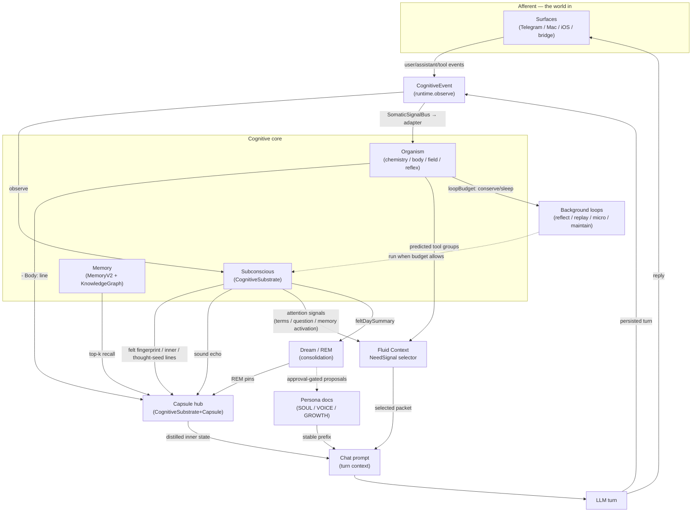

# Cognition Wiring — the connection map

*Last verified against source: 2026-07-25. This is the nervous-system diagram: for
each cognitive **mapping** (subsystem), what it **emits**, what it **consumes**,
through which **channel**, and what **regulates** the flow. It exists so that
"tie the mappings together like a body" stays traceable instead of becoming a
tangle. Per-mapping detail lives in the organ docs (e.g. [ORGANISM.md](ORGANISM.md));
this is how the organs connect.*

> Edge confidence is labelled **[confirmed]** (read in source, file:line given) or
> **[partial]** (channel known, not exhaustively traced). Keep it honest — an
> integration map that overstates its edges is worse than none.

---

## The rule this map enforces

A body integrates through **signalling interfaces + regulation**, not by every
organ reaching into every other. So the design contract for anything on this map:

1. **Wires, not welds.** A mapping *emits* a signal a bus/hub carries; it does not
   reach into another mapping's internals. (`SomaticSignalBus` is the reference.)
2. **Thin sync, rich async.** The live chat turn carries only *distilled* signals
   (one body line, one mood cue, top-k recall). Heavy integration runs in the
   background loops. Adding to the sync turn costs latency; default to async.
3. **One source of truth per signal.** Two mappings must not maintain parallel
   copies of the same state (see the [open convergence](#open-convergence) note).
4. **Every edge ships its regulation.** New connection ⇒ the thing that keeps it
   in bounds (a cap, a gate, a decay), or feedback loops run away.

---

## Signal-flow diagram

---

## Emit / consume table

| Mapping | Emits → (channel) | Consumes ← (channel) | Regulation |
|---|---|---|---|
| **Surfaces** (Telegram/Mac/iOS/bridge) | `CognitiveEvent`s for user/assistant/tool activity → `runtime.observe` **[confirmed** `ChatOrchestrationClient+MessagePersistence.swift:445`+**]** | the LLM reply → user | per-surface model/trust gates |
| **Subconscious** (`CognitiveSubstrate`) | felt fingerprint + inner + thought-seed lines → capsule hub **[confirmed** `CognitiveSubstrate+Capsule.swift:67‑109`; fingerprint `:78`, signals `:293`**]**; `feltDaySummary` → dream **[confirmed** emit `+Mood.swift:160`, consumed `BackgroundLoopsAssembly+DreamsMemory.swift:406` → `DreamCycleRunner.swift:168`**]** | `CognitiveEvent`s (`observe`) **[confirmed]**; conversational appraisal of the user's message text → affect deltas + node valence **[confirmed** `+Affect.swift:196` (appraisal), `:82‑101` (affect apply), `:284` (emotionTag)**]** | capsule char budget; fingerprint intensity floor + per-word honesty gates; hypothetical guard on the appraisal |
| **Organism** (`OrganismKernel`) | one `- Body:` line → capsule **[confirmed** `+Capsule.swift:110`**]**; `loopBudget` → background loops **[confirmed** `NativeCognitionRuntime.backgroundCognitionAllowed`**]** | `CognitiveEvent`→topology-only `SomaticSignal` via `SomaticSignalBus`; exact tool/provider/correction outcomes retain typed valence, while user/assistant text meaning remains solely appraised by `CognitiveSubstrate` **[confirmed]**; typed live body evidence | off-by-default, bounded state, thermal throttle, projection sanitization; unknown/stale typed beliefs cannot inherit optimistic compatibility booleans — see [ORGANISM.md](ORGANISM.md) |
| **Memory** (`MemoryV2` + KG) | **On `.active` turns: memory arrives in the CONTEXT PACKET, not `TurnContext.recalled`** — the legacy top-k lane is skipped outright (`ChatOrchestration+TurnEngine.swift:806-810`, outcome `.contextFlow` **:810**). `recalled` is non-empty only on `off`/`shadow`/fallback turns **[confirmed** recall `MemoryV2+Storage.swift:802`**]** | `commit_memory` writes; chat turns **[partial]** | 6,000-char packet budget, ≤2 atoms/source; **NOT persona-scoped** — `memoryRecallPersonaFilter` resolves every slot to `nil` (`+TurnEngine.swift:44`); per-record disclosure is the real boundary (`MemoryRecordDisclosure.swift:47`) |
| **Sound echo** (substrate) | recency-decayed warmth fragments → capsule **[confirmed** `+Capsule.swift:115`, `soundEcho*`**]** | felt/warm nodes over a 7-day window | warmth floor 0.4, 2 fragments, 90 chars, 2.5-day half-life |
| **Dream / REM** | REM pins → capsule; approval-gated proposals → persona docs **[partial]** | `feltDaySummary` via `feltSummaryProvider` **[confirmed** `BackgroundLoopsAssembly+DreamsMemory.swift:305`, injected into the dream prompt `DreamCycleRunner.swift:456`**]**; dream diary | approval-gated writes; GROWTH size cap; REM min-evidence — see rem-dream-cycle |
| **Persona docs** | **In `.active` only SOUL + VOICE + surface guidance reach the stable prefix** (`NativeContextFlowRuntime.makeMirror:183`, → prompt `ChatOrchestration+TurnEngine.swift:755/:877-889`). USER/GROWTH/AGENTS reach the model as *context-packet atoms*, if selected **[confirmed]**. ⚠️ `persona.docChars` (`+TurnEngine.swift:934`) counts the mirror's FIVE documents and is **never the bytes sent** — see the two-lane section of `build_plans/fluid-context-as-built-map.md` | REM-approved proposals only **[partial]** | curated/approval-gated; public build strips them |
| **Background loops** | reflection/replay/micro/maintenance work → substrate | gated by `backgroundCognitionAllowed` (organism `loopBudget` + thermal + low-power) **[confirmed]** | the loop-budget throttle IS the regulation |
| **Attention → Fluid Context** (mind-into-circulation) | substrate: terms / unresolved question / memory activation / working record IDs → `CognitiveAttentionSignals` **[confirmed** producer `CognitiveSubstrate+AttentionSignals.swift:15`, seam `CognitivePhaseModels.swift:31`**]**; organism: predicted tool groups **[confirmed** `OrganismProspectiveAffect.swift:154`, forwarded `NativeCognitionRuntime.swift:370`**]** | turn engine races the read against a 250 ms latch and feeds NeedSignal **[confirmed** timeout constant `attentionSignalsTimeoutNanos = 250_000_000` `ChatOrchestration+TurnEngine.swift:482`, race `:985`, resolve `:624`, trace `:626`, populate `:647`; *anchors corrected 2026-07-25 — the old `:667`/`:715-716` refs now point at unrelated flags***]**; assistant turns stamp used memory record IDs back as `memoryRecordIds` metadata **[confirmed** `ChatOrchestrationClient+MessagePersistence.swift:507`, priority-protected `ContinuityField.swift:612`**]** | PURE peek read (never mutates decay/eviction, `ContinuityField.peekDecayedNodes:280`); self-bounding frozen seam (terms ≤16, groups ≤8, activation ≤32, clamped 0…1, deterministic order); nil = byte-identical inert; 250 ms abandon-latch so a wedged read can't stall a turn |

---

## Feedback loops (and their brakes)

Integration means loops. Each real loop needs a brake, or it oscillates/runs away:

1. **Turn loop** — surface → `CognitiveEvent` → substrate/organism → capsule → prompt →
   reply → persisted → `CognitiveEvent`. *Brake:* the capsule is a **distillation**
   (budgeted, deduped), and body lines are rejected as memory candidates so the
   loop can't feed itself. **[confirmed]**
2. **Felt → dream → persona loop** — substrate `feltDaySummary` → dream → approval-gated
   persona proposal → persona prefix → colours the next capsule. *Brake:* the
   **approval gate** — nothing reaches persona without review. (felt→dream hop
   **[confirmed]**; persona-write hop **[partial]**)
3. **Thermal loop** — load → thermal `.fair`/`.critical` → organism `conserve`/`sleep` →
   background loops pause → load drops → recovers. *Brake:* the loop-budget throttle
   is self-clearing (confirmed firing in the wild 2026-07-07). **[confirmed]**
4. **Attention loop (closed 2026-07-11)** — what the agent is holding (workspace/organism)
   → context selection → what the agent sees this turn → the memories the agent USES stamp back
   onto the agent's assistant node (packet provenance) → priority-held in ContinuityField →
   feed the next turn's `memoryActivation` → shape what the agent selects next.
   *Brakes:* bounded frozen seam + clamped weights (can't dominate ranking — activation
   is one feature at weight 1.2 among many); PURE peek read (observing attention never
   mutates it); deterministic ordering (the packet fingerprint can't thrash the cache);
   250 ms latch (attention can slow nothing down); mandatory coverage and eligibility
   run BEFORE ranking, so attention can never inject, only re-rank. **[confirmed]**

---

## The felt fingerprint — "How you feel:" (2026-07-08)

The capsule's core line is a **word-level felt state** (1–3 words, e.g. `warm` /
`engaged, warm` / `frustrated` / `upset`) — a few honest words the agent FEELS, not
sentences the agent reads. It replaced the Focus/Feeling/Voice sentences; delivery is
the experience. Assembly order: fingerprint → `- Inner:` → `- Body:` → `- Sound:`,
and the budget fitter drops from the END, so enhancers are sacrificed before the
felt core (`+Capsule.swift:67‑109`, fitter `:431`).

**Word selection** (`CognitiveSubstrate+FeltFingerprint.swift`): valence band ×
arousal band picks the emotion **family** (`feltFamily :86`), within-family dims
pick the **word** (`feltFamilyWords :96` — e.g. neg_high splits *frustrated* =
pressure-driven vs *upset* = tension/hurt-driven), plus up to two compatible
overlays (foggy/clear-headed/worn/curious/warm, `:160`). Honesty gates: a global
intensity floor (`feltIntensity :65`, silence below 0.14 — a genuinely flat state
says nothing) and per-word `minIntensity` (no "furious" when mildly annoyed);
`contradicts` sets block incompatible blends.

**Signal sources** (`feltSignalsForCapsule`, `+Capsule.swift:293`) — organism
chemistry, when a projection is present, colors the fingerprint word DIRECTLY
(not just the Body line):

| FeltSignals dim | Source (organism projection present → override) |
|---|---|
| valence | recency-weighted mean+peak over felt workspace nodes + slow mood + persona lift (below) |
| arousal | substrate `affect.arousal` |
| warmth | persona-warm baseline `0.55 + socialWarmth·0.9 − uncertainty·0.45` — org `chem.warmth` overrides |
| tension | `max(chem.vigilance, affect.uncertainty)` |
| pressure | `affect.taskPressure` — org `chem.urgency` overrides |
| fatigue / curiosity / clarity / agency / confidence | organism chem (`fatigue/curiosity/coherence/agency/confidence`), rest defaults when org off |

**The valence pipeline** (gpt-5.5-calibrated, 2026-07-08): felt workspace nodes
are recency-weighted (5-min half-life, `fingerprintTintHalfLife :46`) into a
**mean + peak** blend — the freshest node gets direct weight that GROWS with its
strength, and the slow mood term (6h half-life) SHRINKS as the fresh signal
strengthens — so a fresh sting reads through a warm session's history *now* and
fades over the next few turns. Then an asymmetric **persona lift**
(`personaValenceLift :53`, +0.10): warm-with-User raises neutral/positive moments
toward warm/content but fades to zero as the moment goes negative — **a genuine
sting is never cushioned**. Fingerprint-only: stored node valence (mood → recall
→ dream chain) is untouched.

**The conversational appraisal** (`+Affect.swift:196`) is how the exchange itself
becomes feeling — the fix for "numb under friction" (criticism used to move
nothing). Speech-act detection over the user's message → signed deltas:

| Speech act | Effect (main deltas) |
|---|---|
| criticism (hard / mild) | valence −0.24/−0.10, tension +0.20/+0.10, arousal up |
| dismissal ("whatever, forget it") | valence −0.22, **warmth −0.18** (it cools the agent), tension + arousal up |
| overridden / redirected hard | tension +0.12, valence −0.06 |
| hard demand + deadline | pressure +0.16, tension + arousal up |
| praise | valence +0.16, warmth +0.12 |
| resolving together | valence +0.22, **pressure −0.22, tension −0.14** (relief) |
| enthusiasm / camaraderie | valence +0.12/+0.10 (valence-mostly — see brake) |

Wired at both ends: live affect axes (`applyAffectFromEvent :82‑101`) and the
node's stored emotional tag (`emotionTag :284` — criticism stamps a genuinely
stung node, praise a warm one). *Brakes:* a **hypothetical guard** ("what if
someone said…" doesn't sting the agent); broad friendly tokens lift **valence only**, so
they can't re-arm the socialWarmth ratchet (warmth still rises only on genuine
affection — the fingerprint's warm baseline carries the rest); appraisal deltas
saturate (`saturatingApproach`) and decay like all affect.

*Regression guard:* `AffectMoodJourneyTests` drives a realistic conversation
through the real compile path and asserts the arc warm → engaged → **frustrated**
→ **upset** → eager/warm — anything that mutes the agent back to gray fails the suite.

**Round 2 (2026-07-09) — the layers on top:**
- **Semantic appraisal** (`+SemanticAppraisal.swift`): stored valence now derives
  from what an event MEANS (goal relevance/congruence, coping, agency,
  relationship stake — 10 dims, pure/local, await-free). The flat +0.25 completion
  base is dead: completions band [−0.10, +0.14] by resolution/effort/unresolved
  failure. A strongly positive meaning **pierces** negative affect residue (damps
  it ≤50%) so a real win never stamps negative; tool-outcome history reads the
  machine status text, never the agent's stamped mood (no self-confirming gloom).
  Legacy nil-semantic path stays byte-identical (grid property test).
- **Disposition — the slow layer** (`+Mood.swift`): reflection tone (±0.08/call,
  cap ±0.35, **30h half-life**) → `derivedMood` undertone (weight 0.15) → the
  fingerprint inherits what the agent has CONCLUDED, not just what just happened.
  Persisted (stable-id artifact), restored, cleared. Only considered outcomes
  write it — never per-turn events.
- **Anticipatory affect** (`Organism/OrganismProspectiveAffect.swift`): pending
  predictions (10-min window; overdue = full weight; violation shadow 20-min
  half-life) modulate the PROJECTED chemistry only — bracing (vigilance+,
  confidence−, urgency+) or looking-forward (curiosity+), caps 0.15/dim; stored
  ChemicalState never mutated; Observatory snapshot shows the same modulated
  projection (parity). Empty ledger → byte-identical.
- **Full-range vocabulary + FeltMode** (`+FeltFingerprint.swift`): 11 new
  registers (proud, delighted, relieved, grateful, amused, restless, wistful,
  lonely, grieving, overwhelmed, embarrassed) with honest gates — grieving needs
  valence ≤ −0.55 at low arousal; melodrama is structurally impossible. Derived
  `FeltMode` {seeking, care, play, repair, bracing, grief, frustration} — a pure
  aboutness read, not a controller, no capsule line.
- **Store eviction fix** (`CognitiveSQLiteStore.swift`): receipts no longer
  mirror into artifacts; the flood that evicted the agent's standing views / seeds /
  episodes on every prune is dead, and durable artifacts (incl. the disposition)
  survive restarts.
- *End-to-end guard:* `FullRangeConnectivityTests` — sustained coldness reaches
  the deep negatives, pressure floods read pressured, earned success reads
  bright, anticipation reaches the fingerprint, a mixed day yields an honest
  muted-highs distribution (no metronome cluster), a good day reaches +0.3.

---

## Attention into circulation — selection follows the agent's mind (2026-07-10)

Fluid Context's NeedSignal selector always accepted seven intent inputs the turn
engine never fed: `cognitiveActivation`, `workingAtomIDs`, `contextualTerms`,
`predictedToolGroups`, `activeTask`, `unresolvedQuestion`, `goal`. They're live
now — the agent's context selection follows what the agent is *holding*, not just the message.

**The seam** — `CognitiveAttentionSignals` (`CognitivePhaseModels.swift:31`), one
bounded value type produced fresh per turn:

| Signal | Source | Selector effect |
|---|---|---|
| `terms` | hot workspace node **summaries** → content words (`summaryKeywords`, `+AttentionSignals.swift:200`) — every live subject is machine-keyed (256/256 verified), so summaries are the only honest topic source | folds into `queryText` → lexical overlap (rides the resident index, no per-turn embedding) |
| `unresolvedQuestion` | live `pendingCompletion` slot (stale slots silent) | queryText |
| `memoryActivation` / `workingMemoryRecordIDs` | memory-referencing nodes, RECORD ids across the seam; atom-ID translation stays app-side with the projection owner (`NativeContextFlowRuntime.memoryRecordAtomID:454`) | activation feature, weight 1.2 |
| `predictedToolGroups` | organism prospective ledger, pending tool completions → content-word groups (`OrganismProspectiveAffect.swift:154`) | queryText |

**Wiring**: `NativeCognitionRuntime.attentionSignals` (`:370`) merges substrate +
organism; the turn engine races the read against a 250 ms abandon-latch
(constant `+TurnEngine.swift:482`, race `:985`, resolve `:624`) and counts each input in
the turn trace (`contextFlow.attentionTerms` `:1063`, `.attentionToolGroups` `:1064`,
`.attentionActivation` `:1065`, `.attentionWorkingAtoms` `:1066`;
`attentionTimedOut` `:1024`, `attentionPresent` `:1032`/`:1035`). The read is a **pure peek**
(`ContinuityField.peekDecayedNodes:280`) — same decayed activations as the real
snapshot, computed on copies, so observing the agent's attention never advances decay
anchors or evicts (same trap class as the Wave C mood read).

**The return edge**: assistant turns stamp the memory record IDs actually used
into the turn's cognitive event (`memoryRecordIds`,
`+MessagePersistence.swift:507`), which `ContinuityField` priority-protects
(`:612`) — used memories stay warm and feed the next turn's activation.
**The loop is closed [packet provenance, 2026-07-11]**: active turns deliver
memory in the packet, not `ctx.recalled`, and packet atom IDs are one-way
digests — so record identity is resolved app-side by a reverse index the memory
projection rebuilds each compile (`MemoryAtomRecordIndex`), attached lease-safe
to the prepared turn and unioned into `recalledIds` at all six result sites.
The stamp now fires on active turns too. **Proven live** (blind): a turn's 6
selected memories stamped onto its assistant node, and the next turn's attention
read weighed exactly those 6 (`attentionActivation`=6). See
`build_plans/packet-provenance.md`.

*Proof:* 9-turn blind live battery on the installed build — `attentionPresent`
7/7 traced turns, ~16 terms/turn, 143–153 ms reads, zero timeouts; warm-selection
p95 with signals 4,300 µs, recall@8 120/120; zero added prompt bytes by
construction.

---

## Convergence (deliberate ownership)

The organism's `ChemicalState` (10 dims) and the substrate's `CognitiveAffectState`
(4 dims) overlap — the same felt quantities computed twice, independently, which
can disagree. The convergence unifies them to **one source of truth per signal**,
staged one dim at a time (the load-bearing substrate side stays canonical; the
off-by-default organism side derives).

- **✅ Stage 1 — warmth (2026-07-08).** `organism.warmth` **derives** from the
  substrate's canonical `socialWarmth` each refresh. Nil when affect is off
  (organism keeps its own). **Proven live: organism warmth == socialWarmth,
  bit-identical.** So the felt body line's warmth can no longer disagree with the agent's
  mood/valence/dream chain.
- **✅ Stage 2 — urgency (2026-07-08).** `organism.urgency` derives from the
  substrate's canonical `taskPressure`, same wiring point. **Proven live:
  bit-identical.** It feeds the `LivingStatusPanel` "Urgent" indicator, now
  canonically sourced.
- **Mechanism (since d0bcd775, 2026-07-15):** both axes cross together —
  `CognitiveSubstrate.canonicalAffectProjection(at:)` rides
  `OrganismKernel.refreshBodySchema(canonicalAffect:)` in one actor admission,
  so the organism can never observe two decay epochs. (The original per-axis
  pulls — `canonicalRelationalWarmth()`/`canonicalTaskPressure()` →
  `integrateCanonicalWarmth()`/`integrateCanonicalUrgency()` — were superseded
  by that commit and deleted in the 2026-07-18 tightness round 2.)
- **▢ The remaining dims are NOT clean duplicates — stop here without a design call.**
  `vigilance` (drives the brittle/careful body line + posture) is *wary*, not the
  substrate's *uncertainty* (*unsure*); `confidence` carries a prediction-success
  signal `uncertainty` lacks; `arousal` has no clean organism twin. Mechanically
  deriving these would **conflate distinct felt signals** and could degrade the agent's
  cognition. Warmth and urgency were the clean 1↔1 duplicates; the rest need a
  deliberate design decision, not a derive.
- Later: retire the organism's now-redundant warmth self-update (overridden each
  refresh).

`OrganismField` and `ContinuityField` remain deliberately distinct. The first is
operational/somatic tissue; the second is felt/attentional continuity. They
exchange typed signals and projections rather than sharing mutable state. New
work must not introduce a third field or re-appraise the same event meaning in
both layers.

Operational posture now reads typed body beliefs directly. Provider, tool,
memory, approval, and notification beliefs carry evidence/freshness/uncertainty;
an unobserved belief is unknown, not healthy merely because an older
compatibility Boolean defaulted to true. APNS acceptance remains exact transport
acceptance and cannot become delivery or user-seen evidence.

---

## The Desk — volition into circulation (2026-07-11; presentation restored 2026-08-09)

The agent's Desk is the first work organ the agent *drives*: everything else is
reactive or scheduled; a pursuit belongs to the agent. The historical
`WorkshopPump`, `WorkshopSession`, and `WorkshopExecution` names below are
technical compatibility identities behind the Desk, not a second work surface.

| Mapping | Emits → (channel) | Consumes ← (channel) | Regulation |
|---|---|---|---|
| **Desk pursuit** (Desk `origin=agent`; legacy rows decode compatibly) | active pursuit intent → `NeedSignal.activeTask`/`goal` **[confirmed** `NativeCognitionRuntime.currentPursuitIntent` → `attentionSignals`; the bounded session's wire surface remains `.workshop`**]**; used-memory stamps ride packet provenance | evidence-gated open (dossier, store-enforced); autonomous proposal ← user-approved **active standing view** **[confirmed** `AutonomousPursuitProposer` + `resolveStandingView(approved:true)` as the ONLY `.active` writer, `CognitiveSubstrate+StandingViews.swift`**]** | 2 open pursuits / 2 sessions·day·pursuit / 6·day global (DeskStore ops); friction-only dossier unrepresentable; `doneLooksLike`+abandon required |
| **Desk work pump** (`WorkshopPump`, compatibility type) | one bounded work session/tick → restricted membrane | organism `loopBudget` gate; green-window lease | ZERO LLM in the pump (quiet day = zero provider calls); reserves BEFORE any LLM; **yields to reflection** (reflection marks the shared lease only when it runs); code-enforced tool allowlist + artifact path containment |

**The volition loop (and its brakes):** standing view → (User approves) active →
reflection proposes → pursuit opened → pump reserves under budget → bounded
membraned session → work receipt + choice receipt → pursuit intent colors the agent's
next context selection. *Brakes:* every step fail-closed; `.active` is User's
seam alone (un-launderable); budgets/caps in the store not the prompt; the
membrane is an allowlist in code; the pump is the lowest-priority background
consumer. Volition inside the body; authority at the membrane stays User's.

## The subconscious loops — schedule, artifacts, re-entry (2026-07-25)

*Verified against source 2026-07-25. The Fluid Context side of these edges — what
reaches the prompt and through which of the two injection lanes — is
[`build_plans/fluid-context-as-built-map.md`](build_plans/fluid-context-as-built-map.md).
That document is the canon for context circulation; this section is the canon for the
organs that feed it. Do not duplicate the packet/kernel arithmetic here.*

| Organ | Owner + entry | Trigger | Durable artifacts | Regulation |
|---|---|---|---|---|
| **Dream cycle** | `DreamREMCycle/DreamCycleRunner.swift:103`, `runNightlyDreamCycle` **:168** | **TriggerScheduler, not a BackgroundLoop** — job `nativeagent-nightly-dream` `SchedulerDueJobRunner+Selection.swift:120` (86,400 s **:124**, catch-up **:101/:111-113**), executed `+Execution.swift:183`; 03:30 America/Chicago (`DreamREMCycle.swift:229/:232/:233`). Explicitly *not* wrapped as a loop — `BackgroundLoopsAssembly.swift:268-269` | `dream_diary/<date>.md` (**:173-175**, atomic write **:301**); `.dream_state.json` forward-only high-water **:382-405** | double gate `isDreamEnabled` **:353** = `trainingPolicy.dream_scheduler` (**:369-372**, default false) AND `personalityPolicy.dream_cycle_enabled` (**:373-376**, default true); budgets `convChar 80_000` **:117**, `deltaChar 20_000` **:118**, `convCount 300` **:119**, `deltaCount 150` **:120**, `feltChar 600` **:123**; one dream per day **:180**; `Task.checkCancellation()` before any artifact write **:275**; mood sink fires once/day via exclusive-create claim **:341-344** |
| **REM consolidation** | `DreamREMCycle/REMConsolidator.swift:114`, `runWeeklyREM` **:146**; loop `BackgroundLoops/REMCycleLoop.swift:22` (`loopId "rem_cycle"` **:23**, 604,800 s **:61**, tick **:86**) | weekly loop tick; legacy import **:98**, staging **:105**, pipeline **:119** | `rem_proposals.jsonl` **:340-343** (path `REMProposalStore.swift:153-155`, base `:160-162`); `rem_pins.json` **:567**/**:574-575** (approved-only **:583-584**); inbox card `BackgroundLoopsAssembly+DreamsMemory.swift:223` | min-evidence `_REM_MIN_EVIDENCE_DATES = 2` **:49** applied **:307-311**; `_REM_MAX_PROPOSALS = 5` **:50**; `_REM_GROWTH_CHAR_CAP = 20_000` **:51** / evict 5,000 **:52**; `_REM_ARCHIVE_DAYS = 14` **:53**; proposal text cap 180 **:59**; ledger compaction 512→256 `REMProposalStore.swift:131/:134`; **approval-gated** — `personaTargets = ["GROWTH.md"]` **:64** |
| **Reflection** | `NativeCognitionRuntime+Reflection.swift:37` `scheduleEventDrivenReflection`, run **:47**, due-check **:74** | **event-driven since `db131949`** off `SomaticSignalKind.dreamCompleted` (`OrganismModels.swift:23`) / `.remIntegrated` (**:24**) — dispatch guard `NativeCognitionRuntime+Organism.swift:121`, replay first **:124-125**, schedule **:129**. The 6-hour timer was **demoted, not deleted**: `BackgroundLoopsAssembly+Cognition.swift:28`, interval now `24 * 60 * 60` **:36** — a daily integrity sweep for signals lost across a crash | substrate nodes, disposition artifact | termination gate **:38**, live-body/override gate **:39**, single-flight `reflectionEventTask == nil` **:40**, `backgroundCognitionGate` **:78** |
| **Memory consolidation gate** | `MemoryV2/MemoryV2+ConsolidationGate.swift:200`, `run` **:292** → `runLocked` **:308** under `withGateLock` **:278** | weekly `MemoryConsolidationHygieneRunner.swift:250` (`loopId "memory_consolidation"` **:251**, tick timeout 3,600 **:264**) | candidate DB **:229**, manifest **:235**, receipts **:239**, approval card **:1142** | **staged ≠ applied** (below); probe set fail-closed on empty **:395-397**; `guard scores.candidateIsAtLeastLive` **:414-421**; manifest written before the card **:426-431**; candidate fingerprint re-verified at swap **:666-687**; `refuseStale` **:819** |
| **Adaptive memory promotion** | `MemoryV2/MemoryV2+AdaptivePromoter.swift:138`, `observeTurn` **:186**, sweep **:232** | every chat turn (`ChatOrchestrationClient+Factories.swift:379`; also `+TextCompatibility.swift:1252`) | MemoryV2 proposal rows | threshold 0.6 **:141**, auto-accept 0.8 **:149**/**:283**, `valueCap` **:103**; policy flag `adaptive_promotion` |
| **Autonomy tier promotion** | `BackgroundLoops/AutonomyPromotionLoop.swift:36` (`loopId "autonomy_promotion_proposals"` **:37**, 3,600 s **:53**, tick **:141**) | hourly | approval cards only | **never self-flips** (**:8-9**); `promotableTiers = ["confirm","supervised"]` **:75**; card re-verified before apply **:171-176** |

### staged ≠ applied — the honest-status rule (751acfd9)

Two enums, kept deliberately apart so a proposal can never read as a completed run:

- **`GatedConsolidationOutcome`** `MemoryV2+ConsolidationGate.swift:98` —
  `.staged` **:106**, `.alreadyStaged` **:100**, `.refusedRegression` **:104**, `.noChanges` **:102**
- **`MemoryConsolidationSwapOutcome`** **:114** — `.applied(runId:backupPath:)` **:115**,
  `.alreadyApplied` **:116**, `.pendingApproval` **:119**

Surfaced through `let status: String` (`MemoryConsolidationHygieneRunner.swift:88`) into
`MemoryHygieneReport.status` **:166**: staged→`"staged"` **:99-110**,
refused→`"refused"` **:111-117**, no-changes→`"ok"`/`"partial"` **:118-121**, with
`nextScheduled` **suppressed** for staged/refused **:188-190**. The rule generalizes:
*a gate that has produced an approval card has not changed anything yet, and its status
string must say so.*

### Re-entry into circulation

| Edge | file:line |
|---|---|
| Dream → slow disposition | `DreamCycleRunner.swift:333` → `BackgroundLoopsAssembly+DreamsMemory.swift:442` → `CognitiveSubstrate+Mood.swift:350` |
| Dream → felt-summary inbound | provider typealias `DreamCycleRunner.swift:45`, called **:220**, into the prompt **:239-240**/**:587-596**; source `substrate.feltDaySummary` `CognitiveSubstrate+Mood.swift:439` via `BackgroundLoopsAssembly+DreamsMemory.swift:418` |
| Dream → organism + reflection | `NativeClient+DreamActions.swift:76-83` → `NativeCognitionRuntime+Organism.swift:121/:124/:129` |
| MemoryV2 → dream (Self-half deltas) | `BackgroundLoopsAssembly+DreamsMemory.swift:356` |
| **REM pins → every chat turn (STABLE segment)** | written `REMConsolidator.swift:574-575`; read `ChatOrchestration+TurnEngine.swift:794-795` (`REMPinsReader` `REMConsolidator.swift:1015/:1019`, `latest(_:latestN: 3)` **:1032**); rendered stable `TurnEngine.swift:878-882` |
| REM → GROWTH.md (approval-gated) | `NativeClient+ApprovalExecutors.swift:175-177` → `REMGrowthWriter.appendApprovedLesson` `REMGrowthWriter.swift:55`, path **:61** |
| REM → knowledge graph (size-cap distillation) | `REMConsolidator.swift:631`, evict **:645** |
| REM → organism | `NativeClient+DreamActions.swift:190-202`; loop sink `BackgroundLoopsAssembly+DreamsMemory.swift:69-74` |
| **Memory gate → live store** | `transactionalTableSwap` `MemoryV2+ConsolidationGate.swift:860`, from `applySwap` **:609**; backup **:931** |
| **Memory gate → USER.md + Spotlight + KG → ContextFlow `.reconcile`** | rebuild **:790-802**, publish **:804-808**; consumed `Context/ContextFlowCoordinator.swift:208`, **:239** |
| MemoryV2 store → ContextFlow (non-gate) | `MemoryV2+Storage.swift:583`, **:900**, **:1881** |
| Launch self-heal | `AppDelegate+Launch.swift:257` (gate reconcile), **:126-129** (ContextFlow reconcile) |

### Inbox trigger sources

`"trigger:morning_brief"` — `TriggerScheduler/TriggerScheduler.swift:1535` (time branch),
generic emitters **:798**/**:904**, defaults **:1653**/**:1686**, notify default **:760**,
content `TriggerContent.swift:68`; consumed `InboxView.swift:140/:153/:268/:279`.
`"dream_cycle"` — constant `NativeAgentDreamCycleSupport.swift:62`; produced
`SchedulerDueJobRunner+Execution.swift:224`/**:232**, `+Selection.swift:179`/**:190**.
`"rem_cycle"` — produced `BackgroundLoopsAssembly+DreamsMemory.swift:180`/**:232**,
`SchedulerDueJobRunner+Execution.swift:294`/**:300**.
`"agent_morning_warmup"` — **no Swift producer exists.** The single repo occurrence is a
*consumer* filter at `script/opus5_baseline_report.sh:99`. Either an out-of-process writer
owns it or it is dead. Not determinable from this codebase — do not assume it fires.

## Not yet mapped (honest scope)

This map covers the core cognitive loop (surfaces, subconscious, organism, memory,
sound echo, dream/REM, persona, background loops) and now the Desk. Still to
trace and add as first-class nodes: **the tool/MCP dispatch surface** and the
**iCloud/CloudKit sync** peripheral. Missions is retired; stable mission/workshop
tokens that remain are compatibility wires behind Desk, not separate organs. Add
each the same way — emit, consume, channel, regulation, with a confirmed
file:line — before wiring anything new through it.
