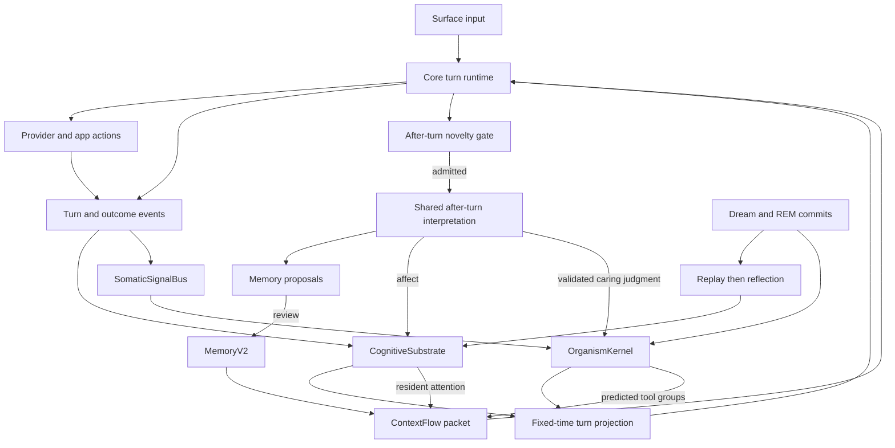

# Cognition Wiring — the connection map

This map follows the core owners that connect turns, memory, cognition and
body state. [SUBCONSCIOUS.md](SUBCONSCIOUS.md) describes the inner-life layers;
[ORGANISM.md](ORGANISM.md) details the body;
[MEMORY_SYSTEM_MAP.md](MEMORY_SYSTEM_MAP.md) covers durable memory.

Source paths below are relative to `Modules/NativeAgentCore/Sources/`
unless prefixed with `Sources/NativeAgentApp/`.

## The rule this map enforces

One brain, many doors. The core `EngineRuntime` owns the running turn state,
and `ChatTurnRuntime` owns shared turn preparation and execution. Surfaces
supply input and render results. MemoryV2 owns facts; cognition and organism
state influence continuity, attention and presentation without becoming new
fact stores or execution authorities.

`CognitiveSubstrate/CognitiveSQLiteStore.swift` persists substrate continuity at
`<dataRoot>/cognition/cognition.sqlite`. Organism continuity uses
`<dataRoot>/cognition/organism_state.json` under its runtime owner.

Agent's only always-on tool is `app`. `app {}` reads home, where they left off;
`page`, `item`, `find` and `action` navigate the app and its actions.
`script` uses JavaScriptCore for the registry's scriptable reads/actions.
`AppToolRuntime/AppActionRegistry.swift` defines those actions;
`AppToolExecutor+AppDoor.swift` and `AppScriptRunner.swift` implement the door.

## Signal-flow diagram

```mermaid
flowchart TD
    S["Surface input"] --> T["Core turn runtime"]
    M["MemoryV2"] --> C["ContextFlow packet"]
    C --> T
    T --> P["Provider and app actions"]
    T --> E["Turn and outcome events"]
    P --> E
    E --> SUB["CognitiveSubstrate"]
    E --> BUS["SomaticSignalBus"]
    BUS --> O["OrganismKernel"]
    T --> N["After-turn novelty gate"]
    N -->|admitted| A["Shared after-turn interpretation"]
    A --> Q["Memory proposals"]
    Q -->|review| M
    A -->|affect| SUB
    A -->|validated caring judgment| O
    SUB --> F["Fixed-time turn projection"]
    O --> F
    F --> T
    SUB -->|resident attention| C
    O -->|predicted tool groups| C
    D["Dream and REM commits"] --> R["Replay then reflection"]
    R --> SUB
    D --> O
```

## Emit / consume table

| Edge | Owner and consumer | Regulation |
| --- | --- | --- |
| Turn lifecycle → core execution | `EngineRuntime/EngineTurns.swift` exposes `TurnsFacade` and its `MacChatTurnRuntime`; `ChatTurnRuntime/ChatOrchestration+TurnEngine.swift` prepares provider/context inputs. | Core admission, cancellation and checked provider routing. |
| Persisted turn → cognitive event | `ChatTurnRuntime/ChatOrchestrationClient+MessagePersistence.swift` → `Cognition/NativeCognitionRuntime.observe`. | Redacted evidence and explicit turn kind/origin; exact replay does not repeat state changes. |
| Cognitive event → body | `CognitiveSubstrate/Organism/OrganismSignalBus.swift` → `CognitiveSomaticSignalAdapter` → `OrganismKernel.ingest`. | Bounded metadata; debug/verification and body-originated resolution events are excluded. |
| Shared interpretation → facts, moments, affect and care | `MemoryV2/MemoryV2+AdaptivePromoter.swift` calls `ChatTurnRuntime/MindMemoryManager.swift`; callbacks installed by `NativeCognitionRuntime.refreshConfiguration` finish cognition processing. | Novelty gate before at most one shared model call; lane switches, origin matching, candidate screening, proposal review and caring encounter admission. |
| Memory → selected context | `ContextFlow/NativeMemoryContextProjection.swift` → Context selector → prepared turn. | Record disclosure, lifecycle eligibility, selection and character budgets. |
| Body + substrate → capsule/posture | `NativeCognitionRuntime.prepareTurnProjection` → substrate frozen capsule preparation. | One fixed-time projection; successful live turns commit presentation cadence even with an empty capsule, without counting unshown cues as presented. |
| Selected memory IDs → felt continuity | `ContextFlow/NativeContextMemoryProvenance.swift` → turn delivery accounting → assistant event `memoryRecordIds` → substrate. | Identity stays attached to the exact generation lease; missing mappings do not invent provenance. |
| Body posture → background work | `OrganismBehaviorPosture.loopBudget` → `NativeCognitionRuntime.backgroundCognitionGate`. | Low-power, thermal and per-lane conserve checks; no chat-admission veto. |
| Dream/REM commit → replay and reflection | `Cognition/NativeCognitionRuntime+Organism.swift` handles `dreamCompleted`/`remIntegrated`, awaits replay, then schedules reflection. | Replay deadline, reflection single-flight, configuration and resource gates. |

## Shared after-turn interpretation

Ordinary lived user turns defer their conversational affect interpretation in
`CognitiveSubstrate+Ingest.swift`. After the turn,
`AdaptiveMemoryPromoter` first applies `MemoryV2/AfterTurnNoveltyGate.swift`.
A skip makes no interpretation call, records `noveltySkipReason` and finishes
the deferred turn with `noveltySkipped=true`. Otherwise it asks
`MindMemoryManager.interpret` at most once for fact decisions, a possible
moment, affect and caring. The available reply supplies
context; affect and caring judge the incoming speaker's words.

`CognitiveSubstrate+CaringEvent.swift` matches the result to the originating
turn and generation before `finishAfterTurn` applies it. The substrate applies
relational weighting, updates the event's felt tag and completion reaction, and
publishes attention. Valid caring evidence crosses the runtime's direct sink
into the body. The somatic adapter never repeats this semantic judgment.

Memory candidates are separately screened and staged by MemoryV2.
`bot-` sessions skip this interpretation; peer speakers are named rather than
treated as User. Unavailable interpretation and a successful abstention remain
different outcomes.

## Attention into circulation

`CognitiveSubstrate+AttentionSignals.swift` publishes terms, unresolved
questions, working memory IDs and activation. The organism publishes pending
tool groups. `Cognition/NativeCognitionRuntime+Pursuit.swift` adds a bounded
resident Desk pursuit projection.

The hot `NativeCognitionRuntime.attentionSignals` read uses this published
resident value without waiting on the source actors or loading Desk files.
Desk store/file invalidations clear stale intent and refresh it off the hot
path. The turn engine decides whether resident work intent is relevant to the
current request before passing it to Context selection.

Attention affects selection within existing eligibility and budget rules.
It does not load tools, authorize actions or inject an entire backlog.

### Context budgets: selection-side and packet-side

`Context/ContextSelectionContracts.swift` bounds candidate counts, selected
atoms, per-source/per-kind selection and pointers.
`ChatSessionWork/ContextBudgetPolicy.swift` derives the turn's character
and memory-row allowances from the admitted model window. These are different
limits and both apply.

Active ContextFlow turns carry memories in their packet. The independent
recall list is empty on that path; a context preparation error fails the turn.
`app` action `context.expand` reads deeper into a pointer offered by the
prepared turn, under its generation lease and expansion bounds.

With the default personal recall floor of 0.20, `moment`, `relationship` and
`lesson_origin` memory atoms leave ordinary competition. The selector reserves
at most one personal memory row whose query cosine exceeds its own baseline
by that floor; otherwise none. The baseline is its mean cosine to the
generation's ordinary memory atoms. This uses an existing memory row and
character budget, retaining disclosure and provenance checks. A floor of zero
returns these atoms to ordinary competition. See
[personality-ablation.md](personality-ablation.md) for the mechanism checklist.

## The felt fingerprint — "How you feel:"

`CognitiveSubstrate+Capsule.swift` renders a bounded capsule from the frozen
read. `CognitiveSubstrate+CapsuleFeltSignals.swift` combines felt nodes, mood,
substrate affect and optional organism chemistry;
`CognitiveSubstrate+FeltFingerprint.swift` selects words with intensity and
compatibility gates.

The body can color the fingerprint and contribute a `- Body:` candidate.
The arbiter chooses one non-rut felt cue or none: settling, since-gap recall,
reminded-of recall, a relevant view/thread, dream, fingerprint, reflection
takeaway, body, then Sound echo. An optional separate Sound line can address a
verbal rut. Private reflection is cadence-exempt and can retain multiple lines.
`NativeCognitionRuntime.commitTurnProjection` advances the presentation clock
after a successful live turn, even with an empty capsule. Candidates that lose
the slot or budget remain owed; they do not count as presented. Previews and
failed turns do not consume that cadence.

## Convergence (deliberate ownership)

`CognitiveSubstrate.canonicalAffectProjection` supplies social warmth and task
pressure to the same organism refresh. The kernel integrates those as warmth
and urgency before producing the fixed-time read. Other organism dimensions
retain their own evidence and dynamics.

`OrganismField` holds somatic associations; `ContinuityField` holds
attentional/felt continuity. Body resolutions return through
`drainFeltResolutionsIntoSubstrate`, and the adapter refuses to turn those
events back into body input.

Typed provider, memory, approval and notification beliefs retain evidence,
freshness and uncertainty. Domain owners decide what actually happened;
observing a belief cannot grant capability or turn transport acceptance into
delivery.

## Other continuity edges

| Edge | Owner | Boundary |
| --- | --- | --- |
| Open concerns → rumination | `CognitiveSubstrate+Rumination.swift`, `Cognition/NativeCognitionRuntime+Rumination.swift` | Bounded seed/Desk inputs, read-time affect floors and capsule candidates; resolving a concern releases its carried weight. |
| Held/active views → concern and capsule | `CognitiveSubstrate+StandingViews.swift`, `CognitiveSubstrate+AppraisalConcerns.swift` | Held and active sets are separately capped; activation goes through the standing-view resolution path. |
| Dated work → `toward` | `Cognition/NativeCognitionRuntime+Expectations.swift` → organism horizon ledger → capsule request. | Bounded dated sources; an incomplete source read cannot prove disappearance. |
| Served moments → re-feeling | `NativeCognitionRuntime.noteServedMoments` → substrate affect. | Canonical moment valence/salience, bounded re-feeling and per-record cooldown. |
| Felt day → dream → mood | `BackgroundWork/DreamBackgroundWork.swift` supplies felt summary/origins and the dream mood sink. | Existing substrate mood admission; durable dream evidence remains with the diary owner. |
| REM review → growth and pins | `DreamREMCycle/REMConsolidator.swift`, `REMGrowthWriter.swift`; turn engine reads `REMPinsReader`. | Reviewed application; canonical persona locking and bounded pinned input. |

## The subconscious loops — schedule, artifacts, re-entry

| Work | Trigger/owner | Result |
| --- | --- | --- |
| Dream | `SchedulerExecution/SchedulerDueJobRunner+Selection.swift` registers `nativeagent-nightly-dream`; execution calls the platform dream action and `DreamREMCycle/DreamCycleRunner.swift`. | `dream_diary/<date>.md`, receipts and mood/somatic feedback. |
| REM | The same scheduler registers `nativeagent-weekly-rem`; `DreamREMCycle/REMConsolidator.swift` runs consolidation. | REM proposals, reviewed growth and pins. |
| Microcycle | `NativeCognitionRuntime.scheduleDirtyMicrocycle` after admitted state changes. | Coalesced substrate processing and persistence. |
| Replay/reflection | Dream/REM commit signals; `Sources/NativeAgentApp/BackgroundLoopsAssembly+Cognition.swift` supplies daily integrity sweeps. | Replayed continuity and gated reflective work. |
| Memory maintenance | `BackgroundWork/MemoryConsolidationHygieneRunner.swift`. | Candidate staging, hygiene and reconciliation through MemoryV2 owners. |

### Staged is not applied

`MemoryV2/MemoryConsolidationGateContracts.swift` separates
`GatedConsolidationOutcome.staged` from
`MemoryConsolidationSwapOutcome.applied`. The candidate and approval card are
evidence of preparation. Successful application requires canonical storage and
its derived projections to reconcile.

### The conserve gate

`NativeCognitionRuntime.backgroundCognitionGate` checks Low Power Mode,
then serious/critical thermal pressure, then body `loopBudget`.
`sleep` refuses work; `conserve` throttles expensive reflection/replay/cue
lanes independently with a 45-minute starvation floor. It records the reason
in cognition receipts. See [ORGANISM.md](ORGANISM.md) for body dynamics.

## Authority stays with the action owners

Feeling, attention and reflection cannot enlarge action authority.
`TrustCenter/SecurityCenter.swift` applies checked Full Mac authority and
retains owner confirmation for macOS privacy permission resets.
`TrustCenter/PeerTurnEffectPolicy.swift` keeps approval requirements for
peer-steered deletes and irreversible acts, sends in User's name, persona writes
and the protected approval actions. `app` executes through those existing
gates; a cognitive suggestion is not an approval. Authenticated turns from
agents enabled in Trust → Connected agents carry User's authority and skip
extra peer approvals; ordinary Trust and domain checks still apply.
