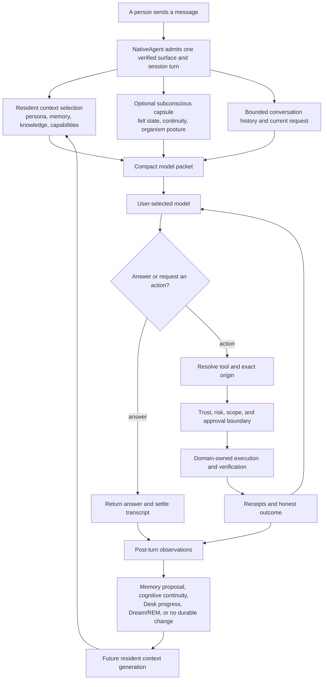
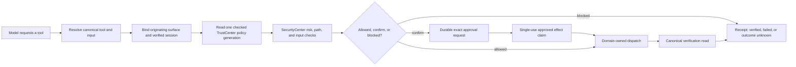
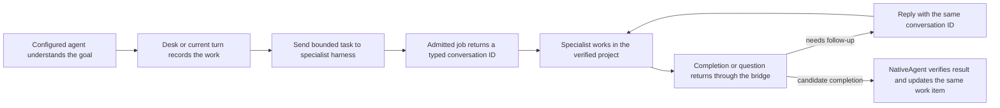

# NativeAgent Internal Workings

NativeAgent is designed as one persistent agent whose conversation, memory,
context, tools, inner continuity, projects, and safety boundaries cooperate
without collapsing into one giant prompt or one giant state store.

This guide connects the major internal lifecycles in one place. It is written
for people who want to understand the design and for configured agents or
development tools that need a reliable map before reading source.

For the millisecond-by-millisecond path of one message, start with
[Anatomy of a NativeAgent Turn](ANATOMY_OF_A_TURN.md). This guide begins with
that turn and follows its consequences into memory, action, growth,
delegation, and every supported conversation surface.

## The complete system in one flow



The model is important, but it is not the whole agent. NativeAgent owns the
continuity around the model call: what the model receives, what it may do,
which effects actually happened, what becomes durable, and what returns on a
future turn.

## What “Fluid Context” means across the system

In ordinary product language, the **Fluid Context system** is the complete
context-preparation design: relevant identity, memory, knowledge, history,
inner state, and capabilities arrive together as a compact working packet.

Inside the source, the ownership is deliberately more precise:

- **Fluid Context's `Context` owner** compiles immutable generations, keeps a
  bounded selection arena in RAM, ranks eligible atoms, and owns exact
  generation-scoped expansion.
- **Persona, MemoryV2, Desk, and Skills** remain canonical owners of their own
  durable material. Fluid Context circulates projections of them.
- **Conversation history** remains owned by the chat session store and is read
  through a separate bounded continuity path.
- **The subconscious capsule and Organism Kernel** remain optional advisory
  owners. Their frozen turn projection joins the packet without becoming a
  fact or persona store.
- **TurnPlan and the capability map** prepare useful tool groups without
  granting authority.
- **ChatOrchestration** freezes these sibling inputs and assembles the actual
  provider request.

This separation is what makes the whole system fluid without making it vague.
The context packet can change every turn, while the sources of identity,
memory, permission, and truth remain explicit.

## 1. Anatomy of resident context and a turn

Before a message arrives, NativeAgent has already compiled the reusable parts
of the configured agent's working context. The active generation's required
document mirrors, eligible atoms, selection index, and current projections are
kept in a bounded RAM arena.

When the message arrives, NativeAgent prepares several inputs in parallel:

1. the exact provider, model, reasoning, and surface route;
2. relevant atoms from the resident Fluid Context generation;
3. bounded recent and continuity-aware conversation history;
4. the optional frozen subconscious and organism projection; and
5. a compact plan for which tool groups are likely to matter.

The result is a small model packet rather than a dump of every file, memory,
tool, and session. Full skill bodies, files, web pages, connector results,
older transcript wording, and inactive tool schemas remain lazy until needed.

One immutable Fluid Context generation is leased for the complete provider and
tool loop. A source update in the middle of the turn cannot splice two context
generations together. A later turn receives the newer generation.

The resulting provider request is also arranged for economical prefix reuse:
stable persona, pins, and the current lazy-tool contract come before changing
memory, history, inner state, and the current request. Long tool loops reuse
one prepared turn context, pin the advertised text-compatible tool set and
turn clock, and append results instead of rebuilding earlier bytes. Supported
providers can therefore charge reusable input at their cached-token rate while
the current turn remains fresh. The exact prompt-cache/KV-cache distinction,
provider behavior, cache-break protections, and measured proof are documented
in [How prompt caching reduces token cost](ANATOMY_OF_A_TURN.md#how-prompt-caching-reduces-token-cost).

The optional subconscious capsule is compiled locally in Swift from the same
frozen turn epoch. It can carry a bounded felt fingerprint, relevant inner
view, continuity cue, organism body signal, or restrained voice echo. It does
not require another model call, grant authority, or turn feelings into facts.

Read the full path in [Anatomy of a NativeAgent Turn](ANATOMY_OF_A_TURN.md)
and the implementation map in
[Fluid Context as built](build_plans/fluid-context-as-built-map.md).

## 2. Anatomy of a memory

NativeAgent separates four things that many agent systems blur together:

| Kind of information | Canonical owner | Meaning |
|---|---|---|
| Persona | Persona documents | Who the configured agent is and how it should relate and speak |
| Durable memory | MemoryV2 SQLite | Reviewed or strongly supported facts and preferences that should survive |
| Conversation history | Chat session store | What was actually said, including wording that may never become memory |
| Inner state | CognitiveSubstrate and Organism Kernel | Bounded, decaying attention, feeling, continuity, and posture—not factual truth |

### How information enters MemoryV2

There are two normal entry paths:

1. **Deliberate memory:** the person or configured agent explicitly uses the
   canonical memory write path for something that should be retained.
2. **Observed candidate:** the post-turn promoter extracts a narrowly bounded
   candidate from user-authored content. Most inferred preferences, goals,
   relationship claims, and general observations remain proposals until
   reviewed. Only the deliberately narrow structured auto-save lane may bypass
   proposal review.

Every write path converges on the same store gates. In conceptual order:

```text
candidate
  -> text and durable-memory quality validation
  -> exact rejection/deletion tombstone check
  -> one local embedding when semantic comparison is needed
  -> semantic rejection/deletion tombstone check
  -> bounded SQLite transaction
  -> derived projections and invalidations
```

An approval or an old proposal does not bypass today's gates. Acceptance
revalidates the candidate at the canonical write boundary.

### What happens after a memory is accepted

MemoryV2 commits the record first. Derived owners then catch up:

- the Knowledge Graph indexes conservative entities and relationships derived
  from the canonical memory;
- the generated `USER.md` profile projects only eligible person-related facts
  for persona compilation;
- Spotlight receives the searchable local projection when enabled; and
- Fluid Context invalidates the affected memory projection and compiles a new
  generation.

These projections are not extra truth stores. A damaged Knowledge Graph or
stale context generation cannot overrule the canonical MemoryV2 record.

### How memory returns on a turn

Memory can return through three increasingly specific paths:

1. **Resident Fluid Context selection** supplies the memories and hints most
   relevant to the current message without a separate disk-wide recall pass.
2. **Memory and Knowledge Graph tools** perform a larger hybrid lexical and
   semantic search when the model needs deeper knowledge.
3. **Session search** retrieves exact historical wording from transcripts when
   the library does not contain it.

This creates a useful distinction: memory answers “what is durably known,”
while transcript search answers “what exactly was said.”

### Correction and forgetting

Deleting or rejecting a claim creates durable negative evidence so the same
claim cannot immediately re-enter through paraphrase. Corrections and
contradictions change lifecycle state rather than silently leaving two equally
active truths.

When canonical memory changes, MemoryV2-owned Knowledge Graph claims,
`USER.md`, Spotlight, and Fluid Context are reconciled. A deletion is therefore
not merely hidden from one screen; its derived circulation is withdrawn too.

Dreams, subconscious state, tool output, and the Knowledge Graph cannot write
around this lifecycle. They may produce observations or review candidates, but
MemoryV2 remains the durable fact owner.

## 3. Anatomy of a safe action

Text in a prompt never grants authority. A model can propose an action, but the
runtime decides whether the exact action may cross an effect boundary.



### The checks that stay in force

The exact route varies by tool, but the shared boundary preserves:

- the authenticated surface and verified conversation identity;
- the current checked TrustCenter policy generation;
- SecurityCenter's canonical risk class and protected floors;
- workspace, file, and sensitive-path containment;
- macOS consent and NativeAgent's per-capability Mac Integration settings;
- connector authentication and live account proof where applicable;
- Full Mac and autonomy scope without treating either as universal permission;
- approval requirements for protected effects; and
- domain-specific verification after dispatch.

Local Mac chat, iPhone, Telegram, Slack, bridges, Desk work, scheduled jobs,
and specialist returns do not receive alternate safety implementations.

### What an approval means

An approval is a durable answer to one bounded request. It is bound to the
action, input, originating surface, and verified session or remote identity.
After approval, the executor checks the current policy and payload again.

Approval-gated effects consume a durable single-use claim immediately before
dispatch. A changed input, stale approval, damaged approval store, or mismatched
origin fails closed. Approving one send or write does not create a general
permission to send or write later.

### Execution is not verification

A subprocess exit, MCP response, HTTP success, CloudKit write, or connector
acknowledgment is evidence about transport. It is not automatically proof that
the intended real-world state changed.

Each domain retains its own verification authority:

- GitHub rereads the relevant issue, pull request, review thread, or repository
  state;
- Desk checks its canonical item, execution, evidence, and settlement state;
- Mac Control observes its operation and any available postcondition;
- external sends use stable action identity, delivery receipts, and provider
  evidence without claiming the recipient saw the content; and
- iPhone actions wait for the Mac-owned terminal transaction rather than
  treating a transport write as completion.

### Crash and ambiguity behavior

If an irreversible effect may have crossed the boundary but the final receipt
was not durably settled, NativeAgent records an unknown or reconciliation-needed
outcome. It does not blindly replay the effect and risk sending, paying,
posting, or mutating twice.

Stable action identities, idempotency keys, effect claims, transaction
ledgers, and startup reconciliation allow safe operations to heal after a
restart. Unknown non-idempotent outcomes remain visible for verification or
human resolution.

That is why NativeAgent's definition of “done” is stronger than “the tool
returned without throwing.”

## 4. How a native agent grows without losing itself

NativeAgent uses different time scales for different kinds of continuity.
They cooperate, but none may silently promote itself into another.

| Time scale | Mechanism | What it may change |
|---|---|---|
| Current turn | Subconscious capsule and organism posture | Tone, attention, continuity, and bounded behavioral posture |
| Across conversations | Cognitive continuity and reviewed standing views | Decaying inner context and an explicitly reviewed durable view |
| Durable knowledge | MemoryV2 | Facts, preferences, corrections, and reviewed memory proposals |
| Daily consolidation | Dream | A diary-style synthesis of new experience and bounded felt context |
| Longer consolidation | REM | Review candidates for recurring growth lessons supported across experiences |
| Procedural growth | Skills and reviewed procedures | Reusable instructions, never permissions |

### Turn experience and transient inner state

Real chat, tool, provider, approval, device, lifecycle, and health events feed
the existing cognitive and somatic pathways. CognitiveSubstrate maintains
bounded activation, affect, mood, thought seeds, and standing views. The
Organism Kernel maintains bounded chemistry, body schema, prediction, field,
and posture.

These states decay, compact, and remain advisory. A difficult turn may make the
agent more careful on the next turn; it does not become a durable fact about
the person or rewrite the agent's persona.

Budgeted reflection can propose a standing view for review. Approved standing
views may influence the future capsule when relevant. Reflection does not write
schema truth, memory facts, or permissions.

### Dream and REM

When enabled, Dream reads newly eligible experience across chat surfaces plus
a bounded felt summary. It writes a diary-style synthesis rather than a factual
memory import.

REM later examines multiple dream entries for recurring, supported growth
themes. Survivors become reviewable proposals. Approval can append a bounded
lesson to the canonical growth persona and publish a small stable pin for
future turns; denial records a tombstone against that rejected formulation.

```text
new experience
  -> bounded cognitive and felt observations
  -> Dream synthesis
  -> recurring-evidence REM candidate
  -> human review
  -> approved persona growth and future-turn pin
```

One vivid day therefore cannot silently rewrite the agent. Growth requires
time, repeated evidence, the right target, and the appropriate review path.

### Memory and skill growth stay separate

Memory proposals become durable facts only through MemoryV2. Growth lessons
enter the persona only through the growth writer. Reusable procedures become
skills only through the Skills owner and remain guidance rather than
authority.

Organism reflexes are also candidate-first and review-gated. An approved
low-risk reflex can softly bias posture; it cannot dispatch tools or bypass
TrustCenter.

Evaluation and shadow-learning systems may measure whether a future adaptive
mechanism is safe. Observation alone does not grant production influence. A
new adaptive path needs explicit outcome evidence, holdout, drift detection,
privacy review, fallback, and rollback before it can affect live behavior.

### How growth returns to future turns

Approved growth re-enters through the existing context owners:

- persona growth and stable pins join the stable prompt prefix;
- MemoryV2 facts enter resident Fluid Context and deeper recall;
- reviewed standing views and felt continuity may enter the optional capsule;
- skills remain compact pointers until a relevant body is loaded; and
- organism state may change private posture without becoming prompt authority.

No separate “growth agent” is created. The same persistent agent receives the
reviewed consequences of its own history.

## 5. One persistent mind, specialist hands

NativeAgent is optimized to remain the organizing mind rather than pretending
its chat tool loop is the best harness for every large coding or research job.
It can delegate focused work to configured Codex, Claude Code, or OMP bridge
sessions while keeping the project, conversation, verification, and user
relationship in the NativeAgent runtime.



### Conversation continuity with a specialist

The first asynchronous message creates a real specialist conversation and
returns a typed conversation ID. A later `codex_message`, `claude_message`, or
`omp_message` carrying that ID resumes the exact existing Codex thread or
Claude/OMP session. Omitting it starts genuinely new work.

NativeAgent does not copy the specialist's entire transcript into MemoryV2,
Fluid Context, or the originating chat. The specialist harness retains its own
conversation history; NativeAgent retains a bounded reference, job state,
completion receipt, and the result needed by the organizing agent.

### Project and permission boundaries

Specialist work begins in the canonical NativeAgent workspace unless an
explicitly verified project is selected. Work outside that workspace requires
the configured Full Mac policy. Repository-aware delegation verifies that the
local checkout's Git remote matches the named repository before granting the
specialist repository context or network profile.

A delegated harness does not inherit new authority merely because the
configured agent requested work. Unattended clients refuse interactive
approval, dynamic client tools, and nested delegation paths they cannot safely
resolve.

### Results come back as evidence

A specialist's statement that work is complete is not automatic proof. The
NativeAgent turn or Desk item can require tests, Git state, artifacts, external
domain rereads, or another explicit verification method before closing.

Desk remains the canonical owner for large projects, dependencies, approvals,
progress, and terminal status. Specialist sessions are execution references
under that project—not competing project stores or extra personalities.

Temporary swarms follow the same principle. They fan out bounded reasoning or
inherited tool work, but do not become memory, persona, provider-policy, or
permission owners.

## 6. One agent across every surface

NativeAgent has several interfaces but one Mac-owned runtime.

| Surface | What it owns locally | What remains Mac-owned |
|---|---|---|
| Mac chat and detached windows | Draft and presentation state for the selected session | Provider execution, transcript, context, tools, trust, memory, and receipts |
| iPhone and iPad | Signed transport, local UI state, pending bubbles, and snapshot presentation | The agent, sessions, providers, policy, actions, and durable history |
| Telegram | Authenticated bot update, verified chat/user identity, and reply delivery | Shared chat orchestration, model route, tools, memory, and policy |
| Slack | Socket/history transport, allowlist and mention admission, and reply delivery | Shared chat orchestration, model route, tools, memory, and policy |
| Local bridges | Loopback transport, bearer authentication, and originating job identity | NativeAgent chat/tool policy and the specialist harness's own session history |

### Shared runtime, exact origins

All accepted conversation surfaces converge on the same ChatOrchestration,
Fluid Context, MemoryV2, tool dispatcher, TrustCenter, and receipt paths. This
is how the same configured agent can remember, continue, and act consistently
across devices and messaging systems.

The origin is never erased. Each turn retains its surface, verified session,
and available approval channel. Surface identity participates in tool
visibility, approval provenance, delivery, and action replay protection.

Provider and model choices may be configured independently per surface. The
runtime reads one checked routing snapshot before dispatch so a UI label,
Telegram command, or stale preference file cannot create a mixed provider/model
generation.

### The mobile companion

The iPhone/iPad app is a signed remote cockpit, not a second agent. It sends
HMAC-signed messages and actions through the selected Apple-native transport.
The Mac verifies the signature, binds the exact mobile session, runs the same
turn pipeline, and returns signed progress and result events.

Read-only screens consume bounded targeted snapshots. The phone does not own
MemoryV2, tool registration, approvals, provider credentials, or execution
truth. Remote actions use durable transaction identities and wait for Mac-owned
terminal state before showing completion.

### Messaging surfaces

Telegram and Slack accept only configured identities and channels. They share
the provider/context/tool policy after admission but retain their own transport
allowlists, mention rules, update deduplication, delivery receipts, and failure
recovery.

A message from a remote surface does not become a local Mac action merely by
claiming to be one in text. Verified origin and current policy stay attached
through the complete turn and tool loop.

### Realtime without a second runtime

Session, transcript, approval, inbox, Desk, provider, memory, and organism
changes publish targeted invalidations and snapshots. Slow integrity sweeps
repair missed events; they are not the normal UI refresh cadence.

This keeps surfaces current without creating a polling agent, mobile brain, or
second state owner.

## 7. Why the owners remain separate

The system works because coordination is shared while authority is not.

| Question | Owner that can answer it |
|---|---|
| Who is the agent? | Canonical persona documents |
| What is durably known? | MemoryV2 |
| What exactly was said? | Chat transcript store |
| What is relevant right now? | Fluid Context selection over eligible projections |
| What is currently felt or anticipated? | CognitiveSubstrate and Organism Kernel |
| Which model should this surface use? | ProviderRouting checked snapshot |
| May this exact action run? | TrustCenter, SecurityCenter, and domain gates |
| Did the real effect happen? | The canonical external or local domain owner |
| What project work remains? | Desk |
| What did a specialist do? | Its conversation/job receipt plus independent verification |

Fluid Context does not become memory. The capsule does not become persona.
Approvals do not become permissions. Receipts do not become external truth.
The iPhone does not become a second agent. A specialist does not become the
organizing mind.

Those boundaries let NativeAgent combine rich continuity with rollback,
inspection, and honest failure behavior.

## Reading path

For a human overview, read in this order:

1. [This connected internal-workings guide](INTERNAL_WORKINGS.md)
2. [Anatomy of a NativeAgent Turn](ANATOMY_OF_A_TURN.md)
3. [Capabilities](CAPABILITIES.md)
4. [User and Agent Guide](USER_GUIDE.md)

For source ownership and deeper engineering detail:

- [Architecture Blueprint](ARCHITECTURE_BLUEPRINT.md)
- [Fluid Context as built](build_plans/fluid-context-as-built-map.md)
- [Organism Kernel](ORGANISM.md)
- [Cognition Wiring](COGNITION_WIRING.md)
- [Automated Systems](AUTOMATED_SYSTEMS.md)
- [Mobile Companion](mobile_companion.md)
- [Threat Model](threat-model.md)
- [Data Bounds](data-bounds.md)

The source and Architecture Blueprint win if an old build plan or historical
handoff disagrees with current behavior.
