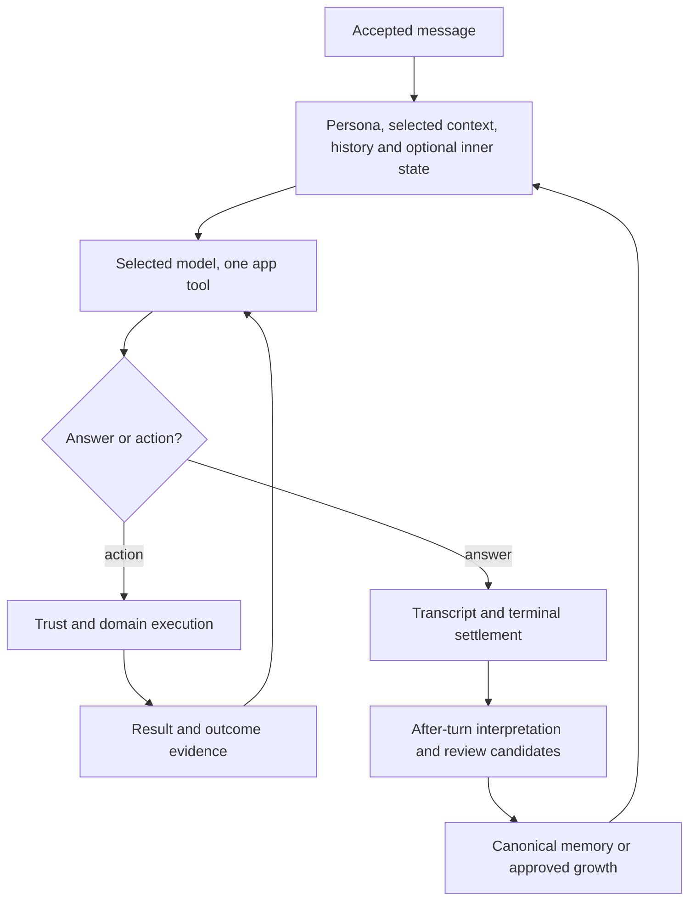

# NativeAgent Internal Workings

NativeAgent is one Mac-owned runtime. `NativeAgentEngine` in
`EngineRuntime` assembles its clients, stores and app ports;
`ChatTurnRuntime` owns the turn engine. Conversation surfaces share that
core while retaining their own admission and delivery boundaries.

Agent reaches the system through one always-on `app` tool. `app {}` is
home—where they left off. Pages, home items, discovery, actions and scripts
reach the rest of the app. [Tool loading](TOOL_LOADING.md) defines that contract.

## The complete system in one flow

```mermaid
flowchart TD
    A["Accepted message"] --> B["Persona, selected context, history and optional inner state"]
    B --> C["Selected model, one app tool"]
    C --> D{"Answer or action?"}
    D -- "action" --> E["Trust and domain execution"]
    E --> F["Result and outcome evidence"]
    F --> C
    D -- "answer" --> G["Transcript and terminal settlement"]
    G --> H["After-turn interpretation and review candidates"]
    H --> I["Canonical memory or approved growth"]
    I --> B
```

## What “Fluid Context” means across the system

The Context module compiles and selects derived material; it does not own the
underlying facts. `NativeContextFlowRuntime` coordinates publication and turn
preparation. An immutable generation and bounded RAM arena provide reusable
entries and required-document mirrors.

Persona, MemoryV2, Desk and skills retain their own authority. Conversation
history is read separately from the transcript store. The optional cognitive
capsule joins these inputs as advisory state. The turn engine assembles the
provider request from them.

## 1. Anatomy of resident context and a turn

A turn combines a checked provider route, selected Context atoms, bounded
history, any useful plan hint and optional inner state. The prepared Context
turn leases one generation through the model/action loop; a later source
change belongs to a later generation.

Stable persona material precedes changing turn context in the system segments.
The `app` schema stays fixed while action discovery travels in results.
Documents and skill bodies are retrieved when needed. There is no tool preload
or session tool-loading lifecycle.

See [Anatomy of a Turn](ANATOMY_OF_A_TURN.md) for admission, streaming,
dispatch and settlement, including
[prompt caching](ANATOMY_OF_A_TURN.md#how-prompt-caching-reduces-token-cost).

## 2. Anatomy of a memory

| Material | Owner |
|---|---|
| Identity and voice | Canonical persona documents |
| Durable facts, corrections and proposals | MemoryV2 |
| Exact conversation wording | Chat transcripts |
| Selected working context | Context projections |
| Felt state and posture | CognitiveSubstrate and Organism |

### How information enters MemoryV2

An explicit `memory.commit` action reaches the canonical memory write path.
After a conversation, the adaptive promoter can also stage candidates.

`memory.commit` accepts optional `provenance` (`verified|told|inferred`)
and `provenance_by` (≤40 characters; letters, digits, spaces and `. - '`).
Recall returns a display `provenance` field; absent provenance stays absent.

The current after-turn path uses one model interpretation for facts, moments
and semantic appraisal. `MindMemoryManager` uses the memory route when
configured, otherwise the chat route. It is not an on-device-only extraction
lane. Peer conversations identify their speaker so a peer's words are not
mistaken for facts about the human.

Candidate facts are checked for confidence, shape, duplication and rejection
history, then staged for human review. The moments lane stages at most one
candidate from an exchange, subject to its switch, daily cap, salience,
grounding and a verified quote. A staged moment is still a proposal.

Moment extraction treats transcripts as untrusted data. Independent staging
validation requires first-person narrative and rejects role labels,
agent-directed instructions, tool identifiers, markup, links and oversized
content.

### When the work happens

For a completed answer, the assistant row becomes durable before its deferred
memory-promotion ticket starts. The reply path does not await that work.
A process exit can interrupt unfinished promotion without losing the already
written transcript.

### Acceptance, correction and recall

Proposal acceptance rechecks memory quality and rejection tombstones.
A replacement proposal carries the target's fingerprint; acceptance and
demotion of the old fact occur together or the proposal remains pending.

Superseding a pending proposal is distinct from rejecting it: supersession
records the replacement relationship without creating a rejection tombstone.
That permits a correction without treating its similar wording as forbidden.

Canonical changes trigger derived-memory refreshes. The generated `USER.md`
is a projection of eligible active memories, not a place to repair facts by
hand; the generator excludes Workshop execution records by source.
Knowledge Graph and Context projections do not replace MemoryV2's authority.

Relevant memories can arrive through resident selection. `memory.recall`
supports deeper retrieval, while `chat.search` and `chat.message` recover
conversation wording. Skills provide guidance through `skill.read` and can
carry optional admitted scripts. `skill.save`, `skill.enable`, `skill.run`,
`skill.resume` and `skill.rollback` manage those procedures; see the
[manifest spec](skill_manifest_spec.md). Skills are not factual memory and
grant no new authority.

Source owners: `MemoryV2/MemoryV2+AdaptivePromoter.swift`,
`MemoryV2+Proposals.swift`, `MemoryV2+UserMDGen.swift`,
`MemoryV2+Recall.swift` and `ChatTurnRuntime/MindMemoryManager.swift`.
See [Memory system map](MEMORY_SYSTEM_MAP.md) for the store-level map.

## 3. Anatomy of a safe action

An `app` request resolves to an action in `AppActionRegistry.swift`.
Folded actions re-enter the dispatcher under their underlying identity so
saved Trust decisions and domain checks still bind. A page read or discovery
result grants no authority.

Full Mac gives Agent autonomy, including actions otherwise marked User's.
Checked policy, explicit blocks, actual macOS grants and connector
authentication still govern execution. macOS privacy permission resets always
ask the owner. Peer-steered turns additionally ask User for deletes and
irreversible acts, sends in their name, persona writes and protected approvals.
Authenticated turns from agents enabled in Trust → Connected agents carry
User's authority and skip extra peer approvals; ordinary Trust and domain checks
still apply.

Approval-gated effects consume a durable single-use claim immediately before
dispatch. Replay validates the exact tool, input, surface and payload digest;
unavailable authority fails closed. An already-spent effect with an unknown
outcome is not automatically replayed.

Approval and execution are separate states. An approval authorizes its bound
request; it does not establish that the effect succeeded. Dispatch results and
the domain's verification evidence determine what can be reported. An
uncertain send or interrupted effect must not be presented as confirmed.

Source owners: `TrustCenter/SecurityCenter.swift`,
`TrustCenter/PeerTurnEffectPolicy.swift`,
`ApprovalTransactions/ApprovalTransactionCoordinator.swift` and
`AppToolRuntime/AppToolExecutor+AppDoor.swift`.

## 4. How a native agent grows without losing itself

Different kinds of growth return through different owners:

| Mechanism | Durable destination or influence |
|---|---|
| After-turn memory candidates | Reviewed MemoryV2 records |
| Cognitive capsule and organism posture | Optional advisory input to a turn |
| Dream synthesis | Dream diary |
| REM consolidation | Reviewable lessons targeting `GROWTH.md` |
| Skills | Reusable procedural guidance and optional admitted scripts |
| Authored tools | Active registry entries exposed as `authored.<id>` |

Dream and REM use `DreamREMCycle`. REM stages growth proposals;
`ApprovalTransactionCoordinator` applies an approved lesson through
`REMGrowthWriter` and its prompt pin. A diary entry alone does not approve a
persona change.

Tool authoring follows `tool.propose` → `tool.approve` →
`authored.<id>`, subject to current authority. MCP tools are generated as
`mcp.<server>.<tool>` from the mounted server's live list. Neither route adds
a second model-facing tool schema.

Cognitive state remains advisory; Context is derived. Neither replaces persona,
memory or permission stores. See [Cognition Wiring](COGNITION_WIRING.md),
[Organism](ORGANISM.md) and [Automated Systems](AUTOMATED_SYSTEMS.md).

## 5. One persistent mind, specialist hands

The `codex.message` and `omp.message` actions and home's `claude.say` connect
Agent to configured specialist harnesses. The returned conversation identity
supports a contextual follow-up using `conversation_mode=resume` and
`conversation_id`; unrelated work uses a new conversation.

`BuilderWorktreeAllocator` binds a builder conversation to its checkout.
Resuming that conversation reuses the assignment rather than silently
switching projects. The bridge retains job and completion evidence; a
specialist's answer does not by itself verify the work.

Desk tracks work and execution references. Delegation does not replace the
canonical persona, MemoryV2 or Trust owners.

Source owners: `ChatToolRuntime/SwiftToolDispatcher+CodexBridgeTools.swift`,
`SwiftToolDispatcher+ClaudeBridgeTools.swift`,
`SwiftToolDispatcher+OMPBridgeTools.swift` and `BuilderWorktreeAllocator.swift`.
See [Agent conversations](agent-communication.md).

## 6. One agent across every surface

The Mac app hosts the engine. Mac chat and detached windows present its
sessions; Telegram, Slack and local bridges adapt their incoming messages and
outgoing replies to the shared conversation runtime. Their origin and
conversation identities remain attached to the work.

The mobile companion uses DeviceSync. The Mac verifies signed incoming
commands, executes them and publishes progress, results and snapshots.
Processed-message IDs and completion markers prevent already-executed
commands from being dispatched again after a restart. The phone does not
become the execution or memory owner.

Source owners: `EngineRuntime/NativeAgentEngine.swift`,
`DeviceSync/MacSyncEngine+Inbox.swift` and
`DeviceSync/State/ICloudSyncStatePaths.swift`.
See [Mobile companion](mobile_companion.md).

## 7. Why the owners remain separate

| Question | Authority |
|---|---|
| Who is the agent? | Persona |
| What is durably known? | MemoryV2 |
| What was said? | Transcript store |
| What matters to this turn? | Context selection and turn assembly |
| Which provider/model runs? | ProviderRouting |
| May this action run? | TrustCenter and the domain's gates |
| Did it take effect? | The executing domain's evidence |
| What work remains? | Desk |
| What runs in the background? | BackgroundLoopsManager and its registered owners |

One shared engine coordinates these owners. It does not turn a projection,
approval or transport acknowledgment into a different kind of truth.

## Reading path

Source paths above are under `Modules/NativeAgentCore/Sources/`.

- [Anatomy of a Turn](ANATOMY_OF_A_TURN.md)
- [Tool loading](TOOL_LOADING.md)
- [Memory system map](MEMORY_SYSTEM_MAP.md)
- [Automated systems](AUTOMATED_SYSTEMS.md)
- [Architecture Blueprint](ARCHITECTURE_BLUEPRINT.md)
